https://chatgpt.com/s/t_6a7e8b4937e881918a8e921e3cec75f6

I would make the ASC ↔ Tauri boundary **event-oriented, but not event-only**.

The important distinction is:

* **commands / requests**: Tauri asks ASC to do something and expects a result;  
* **events**: ASC reports state changes, lifecycle changes, logs, filesystem changes, agent activity;  
* **channels/streams**: ASC emits high-volume ordered data such as process output, graph chunks, indexing progress;  
* **shared files / indexed data**: large payloads should not cross IPC repeatedly.

This maps well onto Tauri 2's own communication model: its event system is intended for small messages, while channels are specifically intended for ordered streaming and higher-throughput cases. ([Tauri](https://v2.tauri.app/develop/calling-frontend/?utm_source=chatgpt.com))

I would therefore keep **ASC as the semantic/control plane**, Rust/Tauri as a **thin transport/security adapter**, and SolidJS as the **reactive visualization layer**.

# **1. Proposed architecture**

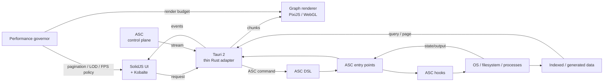

The crucial point is that **Tauri does not become another control plane**.

It should mostly do:

      Web UI  
        ↕  
    Tauri IPC  
        ↕  
       ASC  
        ↕  
       OS

rather than:

        Web UI  
          ↕  
    Tauri business logic  
          ↕  
         ASC  
          ↕  
         OS

That preserves the architectural decision you already made.

# **2. Four communication categories**

I would define the protocol conceptually as four primitives.

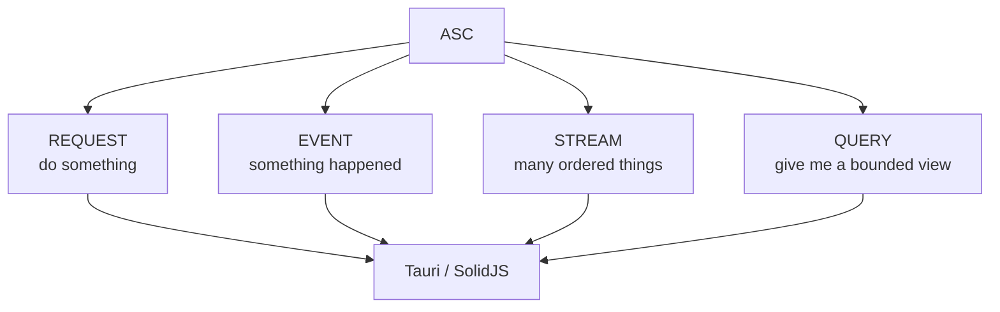

### **Request**

execute  
inspect  
create  
update  
delete  
start  
stop

Example:

    request:  
      dsl: "recognize-text(a-1)"

Response:

    result:  
      status: success  
      entity: ...

### **Event**

entity.changed  
process.started  
process.finished  
thread.created  
thread.failed  
agent.state.changed  
index.updated

Events should remain small.

### **Stream**

For things such as:

stdout  
stderr  
agent tokens  
large graph construction  
indexing progress  
file scanning

Tauri channels are particularly appropriate here; Tauri explicitly positions channels as the mechanism for ordered streaming data. ([Tauri](https://v2.tauri.app/develop/calling-frontend/?utm_source=chatgpt.com))

### **Query**

This is important for your graph system.

Do **not** stream your entire graph into SolidJS.

Instead:

    query:  
      entity = X  
      relation = Y  
      page = 3  
      limit = 250  
      projection = graph

and return a bounded representation.

# **3. The protocol should be semantic, not UI-specific**

I would avoid events such as:

sidebar.refresh  
graph.reload  
task-list-updated

Those are UI concepts.

ASC should emit things like:

entity.changed  
relation.created  
relation.removed  
thread.started  
thread.output  
thread.finished

Then SolidJS decides what those events mean visually.

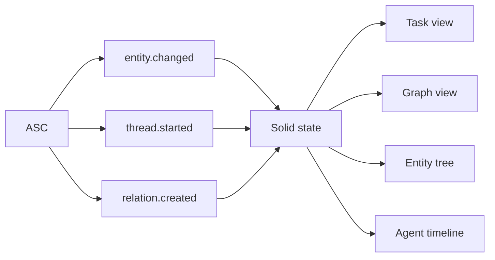

This is particularly important because you already want **task-oriented and knowledge-oriented views over the same underlying structures**.

# **4. Suggested event envelope**

Keep the actual protocol extremely small.

Something conceptually like:

    type AscEvent<T = unknown> = {  
      id: string  
      type: string  
      time: number

      subject?: string  
      object?: string

      data?: T  
    }

For example:

    {  
      "id": "evt-...",  
      "type": "entity.changed",  
      "time": 1780000000000,  
      "subject": "research--monnin",  
      "data": {  
        "fields": ["status", "updated"]  
      }  
    }

Or:

    {  
      "id": "evt-...",  
      "type": "thread.output",  
      "time": 1780000000123,  
      "subject": "thread--ocr-42",  
      "data": {  
        "stream": "stdout",  
        "chunk": "..."  
      }  
    }

I would **not** make this a huge formal protocol yet.

ASC's YAML/DSL/entity vocabulary is already doing much of the semantic work.

The transport envelope should remain boring.

# **5. Tauri should have a very thin Rust layer**

Something approximately like:

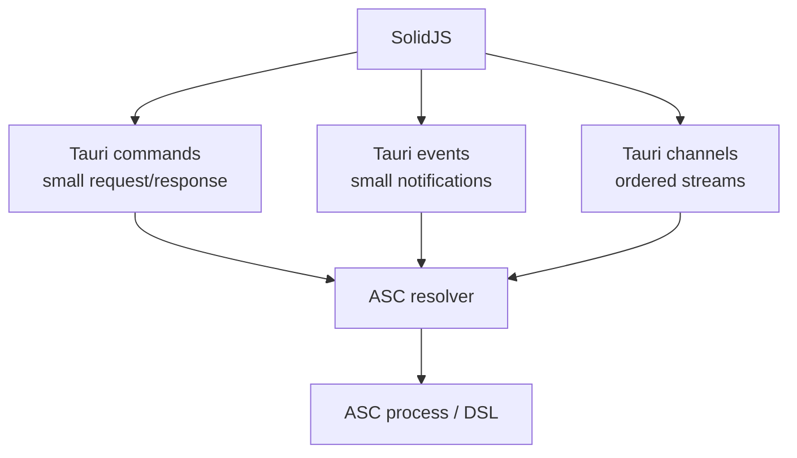

Tauri already supports frontend/backend events and channels, and its event API supports webview-specific listeners as well as global events. ([Tauri](https://v2.tauri.app/reference/javascript/api/namespacewebview/?utm_source=chatgpt.com))

The Rust layer should therefore ideally **not know what a "research note" or "task" is**.

It knows things such as:

execute ASC expression  
query ASC entity  
subscribe ASC event stream  
read ASC artifact  
write ASC artifact

That keeps your semantic model in ASC.

# **6. SolidJS is a particularly good fit for this**

Solid's reactivity is useful here because a graph containing thousands of entities shouldn't cause the entire UI component tree to be reconstructed whenever one entity changes.

Solid's model is explicitly based around updating the reactive portions rather than rerunning the whole component tree. ([SolidJS Documentation](https://docs.solidjs.com/concepts/components/basics?utm_source=chatgpt.com))

I would exploit that aggressively:

    ASC event  
      ↓  
    normalized state update  
      ↓  
    only affected reactive consumers update

rather than:

    ASC event  
      ↓  
    fetch everything  
      ↓  
    replace graph  
      ↓  
    re-render application

# **7. Kobalte should stay strictly at the UI boundary**

I would use Kobalte for things like:

Dialog  
Popover  
Tabs  
Menu  
Select  
Tooltip  
Accordion  
Command palette  
Focus management  
Keyboard navigation

but **not** for the graph itself.

Your visual system can remain essentially:

    SolidJS  
      +  
    Kobalte  
      +  
    your CSS  
      +  
    PixiJS where necessary

Solid itself supports ordinary `class`/`style` bindings, so there is no architectural reason to introduce a CSS framework merely to use Solid. ([SolidJS Documentation](https://docs.solidjs.com/guides/styling-your-components?utm_source=chatgpt.com))

# **8. `create-tauri-app` should be the baseline, not a heavyweight starter**

For the foundation, I would favor:

    create-tauri-app  
        ↓  
    Tauri 2  
        +  
    SolidJS  
        +  
    TypeScript

and then add Kobalte yourself.

The current Solid tooling supports TypeScript directly through its scaffolding ecosystem. ([SolidJS Documentation](https://docs.solidjs.com/quick-start?utm_source=chatgpt.com))

I would **not** make a starter such as `tauri-start-solid`, Quantum, etc. part of the architectural dependency chain unless it provides something you actually need.

For your project, a deliberately boring foundation is preferable:

Tauri  
Solid  
TypeScript  
Kobalte  
PixiJS  
custom CSS

The less framework-specific scaffolding you inherit, the easier it is to preserve your ASC architecture.

# **9. PixiJS should be an optional rendering tier**

Your idea of PixiJS is sound.

PixiJS 8 has GPU-accelerated WebGL/WebGL2 and WebGPU renderers; its WebGL renderer is currently the recommended production renderer, while WebGPU remains less mature. ([PixiJS](https://pixijs.com/8.x/guides/components/renderers?utm_source=chatgpt.com))

So I would design the graph renderer as:

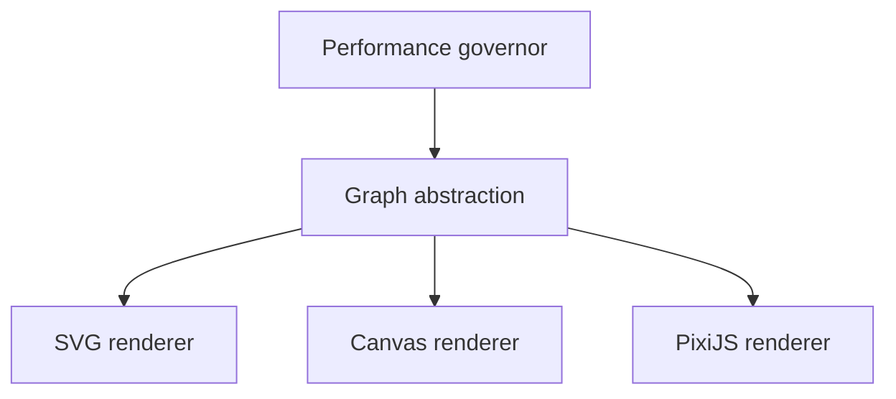

Not:

Graph = PixiJS

but:

> **Graph = semantic scene; PixiJS = one rendering backend.**

This gives you a fallback if a seven-year-old laptop turns out to have a terrible GPU/WebView combination.

# **10. Don't draw every relation as a DOM element**

For your envisioned graphs:

    entities  
        ├── relations  
        ├── dependencies  
        ├── references  
        └── ancestry

I would strongly favor:

DOM  
→ controls / labels / panels / interaction

PixiJS  
→ nodes / edges / curves / animation

rather than:

DOM  
→ every node  
→ every Bezier path  
→ every label  
→ every relation

For example:

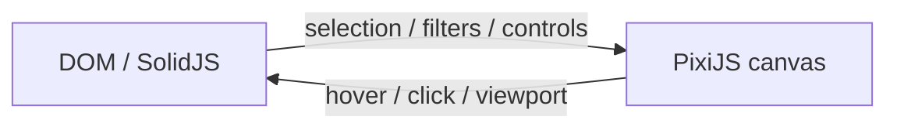

PixiJS's rendering architecture is specifically designed around GPU-accelerated scene rendering. ([PixiJS](https://pixijs.com/8.x/guides/components/renderers?utm_source=chatgpt.com))

# **11. Your performance system should have three independent budgets**

This is where I think your idea becomes particularly strong.

Don't make performance equal to "FPS".

Track:

CPU budget  
GPU/render budget  
data budget

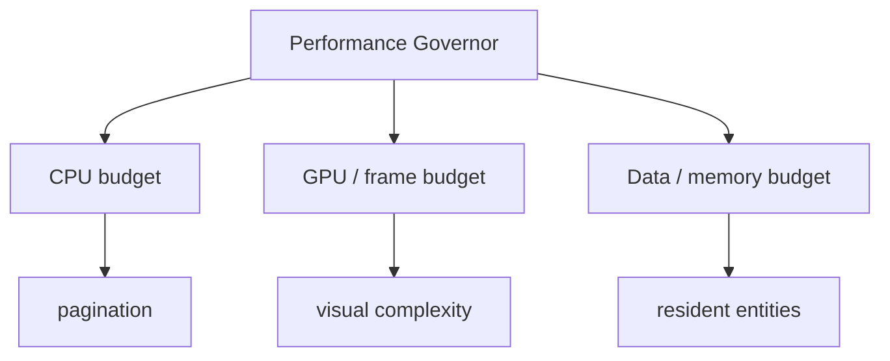

Because you can have:

60 FPS + 2 GB graph state

and still have a bad application.

Or:

30 FPS + tiny memory footprint

and have a perfectly usable low-end mode.

# **12. Initialization micro-benchmark**

I would keep this **very short**.

Something like:

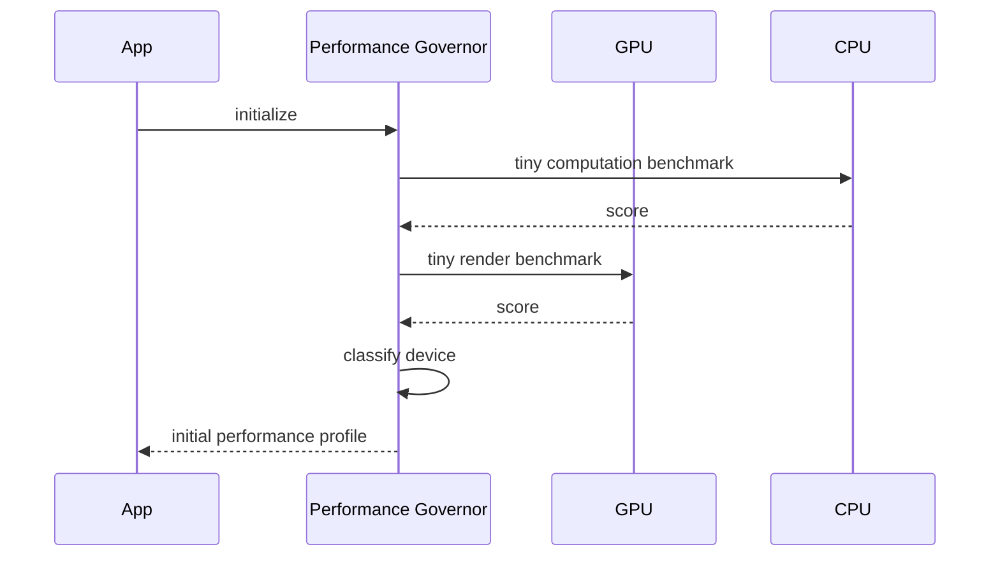

Not a benchmark suite.

Something like:

CPU micro-test  
GPU micro-test  
canvas allocation  
small Pixi scene  
timing variance

perhaps **100–300 ms total**, with an absolute upper bound.

The result becomes:

    type PerformanceProfile =  
      | "minimal"  
      | "low"  
      | "balanced"  
      | "high"  
      | "maximum"

But internally I would actually prefer **continuous scores** over discrete hardware categories.

    cpuScore = 0.37  
    gpuScore = 0.62  
    memoryScore = 0.51

Then derive budgets.

# **13. Runtime monitoring should override the initial estimate**

This is the critical part.

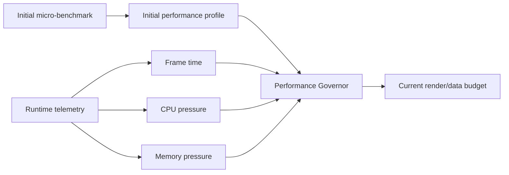

The initialization benchmark is only a prior.

Runtime behavior is the evidence.

# **14. I would use hysteresis**

Otherwise you will get:

    250 nodes  
      ↓  
    slow  
      ↓  
    200 nodes  
      ↓  
    fast  
      ↓  
    250 nodes  
      ↓  
    slow  
      ↓  
    200 nodes

and the UI will oscillate.

Instead:

    performance degradation  
            ↓  
    reduce budget quickly

    performance recovery  
            ↓  
    increase budget slowly

For example:

    downgrade:  
      after 3–5 bad frames

    upgrade:  
      after 1–3 seconds of sustained headroom

This is essentially a control system.

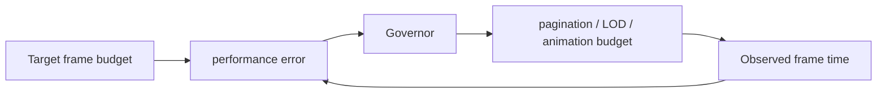

For your project, this is conceptually much more interesting than merely "detect GPU and select low/medium/high".

# **15. Your 1-second transition target should itself be adaptive**

I would define:

transition_budget <= 750ms

rather than:

transition_duration = 500ms

Then:

high performance  
→ 400–700 ms

balanced  
→ 250–500 ms

low  
→ 150–300 ms

minimal  
→ no animation / near-instant

This preserves the feeling you want without making animation itself a performance requirement.

# **16. Pagination should become a dynamic resource**

This is perhaps the most important consequence.

Instead of:

const PAGE_SIZE = 100;

have:

const pageSize = performanceGovernor.graphPageSize();

and potentially:

nodes/page  
relations/page  
labels/page  
animation complexity  
Bezier subdivision  
edge visibility

all controlled by the same governor.

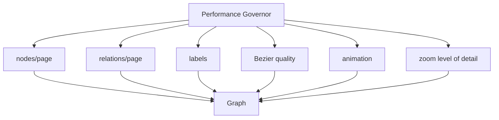

This is stronger than simply "pagination".

It becomes a **Level-of-Detail system for information**.

# **17. The graph should therefore have multiple representations**

For example:

zoomed out:

    ●──●──●──●  
            
      ●─────●

zoomed in:

    entity A  
      │  
      ├── relation  
      │  
      ├── relation  
      │  
      └── relation

The underlying ASC graph is the same.

The renderer chooses:

LOD 0 → aggregate  
LOD 1 → nodes + major relations  
LOD 2 → individual relations  
LOD 3 → labels  
LOD 4 → metadata

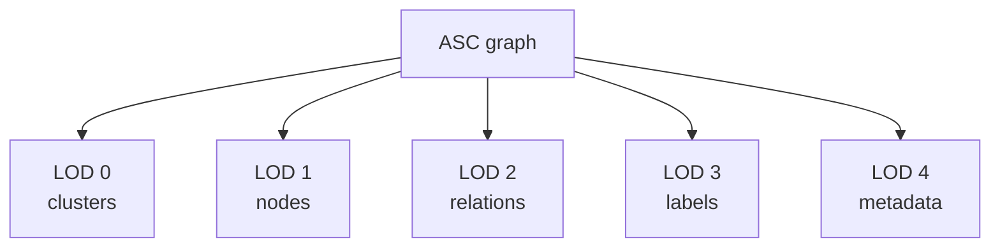

This will matter enormously more than micro-optimizing Solid components.

# **18. Avoid sending the graph through IPC every frame**

This should be a hard rule.

Bad:

    Pixi frame  
        ↓  
    Tauri  
        ↓  
    ASC  
        ↓  
    JSON  
        ↓  
    Tauri  
        ↓  
    Pixi

Good:

           ASC  
            ↓  
     paged graph data  
            ↓  
    Tauri channel / query  
            ↓  
    frontend graph store  
            ↓  
        Pixi scene  
            ↓  
    local animation loop

Once the graph is loaded, panning/zooming should be almost entirely frontend-side.

ASC should only be involved when semantic state changes.

# **19. Separate semantic updates from visual updates**

For example:

ASC:  
relation.created

doesn't mean:

Pixi:  
redraw everything

Instead:

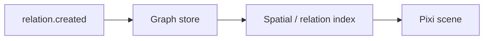

Only the affected scene objects should be changed.

PixiJS itself has made substantial performance improvements in v8 by reducing unnecessary rendering work, including large improvements for unchanged scenes. ([PixiJS](https://pixijs.com/blog/pixi-v8-launches?utm_source=chatgpt.com))

# **20. Recommended dependency stack**

I would keep the first version extremely small:

    Tauri 2  
    ├── Rust  
    ├── SolidJS  
    ├── TypeScript  
    ├── Kobalte  
    ├── PixiJS  
    └── your CSS

Then only add things when a concrete requirement appears:

TanStack Virtual  
    → enormous DOM lists

Comlink / Worker helpers  
    → CPU-heavy frontend calculations

Zustand-like store  
    → probably unnecessary initially

RxJS  
    → probably unnecessary initially

D3  
    → only for algorithms/layouts, not necessarily rendering

Web Workers  
    → graph layout / indexing / parsing

Arrow / binary formats  
    → if graph payloads become genuinely large

I would **not install these all up front**.

Solid's own fine-grained reactivity plus a small application store is enough to start. ([SolidJS Documentation](https://docs.solidjs.com/concepts/components/basics?utm_source=chatgpt.com))

# **21. One architectural dependency I would seriously consider: Web Workers**

Not for ASC communication.

For **frontend computation**.

For example:

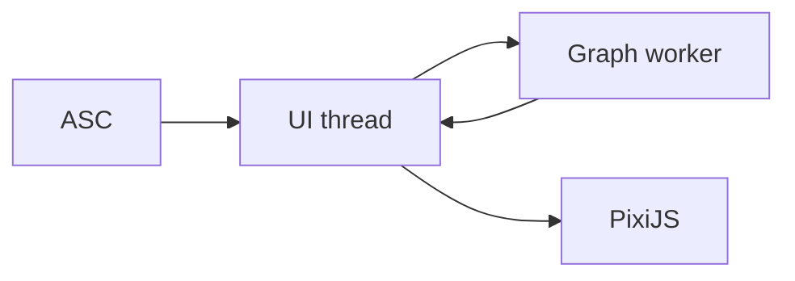

The worker could eventually handle:

graph layout  
Bezier control-point calculation  
spatial indexing  
clustering  
LOD preparation  
large relationship transformations

while the main thread remains responsible for:

SolidJS  
input  
animation  
PixiJS rendering

That is likely more valuable on a seven-year-old CPU than trying to squeeze every last millisecond out of the UI framework.

# **22. I would make performance itself an ASC-visible entity**

This fits your architecture surprisingly well.

Eventually:

hardware  
software  
performance-profile  
display  
gpu  
cpu  
memory

can themselves be ASC entities.

Then:

    machine  
    ├── cpu  
    ├── gpu  
    ├── memory  
    ├── display  
    └── performance-profile

The Tauri frontend merely queries the profile.

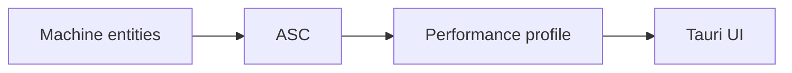

The initialization micro-benchmark can then update the runtime profile.

That keeps even your performance adaptation conceptually consistent with ASC rather than creating a parallel "magic frontend subsystem".

# **23. The resulting protocol in one diagram**

This is the version I would put into the architecture notes:

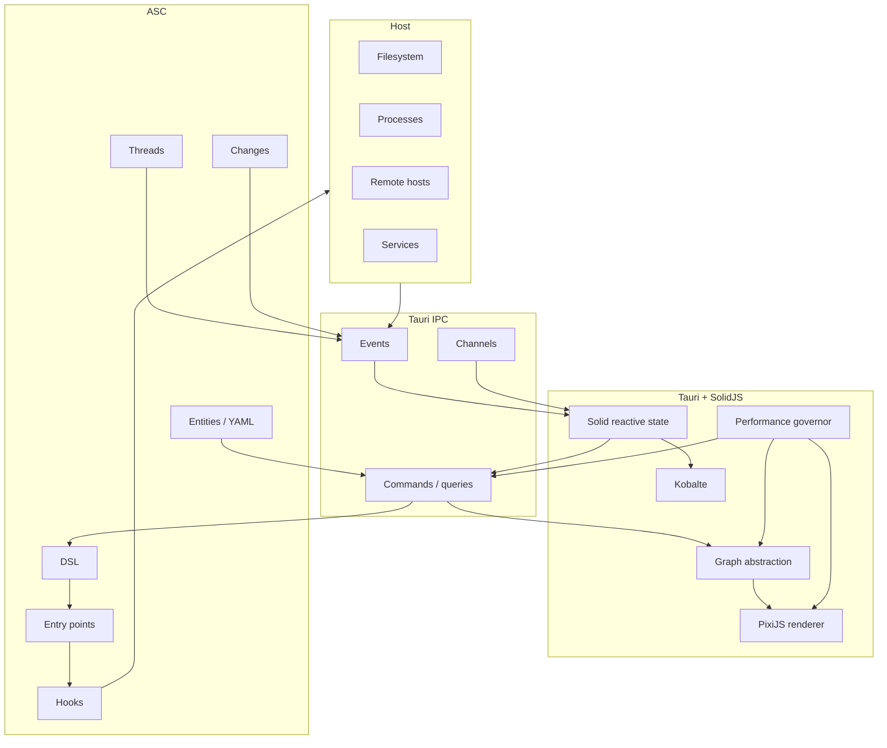

The fundamental rule becomes:

> **ASC owns meaning and execution. Tauri owns transport and native integration. SolidJS owns reactive presentation. PixiJS owns high-density rendering. The performance governor owns presentation budgets.**

That division is clean enough to survive the project's eventual growth into the second brain and agent controller.

## **Performance model**

The whole thing can then be summarized as:

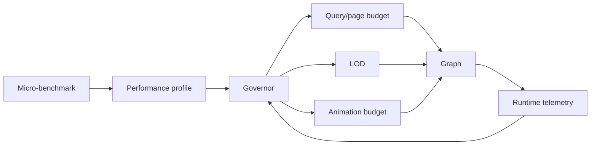

This is essentially **Progressive Enhancement applied to information density rather than merely browser features**:

    same semantic content  
            ↓  
    different computational representation  
            ↓  
    according to available budget

A powerful machine gets:

500 relations  
Bezier curves  
labels  
smooth 600ms transitions

An old laptop gets:

80 relations  
simplified curves  
selective labels  
250ms transitions

But both are looking at **the same ASC structure**.

That is the right performance philosophy for this project.

**Confidence: 0.96.**
