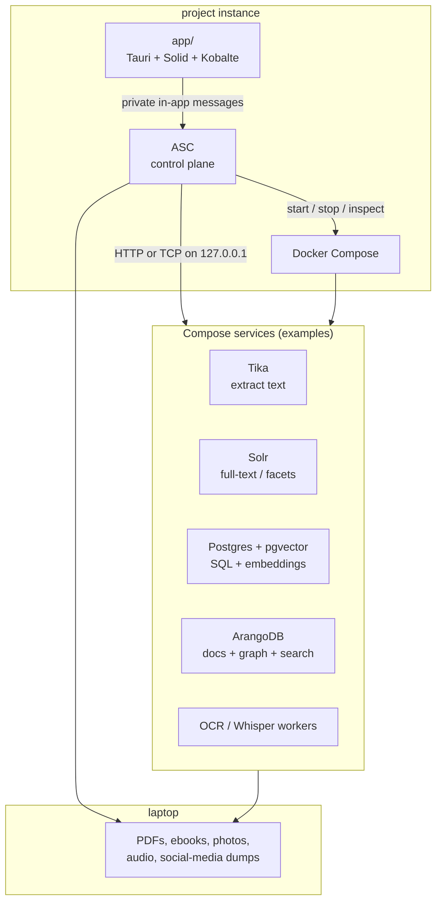
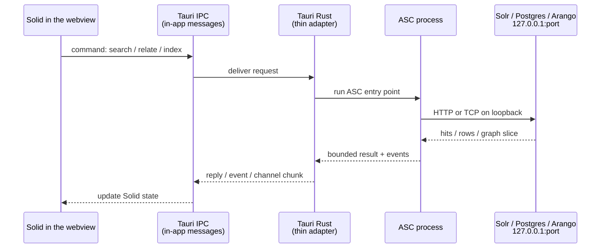
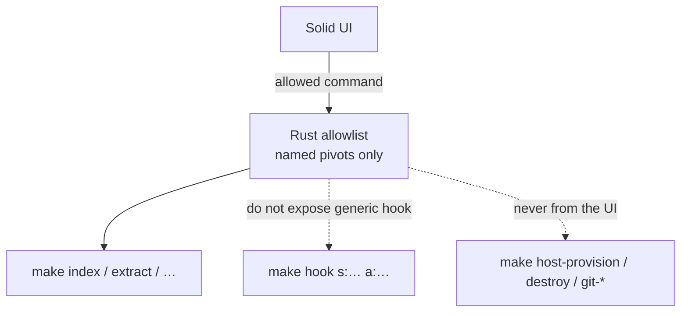
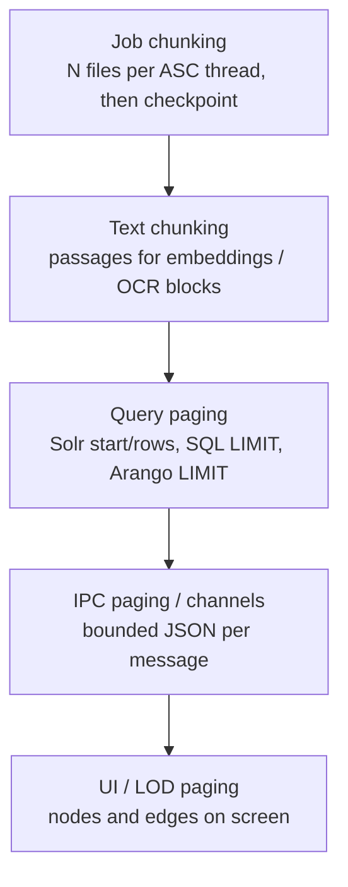
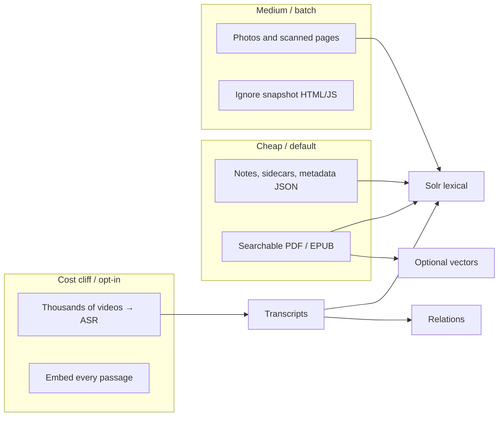
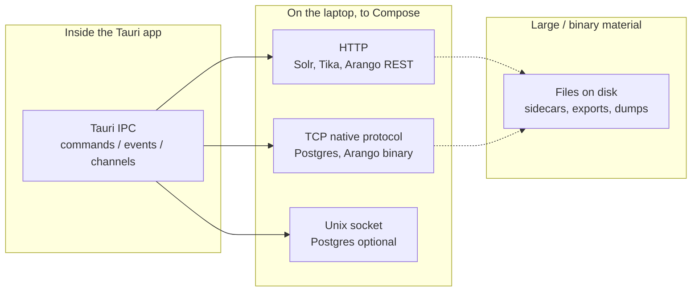
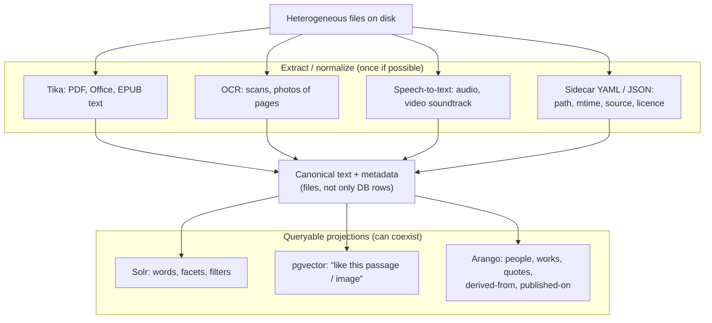
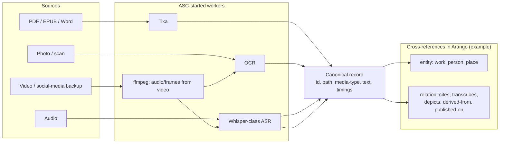

# Local dev stack architecture

- **Date:** 2026-08-17
- **Updated:** 2026-08-17 — make entry points, paging/chunking, corpus-scale performance
- **Status:** idea / architecture note
- **Scope:** instance layout, how the Tauri UI reaches local services, which ASC surfaces the UI may call, paging, and how those services should index heterogeneous archives
- **Related:** [14-proposed-architecture.md](14-proposed-architecture.md) (ASC as control plane, Tauri as thin adapter)

## Goal

Build a **multimodal search and cross-referencing** system over extremely mixed local material:

- PDFs, ebooks, Word / ODT
- research papers, dissertations, notes
- photos and scans that need OCR
- audio that needs transcription
- social-media backups: images, captions, videos that may need transcription too

The desktop UI lives in `app/` (Tauri + Solid). Databases and extractors run in Docker Compose. ASC starts, stops, and chooses those services. The UI does not become a second control plane.

## Instance layout

Same pattern as a typical Compose-based project: one **instance** repo, several **pieces**.

| Path | Role |
|------|------|
| `$PROJECT_DOCROOT` | Project **instance** (dev stack) |
| `$PROJECT_DOCROOT/app` | Tauri UI piece (host app, not a Compose service) |
| Compose files at instance root (later) | Databases, Tika, Solr, Arango, workers |
| ASC | Control plane: packages, remote host, compose lifecycle, indexing jobs |

Tauri stays a **host process**. It is not a container. App containers on a Docker network talk to `solr:8983`. Tauri cannot: it talks like `curl` or `psql` on the laptop, through **published localhost ports**.



---

## What “the webview talks Tauri IPC” means

A Tauri app is **two programs that look like one window**:

1. **The webview** — SolidJS runs here. It is a browser engine (WebKitGTK on Debian) with no normal address bar. It can draw UI. By default it must **not** freely call random URLs or open database sockets.
2. **The Rust side** — the native half of the same app. It can start processes, read files (if allowed), and open network connections.

**IPC** = *inter-process communication*: two programs on the **same computer** exchanging messages, without going through the public internet.

Everyday picture:

- The webview is the **front desk**.
- The Rust side is the **back office**.
- IPC is the **internal window** between them (a slip of paper: “search for this author”, “indexing job 42 advanced 10%”).
- Solr / Postgres / Arango are **other shops on the same street** (`127.0.0.1` + a port). The front desk does not walk into the street. The back office (or ASC, which the back office calls) does.

Tauri names three IPC shapes (see [Calling the frontend](https://v2.tauri.app/develop/calling-frontend/)):

| Tauri IPC | Use |
|-----------|-----|
| **Command** | Front desk asks one question, waits for one answer (“run this ASC expression”, “page 3 of neighbours of entity X”). |
| **Event** | Small notice either way (“entity.changed”, “thread.finished”). |
| **Channel** | Ordered stream (index progress, log chunks, graph pages). |

None of those is HTTP to Solr. They never leave the app until Rust or ASC opens a **localhost socket**.



**Who opens the localhost sockets?**

| Option | What happens | Verdict for this project |
|--------|----------------|--------------------------|
| **A. Webview `fetch('http://127.0.0.1:8983')`** | The browser engine talks to Solr itself. CORS, CSP, credentials in JS, bypasses ASC. | Avoid as the main path. |
| **B. Rust opens the sockets** | A Tauri command uses `reqwest` / `sqlx` / an Arango client. Solid never sees the port. | Fine technically. Duplicates ASC if Rust grows “what a research note is”. |
| **C. ASC opens the sockets** | Rust only asks ASC. ASC owns compose, jobs, and DB clients (curl, psql, workers). | **Preferred.** Matches [14-proposed-architecture.md](14-proposed-architecture.md). |
| **B+C** | Rust is a pipe: spawn/call ASC, forward streams. ASC still owns Solr/Postgres/Arango. | What “thin adapter” actually looks like. |

So: **yes, engines are reached with HTTP/TCP on custom localhost ports** — but **the webview is not the client**. ASC (invoked through Tauri IPC) is.

Publish Compose ports on loopback only, e.g. `127.0.0.1:8983:8983`, never `0.0.0.0`.

---

## Can Tauri call any ASC `make` entry point?

**Mechanically: yes. Architecturally: no.**

ASC turns `$subject/$action.sh` scripts into Make shortcuts. After `make init`, `data/asc/generated.mk` lists them (on the order of **~100 targets** on a current core instance: `host-provision`, `git-untrack`, `test-core-*`, `setup` / `destroy`, …). Each target is:

```text
make <entry> [args…]
  → asc/make/call_wrap.make.sh <real-script> <entry> [args…]
  → bootstrap the instance
  → run the script
```

`call_wrap.make.sh` only prevents args that **collide with other Make target names**. It is not an authorization layer. ASC’s own docs: there is **no built-in authz**; filesystem permissions are the control plane.

Tauri can spawn that from Rust (`Command::new("make")` with `current_dir = $PROJECT_DOCROOT`). The webview must **not** pass an arbitrary string into `make`.



| Surface | What it is | From the Tauri UI |
|---------|------------|-------------------|
| **Projet-specific pivots** | Thin names such as `index`, `extract`, `recognize`, `relate`, `research`, `publish`, `run-agent`, `inspect-agent`, `stop-agent` | **Yes**, one Tauri command per pivot (or a small enum). Args are structured, not a shell line. |
| **`make hook s:… a:…`** | Generic “run any subject/action” | **No.** That is a root shell over the instance. |
| **Host / git / destroy / upgrade** | Real machine and git effects | **No** from the webview. Terminal / ASC CLI only (or a separate, confirm-heavy “operator” mode later). |
| **Calling the `.sh` file directly** | Same bootstrap, skips Make | Same allowlist. Prefer this for long jobs if Make’s arg escaping gets in the way; still not a reason to expose every script. |

Rust’s job is a **capability map**: UI says `index.start` with `{ roots: ["shelf"], profile: "lexical" }`; Rust runs the one allowed entry point; stdout/stderr go to a Tauri **channel**; ASC’s logged-thread wrappers remain the process supervisor.

Do **not** spawn `make` on every keystroke. Bootstrap + fork is CPU/process-bound (see ASC performance notes). Interactive search should hit a **warm query path** (Compose engine, or a long-lived helper). `make` is for **jobs** (index a tree, OCR a batch, compose up).

---

## Dynamic paging and chunking

“Page the response” is several different cuts. Mixing them is how UIs freeze.



| Layer | Unit | Who owns it | Notes |
|-------|------|-------------|--------|
| **Job chunking** | Files or bytes per worker | ASC threads | Resume after crash. Do not start Whisper on 2k videos as one process. |
| **Text chunking** | Passages (e.g. 500–2000 tokens) | Indexer | For pgvector / citations. Independent of UI page size. |
| **Query paging** | Hits / vertices / edges | Solr, Postgres, Arango | **Always** `limit` + cursor or offset. Default something like 50–250, matching the performance governor. |
| **IPC paging** | JSON messages | Tauri command / channel | One command return should stay small (hundreds of KB, not tens of MB). Stream further pages on the channel. |
| **Render paging / LOD** | Scene objects | Solid + graph renderer | Pan/zoom must not re-query ASC every frame. |

**Cursor vs offset**

| Style | Advantages | Inconvenients |
|-------|------------|----------------|
| **Offset** (`start=500&rows=50`, `LIMIT 50 OFFSET 500`) | Simple; Solr-native | Deep pages get slower; inserts shift rows |
| **Keyset / cursor** (`id > last`, Arango cursor) | Stable, cheap next-page | No cheap “jump to page 47”; must keep a cursor |

For graphs, page **neighbours of one node** (or a viewport query), never “all edges”. The [proposed architecture](14-proposed-architecture.md) already forbids shipping the whole graph over IPC.

**Make vs paging:** `make research` should *start* or *query*, not print 10k hits to stdout for Rust to parse. Bounded JSON (or a sidecar file + a short pointer) is the contract. High-volume progress uses **channels** (`index.progress`, `thread.output` chunks).

---

## Performance trade-offs

### Measured shape of a real mixed archive (anonymized)

Four local trees of the kind this stack must handle, counted as **orders of magnitude** (no paths, no titles):

| Corpus class | Scale | What is actually there | Indexing implication |
|--------------|-------|------------------------|----------------------|
| **Social-media export** | ~25 GB, ~28k files | Mostly photos (~17k); **~2.3k videos ≈ 21 GB**; compressed metadata sidecars | Metadata + selected images first. ASR on all video is the cost cliff (days on a laptop CPU). |
| **Bibliographic-manager storage** | ~17 GB, ~19k files | **~1.6k PDFs ≈ 7 GB** plus **~8k webpage-snapshot files** (HTML/JS/CSS) and the manager’s own full-text cache | Index PDFs/EPUBs. **Skip snapshot chrome and cache files** or you pollute Solr with boilerplate JS. |
| **Ebook / PDF shelf** | ~18 GB, ~1.9k files | Almost all PDF/EPUB; mean file ~10 MB | Best Tika + Solr target. Large PDFs: extract once, chunk for vectors. |
| **Mixed research / course tree** | ~24 GB, ~6.7k files | Thousands of notes (markdown), hundreds of PDFs, **tens of AV files ≈ 10 GB** (including multi-GB videos) | Notes are cheap to index. Treat big AV as opt-in jobs, not a default crawl. |

**Together:** on the order of **~85 GB and ~55k files**, of which **~4k PDFs** and **~2.3k videos**. The originals must stay on disk. The UI and IPC only ever see **pages** of extracted text, hits, and relations.



### Trade-offs

| Choice | Faster / cheaper | Slower / heavier | Verdict |
|--------|------------------|------------------|---------|
| **`make` per UI search** | Simple wiring | Pays ASC bootstrap + process spawn every time | Jobs only. Warm engine for search. |
| **Long-lived query helper** | Interactive latency | Another daemon to supervise | Worth it once search is used like a desktop app. |
| **Solr lexical first** | Usable keyword UI on thousands of PDFs | Weak paraphrase / “same idea” | Default. |
| **Embed everything** | Good semantic recall | Model + GPU/CPU; re-embed on model change | Chunk *selected* corpora, not the social-media photo dump. |
| **ASR on every video** | Full-text over talks and stories | ~20 GB+ decode; Whisper-class wall time dominates the project | Queue, sample, or “transcribe this item”. |
| **OCR every photo** | Text in scans and slides | Thousands of images; errorful text in Solr | Gate on “document-like” images, not every social thumbnail. |
| **Fan-out to Solr + pgvector + Arango** | Compare engines; right tool per question | Triple write amplification and sync | Extract **once**; projections can lag. |
| **Offset paging** | Easy | Deep offsets | Fine for UI pages of 50–250. |
| **Dump graph to the webview** | One request | Multi-second IPC, GB RAM, dropped frames | Forbidden. Query + LOD. |
| **Index bibliographic snapshots** | More files in the index | Noise, duplicates, JS | Exclude by type. |

**Rule of thumb:** extraction and ASR are **offline budgets**. Search and graph navigation are **online budgets**. Do not couple them in one `make` that blocks the window.

---

## Protocols (how bits move)

These are different layers. Mixing them up causes the “can Solid just HTTP to Arango?” confusion.



| Protocol | Typical use here | Advantages | Inconvenients |
|----------|------------------|------------|----------------|
| **Tauri IPC** | UI ↔ Rust only | No CORS; capabilities; events + streams; UI never holds DB passwords | Not a way to talk to Solr. Rust/ASC must sit in the middle. Payload size: keep messages small, point at files for big blobs. |
| **HTTP on 127.0.0.1** | Solr, Tika `/tika`, Arango REST, some worker APIs | Easy to inspect (`curl`); language-agnostic; good for extractors and search APIs | Chatty for bulk graphs; JSON cost; must not bind on all interfaces; auth still matters even on localhost. |
| **TCP native protocol** | Postgres (and pgvector), Arango’s binary protocol | Fast, typed, transactions, prepared statements | Needs a real client (not `fetch`); version coupling; worse to debug than `curl`. |
| **Unix socket** | Postgres alternative to TCP | Slightly faster; not a TCP port to mis-publish | Awkward from some containers; other OSes differ; still a host-local secret. |
| **Files / directories** | Originals, OCR text sidecars, embeddings dumps, static export for a public host | Right place for tens of GB of PDFs and video; ASC already thinks in paths | Not a query engine; need indexes *about* the files, not instead of them. |
| **Docker DNS only** | Container-to-container (`tika:9998`) | No host ports | Tauri cannot use this unless it is in the Compose network (it should not be). |

**Rule:** bulky media stays on disk. Indexes store **pointers + extracted text + embeddings + relations**. The UI queries a **page** of those, then asks to open a file if needed.

---

## Indexes and engines (what each is good at)

Do not pick one database to be “the brain”. Heterogeneous archives need **extraction**, **lexical search**, **semantic similarity**, and **explicit relations**. Those are different jobs. Compose makes it cheap to run several and **compare**.



### Apache Tika

Extracts text and metadata from many office/ebook/PDF types. It is **not** a search engine.

| | |
|--|--|
| **Advantages** | One HTTP service for dozens of formats; battle-tested; easy Compose service. |
| **Inconvenients** | Quality varies (scanned PDFs need OCR, not Tika alone); not relations; not vectors. |

### Solr (lexical / faceted index)

Inverted index: words, phrases, filters (author, year, extension, “has OCR”).

| | |
|--|--|
| **Advantages** | Excellent “find this exact name / quote”; facets; familiar from other Compose stacks; fine for 10⁵–10⁷ docs on a laptop if the schema is sober. |
| **Inconvenients** | Weak as a *graph* of ideas; classic Solr is not the best place for embeddings (possible, not its centre); another JVM to feed and backup. |

### Postgres + pgvector (relational + semantic)

SQL for structured facts; `vector` columns for “passages close to this query embedding”.

| | |
|--|--|
| **Advantages** | Transactions; joins (document ↔ citation ↔ file path); one engine you can dump; vectors for paraphrase / multilingual-ish search; fits “compare implementations”. |
| **Inconvenients** | You must chunk text and run an embedding model (CPU/GPU cost, model choice is a lock-in); not a first-class graph traversal; full-text in Postgres is usually poorer than Solr for rich facets. |

### ArangoDB (multi-model)

Documents + graph + its own search. Natural home for **cross-references**: work → cites → work, photo → depicts → place, video → transcribes-to → text → quotes → dissertation.

| | |
|--|--|
| **Advantages** | One place for “this scan is of that PDF page”, “this audio is a talk about that paper”, multimodal *relations* without bolting three query languages by hand; AQL traversals. |
| **Inconvenients** | Heavier ops story than Postgres; another query language; search is good, not always Solr-class; easy to over-model and freeze a bad ontology. |

### Combining them (recommended stance)

| Strategy | Advantages | Inconvenients |
|----------|------------|----------------|
| **Solr only** | Fast to a usable keyword UI | No decent “same idea, different words”; no rich graph |
| **pgvector only** | Similarity + SQL | Bad keyword UX; weak citation graphs |
| **Arango only** | Relations shine | Extraction still needed; lexical search may disappoint; all eggs in one vendor |
| **Extract once, fan-out** | Tika/OCR/ASR write canonical text; Solr + pgvector + Arango are *projections*; ASC can A/B which engine answers a query | More Compose services; must keep projections in sync; do not index everything unbounded |

Fan-out is the one that matches “test, compare, and combine”.

---

## Heterogeneous data: one pipeline, many media

Cross-referencing only works if every medium becomes **addressable text + typed links**, while the original file stays the source of truth.



| Medium | Extract | Search / xref notes |
|--------|---------|---------------------|
| **Searchable PDF, EPUB, Word** | Tika | Solr for quotes; chunk for vectors; graph: bibliographic relations if you encode them. |
| **Scanned PDF / photo of a page** | OCR (then same as text) | OCR errors poison Solr and embeddings; keep confidence; link image region → text block if possible. |
| **Audio** | Transcription + timestamps | Search the transcript; graph: “talks-about”; do not dump raw WAV into Solr. |
| **Video / social-media backup** | `ffmpeg` audio → ASR; optional keyframes → OCR/captions | Heavy. Budget it. Store platform metadata (caption, date, URL) as first-class, not only pixels. |
| **Public static export** | Subset of canonical records → files | Same ASC `publish` path; no live Solr on the public host unless you later choose that. |

**Sobriety:** indexing everything (every story, every duplicate backup, every snapshot JS file) is a product decision, not a default. ASC should make **not indexing** as easy as indexing.

---

## What the UI is allowed to do

Solid / Kobalte / later Pixi:

- send **commands** (search, open entity, start OCR job, stop job) on the **allowlisted** pivots;
- listen for **events** (job progress, new relation);
- render a **page** of hits or a **LOD** graph slice.

Solid must not:

- hold Solr/Arango admin passwords;
- stream the whole graph over IPC;
- call Compose HTTP as if it were a website backend;
- invoke arbitrary `make` targets.

That is the same split as the proposed architecture: **ASC owns meaning and execution; Tauri owns transport and the window; Solid owns presentation.**

---

## Open choices (not decided here)

- Exact Compose profiles (`solr`, `pgvector`, `arango`, `extractors`) and port map.
- Which embedding model, and whether it runs in Compose or on the host GPU.
- Whether Arango is the *system of record* for relations, with Solr/pgvector as derived indexes, or the reverse.
- How social-media exports are ingested (folder convention vs a dedicated importer).
- Whether interactive search uses a long-lived helper or Compose HTTP via ASC, once `make` is reserved for jobs.

Those can stay experiments behind ASC entry points (`index`, `extract`, `recognize`, `relate`, `research`) without changing the IPC vs localhost rule.
