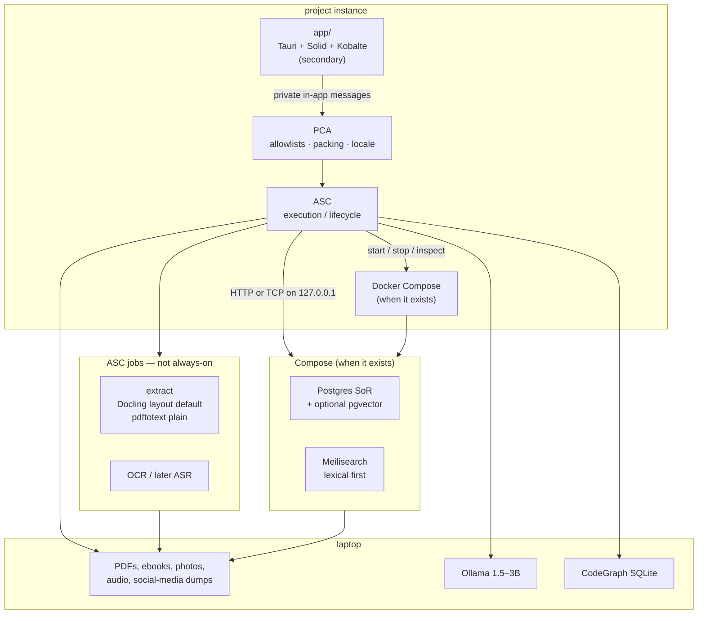
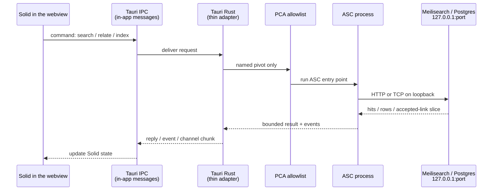
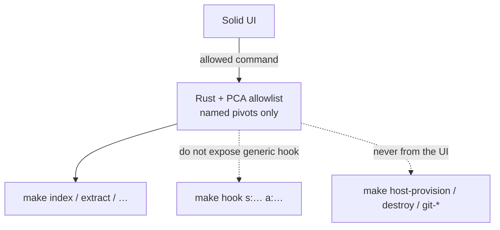
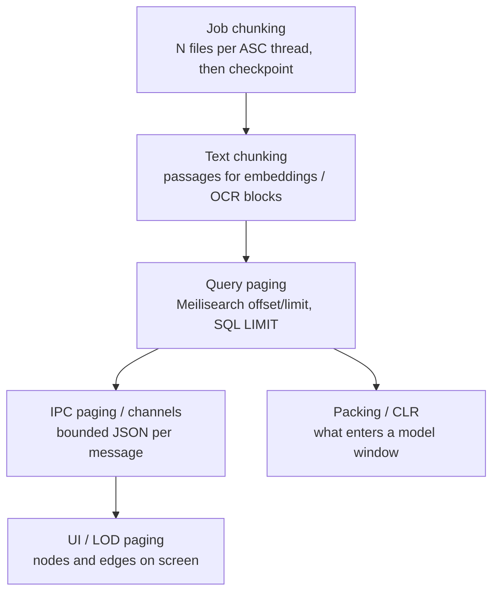
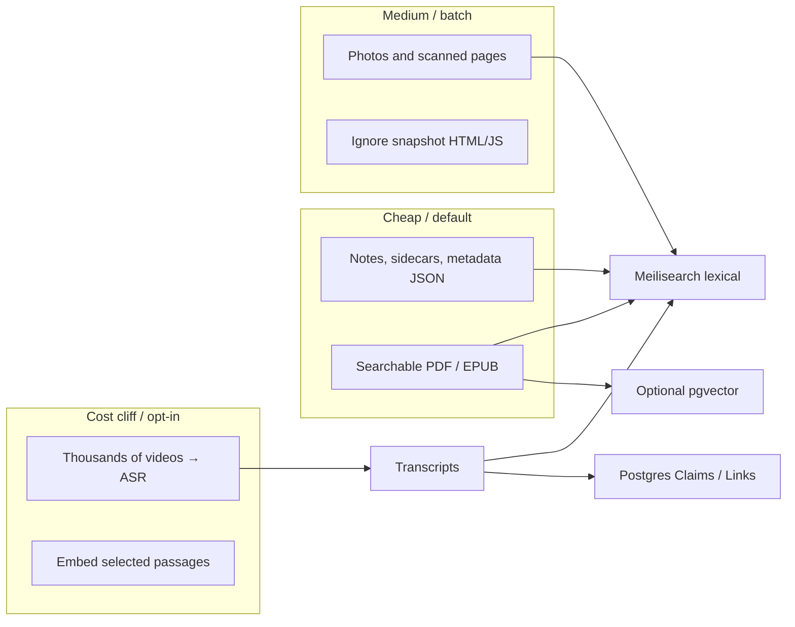
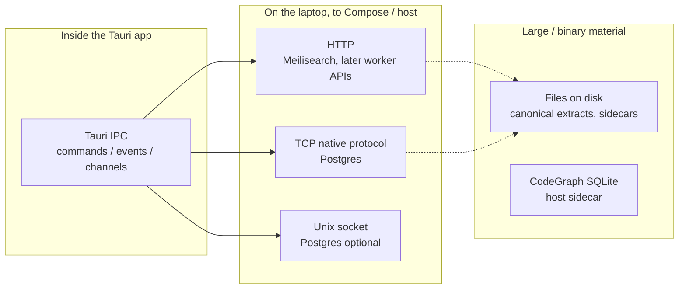
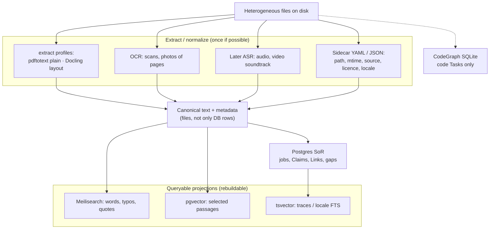
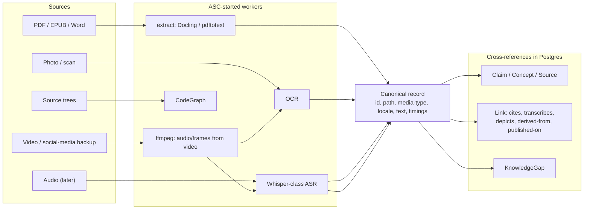

# Local dev stack architecture

- **Date:** 2026-08-17
- **Updated:** 2026-08-30 — align with revival v5 (Postgres SoR, Meilisearch first, PCA, staged Compose) and v3 extract profiles (Docling default, no Tika identity)
- **Status:** idea / architecture note
- **Scope:** instance layout, how the Tauri UI reaches local services, which ASC surfaces the UI may call, paging, and how those services should index heterogeneous archives
- **Related:** [14-proposed-architecture.md](14-proposed-architecture.md) (Tauri as thin adapter; IPC primitives); [Projet Complexe 2026 Revival (v5)](../../../../../asc/data/ideas/2026/08/Projet%20Complexe%202026%20Revival%20(v5)%20-%20ASC,%20Projet%20Complexe%20and%20Projet%20Complexe%20ASC.md) (meaning vs execution, lexical-first, three graphs); [Revival v3](../../../../../asc/data/ideas/2026/08/Projet%20Complexe%202026%20Revival%20(v3)%20-%20ASC,%20Projet%20Complexe%20and%20Projet%20Complexe%20ASC.md) (`extract` profiles: Docling default)

Revival v5 references this note for the UI path and does not duplicate it. This file keeps the IPC / localhost / paging / corpus-budget story. Engine *identity* now follows v3/v5: Solr, Arango, and always-on Tika in the 2026-08-17 draft were Compose *examples*, not the live brain. Extract profiles stay as v3 wrote them: **Docling on CPU** is the default layout Implementation.

## Goal

Build a **multimodal search and cross-referencing** environment over mixed local material, on **modest hardware**, without a vendor as the brain:

- PDFs, ebooks, Word / ODT
- research papers, dissertations, notes
- photos and scans that need OCR (gated, not every thumbnail)
- later: audio / video that need transcription (opt-in jobs)
- social-media backups: images, captions, videos
- **French, English, and Portuguese** as first-class on extract / index / pack / `publish`

**Curation** (accept / contradict / gap) is the knowledge act. Programming assistance is a worker, not the institution. A local agent uses the **same named pivots** a human uses from the terminal.

The desktop UI lives in `app/` (Tauri + Solid) when it exists. It is **secondary**: stage 1 may be terminal-only. Postgres and Meilisearch run in Docker Compose **when they exist**. Docling / OCR / ASR are **jobs**, not an always-on extractor JVM. ASC starts, stops, and chooses those services. **Projet Complexe ASC (PCA)** is the allowlist, packing, locale, and router policy. The UI does not become a second control plane.

## Three projects on one laptop

Same cut as the instance README and v5. Collapsing it is how Solr leaked into the UI.

```text
Projet Complexe          →  meaning, tasks, knowledge, research, agents, desktop UI
        ↓
Projet Complexe ASC      →  domain-specific pivots, compositions, integrations
        ↓
ASC                      →  generic computational vocabulary (names, pivots, execution)
```

| Project | Owns | Does not own |
|---------|------|----------------|
| **Projet Complexe** | Claims, Links, KnowledgeGaps, coordinates, two orientations | Compose lifecycle, DB clients, arbitrary `make` |
| **PCA** | Allowlists, packing recipe, locale Requirements, router policy, killswitch | A second ASC; MCP as vocabulary |
| **ASC** | Entry points, hooks, process/compose lifecycle, localhost sockets to engines | What a Claim means; the webview |

**CLI = GUI.** Anything the window can cause remains reproducible from `$PROJECT_DOCROOT`.

## Instance layout

Same pattern as a typical Compose-based project: one **instance** repo, several **pieces**. Compose is **craft**, not a religion (v5 §6.1: stage 1 may wait for Compose and for the Tauri window).

| Path | Role |
|------|------|
| `$PROJECT_DOCROOT` | Project **instance** (dev stack) |
| `$PROJECT_DOCROOT/app` | Tauri UI piece (host app, not a Compose service) — may wait |
| PCA under the instance (`scripts/asc/extend/…`) | Domain pivots, YAML `able`, packing, router |
| Compose files at instance root (later) | Postgres, Meilisearch; optional pgvector in Postgres |
| ASC jobs (not always-on) | `extract` profiles: Docling (layout default), pdftotext (plain), OCR, later ASR |
| ASC | Control plane: packages, remote host, compose lifecycle, indexing jobs |
| Host processes (not Compose) | Ollama (tiny local models); Cursor CLI wrap; **CodeGraph SQLite sidecar** |

Tauri stays a **host process**. It is not a container. App containers on a Docker network talk to `meilisearch:7700` or `postgres:5432`. Tauri cannot: it talks like `curl` or `psql` on the laptop, through **published localhost ports**. CodeGraph is a **sidecar on the host** (SQLite). Compose does not host it.



**Illich / Monnin test:** you can stop Ollama, unplug a later Tiiny, or skip Compose, and still `extract` from the terminal. If the UI *assumes* Solr (or Meilisearch) is up, that engine has become an attachment. Inquire before adding.

---

## What “the webview talks Tauri IPC” means

A Tauri app is **two programs that look like one window**:

1. **The webview** — SolidJS runs here. It is a browser engine (WebKitGTK on Debian) with no normal address bar. It can draw UI. By default it must **not** freely call random URLs or open database sockets.
2. **The Rust side** — the native half of the same app. It can start processes, read files (if allowed), and open network connections.

**IPC** = *inter-process communication*: two programs on the **same computer** exchanging messages, without going through the public internet.

Everyday picture:

- The webview is the **front desk**.
- The Rust side is the **back office**.
- IPC is the **internal window** between them (a slip of paper: “search for this author”, “indexing job 42 advanced 10%”).
- Meilisearch / Postgres are **other shops on the same street** (`127.0.0.1` + a port). The front desk does not walk into the street. The back office (or ASC, which the back office calls) does.

Tauri names three IPC shapes (see [Calling the frontend](https://v2.tauri.app/develop/calling-frontend/)):

| Tauri IPC | Use |
|-----------|-----|
| **Command** | Front desk asks one question, waits for one answer (“run this ASC expression”, “page 3 of neighbours of entity X”). |
| **Event** | Small notice either way (“entity.changed”, “thread.finished”). |
| **Channel** | Ordered stream (index progress, log chunks, graph pages). |

None of those is HTTP to Meilisearch. They never leave the app until Rust or ASC opens a **localhost socket**.



**Who opens the localhost sockets?**

| Option | What happens | Verdict for this project |
|--------|----------------|--------------------------|
| **A. Webview `fetch('http://127.0.0.1:7700')`** | The browser engine talks to Meilisearch itself. CORS, CSP, credentials in JS, bypasses ASC. | Avoid as the main path. |
| **B. Rust opens the sockets** | A Tauri command uses `reqwest` / `sqlx`. Solid never sees the port. | Fine technically. Duplicates ASC if Rust grows “what a research note is”. |
| **C. ASC opens the sockets** | Rust only asks PCA/ASC. ASC owns compose, jobs, and DB clients (curl, psql, workers). | **Preferred.** Matches [14-proposed-architecture.md](14-proposed-architecture.md) and v5 §5. |
| **B+C** | Rust is a pipe: spawn/call ASC, forward streams. ASC still owns Meilisearch/Postgres. | What “thin adapter” actually looks like. |

So: **yes, engines are reached with HTTP/TCP on custom localhost ports** — but **the webview is not the client**. ASC (invoked through Tauri IPC, after a PCA allowlist) is.

Publish Compose ports on loopback only, e.g. `127.0.0.1:7700:7700`, never `0.0.0.0`.

Home screen is **goals + pivots**, not a dashboard of Compose services.

---

## Can Tauri call any ASC `make` entry point?

**Mechanically: yes. Architecturally: no.**

ASC turns `$subject/$action.sh` scripts into Make shortcuts. After `make init`, `data/asc/generated.mk` lists them (on the order of **~100 targets** on a current core instance: `host-provision`, `git-untrack`, `test-core-*`, `setup` / `destroy`, …). Each target is:

```text
make <entry> [args…]
  → asc/make/call_wrap.make.sh <real-script> <entry> [args…]
  → bootstrap the instance
  → run the script
```

`call_wrap.make.sh` only prevents args that **collide with other Make target names**. It is not an authorization layer. ASC’s own docs: there is **no built-in authz**; filesystem permissions are the control plane. **PCA** is the authorization layer for this instance (allowlists, YAML `able` as source of truth for tool schemas).

The catalog a **model** sees is a short list of pivot names + generated JSON Schema. Not the filesystem. Not `make hook`. The catalog the **UI** sees is the same family of names (plus inspect/stop), still not a generic hook.

Tauri can spawn `make` from Rust (`Command::new("make")` with `current_dir = $PROJECT_DOCROOT`). The webview must **not** pass an arbitrary string into `make`.



| Surface | What it is | From the Tauri UI |
|---------|------------|-------------------|
| **Projet-specific pivots** | Thin names such as `index`, `extract`, `recognize`, `relate`, `research`, `publish`, `run-agent`, `inspect-agent`, `stop-agent` | **Yes**, one Tauri command per pivot (or a small enum). Args are structured, not a shell line. YAML `able` is SoT; TypeBox in the UI is a projection. |
| **`make hook s:… a:…`** | Generic “run any subject/action” | **No.** That is a root shell over the instance. The model never sees this either. |
| **Host / git / destroy / upgrade** | Real machine and git effects | **No** from the webview. Terminal / ASC CLI only (or a separate, confirm-heavy “operator” mode later). |
| **Calling the `.sh` file directly** | Same bootstrap, skips Make | Same allowlist. Prefer this for long jobs if Make’s arg escaping gets in the way; still not a reason to expose every script. |

Rust’s job is a **capability map**: UI says `index.start` with `{ roots: ["shelf"], profile: "lexical" }`; Rust runs the one allowed entry point; stdout/stderr go to a Tauri **channel**; ASC’s logged-thread wrappers remain the process supervisor.

Do **not** spawn `make` on every keystroke. Bootstrap + fork is CPU/process-bound (see ASC performance notes). Interactive search should hit a **warm query path** (Compose engine, or a long-lived helper, or stage-1 ripgrep over extract files). `make` is for **jobs** (index a tree, OCR a batch, compose up).

---

## Dynamic paging and chunking

“Page the response” is several different cuts. Mixing them is how UIs freeze. Packing a model window is a **sixth** cut (v5): it is not a UI page, and it is not “dump the index into the prompt.”



| Layer | Unit | Who owns it | Notes |
|-------|------|-------------|--------|
| **Job chunking** | Files or bytes per worker | ASC threads | Resume after crash. Do not start Whisper on 2k videos as one process. |
| **Text chunking** | Passages (e.g. 500–2000 tokens) | Indexer | For pgvector / citations. Independent of UI page size. Locale stays on the chunk. |
| **Query paging** | Hits / vertices / edges | Meilisearch, Postgres | **Always** `limit` + cursor or offset. Default something like 50–250, matching the performance governor. |
| **IPC paging** | JSON messages | Tauri command / channel | One command return should stay small (hundreds of KB, not tens of MB). Stream further pages on the channel. |
| **Render paging / LOD** | Scene objects | Solid + graph renderer | Pan/zoom must not re-query ASC every frame. LOD 0 clusters … LOD 4 citations (v5). |
| **Packing** | Tokens in one inference call | PCA `pre_llm` | Lexical first, locale-aware, accepted-neighbour walk. A 128k API is not a reason to stuff OCR. |

**Cursor vs offset**

| Style | Advantages | Inconvenients |
|-------|------------|----------------|
| **Offset** (`offset`/`limit`, `LIMIT 50 OFFSET 500`) | Simple; Meilisearch-native | Deep pages get slower; inserts shift rows |
| **Keyset / cursor** (`id > last`, Postgres keyset) | Stable, cheap next-page | No cheap “jump to page 47”; must keep a cursor |

For graphs, page **neighbours of one node** (or a viewport query), never “all edges”. Walk **accepted_links** in Postgres (recursive CTE). The [proposed architecture](14-proposed-architecture.md) already forbids shipping the whole graph over IPC. That graph is the **conceptual** graph (Claims / Links / gaps), not Meilisearch hits and not a CodeGraph AST.

**Make vs paging:** `make research` should *start* or *query*, not print 10k hits to stdout for Rust to parse. Bounded JSON (or a sidecar file + a short pointer) is the contract. High-volume progress uses **channels** (`index.progress`, `thread.output` chunks).

---

## Performance trade-offs

Hardware this note assumes (v5): Debian laptop, i7-8750H, **32 GB RAM**, **GTX 1050 Mobile 4 GB**. Indexes are the intelligence. A 7B-class GPU model is the wrong spend.

### Measured shape of a real mixed archive (anonymized)

Four local trees of the kind this stack must handle, counted as **orders of magnitude** (no paths, no titles):

| Corpus class | Scale | What is actually there | Indexing implication |
|--------------|-------|------------------------|----------------------|
| **Social-media export** | ~25 GB, ~28k files | Mostly photos (~17k); **~2.3k videos ≈ 21 GB**; compressed metadata sidecars | Metadata + selected images first. ASR on all video is the cost cliff (days on a laptop CPU). |
| **Bibliographic-manager storage** | ~17 GB, ~19k files | **~1.6k PDFs ≈ 7 GB** plus **~8k webpage-snapshot files** (HTML/JS/CSS) and the manager’s own full-text cache | Index PDFs/EPUBs. **Skip snapshot chrome and cache files** or you pollute lexical search with boilerplate JS. |
| **Ebook / PDF shelf** | ~18 GB, ~1.9k files | Almost all PDF/EPUB; mean file ~10 MB | Best extract + Meilisearch target. Large PDFs: extract once, chunk for optional vectors. |
| **Mixed research / course tree** | ~24 GB, ~6.7k files | Thousands of notes (markdown), hundreds of PDFs, **tens of AV files ≈ 10 GB** (including multi-GB videos) | Notes are cheap to index. Treat big AV as opt-in jobs, not a default crawl. |

**Together:** on the order of **~85 GB and ~55k files**, of which **~4k PDFs** and **~2.3k videos**. The originals must stay on disk. The UI and IPC only ever see **pages** of extracted text, hits, and relations.



### Trade-offs

| Choice | Faster / cheaper | Slower / heavier | Verdict |
|--------|------------------|------------------|---------|
| **`make` per UI search** | Simple wiring | Pays ASC bootstrap + process spawn every time | Jobs only. Warm engine for search. Stage 1 Fallback: ripgrep over extract files. |
| **Long-lived query helper** | Interactive latency | Another daemon to supervise | Worth it once search is used like a desktop app. Name it so it can be closed. |
| **Meilisearch lexical first** | Usable keyword UI on thousands of PDFs; typos, quotes, names | Weak paraphrase / “same idea” | **Default live lexical brain** (v5). Solr was an example, not identity. |
| **Postgres `tsvector`** | Locale FTS configs (fr/en/pt) without a second process | Weaker facets than a dedicated search engine | Sidecar for **traces** / Claims; not a reason to skip Meilisearch for the corpus. |
| **Embed everything** | Good semantic recall | Model + GPU/CPU; re-embed on model change; deletion/lineage (McGrattan) | Chunk *selected* corpora, named spaces. Stage 1 can skip vectors entirely. |
| **Standalone vector DB** | Fancy ANN | Another product as the mind | **Do not adopt** on this laptop. pgvector-in-Postgres if measured. |
| **ASR on every video** | Full-text over talks and stories | ~20 GB+ decode; Whisper-class wall time dominates the project | Queue, sample, or “transcribe this item”. Later audio, not MVP. |
| **OCR every photo** | Text in scans and slides | Thousands of images; errorful text in the index | Gate on “document-like” images, not every social thumbnail. |
| **Fan-out to three equal brains** | Compare engines | Triple write amplification; UI grows attachments | **Extract once** into files + Postgres; Meilisearch / pgvector are *projections* you can delete and rebuild. |
| **Arango / Memgraph as knowledge SoR** | Graph query language | Ontology frozen in a vendor; Wikipedia-as-graph temptation | **Refuse.** Conceptual graph = accepted_links in Postgres. Code graph = CodeGraph SQLite. |
| **Offset paging** | Easy | Deep offsets | Fine for UI pages of 50–250. |
| **Dump graph to the webview** | One request | Multi-second IPC, GB RAM, dropped frames | Forbidden. Query + LOD. |
| **Index bibliographic snapshots** | More files in the index | Noise, duplicates, JS | Exclude by type. |
| **English-only embeddings as store** | One model | fr/pt disappear | Forbidden. Locale is a Requirement. |

**Rule of thumb:** extraction and ASR are **offline budgets**. Search, accepted-link walks, and graph navigation are **online budgets**. Packing is an **inference budget**. Do not couple them in one `make` that blocks the window.

---

## Protocols (how bits move)

These are different layers. Mixing them up causes the “can Solid just HTTP to Postgres?” confusion.



| Protocol | Typical use here | Advantages | Inconvenients |
|----------|------------------|------------|----------------|
| **Tauri IPC** | UI ↔ Rust only | No CORS; capabilities; events + streams; UI never holds DB passwords | Not a way to talk to Meilisearch. Rust/ASC must sit in the middle. Payload size: keep messages small, point at files for big blobs. |
| **HTTP on 127.0.0.1** | Meilisearch, later worker APIs, later Tiiny OpenAI-compatible API on the LAN | Easy to inspect (`curl`); language-agnostic; good for search APIs | Chatty for bulk graphs; JSON cost; must not bind on all interfaces; auth still matters even on localhost. Docling is a **job** that writes files, not an always-on `/tika` daemon. |
| **TCP native protocol** | Postgres (and pgvector) | Fast, typed, transactions, prepared statements, recursive CTEs | Needs a real client (not `fetch`); version coupling; worse to debug than `curl`. |
| **Unix socket** | Postgres alternative to TCP | Slightly faster; not a TCP port to mis-publish | Awkward from some containers; other OSes differ; still a host-local secret. |
| **Files / directories** | Originals, canonical extracts, OCR text sidecars, embeddings dumps, static export for a public host | Right place for tens of GB of PDFs and video; ASC already thinks in paths; **SoR for bytes** | Not a query engine; need indexes *about* the files, not instead of them. |
| **SQLite file** | CodeGraph sidecar | Fits this laptop; no Compose; no-LLM index of a repo | Not Claims. Do not import its schema into Postgres. |
| **Docker DNS only** | Container-to-container (`meilisearch:7700`) | No host ports | Tauri cannot use this unless it is in the Compose network (it should not be). |

**Rule:** bulky media stays on disk. Indexes store **pointers + extracted text + (optional) embeddings + relations**. The UI queries a **page** of those, then asks to open a file if needed. A second brain that cannot rebuild Meilisearch from files is not a brain.

---

## Indexes and engines (what each is good at)

Do not pick one database to be “the brain”. Heterogeneous archives need **extraction**, **lexical search**, **optional semantic similarity**, and **explicit relations**. Those are different jobs. They are also **different graphs**: they must not share a word.

**Ideal stack (v5, least budget, maximum retrieve):**

```text
Filesystem (canonical) → extract (bounded job)
                       → Postgres SoR
                            ├─ Meilisearch (lexical first)
                            ├─ pgvector (selected chunks, named spaces)
                            ├─ accepted_links (conceptual graph, recursive CTE)
                            └─ CodeGraph SQLite sidecar (code only)
```



Three graphs, three names:

| Graph | Job | Engine |
|-------|-----|--------|
| **Lexical / vector index** | Pack a small window; keyword UI | Meilisearch + selected pgvector |
| **Conceptual / evidentiary** | Claims, typed Links, KnowledgeGaps | Postgres (`accepted_links`) |
| **Code structure** | File / function / call | CodeGraph SQLite |

### Extract (`extract`) — Docling default, not Tika

One bounded job writes plain text + metadata. Indexes fan out. Opposite of re-parsing the book every query. One pivot; vary the **profile**, not the name (revival v3 §10.7).

| Profile | Default Implementation | Writes |
|---------|------------------------|--------|
| **`plain`** | **pdftotext** | Canonical text. Tika only as a *guest* for odd office formats Docling/pdftotext miss. |
| **`layout`** | **Docling on CPU** | Body, sections, tables/figures with provenance (`DoclingDocument` page/bbox). MIT, multi-format. Use when pdftotext is not enough (multi-column, captions, table regions). |
| **`biblio`** | DOI lookup first (Crossref / OpenAlex) | Paper row. GROBID only when lookup fails — a job, not an always-on JVM. |
| **`table`** | Docling TableFormer; Camelot/Tabula if lighter | Table JSONB / CSV sidecar. Do not flatten grids into embedding chunks. |
| **`figure`** | Layout crop + caption; optional VLM later | Image sidecar + caption. Do not OCR every figure because Docling can. |

| | |
|--|--|
| **Advantages** | Swap extractors without rewriting `index` or the UI; canonical files survive a dead worker; CPU Docling covers mixed personal archives without a GPU identity. |
| **Inconvenients** | Scanned PDFs still need OCR (a different worker); Marker / MinerU / Nougat only if an eval on *this* shelf wins; LlamaParse is `api-ok` overflow, never default Compose. |

**Tika is not identity.** No always-on extractor JVM next to Meilisearch. OCR/ASR/Docling are jobs that start, write, and exit.

Never run GROBID + Docling + Marker + MinerU + LlamaParse on the same file “to be safe.” Pick one layout path per document class.

Docling (and Marker/MinerU) must not be the SoR for “who wrote this paper.” They guess from pixels. The registry knows.

### Meilisearch (lexical / first retrieval)

Typo-tolerant keyword index: words, phrases, filters. **Live lexical brain** on this laptop (v5). Stage 1 Fallback: ripgrep over extract files, before Meilisearch exists.

| | |
|--|--|
| **Advantages** | Excellent “find this exact name / quote”; fast to a usable UI; modest ops vs a Solr JVM; fine for 10⁴–10⁵ docs if the schema is sober. |
| **Inconvenients** | Weak as a *graph* of ideas; not the place for embeddings; another daemon to start and to **close**. |

**Solr** may still appear as a Compose *example* or as an A/B Implementation of `index`. It is not identity. Do not let the UI assume Solr (Monnin: that is how you cannot drop Compose).

### Postgres (system of record)

SQL for structured facts, jobs, Claims, typed Links, KnowledgeGaps. Recursive CTEs walk `accepted_links` without a graph product. `tsvector` configs per language (fr/en/pt). Optional `vector` columns for selected chunks.

| | |
|--|--|
| **Advantages** | Transactions; joins (document ↔ citation ↔ file path); one engine you can dump; SoR until it hurts (Magda); locale FTS; pgvector as a *named space*, not the mind. |
| **Inconvenients** | Full-text in Postgres is usually poorer than Meilisearch for a large corpus UI; you must still chunk and embed if you want paraphrase search; read Magda appendix B before adding a *second* database. |

**Files** remain SoR for **bytes** (the PDF on disk). Postgres is SoR for **metadata, claims, jobs**. Meilisearch, pgvector, and UI caches are **projections** you can delete and rebuild (Kleppmann).

### pgvector (selected semantic)

Stage 1 can skip vectors entirely. When used: named embedding spaces, deletion that actually deletes, hybrid + filters — not a standalone vector product.

### CodeGraph (code sidecar)

Rust indexer → SQLite, no LLM required to build. Optional MCP into Cursor as **transport**, not as memory. Keep it out of Claims. Prefer this on this laptop over Memgraph/Cypher unless a measured query needs it.

### Combining them (recommended stance)

| Strategy | Advantages | Inconvenients |
|----------|------------|----------------|
| **Ripgrep / files only** | Stage 1 tracer bullet; no Compose | No facets; no Claims |
| **Meilisearch only** | Fast to a usable keyword UI | No decent “same idea, different words”; no rich graph |
| **pgvector only** | Similarity + SQL | Bad keyword UX; weak citation graphs; GPU/CPU cost |
| **Arango / Memgraph as wiki** | Relations shine in demos | Extraction still needed; lexical search may disappoint; all eggs in one vendor; Wikipedia import temptation |
| **Extract once → Postgres → projections** | Canonical text; Meilisearch + optional pgvector lag independently; ASC can A/B which engine answers a query; graphs stay named apart | More moving parts when Compose exists; must keep projections in sync; do not index everything unbounded |

Fan-out of **projections** is the one that matches “test, compare, and combine.” Fan-out of **equal brains** (Solr + pgvector + Arango as three SoRs) is the 2026-08-17 draft, superseded.

Graph RAG is an Implementation of `relate` on *your* selected corpus, never Wikipedia-as-Arango, never community summaries as Claims.

---

## Heterogeneous data: one pipeline, many media

Cross-referencing only works if every medium becomes **addressable text + typed links**, while the original file stays the source of truth. Locale is metadata on the extract, not an afterthought.



| Medium | Extract | Search / xref notes |
|--------|---------|---------------------|
| **Searchable PDF, EPUB, Word** | `plain` (pdftotext) or `layout` (Docling) | Meilisearch for quotes; chunk for optional vectors; graph: bibliographic relations if HITL encodes them. Keep source language. |
| **Scholarly PDF with a DOI** | `biblio` = lookup first; layout second | Auto-accept Paper/`cites` only when the registry agrees. Unresolved strings are KnowledgeGaps, not fuzzy nodes. |
| **Scanned PDF / photo of a page** | OCR (then same as text) | OCR errors poison lexical search and embeddings; keep confidence; link image region → text block if possible. |
| **Audio** | Transcription + timestamps (later) | Search the transcript; graph: “talks-about”; do not dump raw WAV into Meilisearch. |
| **Video / social-media backup** | `ffmpeg` audio → ASR; optional keyframes → OCR/captions | Heavy. Budget it. Store platform metadata (caption, date, URL) as first-class, not only pixels. |
| **Code** | CodeGraph sidecar | Out of Claims. MCP into Cursor if Cursor is the host for that Task. |
| **Public static export** | Subset of canonical records → files | Same ASC `publish` path (genre + language + provenance); no live Meilisearch on the public host unless you later choose that. |

HITL promotes a proposal to a Claim. The indexer does not. Distillation may propose; consensus of agents is not a commit.

**Sobriety:** indexing everything (every story, every duplicate backup, every snapshot JS file) is a product decision, not a default. ASC should make **not indexing** as easy as indexing.

---

## What the UI is allowed to do

Solid / Kobalte / later Pixi (when the window exists):

- send **commands** (search, open entity, start OCR job, stop job) on the **allowlisted** pivots;
- listen for **events** (job progress, new relation, agent state);
- render a **page** of hits or a **LOD** graph slice of *accepted* links;
- keep a **coordinate** (goal + focus + trail + depth) so the terminal can inspect the same place.

Solid must not:

- hold Meilisearch/Postgres admin passwords;
- stream the whole graph over IPC;
- call Compose HTTP as if it were a website backend;
- invoke arbitrary `make` targets;
- treat ASC as an MCP host visible to the webview;
- become the control plane (WhatsApp/gateway pattern).

**Meaning vs transport:** Projet Complexe owns interpretation; PCA owns the catalog the UI and the model may see; ASC owns execution; Tauri owns transport and the window; Solid owns presentation.

---

## Stage 1 vs later (same names)

Not a Gantt chart. Inference regimes under the same pivots. Lefèvre: the world gets richer; the coupling stays the same kind.

| Stage | Engines that may exist | What must already be named |
|-------|------------------------|----------------------------|
| **1 — this laptop** | Files + `extract` jobs (pdftotext / Docling); ripgrep or Meilisearch; Postgres when it earns its keep; Ollama 1.5–3B; Cursor CLI wrap | `extract`, `index`, `run-agent`, `research`, HITL file for proposed Claims |
| **2 — Tiiny on the LAN** | Same + `provider=tiiny` | Packing still matters; `lan-only` can prefer Tiiny and forbid API |
| **3 — other contexts** | Same pivots, nested allowlists | Do not fork the ontology for SMB |

**May wait (stage 1):** Tauri window, Compose, pgvector, Graph RAG, Wikipedia dumps, IEML, CodeGraph, `publish` genres beyond “note.”

Tracer-bullet: one pivot, terminal, then UI. Do not wait for a graph DB to have an interlocutor.

---

## Settled here (v5) vs still open

**Settled — do not reopen in this stack note:**

- Files = SoR for bytes; Postgres = SoR for metadata / Claims / jobs; indexes are derived.
- Meilisearch = live lexical brain; ripgrep = stage-1 Fallback; Solr = example, not identity.
- Conceptual graph in Postgres; code graph in CodeGraph SQLite; do not share a word.
- Arango / Memgraph / Wikipedia dumps are not the personal graph.
- Tauri is a thin adapter; ASC opens localhost sockets; PCA allowlists pivots.
- Extract-once; **Docling on CPU** is the default `layout` Implementation; pdftotext is `plain`; Tika is a guest, not a Compose service.
- fr / en / pt are Requirements on ingest / index / pack / `publish`.
- CLI = GUI.

**Still open (implementation, not identity):**

- Exact Compose profiles (`postgres`, `meilisearch`) and port map — and whether stage 1 ships Compose at all. Extractors stay jobs, not a third always-on service.
- Whether Marker / MinerU beats Docling on *this* shelf’s formulas/tables (eval, not a second stack).
- Which embedding model, whether it runs in Compose or on the host GPU, and the analyzer strategy for three locales (pick by evals on *this* corpus).
- How social-media exports are ingested (folder convention vs a dedicated importer).
- Whether interactive search uses a long-lived helper or Compose HTTP via ASC, once `make` is reserved for jobs.
- Inner name of the model call (`llm` vs folded into `run-agent`); default hop vs overflow once Tiiny exists.
- When CodeGraph MCP is worth installing (transport into Cursor, not memory).
- How much of a Research World Model to grow in v1 (gaps + `valid_at` + HITL is enough).

Those can stay experiments behind ASC entry points (`index`, `extract`, `recognize`, `relate`, `research`) without changing the IPC vs localhost rule.
