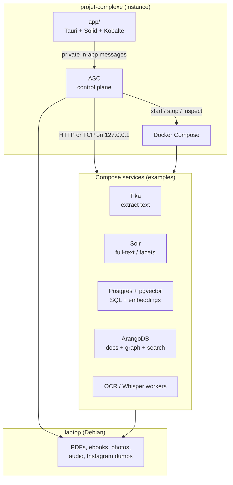
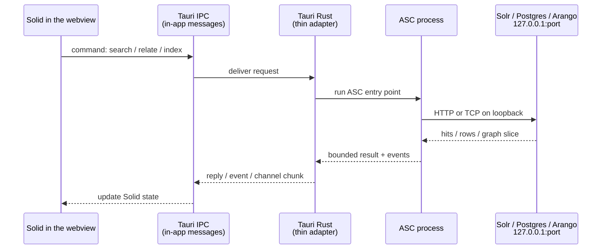
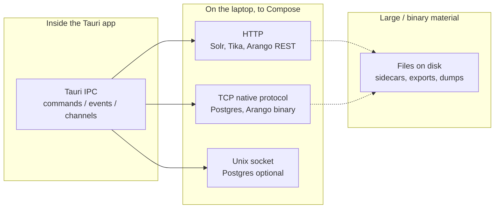
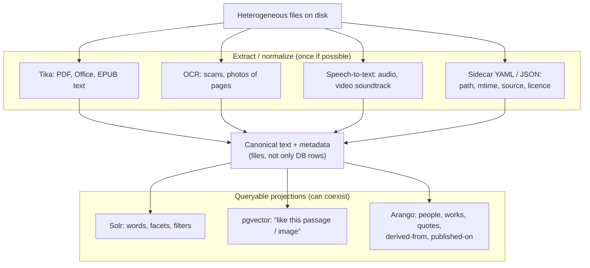
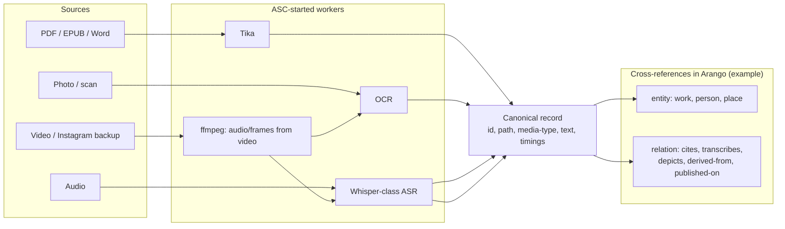

# Tauri ↔ Docker Compose ↔ indexes

- **Date:** 2026-08-17
- **Status:** idea / architecture note
- **Scope:** projet-complexe instance layout, how the Tauri UI reaches local services, and how those services should index heterogeneous personal archives
- **Related:** [14-proposed-architecture.md](14-proposed-architecture.md) (ASC as control plane, Tauri as thin adapter)

## Goal

Build a **multimodal search and cross-referencing** system over extremely mixed local material:

- PDFs, ebooks, Word / ODT
- research papers, dissertations, notes
- photos and scans that need OCR
- audio that needs transcription
- Instagram (and similar) backups: images, captions, videos that may need transcription too

The desktop UI lives in `app/` (Tauri + Solid). Databases and extractors run in Docker Compose, the same way a Compose stack runs Solr / Postgres as stack services. ASC starts, stops, and chooses those services. The UI does not become a second control plane.

## Instance layout

| Path | Role |
|------|------|
| `/home/paul/Documents/projet-complexe` | Project **instance** (dev stack repo) |
| `…/app` | Tauri UI piece (own “app”, not a Compose service) |
| Compose files at instance root (later) | Databases, Tika, Solr, Arango, workers |
| ASC | Control plane: packages, dedi, compose lifecycle, indexing jobs |

Tauri stays a **host process**. It is not a container. App containers talk to sibling services on the Docker network. Tauri cannot: it talks like `curl` or `psql` on the laptop, through **published localhost ports**.

---

## What “the webview talks Tauri IPC” means

A Tauri app is **two programs that look like one window**:

1. **The webview** — SolidJS runs here. It is a browser engine (WebKitGTK on Debian) with no normal address bar. It can draw UI. By default it must **not** freely call random URLs or open database sockets.
2. **The Rust side** — the native half of the same app. It can start processes, read files (if allowed), and open network connections.

**IPC** = *inter-process communication*: two programs on the **same computer** exchanging messages, without going through the public internet.

Everyday picture:

- The webview is the **front desk**.
- The Rust side is the **back office**.
- IPC is the **internal window** between them (a slip of paper: “search for Monnin”, “indexing job 42 advanced 10%”).
- Solr / Postgres / Arango are **other shops on the same street** (`127.0.0.1` + a port). The front desk does not walk into the street. The back office (or ASC, which the back office calls) does.

Tauri names three IPC shapes (see [Calling the frontend](https://v2.tauri.app/develop/calling-frontend/)):

| Tauri IPC | Use |
|-----------|-----|
| **Command** | Front desk asks one question, waits for one answer (“run this ASC expression”, “page 3 of neighbours of entity X”). |
| **Event** | Small notice either way (“entity.changed”, “thread.finished”). |
| **Channel** | Ordered stream (index progress, log chunks, graph pages). |

None of those is HTTP to Solr. They never leave the app until Rust or ASC opens a **localhost socket**.

**Who opens the localhost sockets?**

| Option | What happens | Verdict for this project |
|--------|----------------|--------------------------|
| **A. Webview `fetch('http://127.0.0.1:8983')`** | The browser engine talks to Solr itself. CORS, CSP, credentials in JS, bypasses ASC. | Avoid as the main path. |
| **B. Rust opens the sockets** | A Tauri command uses `reqwest` / `sqlx` / an Arango client. Solid never sees the port. | Fine technically. Duplicates ASC if Rust grows “what a research note is”. |
| **C. ASC opens the sockets** | Rust only asks ASC. ASC owns compose, jobs, and DB clients (curl, psql, workers). | **Preferred.** Matches [14-proposed-architecture.md](14-proposed-architecture.md). |
| **B+C** | Rust is a pipe: spawn/call ASC, forward streams. ASC still owns Solr/Postgres/Arango. | What “thin adapter” actually looks like. |

So: **yes, engines are reached with HTTP/TCP on custom localhost ports** — but **the webview is not the client**. ASC (invoked through Tauri IPC) is.

Publish Compose ports on loopback only, e.g. `127.0.0.1:8983:8983`, never `0.0.0.0`.

---

## Protocols (how bits move)

These are different layers. Mixing them up causes the “can Solid just HTTP to Arango?” confusion.

| Protocol | Typical use here | Advantages | Inconvenients |
|----------|------------------|------------|----------------|
| **Tauri IPC** | UI ↔ Rust only | No CORS; capabilities; events + streams; UI never holds DB passwords | Not a way to talk to Solr. Rust/ASC must sit in the middle. Payload size: keep messages small, point at files for big blobs. |
| **HTTP on 127.0.0.1** | Solr, Tika `/tika`, Arango REST, some worker APIs | Easy to inspect (`curl`); language-agnostic; good for extractors and search APIs | Chatty for bulk graphs; JSON cost; must not bind on all interfaces; auth still matters even on localhost. |
| **TCP native protocol** | Postgres (and pgvector), Arango’s binary protocol | Fast, typed, transactions, prepared statements | Needs a real client (not `fetch`); version coupling; worse to debug than `curl`. |
| **Unix socket** | Postgres alternative to TCP | Slightly faster; not a TCP port to mis-publish | Awkward from some containers; Windows later is different; still a host-local secret. |
| **Files / directories** | Originals, OCR text sidecars, embeddings dumps, static export for dedi | Right place for GB of PDFs and video; ASC already thinks in paths; public site can copy a subset | Not a query engine; need indexes *about* the files, not instead of them. |
| **Docker DNS only** | Container-to-container (`tika:9998`) | No host ports; typical Compose-style | Tauri cannot use this unless it is in the Compose network (it should not be). |

**Rule:** bulky media stays on disk. Indexes store **pointers + extracted text + embeddings + relations**. The UI queries a **page** of those, then asks to open a file if needed.

---

## Indexes and engines (what each is good at)

Do not pick one database to be “the brain”. Heterogeneous archives need **extraction**, **lexical search**, **semantic similarity**, and **explicit relations**. Those are different jobs. Compose makes it cheap to run several and **compare**.

### Apache Tika

Extracts text and metadata from many office/ebook/PDF types. It is **not** a search engine.

| | |
|--|--|
| **Advantages** | One HTTP service for dozens of formats; battle-tested; easy Compose service. |
| **Inconvenients** | Quality varies (scanned PDFs need OCR, not Tika alone); not relations; not vectors. |

### Solr (lexical / faceted index)

Inverted index: words, phrases, filters (author, year, extension, “has OCR”).

| | |
|--|--|
| **Advantages** | Excellent “find this exact name / quote”; facets; familiar from other Compose stacks; good for 10⁵–10⁷ docs on a laptop if schema is sober. |
| **Inconvenients** | Weak as a *graph* of ideas; classic Solr is not the best place for embeddings (possible, not its centre); another JVM to feed and backup. |

### Postgres + pgvector (relational + semantic)

SQL for structured facts; `vector` columns for “passages close to this query embedding”.

| | |
|--|--|
| **Advantages** | Transactions; joins (document ↔ citation ↔ file path); one engine you can dump; vectors for paraphrase / multilingual-ish search; fits “compare implementations”. |
| **Inconvenients** | You must chunk text and run an embedding model (CPU/GPU cost, model choice is a lock-in); not a first-class graph traversal; full-text in Postgres is fine but usually poorer than Solr for rich facets. |

### ArangoDB (multi-model)

Documents + graph + its own search. This is the natural home for **cross-references**: work → cites → work, photo → depicts → place, Instagram video → transcribes-to → text → quotes → dissertation.

| | |
|--|--|
| **Advantages** | One place for “this scan is of that PDF page”, “this audio is a talk about that paper”, multimodal *relations* without bolting three query languages by hand; AQL traversals. |
| **Inconvenients** | Heavier ops story than Postgres; another query language; search is good, not always Solr-class; easy to over-model and freeze a bad ontology. |

### Combining them (recommended stance)

| Strategy | Advantages | Inconvenients |
|----------|------------|----------------|
| **Solr only** | Fast to a usable keyword UI | No decent “same idea, different words”; no rich graph |
| **pgvector only** | Similarity + SQL | Bad keyword UX; weak citation graphs |
| **Arango only** | Relations shine | Extraction still needed; lexical search may disappoint; all eggs in one vendor |
| **Extract once, fan-out** | Tika/OCR/ASR write canonical text; Solr + pgvector + Arango are *projections*; ASC can A/B which engine answers a query | More Compose services; must keep projections in sync; do not index everything unbounded |

Fan-out is the one that matches “test, compare, and combine”.

---

## Heterogeneous data: one pipeline, many media

Cross-referencing only works if every medium becomes **addressable text + typed links**, while the original file stays the source of truth.

| Medium | Extract | Search / xref notes |
|--------|---------|---------------------|
| **Searchable PDF, EPUB, Word** | Tika | Solr for quotes; chunk for vectors; graph: bibliographic relations if you encode them. |
| **Scanned PDF / photo of a page** | OCR (then same as text) | OCR errors poison Solr and embeddings; keep confidence; link image region → text block if possible. |
| **Audio** | Transcription + timestamps | Search the transcript; graph: “talks-about”; do not dump raw WAV into Solr. |
| **Video / Instagram** | `ffmpeg` audio → ASR; optional keyframes → OCR/captions | Heavy. Budget it. Store platform metadata (caption, date, URL) as first-class, not only pixels. |
| **Public export (dedi)** | Subset of canonical records → static files | Same ASC “publish” path; no live Solr on the server unless you later choose that. |

**Sobriety:** indexing everything (every Instagram story, every duplicate backup) is a product decision, not a default. ASC should make **not indexing** as easy as indexing.

---

## What the UI is allowed to do

Solid / Kobalte / later Pixi:

- send **commands** (search, open entity, start OCR job, stop job);
- listen for **events** (job progress, new relation);
- render a **page** of hits or a **LOD** graph slice.

Solid must not:

- hold Solr/Arango admin passwords;
- stream the whole graph over IPC;
- call Compose HTTP as if it were a website backend.

That is the same split as the proposed architecture: **ASC owns meaning and execution; Tauri owns transport and the window; Solid owns presentation.**

---

## Open choices (not decided here)

- Exact Compose profiles (`solr`, `pgvector`, `arango`, `extractors`) and port map.
- Which embedding model, and whether it runs in Compose or on the host GPU.
- Whether Arango is the *system of record* for relations, with Solr/pgvector as derived indexes, or the reverse.
- How Instagram backups are ingested (folder convention vs a dedicated importer).

Those can stay experiments behind ASC entry points (`index`, `extract`, `recognize`, `relate`, `research`) without changing the IPC vs localhost rule.
