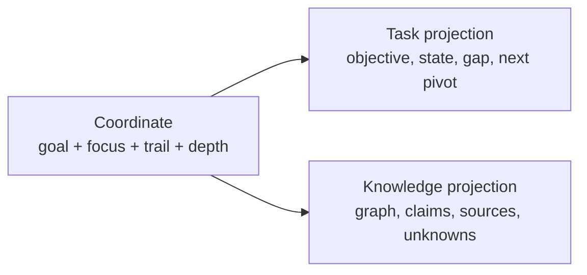
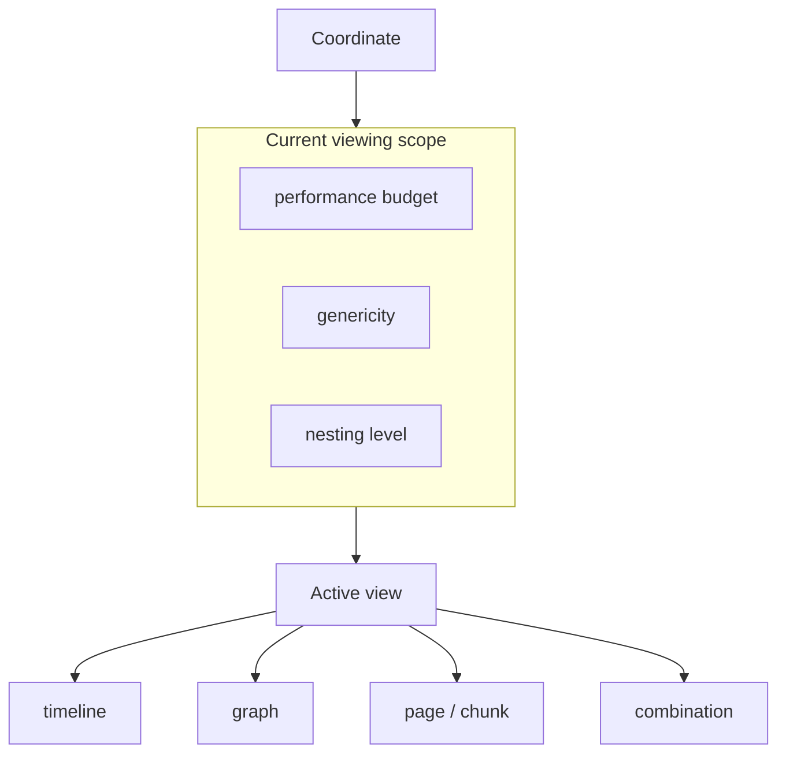
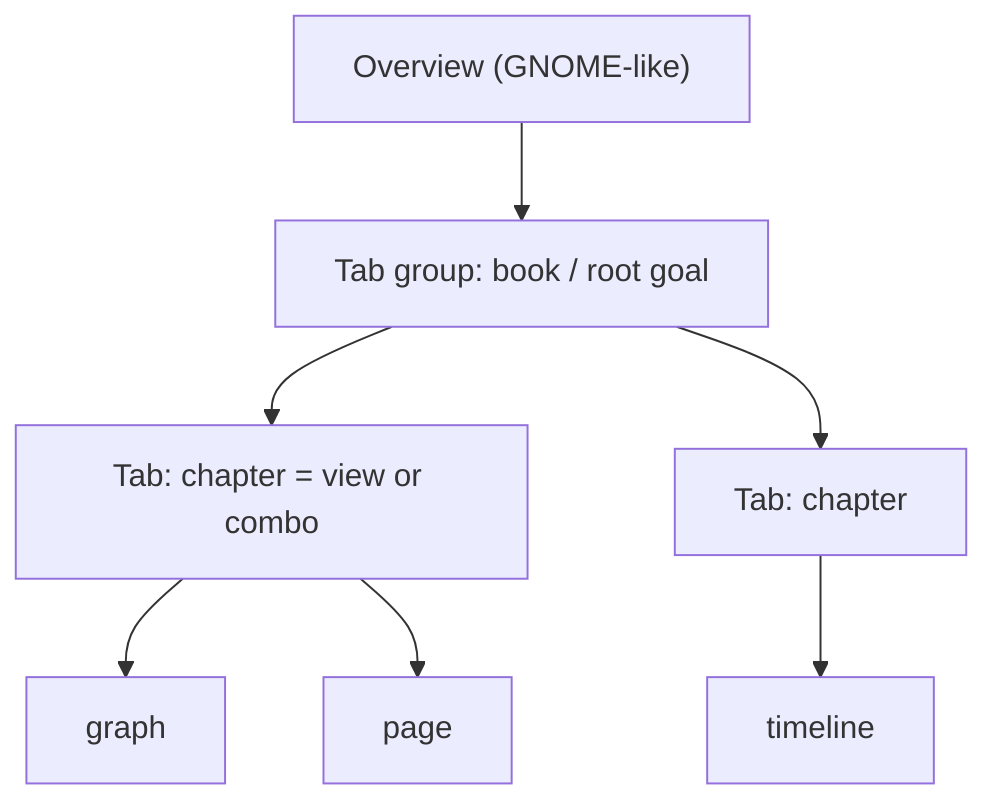
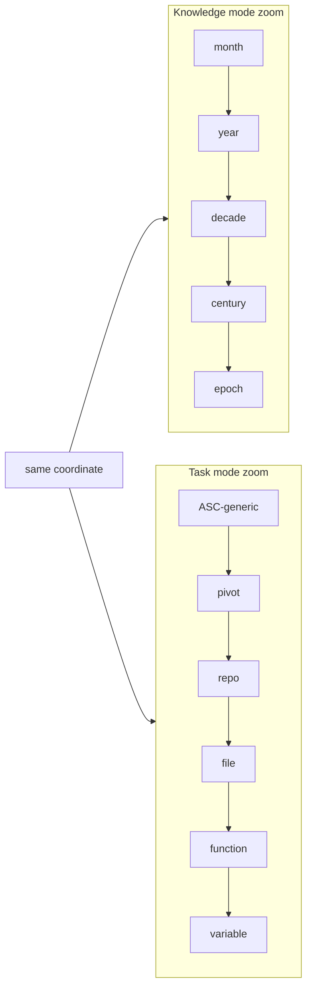

# UI design ideas (Tauri + SolidJS)

- **Date:** 2026-08-17
- **Status:** idea / design in progress (not a spec, not an implementation plan)
- **Scope:** how the desktop UI is oriented, addressed, zoomed, and tabbed — without turning SolidJS into a second control plane
- **Related:**
  - [app/README.md](../../../app/README.md) (task ↔ knowledge duality)
  - [14-proposed-architecture.md](14-proposed-architecture.md) (ASC control plane, performance governor, LOD)
  - [17-local-dev-stack-architecture.md](17-local-dev-stack-architecture.md) (IPC, allowlisted pivots, paging)
  - ASC: [Projet Complexe 2026 Revival (v2)](../../../../asc/data/ideas/2026/08/Projet%20Complexe%202026%20Revival%20(v2)%20-%20ASC,%20Projet%20Complexe%20and%20Projet%20Complexe%20ASC.md)
  - ASC: `nest.able = zoom.able` in [Projet Complexe 2026 Revival](../../../../asc/data/ideas/2026/08/Projet%20Complexe%202026%20Revival%20-%20ASC%20+%20Tauri%20SolidJS%20Second%20Brain.md)
  - Past front-end taste: `css-organization` (base / generic / specific, shell vs content), `chouette.net.br`, `research-journal`, `vinifacture`, `simple-scraps`

## Goal of this note

Record the 2026-08-17 conversation on **routing and chrome**, then the later refinement: **modes share a coordinate**, **zoom is a change of scope**, **tabs are views (or combinations of views)** that can nest like a book.

Nothing here is scheduled to be built yet. The first implementation milestone remains the architectural invariant from the revival note: a useful operation is a stable ASC pivot, runnable from the terminal, consumed by the UI without the UI knowing the implementation.

---

## 1. What this UI is (and is not)

The window is a **semantic and visual environment** over tasks, knowledge, research, projects, and agents. It is not a website of sections (`/blog`, `/cv`, `/ingest`). Public sites ([dedi-2025](https://github.com/Paulmicha/dedi-2025)), ebooks, and social posts are **outputs** (publish pivots), not the app’s information architecture.

| Layer | Authority |
|---|---|
| **ASC** | What exists, where it is, what can be done (execution) |
| **Projet Complexe ASC** | Which pivots this environment exposes (`index`, `extract`, `research`, `publish`, …) |
| **Projet Complexe (this UI)** | What it means, what I am trying to accomplish (interpretation) |

Solid owns presentation. Tauri is a thin IPC adapter. The webview must not call Solr/Arango, must not pass arbitrary `make` strings, and must not invent a second ontology of “pages”.

Past layouts that still apply:

- **css-organization:** `base` / `generic` / `specific`; shell vs content; split before three levels of depth; duplication rather than the wrong abstraction.
- **chouette:** routes are *content* pages; reject a heavy metaframework when the problem is not a website.
- **research-journal:** generic View / pager / tabs plus feature folders; URL params for pager state worked; dumping every experiment under `src/routes` did not age well.
- **vinifacture:** SvelteKit resource routes were right for one CRUD domain — not the pattern for this studio.
- **simple-scraps:** register composite pieces; do not hard-wire the tree.

---

## 2. Two orientations, not two apps

From [app/README.md](../../../app/README.md):

| Knowledge-oriented | Task-oriented |
|---|---|
| Problem | Solution |
| Exploration / Digression | Goal / Focus |
| Complexification | Simplification |
| Design (projection) / Concept | Execution / Implementation / Realization |
| Research / Reflection / Opinion | Decision |
| Analysis / Explanation | Directives / Tasks |
| Anticipation | Reaction / Adaptation |
| Theory | Practice |
| Information | Command |
| Thought | Action |

**Default mode is task-oriented.** A top-level control switches to knowledge-oriented.

The revival note is explicit: these are **not** “Task tab / Knowledge tab”. They are two orientations of the same activity (including for agents: the mutual killswitch — stop acting to research, stop researching to act).

**Switching mode keeps the current location.** Only the projection changes.



IEML is a **metaphor** for an explicit, inspectable address in meaning-space (like a compiler AST, not an LLM latent map). Do **not** encode IEML morphemes in the hash.

---

## 3. Chrome (Firefox-like)

Resemble a modern browser (Firefox / Vivaldi): **tabs + shortcuts + hamburger + address bar**.

| Chrome | Holds | Not |
|---|---|---|
| **Tabs** | Opened goals / views (see §6–7) | The only workspace; not “one URL path per make target” |
| **Address bar** | Keyboard-first fuzzy match of **allowlisted** Projet Complexe ASC pivots + entities; most-used / recent first | A path the user types like `/extract/pdf` |
| **Shortcuts** | Pinned pivots | A second sitemap |
| **Hamburger** | App chrome + export commands (site, ebook, social) | Top-level modes |
| **Mode link** | task ↔ knowledge on the **same coordinate** | A third IA |

The address bar does not route. It sets `pivot` (and maybe runs the command) at the current coordinate. Pivots are **data from ASC**, ranked by recency. A new `make` entry point must not require a new frontend route file.

---

## 4. Addressing: a small codec, not TanStack from day one

**Do not install the TanStack suite up front** (Router, Query, Table, Form). Query is a particularly bad fit: data is Tauri IPC + ASC events, not a REST cache. Virtual lists can appear later when DOM lists are huge ([14-proposed-architecture.md](14-proposed-architecture.md) §20). `@solidjs/router` in hash mode is acceptable **if it stays a codec** for the fields below — two orientations + query params, not a file-route tree per pivot.

The “40-line codec” is parse/serialize of one location. Hash is appropriate in a Tauri webview (no public HTTP server). It mirrors the **active** tab only; the session of tabs is Solid (and later ASC) state.

### Location

```ts
type Mode = 'task' | 'knowledge'

type Coordinate = {
  goal: string      // root goal of this tab (or tab group)
  focus: string     // current node: sub-goal, document, gap, concept, file, function…
  trail?: string[]  // ancestors goal → focus (zoom out)
  depth?: number    // scale / LOD around focus
}

type Location = {
  at: Coordinate
  mode: Mode        // projection only — must not move `at`
  view?: ViewKind   // see §6
  pivot?: string    // optional allowlisted ASC pivot from the address bar
  q?: string        // address-bar draft
}

const setMode = (loc: Location, mode: Mode): Location => ({ ...loc, mode })
```

Example hashes:

```text
#/g/extract-strategy/e/docling-pdf?mode=task&depth=2
#/g/extract-strategy/e/docling-pdf?mode=knowledge&view=graph&depth=2
```

Flip the mode link → `mode` changes, `g/` and `e/` stay. Names in the coordinate should remain **filename-safe** so that, when the node is computational, the same place can be inspected from the terminal. Projet Complexe interprets (`goal`, `KnowledgeGap`). ASC does not need those words as primitives.

### Manifest (static UI wiring)

Not the list of `make` targets:

```ts
export const modes = [
  { id: 'task',      title: 'Task',      component: TaskWorkspace },
  { id: 'knowledge', title: 'Knowledge', component: KnowledgeGraph },
]

export const views = [
  { id: 'graph',    component: GraphView },
  { id: 'timeline', component: TimelineView },
  { id: 'page',     component: PageView },
  { id: 'chunk',    component: ChunkView },
]

export const shortcuts = [
  { label: 'Index',   pivot: 'index' },
  { label: 'Publish', pivot: 'publish' },
]

export const hamburger = [
  { label: 'Export site',  pivot: 'publish', args: { target: 'site' } },
  { label: 'Export ebook', pivot: 'publish', args: { target: 'ebook' } },
  { label: 'Social post',  pivot: 'publish', args: { target: 'social' } },
]
```

Pivots, recency, and graph seeds (recurrent topics, latest notes) come from ASC over IPC at runtime.

Suggested `app/src` split (css-organization mapped to Solid): `address/` (codec), `shell/` (chrome, overview), `ui/` (generic), `css/` (`base` / `generic` / `specific`), `ipc/`, views registered in the manifest — not `src/routes/extract.tsx`.

---

## 5. Scope: the thing zooming actually changes

A **scope** is the bounded slice of the conceptual graph currently in view. Moving between scopes should feel free (pan / zoom / overview), not like changing website sections.

Each scope is bounded by at least:

| Bound | Role | Already in the architecture |
|---|---|---|
| **Performance budget** | How many nodes, edges, labels, animations, IPC pages | Performance governor + LOD ([14-proposed-architecture.md](14-proposed-architecture.md)) |
| **Genericity** | How abstract vs how concrete the same structure is shown | ASC genericity scale (primordial → project-specific) in revival v2 |
| **Nesting level** | How deep into a `nest.able` entity the view has descended | ASC: `nest.able = zoom.able` (structural containership, not merely nested execution) |

`nest.able` is a **structural** property: something that can contain / expose a subordinate ASC structure. The same mechanism can describe:

```text
project → directory → file → code → function → variable
agent → plan → task → action → process
book → chapter → section → page → chunk
```

Zoom is walking that fractal, not opening a different app.

The graph remains **conceptual** (revival v2 §12): it may be projected from files, Solr, Arango, events. The UI must not assume one graph database, and must not pull the whole graph over IPC.



---

## 6. Views (a tab is not “the router”)

A **view** is one typed projection of the current coordinate + scope.

Examples:

- graph
- timeline
- single page
- chunk (passage, OCR block, code range)
- later: map, agent event stream, document reader, …

**A tab is one view** in the simple case: this tab *is* the graph of this goal; that tab *is* the timeline.

**A tab can also be a generic combination of views** — a layout that holds several projections of the same coordinate (or of a nested trail). That is how something like a **book** can be built in the UI:

| Book metaphor | UI |
|---|---|
| Entire book | Tab **group** (nested tabs) or one tab whose scope is the root |
| Chapter | A tab (or nested tab) |
| Section | Nested tab, or a view inside the chapter tab |
| Page / chunk | A view (`page`, `chunk`) at a deeper nesting level |

So: **view kind** is a projection type; **tab** is a session slot that mounts one view or a small combination; **tab group** is a nestable book/outline. This is closer to Firefox/Vivaldi **nested tabs** than to a sitemap.

Knowledge-oriented default view: visual graph, seeded by recurrent topics researched, latest notes, etc., still **at the current coordinate** (not a separate “home graph” that throws the goal away).

Task-oriented default: command-first workspace (address bar + current objective / state / gap).

---

## 7. Nested tabs and overview

**Nested tabs** (Firefox, Vivaldi): a parent tab can contain children. A book is a group; a chapter is a child tab. This also answers “sub-goals if it gets too complex”: deepen the tree in the same group, or **open the sub-goal as its own tab** with the parent left in `trail`.

**GNOME (Wayland) Activities-style overview:** an animated zoom-out over **all opened tabs** (and groups), so the session is spatially glanceable. This is session chrome, not a knowledge-graph zoom. It should respect the same performance budget (do not snapshot every Pixi scene at full fidelity).



---

## 8. Zoom means different axes in each mode

Zoom always changes **scope** (budget, genericity, nesting). The **salient axis** depends on orientation.

### 8.1 Knowledge-oriented — time (example)

The current viewing scope can span:

```text
month → year → decade(s) → century(ies) → millennial(s) → geological epoch
```

A timeline view makes that axis obvious. A graph view can still use time as the scale of which relations are in budget (e.g. only edges inside this century). Depth / LOD from the performance governor is the same knob.

### 8.2 Task-oriented — genericity / implementation

The same problem can be zoomed **out** to its most generic level of existence (vocabulary that could match **ASC terminology**: entity, capability, pivot, hook) and zoomed **in** to a single variable or function in a concrete implementation.

```text
ASC-generic capability
  → project-specific pivot
    → repository / package
      → file
        → function
          → variable
```

That is `nest.able` + the genericity scale, shown as a task. A code-structure index such as [vitali87/code-graph-rag](https://github.com/vitali87/code-graph-rag) is a **candidate later composition** for the inner levels (file / function / variable), not a day-one dependency and not an ASC primitive. If it proves useful, it belongs behind a Projet Complexe ASC pivot (`relate` / `inspect` / similar), with the UI still thinking in coordinates, not in that tool’s API.



Mode switch does not reset zoom: the coordinate (goal, focus, trail, depth) stays; the view chooses which axis is in the foreground.

---

## 9. What not to build first

Aligned with revival v2 §59–60 and [14-proposed-architecture.md](14-proposed-architecture.md) §20:

- No TanStack Router / Query / Start as the organizing principle
- No route module per ASC pivot or per output type
- No giant component library, giant graph schema, or second execution engine in the frontend
- No IEML runtime in the hash
- No GNOME-overview clone or nested-tab chrome before the location codec + two projections exist
- No code-graph-rag until a pivot needs file/function/variable focus

First UI slice, when implementation starts: hash codec + task default + knowledge switch on the **same** coordinate + address bar over a tiny allowlist of pivots.

---

## 10. Open choices

- When a knowledge-gap spawns a research sub-goal: stay a **child in the current tab tree**, **open as a nested tab**, or both (user choice, like “open in new tab”)?
- Is a tab **strictly one view**, with combinations only via **nested tab groups**, or may a single tab host a **layout of several views** (spread / book page)?
- Is `depth` one number, or separate numbers per axis (time, genericity, nest level, render LOD)?
- Does the GNOME-like overview show tab thumbnails, goal titles, or a downsampled graph of each coordinate?
- Should `view` live in the hash, or only in tab session state (hash = coordinate + mode only)?

Those can stay undecided until a first codec exists; they do not change the rule that **mode is a projection of a coordinate**, and **zoom is a change of scope**.
