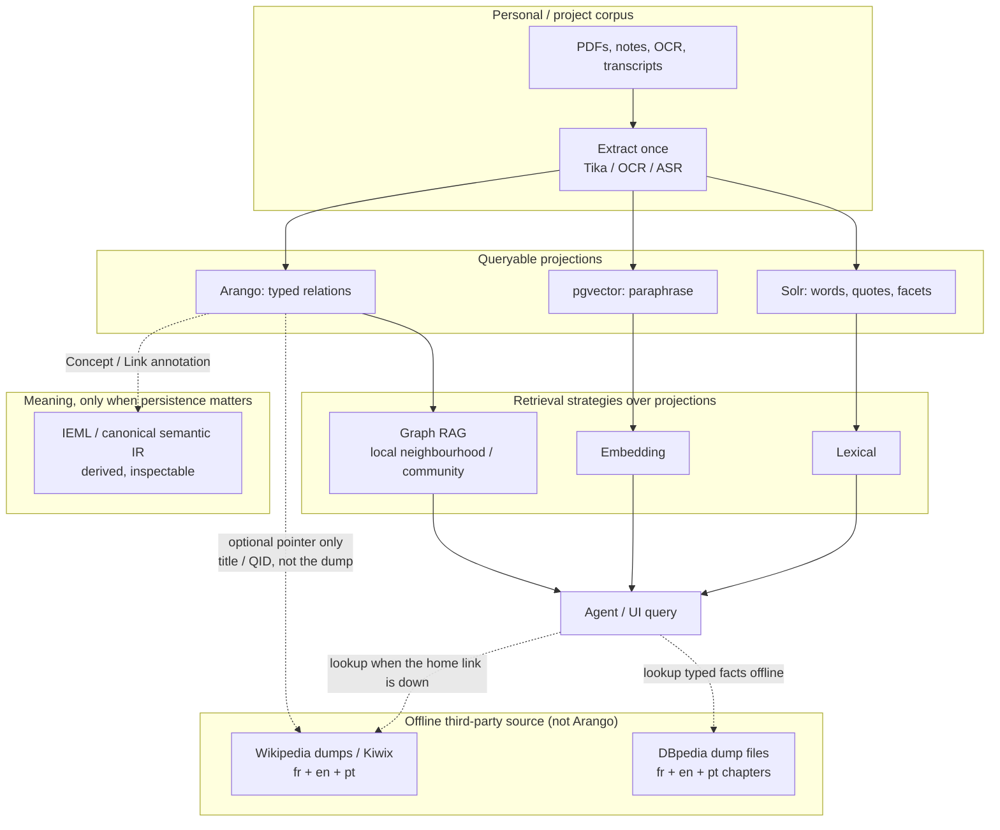
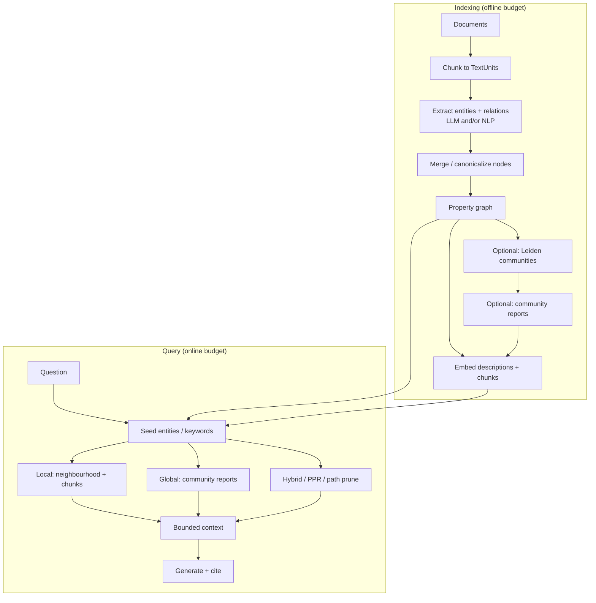
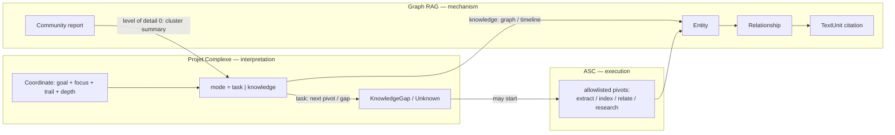
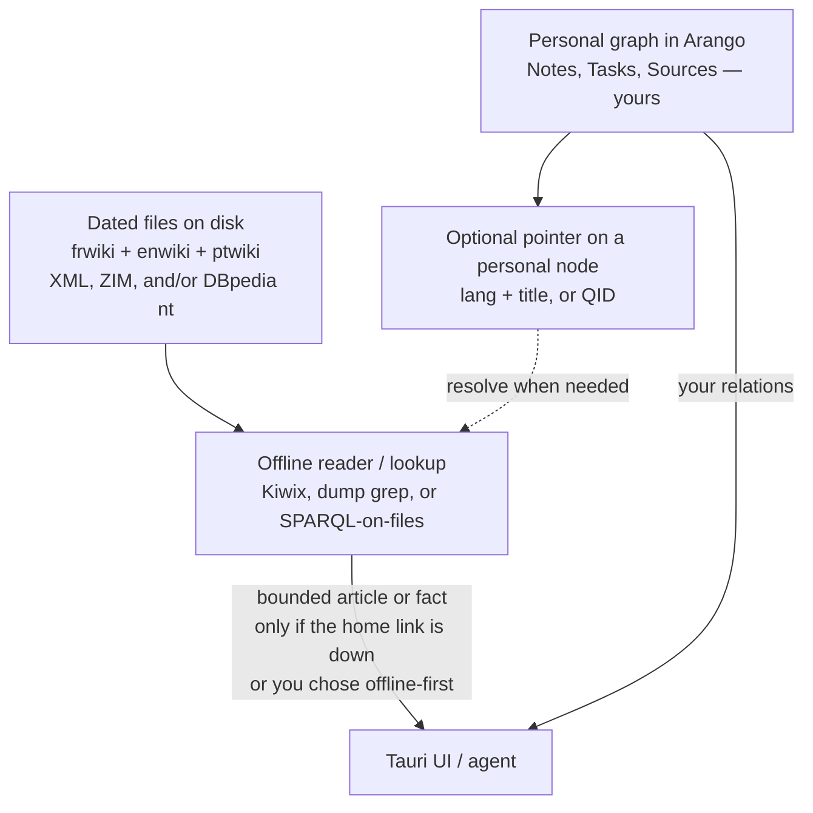
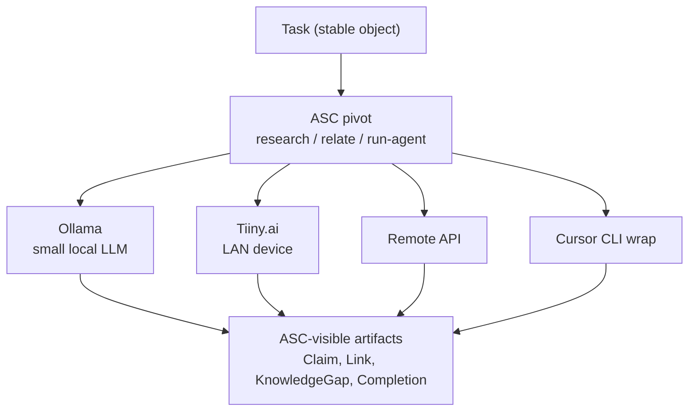
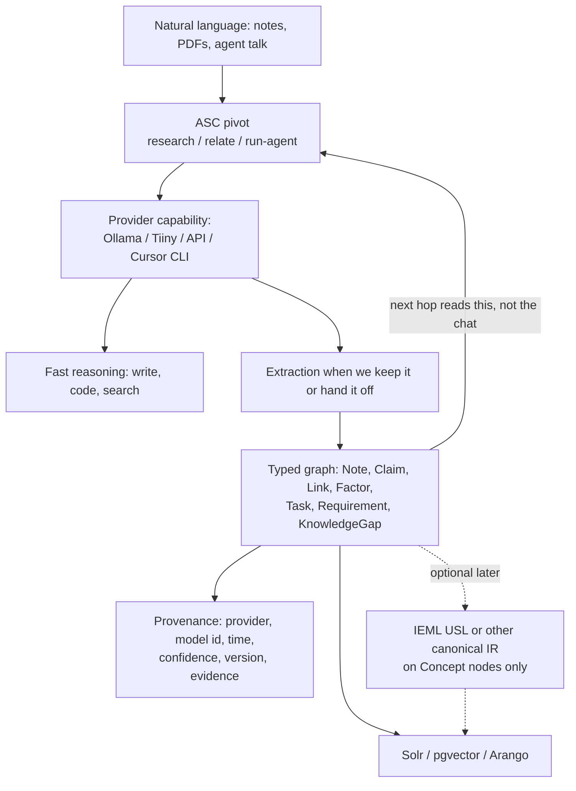
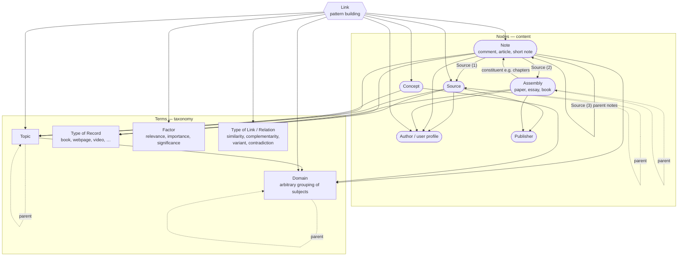
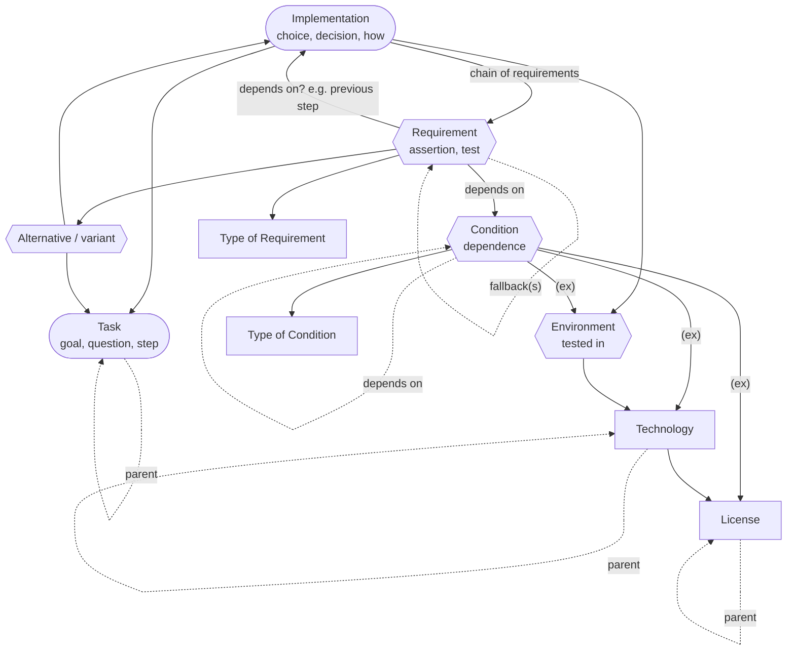
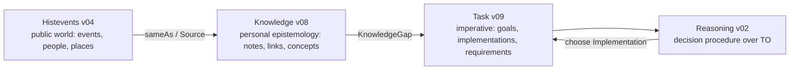
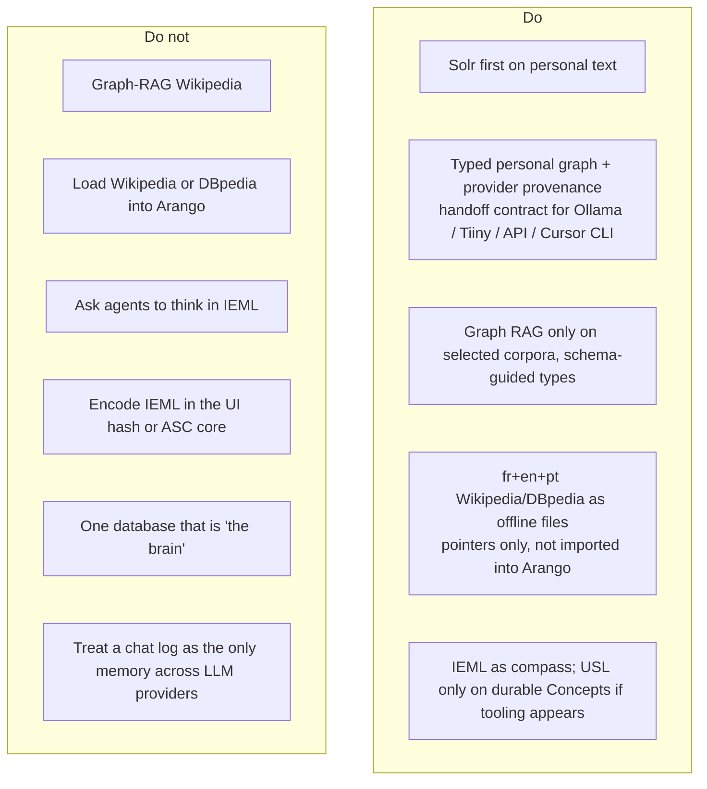

# Graph RAG, Wikipedia / DBpedia, and IEML

- **Date:** 2026-08-18
- **Updated:** 2026-08-18 — FR/EN/pt-BR dumps; Wikipedia as offline third-party source (not Arango); glossary for LOD and QID; multi-provider LLM handoff vs implicit semantics
- **Status:** idea / architecture note (not a spec, not an implementation plan)
- **Scope:** what Graph RAG is and why it exists; whether a local Wikipedia + DBpedia copy in French, English, and Portuguese is worth it as an offline source; whether IEML adds anything beside graphs, dumps, and LLMs; mermaid translations of the 2009–2014 entity diagrams
- **Related:**
  - [14-proposed-architecture.md](14-proposed-architecture.md) — ASC control plane, conceptual graph, LOD / performance governor
  - [17-local-dev-stack-architecture.md](17-local-dev-stack-architecture.md) — extract-once, Solr + pgvector + Arango, paging, cost cliffs
  - [17-ui-design-ideas.md](17-ui-design-ideas.md) — IEML as metaphor, not a hash codec; graph is conceptual
  - ASC: [Projet Complexe 2026 Revival (v2)](../../../../asc/data/ideas/2026/08/Projet%20Complexe%202026%20Revival%20(v2)%20-%20ASC,%20Projet%20Complexe%20and%20Projet%20Complexe%20ASC.md)
  - ASC: [Would IEML really add tangible value for agents](../../../../asc/data/ideas/2026/08/Would%20IEML%20really%20add%20tangible%20value%20for%20agents.md)
  - ASC: [Reasoning without Probabilistic Inference](../../../../asc/data/ideas/2026/08/Reasoning%20without%20Probabilistic%20Inference%20(symbolic%20and%20neural%20layers).md)
  - Origins: [Foundations of Task-oriented & Knowledge-oriented side-projects - v03.docx](assets/Foundations%20of%20Task-oriented%20%26%20Knowledge-oriented%20side-projects%20-%20v03.docx)
  - IEML corpus: Lévy 2023 HAL [hal-04055239](https://hal.science/hal-04055239); [sphere1.pdf](assets/sphere1.pdf); [00-0-sphere3-fr.pdf](assets/00-0-sphere3-fr.pdf); [00-grammaire-ieml1.pdf](assets/00-grammaire-ieml1.pdf); [IEML-Dictionnaire.pdf](assets/IEML-Dictionnaire.pdf)

## Goal of this note

The 2026 revival already decided three things that this note must not undo:

1. **The graph is conceptual**, not necessarily one database (revival v2 §12). Solr, Postgres, Arango, files, and events can all *project* it.
2. **Knowledge is not merely RAG** (revival v2 §26). Claims, sources, evidence, unknowns, and knowledge-gaps are the model. Indexes are mechanisms.
3. **IEML is a compass, not a runtime** ([17-ui-design-ideas.md](17-ui-design-ideas.md): do not encode IEML morphemes in the location hash).

The remaining question is how three *external* knowledge technologies sit on that architecture:

| Technology | What it is, in one line | Layer it would occupy |
|---|---|---|
| **Graph RAG** | Build a graph from *your* texts, then retrieve a *bounded subgraph* (or a community summary) instead of the nearest embedding chunks | Indexer / query strategy over the personal corpus |
| **Wikipedia articles + DBpedia triples (fr, en, pt)** | A frozen public encyclopedia on disk: prose and/or RDF, consulted when the home link is down | Optional *offline third-party source*, not the second brain and not an Arango load |
| **IEML** | A constructed language whose *form* is meant to be semantically computable (syntagmatic *and* paradigmatic) | Optional *coordinate system* for concepts, if ever derived |

They are complementary only if each one is used for the job the others cannot do. Mixing them into one “knowledge graph product” is how the project would freeze a bad ontology.

**Rule of thumb:** Graph RAG over *your* notes. Wikipedia/DBpedia as a **local offline encyclopedia** (files you query, like opening a book when the internet drops) — not as nodes imported into Arango. IEML as a *coordinate*, not as the language agents think in.

### Terms used below

Two abbreviations in this note are easy to mix up with neighbouring jargon.

**LOD** here means **level of detail**, not “Linked Open Data”.

In 3D and maps, you do not draw every brick of a city when you are looking at a country: you draw *less* as you zoom out. The [proposed architecture](14-proposed-architecture.md) uses the same idea for the graph on screen (and for how much you fetch):

| Level | What you see / retrieve |
|---|---|
| **LOD 0** | Clusters / community summaries (“what is this region about?”) |
| **LOD 1** | Nodes |
| **LOD 2** | Relations |
| **LOD 3** | Labels |
| **LOD 4** | Metadata, citations, full passages |

The *performance governor* picks a level from CPU/GPU/memory budget. “Render LOD” is that knob. (In Semantic Web writing, **LOD** often means *Linked Open Data* — DBpedia, Wikidata, RDF on the public web. This note spells that out as “Linked Open Data” when it comes up.)

**QID** is a **Wikidata item id**: the letter `Q` plus a number. Example: [Q1290](https://www.wikidata.org/wiki/Q1290) is Pierre Lévy. Same person, same QID, whether the Wikipedia article is in French, English, or Portuguese. A **P-id** is a *property* (`P31` = “instance of”). The personal graph can store a QID as a *pointer* (“this Author is that Wikidata item”) without loading Wikidata or Wikipedia into Arango.

---

## 1. Graph RAG

### 1.1 What it is

**RAG** (retrieval-augmented generation) means: before the model answers, fetch relevant text and put it in the prompt. Classic RAG embeds passages, retrieves the nearest neighbours, and generates from those chunks.

**Graph RAG** means: first turn a corpus into an explicit graph (entities, relations, optionally claims and communities), then retrieve a *structured neighbourhood* or a *precomputed summary of a cluster*, not only similar paragraphs.

It is still retrieval. It is not a reasoning engine, not ASC, and not “the knowledge model”. It is a way to choose *which* evidence to show an LLM when the question is about *connections* rather than *keywords*.

Microsoft Research’s pipeline (the one that named the genre) stores a small knowledge model:

| Artifact | Role |
|---|---|
| **Document** | Input file or row |
| **TextUnit** | Chunk (default ~1200 tokens) with provenance |
| **Entity** | Person, place, work, event, … extracted from a TextUnit |
| **Relationship** | Edge between two entities, with a description |
| **Covariate** (optional) | Time-bound claim about an entity |
| **Community** | Hierarchical cluster of entities (Leiden) |
| **Community report** | LLM summary of a cluster, used for *global* questions |

That last pair is the distinctive move. Vector RAG has no object that answers “what is this corpus *about*, as a whole?”. Community reports do.

### 1.2 Why it exists

Vector RAG fails in a few recurring ways that this project already cares about:

| Failure of chunk RAG | What actually happens | What Graph RAG tries |
|---|---|---|
| **Global questions** | “What are the main tensions in this archive?” retrieves random similar paragraphs | Map-reduce over community reports |
| **Multi-hop** | The answer is in A *linked to* B; A and B never co-occur in one chunk | Walk edges, or Personalized PageRank from seed entities |
| **Entity identity** | “Monnin” in three notes is three embedding islands | Merge entities; one node, many TextUnits |
| **Contradiction / variant** | Similarity retrieves *near* text, not *opposing* claims | Typed relation (`contradicts`, `variant-of`) if you extract it |
| **Provenance** | A chunk is a bag of tokens | Entity → TextUnit → Document is an addressable trail |
| **Zoom** | One retrieval granularity | Local neighbourhood vs community vs whole-graph summary |

The 2010s Projet Complexe already had this problem without the name. The knowledge-oriented diagram’s **Link (pattern building)** is “I observed the same idea in several sources and previous notes”. Graph RAG is an *automated, lossy, expensive* attempt to propose those links. The human (or a later agent) still has to accept, type, and version them.

It also exists because **context windows are finite**. You cannot dump 55k files into a prompt. You need a *budgeted* view — which is the same constraint as the performance governor and IPC paging: never send the whole graph.

### 1.3 How it is implemented (the common pipeline)

All serious implementations share the same skeleton. They differ in *how expensive* extraction is, *how* they rank at query time, and *whether* they precompute community summaries.

**Indexing** is the cost cliff (same family as “ASR on every video” in [17-local-dev-stack-architecture.md](17-local-dev-stack-architecture.md)). Entity extraction is typically most of the LLM spend. Incremental updates are the hard part: Microsoft GraphRAG historically wanted a rebuild; LightRAG and temporal stores exist because corpora *change*.

**Query** must stay inside the same budgets as everything else here:

- **Query paging:** neighbours of one node, or one community level, never “all edges”.
- **IPC paging:** bounded JSON.
- **Render level of detail (LOD):** community report ≈ LOD 0 (clusters); entities ≈ LOD 1; relations ≈ LOD 2; chunk citations ≈ LOD 3–4. Same zoom idea as the graph on screen: do not fetch or draw everything at once.

Microsoft’s **local vs global** search is almost a restatement of knowledge-mode zoom:

| Graph RAG search | Rough equivalent in this UI |
|---|---|
| **Local** | Focus on an entity; trail = neighbours; depth = hops |
| **Global** | Zoom out: cluster / century / domain; read a summary, not every edge |
| **DRIFT** (later MS variant) | Start global, spawn local questions, re-rank |

That is useful. It is not a reason to vendor-lock the UI to Microsoft’s tables.

### 1.4 Leading open-source implementations (2026)

Brief list, not an evaluation harness. Prefer composing *behind a pivot* (`relate` / `research`) over picking a forever-stack.

| Project | Approach | Why it shows up | Caveat for this project |
|---|---|---|---|
| **[microsoft/graphrag](https://github.com/microsoft/graphrag)** | Leiden communities + local/global search; MIT | Named the pattern; clear data model; docs | **Maintenance mode** (2026). Indexing is heavy. Research baseline, not a product you should grow into. |
| **[HKUDS/LightRAG](https://github.com/HKUDS/LightRAG)** | Dual-level (low-level facts + high-level concepts); graph + vectors; cheaper incremental updates | Practical alternative; multimodal via RAG-Anything / Docling / MinerU | Another Python stack. Easy to become the undeclared control plane. |
| **nano-graphrag** | Small GraphRAG-style clone | Useful to *understand* Leiden + reports without MS ceremony | Research quality; not ops. |
| **[circlemind-ai/fast-graphrag](https://github.com/circlemind-ai/fast-graphrag)** | Personalized PageRank at *query* time; less precompute | Fast to prototype; ranking-first | Weaker “what is this archive about?” unless you add summaries. |
| **HippoRAG / HippoRAG 2** (OSU-NLP) | Hippocampal analogy: associative graph + PPR | Strong on multi-hop / continuing memory papers | Not the Compose default. |
| **PathRAG** | Prune to a few *paths* (too much graph context is noise) | Corrects “retrieve the whole neighbourhood” | Complements, does not replace, typed relations. |
| **Graphiti** (Zep) | Temporal knowledge graph, episode-based | Agent memory that *changes*; hybrid temporal search | Closer to “events” than to a bibliographic graph. |
| **Cognee** | ECL pipeline, auto-optimizing graphs | Batteries-included Python | Opaque relative to ASC’s “name the pivot”. |
| **Neo4j GraphRAG** / **LlamaIndex PropertyGraphIndex** | Schema-guided KG + vector + Cypher/AQL-like retrieval | If the graph already lives in a vendor DB | Arango is the closer fit here; do not add Neo4j “just because GraphRAG tutorials use it”. |
| **[vitali87/code-graph-rag](https://github.com/vitali87/code-graph-rag)** | Code structure (file / function / variable) | Already flagged in [17-ui-design-ideas.md](17-ui-design-ideas.md) for *task-mode* zoom into implementations | Later composition only. Not an ASC primitive. |

Comparative benches (e.g. `graphrag-lab`) exist and will keep reshuffling winners. Treat scores as **corpus-dependent**. A bibliographic PDF shelf is not a customer-support ticket dump is not a git repo.

**What “won” in some 2026 commentary is not Graph RAG at all:** agentic *grep/glob* over a code tree (Claude Code-style) can beat vector indexes when names are meaningful. That is an argument for **lexical Solr + filesystem first**, Graph RAG second, on *this* mixed archive.

### 1.5 How it maps onto Projet Complexe

Do **not** identify Graph RAG’s graph with:

- ASC’s computational graph (files, processes, pivots),
- the UI scene graph,
- IEML’s semantic sphere,
- DBpedia.

Those are four different relation systems. The conceptual graph may *project* several of them. The UI queries a page.

Fit to existing engines:

| Graph RAG artifact | Natural home in the local stack | Do not |
|---|---|---|
| TextUnits / citations | Canonical extracted text on disk + Solr | Duplicate full text in the graph DB |
| Entities / relations | Arango (or a projection from YAML sidecars) | Invent a second ontology in the frontend |
| Description embeddings | pgvector, optional | Embed the social-media photo dump |
| Community reports | Generated artifacts (markdown/YAML) that Solr can also search | Recompute on every keystroke |
| Query | Warm engine via ASC; bounded page | `make` per search; stream the whole graph over IPC |

**Typed links already named in the old diagrams** are richer than default Graph RAG extraction (which often yields generic `related_to`):

- Knowledge: similarity, complementarity, variant, contradiction + **Factor** (relevance, importance)
- Task: alternative, quality / downside, requirement AND/OR/fallback
- Revival: `X is suspected`, `X conflicts with Z`, `X is sufficient for decision D`

If Graph RAG is used, **constrain extraction** to that closed vocabulary (schema-guided), or you will drown in mushy edges.

### 1.6 Verdict

Use Graph RAG as **one retrieval strategy** over *selected* personal corpora (notes, papers, dissertations), behind `relate` / `research`.

Do not:

- run it on Wikipedia,
- run it on every social-media caption,
- let LightRAG/MS GraphRAG own identity,
- skip Solr (quotes, names, and filenames still win often).

Default order: **lexical → optional vectors on chosen chunks → graph walk on accepted entities**. Graph RAG is the third rung, for questions that are about *structure*.

---

## 2. Local Wikipedia + DBpedia as an offline third-party source (fr, en, pt)

The point of a local copy is **not** to pour Wikipedia into Arango (or into the personal graph). It is to have a **third-party encyclopedia on disk** when the home connection is unstable: agents and the UI can still *look up* an article or a typed fact without wikipedia.org, dbpedia.org, or Wikidata being reachable.

Arango stays the home of *your* relations (notes, tasks, claims, accepted links). Wikipedia stays a **separate library**. At most, a personal node stores a *pointer* (language + article title, or a Wikidata QID) so a lookup knows which file to open.

Two different dump families people glue together:

| Dump | What it is | Order of magnitude (2026, compressed) |
|---|---|---|
| **Wikipedia `pages-articles` per language** | Current article wikitext (not full edit history) | **enwiki** ~**25 GB**; **frwiki** ~**6.5 GB**; **ptwiki** ~**2.6 GB**. Together ~**34 GB** bz2. Uncompressed XML is much larger. |
| **DBpedia per language chapter** | RDF extracted mainly from that language’s infoboxes + mappings to the DBpedia Ontology (DBO) | English-centric core historically ~**0.85–1 billion** triples. FR and PT chapters are extra, still far below the **~20 billion** triples of *all* languages. |
| **Wikidata `latest-all.json`** (comparison, not required) | Live community knowledge graph, language-agnostic | ~**95–145 GB** compressed JSON; uncompressed ~**1+ TB**. Heavier. Labels exist in fr/en/pt on the *same* QID. |
| **Kiwix / ZIM** (often the right *reader* format) | Offline snapshot meant to be *opened*, not parsed as XML | Typical Wikipedia ZIMs are smaller than raw XML; built for unstable links. Articles only, not DBpedia triples. |

Wikimedia does not ship a separate “Brazilian Portuguese Wikipedia”. **`ptwiki` is Portuguese Wikipedia**, the edition used in Brazil (Brazilian Portuguese is a variety inside that wiki, not a second dump). **`frwiki`** and **`enwiki`** are the French and English encyclopedias.

Those three languages are the ones this project should cover if a dump is kept at all:

| Language | Role in this life / corpus |
|---|---|
| **French** | Native. Theoretical and IEML/Morin/Lévy material. |
| **English** | Studied at the University of Sunderland (North East England), 2004–2008. Strongest overlap with most local LLMs and with DBpedia’s historical core. |
| **Portuguese (Brazilian)** | Living in Brazil since 2014. `ptwiki` for that language edition. |

Three language editions are still in the same *order of magnitude* as the mixed personal archive in the 17-08 note (~85 GB / ~55k files). That is a different decision from “English only”, which would have cut the native and Brazilian sides of the knowledge-oriented work.

### 2.1 Advantages

| Advantage | Why it matters here |
|---|---|
| **Works when the home link drops** | The actual reason to keep a dump: lookup does not depend on wikipedia.org, SPARQL endpoints, or a VPN. Same idea as having PDFs on disk rather than “I’ll just open the URL”. |
| **Stays out of Arango** | The personal graph does not grow by millions of encyclopedia nodes. Wikipedia is consulted *like a book on the shelf*, not merged into Notes/Tasks. |
| **Grounding / anti-hallucination** | Agents can quote a *local* article (fr, en, or pt) or a *typed triple* (`dbo:birthPlace`, `rdf:type dbo:Philosopher`) instead of inventing a biography. |
| **Stable snapshot** | A dated dump is a reproducible world-state. Live websites move. Matches “what did we read while offline in 2026-08?”. |
| **Pointer, not import** | Store `frwiki:Pierre_Lévy` / `enwiki:Pierre_Lévy` / `ptwiki:Pierre_Lévy` or one **QID** on *your* Author node. Resolve against the local dump at query time. No need to ingest the article body into Arango. |
| **Three working languages** | A French note can hit `frwiki`; an English paper, `enwiki`; a Brazilian source, `ptwiki`. Same person can still share a QID across the three. |
| **Schema.org / “Thing” already in Histevents** | The 2010s diagram pointed Location/Group at **Thing (schema.org ?)**. DBpedia/Wikidata *are* that public layer — as a *reference library*, not as your entity table. |
| **English still helps models** | Many local LLMs are strongest in English. You can still *prefer* `enwiki` for model-facing lookups without deleting `frwiki`/`ptwiki` for you. |
| **License is known** | Wikipedia text is CC BY-SA. DBpedia inherits that world. Better than a random crawl. Share-alike applies if you *publish* derivatives. |
| **Cheap relative to Graph-RAG-ing Wikipedia** | Keeping files (or a Kiwix reader, or a small SPARQL over dump files) is finite disk. LLM-extracting millions of articles is the cost cliff you must refuse. |

### 2.2 Inconvenients

| Inconvenient | Why it hurts this project |
|---|---|
| **Disk, RAM, backup** | Three article dumps (~34 GB compressed) plus optional triples compete with PDFs, photos, and video. Indexes or ZIM readers add more. Feasible on dedi HDDs; tight on a seven-year-old laptop. |
| **Staleness** | Wikipedia changes daily. A local copy is only as fresh as the last download. Agents will be *wrong in a dated way* while offline. Version the snapshot (`dump--frwiki-2026-06-01`, etc.). |
| **Infobox noise (if you keep DBpedia)** | DBpedia is a parse of messy infoboxes. Types are incomplete; predicates collide; long-tail articles are empty. Treat as *candidates*, not ground truth. |
| **Three editions ≠ three identical worlds** | The French, English, and Portuguese articles on the same topic disagree, omit, and bias differently. Offline lookup must say *which language edition* was used. A QID identifies the *item*; it does not make the three texts the same. |
| **`ptwiki` is not “Brazil-only”** | Portuguese Wikipedia mixes European and Brazilian usage and topics. Good enough as the pt edition; not a national encyclopedia of Brazil. |
| **Wrong layer if it leaks into the default graph** | Revival §26: knowledge is claims, unknowns, gaps. Encyclopedias are *sources*. If Wikipedia titles start appearing as first-class graph nodes, the UI becomes an offline Wikipedia with a sidebar. Pointers only. |
| **Graph RAG on Wikipedia is forbidden-cost** | Community detection + LLM summaries over even one language edition is an institutional budget. Use the dump as *text or triples to read*, do not re-extract it. |
| **Query shape (triples)** | SPARQL over hundreds of millions of triples needs a dedicated engine, paging, and a warm process. That engine is **not** Arango. Same “never dump the whole graph to the webview” rule. |
| **DBpedia vs Wikidata** | Wikidata is the living public KG (one QID, labels in fr/en/pt). DBpedia is the *Wikipedia-shaped* extract per language. For “typed facts while offline”, a **Wikidata truthy subset** or Kiwix-style articles may beat three DBpedia chapters. Decide explicitly. |
| **License share-alike** | Publishing a site/ebook that embeds Wikipedia text pulls CC BY-SA onto those pages. The `publish` pivot must know that. |
| **Identity mess if you import anyway** | Three titles + DBpedia URIs + QID + your Author node. Without a pointer policy, Graph RAG extraction will mint a fifth. Importing into Arango makes this worse; keeping dumps separate avoids most of it. |
| **Not multimodal** | Dump is text/RDF. It does not help photos, ASR, or sheet music. The heterogeneous pipeline stays. |
| **Legal/ethical scrape hygiene** | Use official dumps (or Kiwix ZIMs), not a crawler. Large third-party corpus: keep it out of git. |

### 2.3 How it should sit (if at all)

The reader is an ASC-supervised **lookup**, like opening a file. It is not a fan-out indexer that copies Wikipedia into Solr+Arango by default. (You *may* later put *selected* articles into Solr if you search them often. That is still a copy of passages you chose, not “Wikipedia lives in Arango”.)

| Strategy | Verdict |
|---|---|
| **Load Wikipedia/DBpedia into Arango as graph nodes** | **No.** That was never the idea. Swallows the personal graph; fights the “conceptual graph” rule. |
| **Kiwix / ZIM for fr + en + pt** | Strong default for **articles** while offline. Human-readable; agents can be given a CLI lookup. No triples. |
| **Raw XML dumps on disk + a small extractor at query time** | Fine if you want scripts (`get abstract for title X in lang L`). Heavier than ZIM. Still not Arango. |
| **DBpedia nt files + a dedicated SPARQL (or even `grep`) beside Compose** | Only if you need *typed facts* offline. Keep that store **next to** Arango, not inside it. |
| **Live wikipedia.org / SPARQL when the link is up** | Fine. The dump is the *fallback*, not the only path. |
| **Watchlist of titles/QIDs that appear in *your* notes** | Optional cache: copy *those* articles into the offline reader first. Much smaller than three full encyclopedias. |
| **Wikidata truthy subset instead of three DBpedia chapters** | Often simpler for “same item, three labels”. Still a separate file/engine, not Arango. |
| **Graph RAG over the Wikipedia dumps** | No. |

### 2.4 Verdict

Keep **French, English, and Portuguese** snapshots as an **offline third-party library** (Kiwix/ZIM and/or dump files; DBpedia or a Wikidata subset only if typed facts matter while disconnected).

Do **not** ingest them into Arango. The personal graph may store **pointers** (titles per language, or a QID). The default knowledge view stays *your* notes, claims, and gaps.

Prefer **online lookup when the home connection works**, local dump when it does not. Never Graph-RAG the encyclopedia.

---

## 3. IEML as a complementary tool

Sources for this section: Lévy, *Calculer la sémantique avec IEML* (2023, HAL); *La sphère sémantique*; the IEML grammar and dictionary PDFs; the 2010s [IEML-Analysis-v07](assets/IEML-Analysis-v07.png); and the 2026 memos on agents.

### 3.1 What Lévy is actually claiming

IEML (**Information Economy MetaLanguage**) is a **constructed language** meant to have:

- the **expressive power of a natural language** (recursive phrases, roles, modalities, narrative),
- **computable linguistic semantics**, including the part linguistics never fully mathematized: the **paradigmatic** axis (substitution, matrices of related concepts), not only the syntagmatic tree (phrase structure).

Concrete pieces (2023 paper):

| Piece | Claim |
|---|---|
| **Alphabet** | Six primitives (classically *U, A, S, B, T, M* — void/virtual/actual, sign/being/thing; notations vary by document generation) |
| **Dictionary** | ~**3000** words, each in **exactly one paradigm**; words defined by phrases using other words (circular interdefinition, as in natural language) |
| **Phrases** | A syntagmatic function with a fixed set of roles; phrases may belong to *several* paradigms, freely created |
| **USL** | *Uniform Semantic Locator* — canonical form, URI-compatible, unique |
| **Graphs** | Links woven from *syntactic conditions*, producing knowledge graphs / hypertexts |
| **Literals** | Proper names, URLs, GPS, dates sit in `<references>` — *not* IEML-computable; contrast with RDF URIs, which Lévy calls rigid designators whose *string form* carries no semantics |
| **Editor** | Open-source demonstrator: write with FR/EN words, parser produces IEML. Humans should not have to see the raw code |

Lévy’s applications, in his order: (1) **metadata for digital memory** / collective intelligence, (2) **neurosymbolic AI** (IEML as protocol between humans, between humans and machines, and between machines), (3) **digital humanities** as a semantic coordinate system.

He is explicit that raw IEML is for machines; people see natural language, diagrams, icons. That already agrees with “do not put IEML in the hash”.

The older *Sphère sémantique* / grammar stack is heavier: rhizomes, circuits (paradigmatic, syntagmatic, chronotopic, hypertextual), *cités*, algebraic operations (rotation, powerset, partition). [IEML-Analysis-v07](assets/IEML-Analysis-v07.png) is a 2010s attempt to *entity-diagram* that stack. It is a research map, not a Compose service.

### 3.2 Why this was attractive to Projet Complexe in the 2010s

The Foundations doc already names the wound Graph RAG still has not healed:

- knowledge is a **living process** (loops, decay when unattended),
- storing it forces **classification**, which forces **organization** (“architecting my mind”),
- **information overload**: relating everything becomes infinite digression — hence the need for focus (“just enough research”),
- opinions **change** → versioning,
- **naming things** (epistemology, topic maps, semantic web),
- unity of the two orientations: knowledge vs tasks are *complémentaire, concurrent et antagoniste* (Morin).

Lévy and Morin are listed there as the *corpus de référence*. IEML was the hope that classification could be **computable** rather than a pile of Drupal taxonomies.

DBpedia/RDF answered *reference* (“this URI denotes Rodin”). IEML claims to answer *sense* (“sculptor” as a position in a paradigm, transformable by algebraic operations). Graph RAG answers *corpus structure* (“in *my* notes, Rodin is linked to these claims”). Three different questions.

### 3.3 The 2026 agent question: still mostly redundant, in a precise sense

The memo [Would IEML really add tangible value for agents](../../../../asc/data/ideas/2026/08/Would%20IEML%20really%20add%20tangible%20value%20for%20agents.md) remains the right split:

**LLMs already have a latent IEML** — paraphrase, analogy, taxonomy induction, ontology mapping — without a constructed language.

The original 2010 premise (“machines have no semantics”) is false **for a single model, in a single sitting**. That model *does* have semantics. They are just trapped in its weights and in the current context window.

What remains is the difference between **implicit** and **explicit** semantics:

| Implicit (LLM / embeddings) | Explicit (IEML / RDF / typed graph) |
|---|---|
| Cat ≈ feline ≈ pet | Inspectable path through intermediate concepts |
| Model-dependent | Can survive a model upgrade **and a provider swap mid-task** |
| No persistent object (Monnin) | Addressable USL / URI / entity id |
| Flow-level intervention (Meadows) | Information-*structure* intervention |
| Lives in one chat / one weights file | Can be read by the next model, or by `inspect-agent` |

**IEML-the-language** is still unnecessary for one-shot summarization, coding, email, brainstorming, and RAG over a few thousand documents **when one model does the whole job**.

It (or, cheaper, a **typed graph with closed vocabularies**) becomes interesting as soon as work has to **survive a change of mind** — years later:

> Is today’s concept X the same as what we called Y in 2016?

and also **minutes later**, when ASC swaps the engine under a stable pivot.

#### 3.3.1 ASC swaps implementations *and* LLM providers

Revival v2 already states the consumer should ask for a **capability**, not an implementation (`pdftotext` vs Docling vs Tika; local LLM vs remote API vs another runtime). Projet Complexe ASC is that thin name: `extract`, `research`, `run-agent` stay put while the hook behind them changes.

That list of LLM backends is not hypothetical. A single environment is expected to mix:

| Provider | Where it runs | Typical use |
|---|---|---|
| **Ollama** | This laptop | Small / simple models; cheap, private, offline |
| **Tiiny.ai** (or similar) | A device on the LAN | A bit more elaborate local inference without leaving the house |
| **Remote model APIs** | Internet | Heavier reasoning when the home link and budget allow |
| **Cursor CLI** (wrapped) | Local agent runtime that itself calls models/tools | Coding, repo inspection, “an agent with files and tools” rather than a raw completion |

ASC’s job is to make **`run-agent` / `research` / `relate` the pivot** and the provider a *sidecar choice* (Requirement / Environment / Technology in the old task diagrams: “needs GPU”, “must stay on LAN”, “may call a remote API”). The UI and the task object must not hard-code `ollama run …`.

The **pitfall** is not swapping models between *different* tasks. It is one task **partially** handled by several of them: Ollama drafts entities, a remote API judges a contradiction, Cursor CLI patches a file, Tiiny resumes tomorrow. Each model has its own latent map. They do **not** share “cat ≈ feline”. They only share what you **wrote down** in a form the next caller can parse.

| Pitfall if the only memory is implicit | What goes wrong mid-task | What explicit structure avoids |
|---|---|---|
| **Entity drift** | Model A extracts “Alexandre Monnin”; model B creates “Monnin” as a new node | One Author / QID / entity id; later models *resolve*, they do not mint |
| **Relation-type drift** | A says `contradicts`; B writes “disagrees somewhat” as prose | Closed Type of Link (`contradiction`, `complement`, …) from the knowledge diagram |
| **Embedding mix** | Vectors from Ollama’s embedder are not comparable to an API embedder; mixing them silently ruins RAG | Named embedding space on the vector projection; do not fan-out incompatible vectors into one index |
| **Handoff amnesia** | Model B never saw model A’s hidden state — only the last chat blob, if that | Task state, trail, KnowledgeGap, Completion as objects, not “whatever was in the prompt” |
| **Confidence laundering** | A 7B local guess becomes “fact” when a frontier model continues from it | Provenance: `extracted_by`, model id, provider, time, confidence — revival §27 |
| **Language / register shift** | FR note → EN-centric API; pt-BR source → small Ollama; strings diverge | Same entity id; language is a *property of the Source*, not of the identity |
| **Shape mismatch** | Cursor CLI returns a diff; Ollama returns a paragraph; an API returns JSON | Pivot contract: bounded, typed artifacts (YAML/JSON sidecar), not free-form stdout as the system of record |
| **Privacy / budget surprise** | Step 4 of a private task silently hits a remote API | Requirement/Environment on the task: `lan-only` vs `api-ok`; ASC enforces, the model does not decide |
| **Resume after killswitch** | Research paused; another model restarts and re-litigates settled claims | Explicit KnowledgeGap + “what is already sufficient for decision D” |

So: **yes**, explicit semantics help avoid those pitfalls — but the urgent explicit layer is the **typed personal graph + pivot I/O schema + provider provenance**, not IEML morphemes.

- **ASC** names the capability and which provider ran (`run-agent` with `provider=ollama|tiiny|api|cursor-cli`).
- **Projet Complexe** owns the meaning that must survive the hop (Claim, Link, Factor, Task, Requirement, KnowledgeGap).
- **IEML** would only be an extra canonical *address* on durable Concepts if string ids and QIDs start to collide across years and languages. It is not required to make Ollama and Cursor CLI interoperable tomorrow.

The 2010 sentence is therefore better put like this:

> Machines *do* have semantics — each machine, each session, each model. They do not have **the same** semantics, and they do not keep them. ASC’s reason to exist is to keep the **name of the operation** stable while implementations (Tika *or* Ollama *or* Cursor CLI) change. Explicit structure is what keeps the **name of the thing being operated on** stable across those changes.

Without that, swapping providers is only half of portability: you can change the engine and still **lose the work** at every handoff.

### 3.4 Advantages of IEML *as complement* (not as replacement)

| Advantage | Complement to Graph RAG | Complement to Wikipedia/DBpedia |
|---|---|---|
| **Canonical address in meaning-space** (“compass”) | Graph RAG nodes are *strings extracted from your prose* (“resilience”). IEML would say *which* resilience. | DBpedia `dbr:Resilience` is a Wikipedia page, often a disambiguation mess. USL aims at the *concept*, not the article. |
| **Paradigmatic computation** | Community reports are statistical clusters. IEML paradigms are *generated matrices* (roles × variables). You can ask for symmetries, not just “related entities”. | RDF `skos:broader` is asserted. IEML claims some relations *follow from form*. |
| **Cross-language** | Extraction in FR vs EN vs PT yields different entity strings. | Three Wikipedia editions disagree in prose; a QID still names *one* item. IEML’s editor is FR/EN; Portuguese would be extra work. |
| **Survives wording and model swaps** | Re-extracting with a new LLM reshuffles the graph. Mid-task hops (Ollama → API → Cursor CLI) do the same unless the pivot writes typed objects. A stored USL / entity id need not reshuffle. | Wikipedia titles rename; redirects help, but the *sense* still sits in prose. |
| **Interop protocol between agents *and* providers** | Agents today pass JSON English (`{"goal":"find papers"}`). A semantic object can be handed to the next model without re-parsing a chat log. | Public KGs do not know *your* task vocabulary (Requirement, KnowledgeGap, `lan-only`). |
| **Literals vs concepts** | Graph RAG mixes “Rodin” and “sculptor”. Lévy splits them: name in `<Rodin>`, concept in the phrase. | DBpedia also splits (resource vs infobox text), but URIs do not encode the split in their *shape*. |
| **Meadows primitives as a paradigm** | You can Graph-RAG the word “stock”. You cannot *rotate* it toward “flow” as an algebraic operation unless the language supports it. | Wikipedia has articles; it does not have a generated systems-theory matrix. |
| **Metadata ethics** | Lévy: semantic metadata are political (who organizes digital memory). A closed IEML layer is at least *inspectable*. | GAFAM KGs and Wikidata are inspectable in theory, ungovernable in practice for a personal stack. |

The durable part may not be the language. It is the **checklist** already isolated in the 2026 memo:

> compositionality, computability, canonical representation, invertibility where possible, stable identifiers, semantic interoperability.

Those can be satisfied by RDF, property graphs, or a tiny typed IR. IEML is one proposed solution to that spec.

### 3.5 Inconvenients

| Inconvenient | Consequence |
|---|---|
| **Redundancy with LLMs for most *single-model* work** | One Ollama call to summarize a note still does not need IEML. Multi-provider *handoff* needs a typed IR; that IR can be YAML/Arango, not IEML. |
| **Tiny ecosystem vs RDF / Wikidata / Arango** | Parsers, editors, SPARQL, dump tooling, sameAs graphs already exist for DBpedia. IEML has a demonstrator editor and papers. |
| **Human authoring failed historically** | Lévy now says LLMs should translate. Quality of *that* translation is unproven; garbage USLs would be a false sense of precision. |
| **Third ontology risk** | Personal graph + DBpedia + IEML + Graph RAG entity titles = four names for one idea. Revival: do not freeze a giant schema. |
| **Dictionary scale** | ~3000 words vs millions of Wikipedia topics. Coverage of *your* research (ecological redirection, ASC pivots, Drupal history) will be sparse unless you extend the dictionary — i.e. become an IEML ontologist. |
| **IEML-Analysis-v07 complexity** | The 2010s map (circuits, cités, bulbes, rhizomes) is exactly the “giant graph schema” the revival forbids as a first milestone. |
| **Not ASC, not the UI codec** | Putting morphemes in hashes or as ASC primitives contaminates the computational vocabulary with a linguistic theory. Already rejected. |
| **Research software** | Finite-state operations, rhizome algorithms, Intlekt editor: a second research stack beside Compose. Ops cost without users. |
| **License friction** | Lévy 2023 HAL is CC BY-NC-ND. The project’s code is GPLv2 / content CC BY 4.0. You can *read* the theory; you cannot casually fork that paper into a productized language runtime. |
| **Does not solve KnowledgeGap** | IEML can name a concept. It cannot tell you the concept is *unknown*, *insufficient for decision D*, or *out of budget*. That is the revival’s epistemic layer, missing from IEML-as-language. |
| **Does not bind conditions to implementations** | The Minimal Reasoning Model (requirements, fallbacks, environments) is a *task* calculus. IEML could annotate it; it does not replace `AND`/`OR`/`fallback` chains. |
| **False precision** | A USL looks more scientific than a Note. If the mapping is an LLM guess, you have laundered a probability into an identifier. |

### 3.6 How to use it without implementing it (recommended)

Same hybrid as the 2026 memos: **some LLM remains the cognitive engine; which LLM is an ASC implementation; a symbolic layer is derived whenever the result must be handed to another provider or kept.**

Practical rules:

1. **Day one:** typed graph + uncertainty + KnowledgeGap + **which provider produced this step**. No IEML runtime.
2. **Pivot I/O is the handoff contract.** `run-agent` returns bounded artifacts, not “the model’s personality.” That is what makes Ollama, Tiiny, an API, and Cursor CLI interchangeable under one name.
3. **If a Concept keeps being paraphrased across years *or* across providers:** then consider a canonical id. That id may be a USL, a Wikidata QID (`Q…` item number), or an ASC-safe slug. Choose by *tooling*, not by loyalty. A QID is a *pointer into the public library*, not a reason to import Wikidata into Arango.
4. **Never** ask agents to “think in IEML”. Translate out, manipulate, translate back — if at all.
5. **If IEML is tried:** a Projet Complexe ASC pivot (`relate` / `annotate-concept`), same as code-graph-rag. UI still sees coordinates and titles.

Lévy vs this architecture, honestly:

| Lévy 2023 | Projet Complexe 2026 |
|---|---|
| IEML as protocol of digital memory | ASC as protocol of *execution*; Projet Complexe as *interpretation* |
| USL as URI | Entity ids + optional Wikipedia title / QID *pointers* already cover reference |
| Neurosymbolic integration | Several LLMs behind one pivot + graph + vectors, IEML optional |
| Collective-intelligence encyclopedia | Personal second brain + optional public grounding |
| Algebraic paradigms | Performance **level of detail** + genericity zoom (related *intuition*, different mechanism) |

The overlap that *is* worth stealing: **semantic metadata as first-class**, **canonical form**, **do not let embeddings be the only memory**.

### 3.7 Verdict

IEML adds **tangible value only as a design compass and, later, as an optional annotation on durable Concept nodes**.

**Multi-provider ASC does make explicit semantics urgent** — not because Ollama “has no meaning”, but because Ollama’s meaning does not travel to Tiiny, to a remote API, or to Cursor CLI. The thing that travels is the typed graph (and provenance of who wrote it). That can be YAML and Arango. It does not have to be IEML.

It does **not** replace Graph RAG (corpus structure), DBpedia/Wikidata (reference), Solr (words), or the task/knowledge killswitch (control).

Implementing the language before the typed personal graph — and before a pivot contract that names the LLM provider — would be a 2012-shaped mistake with 2026 compute bills.

---

## 4. Legacy entity diagrams → mermaid

These diagrams (Histevents v04, Knowledge-oriented v08, Task-oriented v09, Minimal Reasoning Model v02) are the **pre-ASC, pre-LLM** data model. They still name the objects Graph RAG would extract, DBpedia would ground, and IEML would try to coordinate.

Shared legend (all four):

| Shape in draw.io | Meaning | Mermaid treatment below |
|---|---|---|
| Yellow ellipse | **Node** — content type | `([node])` |
| Blue rectangle | **Term** — taxonomy / vocabulary; often a `parent` loop | `[term]` |
| Pink ellipse | **Relation** — reified link with its own data | `{{relation}}` |
| Orange ellipse (task diagram only) | **Custom entity** — slice of an entity for implementation | `([custom])` |
| Arrow | Optional 1–1 or 1–n **reference** | `-->` |

They are **not** the 2026 storage architecture. They are the **interpretive vocabulary** Projet Complexe still owes the UI. Missing in all four, and required now: **KnowledgeGap / Unknown**, **confidence**, **provenance**, **agent**, **pivot**.

Originals: PNG + draw.io SVG in [`assets/`](assets/).

### 4.1 Histevents — Entity Diagram v04

Historical-events domain: a **public-grounding-shaped** graph. This is what a *subset* of Wikipedia/DBpedia is for (`Event`, `Person`, `Place`, `Group`), not what your research journal is.

**2026 reading:** `Participation` is Graph RAG’s Relationship (needs its own data: role). `Thing (schema.org ?)` is the *public* DBpedia/Wikidata layer — looked up offline if needed, not loaded into Arango. `Period.parent` is knowledge-mode *time zoom* (epoch → century → year) already described in the UI note. Do not LLM-extract Wikipedia to fill this; store a QID or a `frwiki`/`enwiki`/`ptwiki` title as a pointer.

### 4.2 Knowledge-oriented Entity Diagram v08

Personal epistemic model. This is the **second brain**. Graph RAG should *propose* `Link`s; it must not own them.

Notes from the original:

- **Assembly:** research journal, essay, dissertation; topics/domains/concepts/authors/sources may be *deducible* (check collaborative works).
- **Link:** observations across several sources and previous notes (regrouping).
- **Domain:** *groupement arbitraire de sujets* (critique sociale, philo, …) — not a natural kind. IEML people will want to replace this with a paradigm; keep it arbitrary unless a Concept is durable.

**2026 additions that belong here, not in IEML:** `Claim`, `Evidence`, `KnowledgeGap`, `confidence`, `valid_at`.

### 4.3 Task-oriented Entity Schema v09

Imperative model: goals, implementations, requirements, fallbacks. This is what agents *execute*. Graph RAG helps only when a task needs a case study or a comparison.

Original annotations worth keeping:

- **Implementations are case studies**, including **how not to** (record failures).
- **Requirements** generate **chains of conditions**. `OR` groups are **fallback** mechanisms for recommending implementations from features / environment / technology.
- **Alternative ≠ variant.** A variant can be an alternative; an alternative need not be a variant. “Variant” was dropped as less useful in a goal-directed context.
- **Comparisons** are pages: side-by-side analysis of any connected entities (directly: terms/sources; indirectly: tasks/implementations in an alternative relation).

**2026 reading:** this *is* the Minimal Reasoning Model’s data. The killswitch attaches here: Task discovers a KnowledgeGap → suspends → research pivot → resumes or reports `knowledge unavailable`.

### 4.4 Minimal Reasoning Model v02

Objective (original): bind **conditions** (and factors / priorities) to data for decision-making. Example: given requirements (environment, need a page callback yes/no, must/must-not), find the **closest match** among known implementations.

Simplification: **explicit chain of dependence** for requirements of implementations.

Open todo from the original: maybe skip a `Condition` entity and point Requirement straight at Technology — but then you lose single-responsibility for “elements of evaluation”.

**Entity side:**

Note: requirements may be conditional: Implementation requires **X and (Y or Z)**.

**Procedure the data model should generate:**

When looking for fallbacks: mechanisms for discovering other alternatives — **tolerance, scope, relevance, value**. That tuple is the ancestor of Factor + the performance governor + the research budget on KnowledgeGap.

### 4.5 What the four diagrams are, together

| 2010s object | 2026 mechanism |
|---|---|
| Source / Assembly / Note | Files + Solr + citations |
| Link + Type of Link + Factor | Schema-guided Graph RAG *proposals*, then human/agent-accepted Arango edges |
| Concept / Domain / Topic | Personal taxonomy; optional QID pointer; optional IEML USL *later* |
| Event / Person / Location / Thing | Offline Wikipedia/DBpedia/Wikidata *library* (fr/en/pt), not Arango nodes |
| Task / Implementation / Requirement / Fallback | Agent control + killswitch; not an LLM latent graph |
| Comparison | Explicit pages (already a content type), not a cosine |
| Participation / Completion / Estimation | Reified relations with data — Graph RAG “covariates” |

---

## 5. Combined stance (for later pivots)

**Confidence:** the mapping to the existing architecture is high. Dump sizes and Graph RAG “winners” will move; the layering should not.

---

## Open choices (not decided here)

- Kiwix ZIM vs raw XML vs DBpedia files vs a Wikidata truthy subset, for **offline** fr/en/pt lookup (never as an Arango import).
- Whether a personal node stores a QID, language-specific titles, or both, as pointers.
- Whether community reports are first-class Notes (knowledge-oriented) or generated sidecars Solr can search.
- Closed vocabulary for Graph RAG extraction: reuse Type of Link from v08, or a smaller revival set (`supports`, `conflicts`, `unknown`, `sufficient-for`).
- Whether Requirement/Condition stay distinct (v02 todo) once agents generate fallback chains.
- If a Concept ever gets an IEML USL: store it as annotation, never as the only id.
- How `run-agent` names the provider capability (`ollama` / `tiiny` / `api` / `cursor-cli`) and whether Environment/Requirement from the task diagram gate `lan-only` vs remote.

Those can stay experiments behind `index` / `relate` / `research`. They do not change the rule:

> **ASC owns execution. Projet Complexe owns interpretation. Graphs, dumps, and IEML are mechanisms and coordinates — not a second control plane.**
