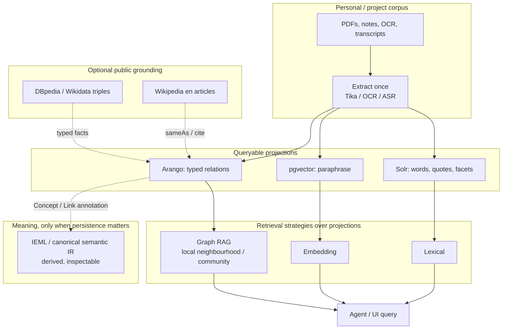
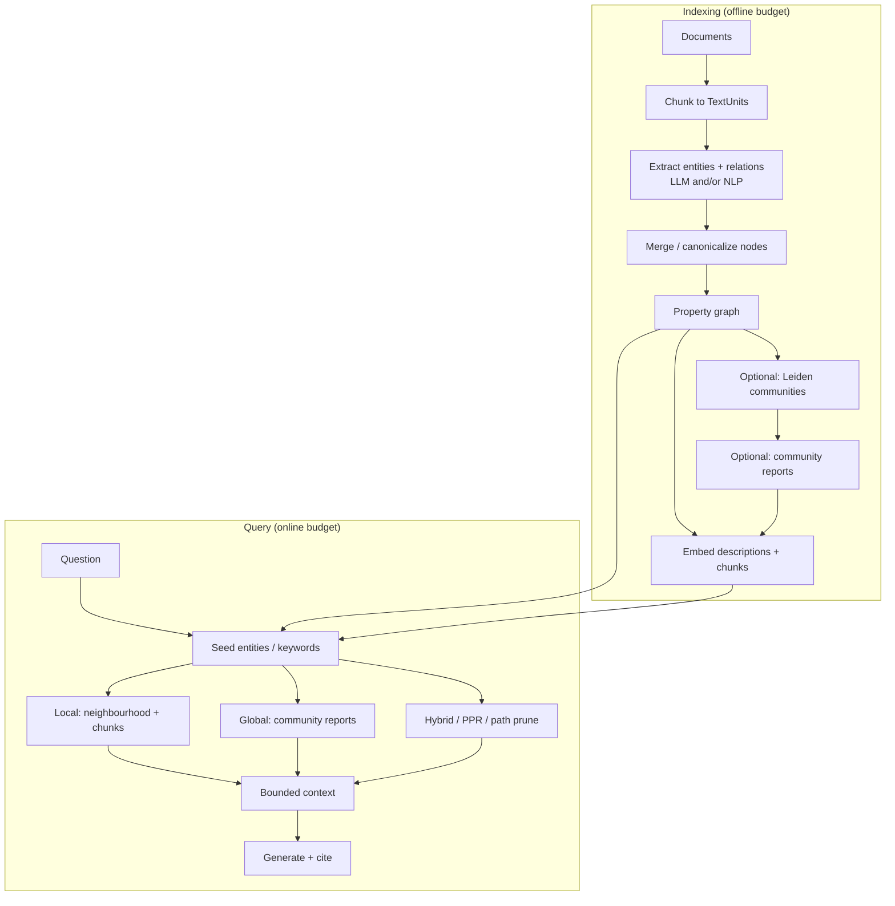
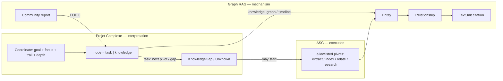
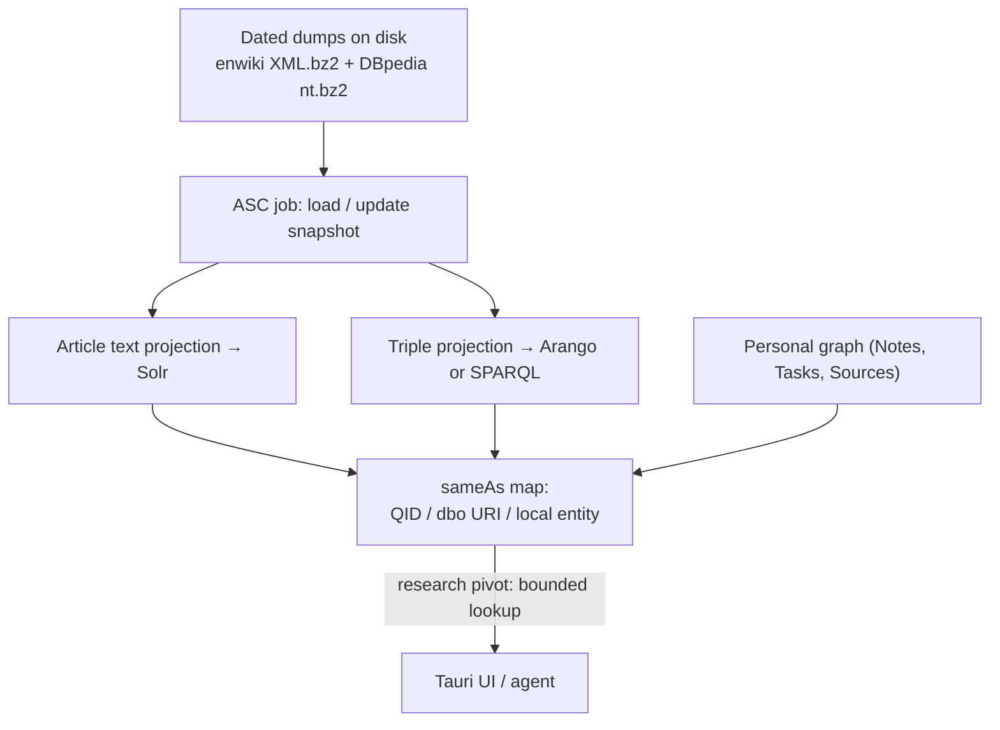
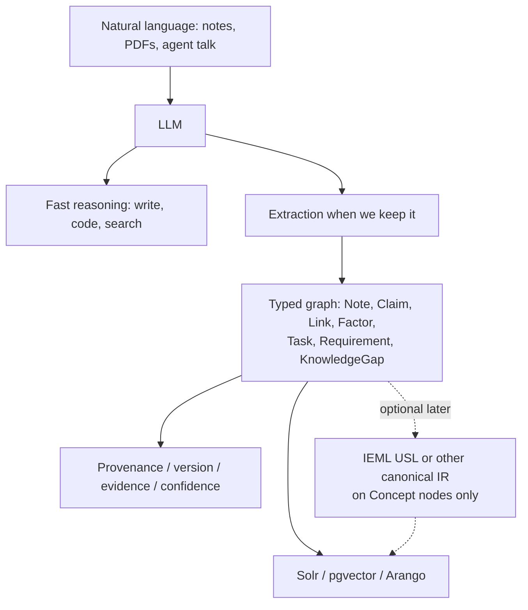
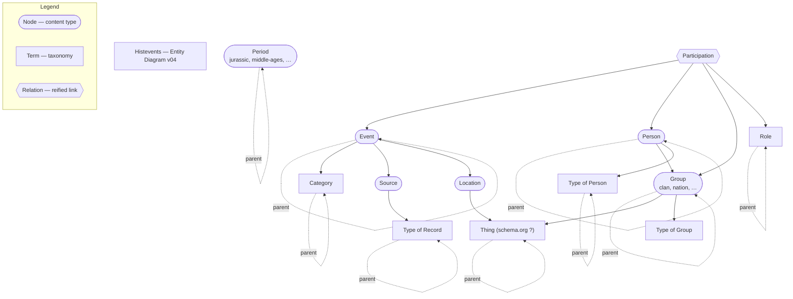
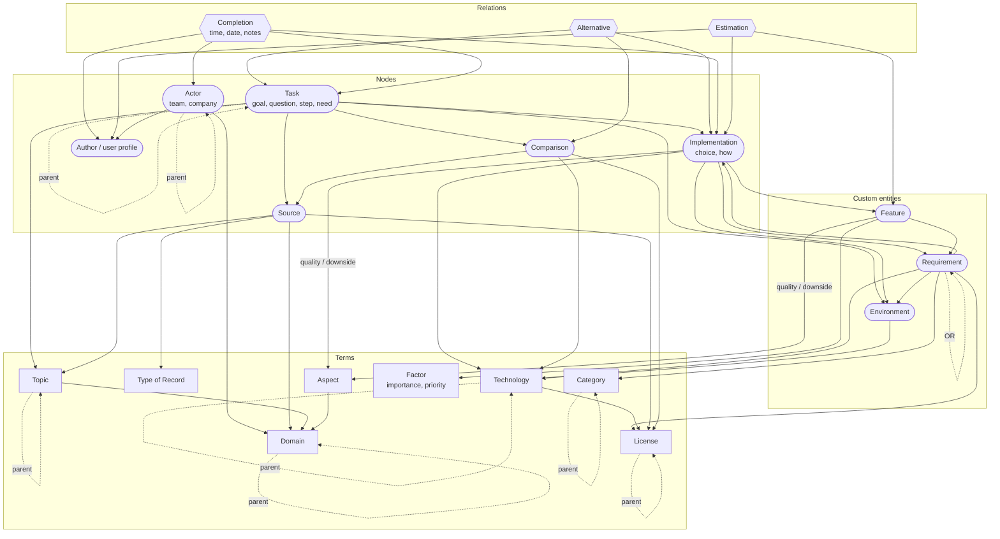
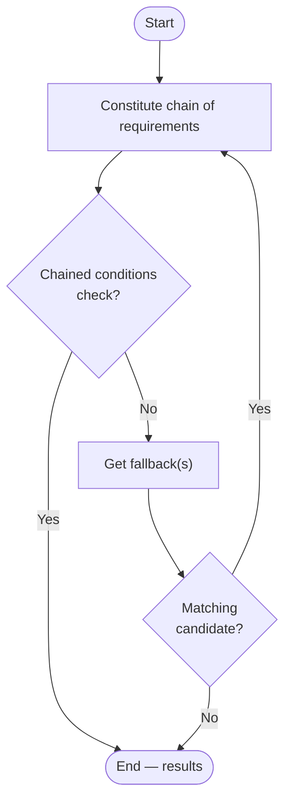
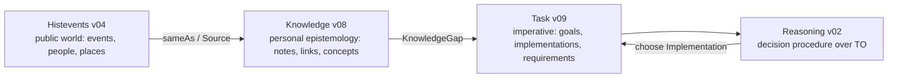
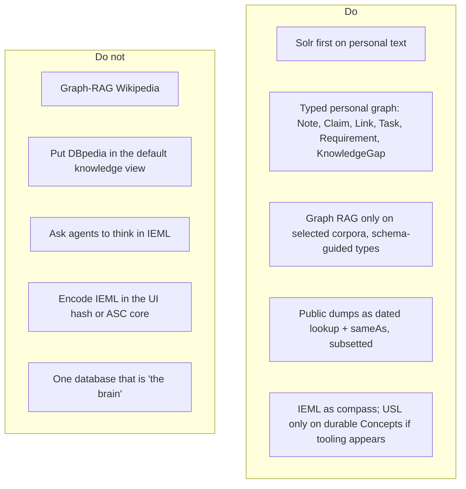

# Graph RAG, Wikipedia / DBpedia, and IEML

- **Date:** 2026-08-18
- **Status:** idea / architecture note (not a spec, not an implementation plan)
- **Scope:** what Graph RAG is and why it exists; whether a local English Wikipedia + DBpedia copy is worth it; whether IEML adds anything beside graphs, dumps, and LLMs; mermaid translations of the 2009–2014 entity diagrams
- **Related:**
  - [14-proposed-architecture.md](14-proposed-architecture.md) — ASC control plane, conceptual graph, LOD / performance governor
  - [17-local-dev-stack-architecture.md](17-local-dev-stack-architecture.md) — extract-once, Solr + pgvector + Arango, paging, cost cliffs
  - [17-ui-design-ideas.md](17-ui-design-ideas.md) — IEML as metaphor, not a hash codec; graph is conceptual
  - ASC: [Projet Complexe 2026 Revival (v2)](../../../../asc/data/ideas/2026/08/Projet%20Complexe%202026%20Revival%20(v2)%20-%20ASC,%20Projet%20Complexe%20and%20Projet%20Complexe%20ASC.md)
  - ASC: [Would IEML really add tangible value for agents](../../../../asc/data/ideas/2026/08/Would%20IEML%20really%20add%20tangible%20value%20for%20agents.md)
  - ASC: [Reasoning without Probabilistic Inference](../../../../asc/data/ideas/2026/08/Reasoning%20without%20Probabilistic%20Inference%20(symbolic%20and%20neural%20layers).md)
  - Origins: [Foundations of Task-oriented & Knowledge-oriented side-projects - v03.docx](assets/Foundations%20of%20Task-oriented%20%26%20Knowledge-oriented%20side-projects%20-%20v03.docx)
  - IEML corpus: Lévy 2023 HAL [hal-04055239](https://hal.science/hal-04055239); [sphere1.pdf](assets/sphere1.pdf); [00-0-sphere3-fr.pdf](assets/00-0-sphere3-fr.pdf); [00-grammaire-ieml1.pdf](assets/00-grammaire-ieml1.pdf); [IEML-Dictionnaire.pdf](assets/IEML-Dictionnaire.pdf)

## Goal of this note

The 2026 revival already decided three things that this note must not undo:

1. **The graph is conceptual**, not necessarily one database (revival v2 §12). Solr, Postgres, Arango, files, and events can all *project* it.
2. **Knowledge is not merely RAG** (revival v2 §26). Claims, sources, evidence, unknowns, and knowledge-gaps are the model. Indexes are mechanisms.
3. **IEML is a compass, not a runtime** ([17-ui-design-ideas.md](17-ui-design-ideas.md): do not encode IEML morphemes in the location hash).

The remaining question is how three *external* knowledge technologies sit on that architecture:

| Technology | What it is, in one line | Layer it would occupy |
|---|---|---|
| **Graph RAG** | Build a graph from *your* texts, then retrieve a *bounded subgraph* (or a community summary) instead of the nearest embedding chunks | Indexer / query strategy over the personal corpus |
| **Wikipedia articles + DBpedia triples (en)** | A frozen public encyclopedia: prose for evidence, RDF for typed facts | Optional *grounding* corpus, not the second brain |
| **IEML** | A constructed language whose *form* is meant to be semantically computable (syntagmatic *and* paradigmatic) | Optional *coordinate system* for concepts, if ever derived |

They are complementary only if each one is used for the job the others cannot do. Mixing them into one “knowledge graph product” is how the project would freeze a bad ontology.

**Rule of thumb:** Graph RAG over *your* notes. Wikipedia/DBpedia as a *lookup*, not as the graph you live in. IEML as a *coordinate*, not as the language agents think in.

---

## 1. Graph RAG

### 1.1 What it is

**RAG** (retrieval-augmented generation) means: before the model answers, fetch relevant text and put it in the prompt. Classic RAG embeds passages, retrieves the nearest neighbours, and generates from those chunks.

**Graph RAG** means: first turn a corpus into an explicit graph (entities, relations, optionally claims and communities), then retrieve a *structured neighbourhood* or a *precomputed summary of a cluster*, not only similar paragraphs.

It is still retrieval. It is not a reasoning engine, not ASC, and not “the knowledge model”. It is a way to choose *which* evidence to show an LLM when the question is about *connections* rather than *keywords*.

Microsoft Research’s pipeline (the one that named the genre) stores a small knowledge model:

| Artifact | Role |
|---|---|
| **Document** | Input file or row |
| **TextUnit** | Chunk (default ~1200 tokens) with provenance |
| **Entity** | Person, place, work, event, … extracted from a TextUnit |
| **Relationship** | Edge between two entities, with a description |
| **Covariate** (optional) | Time-bound claim about an entity |
| **Community** | Hierarchical cluster of entities (Leiden) |
| **Community report** | LLM summary of a cluster, used for *global* questions |

That last pair is the distinctive move. Vector RAG has no object that answers “what is this corpus *about*, as a whole?”. Community reports do.

### 1.2 Why it exists

Vector RAG fails in a few recurring ways that this project already cares about:

| Failure of chunk RAG | What actually happens | What Graph RAG tries |
|---|---|---|
| **Global questions** | “What are the main tensions in this archive?” retrieves random similar paragraphs | Map-reduce over community reports |
| **Multi-hop** | The answer is in A *linked to* B; A and B never co-occur in one chunk | Walk edges, or Personalized PageRank from seed entities |
| **Entity identity** | “Monnin” in three notes is three embedding islands | Merge entities; one node, many TextUnits |
| **Contradiction / variant** | Similarity retrieves *near* text, not *opposing* claims | Typed relation (`contradicts`, `variant-of`) if you extract it |
| **Provenance** | A chunk is a bag of tokens | Entity → TextUnit → Document is an addressable trail |
| **Zoom** | One retrieval granularity | Local neighbourhood vs community vs whole-graph summary |

The 2010s Projet Complexe already had this problem without the name. The knowledge-oriented diagram’s **Link (pattern building)** is “I observed the same idea in several sources and previous notes”. Graph RAG is an *automated, lossy, expensive* attempt to propose those links. The human (or a later agent) still has to accept, type, and version them.

It also exists because **context windows are finite**. You cannot dump 55k files into a prompt. You need a *budgeted* view — which is the same constraint as the performance governor and IPC paging: never send the whole graph.

### 1.3 How it is implemented (the common pipeline)

All serious implementations share the same skeleton. They differ in *how expensive* extraction is, *how* they rank at query time, and *whether* they precompute community summaries.

**Indexing** is the cost cliff (same family as “ASR on every video” in [17-local-dev-stack-architecture.md](17-local-dev-stack-architecture.md)). Entity extraction is typically most of the LLM spend. Incremental updates are the hard part: Microsoft GraphRAG historically wanted a rebuild; LightRAG and temporal stores exist because corpora *change*.

**Query** must stay inside the same budgets as everything else here:

- **Query paging:** neighbours of one node, or one community level, never “all edges”.
- **IPC paging:** bounded JSON.
- **Render LOD:** community report ≈ LOD 0; entities ≈ LOD 1; relations ≈ LOD 2; chunk citations ≈ LOD 3–4.

Microsoft’s **local vs global** search is almost a restatement of knowledge-mode zoom:

| Graph RAG search | Rough equivalent in this UI |
|---|---|
| **Local** | Focus on an entity; trail = neighbours; depth = hops |
| **Global** | Zoom out: cluster / century / domain; read a summary, not every edge |
| **DRIFT** (later MS variant) | Start global, spawn local questions, re-rank |

That is useful. It is not a reason to vendor-lock the UI to Microsoft’s tables.

### 1.4 Leading open-source implementations (2026)

Brief list, not an evaluation harness. Prefer composing *behind a pivot* (`relate` / `research`) over picking a forever-stack.

| Project | Approach | Why it shows up | Caveat for this project |
|---|---|---|---|
| **[microsoft/graphrag](https://github.com/microsoft/graphrag)** | Leiden communities + local/global search; MIT | Named the pattern; clear data model; docs | **Maintenance mode** (2026). Indexing is heavy. Research baseline, not a product you should grow into. |
| **[HKUDS/LightRAG](https://github.com/HKUDS/LightRAG)** | Dual-level (low-level facts + high-level concepts); graph + vectors; cheaper incremental updates | Practical alternative; multimodal via RAG-Anything / Docling / MinerU | Another Python stack. Easy to become the undeclared control plane. |
| **nano-graphrag** | Small GraphRAG-style clone | Useful to *understand* Leiden + reports without MS ceremony | Research quality; not ops. |
| **[circlemind-ai/fast-graphrag](https://github.com/circlemind-ai/fast-graphrag)** | Personalized PageRank at *query* time; less precompute | Fast to prototype; ranking-first | Weaker “what is this archive about?” unless you add summaries. |
| **HippoRAG / HippoRAG 2** (OSU-NLP) | Hippocampal analogy: associative graph + PPR | Strong on multi-hop / continuing memory papers | Not the Compose default. |
| **PathRAG** | Prune to a few *paths* (too much graph context is noise) | Corrects “retrieve the whole neighbourhood” | Complements, does not replace, typed relations. |
| **Graphiti** (Zep) | Temporal knowledge graph, episode-based | Agent memory that *changes*; hybrid temporal search | Closer to “events” than to a bibliographic graph. |
| **Cognee** | ECL pipeline, auto-optimizing graphs | Batteries-included Python | Opaque relative to ASC’s “name the pivot”. |
| **Neo4j GraphRAG** / **LlamaIndex PropertyGraphIndex** | Schema-guided KG + vector + Cypher/AQL-like retrieval | If the graph already lives in a vendor DB | Arango is the closer fit here; do not add Neo4j “just because GraphRAG tutorials use it”. |
| **[vitali87/code-graph-rag](https://github.com/vitali87/code-graph-rag)** | Code structure (file / function / variable) | Already flagged in [17-ui-design-ideas.md](17-ui-design-ideas.md) for *task-mode* zoom into implementations | Later composition only. Not an ASC primitive. |

Comparative benches (e.g. `graphrag-lab`) exist and will keep reshuffling winners. Treat scores as **corpus-dependent**. A bibliographic PDF shelf is not a customer-support ticket dump is not a git repo.

**What “won” in some 2026 commentary is not Graph RAG at all:** agentic *grep/glob* over a code tree (Claude Code-style) can beat vector indexes when names are meaningful. That is an argument for **lexical Solr + filesystem first**, Graph RAG second, on *this* mixed archive.

### 1.5 How it maps onto Projet Complexe

Do **not** identify Graph RAG’s graph with:

- ASC’s computational graph (files, processes, pivots),
- the UI scene graph,
- IEML’s semantic sphere,
- DBpedia.

Those are four different relation systems. The conceptual graph may *project* several of them. The UI queries a page.

Fit to existing engines:

| Graph RAG artifact | Natural home in the local stack | Do not |
|---|---|---|
| TextUnits / citations | Canonical extracted text on disk + Solr | Duplicate full text in the graph DB |
| Entities / relations | Arango (or a projection from YAML sidecars) | Invent a second ontology in the frontend |
| Description embeddings | pgvector, optional | Embed the social-media photo dump |
| Community reports | Generated artifacts (markdown/YAML) that Solr can also search | Recompute on every keystroke |
| Query | Warm engine via ASC; bounded page | `make` per search; stream the whole graph over IPC |

**Typed links already named in the old diagrams** are richer than default Graph RAG extraction (which often yields generic `related_to`):

- Knowledge: similarity, complementarity, variant, contradiction + **Factor** (relevance, importance)
- Task: alternative, quality / downside, requirement AND/OR/fallback
- Revival: `X is suspected`, `X conflicts with Z`, `X is sufficient for decision D`

If Graph RAG is used, **constrain extraction** to that closed vocabulary (schema-guided), or you will drown in mushy edges.

### 1.6 Verdict

Use Graph RAG as **one retrieval strategy** over *selected* personal corpora (notes, papers, dissertations), behind `relate` / `research`.

Do not:

- run it on Wikipedia,
- run it on every social-media caption,
- let LightRAG/MS GraphRAG own identity,
- skip Solr (quotes, names, and filenames still win often).

Default order: **lexical → optional vectors on chosen chunks → graph walk on accepted entities**. Graph RAG is the third rung, for questions that are about *structure*.

---

## 2. Local English Wikipedia articles + DBpedia triples

Two different objects people glue together:

| Dump | What it is | Order of magnitude (2026) |
|---|---|---|
| **English Wikipedia `pages-articles`** | Current article wikitext (not full history) | ~**25 GB** compressed bz2 (`enwiki-*-pages-articles*.xml.bz2`); uncompressed XML is much larger (tens of GB extra on disk once parsed/indexed) |
| **DBpedia (English / “Tiny Diamond” class)** | RDF extracted mainly from infoboxes + mappings to the DBpedia Ontology (DBO) | Historically on the order of **~0.85–1 billion triples** for the English-centric core; full multilingual extraction is ~**20 billion** triples — *not* what “English only” means |
| **Wikidata `latest-all.json`** (comparison, not requested) | Live community KG, not infobox scrape | ~**95–145 GB** compressed JSON; uncompressed ~**1+ TB**. Heavier than DBpedia English. Better maintained. |

“English only” is already a product decision: it cuts language coverage (this project’s theoretical corpus is heavily French: Lévy, Morin, IEML grammar) while keeping the dump in the same *order of magnitude* as the existing mixed personal archive (~85 GB / ~55k files in the 17-08 note).

### 2.1 Advantages

| Advantage | Why it matters here |
|---|---|
| **Grounding / anti-hallucination** | Agents can cite a *local* article and a *typed triple* (`dbo:birthPlace`, `rdf:type dbo:Philosopher`) instead of inventing a biography. |
| **Stable snapshot** | A dated dump is a reproducible world-state. Live SPARQL is a moving target. Matches the need for provenance and “what did we believe in 2026-08?”. |
| **Join key for the personal graph** | `owl:sameAs` / Wikipedia title / Wikidata QID can attach *your* Note about Monnin to the public Person node without scraping wikipedia.org at query time. |
| **Offline / loopback** | Fits the stack rule: engines on `127.0.0.1`, no CORS from the webview, no Wikipedia rate limits, works on a train. |
| **Division of labour** | Articles → Solr (quotes, infobox-unfriendly prose). Triples → Arango or a SPARQL store (typed facts). Same extract-once / fan-out idea, public side. |
| **Schema.org / “Thing” already in Histevents** | The 2010s diagram already pointed Location/Group at **Thing (schema.org ?)**. DBpedia/Wikidata *are* that layer, instead of hand-building it. |
| **English as interlingua for models** | Most local LLMs are strongest in English. A FR note can still *ground* against an EN article if you accept that bias. |
| **License is known** | Wikipedia text is CC BY-SA. DBpedia inherits that world. Better than a random crawl. Share-alike applies if you *publish* derivatives. |
| **Cheap relative to Graph-RAG-ing Wikipedia** | Loading triples is finite CPU. LLM-extracting 6M articles is the cost cliff you must refuse. |

### 2.2 Inconvenients

| Inconvenient | Why it hurts this project |
|---|---|
| **Disk, RAM, backup** | Articles + indexes + triples on a laptop compete with PDFs, photos, and video. On dedi-2025’s HDDs it is feasible; on a seven-year-old laptop it fights the performance governor. Indexes often exceed the dump. |
| **Staleness** | Wikipedia changes daily. DBpedia extraction lags Wikipedia (monthly-ish cycles, mappings quality). Agents will be *wrong in a dated way*. You must version the snapshot as an ASC-visible entity (`dump--enwiki-2026-06-01`). |
| **Infobox noise** | DBpedia is a parse of messy infoboxes. Types are incomplete; predicates collide; long-tail articles are empty. Treat as *candidates*, not ground truth. |
| **English-only gap** | Lévy, Morin, IEML, Foucault notes, and FR Wikipedia articles will not be in the dump. “English Wikipedia as world model” silently provincializes the knowledge-oriented side. |
| **Wrong layer for the second brain** | Revival §26: knowledge is claims, unknowns, gaps. Encyclopedias are *sources*. If DBpedia nodes outnumber personal Notes by 10⁴, the graph view becomes Wikipedia-with-a-sidebar. |
| **Graph RAG on Wikipedia is forbidden-cost** | Community detection + LLM summaries over EN Wikipedia is an institutional budget, not a side project. Use the *already extracted* triples; do not re-extract. |
| **Query shape** | SPARQL/AQL over a billion triples needs planning, paging, and a warm engine. Offset pagination will die. Same “never dump the graph to the webview” rule, stricter. |
| **DBpedia vs Wikidata** | Wikidata is the living public KG. DBpedia is the *Wikipedia-shaped* extract. Choosing DBpedia for nostalgia (Linked Data 2010s) may duplicate a worse Wikidata. If the goal is “typed facts about things that have Wikipedia pages”, Wikidata subsets (or DBpedia *mappings* only) may be enough. |
| **License share-alike** | Publishing a site/ebook that embeds Wikipedia text pulls CC BY-SA onto those pages. The `publish` pivot must know that. |
| **Identity mess** | Three IDs for one person (Wikipedia title, DBpedia URI, Wikidata QID) plus your Author node. Without a deliberate `sameAs` policy, Graph RAG extraction will mint a fourth. |
| **Not multimodal** | Dump is text/RDF. It does not help photos, ASR, or sheet music. The heterogeneous pipeline stays. |
| **Legal/ethical scrape hygiene** | Use official dumps, not a crawler. Still a large mirrored copy of a third-party corpus; keep it out of git. |

### 2.3 How it should sit (if at all)

Recommended stance, aligned with extract-once:

| Strategy | Verdict |
|---|---|
| **Full EN Wikipedia + full DBpedia English in Arango as the main graph** | No. Swallows the personal graph. |
| **Kiwix / offline Wikipedia for human reading only** | Cheap. Does not give triples. Fine as a reader, not as a KG. |
| **Live SPARQL (DBpedia or Wikidata)** | Fine for occasional lookup. Bad for reproducible agent runs; needs network; not ASC-local. |
| **Subset by need** | Yes. Load *only* types you already have in the old diagrams: Person, Place, Event, Work, Organization. Or a watchlist of QIDs that appear in *your* notes. |
| **Articles in Solr, triples in a dedicated store, `sameAs` into Arango** | Yes if the snapshot is justified. Keep Wikipedia nodes out of default graph views. |
| **Wikidata truthy subset instead of DBpedia** | Often the better public KG in 2026. Decide explicitly; do not silently ship both. |

### 2.4 Verdict

A **dated, English, subsetted** copy is useful as a **grounding library**: Solr for article passages, a triple store for typed facts, `sameAs` into the personal graph.

A **full** local Wikipedia+DBpedia as the knowledge-oriented default view is a category error. It recreates a web browser with worse UX and no KnowledgeGap.

Do this only as an ASC *job* with a named snapshot entity, loopback ports, and a query allowlist (“lookup entity”, “expand types”, “get abstract”). Never as Graph RAG indexing target.

---

## 3. IEML as a complementary tool

Sources for this section: Lévy, *Calculer la sémantique avec IEML* (2023, HAL); *La sphère sémantique*; the IEML grammar and dictionary PDFs; the 2010s [IEML-Analysis-v07](assets/IEML-Analysis-v07.png); and the 2026 memos on agents.

### 3.1 What Lévy is actually claiming

IEML (**Information Economy MetaLanguage**) is a **constructed language** meant to have:

- the **expressive power of a natural language** (recursive phrases, roles, modalities, narrative),
- **computable linguistic semantics**, including the part linguistics never fully mathematized: the **paradigmatic** axis (substitution, matrices of related concepts), not only the syntagmatic tree (phrase structure).

Concrete pieces (2023 paper):

| Piece | Claim |
|---|---|
| **Alphabet** | Six primitives (classically *U, A, S, B, T, M* — void/virtual/actual, sign/being/thing; notations vary by document generation) |
| **Dictionary** | ~**3000** words, each in **exactly one paradigm**; words defined by phrases using other words (circular interdefinition, as in natural language) |
| **Phrases** | A syntagmatic function with a fixed set of roles; phrases may belong to *several* paradigms, freely created |
| **USL** | *Uniform Semantic Locator* — canonical form, URI-compatible, unique |
| **Graphs** | Links woven from *syntactic conditions*, producing knowledge graphs / hypertexts |
| **Literals** | Proper names, URLs, GPS, dates sit in `<references>` — *not* IEML-computable; contrast with RDF URIs, which Lévy calls rigid designators whose *string form* carries no semantics |
| **Editor** | Open-source demonstrator: write with FR/EN words, parser produces IEML. Humans should not have to see the raw code |

Lévy’s applications, in his order: (1) **metadata for digital memory** / collective intelligence, (2) **neurosymbolic AI** (IEML as protocol between humans, between humans and machines, and between machines), (3) **digital humanities** as a semantic coordinate system.

He is explicit that raw IEML is for machines; people see natural language, diagrams, icons. That already agrees with “do not put IEML in the hash”.

The older *Sphère sémantique* / grammar stack is heavier: rhizomes, circuits (paradigmatic, syntagmatic, chronotopic, hypertextual), *cités*, algebraic operations (rotation, powerset, partition). [IEML-Analysis-v07](assets/IEML-Analysis-v07.png) is a 2010s attempt to *entity-diagram* that stack. It is a research map, not a Compose service.

### 3.2 Why this was attractive to Projet Complexe in the 2010s

The Foundations doc already names the wound Graph RAG still has not healed:

- knowledge is a **living process** (loops, decay when unattended),
- storing it forces **classification**, which forces **organization** (“architecting my mind”),
- **information overload**: relating everything becomes infinite digression — hence the need for focus (“just enough research”),
- opinions **change** → versioning,
- **naming things** (epistemology, topic maps, semantic web),
- unity of the two orientations: knowledge vs tasks are *complémentaire, concurrent et antagoniste* (Morin).

Lévy and Morin are listed there as the *corpus de référence*. IEML was the hope that classification could be **computable** rather than a pile of Drupal taxonomies.

DBpedia/RDF answered *reference* (“this URI denotes Rodin”). IEML claims to answer *sense* (“sculptor” as a position in a paradigm, transformable by algebraic operations). Graph RAG answers *corpus structure* (“in *my* notes, Rodin is linked to these claims”). Three different questions.

### 3.3 The 2026 agent question: still mostly redundant, in a precise sense

The memo [Would IEML really add tangible value for agents](../../../../asc/data/ideas/2026/08/Would%20IEML%20really%20add%20tangible%20value%20for%20agents.md) remains the right split:

**LLMs already have a latent IEML** — paraphrase, analogy, taxonomy induction, ontology mapping — without a constructed language.

The original 2010 premise (“machines have no semantics”) is false.

What remains is the difference between **implicit** and **explicit** semantics:

| Implicit (LLM / embeddings) | Explicit (IEML / RDF / typed graph) |
|---|---|
| Cat ≈ feline ≈ pet | Inspectable path through intermediate concepts |
| Model-dependent | Can survive a model upgrade |
| No persistent object (Monnin) | Addressable USL / URI / entity id |
| Flow-level intervention (Meadows) | Information-*structure* intervention |

IEML is unnecessary for summarization, coding, email, brainstorming, and RAG over a few thousand documents.

It becomes interesting when you must ask, years later:

> Is today’s concept X the same as what we called Y in 2016?

That is conceptual evolution, not nearest-neighbour search.

### 3.4 Advantages of IEML *as complement* (not as replacement)

| Advantage | Complement to Graph RAG | Complement to Wikipedia/DBpedia |
|---|---|---|
| **Canonical address in meaning-space** (“compass”) | Graph RAG nodes are *strings extracted from your prose* (“resilience”). IEML would say *which* resilience. | DBpedia `dbr:Resilience` is a Wikipedia page, often a disambiguation mess. USL aims at the *concept*, not the article. |
| **Paradigmatic computation** | Community reports are statistical clusters. IEML paradigms are *generated matrices* (roles × variables). You can ask for symmetries, not just “related entities”. | RDF `skos:broader` is asserted. IEML claims some relations *follow from form*. |
| **Cross-language** | Extraction in EN vs FR yields different entity strings. | EN dump misses FR sense. IEML dictionary is bilingual by design (editor in FR/EN). |
| **Survives wording and model swaps** | Re-extracting with a new LLM reshuffles the graph. A stored USL need not. | Wikipedia titles rename; redirects help, but the *sense* still sits in prose. |
| **Interop protocol between agents** | Agents today pass JSON English (`{"goal":"find papers"}`). A semantic object could be transformed without re-parsing. | Public KGs do not know *your* task vocabulary (Requirement, KnowledgeGap). |
| **Literals vs concepts** | Graph RAG mixes “Rodin” and “sculptor”. Lévy splits them: name in `<Rodin>`, concept in the phrase. | DBpedia also splits (resource vs infobox text), but URIs do not encode the split in their *shape*. |
| **Meadows primitives as a paradigm** | You can Graph-RAG the word “stock”. You cannot *rotate* it toward “flow” as an algebraic operation unless the language supports it. | Wikipedia has articles; it does not have a generated systems-theory matrix. |
| **Metadata ethics** | Lévy: semantic metadata are political (who organizes digital memory). A closed IEML layer is at least *inspectable*. | GAFAM KGs and Wikidata are inspectable in theory, ungovernable in practice for a personal stack. |

The durable part may not be the language. It is the **checklist** already isolated in the 2026 memo:

> compositionality, computability, canonical representation, invertibility where possible, stable identifiers, semantic interoperability.

Those can be satisfied by RDF, property graphs, or a tiny typed IR. IEML is one proposed solution to that spec.

### 3.5 Inconvenients

| Inconvenient | Consequence |
|---|---|
| **Redundancy with LLMs for most agent work** | Complexity for no daily gain. Matches “where IEML is unnecessary”. |
| **Tiny ecosystem vs RDF / Wikidata / Arango** | Parsers, editors, SPARQL, dump tooling, sameAs graphs already exist for DBpedia. IEML has a demonstrator editor and papers. |
| **Human authoring failed historically** | Lévy now says LLMs should translate. Quality of *that* translation is unproven; garbage USLs would be a false sense of precision. |
| **Third ontology risk** | Personal graph + DBpedia + IEML + Graph RAG entity titles = four names for one idea. Revival: do not freeze a giant schema. |
| **Dictionary scale** | ~3000 words vs millions of Wikipedia topics. Coverage of *your* research (ecological redirection, ASC pivots, Drupal history) will be sparse unless you extend the dictionary — i.e. become an IEML ontologist. |
| **IEML-Analysis-v07 complexity** | The 2010s map (circuits, cités, bulbes, rhizomes) is exactly the “giant graph schema” the revival forbids as a first milestone. |
| **Not ASC, not the UI codec** | Putting morphemes in hashes or as ASC primitives contaminates the computational vocabulary with a linguistic theory. Already rejected. |
| **Research software** | Finite-state operations, rhizome algorithms, Intlekt editor: a second research stack beside Compose. Ops cost without users. |
| **License friction** | Lévy 2023 HAL is CC BY-NC-ND. The project’s code is GPLv2 / content CC BY 4.0. You can *read* the theory; you cannot casually fork that paper into a productized language runtime. |
| **Does not solve KnowledgeGap** | IEML can name a concept. It cannot tell you the concept is *unknown*, *insufficient for decision D*, or *out of budget*. That is the revival’s epistemic layer, missing from IEML-as-language. |
| **Does not bind conditions to implementations** | The Minimal Reasoning Model (requirements, fallbacks, environments) is a *task* calculus. IEML could annotate it; it does not replace `AND`/`OR`/`fallback` chains. |
| **False precision** | A USL looks more scientific than a Note. If the mapping is an LLM guess, you have laundered a probability into an identifier. |

### 3.6 How to use it without implementing it (recommended)

Same hybrid as the 2026 memos: **LLM remains the cognitive engine; a symbolic layer is derived only when persistence matters.**

Practical rules:

1. **Day one:** typed graph + uncertainty + KnowledgeGap. No IEML runtime.
2. **If a Concept keeps being paraphrased across years:** then consider a canonical id. That id may be a USL, a Wikidata QID, or an ASC-safe slug. Choose by *tooling*, not by loyalty.
3. **Never** ask agents to “think in IEML”. Translate out, manipulate, translate back — if at all.
4. **If IEML is tried:** a Projet Complexe ASC pivot (`relate` / `annotate-concept`), same as code-graph-rag. UI still sees coordinates and titles.

Lévy vs this architecture, honestly:

| Lévy 2023 | Projet Complexe 2026 |
|---|---|
| IEML as protocol of digital memory | ASC as protocol of *execution*; Projet Complexe as *interpretation* |
| USL as URI | Entity ids + Wikipedia/QID `sameAs` already cover reference |
| Neurosymbolic integration | LLM + graph + vectors, IEML optional |
| Collective-intelligence encyclopedia | Personal second brain + optional public grounding |
| Algebraic paradigms | Performance LOD + genericity zoom (related *intuition*, different mechanism) |

The overlap that *is* worth stealing: **semantic metadata as first-class**, **canonical form**, **do not let embeddings be the only memory**.

### 3.7 Verdict

IEML adds **tangible value only as a design compass and, later, as an optional annotation on durable Concept nodes**.

It does **not** replace Graph RAG (corpus structure), DBpedia/Wikidata (reference), Solr (words), or the task/knowledge killswitch (control).

Implementing the language before the typed personal graph would be a 2012-shaped mistake with 2026 compute bills.

---

## 4. Legacy entity diagrams → mermaid

These diagrams (Histevents v04, Knowledge-oriented v08, Task-oriented v09, Minimal Reasoning Model v02) are the **pre-ASC, pre-LLM** data model. They still name the objects Graph RAG would extract, DBpedia would ground, and IEML would try to coordinate.

Shared legend (all four):

| Shape in draw.io | Meaning | Mermaid treatment below |
|---|---|---|
| Yellow ellipse | **Node** — content type | `([node])` |
| Blue rectangle | **Term** — taxonomy / vocabulary; often a `parent` loop | `[term]` |
| Pink ellipse | **Relation** — reified link with its own data | `{{relation}}` |
| Orange ellipse (task diagram only) | **Custom entity** — slice of an entity for implementation | `([custom])` |
| Arrow | Optional 1–1 or 1–n **reference** | `-->` |

They are **not** the 2026 storage architecture. They are the **interpretive vocabulary** Projet Complexe still owes the UI. Missing in all four, and required now: **KnowledgeGap / Unknown**, **confidence**, **provenance**, **agent**, **pivot**.

Originals: PNG + draw.io SVG in [`assets/`](assets/).

### 4.1 Histevents — Entity Diagram v04

Historical-events domain: a **public-grounding-shaped** graph. This is what a *subset* of Wikipedia/DBpedia is for (`Event`, `Person`, `Place`, `Group`), not what your research journal is.

**2026 reading:** `Participation` is Graph RAG’s Relationship (needs its own data: role). `Thing (schema.org ?)` is the DBpedia/Wikidata join. `Period.parent` is knowledge-mode *time zoom* (epoch → century → year) already described in the UI note. Do not LLM-extract all of Wikipedia to fill this; attach QIDs.

### 4.2 Knowledge-oriented Entity Diagram v08

Personal epistemic model. This is the **second brain**. Graph RAG should *propose* `Link`s; it must not own them.

Notes from the original:

- **Assembly:** research journal, essay, dissertation; topics/domains/concepts/authors/sources may be *deducible* (check collaborative works).
- **Link:** observations across several sources and previous notes (regrouping).
- **Domain:** *groupement arbitraire de sujets* (critique sociale, philo, …) — not a natural kind. IEML people will want to replace this with a paradigm; keep it arbitrary unless a Concept is durable.

**2026 additions that belong here, not in IEML:** `Claim`, `Evidence`, `KnowledgeGap`, `confidence`, `valid_at`.

### 4.3 Task-oriented Entity Schema v09

Imperative model: goals, implementations, requirements, fallbacks. This is what agents *execute*. Graph RAG helps only when a task needs a case study or a comparison.

Original annotations worth keeping:

- **Implementations are case studies**, including **how not to** (record failures).
- **Requirements** generate **chains of conditions**. `OR` groups are **fallback** mechanisms for recommending implementations from features / environment / technology.
- **Alternative ≠ variant.** A variant can be an alternative; an alternative need not be a variant. “Variant” was dropped as less useful in a goal-directed context.
- **Comparisons** are pages: side-by-side analysis of any connected entities (directly: terms/sources; indirectly: tasks/implementations in an alternative relation).

**2026 reading:** this *is* the Minimal Reasoning Model’s data. The killswitch attaches here: Task discovers a KnowledgeGap → suspends → research pivot → resumes or reports `knowledge unavailable`.

### 4.4 Minimal Reasoning Model v02

Objective (original): bind **conditions** (and factors / priorities) to data for decision-making. Example: given requirements (environment, need a page callback yes/no, must/must-not), find the **closest match** among known implementations.

Simplification: **explicit chain of dependence** for requirements of implementations.

Open todo from the original: maybe skip a `Condition` entity and point Requirement straight at Technology — but then you lose single-responsibility for “elements of evaluation”.

**Entity side:**

Note: requirements may be conditional: Implementation requires **X and (Y or Z)**.

**Procedure the data model should generate:**

When looking for fallbacks: mechanisms for discovering other alternatives — **tolerance, scope, relevance, value**. That tuple is the ancestor of Factor + the performance governor + the research budget on KnowledgeGap.

### 4.5 What the four diagrams are, together

| 2010s object | 2026 mechanism |
|---|---|
| Source / Assembly / Note | Files + Solr + citations |
| Link + Type of Link + Factor | Schema-guided Graph RAG *proposals*, then human/agent-accepted Arango edges |
| Concept / Domain / Topic | Personal taxonomy; optional QID; optional IEML USL *later* |
| Event / Person / Location / Thing | Wikipedia/DBpedia/Wikidata subset |
| Task / Implementation / Requirement / Fallback | Agent control + killswitch; not an LLM latent graph |
| Comparison | Explicit pages (already a content type), not a cosine |
| Participation / Completion / Estimation | Reified relations with data — Graph RAG “covariates” |

---

## 5. Combined stance (for later pivots)

**Confidence:** the mapping to the existing architecture is high. Dump sizes and Graph RAG “winners” will move; the layering should not.

---

## Open choices (not decided here)

- Wikidata subset vs DBpedia English vs both, for `sameAs`.
- Whether community reports are first-class Notes (knowledge-oriented) or generated sidecars Solr can search.
- Closed vocabulary for Graph RAG extraction: reuse Type of Link from v08, or a smaller revival set (`supports`, `conflicts`, `unknown`, `sufficient-for`).
- Whether Requirement/Condition stay distinct (v02 todo) once agents generate fallback chains.
- If a Concept ever gets an IEML USL: store it as annotation, never as the only id.

Those can stay experiments behind `index` / `relate` / `research`. They do not change the rule:

> **ASC owns execution. Projet Complexe owns interpretation. Graphs, dumps, and IEML are mechanisms and coordinates — not a second control plane.**
