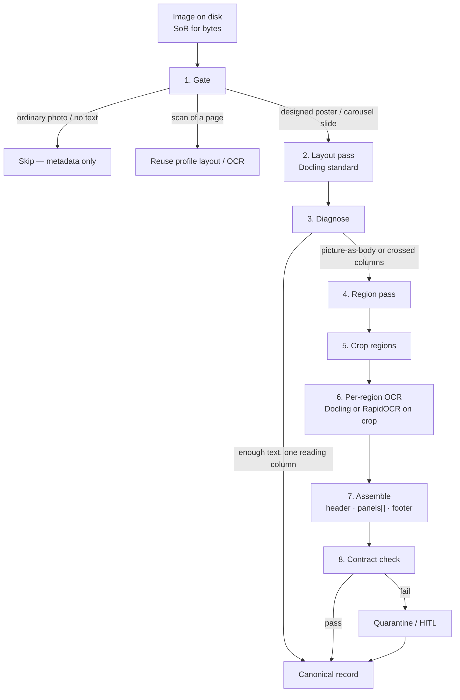

# OCR notes: posters, carousels, nested boxes

- **Date:** 2026-08-30
- **Status:** idea / architecture note (not a spec, not scheduled work)
- **Scope:** how `extract` should treat **designed images** (social infographics, carousels, two-panel posters) whose argument lives *inside nested boxes*, not in a PDF text layer
- **Related:**
  - [17-local-dev-stack-architecture.md](17-local-dev-stack-architecture.md) (`extract` profiles: Docling default, jobs not daemons)
  - [18-graph-rag-wikipedia-db-pedia-ieml.md](18-graph-rag-wikipedia-db-pedia-ieml.md) (capability vs Implementation)
  - ASC: [Revival v3](../../../../../asc/data/ideas/2026/08/Projet%20Complexe%202026%20Revival%20(v3)%20-%20ASC,%20Projet%20Complexe%20and%20Projet%20Complexe%20ASC.md) §10 (extract profiles, MinerU as metered `layout`)
  - ASC: [Revival v5](../../../../../asc/data/ideas/2026/08/Projet%20Complexe%202026%20Revival%20(v5)%20-%20ASC,%20Projet%20Complexe%20and%20Projet%20Complexe%20ASC.md) (extract-once, modest hardware, closable Technologies)
  - ASC: [Social media Literature Review](../../../../../asc/data/ideas/2026/08/Social%20media%20Literature%20Review.md) (carousel OCR already treated as a *reading* of slides, not an import of the genre)

This note records 2026-08-30 experiments on one representative slide, the tool survey that followed, and a **multi-step extract design**. It does not change engine identity: Docling on CPU remains the default `layout` Implementation for mixed personal files. Posters are a **document class** with their own profile, not a reason to replace Docling with MinerU or a VLM.

---

## 1. The problem (why `layout` on a PDF is the wrong picture)

Revival v3 already split `extract` into profiles (`plain`, `layout`, `biblio`, `table`, `figure`). That split assumes a **page**: columns of prose, optional tables, figures that can be cropped and captioned. Social and “AI carousel” images are a different object.

Typical structure (observed on a 2026 educational slide about sliding-window attention / attention sinks):

```text
1 column — header paragraph (full width)
2 columns — sibling panels (before / after), each with nested boxes:
            token chips, labels under chips, “MODEL OUTPUT” wells
1 column — footer punchline
```

The argument is **in the diagram**, not in the caption. Nested boxes are not a table and not a figure caption. A layout model trained on papers will often do one of two things:

1. Classify the whole diagram as **one `picture`** and skip inner text in the markdown export.
2. OCR the inner words but **sort left-to-right at the same height**, merging the two panels.

Corpus context (from note 17, anonymized): a social-media export on the order of **~25 GB / ~28k files**, mostly photos. OCR on every thumbnail is the same cost cliff as ASR on every video. The social-media literature review already refused to OCR all 2 597 saved slide images; it gated on educational infographics. This note is about **that gated class**, not the 17k ordinary photos.

Hardware this house assumes: Debian laptop, i7-8750H, 32 GB RAM, **GTX 1050 Mobile 4 GB (Pascal)**. Indexes are the intelligence. GPU VLMs ≥1B belong on a later Tiiny (stage 2), not as stage-1 identity.

---

## 2. What we tried (same file, 2026-08-30)

Source: one JPEG infographic (two outlined panels, nested token boxes, footer “one token evicted.”). Tools already on the laptop: `docling` (pipx), RapidOCR / PP-OCRv6. MinerU was **not** installed. Granite-Docling ran as Docling’s `--pipeline vlm` (preset `granite_docling`, default).

Working directory for artefacts: `/tmp/docling-infographic*`, `/tmp/granite-docling-infographic`. Re-runnable from the terminal (CLI = GUI).

### 2.1 Docling standard pipeline (`--pipeline standard`, CPU)

Markdown export (~83 s first run, models already cached afterwards):

- Header paragraph: **correct** (`never earned`, en-dash preserved).
- Two panels: **dropped** as `<!-- image -->`.
- Footer: scrambled to `token evicted. one`.

So the failure is not “Docling mixed the two columns in markdown.” Markdown never saw the columns. The layout net labelled the middle as a picture and the exporter did not dump picture children.

### 2.2 Docling `--ocr-mode full_page`

Markdown: header still correct; footer becomes `one token evicted.` (good); middle still `<!-- image -->`.

JSON (`DoclingDocument`): the inner strings **are** there, as children of `#/pictures/0` (a **single** picture). Reading order is the horizontal merge we feared:

1. `CONTEXT WINDOW` then `CONTEXT WINDOW` again (both panel headers).
2. Token chips from both panels in one stream (`The`, `cat`, `sat`, … then the right panel’s chips).
3. `(evicted)`, `PINNED`, `(TOKEN #1)` after both chip rows.
4. `MODEL OUTPUT` then `MODEL OUTPUT`.
5. `fluent.` interleaved with the red-panel garbage (`xq7!@# m9$% zt&*q12^`).
6. Left fluent sentence split across those lines (`The cat sat on the mat and` / `looked out the window.`).

OCR engine here is RapidOCR wrapping **PP-OCRv6** (same family MinerU’s pipeline uses for glyphs). Character quality on the gibberish panel is fine enough to copy the slide’s fake tokens. **Layout clustering** is what fails.

### 2.3 Granite-Docling (`--pipeline vlm --vlm-model granite_docling --device cpu`)

~258M VLM, already a Docling preset. ~101 s on CPU for this JPEG. DocTags:

```text
<text>…corrupting them with weight they never collapsed. The model doesn't degrade. It collapses.</text>
<picture>…left panel…<other></picture>
<picture>…right panel…<other></picture>
```

JSON confirms two pictures with left edges ~48 vs ~414 (sibling panels). That is the **region split** standard Docling did not do.

Costs:

| Piece | Result |
|-------|--------|
| Header | Hallucination: `never earned` → `never collapsed` (contaminated by the last sentence). |
| Two panels | Empty pictures (`<other>`). **No inner OCR.** |
| Footer | Missing. |

Markdown is the damaged paragraph plus two `<!-- image -->` / `Other` placeholders.

**Verdict:** Granite-Docling is a **region detector** on this class of file, not a nested-box reader. It is useful as a *split*, not as the extract.

### 2.4 Comparison (same JPEG)

| Implementation | Header | Two panels as regions | Inner nested text | Footer | Reading order of panels |
|----------------|--------|------------------------|-------------------|--------|-------------------------|
| Docling standard, md | Good | One picture | Lost in md | Scrambled | n/a |
| Docling `full_page`, md | Good | One picture | Lost in md | Good | n/a |
| Docling `full_page`, JSON | Good | One picture | Present | Good | **Merged left↔right** |
| Granite-Docling VLM | Hallucinated | **Two pictures** | Absent | Lost | Split, empty |

No single one-shot tool both split the panels *and* read the nested labels.

---

## 3. MinerU is the wrong first complement (for this class)

Revival v3 already placed [MinerU](https://github.com/opendatalab/MinerU) as a **metered `layout` Implementation** for hard *scholarly* pages (tables, formulas, CJK), not as identity, not as a crawl of 4k PDFs.

MinerU’s published lead is OmniDocBench (document pages). Pipeline OCR is PP-OCRv6 — same glyph family as Docling’s RapidOCR. The accurate path is a VLM that wants **Volta+ GPU and ~8 GB**; this laptop is Pascal 4 GB. CPU `pipeline` can exist as a slow experiment.

For **ordinary social photos**, MinerU is the wrong job (scene text vs document parse). For **this poster**, MinerU *might* segment columns better than Docling’s single picture — that is an eval, not a guarantee. Nested infographic chrome (chips, pins, twin “MODEL OUTPUT” wells) is not what OmniDocBench measures. Standing up MinerU before a gold dozen of *these* slides would freeze a heavy Technology on a hypothesis.

Never run Docling + MinerU + Granite + Marker on the same file “to be safe.” One path per class, then Fallback.

---

## 4. Open-source tools that actually target nested / multi-region layout

None is a “carousel nested-box product.” Two families exist.

### 4.1 Hierarchical layout (detect coarse regions, then elements)

**[PaddleOCR PP-StructureV3](https://github.com/PaddlePaddle/PaddleOCR)** is the one that names the bug. Two stages:

1. **PP-DocBlockLayout** — large structural regions (newspaper/magazine articles, multi-column blocks).
2. Fine layout — titles, paragraphs, figures, tables *inside* each region.

Reading order: sort regions, then sort inside a region (enhanced XY-cut, `use_region_detection=True`). Apache-2.0. CPU-possible. A [Docling plugin](https://github.com/DCC-BS/docling-pp-doc-layout) can swap Docling’s layout net for PP-DocLayout-V3.

This matches **sibling panels** (left vs right). Token chips *inside* a panel can still flatten.

### 4.2 End-to-end VLMs that emit structure

They look at the poster instead of sorting OCR lines.

| Tool | Size | What it is for | On this laptop |
|------|------|----------------|----------------|
| **Granite-Docling / SmolDocling** | ~258M | DocTags with locations; IBM mentions slides/infographics | **Ran.** Splits panels; does not read them. Header hallucination. |
| **[dots.mocr](https://github.com/rednote-hilab/dots.mocr)** | ~3B | Layout JSON + reading order; charts/diagrams as SVG | GPU / Tiiny. Not stage 1. |
| **[Surya 2](https://github.com/datalab-to/surya)** | 0.65B | Layout labels + reading-order index | Maybe later; **RAIL-M** weights (same licence class v3 flagged for Marker). |
| **[olmOCR](https://github.com/allenai/olmocr)** | ~7B | Markdown reading order across columns, figures, insets; brochures in the mix | GPU. Overkill for stage 1. |

Comic-panel detectors and HierText-style scene-text models are cousins, not drop-in `extract` Implementations.

**Geometric crop** (split on the vertical gap, or on Granite/PP-Structure boxes, then OCR each crop) is not a neural product. It is the cheap Fallback that *would* have fixed the JSON merge on this file without a second stack.

---

## 5. What “better extract” has to mean for this class

Success is not a higher OmniDocBench score. For a two-panel poster, a gold item passes if:

1. Header paragraph is verbatim (no VLM synonym / contamination).
2. Panels are **separate regions** (not one picture, not interleaved `CONTEXT WINDOW` × 2).
3. Nested labels stay attached to their chip (`PINNED (TOKEN #1)` under the green `The`, `(evicted)` under the empty slot).
4. Twin wells are not merged (`fluent.` must not sit next to `xq7!@#`).
5. Footer punchline is present and ordered last.
6. Locale of the source is kept (fr / en / pt). No English-only store.
7. Original JPEG remains SoR for **bytes**. Extract is a projection with Technology hash, confidence, and a pointer back to the file.
8. Garbage (failed OCR, VLM hallucination) is quarantined (`extract.failed` / KnowledgeGap), not stuffed into Meilisearch.

Markdown export that replaces the diagram with `<!-- image -->` is a **failed extract** for this class, even if JSON secretly has the words.

---

## 6. Proposed multi-step design

One pivot: `extract`. New **profile** (name bikeshed: `poster` / `carousel` / `infographic`). Implementation is a **pipeline of named steps**, each closable. Do not make Granite, Paddle, or MinerU the identity of `extract`.



Each step is an ASC hook-shaped job (`pre_extract/poster`, inner scripts). The UI and the model only see `extract` with `profile=poster`.

### Step 1 — Gate (do not OCR the social dump)

Cheap classifier **before** any layout VLM (Gazit: triage is not a 70B). Features that are enough for v1:

- Source tree / sidecar (TODO "document - image - infographic" entity ?).
- Aspect ratio (4:5 / 1:1 slide vs 3:2 photo).
- Optional tiny heuristic: many axis-aligned rectangles (poster chrome) vs few (photo).
- User allowlist: “this folder is educational infographics.”

Labels:

| Gate | Next profile |
|------|----------------|
| No useful text | Skip. Store path + mtime only. |
| Searchable PDF / EPUB | `plain` / `layout` as today. |
| Scan of a *page* | `layout` + OCR worker. |
| Designed slide / carousel / two-panel poster | **`poster`** (this pipeline). |
| Scene text in a photograph (sign, meme, UI chrome) | Later: scene-OCR Implementation (PaddleOCR), not MinerU. |

Cost cliff: default is **skip**. Indexing is opt-in per tree, as note 17 already required.

### Step 2 — Layout pass (Docling, one shot)

Run existing Docling **standard** on CPU. Write:

- markdown (what humans will pack),
- JSON `DoclingDocument` (what we diagnose),
- Technology hash (Docling version + OCR engine + mode).

Do **not** start Granite or PP-Structure yet. Most notes and many simple slides will be good enough here.

### Step 3 — Diagnose (the router)

Inspect the JSON, not the markdown.

Signals that the poster pipeline must continue:

- Body is essentially `text + one huge picture` (or `text + picture + caption` with the caption under-ordered).
- Picture children exist but reading order **interleaves** two x-clusters (two `CONTEXT WINDOW` at similar y; two `MODEL OUTPUT`).
- Exported markdown contains `<!-- image -->` while the picture has many text children (export loss).
- Character count of body text ≪ character count of picture children.

If none of those fire: stop. Canonical record = Docling output. This is the Lefèvre karma path (deterministic, cheap).

### Step 4 — Region pass (split sibling panels)

Goal: a list of bboxes `{id, role, bbox}` covering **header band, panel_1, panel_2, …, footer band** — not token chips yet.

Implementation order (Fallback chain, YAML `able`):

1. **Geometry (always available).** If the diagnose step already sees two x-clusters of picture-children, take the gap. Else: largest vertical gutter in the middle third of the image. No extra model.
2. **Granite-Docling VLM (CPU, already in Docling).** Use it **only as a regioner**: keep picture bboxes, **discard its transcribed header**. Proven on 2026-08-30: two panels, empty insides, hallucinated prose.
3. **PP-StructureV3 region detection** (when it earns an eval). Coarse `LayoutRegion`s for newspaper-like siblings. Prefer this over Granite if the gold dozen shows fewer header hallucinations and comparable splits.
4. **MinerU / dots.mocr / olmOCR** — stage 2, GPU/Tiiny, only if 1–3 fail the gold dozen. Named Technologies, `lan-only` / closable.

Do not run 2+3+4 on every file. One regioner per file, recorded in the extract contract (`regioner=`).

### Step 5 — Crop

Crop the original JPEG (lossless-ish PNG crops are fine) per bbox, with a small pad. Files on disk next to the canonical extract:

```text
<source>.poster/
  header.png
  panel-01.png
  panel-02.png
  footer.png
  regions.json    # bboxes, regioner, hash
```

Original remains immutable. Crops are derived (Kleppmann).

### Step 6 — Per-region OCR

Run **standard Docling or RapidOCR** on **each crop**. A crop of one panel is a single-column mini-page: XY-cut inside it is much less likely to jump to the sibling panel.

Nested boxes *inside* a panel (token chips) may still come out as a line of words. That is acceptable for v1 if:

- left panel text is not mixed with right panel text,
- the fluent sentence is contiguous,
- labels (`PINNED`, `(evicted)`) are at least in the same panel blob.

Optional later: a second, inner region pass on a panel crop if chip-to-label attachment is a measured failure. Do not invent that before the gold dozen.

### Step 7 — Assemble the canonical record

Contract (Postgres JSONB + sidecar; files stay SoR):

```text
extract_id
source_path
bytes_hash
profile            = poster
locale             = en | fr | pt | mixed
gate               = { label, score }
layout_pass        = { tech, hash }
regioner           = { name, hash, bboxes[] }
ocr_per_region     = [ { region_id, tech, text, confidence } ]

header_text
panels[]           = [ { id, role, text, bbox } ]
footer_text
reading_order      = ["header", "panel-01", "panel-02", "footer"]

warnings[]         = e.g. vlm_header_discarded, markdown_picture_placeholder
confidence
extracted_by       = pivot + Implementation + time
```

Packing / Meilisearch:

- Index **header + per-panel text + footer** as separate docs or as one doc with `panel_id` filters.
- Do not flatten 400 chip-words into one embedding chunk.
- Keep a pointer to the JPEG; the UI opens the image, not a reconstructed poster.

If Granite (or any VLM) produced a header, **prefer the Step 2 Docling header** when diagnose said the header was already good. Never let a regioner overwrite a better lexical extract of the same band.

### Step 8 — Contract check and quarantine

Fail closed (Winteringham / Sanderson):

- Empty panels after region+OCR → `extract.failed`, KnowledgeGap, do not index.
- Header from a VLM that disagrees with Docling’s header beyond a small edit distance → keep Docling, log `vlm_header_discarded`.
- Panel text that still contains both `CONTEXT WINDOW` copies in one region → regioner failed; try next Fallback or HITL.
- Locale: Portuguese/French slide forced through English-only OCR config → failed eval (already a revival rule).

HITL is drama: a human can accept a messy panel or mark “diagram, do not index body.” The indexer does not mint Claims from carousel OCR (social-media review: a carousel is not a paper).

---

## 7. How this sits on the existing profiles

Do **not** overload `figure`. v3 `figure` is “crop + caption + optional VLM,” and it explicitly says do not OCR every figure because Docling can. Posters are the opposite: the figure **is** the text.

| Profile | When | Engine |
|---------|------|--------|
| `plain` | Digital PDF/EPUB | pdftotext |
| `layout` | Multi-column papers, office | Docling CPU |
| `biblio` | Scholarly identity | DOI lookup; GROBID if lookup fails |
| `table` | Grids that must stay grids | TableFormer / Camelot |
| `figure` | Photos of pages, charts to *point at* | Crop + caption; OCR gated |
| **`poster`** | Designed slides, carousels, two-panel infographics | **This pipeline** |
| OCR worker | Scans, document-like images | RapidOCR / Paddle; not MinerU-the-product |

`index` stays lexical-first (Meilisearch). `poster` writes canonical text files; projections rebuild.

---

## 8. Stage 1 vs later (same names)

| Stage | What may run | What must already be named |
|-------|----------------|----------------------------|
| **1 — this laptop** | Gate + Docling standard + diagnose + geometric or Granite **regioner** + crop + RapidOCR/Docling on crops | `extract` `profile=poster`; quarantine; do not index failures |
| **2 — Tiiny / better GPU** | PP-StructureV3 if eval wins; dots.mocr / MinerU-VLM / olmOCR as Overflow regioner or inner-panel reader | Same contract. `provider=` / `regioner=` in YAML. Illich: unplug the box, stage 1 still extracts. |
| **3 — other contexts** | Same pivots, nested allowlists (client corpus vs household) | Do not fork a second ontology for “social OCR.” |

May wait: running Granite on every gated image (only on diagnose-fire); PP-Structure plugin; any 3B+ VLM; scene-text on memes.

Tracer bullet (Hunt & Thomas): **one JPEG, terminal, this pipeline, compare to §2 table.** The 2026-08-30 file is the first gold item.

---

## 9. Gold dozen (how to falsify this note)

Pick ~12 slides from the gated educational set (en + at least one fr or pt). Include: two-panel comparisons, 3+ nested boxes, a dense text-only carousel, a chart-with-caption, a failure (photo with no text).

Score each Implementation as a **composition**, not a vendor:

| Composition | Must beat |
|-------------|-----------|
| A. Docling standard only | Baseline (known fail on the attention-sink slide). |
| B. Docling + diagnose + **geometry crop** + Docling on crops | Should separate panels without a VLM. |
| C. Docling + **Granite regioner** + Docling on crops | Region split already observed; measure header contamination (must discard Granite text). |
| D. PP-StructureV3 regioner + crops | Only keep if better than B/C on nested chips *and* headers. |
| E. MinerU pipeline or VLM on the whole slide | Only keep if it beats D on the dozen *and* still runs as a job. |

Kill the composition if it hallucinates the header, merges panels, or needs the 1050 to do 7B inference.

---

## 10. Settled vs open

**Settled (do not reopen from this slide):**

- Docling remains default `layout` for PDFs. Tika is not identity. MinerU is not the social-OCR complement.
- This JPEG class needs a **pipeline**, not a better one-shot markdown dump.
- Granite-Docling: keep as an optional **regioner**, never as the transcriber of the header.
- Glyph OCR (PP-OCRv6 / RapidOCR) is good enough on this example; do not shop OCR engines to fix reading order.
- Original image = SoR for bytes. Extract is a projection. CLI = GUI.
- Do not OCR the whole social dump. Gate.

**Open (implementation, not identity):**

- Profile name: `poster` vs `carousel` vs `infographic`.
- Whether geometry-first (B) is enough to skip Granite on most files.
- Whether PP-StructureV3 beats Granite as regioner on the gold dozen (eval, then freeze a Technology hash).
- How deep to recurse inside a panel (chip↔label attachment).
- Scene-text Implementation for non-poster photos (PaddleOCR vs skipping).
- Whether markdown export should inline panel text or always keep the JPEG as the UI object and only index sidecar text.

Those stay experiments behind `extract` `profile=poster` without changing the IPC vs localhost rule in note 17.
