# Projet Complexe 2026 Revival

## ASC + Projet Complexe + Projet Complexe ASC

[ASC](https://github.com/Paulmicha/asc) and [Projet Complexe](https://github.com/Paulmicha/projet-complexe) started from rather different directions, but they are converging toward a common question:

> How can a computational environment become sufficiently explicit, nameable and composable that both humans and autonomous agents can navigate and act within it?

The answer should not be to turn ASC into a second brain, nor to turn Projet Complexe into a system-management application.

The architecture becomes much clearer if three projects are distinguished:

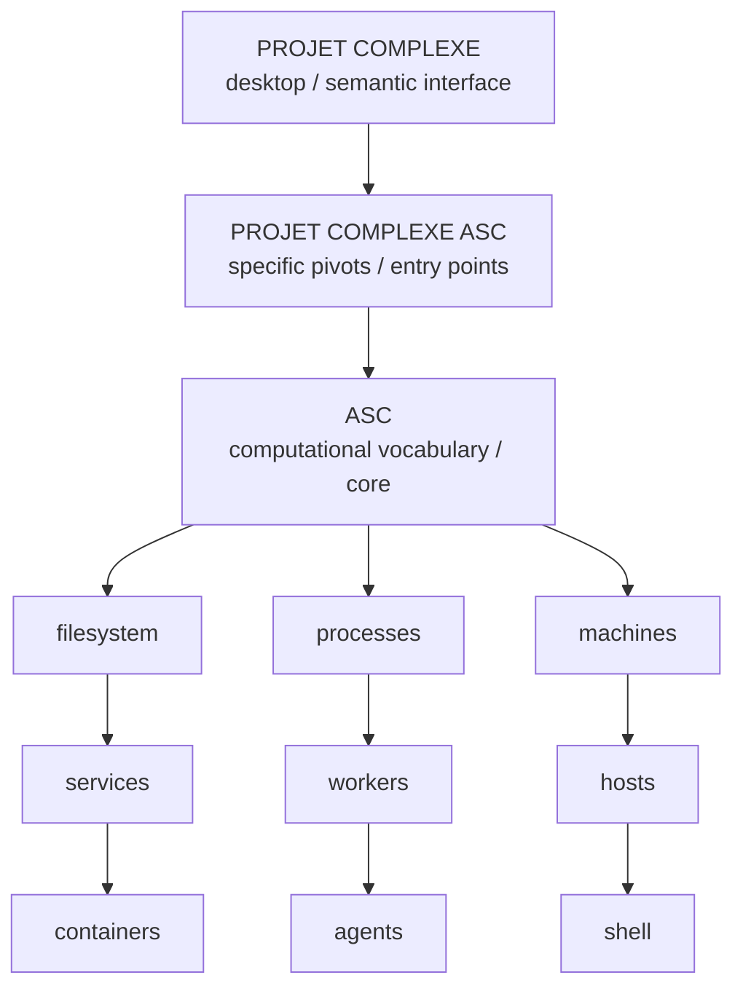

These are not three competing implementations of the same thing.

They are three different scopes.

- **ASC core** defines a generic vocabulary and mechanism for naming, addressing, composing and executing computational things.
- **Projet Complexe** is the desktop application and semantic environment built around tasks, knowledge, research, projects and agents.
- **Projet Complexe ASC** is the deliberately thin integration layer containing the specific ASC entry points, pivots, compositions and environment declarations needed to make Projet Complexe operate through ASC.

The important architectural rule is therefore:

> **Projet Complexe should use ASC without becoming ASC-specific, while Projet Complexe ASC should use ASC specifically without becoming a second ASC.**

This gives each project a reason to exist.

# 1. The three projects

## 1.1 ASC: the computational vocabulary

ASC is the most generic layer.

Its concern is not “the second brain”.

Its concern is the computational environment itself:

- files
- directories
- processes
- threads
- machines
- services
- workers
- projects
- commands
- scripts
- environments
- dependencies
- capabilities
- hooks
- entry points
- sidecars
- arguments
- execution
- composition

ASC asks:

> **What is this thing, where is it, how can it be addressed, and what can be done with it?**

It should remain useful even if Projet Complexe never existed.

It should also remain useful if the user never installs a GUI at all.

ASC is therefore not primarily an API server, a desktop backend, a task manager, or a second-brain database.

It is closer to a **language and filesystem-oriented computational model**.

Its ambition is to provide a common vocabulary for anything that interacts with the shell somehow.

That includes things below the shell:

```text
machine
OS
filesystem
process
device
service
container
```

and things above it:

```text
project
workflow
worker
agent
task
operation
capability
```

without requiring ASC to become specialized for every domain that uses it.

# 2. Projet Complexe: the semantic and visual environment

Projet Complexe has a different concern.

It asks:

> **What am I trying to accomplish, what do I know, how are things related, and how should I act upon them?**

Its vocabulary therefore contains things such as:

```text
task
project
objective
plan
idea
document
source
concept
research
knowledge
relationship
publication
agent
```

This is the second-brain layer.

Its desktop application is envisioned as a Tauri + SolidJS application, but the UI technology is not the essential part.

The essential part is the semantic distinction between:

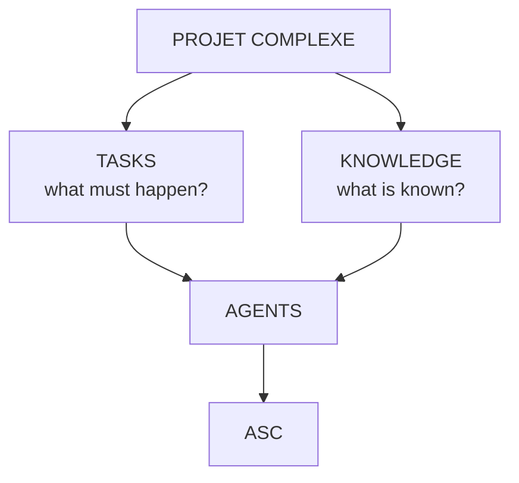

Tasks and knowledge are therefore not merely two navigation tabs.

They are two different orientations of activity.

A task is oriented toward achieving something.

Knowledge is oriented toward understanding something.

Agents sit at the intersection because autonomous activity necessarily moves between the two.

# 3. Projet Complexe ASC: the specific pivots

The third project is much thinner.

It should not become another application layer.

Its purpose is to contain the **specific ASC-facing vocabulary required by Projet Complexe**.

In other words, Projet Complexe ASC is where we say:

> Given the generic capabilities of ASC, these are the particular entry points, compositions, pivots and declarations that this specific environment needs.

Conceptually:

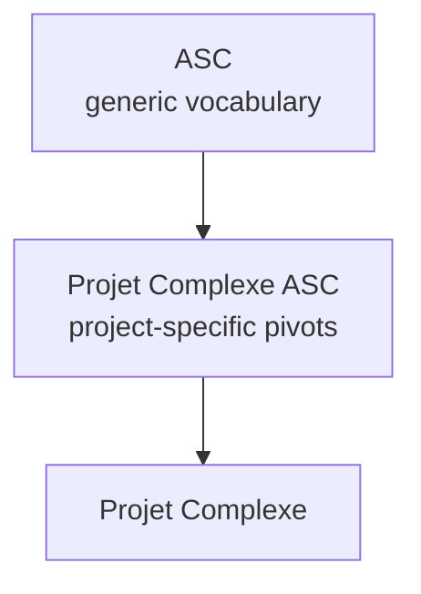

For example, ASC may generically know how to:

```text
execute
inspect
search
spawn
stop
watch
read
write
compose
```

Projet Complexe ASC can turn those generic mechanisms into specific entry points such as:

```text
research
index
extract
recognize
relate
build
run-agent
inspect-agent
stop-agent
publish
```

without requiring those concepts to become primitives of ASC itself.

This is important.

A second brain might need a `research` entry point.

ASC should not therefore become a “research framework”.

The `research` entry point belongs to the layer that composes ASC for that particular domain.

Likewise, a particular environment may need:

```text
docling
solr
arangodb
ocr
embedding
llm
agent-runtime
```

Those are not necessarily ASC primitives either.

They are concrete implementations or project-specific pivots.

The distinction can therefore be expressed as:

```text
ASC
    What is generically possible?

Projet Complexe ASC
    Which of those possibilities does this environment expose,
    and under which stable entry points?

Projet Complexe
    What does all of this mean for the user's tasks,
    knowledge and projects?
```

# 4. Why this is better than a monolith

The dangerous architecture would be:

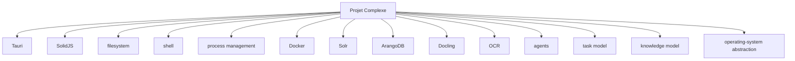

This looks convenient initially.

It eventually creates two problems.

First, the desktop application becomes responsible for things that should belong to ASC.

Second, ASC begins acquiring concepts that only make sense for one application.

The result is duplication:

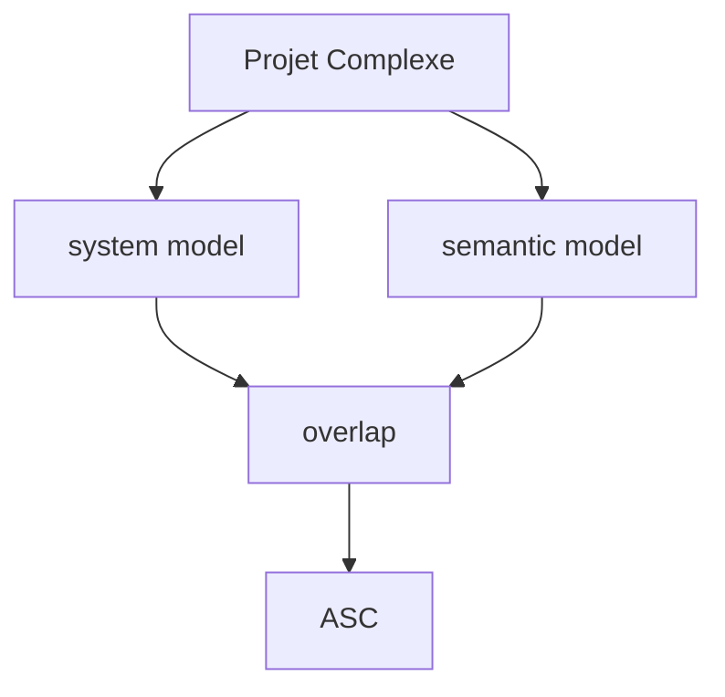

The three-project architecture prevents this gravitational pull.

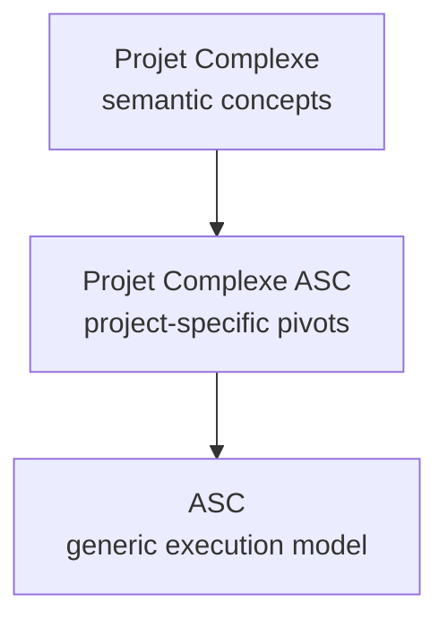

Each layer can therefore remain relatively ignorant of the layers above it.

# 5. ASC is not the operating system

ASC should not attempt to replace Linux, Windows, POSIX, Bash, Docker or other existing computational systems.

Its purpose is to provide a vocabulary *over* them.

For example, “restart this service” may eventually resolve to:

```text
systemctl restart foo
```

or:

```text
rc-service foo restart
```

or:

```text
Restart-Service foo
```

or something completely different.

The abstract operation is stable.

The implementation is not.

This gives ASC several forms of portability:

```text
OS portability
    Debian
    Ubuntu
    Arch
    Windows
    ...

tool portability
    pdftotext
    Docling
    Tika
    custom parser
    ...

agent portability
    local LLM
    remote API
    different agent runtime
    future backend
```

The consumer should ask for a capability rather than care about the implementation.

# 6. ASC's central mechanism: naming and pivots

The deepest idea in ASC is not “API”.

It is **addressability**.

A thing becomes useful to a computational language when it can be given a stable name and a stable point of access.

This is why entry points matter so much.

An ASC entry point is a **fixed pivot**.

It is something stable against which an operation can be formulated.

The DSL does not need to recreate arbitrary shell syntax every time.

Instead:

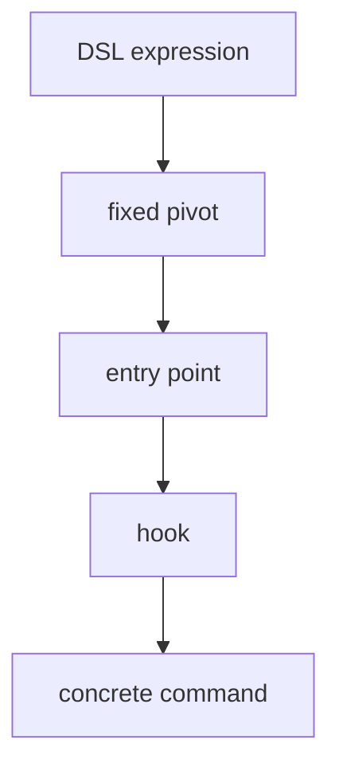

The entry point is therefore not merely a shell script.

It is an addressable semantic pivot.

A concrete implementation can change while the pivot remains stable.

This is one of the places where ASC's filesystem-oriented design becomes interesting.

The same conceptual object can have several representations:

```text
YAML declaration
filesystem path
entity
sidecar
entry point
DSL expression
generated artifact
shell execution
graph node
```

These are different views of the same underlying structure.

# 7. YAML, filesystem, DSL and shell

ASC can therefore be understood as several complementary representations.

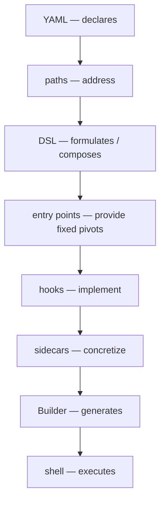

The objective is not to introduce abstraction for abstraction's sake.

The objective is to make the computational structure explicit enough that these representations can correspond to one another.

For example:

```text
software.entity.yml
```

can describe a generic kind of software entity.

A concrete entity such as:

```text
tesseract.entity.yml
```

can compose that vocabulary.

An ability such as:

```text
ocr.able.yml
```

can describe a reusable capability.

A concrete hook can then implement the capability.

The conceptual chain becomes:

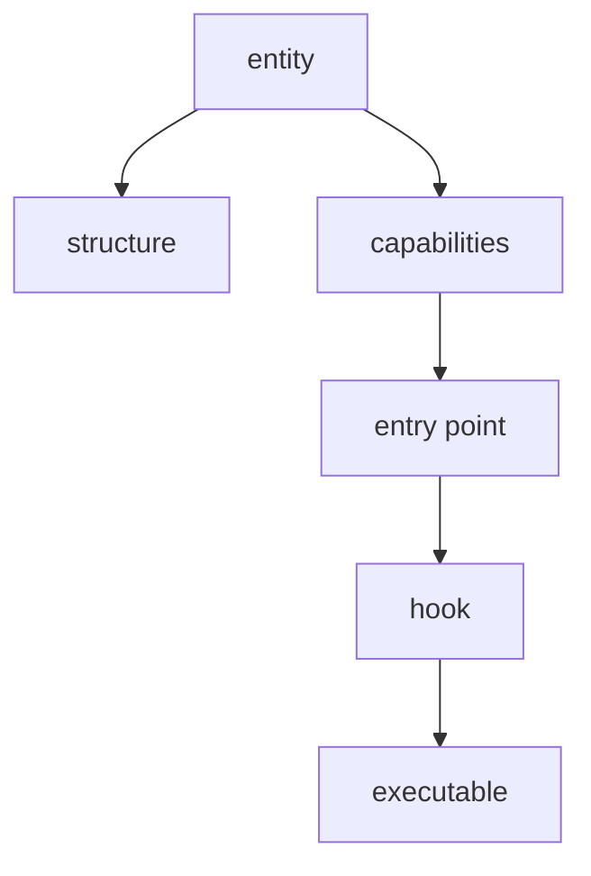

This is composition rather than conventional object-oriented inheritance.

`include` is therefore better understood as:

> resolve, compose and merge a declaration according to ASC rules.

Not:

> class A extends class B.

# 8. Entity versus ability

There is a useful distinction between:

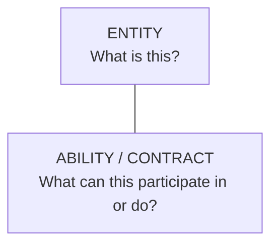

For example:

```text
tesseract
    is software

tesseract
    provides OCR

tesseract
    has executable
```

The software declaration says what kind of thing it is.

The OCR declaration describes a capability.

That distinction becomes important when agents start exploring environments.

An agent should not need to know:

> “This particular program is called Tesseract.”

It should be possible for it to reason more abstractly:

> “I need OCR.”

ASC can then discover or resolve an implementation.

That is a fundamentally different model from hard-coding tool names everywhere.

# 9. The project-specific layer should exploit this

Projet Complexe ASC is where these abstract capabilities can be assembled into useful pivots.

For example:

```text
recognize-text
index-document
search-knowledge
build-relation
spawn-researcher
run-task
inspect-task
stop-task
publish-document
```

The important point is that these do not have to become universal ASC concepts.

They are **domain compositions built on ASC**.

The project-specific layer can therefore evolve quickly without destabilizing ASC.

If Docling is replaced, the `extract-document` pivot can remain.

If Solr is replaced, `search-knowledge` can remain.

If one agent backend is replaced by another, `spawn-researcher` can remain.

This is the same abstraction principle operating at several scales:

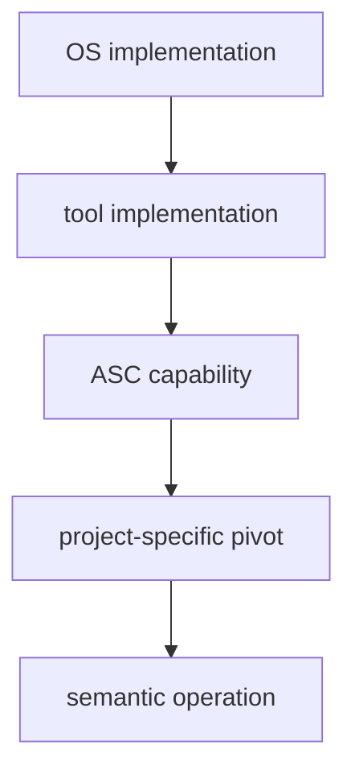

# 10. Projet Complexe should remain ignorant of implementation details

The UI should not think in terms of:

```text
SolrService
ArangoService
DockerService
LinuxService
PythonService
TesseractService
```

It should think in terms of:

```text
Search
Graph
Machine
Project
Worker
Agent
Task
Document
Source
Knowledge
```

This distinction matters because the semantic vocabulary should remain stable even when the technology changes.

The user should not have to know that:

```text
Search
```

currently happens through Solr.

Nor that:

```text
Document extraction
```

currently happens through Docling.

Nor that:

```text
Graph
```

currently happens through ArangoDB.

Those are implementation facts.

The semantic model should outlive them.

# 11. Projet Complexe is therefore not a system dashboard

This distinction is crucial.

The application should not become:

```text
CPU: 47%
RAM: 62%
DISK: 81%
Docker: OK
Solr: OK
ArangoDB: OK
```

simply because ASC makes those things observable.

That information can be useful, but it is not the application's purpose.

The interface should instead become a **visual query surface over a complex system**.

For example:

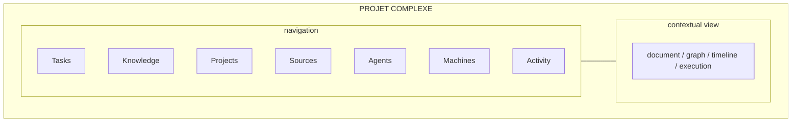

A machine can appear because it is relevant to a project.

A process can appear because it belongs to an agent run.

A document can appear because it is evidence for a task.

A service can appear because it constrains an operation.

Everything is contextual.

# 12. The graph is conceptual, not necessarily the database

The system may contain:

```text
relational data
documents
files
events
logs
search indexes
graph data
```

There is no requirement that everything physically live in one graph database.

The conceptual graph can instead be projected from several stores:

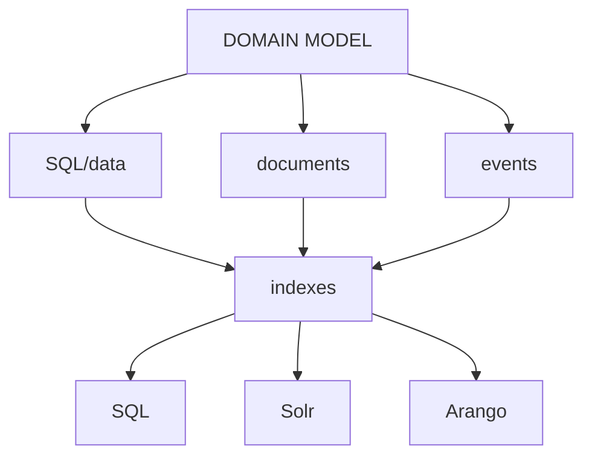

The graph is therefore a model of relationships.

It is not necessarily the storage architecture.

This distinction preserves implementation freedom.

# 13. Machines become knowledge objects

ASC can expose the computational world.

Projet Complexe can interpret it.

A machine therefore becomes more than a hardware dashboard.

Conceptually:

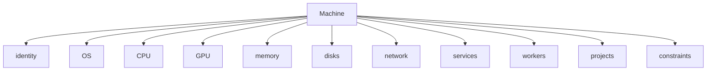

Projet Complexe can then relate that machine to semantic objects:

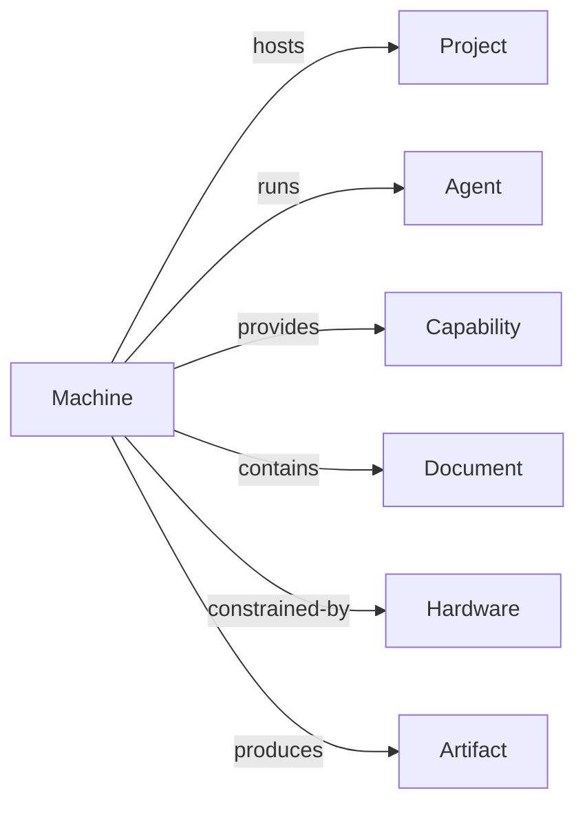

The result is a unified model:

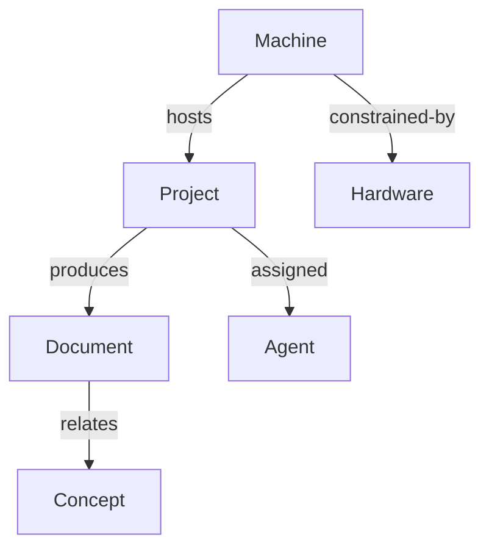

This is where ASC and the second brain become complementary without becoming the same project.

ASC tells us what is observable and executable.

Projet Complexe gives it semantic meaning.

# 14. The central distinction: execution versus interpretation

A useful formulation is:

> **ASC is authoritative about execution. Projet Complexe is authoritative about interpretation.**

ASC answers:

> What exists?

> What can be done?

> Where is it?

> How is it executed?

Projet Complexe answers:

> Why does it matter?

> What is it related to?

> What am I trying to accomplish?

> What do I currently believe?

> What should happen next?

The boundary is therefore not:

```text
backend vs frontend
```

It is:

```text
execution vs interpretation
```

The Tauri application is simply one interface through which the interpretive layer can interact with the execution layer.

# 15. Tauri should remain thin

The Tauri application should not recreate ASC.

Its responsibilities are approximately:

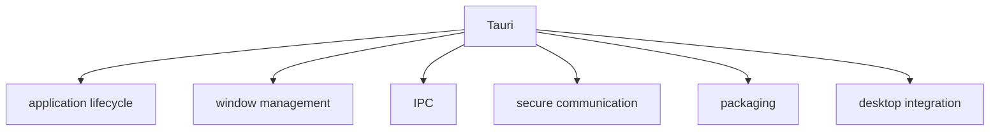

SolidJS provides:

```text
views
editors
graph visualization
task interfaces
knowledge interfaces
agent visualization
machine visualization
```

Kobalte provides behavioral and accessibility primitives.

CSS provides the visual language.

ASC provides the computational substrate.

The application therefore becomes:

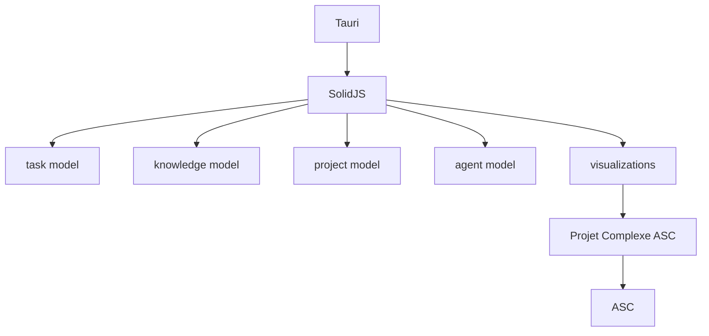

This keeps the Rust portion deliberately small.

# 16. CLI and GUI should be two interfaces to the same system

One of the strongest consequences of this architecture is that the GUI should never become the only way to operate the system.

The invariant should be:

> **Anything the GUI can cause to happen should remain reproducible from the terminal.**

Conceptually:

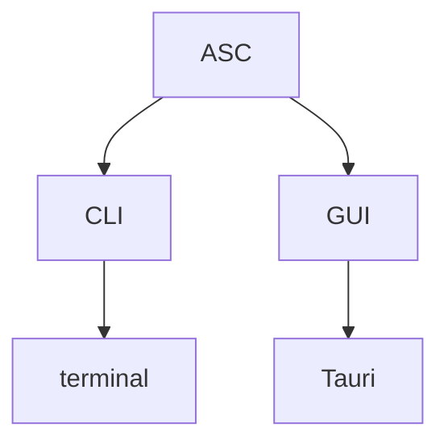

If the UI says:

```text
Indexing failed
```

the underlying operation should still be inspectable and reproducible through ASC.

This is important for debugging, automation, scripting and agents.

It also prevents the desktop application from becoming a mysterious execution environment that cannot be understood outside itself.

# 17. Events should be first-class

The GUI should not need to poll constantly:

```text
Tauri → ASC → status
Tauri → ASC → status
Tauri → ASC → status
```

The natural model is:

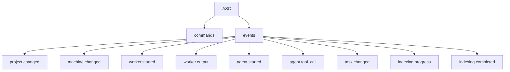

The desktop application subscribes.

The CLI can subscribe.

An external client can subscribe.

An agent controller can subscribe.

This means that execution becomes observable without forcing every consumer to understand the implementation.

# 18. Agents are not another silo

Agents should not become another independent object model disconnected from tasks and knowledge.

An agent is a computational actor operating inside this environment.

A useful conceptual model is:

```mermaid
flowchart TB
  A[Agent] --> T[Thread] --> CH[Change]
  CH --> C1[command]
  CH --> C2[command]
  CH --> O[observation]
  CH --> R[result]
  CH --> S[sidecar]
```

The important thing is that agent activity becomes visible as activity in the same environment.

An agent does not have to be treated as magical.

It can be represented through:

```text
intent
plan
tool call
observation
command
result
change
state transition
output
```

This is precisely where ASC's computational vocabulary becomes useful.

# 19. The task/knowledge distinction is deeper than a UI distinction

The original Projet Complexe distinction between **task-oriented** and **knowledge-oriented** work should remain central.

But it should not be interpreted as:

```text
Task tab
Knowledge tab
```

It describes two different modes of autonomous activity.

A task has an imperative structure:

```text
objective
state
dependencies
inputs
outputs
deadline
agent
execution
```

Knowledge has an epistemic structure:

```text
claim
source
evidence
concept
relationship
confidence
provenance
context
```

They intersect continuously.

A task may require knowledge.

A task may produce knowledge.

Knowledge may invalidate a task.

A task may reveal that knowledge is missing.

This is where the more interesting idea begins.

# 20. The task/knowledge mutual killswitch

The phrase **“task-oriented vs knowledge-oriented: mutual killswitch”** should be understood literally as a control principle for autonomous agents.

It does **not** mean that tasks and knowledge are simply synchronized.

It means that each can impose a stopping condition on the other.

The first direction is:

```mermaid
flowchart TB
  TASK --> KG["KNOWLEDGE GAP<br/>necessary to proceed"]
  KG --> RES[RESEARCH]
  RES --> RA[researcher agent]
  RES --> SR[source retrieval]
  RES --> EX[extraction]
  RES --> CO[comparison]
  RES --> SY[synthesis]
  RES --> KNOW[KNOWLEDGE] --> TR[TASK RESUMES]
```

A task can therefore **kill or suspend itself** because it discovers that it lacks knowledge necessary to continue responsibly.

The task says, in effect:

> I cannot legitimately proceed from what I currently know.

This is not failure.

It is a controlled transition from execution to inquiry.

# 21. The opposite direction is equally important

Knowledge gathering can itself become pathological.

Suppose an agent is asked to accomplish:

> Determine whether technology X is appropriate for this project.

It may begin researching:

```mermaid
flowchart TB
  TX[technology X] --> papers --> alternatives --> HC[historical context]
  HC --> benchmarks --> CD[community discussions] --> RT[related technologies]
  RT --> TB[theoretical background] --> MP[more papers] --> ELL[...]
```

At some point, the research process can become effectively unbounded.

The system then needs the opposite control:

```mermaid
flowchart TB
  KG["KNOWLEDGE GATHERING<br/>becomes excessive"] --> TI["TASK IMPERATIVE<br/>enough knowledge to act"]
  TI --> SR[STOP RESEARCH] --> ET[EXECUTE TASK]
```

Knowledge gathering must therefore be killable by the task it exists to serve.

This is the second direction of the mutual killswitch.

# 22. The complete control loop

The resulting loop is:

```mermaid
flowchart TB
  TASK["TASK<br/>achieve X"] --> Q1{Can we proceed?}
  Q1 -->|yes| ACT[ACT]
  Q1 -->|no| KG[KNOWLEDGE GAP] --> RES[RESEARCH] --> Q2{sufficient knowledge?}
  Q2 -->|yes| TR[TASK RESUMES] --> ACT
  Q2 -->|no| RL["research limit / unattainable"] --> TI[TASK IMPERATIVE] --> ACT
```

The critical concept is **sufficiency**.

The goal of research is not:

> know everything.

It is:

> know enough to make the next justified move.

Likewise, the goal of task execution is not:

> continue regardless of uncertainty.

It is:

> make progress until a knowledge deficit becomes materially blocking.

# 23. This changes what “autonomous” means

An autonomous agent should not be defined merely as:

> an agent that keeps executing without human intervention.

That model encourages runaway behavior.

A more useful definition is:

> **an agent that can regulate the relationship between action and uncertainty.**

It needs to know when:

```text
I can act.
```

when:

```text
I cannot act without learning something.
```

and when:

```text
I have learned enough; further learning is no longer justified by the task.
```

That gives us a three-state epistemic/action loop:

```mermaid
flowchart TB
  ACT1[ACT] -->|"uncertainty blocks action"| INQ[INQUIRE] -->|"sufficient evidence"| ACT2[ACT]
```

with a second constraint:

```mermaid
flowchart TB
  INQ[INQUIRE] -->|"research cost grows"| STOP --> ALT["accept uncertainty<br/>or change strategy"]
```

The task therefore supplies a bounded purpose to knowledge.

Knowledge supplies a bounded legitimacy to action.

# 24. This is particularly relevant to researcher agents

A researcher agent should not simply have the objective:

> “Find everything about X.”

It should have a task context.

For example:

```text
Parent task:
    Choose an extraction strategy for this corpus.

Knowledge requirement:
    Determine whether Docling handles the relevant PDF structures.

Research task:
    Investigate Docling's capabilities.

Stopping conditions:
    sufficient evidence for decision
    OR research budget exhausted
    OR question shown to be undecidable
```

The researcher is therefore subordinate to the parent task.

It exists because something needs to be accomplished.

This prevents knowledge acquisition from becoming an independent optimization target.

# 25. The same principle applies to agents researching agents

The system should avoid a hierarchy where every unknown automatically spawns another infinite research tree.

A knowledge gap should be represented explicitly:

```mermaid
flowchart TB
  T[Task] -->|requires| K[Knowledge]
  K -->|missing| RT[Research Task] --> A[Agent]
```

The research task has its own budget and stopping conditions.

If it cannot produce useful knowledge within those constraints, it should report:

```text
knowledge unavailable
```

rather than silently expanding forever.

This creates a natural form of bounded autonomy.

# 26. Knowledge is therefore not merely a database

This is one reason Projet Complexe should not be reduced to:

```text
notes
documents
embeddings
vector database
graph database
RAG
```

Those are storage and retrieval mechanisms.

The actual knowledge model concerns:

```text
claims
sources
evidence
relationships
uncertainty
provenance
context
questions
unknowns
```

The most interesting knowledge object may sometimes be:

```text
Unknown
```

or:

```text
KnowledgeGap
```

because that object can directly influence task execution.

# 27. The knowledge graph should contain uncertainty

A semantic environment becomes more useful to autonomous agents when it can represent not only:

```text
X is true.
```

but also:

```text
X is suspected.
X is supported by source Y.
X conflicts with Z.
X remains unknown.
X is irrelevant to task T.
X is sufficient for decision D.
```

This makes the knowledge layer operational.

It stops being merely an archive and becomes part of the agent's control system.

# 28. Tasks and knowledge form a coupled system

The deeper model is therefore:

```mermaid
flowchart TB
  K1[KNOWLEDGE] -->|"informs / constrains"| AGENT
  TASK --> AGENT --> ACTION --> WORLD -->|"observations"| K2[KNOWLEDGE]
  TASK --> WORLD
```

Knowledge constrains action.

Action generates observations.

Observations modify knowledge.

Knowledge gaps interrupt action.

Excessive knowledge gathering is interrupted by the task imperative.

This is a feedback system rather than a pipeline.

# 29. The “mutual killswitch” is therefore a control-theoretic idea

The term is intentionally stronger than “feedback loop”.

A feedback loop merely describes interaction.

A killswitch introduces authority.

The task has authority to say:

> stop researching; act.

The knowledge requirement has authority to say:

> stop acting; research.

This gives the two modes competing but complementary imperatives:

```text
TASK:
    achieve something.

KNOWLEDGE:
    know enough to act responsibly.
```

Neither should permanently dominate.

A purely task-oriented system risks blind execution.

A purely knowledge-oriented system risks endless inquiry.

The mutual killswitch is the mechanism that keeps them coupled without allowing either to become sovereign.

# 30. This may become one of Projet Complexe's most important concepts

The original visual division between:

```text
TASK
```

and:

```text
KNOWLEDGE
```

can therefore evolve into something much more fundamental.

The interface could make the current mode explicit:

```text
TASK
────────────────────────────
Objective:
    decide extraction strategy

State:
    blocked

Reason:
    insufficient evidence

Knowledge gap:
    PDF structure compatibility

Research:
    active
```

Then, later:

```text
KNOWLEDGE
────────────────────────────
Question:
    Can Docling handle this corpus?

Evidence:
    7 sources

Confidence:
    sufficient for current decision

Research:
    terminated by task requirement

TASK:
    resumed
```

The UI is not merely displaying work.

It is displaying the system's **epistemic state**.

# 31. Agent activity should become an event stream

An agent run can therefore be represented as:

```mermaid
flowchart TB
  A[Agent]
  A --> intent
  A --> task
  A --> KR[knowledge requirements]
  A --> plan
  A --> observation
  A --> TC[tool call]
  A --> command
  A --> result
  A --> KU[knowledge update]
  A --> ST[state transition]
  A --> completion
```

For example:

```text
Agent: research-agent

10:42  TASK
       Determine whether PDF extraction is feasible.

10:42  CHECK KNOWLEDGE
       Required capability: structured PDF extraction.

10:42  KNOWLEDGE GAP
       Current corpus contains unsupported structures.

10:43  SPAWN
       researcher-agent

10:43  SEARCH
       local corpus

10:44  EXTRACT
       document A

10:45  COMPARE
       document B

10:47  KNOWLEDGE UPDATE
       evidence sufficient for decision

10:47  KILL RESEARCH
       parent task resumes

10:48  TASK
       select extraction strategy
```

This is much more informative than simply showing:

```text
agent running
```

# 32. ASC should expose execution events, not interpret them

ASC can provide:

```text
agent.started
agent.tool_call
process.started
process.output
file.changed
worker.completed
thread.stopped
```

Projet Complexe can interpret those events semantically:

```text
research started
knowledge gap discovered
evidence added
task blocked
task resumed
decision reached
```

This is another important boundary.

ASC reports what happened.

Projet Complexe determines what it means.

# 33. Threads, processes and agents

ASC should not necessarily mirror operating-system terminology exactly.

An ASC `thread` can represent an ASC-managed execution pivot.

It does not need to mean literally:

> POSIX thread.

Likewise, an agent is not simply:

> a process.

An agent may cause many processes to exist.

It may spawn workers.

It may create files.

It may launch commands.

It may invoke remote services.

The semantic object is therefore:

```mermaid
flowchart TB
  A[Agent] --> T[Thread]
  T --> C[command]
  T --> O[observation]
  T --> R[result]
  T --> CH[change]
```

while the implementation may involve:

```text
processes
containers
remote calls
shell commands
APIs
```

ASC provides the pivot through which those implementation details become addressable.

# 34. Changes are particularly important

A `change` can become a bridge between execution and knowledge.

For example:

```mermaid
flowchart TB
  A[Agent] --> CH[Change]
  CH --> MF[modified file]
  CH --> CD[created document]
  CH --> SP[started process]
  CH --> CTS[changed task state]
  CH --> AK[added knowledge]
```

This makes autonomous work auditable.

Instead of thinking:

> the agent did some things,

the system can represent:

> this agent produced these observable changes.

That is an important foundation for trustworthy autonomous systems.

# 35. Sidecars make virtual things concrete

A recurring ASC pattern is that a conceptual object can have a concrete representation.

A sidecar can provide that representation.

This is particularly useful when the thing being represented is not itself naturally a file.

For example:

```mermaid
flowchart TB
  E[entity] --> S[sidecar] --> X["executable / metadata / declaration"]
```

The same pattern can apply to agents, threads, capabilities, software and other computational objects.

The sidecar is not necessarily the object itself.

It is a concrete projection of the object.

# 36. The filename-safe constraint matters

If the filesystem is part of the vocabulary, names need to remain safe and predictable.

The same is true for DSL-generated entry points.

A fixed pivot should not depend on arbitrary characters that are difficult to represent consistently across:

```text
filesystem
shell
environment variables
DSL
URLs
logs
JSON
```

This constraint is not cosmetic.

It is part of making the vocabulary composable.

# 37. The DSL should remain small

The DSL should not become a replacement for Bash.

Its purpose is to provide a compact notation for addressing and composing ASC's fixed pivots.

The important distinction is:

```text
Bash:
    general-purpose shell language

ASC DSL:
    structured notation for ASC vocabulary and pivots
```

The DSL therefore benefits from being deliberately constrained.

The more it becomes another general-purpose programming language, the less useful the relationship with the filesystem and entry-point model becomes.

# 38. Argument mapping belongs to the pivot model

ASC can expose positional and option slots through stable names.

The goal is not necessarily to reproduce Bash's:

```text
$1
$2
$@
```

directly.

The goal is to give those positions semantic names.

This allows a DSL expression to remain stable while the implementation underneath it changes.

The entry point establishes interpretation.

The DSL supplies the composition.

The shell receives the final concrete arguments.

# 39. `wrap`, `nest` and composition

The distinction between wrapping and nesting is useful because composition happens at different levels.

Conceptually:

```text
invoke
    execute an existing pivot

wrap
    expose existing behavior through another interface

nest
    compose one computational structure inside another
```

The important property is that composition should not require copying implementation.

This is the same principle that makes the entity system interesting.

ASC should favor:

```text
compose
```

over:

```text
duplicate
```

# 40. Parallelism should be a property of composition

Parallelism should not require every individual primitive to understand concurrency.

A composition can determine whether several independent operations should execute:

```text
serially
```

or:

```text
in parallel
```

This keeps the underlying primitives simple.

It also becomes useful for agents:

```mermaid
flowchart TB
  RT[Research task]
  RT --> A[researcher A]
  RT --> B[researcher B]
  RT --> C[researcher C]
  A --> SY[synthesis]
  B --> SY
  C --> SY
```

The orchestration layer can decide that A, B and C are independent while synthesis depends on all three.

# 41. Projet Complexe ASC is where this becomes practical

Projet Complexe ASC can define compositions such as:

```mermaid
flowchart TB
  subgraph research
    R1[search] --> R2[retrieve] --> R3[extract] --> R4[compare] --> R5[synthesize]
  end
  subgraph index
    I1[detect] --> I2[extract] --> I3[normalize] --> I4[index] --> I5[relate]
  end
  subgraph runAgent[run-agent]
    A1[create thread] --> A2[assign task] --> A3[provide knowledge context] --> A4[execute] --> A5[emit changes]
  end
```

These are not ASC primitives.

They are meaningful compositions for this particular environment.

This is exactly why the third project should remain thin.

# 42. Projet Complexe can therefore evolve without redefining ASC

Suppose Projet Complexe eventually needs:

```text
literature-review
```

It can compose existing capabilities.

Suppose it later needs:

```text
experiment
```

Again, compose capabilities.

Suppose it needs:

```text
publish
```

Again, compose capabilities.

The architecture becomes:

```mermaid
flowchart TB
  ASC["ASC<br/>generic primitives"] --> PCA["Projet Complexe ASC<br/>domain compositions"] --> PC["Projet Complexe<br/>semantic / visual environment"]
```

This is much healthier than adding every new second-brain concept to ASC itself.

# 43. The repository boundaries

The resulting repository ecosystem should be approximately:

```text
github.com/Paulmicha/asc
```

### ASC core

Generic computational vocabulary and mechanisms.

Contains:

- entities
- declarations
- namespaces
- fields
- props
- includes
- abilities/contracts
- sidecars
- entry points
- hooks
- DSL
- Builder
- threads
- generic execution mechanisms

It should remain domain-agnostic.

---

```text
github.com/Paulmicha/projet-complexe-asc
```

### Projet Complexe ASC

Specific ASC compositions and pivots for the Projet Complexe environment.

Contains:

- project-specific entry points
- domain-specific hooks
- knowledge-related compositions
- task-related compositions
- indexing pivots
- research pivots
- agent pivots
- environment declarations
- integration glue

It should remain thin enough that its concepts can be removed without damaging ASC.

---

```text
github.com/Paulmicha/projet-complexe
```

### Projet Complexe

Desktop and semantic environment.

Contains:

- Tauri
- SolidJS
- task model
- knowledge model
- project model
- research model
- agent visualization
- graph visualization
- document interfaces
- activity timeline
- semantic interpretation
- task/knowledge control logic

It should not contain generic OS abstractions.

# 44. The three layers can be summarized in one table

| Project | Fundamental question | Vocabulary | Responsibility |
|---|---|---|---|
| **ASC** | What exists and what can be done? | entities, pivots, hooks, capabilities, execution | generic computational substrate |
| **Projet Complexe ASC** | Which ASC capabilities does this environment expose, and how? | specific entry points, compositions, integrations | domain-specific ASC layer |
| **Projet Complexe** | What am I trying to accomplish, what do I know, and what does it mean? | tasks, knowledge, projects, research, agents | semantic + visual environment |

The dependency direction is:

```mermaid
flowchart TB
  PC[Projet Complexe] --> PCA[Projet Complexe ASC] --> ASC[ASC]
```

But the conceptual authority is different:

```mermaid
flowchart TB
  ASC["ASC<br/>execution authority"]
  PCA["Projet Complexe ASC<br/>integration / composition authority"]
  PC["Projet Complexe<br/>semantic interpretation authority"]
  ASC --- PCA --- PC
```

# 45. The environment is deliberately asymmetric

The three projects should not know equally much about one another.

ASC should know nothing about Projet Complexe.

Projet Complexe ASC knows ASC and Projet Complexe's operational requirements.

Projet Complexe knows the semantic concepts it needs and the capabilities exposed to it.

Therefore:

```mermaid
flowchart BT
  PC[Projet Complexe] --> PCA[Projet Complexe ASC] --> ASC[ASC]
```

not:

```mermaid
flowchart LR
  subgraph anti["anti-pattern — circular coupling"]
    ASC <--> PC[Projet Complexe] <--> PCA[Projet Complexe ASC]
  end
```

This one-way dependency is what keeps the architecture from becoming circular.

# 46. The Second Brain should not become an ASC frontend

This sounds like a semantic distinction, but it has practical consequences.

A generic ASC client might expose:

```text
filesystem
processes
machines
services
workers
```

Projet Complexe should instead expose:

```text
tasks
knowledge
projects
sources
research
agents
```

It can *show* machines, processes and services when they become relevant.

But those are not its organizing principles.

For example:

> This task is blocked because the required service is unavailable.

is a Projet Complexe interpretation of ASC state.

The UI should not become:

> Here is a service management console.

# 47. Conversely, ASC should not become a knowledge graph

ASC can expose relationships.

It can model entities.

It can make computational structures discoverable.

But it should not acquire a second-brain-specific ontology such as:

```text
idea
belief
argument
literature review
research question
publication
epistemic confidence
```

unless such concepts eventually prove generic enough to belong in ASC.

The default assumption should be:

> domain semantics belong above ASC.

This keeps ASC genuinely reusable.

# 48. The architecture is recursive

The most interesting property of the whole system is that the same pattern can repeat.

ASC can represent:

```text
machines
projects
software
workers
agents
```

Projet Complexe can represent:

```text
tasks
projects
knowledge
agents
```

Projet Complexe ASC can compose ASC capabilities into:

```text
research
indexing
execution
agent orchestration
```

And the result can itself be represented by ASC.

For example:

```mermaid
flowchart TB
  M[Machine] -->|hosts| PC[Projet Complexe] -->|runs| A[Agent]
  A -->|executes| EP[ASC entry point] -->|invokes| P[process]
```

The system can therefore describe itself.

That is potentially much more important than any individual UI feature.

# 49. The same structure can be seen from different perspectives

A computational object can be viewed as:

```text
code
filesystem
entity
sidecar
DSL expression
entry point
execution
event
graph node
```

These should not necessarily be separate objects.

They can be representations of the same underlying structure.

This is one of ASC's strongest ideas.

It gives Projet Complexe something substantial to visualize.

The UI does not need to invent an artificial graph.

The graph is already implicit in the relationships between computational objects.

# 50. This is why the desktop UI can become much more than a dashboard

The Tauri application can become a visual projection of:

```text
what exists
what is known
what is happening
what can happen
what needs to happen
why it needs to happen
what is currently blocking it
```

That is much closer to a **second brain** than a conventional productivity application.

And because ASC makes the computational environment observable, the second brain does not have to remain purely informational.

It can act.

# 51. But action should remain mediated by ASC

The core invariant remains:

> **Tauri never directly operates the host. It asks ASC to operate the host.**

More broadly:

> **Projet Complexe never needs to know how a computational action is implemented. It asks for a capability or pivot.**

This provides:

```mermaid
flowchart TB
  SI[semantic intent] --> PP[project-specific pivot] --> AC[ASC capability] --> H[hook] --> IMP[implementation] --> M[machine]
```

The same operation can therefore remain reproducible from the terminal.

# 52. This is also important for agents

An autonomous agent should not receive an arbitrary shell and an enormous unstructured environment and be expected to infer everything.

It should be able to discover:

```text
entities
capabilities
entry points
constraints
relationships
available knowledge
unknown knowledge
```

Then it can reason over a structured environment.

The goal is not to prevent agents from using the shell.

The goal is to make the shell's affordances legible.

# 53. ASC as an environment for agents

This gives a useful progression:

```mermaid
flowchart TB
  RS[raw shell] --> NSE[named shell environment] --> SCE[structured computational environment]
  SCE --> DC[discoverable capabilities] --> OE[observable execution] --> AOE[agent-operable environment]
```

The agent is not merely executing commands.

It is navigating a vocabulary.

This is where the original ambition of ASC becomes relevant to autonomous agents.

# 54. The Go analogy

The Go analogy should remain.

ASC is not literally a game, and the analogy is not about gamification.

It is about the relationship between a small vocabulary and a huge combinatorial space.

Go has relatively few fundamental concepts:

```text
stones
intersections
groups
liberties
territory
connections
captures
```

Yet enormous structures emerge from their relationships.

ASC is attempting something analogous for the computational environment:

```text
entities
entry points
namespaces
environments
scripts
sidecars
hooks
variants
arguments
composition
```

The important property is not that there are few concepts.

It is that the concepts have stable meanings and can be recombined.

This gives rise to a large space of possible computational structures without requiring a new abstraction for every individual project.

In that sense:

> **ASC is trying to make the computational environment playable.**

Not because computation is a game.

Because a stable vocabulary turns an otherwise chaotic space of possibilities into a space of meaningful moves.

# 55. “If you name things right, projects practically write themselves”

This principle becomes much clearer in the three-project architecture.

Naming does not mean inventing arbitrary labels.

It means establishing stable relationships between:

```text
what something is
where it exists
what it can do
how it can be invoked
how it can be composed
what it produces
what depends on it
```

Once those relationships are explicit, a surprising amount of implementation becomes composition.

For example:

```mermaid
flowchart LR
  PDF --> |"is"| DOC[document]
  PDF --> |"requires"| EX[extraction]
  PDF --> |"provides"| TXT[text]
```

and:

```mermaid
flowchart LR
  D[Docling] -->|"is"| SW[software]
  D -->|"provides"| SE[structured extraction]
```

The system can then compose:

```mermaid
flowchart LR
  PDF --> EX[extraction] --> D[Docling] --> TXT[text] --> IX[indexing] --> K[knowledge]
```

The project is not written from scratch.

It is assembled from named capabilities.

# 56. This is the real relationship between ASC and the Second Brain

The Second Brain does not need ASC because it needs a backend.

It needs ASC because it needs a **computational vocabulary**.

Conversely, ASC does not need the Second Brain in order to be useful.

The Second Brain is simply one particularly interesting environment in which the consequences of ASC's vocabulary become visible.

That distinction matters.

It means ASC can continue evolving independently.

And Projet Complexe can become increasingly sophisticated without forcing ASC to absorb its semantics.

# 57. The research environment becomes a particularly interesting test case

Projet Complexe can contain:

```text
sources
documents
concepts
questions
claims
tasks
agents
experiments
publications
```

ASC can provide:

```text
files
processes
workers
indexers
extractors
LLMs
containers
remote hosts
```

Projet Complexe ASC composes them:

```text
research
index
extract
search
relate
summarize
compare
publish
```

The desktop application then exposes the resulting system visually.

This gives the project a coherent path from:

```text
document
```

to:

```text
knowledge
```

to:

```text
task
```

to:

```text
agent
```

to:

```text
execution
```

to:

```text
new knowledge
```

# 58. The whole architecture can be expressed as a loop

```mermaid
flowchart TB
  W1[WORLD] -->|"observation"| ASC1[ASC]
  ASC1 -->|"computational representation"| PCA[PROJET COMPLEXE ASC]
  PCA -->|"capabilities / pivots"| PC[PROJET COMPLEXE]
  PC --> SM[semantic model]
  SM --> K[KNOWLEDGE]
  SM --> T[TASK]
  K --> A[AGENT]
  T --> A
  A --> ACT[ACTION] --> ASC2[ASC] --> W2[WORLD]
```

And the task/knowledge mutual killswitch operates inside this loop:

```mermaid
flowchart TB
  TASK -->|"enough knowledge"| ACT1[ACT]
  TASK -->|"insufficient knowledge"| RES[RESEARCH]
  RES -->|"sufficient"| ACT2[ACT]
  RES -->|"excessive / unattainable"| TI[TASK IMPERATIVE] --> SR[STOP RESEARCH]
```

This is a much more precise model of autonomous work than simply:

```text
agent → tools → result
```

# 59. What should be built first

The first milestone should not be:

> Build the complete Second Brain.

Nor:

> Build the complete agent framework.

Nor:

> Build the complete graph database.

The first milestone should establish the architectural invariant:

> **A useful operation can be represented as a stable ASC pivot, executed from the terminal, and consumed by Projet Complexe without the UI knowing its implementation.**

A minimal example might be:

```text
ASC
    expose machine/project state

Projet Complexe ASC
    expose a few useful pivots

Projet Complexe
    display and invoke them
```

For example:

```text
Machine
    Debian
    CPU
    memory
    GPU

ASC
    running

Projects
    projet-complexe
    projet-complexe-asc
    asc

Workers
    indexing
    idle
```

If the same operation is reproducible through:

```text
terminal → ASC
```

and:

```text
Tauri → Projet Complexe ASC → ASC
```

the most important architectural boundary has already been demonstrated.

Everything else can grow around it.

# 60. What should not be built first

Avoid premature construction of:

```text
a giant API
a giant graph schema
a giant agent framework
a giant frontend component library
a second execution engine
a second shell abstraction
a second task manager
a second knowledge database
```

The architecture becomes stronger by keeping the primitives small.

The central question should repeatedly be:

> Is this a new primitive, or is it a composition of existing primitives?

If it is a composition, it probably belongs above ASC.

If it is a genuinely reusable computational primitive, it may belong in ASC.

If it is specific to Projet Complexe, it probably belongs in Projet Complexe ASC.

If it exists primarily to interpret, visualize or organize meaning for the user, it belongs in Projet Complexe.

# 61. A practical rule for deciding where something belongs

When introducing a new concept:

### Put it in ASC if:

- it describes a generic computational thing;
- it can be useful independently of Projet Complexe;
- it concerns naming, addressing, composition or execution;
- it is sufficiently domain-independent;
- it can support multiple consumers.

### Put it in Projet Complexe ASC if:

- it composes generic ASC capabilities;
- it is specific to the Projet Complexe environment;
- it defines a useful entry point or pivot for that environment;
- it connects concrete tools to semantic capabilities;
- removing it would not damage ASC itself.

### Put it in Projet Complexe if:

- it represents meaning, knowledge or intention;
- it belongs to the task/knowledge model;
- it concerns research, concepts, sources or publications;
- it interprets ASC events;
- it is primarily a human/agent semantic interaction.

This rule is more useful than deciding according to programming language or repository convenience.

# 62. The architectural hierarchy

The resulting system can be summarized as:

```mermaid
flowchart TB
  PC["PROJET COMPLEXE<br/>semantic / visual universe"]
  TK["task ↔ knowledge"]
  AG[agents]
  PCA["PROJET COMPLEXE ASC<br/>domain-specific pivots"]
  ASC["ASC<br/>generic computational vocabulary"]
  PC --> TK --> AG --> PCA --> ASC
  ASC --> FS[filesystem]
  ASC --> PR[processes]
  ASC --> MA[machines]
  FS --> SV[services]
  PR --> WK[workers]
  MA --> HO[hosts]
  SV --> W[WORLD]
  WK --> W
  HO --> W
```

The direction of abstraction is:

```mermaid
flowchart TB
  W1[world] --> ASC --> PP[project-specific pivots] --> SM[semantic model]
  SM --> HAD[human / agent decisions] --> ACT[actions] --> W2[world]
```

# 63. The deeper ambition

ASC begins from the hard problem of naming things.

But the problem becomes more interesting once names are not isolated labels.

A useful name can become:

```text
address
pivot
capability
relationship
composition point
semantic reference
execution target
```

That means naming can become a bridge between:

```text
filesystem
shell
software
machines
projects
knowledge
agents
```

The same vocabulary can progressively connect things that are normally represented through completely different systems.

This is the real potential of the architecture.

# 64. From shell vocabulary to agent vocabulary

A shell gives us operations.

ASC attempts to give those operations stable names and structures.

Projet Complexe gives those structures semantic context.

Agents can then operate somewhere between the two:

```mermaid
flowchart TB
  intent --> task --> KR[knowledge requirements] --> CD[capability discovery]
  CD --> AP[ASC pivot] --> EX[execution] --> OBS[observation]
  OBS --> KU[knowledge update] --> TP[task progress]
```

This is much closer to an environment in which agents can genuinely operate than simply giving an LLM access to a terminal.

The terminal remains there.

It is simply no longer the only representation of what the terminal can do.

# 65. The environment becomes inspectable

One of the most important consequences is that the system becomes inspectable at multiple levels.

A human can see:

```text
project
task
knowledge
agent
machine
```

An agent can discover:

```text
entity
capability
entry point
constraint
event
```

The shell can execute:

```text
command
script
process
worker
```

And ASC can connect those representations.

This means the same activity can be inspected as:

```mermaid
flowchart TB
  HC[human concept] <--> SO[semantic object] <--> AE[ASC entity]
  AE <--> EP[entry point] <--> EX[execution] <--> EV[event] <--> R[result]
```

That traceability is potentially more important than any individual feature.

# 66. The system should remain lightweight

The architecture does not require a huge stack.

The desktop application can remain technologically simple:

```text
Tauri 2
SolidJS
TypeScript
Vite
Kobalte
plain CSS
```

The backend does not need to be a monolithic server.

ASC can orchestrate:

```text
Bash
Rust
Python
external binaries
Docker
remote commands
```

depending on what is appropriate.

The semantic layer can use whatever storage is appropriate:

```text
files
SQL
search index
graph database
event log
```

The point is not technological maximalism.

The point is to establish a coherent vocabulary over heterogeneous technologies.

# 67. The resulting system is deliberately plastic

This architecture allows substitutions without conceptual collapse.

For example:

```text
Solr → another search engine
Docling → another extractor
ArangoDB → another graph backend
local LLM → remote model
agent runtime A → agent runtime B
Debian → another OS
Tauri → another client
```

The important concepts remain:

```text
Search
Extract
Graph
Agent
Machine
Task
Knowledge
Project
Entry point
Capability
```

This is the kind of plasticity that makes the architecture durable.

# 68. The key invariant

The entire system can ultimately be reduced to one principle:

> **Do not couple semantic meaning to implementation details when a stable computational pivot can separate them.**

For example:

```text
"extract this document"
```

should not mean:

```text
"run Docling in this Docker container using this exact command"
```

It should mean:

```text
extract-document
```

which can resolve through:

```mermaid
flowchart TB
  PC[Projet Complexe] --> PCA[Projet Complexe ASC] --> ASC
  ASC --> EC[extraction capability] --> IMP[implementation]
```

The same applies to:

```text
search
index
publish
run
stop
research
spawn
inspect
```

Stable names make implementations replaceable.

# 69. The deeper meaning of “Let's make words matter”

This phrase is not merely a slogan.

It describes the architecture.

If a word such as:

```text
agent
```

has no stable meaning, it is merely a label.

If `agent` has:

```text
a declaration
a namespace
a representation
a capability set
an execution pivot
an event stream
a lifecycle
```

then the word becomes operational.

Likewise:

```text
task
knowledge
machine
project
document
service
worker
```

can become computable concepts rather than merely UI labels.

The goal is therefore:

> **Make words matter by giving names stable computational consequences.**

# 70. The final synthesis

ASC, Projet Complexe ASC and Projet Complexe should not be understood as three versions of one application.

They form a stack of increasingly specific meaning.

```mermaid
flowchart TB
  PC["PROJET COMPLEXE<br/>Meaning · Tasks · Knowledge · Research · Projects · Agents<br/><i>What am I trying to understand or accomplish?</i>"]
  PCA["PROJET COMPLEXE ASC<br/>Domain-specific pivots · compositions · integrations<br/><i>How does this particular environment expose ASC?</i>"]
  ASC["ASC<br/>Names · Entities · Entry points · Hooks · Sidecars<br/>Capabilities · DSL · Threads · Execution · Composition<br/><i>What exists, where is it, and what can be done?</i>"]
  CW[COMPUTATIONAL WORLD]
  PC --> PCA --> ASC --> CW
```

The relationship between task and knowledge then becomes the dynamic core of the upper layer:

```mermaid
flowchart TB
  T1[TASK] -->|"knowledge insufficient"| RES[RESEARCH]
  RES -->|"knowledge sufficient"| T2[TASK] -->|"execution"| W[WORLD]
  W -->|"observation"| K[KNOWLEDGE]
```

with a mutual killswitch:

```mermaid
flowchart LR
  TASK -->|"kills excessive"| RES[RESEARCH]
  RKG["RESEARCH / KNOWLEDGE GAP"] -->|"kills or suspends unjustified"| TE[TASK EXECUTION]
```

This gives autonomous agents something more interesting than unrestricted tool access.

It gives them a bounded ecology of:

```text
intent
knowledge
uncertainty
action
observation
change
execution
```

ASC provides the computational vocabulary in which that ecology can operate.

Projet Complexe ASC provides the concrete pivots through which this particular environment is assembled.

Projet Complexe provides the semantic environment in which humans and agents can understand, organize and direct it.

# Genericity Scale and the Three-Project Boundary

The three-project architecture should not be understood as three successive abstraction layers.

There are actually **two dimensions**:

1. a **genericity scale**, describing how broadly reusable a concept is;
2. a **project boundary**, describing which project currently owns and composes that concept.

The genericity scale is:

```text
1. primordial
2. primitive
3. ASC core extension
4. ASC contrib extension
5. third-party contrib extension
6. project-specific implementation
```

This distinction matters because a project-specific concept can still be implemented *using ASC*. Conversely, something originally invented for Projet Complexe may later prove sufficiently reusable to migrate upward.

The intended evolutionary direction is therefore:

```mermaid
flowchart BT
  PI[project implementation] --> TPC[third-party contrib]
  TPC --> AC[ASC contrib] --> ACO[ASC core] --> PR[primitive] --> PO[primordial]
  PO -.->|"increasing genericity"| PI
```

Or operationally:

```mermaid
flowchart TB
  PE[private experiment] --> PSI[project-specific implementation]
  PSI -->|"demonstrated reusable value"| TPC[third-party / personal contrib]
  TPC -->|"demonstrated broader applicability"| AC[ASC contrib]
  AC -->|"demonstrated fundamental status"| ACO[ASC core]
```

This means that **ASC should not try to predict the final ontology in advance**.

A concept can start as a very specific implementation and migrate upward when experience demonstrates that it deserves to become generic.

# The six levels

## 1. Primordial

These are concepts so fundamental that ASC builds its vocabulary around them rather than defining them as ordinary extensions.

They form the substrate from which the rest of the system is constructed.

## 2. Primitive

Primitives are the basic reusable computational concepts of ASC.

They should have stable semantics and should not depend on Projet Complexe.

Examples include the kinds of concepts around:

```text
entity
field
prop
able
include
namespace
entry point
hook
sidecar
thread
change
```

The exact primitive vocabulary can evolve, but its defining property is **genericity**.

A primitive should make sense independently of a particular second brain, research workflow or desktop application.

## 3. ASC core extensions

These are concepts that are not necessarily primordial or primitive, but have become sufficiently fundamental to belong to ASC itself.

They extend the generic computational vocabulary without being tied to one particular project.

ASC core is therefore not merely a fixed kernel.

It can grow.

The important constraint is that its additions remain broadly meaningful.

## 4. ASC contrib extensions

These are reusable extensions that are valuable within the ASC ecosystem but are not fundamental enough to belong to the core.

This provides an important pressure-release mechanism.

Without a contrib level, every useful abstraction faces a binary decision:

```text
core
or
not ASC
```

The contrib level allows:

```text
useful + reusable
but
not fundamental
```

to remain part of the ASC ecosystem without contaminating the core vocabulary.

## 5. Third-party contrib extensions

This is where reusable external implementations can live.

A capability may originate outside ASC itself while still exposing itself through ASC's vocabulary.

For example, a particular document-extraction, indexing, graph, AI or operating-system integration can become an ASC-compatible extension without becoming an ASC primitive.

This is where tool-level portability becomes particularly useful.

The semantic capability can remain stable:

```text
document extraction
```

while implementations vary:

```text
Docling
Tika
pdftotext
custom extractor
```

The implementation is replaceable because the capability has a stable ASC-facing address.

## 6. Project-specific implementations

At the most specific end are implementations whose meaning depends on one particular environment.

This is where **Projet Complexe ASC** primarily lives.

For example:

```text
research
researcher-agent
knowledge-gap
task-blocked
task-resume
index-my-corpus
publish-research-note
```

may be meaningful and useful within Projet Complexe without being appropriate ASC primitives.

They can nevertheless be expressed *through* ASC.

That distinction is essential:

> **Being implemented with ASC does not make something part of ASC's generic vocabulary.**

# The three projects mapped onto the genericity scale

The three projects therefore occupy different roles.

```mermaid
flowchart TB
  ASC[ASC]
  ASC --> primordial
  ASC --> primitives
  ASC --> CE[core extensions]
  ASC --> CX[contrib extensions]
  CX --> REE[reusable ecosystem extensions] --> TPC[third-party contrib]
  TPC --> PCA[Projet Complexe ASC]
  PCA --> PSC[project-specific ASC compositions] --> PC[Projet Complexe]
  PC --> task
  PC --> knowledge
  PC --> research
  PC --> publication
  PC --> project
  PC --> agents
```

But the last two should not be interpreted as simply “levels 6 and 7”.

They are different dimensions.

**Projet Complexe ASC** is primarily a *computational integration/composition space*.

**Projet Complexe** is primarily a *semantic and visual application space*.

A project-specific concept can therefore exist in both:

```text
Projet Complexe ASC:
    spawn-researcher
    index-document
    search-knowledge
    execute-task

Projet Complexe:
    Research
    KnowledgeGap
    Task
    Agent
    Evidence
    Decision
```

The first group describes **how the environment operates**.

The second describes **what that operation means**.

# Why the boundary matters

The genericity scale prevents a common architectural failure:

> promoting every useful project-specific abstraction into the generic core.

Suppose Projet Complexe needs:

```text
research-agent
```

That does not mean ASC should acquire a primitive called `research-agent`.

Instead:

```mermaid
flowchart TB
  PC[Projet Complexe] -->|"semantic requirement"| PCA[Projet Complexe ASC]
  PCA -->|"project-specific composition"| ASC
  ASC -->|"generic primitives"| EX[execution]
```

Later, if the abstraction proves useful outside Projet Complexe, it can migrate:

```mermaid
flowchart TB
  PCA[Projet Complexe ASC] -->|"reused elsewhere"| TPC[third-party contrib]
  TPC -->|"broadly reusable"| AC[ASC contrib] -->|"fundamental"| ACO[ASC core]
```

This makes the architecture evolutionary rather than speculative.

# Genericity is therefore a promotion mechanism

The six levels should not merely classify existing things.

They should describe how concepts **mature**.

A project can safely invent concepts locally.

It does not need to know whether they belong in ASC.

Experience determines that.

A useful pattern is:

```mermaid
flowchart TB
  IL[invent locally] --> UP[use in practice] --> ORS[observe repeated structure]
  ORS --> EGC[extract generic contract] --> MRE[make reusable extension]
  MRE --> PROM[promote if sufficiently fundamental]
```

This is especially important for autonomous-agent concepts.

It is entirely reasonable for Projet Complexe to experiment with:

```text
knowledge-gap
research-budget
research-killswitch
task-killswitch
agent-run
evidence-sufficiency
```

without deciding prematurely that these are universal concepts.

The project is precisely where such concepts can be tested.

If they later prove to describe a more general class of autonomous systems, they can migrate upward.

# The three projects therefore have different ambitions

## ASC core

**Ambition:**

> establish a generic computational vocabulary.

ASC should answer:

```text
What is this?
Where is it?
What does it expose?
What can it do?
How can it be composed?
How can it be executed?
How can its effects be observed?
```

Its success criterion is **genericity**.

## Projet Complexe ASC

**Ambition:**

> turn generic ASC mechanisms into the specific computational pivots required by one sophisticated environment.

It should answer:

```text
How do we compose ASC to provide:
    research?
    indexing?
    agent execution?
    knowledge operations?
    task operations?
```

Its success criterion is **useful composition without contaminating ASC's generic core**.

## Projet Complexe

**Ambition:**

> provide the semantic and visual environment in which humans and agents organize tasks, knowledge and action.

It should answer:

```text
What are we trying to accomplish?
What do we know?
What do we not know?
What matters?
What is related?
What should happen next?
Why is execution blocked?
When is knowledge sufficient?
```

Its success criterion is **semantic usefulness**.

# The mutual killswitch belongs primarily here

The task/knowledge mutual killswitch is therefore not an ASC primitive by default.

It is initially a **Projet Complexe autonomous-agent control concept**, potentially implemented through Projet Complexe ASC and ASC primitives.

The relationship is:

```mermaid
flowchart TB
  PC["Projet Complexe<br/>defines the semantic imperative"]
  PC --> TASK
  PC --> KNOW[KNOWLEDGE]
  TASK --> DMK[discovers missing knowledge]
  KNOW --> GE[gathers evidence]
```

Projet Complexe ASC can expose the operational pivots:

```text
spawn-researcher
pause-task
resume-task
kill-research
inspect-knowledge-gap
```

ASC supplies the generic mechanisms:

```text
thread
change
command
hook
entry point
event
stop
execute
```

Thus:

```mermaid
flowchart TB
  SP[semantic policy] --> PC[Projet Complexe]
  OC[operational composition] --> PCA[Projet Complexe ASC]
  GEM[generic execution mechanism] --> ASC
  PC --> PCA --> ASC
```

This is exactly the sort of concept that the genericity scale is designed to protect.

The **idea** may eventually prove highly general.

The **implementation** should first remain project-specific.

# The final architectural picture

The most accurate representation is therefore not a simple vertical stack.

It is:

```mermaid
flowchart TB
  ASC["ASC<br/>primordial · primitive · core · contrib"]
  ASC -->|"reusable ASC vocabulary"| EXT["external / third-party extensions"]
  EXT -->|"composition"| PCA["PROJET COMPLEXE ASC<br/>specific pivots · hooks · workflows · env config"]
  PCA -->|"semantic use"| PC["PROJET COMPLEXE<br/>task · knowledge · research · agents · projects · desktop UI"]
  ASC -.->|"GENERICITY ↑"| ASC
```

And concepts can move **upward in genericity** when experience warrants it:

```mermaid
flowchart TB
  PC[Projet Complexe] -->|"proven reusable"| PCA[Projet Complexe ASC]
  PCA -->|"useful beyond this project"| TPC[third-party contrib]
  TPC -->|"ecosystem-wide usefulness"| AC[ASC contrib] -->|"fundamental"| ACO[ASC core]
```

That is the missing conceptual mechanism tying the three projects together.

**ASC is not merely the bottom layer. It is the genericity gradient's stable center. Projet Complexe ASC is the experimental/compositional frontier. Projet Complexe is the semantic application where new abstractions are discovered and tested.**

**Confidence level: 0.99**

# Conclusion

ASC starts from a deceptively simple problem:

> **The hard problem of naming things.**

Its ambition is to establish a common, shared vocabulary for anything interacting with the shell somehow: files, directories, processes, machines, services, scripts, actions, environments, dependencies, workflows and eventually higher-level computational structures.

The ambition is not to replace the shell.

It is to make its vocabulary explicit.

An entity gives something a name.

An entry point gives it a stable pivot.

A namespace gives that name context.

A sidecar gives a virtual entity a concrete representation.

A capability describes what something can participate in.

A hook provides a concrete implementation.

A variant provides an alternative implementation.

A wrapper or nester composes existing behavior.

YAML declares.

Paths address.

The DSL formulates.

Entry points pivot.

Hooks implement.

Sidecars concretize.

The Builder generates.

The shell executes.

And Projet Complexe eventually gives the whole structure another representation:

```text
graph
timeline
task
knowledge
agent
project
machine
```

The same structure can therefore be viewed as code, filesystem, entity, sidecar, DSL, generated artifact, execution, event or graphical object depending on the perspective.

That is where the three-project architecture becomes coherent.

ASC remains generic.

Projet Complexe ASC provides the specific pivots needed to turn generic ASC capabilities into a concrete environment.

Projet Complexe becomes the semantic and visual environment that gives those capabilities meaning.

The Second Brain does not replace ASC.

It interprets it.

ASC does not become the Second Brain.

It makes the computational world legible to it.

And Projet Complexe ASC is the narrow bridge between the two.

This also explains why the task/knowledge distinction matters so much.

A purely task-oriented agent risks acting without understanding.

A purely knowledge-oriented agent risks researching without end.

The interesting autonomous system lies between them:

```mermaid
flowchart TB
  K1[KNOWLEDGE] -->|"enables justified action"| TASK
  TASK -->|"produces observations"| WORLD
  WORLD -->|"produces new knowledge"| K2[KNOWLEDGE]
```

The mutual killswitch keeps the loop bounded.

A task can stop itself when it discovers that knowledge is missing.

Knowledge gathering can stop itself when the task imperative makes further research unjustified, excessive or unattainable.

The objective is neither:

> act at all costs

nor:

> know everything before acting.

It is:

> **know enough to make the next move, and keep moving toward something worth accomplishing.**

This is where the Go analogy becomes useful.

Go has a relatively small vocabulary:

```text
stones
intersections
groups
liberties
territory
connections
captures
```

Yet those primitives generate an enormous space of possible configurations.

ASC attempts something analogous for the computational environment:

```text
entities
entry points
namespaces
environments
scripts
sidecars
hooks
variants
arguments
composition
```

The important property is not merely having a small vocabulary.

It is having a vocabulary whose elements have stable meanings and can be recombined.

In that sense:

> **ASC is trying to make the computational environment playable.**

Not because computation is literally a game, but because a stable vocabulary turns an otherwise unbounded space of possibilities into a space of meaningful moves.

And this becomes particularly interesting when the player is no longer necessarily human.

That may ultimately be the bridge between ASC and autonomous agents.

An agent does not merely need a terminal.

It needs an environment in which things have names, capabilities, relationships, constraints, histories and possible actions.

It needs to know not only:

> “What command can I execute?”

but:

> “What exists?”

> “What can I do?”

> “What do I need to know?”

> “What is currently preventing me from acting?”

> “Have I learned enough?”

> “What changed because I acted?”

ASC can provide the computational substrate for those questions.

Projet Complexe can provide the semantic substrate.

Projet Complexe ASC can provide the pivots that connect them.

The resulting ambition is therefore larger than a desktop application, a shell framework or an agent controller considered separately.

It is an attempt to make the computational environment sufficiently:

```text
nameable
addressable
composable
observable
interpretable
```

that increasingly complex projects can emerge from a relatively small set of shared primitives.

**If you name things right, projects practically write themselves.**

**Let's make words matter.**
