# Projet Complexe 2026 Revival (v3)

## ASC + Projet Complexe + Projet Complexe ASC

**Retrieval stack:** Postgres + pgvector + Meilisearch  
**Date:** 2026-08-21 (complemented later the same day: GROBID / scholarly graph)  
**Status:** architecture note / design instrument (not a spec, not an implementation plan)  
**Supersedes:** Revival v2 (three-project cut, killswitch, genericity scale) on the *retrieval and agent-context* surface. The three-project rule, the killswitch, and the genericity scale are kept. The default search/index stack is not.

[ASC](https://github.com/Paulmicha/asc) and [Projet Complexe](https://github.com/Paulmicha/projet-complexe) started from rather different directions, but they are converging toward a common question:

> How can a computational environment become sufficiently explicit, nameable and composable that both humans and autonomous agents can navigate and act within it — including agents whose *context window is small*?

The answer should not be to turn ASC into a second brain, nor to turn Projet Complexe into a system-management application, nor to treat a vector database as memory.

The architecture becomes much clearer if three projects are distinguished, and if **retrieval is treated as context regulation** rather than as “the knowledge plane”:

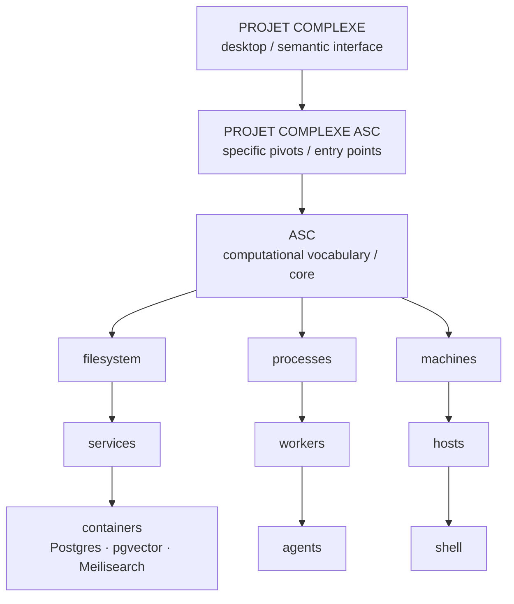

These are not three competing implementations of the same thing. They are three different scopes.

- **ASC core** defines a generic vocabulary and mechanism for naming, addressing, composing and executing computational things.
- **Projet Complexe** is the desktop application and semantic environment built around tasks, knowledge, research, projects and agents.
- **Projet Complexe ASC** is the deliberately thin integration layer containing the specific ASC entry points, pivots, compositions and environment declarations needed to make Projet Complexe operate through ASC — including the Compose stack that *projects* a personal corpus into forms a small-context LLM can actually use.

The important architectural rule is therefore unchanged:

> **Projet Complexe should use ASC without becoming ASC-specific, while Projet Complexe ASC should use ASC specifically without becoming a second ASC.**

What *did* change in v3 is the retrieval doctrine:

> **Tika + Solr is no longer the default identity of search.** Extract remains a *capability*. Canonical text remains on disk. The queryable projections on the local Compose stack are **Postgres** (system of record, JSON, jobs, claims, optional `tsvector` fallback), **pgvector** (named embedding space, selected chunks), and **Meilisearch** (lexical, typo-tolerant, interactive top-k). RAG is how a 7B-class model stays inside its Flow band. It is not the second brain.

# 0. What v3 changes, and what it refuses to reopen

## 0.1 Kept from v2 (do not undo)

Revival v2 already decided the cuts that the 2024–2026 practitioner literature keeps trying to invert. v3 does not reopen them.

| Decision | One-line form |
|---|---|
| Three projects | ASC executes. Projet Complexe ASC composes. Projet Complexe interprets. |
| Thin Tauri | The UI never operates the host. |
| CLI = GUI | Anything the GUI can cause must remain reproducible from the terminal. |
| Capability, not implementation | Ask for OCR, not Tesseract; for `search-knowledge`, not Meilisearch. |
| Graph is conceptual | Relationships are a model. They need not live in one graph database. |
| Knowledge is not RAG | Claims, evidence, unknowns, KnowledgeGaps, provenance. Indexes are projections. |
| Extract once, fan-out | Canonical text on disk; projections may lag and can be dropped. |
| Mutual killswitch | Task can suspend itself to research. Research can be killed by the task imperative. |
| Genericity scale | Concepts start local and may be *promoted*. Do not speculate the core ontology. |
| Wikipedia / DBpedia | Offline *library* (pointers, QID), not an import into the personal graph. |
| IEML | Compass, not a runtime, not a hash codec. |
| Local-first | Laptop + LAN box + 16 GB dedi. Cloud is a metered overflow, not the brain. |
| `$` in prose | Only ASC conceptual placeholders (`$subject`, `$action`, `$entity`, `$field`). Pivot names have no dollar. |

The August 2026 notes in Projet Complexe (`14-proposed-architecture.md`, `17-local-dev-stack-architecture.md`, `18-graph-rag-wikipedia-db-pedia-ieml.md`) remain the IPC, paging, and Graph-RAG *stance*. v3 rewrites their **engine list**.

## 0.2 Changed from v2 / from note 17

| Was (v2 / note 17) | Is (v3) |
|---|---|
| Apache Tika as the default extract *service* | `extract` as a pivot. Implementations: Docling, pdftotext, OCR, ASR, format-specific parsers. No JVM extractor as identity. GROBID is *not* Tika-class identity either: it is one Implementation of **bibliographic** extract, used when DOI lookup fails. |
| Solr as the lexical default | **Meilisearch** as the lexical projection (typo-tolerant top-k, filters, instant search for the UI and for RAG packing). |
| Postgres + pgvector as an *optional* semantic extra | **Postgres** as the system of record for metadata, chunks, claims, tasks, jobs, contracts. **pgvector** as the *selected* semantic projection. |
| Arango as the default graph engine | Graph remains conceptual. **Postgres** (JSONB, recursive CTEs, accepted-link tables) is the default store for typed relations. A dedicated graph engine stays an open, later choice if traversals hurt. |
| “Just embed everything” as a temptation the notes already refused | Still refused. v3 adds *why* it is fatal for **small context windows**: a bad chunk occupies a larger fraction of the working set. |
| Solr-first then optional vectors then graph walk | **Meilisearch lexical → optional pgvector → accepted-neighbour walk in Postgres → packed RAG working set.** Postgres `tsvector` is the *fallback* if Meilisearch is down (progressive enhancement), not a second always-on lexical engine. |

## 0.3 Why this rewrite exists

Three pressures arrived after v2:

1. **The README rewrite** restates Projet Complexe as a Flow problem for agents: task complexity ≈ effective cognitive capacity. Effective capacity is not model size. It is retrieval quality, tool availability, memory organisation, planning depth, uncertainty estimation, and budget. A 7B model with excellent retrieval can outperform a 70B model with a stuffed or empty window. RAG on the *local* stack is how small-window models stay in the Flow band.
2. **The literature instruments** (AI agents review, Social Media / folksonomy review) already forbade “memory = vector DB” and “the framework is the brain.” They still named Solr and Tika as the *example* engines. Those names must not freeze into ASC vocabulary.
3. **New material** (three 2026 papers; Magda *Just Use Postgres*; Devlin *Building LLM Agents with RAG, Knowledge Graphs, and Reflection*; Sanderson/Freeman/Schmidt *Data Contracts*; Kolb/Rosen *Cognitive Kin*; Kofler *Scripting Automation*) supplies mechanisms for Postgres-as-SoR, hybrid RAG, contracts on extract, routing/cascades, a persistent research world with *uncertainty*, and a refusal of the “digital employee.”
4. **Scholarly PDFs are not generic PDFs.** A Google AI Mode thread (2026-08-21) asked whether there is a better modern approach than GROBID: [share.google/aimode/bLnLKL2cieSL3nN48](https://share.google/aimode/bLnLKL2cieSL3nN48). Query: *“is there a better modern approach to the problem apache grobid is tackling?”* (Apache-2.0 licence, not an ASF project.) The share’s own answer: CRFs and layout tokens (2008-era GROBID) vs multimodal VLMs / layout-aware nets (Docling, LlamaParse, Nougat, Marker) that emit Markdown/JSON. Steal the **diagnosis**. Refuse the **collapse** “therefore replace GROBID with a VLM.” See §10.4.

v3 is the place those pressures meet the three-project cut.

## 0.4 Sources this note reads (paraphrase only)

This document **paraphrases**. It does not paste books, papers, or carousels into the second brain. That failure mode was already named for Wikipedia dumps: a library, not an import.

**Prior revival and instance notes**

- Revival v1 — Tauri as thin visual control plane over ASC
- Revival v2 — three projects, killswitch, genericity scale
- ASC `README.md` (2026 rewrite in progress) — Flow for agents; genericity; `$subject` / `$action` vs `$subject` / `$object` / `$action`
- Projet Complexe notes 14, 17, 17-ui, 18 (August 2026)

**Literature instruments (2026-08-18)**

- `AI agents literature review.md` — eleven books + Karpathy LLM-wiki cluster; Part IX doctrine
- `Social media Literature Review.md` — folksonomy of 2024–2026 AI carousels; write policies; hybrid search; energy ceiling

**Research papers (local copies, 2026-03)**

- Moslem & Kelleher, *Dynamic Model Routing and Cascading for Efficient LLM Inference: A Survey*, arXiv:2603.04445
- Dupoux, LeCun & Malik, *Why AI systems don’t learn and what to do about it*, arXiv:2603.15381
- Long, *AI-Supervisor: Autonomous AI Research Supervision via a Persistent Research World Model*, arXiv:2603.24402

**Books newly opened for v3**

- Denis Magda, *Just Use Postgres!*, Manning, 2025 — Docker Postgres; JSON; FTS; pgvector; HNSW/IVFFlat; a RAG prototype
- Mira S. Devlin, *Building LLM Agents with RAG, Knowledge Graphs, and Reflection*, 2025 — RAG as grounding; graphs for structure; reflection loops; multi-agent as a *later* layer
- Chad Sanderson, Mark Freeman, B.E. Schmidt, *Data Contracts*, O’Reilly, 2025 — producer/consumer contracts, schema + semantics, quarantine, lineage
- Christophe Kolb & Jan Rosen, *Cognitive Kin*, 2026 — agents as partners in meaning-making, not employees
- Michael Kofler, *Scripting Automation with Bash, PowerShell, and Python*, Rheinwerk, 2024 — glue languages; do one thing well; scripts as the implementation of pivots

**Scholarly extraction (complement, 2026-08-21)**

- GROBID (kermitt2) — bibliographic TEI from scientific PDFs; optional Crossref / biblio-glutton consolidation; used at scale in S2ORC / HAL. Strong on headers and references; weak on complex tables (its own literature and later table benchmarks say so).
- Livathinos et al., *Docling*, 2025 — layout-aware conversion; `DoclingDocument` with provenance; CPU-friendly; MIT; tables via RT-DETR + TableFormer.
- Google AI Mode share (user-provided, 2026-08-21) — GROBID as CRF + engineered layout tokens, fast on CPU, weak on math / odd layouts / bad scans; “modern” path as VLMs and layout-aware nets (Docling, LlamaParse, Nougat, Marker) into Markdown or JSON.
- Marker, MinerU / MinerU2.5, Nougat — PDF→Markdown/JSON. MinerU leads published table/formula scores; GPU is a cost cliff. Marker is throughput + a restrictive weight licence. Nougat proved academic VLM OCR; it is not a new default.
- LlamaParse (LlamaIndex) — API-first “agentic” parser. Named by the share; refused as default (not local-first; outbound on private PDFs).
- OpenAlex, Crossref — *authority* bibliographic records. Lookup beats parsing when a DOI exists.
- Sorić, Senellart et al., *Benchmarking Table Extraction from Heterogeneous Scientific PDF Documents*, 2026 — tables are a separate problem from bibliography.

The earlier book shelf (Bhagwat, Ozdemir, Berryman, Winteringham, Osmani, Grootendorst, Labaschin, Reddi, Sadhu & Konar) is not re-reviewed here. It is **used** through the August instruments.

# 1. The three projects

## 1.1 ASC: the computational vocabulary

ASC is the most generic layer. Its concern is not “the second brain.” Its concern is the computational environment itself: files, directories, processes, threads, machines, services, workers, projects, commands, scripts, environments, dependencies, capabilities, hooks, entry points, sidecars, arguments, execution, composition.

ASC asks:

> **What is this thing, where is it, how can it be addressed, and what can be done with it?**

It should remain useful even if Projet Complexe never existed, and even if the user never installs a GUI.

ASC is therefore not primarily an API server, a desktop backend, a task manager, or a second-brain database. It is closer to a **language and filesystem-oriented computational model**. Its ambition is a common vocabulary for anything that interacts with the shell somehow — below the shell (machine, OS, filesystem, process, device, service, container) and above it (project, workflow, worker, agent, task, operation, capability) — without becoming specialised for every domain that uses it.

The README’s current formulation is the right constraint: ASC is glue. It wraps other CLIs and OS operations; it keeps **names** stable when implementations change; it adapts to host, OS, and other variants. Complex NL and agent orchestration are **out of ASC core**. They belong in a dedicated project instance — here, Projet Complexe ASC.

Kofler’s framing of scripting as *glue code that does one thing well* is the practitioner echo of that README. Bash, Python, and PowerShell are **implementation languages behind hooks**, not a second control plane. A pivot such as `extract-document` may be a Bash wrapper one year and a Python worker the next. The name does not move.

## 1.2 Projet Complexe: the semantic and visual environment

Projet Complexe asks:

> **What am I trying to accomplish, what do I know, how are things related, and how should I act upon them?**

Its vocabulary contains task, project, objective, plan, idea, document, source, concept, research, knowledge, relationship, publication, agent.

This is the second-brain layer. The desktop application is envisioned as Tauri + SolidJS. The UI technology is not the essential part. The essential part is the distinction between two orientations of activity:

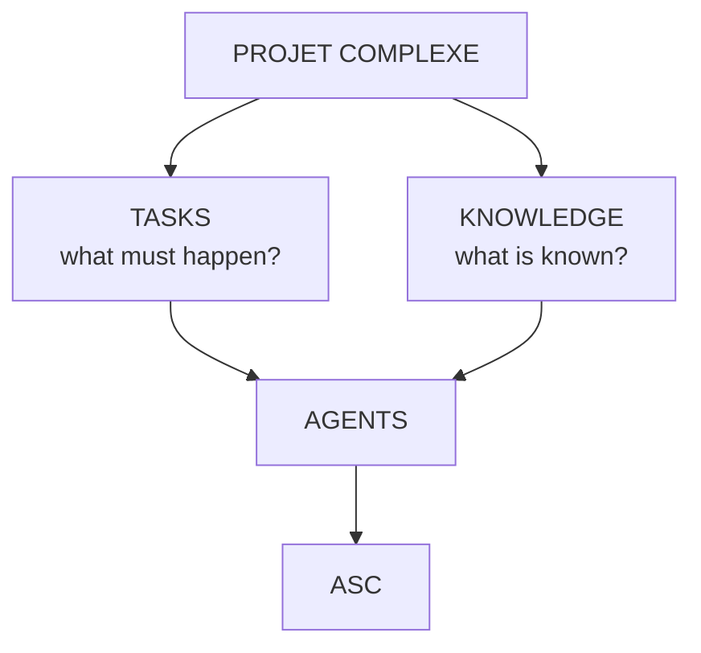

A task is oriented toward achieving something. Knowledge is oriented toward understanding something. Agents sit at the intersection because autonomous activity necessarily moves between the two.

Kolb and Rosen call the hoped-for relation *cognitive kinship*: humans and agents sharing a conceptual landscape, not a helpdesk ticket queue. Social Media folklore calls the same relation “digital employee.” v3 **steals kinship as a design ethic** (judgment stays human; agents amplify a coordinate) and **refuses the employee metaphor** (unsupervised inbox, wallet, hiring, eight-hour ambient graphs). Godin’s “phantom productivity” in the folk review is the same refusal in another vocabulary.

## 1.3 Projet Complexe ASC: the specific pivots

The third project is much thinner. It should not become another application layer. Its purpose is to contain the **specific ASC-facing vocabulary required by Projet Complexe**.

ASC may generically know how to execute, inspect, search, spawn, stop, watch, read, write, compose. Projet Complexe ASC turns those into stable entry points such as:

```text
research
index
extract
recognize
relate
build
run-agent
inspect-agent
stop-agent
publish
```

without requiring those concepts to become primitives of ASC itself.

A second brain might need a `research` entry point. ASC should not therefore become a “research framework.” Likewise, this environment needs concrete engines:

```text
postgres + pgvector
meilisearch
docling / pdftotext / ocr / asr
ollama / lan-runtime / remote API
agent-runtime
```

Those are not ASC primitives. They are implementations or project-specific pivots.

```text
ASC
    What is generically possible?

Projet Complexe ASC
    Which of those possibilities does this environment expose,
    and under which stable names?
    (including: which Compose services project the corpus)

Projet Complexe
    What does all of this mean for the user's tasks,
    knowledge and projects?
```

If Docling is replaced, `extract` remains. If Meilisearch is replaced, `search-knowledge` remains. If the embedder is replaced, `index` remains and the **named embedding space** is rebuilt — it is not mixed with the old one.

# 2. Why this is better than a monolith

The dangerous architecture would put Tauri, SolidJS, filesystem, shell, process management, Docker, Meilisearch, Postgres, Docling, OCR, agents, the task model, the knowledge model, and the OS abstraction inside Projet Complexe.

It eventually creates two problems. First, the desktop application becomes responsible for things that should belong to ASC. Second, ASC begins acquiring concepts that only make sense for one application.

The three-project architecture prevents that gravitational pull. Each layer can remain relatively ignorant of the layers above it.

# 3. ASC is not the operating system

ASC should not attempt to replace Linux, POSIX, Bash, Docker, or Postgres. Its purpose is to provide a vocabulary *over* them.

“Restart this service” may resolve to `systemctl`, `rc-service`, `Restart-Service`, or `docker compose restart`. The abstract operation is stable. The implementation is not.

This gives several forms of portability:

```text
OS portability
    Debian, Ubuntu, Arch, Windows, …

tool portability
    pdftotext, Docling, a custom parser, …

search portability
    Meilisearch today, another lexical engine tomorrow
    (the pivot is search-knowledge, not a vendor)

agent portability
    local LLM, LAN runtime, remote API, future backend
```

The consumer should ask for a capability rather than care about the implementation.

# 4. Naming, pivots, YAML, filesystem, DSL, shell

The deepest idea in ASC is not “API.” It is **addressability**. A thing becomes useful to a computational language when it can be given a stable name and a stable point of access.

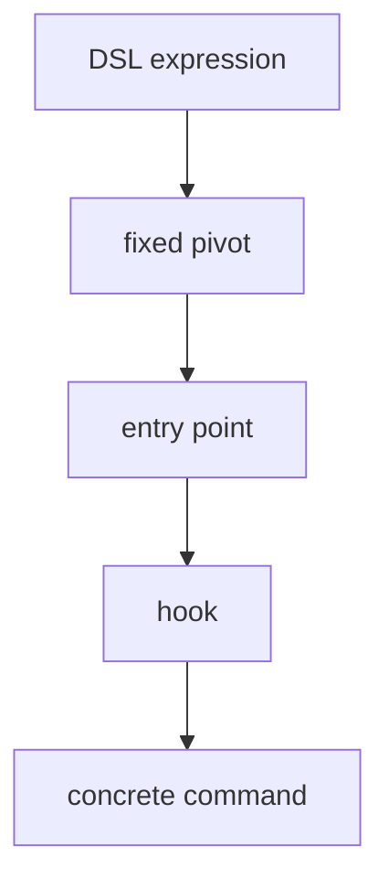

The same conceptual object can have several representations: YAML declaration, filesystem path, entity, sidecar, entry point, DSL expression, generated artifact, shell execution, graph node, **Postgres row**, **Meilisearch document**, **pgvector chunk**. Those are views. The originals stay on disk.

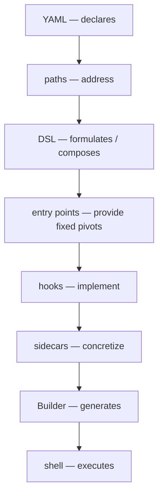

`include` is resolve, compose and merge — not class inheritance.

**Entity versus ability.** `tesseract` is software. It *provides* OCR. An agent should be able to ask for OCR, not for a binary name. The same cut now applies to search: ask for lexical retrieval, not for Meilisearch; ask for a named embedding space, not for “the vector DB.”

The DSL should remain small and filename-safe. It is not a replacement for Bash. Parallelism is a property of composition, not of every primitive.

# 5. Execution versus interpretation

> **ASC is authoritative about execution. Projet Complexe is authoritative about interpretation.**

ASC answers: what exists, what can be done, where is it, how is it executed. Projet Complexe answers: why it matters, what it is related to, what I am trying to accomplish, what I currently believe, what should happen next.

The boundary is not backend vs frontend. It is execution vs interpretation. The Tauri application is one interface through which the interpretive layer interacts with the execution layer.

Tauri stays thin: application lifecycle, window management, IPC, secure communication, packaging, desktop integration. SolidJS provides views. Kobalte provides behavioural primitives. CSS provides the visual language. ASC provides the computational substrate.

**Invariant:** anything the GUI can cause to happen should remain reproducible from the terminal.

Events are first-class. The GUI should not poll. ASC emits `project.changed`, `worker.started`, `agent.tool_call`, `indexing.progress`, `indexing.completed`. Projet Complexe interprets those as research started, knowledge gap discovered, evidence added, task blocked, task resumed.

# 6. The task / knowledge mutual killswitch

The original Projet Complexe distinction between **task-oriented** and **knowledge-oriented** work is not two tabs. It is two modes of autonomous activity, later restated as two projections of **one coordinate** (`goal`, `focus`, `trail`, `depth`). Switching mode must not move the coordinate.

A task has an imperative structure: objective, state, dependencies, inputs, outputs, deadline, agent, execution.

Knowledge has an epistemic structure: claim, source, evidence, concept, relationship, confidence, provenance, context, **unknown**.

They intersect continuously. A task may require knowledge. A task may produce knowledge. Knowledge may invalidate a task. A task may reveal that knowledge is missing.

The phrase **“task-oriented vs knowledge-oriented: mutual killswitch”** is a control principle. Each can impose a stopping condition on the other.

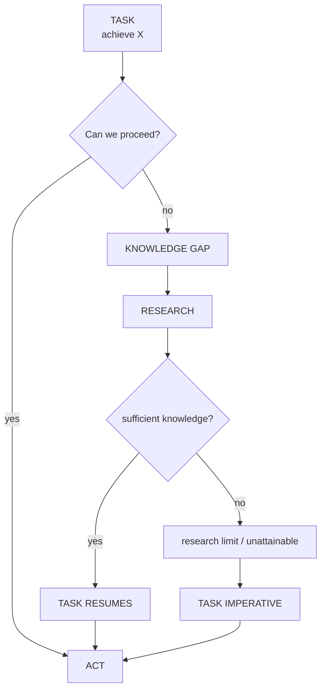

The critical concept is **sufficiency**. Research is not “know everything.” It is “know enough to make the next justified move.” Task execution is not “continue regardless of uncertainty.” It is “make progress until a knowledge deficit becomes materially blocking.”

An autonomous agent is therefore not “an agent that keeps executing without human intervention.” That definition encourages runaway behaviour. A more useful definition:

> **an agent that can regulate the relationship between action and uncertainty.**

It needs to know when it can act; when it cannot act without learning something; and when it has learned enough that further learning is no longer justified by the task.

This is particularly relevant to researcher agents. They must have a parent task, a knowledge requirement, and stopping conditions (sufficient evidence **or** research budget exhausted **or** question shown to be undecidable). If they cannot produce useful knowledge, they report `knowledge unavailable` rather than expanding forever.

Knowledge is therefore not merely a database of notes, embeddings, and RAG hits. The most interesting knowledge object may be `Unknown` or `KnowledgeGap`, because that object can directly influence task execution.

The knowledge graph should contain uncertainty: suspected, supported-by, conflicts-with, remains-unknown, irrelevant-to-task, sufficient-for-decision.

Dupoux, LeCun and Malik (2026) give this loop a cognitive-science name that v3 **maps** rather than **imports as a training factory**:

| Their term | Local meaning |
|---|---|
| **System A** — learn from observation | Knowledge orientation: extract, index, relate, record unknowns. No obligation to act. |
| **System B** — learn from action | Task orientation: run-agent, write Completions, change the world of files and jobs. |
| **System M** — meta-control | The killswitch, the token governor, the energy/RSS caps, `inspect-agent` / `stop-agent`. |

Steal the *split* and the claim that deployed models currently outsource learning to humans (which, for a personal second brain, is a **feature**: HITL accept of links). Refuse their evolutionary bilevel optimisation of A+B+M as a product, refuse unattended self-training on the household corpus, and refuse treating “the MLOps pipeline” as something an agent should automate on private notes.

Kolb and Rosen’s *cognitive kinship* sits on the same hinge: partnership requires **interruptibility**. An unkillable “colleague” is not kin; it is a process without a stop button.

# 7. Flow, Cognitive Load Ratio, and why small windows force RAG

The README rewrite states the human Flow condition as:

> challenge ≈ skill

For an agent:

> **task complexity ≈ effective cognitive capacity**

Effective capacity is not parameter count. It depends on:

- available context (window *and* how full it already is)
- retrieval quality (right passages, not merely many passages)
- tool availability (allowlisted pivots, not a raw shell)
- memory organisation (files + typed objects vs chat log)
- planning depth
- decomposition strategy
- uncertainty estimation
- time / token / energy budget

A 7B model with excellent retrieval may outperform a 70B model with poor context. “Skill” is an emergent property of the whole cognitive architecture.

**Under-challenged.** Excess unused capacity relative to the problem: overthinking, hallucinated complexity, unnecessary abstractions, verbosity, recursive planning, inventing distinctions that do not exist. Ask “rename this file” and the model writes five paragraphs. Humans get bored. LLMs ramble.

**Over-challenged.** Effective complexity exceeds resources: saturated window, contradictory instructions, missing ontology, too many objectives, hidden assumptions, excessive branching. The model forgets constraints, contradicts itself, latches onto superficial cues, ignores part of the prompt, oscillates. Humans experience anxiety. Agents experience instability.

**Prompt engineering is challenge regulation.** A good prompt keeps the agent inside its optimal cognitive operating region — regulating complexity, ambiguity, branching factor, uncertainty, and objective count — not merely reducing token count.

v3’s engineering translation:

> **RAG on the local Compose stack is the primary actuator of Flow for small-context models.** Retrieval quality raises effective skill. Packing discipline lowers challenge. The killswitch is the override when the ratio cannot be restored.

Moslem and Kelleher (2026) document the same phenomenon inside a single model as overthinking simple queries and underthinking hard ones, and across models as **routing and cascading**. Their survey is stolen as a *policy language* for Projet Complexe ASC, not as a 1.5B learned router:

- **Difficulty-aware:** lexical lookup and a small local model for rename-this-file; research packing + larger LAN model for “is this extraction strategy sufficient.”
- **Cascade:** try Meilisearch + 7B; if the token governor and the self-check (or a cheap verifier) say insufficient, escalate *the packed working set* to a stronger runtime — do not dump the corpus into the large model.
- **Uncertainty:** verbalized confidence is weakly calibrated (their survey agrees with the folk review). Prefer structured KnowledgeGaps and retrieval diagnostics over “I’m 90% sure.”
- **Refuse:** LLM-as-judge as epistemology; Chatbot-Arena routers as a household product; querying five models in parallel as a default (energy, latency, lethal trifecta if any path is outbound).

Devlin’s slogan — intelligence is connecting, reasoning, and reflecting — is usable only if **connecting** happens *outside* the window (indexes, accepted links) and **reflecting** is `inspect-agent` plus HITL, not an unbounded cognitive loop that re-reads the same 200 chunks.

# 8. Knowledge is not RAG — but small windows still need RAG

Revival v2 §26 and literature Part IX forbade the collapse “memory = vector database.” That prohibition stands.

What small windows add is a **budget**:

```text
context window
  = system / pivot instructions
  + task / coordinate
  + tool schemas
  + retrieved evidence
  + scratch / plan
  + model output
```

Every retrieved token that does not earn its place is a tax on planning and on reflection. Grootendorst’s “context engineering” (selection, compression, ordering, lost-in-the-middle) and Berryman’s inert citations are not optional polish. They are how a 8k–32k local model remains usable on an 85 GB mixed archive.

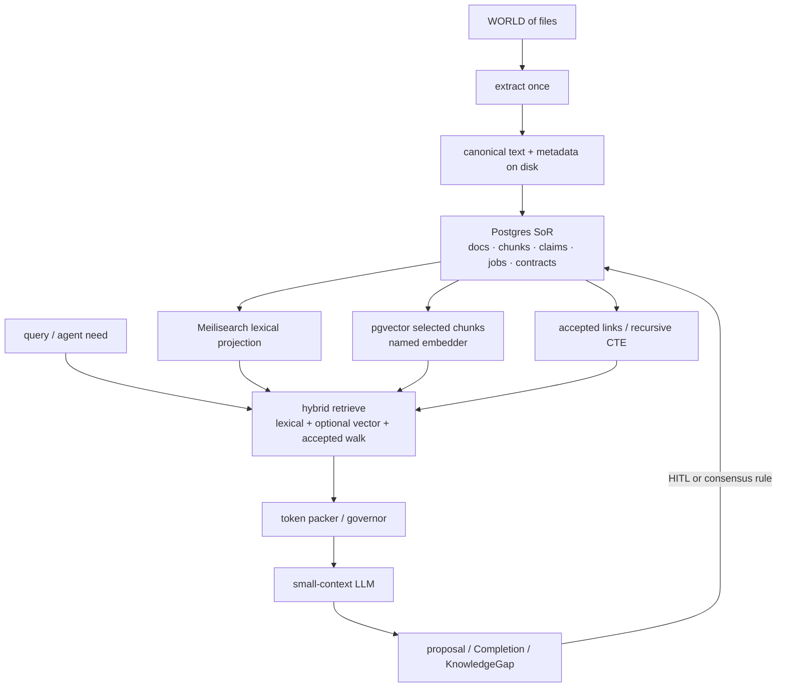

**Retrieval order (do not invert)** — updated from literature IX.3.3:

1. Filesystem + filenames + git (agentic glob/grep still wins on code and on this repo).
2. **Meilisearch lexical** — quotes, names, typo-tolerant titles, filterable attributes (media type, language, source tree, has-OCR).
3. **Optional pgvector** on *selected* chunks, **named embedding space**, never mixed across embedders.
4. **Accepted-neighbour walk** in Postgres (not a dump of proposed triplets).
5. **Packed RAG** inside `research` / `run-agent` — pointers plus short inert spans, not 80-page OCR in the prompt.
6. Offline encyclopedia lookup (Kiwix) when the home link is down — never as graph nodes.
7. Graph-RAG community reports only on a chosen personal corpus, as generated Notes, not as the UI home.

Devlin’s “RAG as the backbone of truthful agents” is **adapted** as this order, not as “stand up a vector DB and chat.” Magda’s chapter 8 prototype (embed movie plots, cosine search, then prompt an LLM) is the *minimum* RAG loop. A second brain needs the layers above it: contracts, provenance, accept/reject, killswitch, and a lexical engine that does not depend on an embedder being warm.

# 9. The v3 retrieval stack

## 9.1 Roles (one engine, one job)

Do not pick one database to be “the brain.” Heterogeneous archives need extraction, lexical search, semantic similarity, typed relations, and transactions. Those are different jobs. Compose makes it cheap to run several. It does not make it wise to let them fight over identity.

| Engine | Job | Is the brain? |
|---|---|---|
| **Filesystem** | Originals; canonical extract artifacts; sidecars | No. Heritage. System of record for *bytes*. |
| **Postgres** | Metadata, chunk table, claims, tasks, jobs, JSONB payloads, foreign keys, transactions, roles, optional `tsvector` fallback, recursive CTE hierarchies | **System of record for structured facts.** Still not “knowledge.” |
| **pgvector** | Approximate nearest neighbours over *selected* passages in a named space | Projection. Rebuildable. |
| **Meilisearch** | Interactive lexical search, typo tolerance, ranking, filterable facets light enough for a desktop UI and for RAG candidate generation | Projection. Rebuildable. |
| **LLM** | Propose, draft, pack, reflect *inside a pivot* | Never identity. Never accept. |

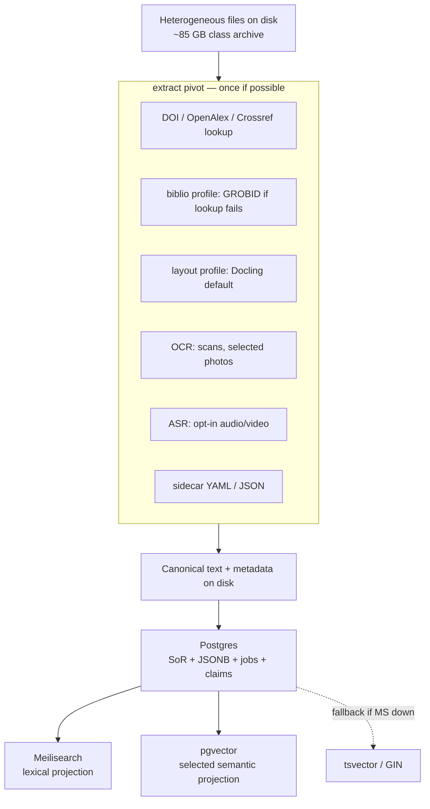

## 9.2 Why not Tika + Solr as identity

Note 17 was right about **jobs** (extract once, lexical first, vectors optional, ASR as a cost cliff) and wrong to freeze **vendors** into the architecture narrative.

**Tika.** Excellent as *an* Implementation of `extract` for office/PDF/EPUB. Problems as identity: another JVM; quality still collapses on scans (OCR is a different worker); it is not a search engine; it tempts “the extractor is always on.” Magda’s lesson for this house is the opposite of a sidecar JVM: **land structured results in Postgres** after a bounded job. Kofler’s lesson: the extractor script should do one thing (emit canonical text + a contract-shaped record) and exit.

**Solr.** Excellent inverted index, facets, battle-tested at 10⁵–10⁷ docs. Problems as the *default* on a 16 GB dedi that also runs models: JVM RAM tax; ops surface (cores, schema.xml culture); weaker typo-tolerance for a desktop “second brain” UX; easy to treat as the system of record. For RAG packing you need **fast top-k**, not a search-ops career.

**Meilisearch** replaces Solr *for this instance* because:

- typo-tolerant ranking matches how a human and a small model actually query a personal corpus;
- RAM and operational complexity fit a Compose profile beside Postgres;
- documents are JSON, which maps cleanly to Postgres rows (the projection can be rebuilt from SQL);
- the UI can feel instant without making Tauri talk to the engine (ASC still opens the localhost socket).

It is still a projection. It can be replaced. The pivot remains `search-knowledge` / `index`.

## 9.3 Why Postgres is the system of record (Magda, adapted)

Magda’s slogan “just use Postgres” is a **pressure-release** against a zoo of specialised stores, not a religion that forbids Meilisearch. v3 takes the parts that reduce *undeclared consumers* and *split-brain identity*:

- **Docker-first locally** (his ch.1 pattern): Compose service, published on `127.0.0.1` only, same as note 17’s loopback rule.
- **Integrity:** constraints, foreign keys, transactions, MVCC. Accepting a Claim, writing its Evidence rows, and enqueueing a Meilisearch upsert should be one transaction at the *Postgres* layer; the search projection may lag and is rebuilt from truth, not the reverse.
- **JSONB** for heterogeneous extract metadata without pretending every PDF has the same columns. Index the paths you query (expression / GIN), do not query-by-hope.
- **Recursive CTEs** for task trees and “this note is a child of this research question” — enough hierarchy that Arango is not required on day one.
- **Roles:** the model worker is not the superuser. Magda’s ACL chapter is the same isolation Reddi stated as Jeep: the pretty UI and the weights process do not share fate with the database.
- **pgvector:** store embeddings *next to* the chunk they came from, with `embedder_id`, dimension, distance metric, and index type (HNSW for interactive ANN; IVFFlat only if a measured Requirement says so). Mixing embedders in one column is a defect.
- **Built-in FTS (`tsvector`)** as **progressive enhancement / fallback**, not as the interactive lexical engine. Magda is honest: tokenise, stem, rank, GIN/GiST. That is enough to keep *reading* when Meilisearch is down. It is usually poorer than a dedicated search engine for typo-tolerant UI search — which is why Meilisearch exists in this stack.

What v3 refuses from a naive “just use Postgres for everything”: using `LIKE` as search; embedding every social thumbnail; letting the LLM issue arbitrary SQL from the webview; treating pgvector as memory.

## 9.4 pgvector and the named embedding space

Embeddings are a **projection of selected chunks**. Rules:

- Chunking is a job-layer concern (500–2000 tokens as a starting band, overlapping only if an eval says so). Independent of UI page size.
- Only corpora that survived lexical / type gates: searchable PDF/EPUB/markdown first; OCR text with confidence; transcripts if the user opted in. Not snapshot HTML/JS. Not every social photo.
- One **named space** per embedder hash. Rebuild on embedder change. Never concatenate spaces.
- HNSW (Magda 8.5) is the default ANN. Measure recall@k on *this* corpus (folk review: hybrid BM25 + vector + rerank, measure).
- The governor may refuse to embed. That is a feature (energy, RAM, CLR).

## 9.5 Meilisearch as lexical projection

Meilisearch holds **documents derived from Postgres**, not originals.

Typical fields (illustrative, not a frozen schema): `id`, `path`, `title`, `text` (or a bounded preview + pointer), `media_type`, `language`, `source_tree`, `mtime`, `extract_version`, `has_ocr`, `license`. Filterable attributes are a closed list. Ranking rules stay boring (words, typo, proximity, attribute, exactness) until an eval justifies custom ranking.

**Sync policy:** Postgres is truth. A worker upserts/deletes Meilisearch documents when an extract version is accepted. Meilisearch may lag. If it diverges, drop the index and rebuild. Do not “fix” search by writing into Meilisearch by hand.

**Query path:** interactive search and RAG candidate generation hit a **warm** client (Compose HTTP on loopback via ASC). `make` is for jobs (`index`, `extract` batches), not per-keystroke search. That rule is unchanged from note 17.

## 9.6 Hybrid retrieve and pack (the RAG loop that fits a small window)

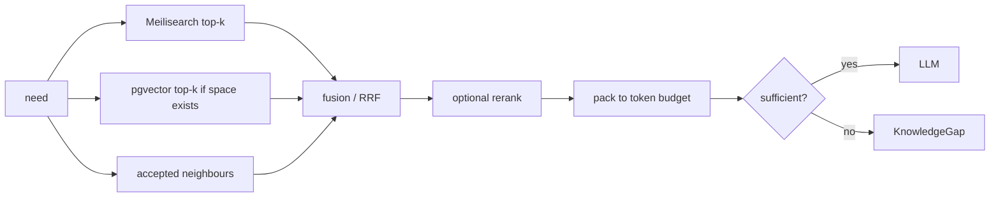

**Packer rules** (Devlin ch.3 + Grootendorst/Berryman via the book review):

- Budget evidence to a **fraction** of the window (a working default: leave headroom for instructions, tool results, and output; do not “fill because we can”).
- Prefer **pointers + short spans** (file id, offsets, quote) over full pages.
- Put the question and constraints at both ends; long passages in the middle as *inert* citations — or omit long passages.
- Lost-in-the-middle is a CLR failure, not a reason to buy a 128k API.
- If fusion still cannot support a responsible answer: **KnowledgeGap**, not another 20 chunks.
- Show **which projection answered** (Meilisearch vs pgvector vs walk) in the UI when the user is in operator mood.

**RAGAS split** (folk review): faithfulness-to-chunks is not truth. Steal retriever vs generator metrics. Keep a tiny gold set of questions with quotes from *this* corpus. Refuse Gemini-as-judge as epistemology.

## 9.7 Graph RAG without a graph product

Note 18 stands: Graph RAG is a retrieval strategy over *your* texts. The conceptual graph can be projected from Postgres tables (nodes = accepted entities; edges = closed relation types with Factor, `valid_at`, provenance).

Long’s AI-Supervisor (2026) is the paper that most tempts a dedicated Research World Model. Steal, adapt, refuse:

| Steal | Adapt | Refuse |
|---|---|---|
| Persistent world across sessions, not a stateless paper pipeline | Claims / Links / Gaps in Postgres + files | Unsupervised “AI professor” that writes papers |
| Uncertainty on edges (`U=0` verified / `U=1` unverified) | HITL accept, or two extractors agree, before `accepted` | Auto-commit of LLM triplets |
| Gaps as first-class objects | KnowledgeGap already in v2 | Gap discovery by running other people’s GPU benchmarks as a default job |
| Consensus before write | Human is the consensus device at household scale | Multi-agent societies chatting until they agree |
| Elastic token budget | Governor + killswitch | Elastic as “spend until it looks like a lab” |

Wikipedia remains an offline library. schema.org remains a handful of type *names*. IEML remains a compass.

# 10. Extract-once and data contracts

Sanderson, Freeman and Schmidt describe data contracts as the missing design surface between producers and consumers. RAG with a small window makes their “garbage-in, garbage-out” **immediate**: a schema-less extract does not merely rot a dashboard; it occupies the only working memory the model has.

v3 treats **the extract artifact** as a contracted product.

## 10.1 Producers and consumers

| Producer | Consumer |
|---|---|
| `extract` workers (Docling, pdftotext, OCR, ASR) | Postgres chunk/document tables |
| Human (accept/reject, typed links) | Accepted-link tables; UI |
| `index` worker | Meilisearch; pgvector |
| `research` / `run-agent` | Packed working set; Completions; proposed links |

The LLM is a **consumer of packed views**, never a silent producer of accepted knowledge.

## 10.2 What the contract covers (adapted, household scale)

From their component list, shrunk until it fits one human and two machines:

- **Schema** of the extract record: id, source path, bytes hash, media type, extractor Technology hash, extract version, text pointer, language, OCR/ASR confidence, timestamps.
- **Semantics:** what “text” means (reading order? alt-text? caption vs body?); what a chunk boundary is; that `proposed` ≠ `accepted`.
- **Lineage:** original bytes → extract version → projection generation. Re-extract is a new version, not an overwrite (Reddi via the book review).
- **Quarantine:** failed PDFs and garbage OCR do not become zero vectors or Meilisearch spam. They become KnowledgeGaps or `extract.failed` events.
- **Detection / prevention:** CI-shaped tests on extractors (a handful of gold PDFs); version the contract; do not silently change chunking under a live embedding space.
- **Unlearning:** delete source → drop projections → drop adapters. Possible only if we refused “train on all chats.”

Shift-left, locally: **validate at extract**, not at chat time. A second brain that discovers at query time that 8k snapshot-JS files were indexed has already paid the CLR tax.

## 10.3 Cost cliffs (unchanged numbers, new engine names)

Note 17’s mixed archive (order of magnitude: ~85 GB, ~55k files, ~4k PDFs, ~2.3k videos) still governs:

| Cheap / default | Medium / batch | Cost cliff / opt-in |
|---|---|---|
| Notes, sidecars, metadata | OCR of document-like images | ASR on thousands of videos |
| Searchable PDF / EPUB | | Embed every passage |
| Meilisearch over canonical text | Selected pgvector | Always-on CAG of the whole accepted world |

Extraction and ASR are **offline budgets**. Search and graph navigation are **online budgets**. Do not couple them in one `make` that blocks the window.

Scholarly PDFs add two more cliffs that must not be collapsed into “run a better PDF model”:

| Cheap / default | Medium / batch | Cost cliff / opt-in |
|---|---|---|
| DOI / Crossref / OpenAlex lookup | Docling layout on selected papers | MinerU VLM / any GPU document model on the whole shelf |
| `pdftotext` on searchable PDF | GROBID **only** on papers with no DOI or a dirty reference list | Caption every figure with a VLM |
| Table JSON kept as a table | Camelot/Tabula on digital-native tables | Flatten every table into markdown chunks and embed |

## 10.4 What the Google share gets right, and where it collapses two jobs

The AI Mode answer (paraphrased from the user’s paste) is a fair history of **layout**:

| | GROBID (legacy, as the share frames it) | “Modern” VLM / layout-aware DL |
|---|---|---|
| Era | Sequence labelling, CRFs, engineered layout tokens (~2008 design) | Documents as vision **and** text at once |
| Output | TEI-XML: headers, text blocks, citations | Markdown / structured JSON: reading order, tables, inline equations |
| Hardware story | Fast, relatively light on CPU | Often GPU; API variants exist |
| Failure modes the share names | Complex math, non-standard layouts, degraded scans | (implied: solved by VLMs) |
| Named tools | GROBID | Docling; LlamaParse; Nougat / Marker |

**Steal.** GROBID is not the right *layout* engine in 2026. Tables, formulas, multi-column reading order, and bad scans are why Docling (and, if a Requirement says so, Marker/MinerU/Nougat-class models) exist. TEI-XML is not what a small-context packer wants to swallow raw.

**Refuse the implied substitution.** The share treats “the problem GROBID is tackling” as one blob: parse the PDF. GROBID’s *documented* centre of gravity is **bibliographic** (title, authors, affiliations, citation markers, reference lists, optional Crossref / biblio-glutton consolidation). Docling/Nougat/Marker/LlamaParse mostly answer:

> How do I turn a page into LLM-ready Markdown/JSON?

That is a different job. Replacing GROBID with a VLM because math and tables got better **drops the registry consolidation that made references *correct***, and **does not** produce a knowledge graph. Markdown is not a graph. A parsed equation is not a `cites` edge.

LlamaParse is named honestly as API-first. For this house it is a **guest that does not enter the default Compose file**: private PDFs would leave the machine (`api-ok` only, redacted, metered). Local-first and the lethal trifecta both forbid it as identity.

Kofler’s rule: **do one thing well.** Split `extract` into profiles. Do not load GROBID + Docling + Marker + a cloud parser on every file.

```text
GROBID / CRF job     → bibliographic identity + citation strings (CPU, when lookup fails)
Docling (default)    → reading order, sections, tables, figures on CPU
Nougat / Marker / MinerU VLM → formulas / hard layouts, metered
LlamaParse           → overflow Implementation only, never default
Crossref / OpenAlex  → canonical Paper / Author / Venue records
Postgres             → accepted graph + table objects + figure pointers
LLM                  → propose claims; never mint DOIs or table cells
```

“Apache GROBID” in the Google query is the **licence**, not the Foundation.

## 10.5 Recommended approach: lookup first, layout second, GROBID as fallback, graph by kind

The best lightweight path to a **precise and correct** scholarly graph is not a better PDF neural net. It is **not treating extraction as identity**.

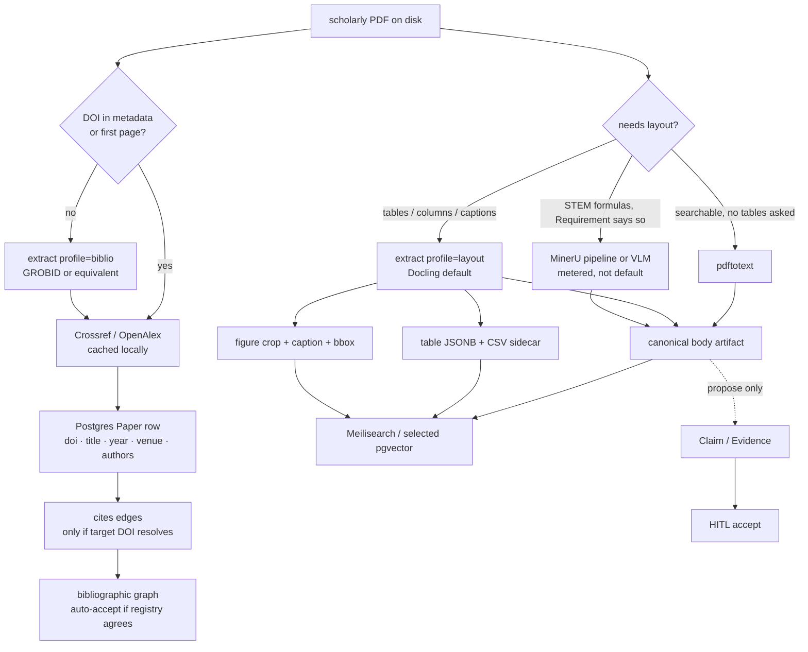

### Bibliographic identity (high precision, cheap)

When a DOI exists, **lookup is the extractor**. Crossref and OpenAlex return authors, titles, venues, related works. Cache the JSON beside the PDF (compile at ingest). The personal graph stores a **pointer** (`doi`, optional OpenAlex id, optional Wikidata QID), not a second copy of the registry.

Auto-accept `Paper` nodes and `cites` edges **only** when:

- the source PDF’s DOI matches the registry record, and
- the target of `cites` also resolves to a DOI / OpenAlex id.

Unresolved citation strings become `citation.unresolved` KnowledgeGaps, not fuzzy title-match nodes. Fuzzy merge is how you get two “Smith 2019” papers glued together.

GROBID (or biblio-glutton) runs as `extract` **profile `biblio`**, on a bounded batch, when lookup fails or when you need in-text citation markers aligned to a reference list. It stays a **job**, not an always-on JVM next to Meilisearch. Consolidation against Crossref is the part to keep even if the layout models get better: that is how references become *correct*, not merely *parsed*.

Docling/Marker/MinerU must not be the system of record for “who wrote this paper.” They guess from pixels. The registry knows.

### Body, layout, formulas (Docling default)

For mixed personal archives, **Docling on CPU** is the default layout Implementation: MIT, multi-format, `DoclingDocument` carries provenance (page, bbox), already named in v2/v3. Use it when `pdftotext` is not enough (multi-column, captions, table regions).

**MinerU** (especially 2.5 VLM) currently leads published scores on tables, formulas, CJK. That does not make it the household default: GPU, large weight download, extra licence conditions. Route it like ASR: a Requirement on a *subset* (math-heavy papers you will actually query), not a crawl of 4k PDFs.

**Marker**: throughput. Skip unless an eval on *this* shelf beats Docling enough to justify GPL/RAIL-M weights.

**Nougat / Marker** (as the share groups them): trained on academic PDFs; LaTeX and dense blocks. Useful as *layout* Implementations. Nougat is not a new default (superseded in practice by Docling/MinerU-class pipelines). Marker: throughput, weight-licence friction. Neither replaces DOI lookup.

**LlamaParse:** refuse as default. Same capability name (`extract` profile `layout`), different Environment (`api-ok`).

Never: GROBID + Docling + MinerU + Marker + LlamaParse on the same file “to be safe.” Pick one layout path per document class. Compare on a gold dozen, then freeze the Technology hash. The share’s “modern vs GROBID” table is a **router input**, not a licence to run every column.

### Tables (structure is the knowledge)

A scientific table is not a paragraph. Flattening it into markdown and embedding it is how small-window RAG invents numbers.

Contract for a table object (Postgres JSONB + optional CSV sidecar; originals stay in the PDF):

```text
table_id
source_document_id
extract_version
page, bbox
caption
headers[]
cells[row][col]     # strings; keep merged-cell map if the extractor provides it
format              # html | csv | json
confidence
Technology hash
```

Rules:

- Index the **caption** and a bounded preview in Meilisearch. Do not dump 400 cells into a vector chunk by default.
- When `research` needs the table, pack **the table object** (CSV/HTML slice, token-capped), not an embedding neighbour of a broken pipe table.
- Digital-native PDFs: Camelot/Tabula remain legitimate *light* Implementations for profile `table` when Docling is overkill.
- GROBID’s table story is historically weak; do not ask it to be TableFormer.
- LLM “read this screenshot” is opt-in, metered, and writes *proposed* cells with provenance — never silent overwrite.

Sorić & Senellart 2026 exist because table extraction is its own benchmark. Respect that split.

### Figures and diagrams (pixels + caption, not a second corpus of prose)

A diagram is an **image artifact** plus a **caption** plus geometry:

```text
figure_id
source_document_id
path_to_crop          # on disk
page, bbox
caption               # extracted, not generated
optional proposed_alt # VLM description, proposed, model id
```

Default: store crop + caption; Meilisearch indexes the caption; the UI can open the image. That is enough for “Figure 3 in Dupoux et al.”

`describe-figure` is the ASR of images: useful, expensive, wrong often (axis labels, Greek, colour meaning). Opt-in per figure or per folder. Generated alt-text is never the caption. Scientific diagrams that matter to a Task can be transcribed by a human once; that transcription is a Note with `depicts` → figure.

Do not OCR every figure “because Docling can.” Cost cliff, garbage in the lexical index.

### Two graphs, not one mush

Precision comes from **not mixing kinds of edge**.

| Graph | Nodes / edges | How it becomes accepted | Lightweight? |
|---|---|---|---|
| **Bibliographic** | Paper, Author, Venue, `cites`, `authored`, DOI | Registry agreement; GROBID only to *propose* when lookup fails | Yes: HTTP + cache + Postgres |
| **Document structure** | Document → Section → Table/Figure → caption | Extractor output with confidence; quarantine failures | Yes: one layout job |
| **Claim / argument** | Claim, Evidence, `supports`, `conflicts`, KnowledgeGap | **HITL** (or a later explicit consensus rule) | Yes: few objects, high value |

Devlin’s “knowledge graphs give structure to chaos” is true for the **first two** if the structure is extracted and looked up. It is false if an LLM fills a property graph with “facts from the paper.” Long’s Research World Model is stealable as *uncertainty on edges* (`proposed` / `accepted`), not as unsupervised gap mining.

The personal knowledge graph that is **correct** is mostly bibliographic + structural, with a thin layer of human-accepted claims. That is the opposite of Graph-RAG-over-Wikipedia and the opposite of “embed the PDF and extract triples.”

## 10.6 Why this is the lightweight choice

- **One always-on search stack** (Postgres + Meilisearch ± pgvector). Extractors are jobs that exit.
- **DOI lookup** is bytes, not a 2 GB CRF/VLM. Cache it.
- **Docling CPU** covers mixed formats without a GPU identity.
- **GROBID** is justified only where it still wins (dirty bibliographies, citation markers) — a minority of files if DOIs are harvested.
- **Tables and figures stay typed objects**, which *reduces* RAG tokens: the packer fetches one table, not three pages of prose that mention it.
- **Claim HITL** is the cheapest correctness device. It does not require a VLM.
- **LlamaParse** is a named overflow, not a Compose service. Sending the research shelf to an API is the opposite of lightweight *and* of local-first.

The tempting heavy approach — always-on GROBID + always-on MinerU VLM + auto-triple extraction + Arango — would feel like progress for a week and then own the 16 GB dedi.

## 10.7 Pivot / profile map for scholarly extract

Keep **one** pivot (`extract`). Vary the **profile** (Environment / args), not the name:

| Profile | Implementation candidates | Writes |
|---|---|---|
| `plain` | pdftotext, Tika-as-guest | canonical text |
| `layout` | Docling (default); Marker / MinerU / Nougat if an eval on *this* shelf wins; LlamaParse only under `api-ok` | body + sections + provenance |
| `biblio` | DOI lookup first; GROBID if needed | Paper row, authors, reference strings |
| `table` | Docling TableFormer; Camelot/Tabula | table JSONB / CSV |
| `figure` | layout crop + caption; optional VLM | image sidecar + caption row |

`relate` may propose `cites` from a resolved bibliography. `recognize` collapses author aliases only on **accepted** Person nodes (ORCID / OpenAlex id when present). `research` packs a table or a figure caption by id, not by hoping the embedder saw the grid.

# 11. Agents, tools, routing, reflection

## 11.1 Agents are not another silo

An agent is a computational actor in this environment: intent, plan, tool call, observation, command, result, change, state transition, output. ASC’s `thread` is an execution pivot, not necessarily a POSIX thread. A `change` is the bridge between execution and knowledge.

Devlin’s four faculties — retrieval, reasoning, reflection, action — map onto pivots:

| Faculty | Pivot / object |
|---|---|
| Retrieval | `research`, `index` query path, packer |
| Reasoning | Task + Requirements + Implementations (minimal reasoning model already in the notes) |
| Reflection | `inspect-agent`, eval objects, HITL, killswitch |
| Action | `run-agent`, allowlisted tools, Completions |

Her multi-agent “AI startup team” (ch.6) is **refused as a default**. Literature IX.2 Collapse E and the folk review’s Anthropic-swarm failures already said why. Prefer few specialised consumers of the **same typed world**.

## 11.2 Tools

A “tool” is either an ASC pivot or a helper strictly inside a hook. The model never sees `make hook`. MCP, if it appears, is an Implementation of “talk to X,” declared in YAML. ASC is not an MCP server in v1 (that would invert the control plane). Folk review: host ≠ server ≠ tool; allowlist; namespace; sandbox; truncate; cap steps; feed `ERROR:` back.

Lethal trifecta (Bhagwat via the book review): private data + untrusted content + outbound channel. Partition `index` / local `research` / web `research` / `run-agent` / `publish` as already tabulated in IX.3.8. Computer-use stays off by default.

## 11.3 Routing and cascading (paper 2603.04445)

Projet Complexe ASC should expose **model routing as Environment**, not as a trained 1.5B router:

```text
lan-only  → local small model, no remote
default   → local / LAN cascade: lexical answer or 7B → LAN if packed set still insufficient
api-ok    → metered overflow with redaction record
```

When: at pivot start, and at packer “insufficient” — not every token. What information: Requirement fields (privacy, latency class, cost class), not hidden-state probes unless a later eval demands them. How: declarative chain in YAML, inspectable, swappable.

Moslem & Kelleher’s open challenges (generalisation to new models, multi-stage cascades, multimodality) are **not** a reason to postpone extract-once. They are a reason to keep the router boring.

## 11.4 Reflection without self-modification

Devlin’s cognitive loop (plan → act → reflect → revise) is the right *shape* for `run-agent`. The household rule is Winteringham/Osmani via the book review: tests and gold quotes before LLM-as-judge; the human remains architect; the 70% residue is represented as KnowledgeGaps, not as shame or as another loop.

Long’s self-improving development loops and Darwin-Gödel-Machine folklore stay **research-only**, sandboxed, never production self-mod of pivots.

# 12. Four communication primitives (unchanged, engines renamed)

Note 14: **Request, Event, Stream, Query**. Tauri commands for bounded work; events for small notices; channels for ordered high-volume data; queries for paged search/graph slices. Never ship the whole graph. Never let the webview open Meilisearch or Postgres. Never pass an arbitrary `make` string.

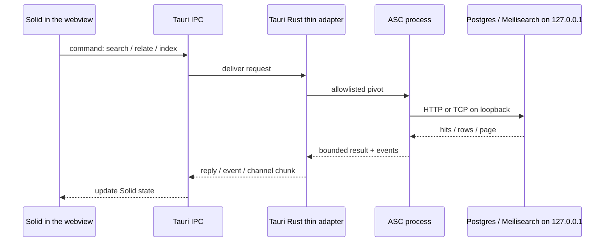

Publish Compose ports on loopback only (`127.0.0.1:…`), never `0.0.0.0`.

Paging remains five layers: job chunking, text chunking, query paging, IPC paging, render LOD. Offset is fine for UI pages of 50–250. Graphs page **neighbours of one node**.

# 13. Instance layout (Projet Complexe ASC)

Same pattern as a typical Compose-based project: one instance repo, several pieces.

| Path | Role |
|---|---|
| `$PROJECT_DOCROOT` | Project instance (dev stack) |
| `$PROJECT_DOCROOT/app` | Tauri UI piece (host app, not a Compose service) |
| Compose at instance root | **Postgres+pgvector**, **Meilisearch**, optional OCR/ASR workers |
| ASC | Control plane: packages, compose lifecycle, indexing jobs |

Tauri stays a host process. It talks like `curl` / `psql` on the laptop through **published localhost ports**, via ASC. Containers talk to each other on the Docker network (`postgres:5432`, `meilisearch:7700`). Tauri cannot use Docker DNS unless it is in the Compose network (it should not be).

**Who opens sockets?** Preferred: ASC. Rust is a pipe. Webview `fetch` to Meilisearch is forbidden as the main path.

**Which `make` targets from the UI?** Only allowlisted pivots with structured args. Not generic `hook`. Not `destroy` / host-provision / git from the webview.

# 14. CLI, GUI, machines, sidecars

Machines become knowledge objects: a host is related to projects, agents, capabilities, documents, hardware constraints. The UI is not a CPU dashboard. A machine appears because it is relevant to a task.

Sidecars make virtual things concrete. Filename-safe names remain a composability constraint across filesystem, shell, env, DSL, URLs, logs, JSON, **and SQL identifiers**.

# 15. Repository boundaries

```text
github.com/Paulmicha/asc
```

Generic computational vocabulary. Domain-agnostic. No Meilisearch, no Claim type, no Flow meter as a primitive.

```text
github.com/Paulmicha/projet-complexe-asc
```

Specific compositions: `extract`, `index`, `research`, `run-agent`, Compose declarations, embedding Environment, data-contract YAML for extract records, Meilisearch sync workers. Thin enough that removing it does not damage ASC.

```text
github.com/Paulmicha/projet-complexe
```

Tauri, SolidJS, task/knowledge model, research model, agent visualisation, activity timeline, killswitch UX, token-governor display. No generic OS abstractions. No DB passwords.

| Project | Fundamental question | Vocabulary | Responsibility |
|---|---|---|---|
| **ASC** | What exists and what can be done? | entities, pivots, hooks, capabilities, execution | generic computational substrate |
| **Projet Complexe ASC** | Which ASC capabilities does this environment expose, and how? | specific entry points, compositions, integrations, Compose projections | domain-specific ASC layer |
| **Projet Complexe** | What am I trying to accomplish, what do I know, and what does it mean? | tasks, knowledge, projects, research, agents, Flow/CLR | semantic + visual environment |

Dependency: Projet Complexe → Projet Complexe ASC → ASC. ASC knows nothing about Projet Complexe. No circular coupling.

The Second Brain should not become an ASC frontend (organising principle = tasks/knowledge, not services). ASC should not become a knowledge graph (no idea/belief/literature-review primitives by default).

# 16. Genericity scale (unchanged mechanism)

```text
1. primordial
2. primitive
3. ASC core extension
4. ASC contrib extension
5. third-party contrib extension
6. project-specific implementation
```

A project-specific concept can still be implemented *using* ASC. Something invented for Projet Complexe may later migrate upward. ASC should not try to predict the final ontology.

Postgres, pgvector, and Meilisearch sit at **level 6** (this instance) or at most **level 5** (a reusable contrib that exposes `search` / `embed` abilities). They are not candidates for ASC core.

The killswitch, KnowledgeGap, token governor, and extract contract start at level 6. Promotion is earned by reuse, not by enthusiasm.

README collision note (kept): `$subject` / `$action` versus `$subject` / `$object` / `$action` is an agnostic stance in core discovery. Projet Complexe ASC may use the extra nesting where it clarifies (`host` / `dependency` / `install`) without forcing every subject to have objects.

# 17. Combined implementation stance (v3 doctrine)

This is the design reading of the August instruments plus the new shelf, aimed at a small-context local stack.

## 17.1 Forbidden collapses (updated)

- **A.** The framework is the brain (Mastra, LangGraph, Mem0, Meilisearch Cloud, “just pgvector”).
- **B.** Memory is a vector database — or “memory is Meilisearch.”
- **C.** The prompt is the interface.
- **D.** Computer-use is the universal tool.
- **E.** Multi-agent means a society of LLMs chatting (including Long’s unsupervised lab and Devlin’s startup team as defaults).
- **F.** Wikipedia in the graph.
- **G.** Eval SaaS as understanding.
- **H.** The IDE is the agent (Cursor CLI is one provider).
- **I. (new)** Tika + Solr *are* the architecture.
- **J. (new)** Magda’s “just use Postgres” means delete Meilisearch *and* the filesystem originals.
- **K. (new)** Kolb/Rosen kinship means unsupervised ambient employees.
- **L. (new)** Dupoux/LeCun/Malik A-B-M means the house should train foundation models from observation of private life.

## 17.2 Permitted stack (mechanism by mechanism)

**Control plane.** ASC only. Autonomy is a property of a Task. `extract` / `index` are workflows. `research` may start as an agent and should fall back to a workflow when the path stabilizes.

**Memory architecture** (Grootendorst types, retargeted):

| Cognitive label | Object | Store |
|---|---|---|
| Working | current thread + packed page | ASC thread, sidecar; **not** the full Meilisearch hit list |
| Episodic | events, Completions, traces | files + optional Meilisearch over traces |
| Semantic | Source, Note, Claim, Link, Concept | files + Postgres + Meilisearch + optional pgvector |
| Procedural | Implementation, Requirement, pivot | git + ASC YAML; human-triggered, versioned, capped |
| Parametric | model weights | Ollama / LAN / API; fine-tune almost never |

Write policies (folk review II): working bounded; episodic append-only; semantic upsert with provenance; procedural versioned and never the primary search corpus.

Labaschin: retention and retrieval are both stochastic. Silent promotion is dangerous. Importance can be a Factor on a Link. Ebbinghaus is a bad policy for citations.

**Compile at ingest** (Karpathy folk / Tencent / Graphify): index pages, receipts, markdown as audit surface. Refuse model-owned wiki and auto-accept.

**Context engineering as CLR control.** Token governor per pivot: max working set, what is cropped, what is summarised, what is cited by pointer. Feed errors into the next context. Decompose or retrieve *less* before switching to a bigger model.

**Evals.** EvalSuite objects: target pivot, failure modes, success metrics, gold items. Gold and functional tests before LLM-as-judge. SME for links is you.

**Security.** Schema on pivot I/O. Secrets not in the webview. Model process sees job inputs, not DB superuser. Unexpected network from the model process is an `inspect-agent` event.

**Energy.** Inference dominates this household’s footprint. Caps on concurrent agents and overflow tokens *are* climate policy. Heritage hardware. Progressive enhancement: lexical on the laptop works if LAN and dedi are dead.

**Coding / 70%.** Cursor CLI is a provider. The residue of *this* project is mixed-archive extraction, identity across FR/EN/pt, killswitch UX, paging, provenance, **packer quality** — KnowledgeGaps, not vibes.

## 17.3 Two orientations as agent policies

**Task-oriented.** Check Requirements and Implementations. If a workflow exists, run it. If knowledge is insufficient, create a KnowledgeGap and **yield**. Write Completions. Feed errors forward. Stop on budget.

**Knowledge-oriented.** Lexical first, then optional vectors, then accepted neighbours. Propose Links with a closed type and a Factor. Do not auto-accept. Record contradictions as typed edges. Encyclopedia as cited source only. May spawn a Task if a gap is actionable — mode switch, not a different app.

## 17.4 Events over prompts

ASC emits execution events. Projet Complexe interprets. The world’s lines are events and query pages. The player’s lines are intents and pivot calls. The model’s lines are confined to a scene inside a pivot.

## 17.5 Provider handoff

Entity ids do not change when the model changes. Relation types are closed. Embedding spaces are named. Artifacts carry `extracted_by`, model id, provider, time, confidence. `lan-only` vs `api-ok` is enforced by ASC.

## 17.6 UI consequences

Show: working-set size (CLR), which projection answered, provenance on model sentences, 70% residue as gaps, performance/energy next to LOD. Do not make the prompt, raw tool JSON, or the entire graph primary.

Kolb/Rosen: the interface should make **partnership** legible (what the agent changed, what it is unsure of, what it needs a human for). It should not make **employment** legible (an always-on body that “owns” the inbox).

# 18. Pivot map (v3)

| Pivot | Does | Uses | Must not |
|---|---|---|---|
| **extract** | Canonical text + contract record; profiles `plain` / `layout` / `biblio` / `table` / `figure` | DOI lookup; pdftotext; Docling; GROBID only if biblio lookup fails; OCR / ASR | Be Tika- or GROBID- or VLM-the-architecture; write accepted Claims; flatten tables into chunks; LlamaParse as default |
| **index** | Fan-out projections | Postgres upsert; Meilisearch sync; optional embed | Embed-all; index snapshot chrome |
| **recognize** | Collapse aliases on accepted entities | Postgres identity tables | Auto-merge from a carousel OCR |
| **relate** | Propose typed Links | Packer may retrieve supporting spans | Auto-accept; GraphRAG Wikipedia |
| **research** | Bounded inquiry for a parent Task | Hybrid retrieve + pack + small LLM | Live web by default; unbounded fan-out |
| **publish** | Views over accepted world | Files, maybe static export | Vendor HTML as the graph |
| **run-agent** | Act under a Task | Allowlisted tools; routing Environment | Generic shell; computer-use default |
| **inspect-agent** | What runs, where, over which files, how to stop; evals; watts | Job records in Postgres | LLM-as-judge as truth |
| **stop-agent** | Killswitch actuator | ASC thread/process stop | “Pause eight hours and hope” |

# 19. What should be built first

The first milestone is still not the complete Second Brain, agent framework, or graph product. It is the architectural invariant:

> **A useful operation can be represented as a stable ASC pivot, executed from the terminal, and consumed by Projet Complexe without the UI knowing its implementation.**

v3’s *retrieval* invariant, stacked on top:

> **A small-context model can answer a question about the local corpus from a packed working set produced by Meilisearch ± pgvector, without the webview holding a DB password, and without Tika or Solr being named in the UI.**

Suggested order of experiments (still not a plan; architecture before parameters):

1. Compose: Postgres+pgvector + Meilisearch on loopback. `psql` and a Meilisearch health check from the terminal via ASC.
2. `extract` workflow on a small PDF/EPUB shelf (not Tika-as-identity). Contract tests on a handful of gold files. Canonical text on disk + Postgres rows. On *papers*: DOI lookup before CRF or VLM; one gold table kept as JSONB, not as a markdown chunk.
3. `index` → Meilisearch. Prove quotes and typo-tolerant titles work.
4. Events from extract/index to a dummy Solid view.
5. Warm `research` query helper (not `make` per keystroke).
6. Typed Claim/Link in Postgres (or YAML projected into Postgres), human-written, rendered in knowledge mode.
7. Optional pgvector on *one* corpus, named embedder, hybrid fusion, packer with a hard token cap.
8. `run-agent` with Ollama, tools = extract/index/research only.
9. HITL accept of Links.
10. Eval suite of ten questions with gold quotes (retriever vs generator split).
11. Provider swap mid-task proving artifacts survive.
12. Killswitch Task ↔ research child.
13. Progressive-enhancement test: Meilisearch down → Postgres `tsvector` still answers something; dedi down → laptop lexical still works.
14. Refuse list as tests: no webview DB client, no generic hook, no Wikipedia import, no embed-all, no computer-use, no mixing embedders.

Only after that: GROBID on the DOI-less remainder; a *single* extra layout model (Marker or MinerU) if Docling fails the gold formulas; Graph-RAG on notes; MCP sidecar; Kiwix lookup. Do not stand up GROBID and a GPU VLM before lookup + Docling have been measured. Do not start with LlamaParse.

## What not to build first

Avoid: a giant API, giant graph schema, giant agent framework, giant component library, second execution engine, second shell, Solr *and* Meilisearch *and* Postgres FTS all always-on, a second knowledge database beside Postgres, Arango “because Graph RAG,” Tika “because we used to,” GROBID+Docling+Nougat+Marker+LlamaParse on every PDF, auto-triples from papers, VLM-captioning the figure shelf.

Repeated question: is this a new primitive, or a composition? Composition → above ASC. Generic computational primitive → maybe ASC. Projet Complexe-specific → Projet Complexe ASC. Meaning for the user → Projet Complexe.

# 20. Belonging rule (unchanged, with stack examples)

**Put it in ASC if** it describes a generic computational thing; is useful without Projet Complexe; concerns naming, addressing, composition or execution.

**Put it in Projet Complexe ASC if** it composes generic ASC capabilities for this environment; defines `extract` / `index` / `research`; binds Compose services; holds the extract contract and embedding Environment.

**Put it in Projet Complexe if** it represents meaning, knowledge or intention; belongs to the task/knowledge model; interprets ASC events; is primarily human/agent semantic interaction (including Flow/CLR display).

Examples: “Meilisearch” is not an ASC word. `search` as a generic ability might become contrib. `KnowledgeGap` stays Projet Complexe until proven otherwise. `thread` / `hook` / `entry point` stay ASC.

# 21. Plasticity

Substitutions that must not collapse concepts:

```text
Meilisearch → another lexical engine
pgvector → another ANN, still named
Docling → another layout extractor
GROBID → another biblio extractor (or none, if lookup covers the shelf)
local LLM → remote model (if api-ok)
agent runtime A → runtime B
Debian → another OS
Tauri → another client
Postgres → … almost last. Magda is right that this is the expensive migration.
```

The important words remain: Search, Extract, Claim, Task, Knowledge, Project, Entry point, Capability, KnowledgeGap, Packed working set.

# 22. One-page doctrine (v3)

```text
ASC executes. Projet Complexe interprets. Pivots are the names.

Prompts live inside pivots. Graphs are conceptual. Indexes are projections.

Filesystem originals. Postgres facts. Meilisearch words. pgvector paraphrase.

Lexical before vectors before accepted walks before packed RAG.

Compile at ingest. Contract the extract. Projections may lag and can be dropped.

Small windows do not get more truth by stuffing. They get Flow by packing.

Accept links. Do not grow mush. Unknowns are objects. The killswitch is real.

Providers are implementations. Artifacts travel. Chat logs do not.

The UI never owns the host. The model never owns identity.

Local-first is ecology. Renunciation is a feature.

Frameworks are guests. Tika and Solr are guests that left.

CRF vs VLM is a layout debate. Citations are a registry debate. Tables stay tables.

Kin, not employees. Observe or act; meta-control is the hinge.
```

# 23. The whole architecture as a loop

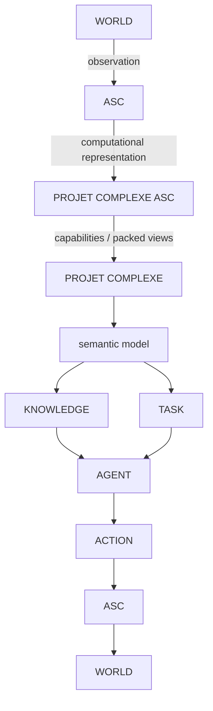

Inside Projet Complexe ASC, the retrieval loop is:

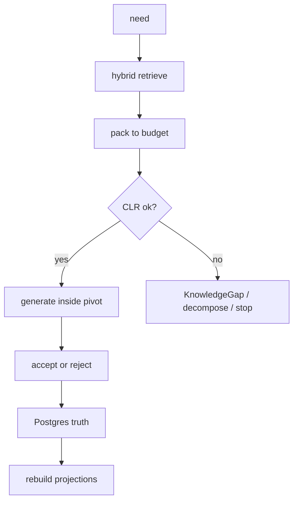

And the task/knowledge mutual killswitch still operates:

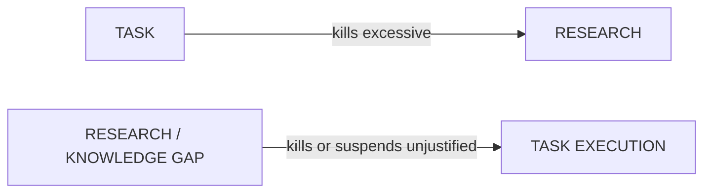

This is a more precise model of autonomous work than `agent → tools → result`, and a more precise model of RAG than `embed everything → chat`.

# 24. Open choices v3 does not settle

These remain open on purpose. They depend on disks, languages, and attachments.

1. **Which embedder, if any, on the laptop** — named Environment, not this note. Magda and Devlin compare techniques; Reddi prices the system.
2. **HNSW vs IVFFlat vs no ANN yet** — measure on one corpus.
3. **Whether Postgres `tsvector` is maintained continuously as fallback or built only on Meilisearch failure** — ops vs disk.
4. **Chunk size / overlap / reranker** — eval objects, not folklore.
5. **Closed vocabulary size for Link types.**
6. **Kiwix vs dump files vs Wikidata subset** for offline fr/en/pt.
7. **Whether a dedicated graph engine is ever justified** — start with Postgres; revisit if accepted traversals hurt.
8. **Default local model** — bake-off with GSM-Symbolic-style messy questions on *this* corpus, not a Social Media leaderboard week.
9. **How much OCR/ASR at ingest** — still a Requirement with a cost cliff.
10. **Whether a frozen CAG snapshot of accepted Claims is worth the VRAM** — only after an energy budget is a Requirement.
11. **How to represent “usually but not always”** — IEML-as-compass is a candidate; neither Magda nor Meilisearch will decide it.
12. **GROBID vs “no CRF at all”** — if DOI harvest covers the shelf, skip GROBID; keep it only for citation-marker alignment on a gold set that lookup cannot fix.
13. **Whether a GPU layout model is ever worth the dedi** — eval Docling formulas/tables on *this* corpus first; Marker/MinerU/Nougat are Implementations, not a second stack.

# 25. Final synthesis

ASC, Projet Complexe ASC and Projet Complexe should not be understood as three versions of one application. They form a stack of increasingly specific meaning.

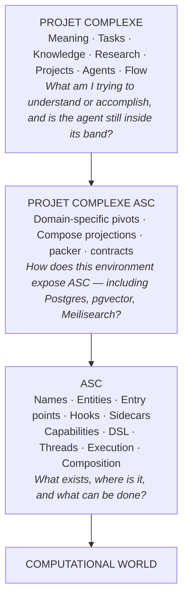

ASC starts from a deceptively simple problem: **the hard problem of naming things.** Its ambition is not to replace the shell. It is to make the shell’s vocabulary explicit.

Projet Complexe ASC is where those names become the particular environment that can **extract once, project lexically and semantically, pack a working set, and stop.**

Projet Complexe is where that environment becomes interpretable: tasks, knowledge, kinship without employment, Flow without stuffing.

The Second Brain does not replace ASC. It interprets it. ASC does not become the Second Brain. It makes the computational world legible to it. Projet Complexe ASC is the narrow bridge — and, in v3, that bridge carries a retrieval stack chosen for **small windows on a local Compose instance**:

```text
disk originals
    → extract (plain | layout | biblio | table | figure)
        → DOI / registry lookup for Paper identity
        → Postgres (facts, table JSON, figure pointers, cites if resolved)
            → Meilisearch (words, captions)
            → pgvector (selected paraphrase — not tables-as-prose)
                → packed RAG
                    → small LLM inside a pivot
                        → HITL / killswitch
```

A purely task-oriented agent risks acting without understanding. A purely knowledge-oriented agent risks researching without end. A RAG-only agent risks stuffing the window until Flow collapses.

The interesting autonomous system lies between them:

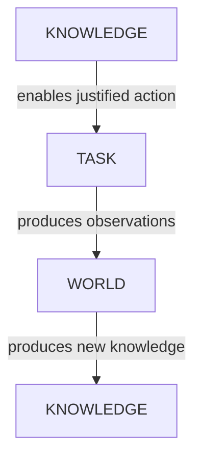

The mutual killswitch keeps the loop bounded. The packer keeps the window honest. The contracts keep garbage out of both.

The objective is neither “act at all costs” nor “know everything before acting” nor “fill the context because the model is small.”

It is:

> **know enough to make the next move, retrieve only what earns its tokens, and keep moving toward something worth accomplishing.**

The Go analogy remains. A small vocabulary with stable meanings generates a large space of configurations. ASC attempts that for the computational environment. Projet Complexe ASC attempts it for **this** environment’s indexes. Projet Complexe attempts it for meaning.

When the player is no longer necessarily human, the player still needs names, capabilities, relationships, constraints, histories, possible actions — and a working set that fits in a small window.

**If you name things right, projects practically write themselves.**

**Let’s make words matter.**

**Confidence level: 0.96** (three-project cut and killswitch inherited; Meilisearch-over-Solr and Postgres-as-SoR still eval-falsifiable; lookup-first bibliography is the high-confidence scholarly bet; Docling-default vs Marker/MinerU is an eval, not a proof.)
