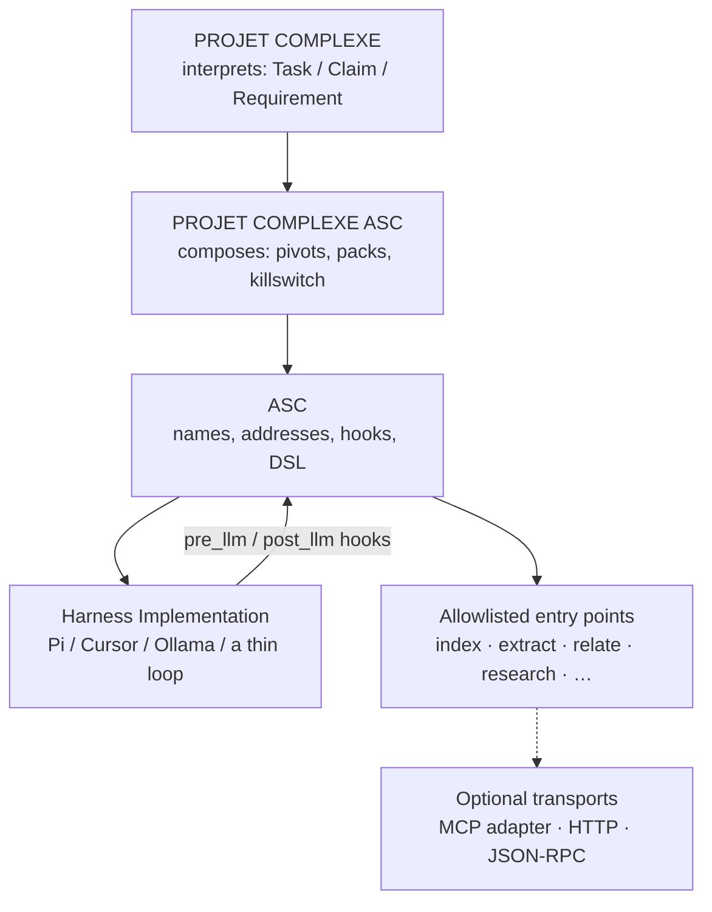
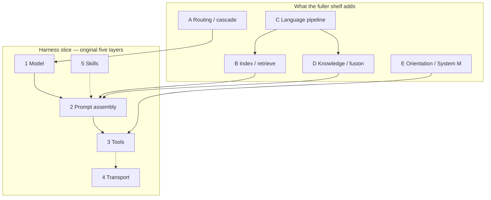
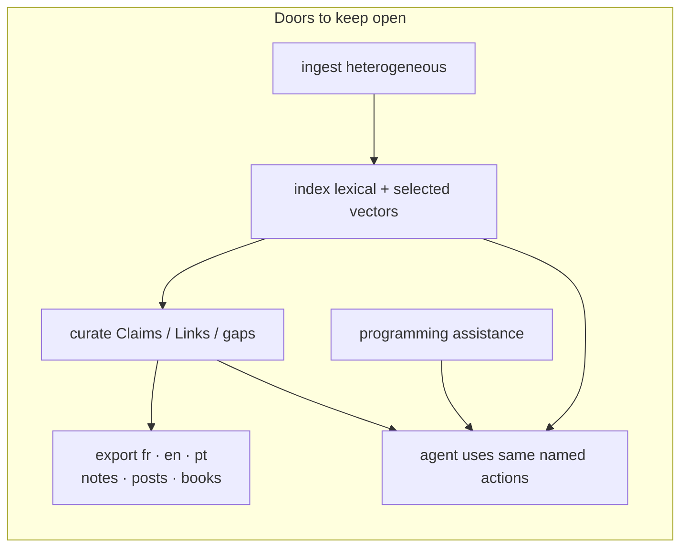
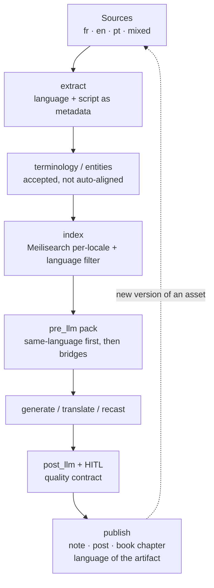
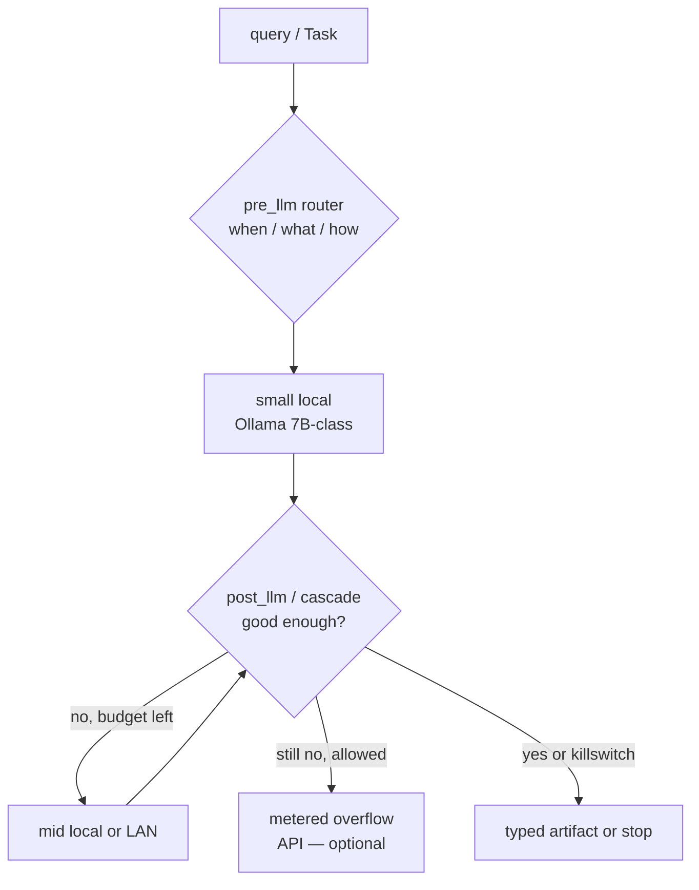

# Projet Complexe 2026 Revival (v4)

## Hooks around LLM calls, tools as ASC entry points, DSL versus MCP

**Date:** 2026-08-21  
**Status:** architecture note / design instrument (not a spec, not an implementation plan)  
**Keeps:** Revival v2 (three-project cut, killswitch, genericity scale) and Revival v3 (Postgres + pgvector + Meilisearch as retrieval; extract as a capability; RAG as context regulation).  
**Adds:** (1) a decision on *how agents get tools* — MCP vs JSON/Python registries vs Claude/Pi “skills” vs ASC hooks + entry points + DSL; (2) after the full shelf, a second cut: language, routing, curated knowledge, and which doors not to close. The first cut is the original question. The second is what that question is *for*.

This note exists because a theoretically attractive idea is easy to over-build:

> Wrap every LLM call in ASC hooks that pre-process and post-process the prompt. Implement what the industry calls tools, actions, or skills as ordinary ASC entry points. Drop MCP. Use DSL instead of JSON and Python.

The idea is **not wrong**. Parts of it are already how ASC works. Parts of it are already how every serious agent *harness* works in 2025–2026. The useful question is not “is this possible?” It is:

> Which of those layers is **ASC-generic** (worth putting in core, useful beyond one personal knowledge-management app), which belongs in **Projet Complexe ASC** as a named Implementation, and which should be **delegated** to a project that already exists?

The rest of this document answers that with a literature synthesis of the current bibliography (see §2), a map of select existing software, a reinventing-the-wheel test, and combinations that are complementary rather than redundant.

The lens for that synthesis is not “how to ship a weekend agent.” It is building a **local, multilingual (fr / en / pt), vendor-free, modest hardware compatible** tool covering heterogeneous ingest, indexing, curation, programming assistance, and exports (books, posts), all usable by both a human and an autonomous agent — **without closing doors** that a later year of work might need.



# 0. Verdict in one page

## 0.1 What the literature actually depicts

Two claims, not one.

**The agentic-harness books (Bhagwat, Berryman, Kar, Albada, Dibia, Labaschin, Lanham) still converge on a five-layer stack.** That stack is the right picture for the original v4 question (hooks, tools, skills, MCP, DSL). Collapsing those five names into one word remains the error to refuse.

| Layer | Books call it | What it is | What it is not |
|---|---|---|---|
| 1. Model | LLM, completion, Responses API | A stochastic function: messages in, tokens out | The control plane |
| 2. Prompt assembly | context engineering, application loop, packing | Code that *builds* the next request (history prune, retrieve, inject) | “Prompt engineering” as a chat craft |
| 3. Tool surface | tools, function calling, actions, computer-use | Named operations the model may *request* | Authorization; the world |
| 4. Transport | MCP, OpenAPI, RPC, SDK | How a host *discovers and invokes* a remote tool | Semantics; memory; the graph |
| 5. Procedure pack | skills, playbooks, `SKILL.md`, `CLAUDE.md` | On-demand instructions + scripts, loaded when relevant | An operating system |

The books do **not** treat MCP, skills, and tools as synonyms. That is still true after the fuller shelf.

**The rest of the bibliography do not replace that stack. They show it is too small to be “what the literature depicts” for Projet Complexe.** Prompt-pack manuals (Gautam, Sonvane) even depict a *competing* one-layer world — better wording — which Berryman already rejected. Keeping the five layers as the *whole* map would close the doors §2 exists to keep open: language, modest hardware, curated knowledge, exports.

What the expanded shelf actually adds (see §2 for file-by-file):

| Plane | Who depicts it | What it is | What it is not | Door it keeps open |
|---|---|---|---|---|
| **A. Model routing** | Moslem & Kelleher `2603.04445`; Ozdemir; Labaschin economics | Pick or cascade among *independently trained* models per query | One vendor identity; MoE inside a single net | Modest hardware *and* a later stronger model |
| **B. Retrieval / index** | Norman; Magda; Stewart; v3 | Lexical + selected vectors + metadata over canonical files | Memory; the conceptual graph; “just packing” | Heterogeneous ingest without stuffing the window |
| **C. Language system** | Yu & Yao | Ingest → terms → generate → QA → versioned export; locale is a contract | “The model speaks French” | fr / en / pt as Requirements, including books and posts |
| **D. Knowledge / fusion** | Devlin (as recipe); Koch; Long `2603.24402`; Mistrik; Kolade | Claims, typed links, gaps, uncertainty, HITL commit | GraphRAG summaries; memory MCP; a paper mill | The research loop without automating the degree |
| **E. Learning / orientation** | Dupoux et al. `2603.15381`; Lanham confirm-vs-autonomous | Observe vs act vs *switch* (System M ≈ killswitch) | Chat logs as “the agent learned” | Later real learning; task vs research now |



Read 0.1 as: **five layers for how agents get tools; five more planes for what this project is for.** The hook/DSL idea lives in the first slice. The ambition ("projet complexe", three languages, local, doors unclosed) lives in the second. Neither is a reason to merge MCP with skills, or RAG with knowledge.

## 0.2 What the idea gets right

Wrapping LLM calls in **pre- and post-processing** is not a new agent architecture. It is the *definition* of a harness:

- Berryman & Ziegler: the product is an **application loop** that snippetizes, retrieves, and assembles the next prompt.
- Bhagwat: **tool design is the most important step**; middleware/guardrails sit *around* the loop, not inside the system prompt.
- Labaschin & Wallace / Grootendorst: **context engineering** is packing, not “memory.”
- Kar (2026): orchestration patterns (router, HITL, planner-executor, watchdog) are compositions of *named steps with I/O*, not a smarter model.
- Pi (`@earendil-works/pi`): `transformContext` → `convertToLlm` → provider; events `before_provider_request` / `after_provider_response`; `registerTool`; Agent Skills.

The fuller shelf does not change that mapping. It says *what else* those same hooks must be allowed to do, or the wrap is a toy:

- **`pre_llm` is also the router** (plane A, `2603.04445`): which Technology, local-first, cascade if the small model fails. Not a second product.
- **`pre_llm` is also the language packer** (plane C, Yu & Yao): locale of the query, of the chunks, of the export contract. Not “the model speaks French.”
- **`post_llm` is also the commit gate** (plane D/E): propose a Claim / a `publish` draft; HITL or killswitch; never multi-agent consensus as truth (`2603.24402`, Kolade).

ASC already has the generic mechanism this maps onto: **hooks** (`pre_*` / `post_*` / variants), **entry points** (filename-safe, YAML-described), **DSL** (positional / boolean / named options that compile to bash). An LLM invoke is just another action. Tools the model may request are just other actions. That mapping is sound — and incomplete if hooks only “tweak the prompt.”

## 0.3 What the idea gets wrong if taken literally

| Literal reading | Why it fails |
|---|---|
| “Replace MCP” | MCP is a *transport* (JSON-RPC + JSON Schema). You do not replace USB-C by inventing filenames. You decide whether you *need* that plug for third-party tools. |
| “DSL instead of JSON/Python” | Frontier models emit **JSON tool calls**. YAML `able.yml` + DSL is the *source of truth for ASC*. JSON Schema is a **projection** of that source for the model. Replacing the projection is fighting every provider SDK. |
| “Implement what agents’ tools/skills are” | Tools ≠ skills. A tool is an executable with a schema. A skill is a *procedure pack* (progressive disclosure). ASC already has both shapes (entry point vs documentation/hook recipe). Do not merge them. |
| “ASC becomes the coding agent” | That is how you accidentally rebuild Pi, Cursor, Claude Code, Goose, and Codex. ASC is glue. Coding-agent loops are a Technology behind `run-agent`. |
| “Hooks around the LLM *are* Projet Complexe” | The wrap is necessary and small (ASC). The product is ingest, curate, export, research — in three languages, on modest hardware. A perfect `pre_llm` with an English-only index has closed the door the shelf just opened. |
| “One model behind `llm`” | Moslem: routing/cascading among independently trained models. Freezing Claude, GPT, or a single 7B as identity repeats Clinton’s obsolete-guide failure. |

## 0.4 Recommendation (usable beyond one PKM project)

**Do explore the idea — as a thin composition, not as a second MCP and not as a second Pi.**

1. **ASC-generic (put in core, or keep as doctrine):** every LLM call is an entry point wrapped by `pre_llm` / `post_llm` (and variants). Tool names the model sees are **allowlisted entry points**. YAML `entity`/`able` is canonical; JSON Schema / MCP tool lists are generated. DSL addresses arguments (`p1`, `o-max-4`). The model never sees `make hook`.
2. **Delegate (do not reimplement):** multi-provider streaming (`pi-ai` or equivalent), coding-agent TUI and session trees (Pi / Cursor), Tree-sitter code graphs (code-graph-rag or similar), MCP *as a protocol*, Agent Skills `SKILL.md` *as an interchange format* if you want other harnesses to load the same procedures.
3. **Projet Complexe ASC (instance-specific):** which tools exist (`index`, `extract`, `relate`, `research`, `run-agent`, `publish`, …); packing from v3 **plus locale**; the router/cascade policy (local 7B default, overflow allowed or not); killswitch; HITL accept of claims and of exports. These are compositions, not a new protocol.
4. **Refuse:** MCP as the user-visible capability surface; `CLAUDE.md` / skill folders as a second OS; unbounded tool catalogs; computer-use as default; Python/TS tool registries that bypass YAML; teaching the model a private DSL as its native function-call language; English-only embeddings as the store; a prompt pack as `publish`; AI-Supervisor-style paper mills; WhatsApp/OpenClaw as the control plane.

The rest of the note is the evidence for that cut.

# 1. The question, restated without hype

## 1.1 What we already have in ASC

ASC’s job is to make computational things **nameable, addressable, composable, and executable**. For agents, that already implies:

- A **pivot** (`$subject-$action`) is a named capability. `run-agent`, `extract`, `relate` are pivots, not MCP tool names.
- An **entry point** is a file that can be invoked. Hooks wrap it (`pre_extract`, `post_extract`, `pre_extract/pdf`).
- **DSL** is a compact, filename-safe encoding of argv. It is for *addressing and validation*, not for chatting with a model.
- **YAML** (`*.entity.yml`, `able.yml`) describes what is required and how to validate. The DSL example in the README (`test-in(p1,[slug(p1),…])`) compiles to bash. That is already “schema as code,” just not JSON Schema.

So the proposal is not “add hooks.” It is: **treat the LLM itself as an entry point**, and treat **every tool the model may call as another entry point**, so the same pre/post machinery, the same allowlist, the same traces, apply to both.

That is a good genericity test. If it only works for Projet Complexe’s second brain, it does not belong in ASC. If it works for *any* project that calls a model and must not let the model invent `rm -rf`, it does.

## 1.2 What “tools / actions / skills / MCP” names in the wild

These four words are used interchangeably on social media. The books and the working software do not.

**Tool / function / action.** A named operation with arguments, usually JSON Schema, executed by the *host* after the model requests it. OpenAI function calling, Anthropic `tool_use`, Google function declarations, LangChain `@tool`, Pi `registerTool`, MCP `tools/list` + `tools/call`. Bhagwat: designing this surface is the main product work.

**Skill.** A *reusable capability pack* loaded on demand: markdown instructions, optional scripts, optional pointer to tools. Anthropic Agent Skills (`SKILL.md`), Pi skills, Claude Code skills. Progressive disclosure: only the *description* sits in the system prompt; the body is read when needed. This is closer to an ASC **procedure** or a Projet Complexe **Requirement/Fallback** file than to a pivot.

**MCP (Model Context Protocol).** JSON-RPC 2.0 between a **host** (owns the loop, the model, the allowlist) and a **server** (exposes tools/resources, contains no model). USB-C metaphor: N+M instead of N×M. It does not decide *which* tools exist. It does not store knowledge. It does not replace tool-use training (ToolRL). Labaschin already warned not to bet the farm on it remaining the only norm.

**Harness.** Two meanings, both useful:

- **Eval harness:** fixtures, scores, ablations (`datasciencebrain`, RAGAS, Winteringham).
- **Agent harness:** the loop around the model (Pi, Cursor, Claude Code, Codex). Pi’s own name for itself.

ASC is already a harness for *the machine*. It is not yet an agent harness, and it should not become a *coding* harness. It should **host** one.

## 1.3 The precise claim to evaluate

> It is theoretically possible to implement tools/actions/skills as ASC entry points, and to replace MCP with simpler ASC actions addressed in DSL rather than JSON/Python.

Split it:

| Sub-claim | Verdict |
|---|---|
| LLM call as a hooked entry point (pre/post prompt) | **Yes. Do this.** It is the portable form of every harness. |
| Tools as allowlisted entry points | **Yes. Do this.** This is Bhagwat’s tool design, named in ASC. |
| Skills as on-demand procedure files | **Yes, as files — not as a new runtime.** Optionally *also* emit `SKILL.md` for Pi/Claude. |
| Replace MCP | **No, as a protocol. Yes, as the default *local* glue.** Local tools should be ASC. MCP is an adapter for *other people’s* tools. |
| DSL instead of JSON/Python | **No at the model boundary. Yes as ASC addressing.** Compile YAML+DSL → JSON Schema / MCP tool list / TypeBox. Never the reverse as source of truth. |

This table answers **only the harness cut** (layers 1–5 in §0.1). It does not settle planes A–E (router, index, language, knowledge/fusion, orientation). Those are PCA/Projet Complexe policy. Do not read a “yes” on hooks as “projet complexe is done.”

# 2. Literature review summary

This is not a second agents-literature-review. It is a **door inventory**: what each file makes newly thinkable for Projet Complexe, and which architectural shortcuts would lock a later use out.

## 2.0 Ambition lens (why “do not close doors”)

"Projet Complexe" is a tool aiming to be useful for studying and for being more productive (with a beautiful and reactive desktop UX) : a place where **heterogeneous sources** (PDFs, notes, web captures, code, audio later) can be ingested and indexed; where **French, English, and Portuguese** are first-class for retrieval *and* for exports (a book chapter, a post, a bilingual note); where **curation** (accept / contradict / gap) is the knowledge act; where **programming assistance** is a worker, not the institution; where a **local agent** can use the same named actions a human uses from the terminal — on **modest hardware** (laptop, LAN box, 16 GB dedi), **without a vendor as the brain**.

Closing a door means making an identity choice that a later year cannot undo without a rewrite: English-only embeddings as the store; a cloud chat product as memory; RAG as knowledge; MCP as the vocabulary; one graph database as the conceptual model; computer-use as “agency”; a prompt pack as the product.

Keeping a door open means **naming the capability** (ingest, index, export, curate, code-assist, research, run-agent) and leaving the Implementation swappable. Language is metadata on sources and on exports, not a fork of the app.



Modest hardware is not a reason to close the frontier-model door. It is a reason to make **routing and cascading** first-class (paper `2603.04445`): a local 7B for routine packing and research; escalate only when the Task demands it. Cloud remains a metered overflow, never the SoR.

## 2.1 Consolidated table

Columns: **interesting** = what is not just another “build an agent” chapter. **For Projet Complexe** = how it bears on the ambition above (keep / adapt / do not let this become identity). Duplicate files of the same work are one row.

| Source | Interesting / original | For Projet Complexe |
|---|---|---|
| **Stewart & Huang, *Agentic AI Data Architectures* (2026)** | “Memory as infrastructure”: agents fail because *data* is fragmented (structured / unstructured / temporal), not because the model is small. Argues for **distributed SQL** as unified retrieval, semantic-transactional joins, episodic vs long-term stores, governance *in* the fetch path. | Steal the diagnosis. Adapt as **Postgres** (Magda, v3), not Cockroach-at-home. Keep the door to a later distributed SQL if the corpus outgrows one box. Refuse “the database *is* the agent’s mind.” |
| **Norman, *Agentic RAG Systems* (2026)** | Production RAG: why naive pipelines fail (~“40%”); lexical vs semantic vs **structural** similarity; chunking; hybrid fusion; rerank; **GraphRAG** (multi-hop ceiling, Microsoft community-summary pattern, reindex pain); Self-RAG / Corrective RAG; multi-agent retrievers; RAGAS + observability + FinOps. | Steal hybrid cascade and “static retrieval cannot recover from its own mistakes” → agentic *research* loop with a budget. Adapt GraphRAG as an Implementation of `relate`/`research`, not as the knowledge model (v2/v3). Refuse LangGraph as host; refuse community-summaries as Claims. |
| **Lanham, *AI Agents in Action* (2025)** | Spectrum: no agent → proxy → **confirm then execute** → autonomous. Function calling as “model proposes, runtime does.” | Steal confirmation as a state (HITL). Keep the door to later autonomy as an *explicit* Requirement, not the default. Refuse “the model asked” as authorization. |
| **Gautam, *AI Prompt Engineering Bible* (2026)** | Prompt-craft manual (how to write prompts that “work”). | Peripheral. Steal nothing as architecture. Keep a **prompt library as files** if useful; do not let it become the product. |
| **Sonvane, *AI Prompt Mastery Guide* (2026)** | 850+ ready-made prompts (image, video, book covers, posts). | Folklore. Useful only as *examples of export genres* (cover, post, carousel). Refuse as a capability surface. Closing this door (not shipping a prompt shop) **opens** the door to real `publish` pipelines. |
| **Osmani, *Beyond Vibe Coding* (2025)** | Spectrum from vibe-coding to AI-assisted engineering; 70% problem; AI as drafter / pair / validator; when to stop vibing. | Steal: programming assistance is a **mode** with a human editor-in-chief. Keep the door to Pi/Cursor as workers. Refuse the coding agent as the second brain. |
| **Osmani, *Vibe Coding* (2025, early release)** | Same thesis, shorter. Overlaps *Beyond*. | Treat as the same door as the row above. |
| **Raschka, *Build a Reasoning Model (From Scratch)* (2026)** | How reasoning models are *trained* (not how to prompt CoT). Weights, data, recipes. | Opens a **late** door: a local reasoning small model as Technology. Do not close it by assuming only API “o-series” can research. Do not open it in v1 (training is not an immediate "projet complexe" goal). |
| **Ozdemir, *Building Agentic AI Workflows* (2025)** | Workflows vs agents; evals; multimodality; **reasoning models vs computer-use**; fine-tune; compression; Matryoshka embeddings; local-ish case studies (Qwen speculative decode, Moondream VQA). | Steal: explicit tools > computer-use; multimodel; compression for modest hardware. Adapt computer-use as a sandboxed later Implementation. Keep the door to image extract (v3 figure profile) without making AIGC a default tool. |
| **Albada, *Building Applications with AI Agents* (2025)** | Holistic lifecycle: when to use an agent; tool design; memory; single vs multi-agent; learning from experience; evals; security. The book the author “wanted to hand colleagues.” | Steal the *questions* (good tools, when RAG, when multi-agent). Adapt answers as ASC pivots. Refuse another framework ontology. |
| **Devlin, *Building LLM Agents* + *…with RAG, KG, and Reflection* (2025)** | Two files, one project: RAG + graph + **reflection** as the agent recipe. | Steal reflection as `post_llm` / a second hooked call. Adapt KG queries as `relate` on *accepted* links. Refuse RAG+KG as the knowledge plane (v3). |
| **Kar, *Building Multimodal Generative AI and Agentic Applications* (2026)** | Catalog of RAG, vectors, guardrails, agents, **MCP**, HITL and a long pattern list (router, watchdog, planner-executor, database-with-tools…). Local Ollama chapter. | Steal guardrails-as-layer, HITL, “tools talk to the DB.” Adapt each pattern as a *composition*, not ontology. MCP = one chapter, not the architecture. Keep local-Ollama door. |
| **Clawdbot / OpenClaw handbook (OCR, 2026)** | Local-first agent on Mac Mini / Docker; WhatsApp/Telegram bridges; gateway websocket; prompt-injection hardening; “always-on” sizing. | Steal local-first + sandbox. Adapt “always-on” to the **LAN box / dedi**, not to a chat app. Refuse WhatsApp as control plane; refuse pairing-codes-as-identity. |
| **Kolb & Rosen, *Cognitive Kin* (2026)** | Working *with* agents; meaning stays human. | Steal collaborator model. Keep the door to “the human still judges.” Refuse personality-as-architecture. |
| **Nolan & Stoudt, *Communicating with Data* (2021)** | Writing for data science: how claims are *shown*, not retrieved. | Steal: **export quality** (a post, a chapter) is a writing craft. `publish` is not “the LLM dumped markdown.” Keep the door to human-edited books. |
| **Sanderson et al., *Data Contracts* (2025)** | Schema + owner + SLO + changelog. Silent drift is the outage. Shift-left quality. | Steal: YAML `able` is the contract for tools *and* for export schemas (a “post” and a “book chapter” are contracts). Keep the door to versioned exports. |
| **Dibia, *Designing Multi-Agent Systems* (2025)** | Taxonomy: **workflow (explicit control)** vs **autonomous (emergent)**; UX for multi-agent; structured output; middleware; OTel; agents-as-tools; computer-use chapter; “but what about frameworks?”; eval harness. | Steal: default to **explicit workflows** (named ASC steps). Keep the door to later autonomous orchestration as an opt-in. Refuse swarms and computer-use as v1. UX principles → `inspect-agent` / killswitch, not a second web app inside the agent. |
| **Torralba & Isola, *Foundations of Computer Vision* (2024)** | Textbook: images, CNNs, transformers, vision+language. | Background. Keep the **figure extract** door (v3). Do not put a vision stack in the core ontology. |
| **Brikman, *Fundamentals of DevOps* (2025)** | Glue is a profession: scripts → IaC → orchestration. Combine tools. | Steal: ASC *is* this layer. Keep the door to Compose on modest hardware; do not require k8s for the laptop. |
| **Kolade & Egbetokun, *Generative AI in Research* (2026)** | LLMs in **research design**, analysis, feedback — the human/supervisor use. | Steal: the app is a **research instrument**, not a chat. Keep HITL on claims. Refuse unsupervised “the agent wrote my MA.” |
| **Bartlett, *How to Talk to AI* (2026)** | Jailbreaks, narrative entanglement, habits. | Steal: prompt as attack surface. Adapt as hooks, not pep talks. |
| **Sayed, *Inference and Learning from Data* vols 1–3 (2023)** | Three-volume mathematical core (foundations, inference, learning). | Background. Keep the door to *real* stats later (eval, uncertainty on links). Do not pretend RAG scores are Bayesian fusion (see Koch). |
| **Yu & Yao, *Intelligent Language Services* (2026)** | **Most original book on this shelf for Projet Complexe.** Language work is a **system**: ingest → terminology → generate → evaluate → revise. Text becomes a versioned, traceable knowledge asset. Translation agents, prompt-as-NL-programming, RAG for citation, when to LoRA, multilingual workflow design, quality contracts, ethics. Gravity moves *upstream* of “translate this.” | See **§2.2**. This is the fr/en/pt export and ingest doctrine. Steal the system. Do not become a CAT tool vendor. |
| **Röber, *Interpretable ML* (2026)** | Optimization-based explanations; human-centered eval. | Steal: `inspect-agent` and Factor displays. Keep the door to *why this chunk*. |
| **Reddi, *Introduction to ML Systems* (2025)** | Serving, batching, accelerators. | Steal: model as a service with SLOs. Keep Ollama/llama.cpp/API as Environments. |
| **Magda, *Just Use Postgres* (2025)** | One database: relational, JSON, FTS, pgvector. | Already v3 SoR. Stewart’s “distributed SQL” is the *scale door* this keeps closed until needed — correctly, on modest hardware. |
| **Mistrik & Galster, *Knowledge Management in Data-Intensive Systems* (2023)** | KM in engineering orgs: traceability, process, docs — not RAG. | Steal: knowledge is **curated artifacts + process**. Keep skills as files. |
| **Labaschin & Wallace, *Managing Memory for AI Agents* (2025)** | Memory types; multimodel economics; lock-in; MCP as more tools *and* as memory servers. | Steal cost-of-tools and “do not bet the farm on one protocol.” Refuse memory MCP as store. |
| **Miller, *Mathematics of Optimization* (2017)** | How to do things faster (classical optimization). | Background. Routing/cascading (paper 04445) is the applied form. |
| **Sadhu & Konar, *Multi-Agent Coordination* (2021)** | MARL, correlated equilibrium. Pre-LLM. | Steal: coordinate through the **world** (files, events). Refuse chat-bus swarms. |
| **Lin & Liu, *Multimodal Large Models* (2026)** | Architectures, VQA, AIGC, embodied, world models, open-source platforms. | Keep **read** multimodal (extract figures, later ASR). Close **embodied / generate-video** as identity. World-model talk → see paper 24402, not a robot. |
| **Bhagwat, *Principles of Building AI Agents* (2024)** | Tool design first; MCP as remote execution; workflow graphs when free-tool agents are wild. | Steal allowlist, traces, “compile the Task into steps.” Workflow DAG ≠ conceptual graph. |
| **Bhagwat & Gienow, *Patterns* (2026)** | Lethal trifecta; middleware guardrails; evals. | Steal perimeter vs inner loop. Dual authz. Sandbox. |
| **Baihan Lin, *Privacy and Security for LLMs* (2026)** | Metrics, membership inference, RAG privacy, DP, federated, secure deploy. | Steal: retrieved chunks are data flows; `pre_llm` redacts before any cloud hop. Keep **local-default**. Exotic crypto is a closed door for v1 (good). |
| **Berryman & Ziegler, *Prompt Engineering for LLMs* (2025)** | Prompting = **application loop**: snippetize, score, assemble, parse, tools. | Steal: `pre_llm` / `post_llm` *are* this loop. The hook idea is this book, named in ASC. |
| **Innanen, *Prompted* (2025)** | How to create and communicate with AI (practitioner/design). | Soft. Steal: communication is design. Refuse as a protocol. |
| **Kofler, *Scripting Automation* (2024)** | Bash / Python / glue; do one thing well. | Steal: entry points may be bash (CLI = GUI). Not the model-facing language. |
| **Winteringham, *Software Testing with Generative AI* (2024)** | Skeptical LLM use; contracts; TDD with models; test data. | Steal: eval harness around traces and `publish` outputs (fr/en/pt). Refuse LLM-as-only-judge. |
| **Wong, *The AI Cybersecurity Handbook* (2026)** | Security handbook for AI systems. | Steal: injection, supply chain, least privilege. Same family as lethal trifecta. Keep tools few. |
| **Clinton, *The Complete Obsolete Guide to Generative AI* (2024)** | 2024 snapshot; title admits decay. | Meta-lesson: **do not freeze a vendor stack as identity.** The guide becoming “obsolete” is why ASC names capabilities. |
| **Osmani, *The Effective Software Engineer* (2026)** | NIH, tool obsession, over-engineering, hero complex. | The filter for §3–§5: wrap Pi, do not rebuild it. |
| **Koch & Schlangen, *The Future of Information Fusion* (2025)** | From Bayes to **cognitive fusion**: aleatoric vs epistemic uncertainty; trustworthiness of fused statements; not LLM-native. | See **§2.3**. The conceptual graph is closer to *fusion with uncertainty* than to cosine RAG. Keep the door to typed Links with Factors. |
| **Paper `2603.04445` Moslem & Kelleher** | Survey of **routing and cascading** across *independently trained* LLMs (not MoE). When / what / how of the decision. Can beat a single flagship on cost×quality. | See **§2.4**. This is how modest hardware stays compatible with later stronger models. |
| **Paper `2603.15381` Dupoux, LeCun, Malik** | Why current AI does not *learn* like organisms. Systems **A** (observation), **B** (action), **M** (meta-control switching). Data wall; language-centrism. | See **§2.5**. Killswitch ≈ System M. Do not close the door of later real learning; do not fake it with chat logs. |
| **Paper `2603.24402` Long, *AI-Supervisor*** | Persistent **Research World Model** (KG with uncertainty on edges); gap discovery; consensus before commit; curiosity-driven supervision for people *outside* elite labs. Explicitly the human/supervisor problem. | See **§2.5**. Steal the *shape*. Refuse paper-mill autonomy and “GPU validation = truth.” HITL remains the commit. |

## 2.2 Language as a system (fr / en / pt) — Yu & Yao

*Intelligent Language Services* is the book that is actually about **exports and ingest in several languages**, which most agent books treat as an afterthought (“the model speaks many languages”).

Yu & Yao’s claim, restated: a translation or a blog post is the **surface** of a pipeline (ingest, segment, terminology, generate, evaluate, revise). High-value work sits *before* the sentence: corpora, terms, prompts-as-contracts, where only a human may sign. A text is not a terminus; it is a **versioned, searchable asset**. Models hallucinate → retrieval and governance compensate. Drift → workflow + structured output + quality contracts. Accountability → observability + human intervention.

That maps onto Projet Complexe without becoming a CAT suite:



**Steal.** Language services = system architecture. Terminology is a curated stock (Projet Complexe entities), not an embedding cluster. Multilingual export is a **pivot family** (`publish` with a language + genre contract), not a prompt from Sonvane’s chapter 3.

**Adapt.** fr/en/pt are the *required* locales for evals (Winteringham): a retrieval that only works in English has failed, even if RAGAS looks fine. Meilisearch and `tsvector` both care about language analyzers — that is Implementation detail, named as a Requirement. Translation agents (Yu & Yao ch. on task chains: ingest → register → terms → generate → multi-model) are **compositions of extract / relate / research / publish**, not a new product.

**Keep open.** Later: LoRA on a local model for a personal termbase; speech; a fourth locale. **Do not close** by picking one English embedding model as identity, or by storing only “the English chunk.”

**Refuse.** Fine-tuning as v1 (Raschka/Yu show it is a *project*, not a toggle). Becoming SDL Trados with an LLM. Per-word billing ontology.

## 2.3 Retrieval, knowledge, and fusion (Norman, Magda, Stewart, Koch, Devlin)

Three different “graphs” keep getting one name:

| Graph | What it is | Engine (v3 default) | Failure if confused |
|---|---|---|---|
| **Lexical / vector index** | Projection for packing a small window | Meilisearch + selected pgvector | Treated as memory |
| **Conceptual / evidentiary** | Claims, typed Links, unknowns, gaps | Postgres JSONB / link tables | Replaced by cosine or by GraphRAG summaries |
| **Code structure** | AST, calls, traces | Opt-in (code-graph-rag) | Used as the personal wiki |

Norman is useful because he *admits* the multi-hop ceiling of text RAG and then sells GraphRAG. The steal is the ceiling; the refuse is Microsoft-style community summaries as the human’s knowledge. Devlin’s reflection is `post_llm`, not a third database.

Stewart’s “memory as infrastructure” is right as a complaint (stateless model + scattered files) and wrong as a prescription if it means a new agent-native distributed SQL. Magda already opened the **one-Postgres** door; Stewart keeps a later scale door; v3 stays on Magda until it hurts.

Koch & Schlangen are the unexpected ally: **information fusion** distinguishes noise in the data (aleatoric) from ignorance in the model (epistemic), and cares whether a fused statement is *trustworthy*. A Factor on a Link, a KnowledgeGap, a `valid_at` are closer to this than to an embedding. Keep that door: the graph can grow toward fusion without becoming a defence-lab Bayesian engine in v1.

## 2.4 Modest hardware: routing, cascading, local models

Moslem & Kelleher (`2603.04445`) is the paper that makes the hardware constraint *compatible* with not closing the quality door.

- **Routing:** one decision, pick a model (difficulty, domain, cost, cluster, RL, uncertainty).
- **Cascading:** try small/fast; escalate if quality/confidence is insufficient.
- Practical systems **compose** both. They can outperform a single flagship on the joint objective.



Ozdemir (compression, speculative decode, Matryoshka) and Kar (Ollama chapter) are the engineering companions. Labaschin’s multimodel economics is the same idea in product language. Raschka keeps a **train your own reasoner** door shut for now, open later.

**Do not close:** a future local 32B on the LAN box; a Portuguese-strong model as a named Technology; CPU-only llama.cpp on the laptop. **Do not open as identity:** “we only use Claude.” Clinton’s *Obsolete Guide* is the cautionary tale of identity-as-vendor.

## 2.5 The human–researcher loop (Kolade, Cognitive Kin, paper 24402, paper 15381)

This is the emotional core of the ambition, and the place the literature is most original *and* most dangerous.

**Kolade:** generative AI in *research design and feedback* — the human use. Steal as orientation: the desktop is a research instrument. Refuse: the agent as author of the degree.

**Cognitive Kin:** meaning-making stays human. The senior developer with two MAs is not trying to automate scholarship; they are trying not to lose it to ChatGPT’s amnesia.

**AI-Supervisor (`2603.24402`):** the paper that says out loud that research supervision is rationed by institutions, and that a **persistent world model of the literature** (methods, benchmarks, gaps, uncertainty-tagged edges, consensus before commit) would let a curious individual work without a funded lab. That *is* “the tool I wished I had as a student,” at research scale.

Steal the **shape**: a graph that survives sessions; gaps as first-class; corroboration before commit; curiosity as input. The paper’s own “lightweight exploration vs full-scale investigation” matches modest hardware.

Refuse: autonomous paper writing; “agents verify on GPUs therefore it is science”; replacing HITL with multi-agent consensus; treating OpenReview ingestion as a default network tool (lethal trifecta). Projet Complexe’s graph is **personal and curated**, not a publication mill.

**Dupoux, LeCun, Malik (`2603.15381`):** today’s models do not autonomously learn. They propose System A (observe), System B (act), System M (switch). That is already the killswitch / research-vs-task split, stated as cognitive science. Keep the door to *later* real learning (new observations, not more PDF chunks). Do not close it by stuffing chat into a memory product and calling it System A.

## 2.6 What the shelves agree on, and what they leave silent

**Agree (do not reopen):**

1. The model does not execute; a host does (Lanham, Bhagwat, Albada, Dibia).
2. Tools are few, named, schema’d, permissioned (Bhagwat, Albada, Winteringham, Wong).
3. Prompt assembly is code (Berryman). MCP is a plug (Kar, Labaschin), not a brain.
4. Naive RAG fails; hybrid + metadata + evals are the floor (Norman, Devlin, v3).
5. Local-first and privacy are design, not a slogan (Lin, OpenClaw, Bartlett).
6. More tools raise capability *and* cost, injection surface, and eval burden.

**Silent — where Projet Complexe / ASC can stay original without being cute:**

- **Three working languages as a Requirement**, not a model marketing bullet (Yu & Yao get closest).
- Filename-safe **addressing** of tools and hook variants (ASC DSL).
- One vocabulary for **machines, processes, and model calls**.
- **Genericity**: promote a local name; do not start from an MCP registry.
- **Two (or three) graphs** that must not share a word (knowledge ≠ RAG ≠ code AST).
- A modest-scale Research World Model that **commits only with a human** (24402’s shape, Kolade’s ethics).

**Disagreement:** MCP enthusiasm (Kar, older Grootendorst review) vs lock-in caution (Labaschin) vs “don’t roll a client this year” (Bhagwat). **Resolution unchanged:** generate MCP if a neighbor host needs it; do not live there.

**Prompt-pack books (Gautam, Sonvane, partly Innanen)** disagree with Berryman: they sell wording; he sells an application loop. Closing the “850 prompts” door is how you keep `publish` open as a real pipeline.

# 3. How the industry implemented the same idea (2025–2026)

## 3.1 The harness pattern (this *is* pre/post on the prompt)

Pi documents the loop explicitly:

```text
AgentMessage[] → transformContext() → AgentMessage[] → convertToLlm() → Message[] → LLM
                     (optional)                            (required)
```

`transformContext`: prune, inject. `convertToLlm`: drop UI-only messages, fit the provider.

Extensions subscribe to a lifecycle that is already the hook list ASC would invent:

| Pi event (coding agent) | ASC analogue |
|---|---|
| `before_agent_start` (inject message, edit system prompt) | `pre_run-agent` / `pre_llm` |
| `before_provider_request` (inspect or replace payload) | `pre_llm` variant per provider |
| `after_provider_response` | `post_llm` |
| `tool_call` (block or modify) | `pre_<tool-entry-point>` — **authz lives here** |
| `session_before_compact` | `pre_compact` (already named in the memory review) |
| `registerTool` + TypeBox schema | YAML `able` → generated JSON Schema |
| Agent Skills `SKILL.md` | procedure files / Requirements; optional export |

Cursor, Claude Code, Codex, Goose, OpenHands, Aider all have some subset of: system prompt files, tools, permissions, compaction, MCP *or* native tools, skills.

**Implication.** Exploring “hooks around LLM calls” is **not** original as a *behavior*. It is original as a **language-agnostic, filename-addressable, YAML-canonical** form of that behavior. That originality is real and small. It is ASC’s actual job. Rebuilding the TypeScript agent runtime, the TUI, the session tree, and the provider catalog is **not** ASC’s job. That is Pi (and Cursor, etc.).

## 3.2 MCP (the protocol you would be “replacing”)

As used in the agents literature review and the social-media review:

- Server: tools + JSON Schema, no model.
- Host: loop, model, aggregation, **allowlist** (if the host is serious).
- Client: one connection per server.

**What MCP solved:** N models × M tools glue; language-independent servers; a way for Cursor/Claude to attach GitHub, Postgres, browsers.

**What MCP did not solve:** which tools *should* exist; authorization; prompt injection via tool output; memory; knowledge; evals. Bhagwat: it is remote code execution with a nicer brochure.

**code-graph-rag** ships an MCP server so Claude Code can query the code graph. That is the correct use: a **specialized Implementation** speaking a plug the *neighbor host* already has. If ASC is the host, that project’s **CLI/SDK** (`cgr`) is enough; MCP is for when Cursor is the host.

## 3.3 Agent Skills (the other standard)

Pi implements the **Agent Skills** convention (`SKILL.md` + frontmatter `name` / `description`, progressive disclosure, optional `allowed-tools`). Claude Code and Codex have parallel folders. Pi even loads `~/.claude/skills` on purpose.

Skills are **not** MCP. A skill is a brief. It may *tell* the model to call tools or to run a script.

**Implication.** If the goal is interoperability with other harnesses, **export procedure files as `SKILL.md`**, do not invent a third packaging format. If the goal is execution under ASC, **keep the executable as an entry point** and the brief as markdown/YAML. Two objects.

## 3.4 Pi (earendil-works/pi) — what to steal vs wrap

[Pi](https://github.com/earendil-works/pi) is a **minimal terminal coding harness**: `@earendil-works/pi-ai` (providers), `pi-agent-core` (loop, tools, state), `pi-coding-agent` (CLI), `pi-tui`, telemetry. Extensions in TypeScript. Skills. Prompt templates. Packages. RPC/JSONL. Explicitly **no** built-in permission sandbox (containerize: Docker, Gondolin, OpenShell).

| Pi owns | ASC should |
|---|---|
| Multi-provider streaming, model catalog | Call Pi or Ollama as a Technology; do not fork `pi-ai` |
| Coding tools (read/edit/bash) | Allowlist *which* of those exist when Pi is the Implementation of `run-agent` in *task/code* mode |
| Session JSONL, compaction, TUI | Stay Pi’s problem; import summaries as Notes if needed |
| `transformContext` / provider hooks | **Mirror the idea** as ASC `pre_llm` / `post_llm` so *non-Pi* models (a 7B on Ollama for `research`) get the same packing |
| TypeScript extensions | Contrib *or* an adapter: an extension that turns ASC entry points into `registerTool` |
| Agent Skills | Consume/emit; do not make ASC a skill runner that reimplements Pi |

**Pros of delegating to Pi:** MIT, small core, self-extensible, already the hook/tool/skill split, RPC for embedding, huge mindshare, llama.cpp path.

**Cons / costs:** Node/Bun toolchain; no native sandbox; TypeScript-centric extensions; coding-agent default ontology (files, diffs) is **not** Projet Complexe’s Claim/Link ontology; permission model is “you are the user.”

**Rule.** Pi is a **worker**. ASC remains the host that *may start* Pi, pass a packed prompt / skill subset / allowlist, and receive events. Projet Complexe never talks to Pi’s RPC from the webview.

## 3.5 code-graph-rag (vitali87) — what to steal vs wrap

[code-graph-rag](https://github.com/vitali87/code-graph-rag) parses a **source monorepo** with Tree-sitter (and ast-grep for some languages), stores a **code** knowledge graph in **Memgraph**, optional vectors in **Qdrant**, NL→Cypher, AST edit, dead-code, runtime `CALLS` via tracing, MCP server.

This is a different graph from Projet Complexe’s **conceptual** graph (v2/v3). Revival v2 already parked it as a **later inner zoom for task-mode**, not day one.

| It owns | ASC / PCA should |
|---|---|
| Multi-language AST, call graphs, runtime traces | Not reimplement |
| Memgraph + Docker daemon | Keep as *its* Compose; do not make Memgraph the Projet Complexe SoR (v3: Postgres) |
| NL query over *code* | Implementation of a pivot like `relate` / `research` **when the object is a git tree** |
| MCP server | For Cursor/Claude as neighbor hosts. For ASC-as-host, prefer `cgr` CLI/SDK behind an entry point |
| Surgical AST patch | Task-mode only, HITL diff, never knowledge-mode writes |

**Pros of delegating:** years of parser work; mixed-language monorepos; runtime overlay; MCP already done.

**Cons:** heavy (Memgraph, Qdrant, Docker) — **opt-in only on modest hardware**; code-only; Cypher-from-NL is another stochastic layer (evals!); enterprise upsell; a second graph database next to Postgres invites the collapse v3 just refused. Default-on would close the laptop door §2.4 is trying to keep open.

**Rule.** Use it when the Task is “understand or edit *this codebase*.” Do not use it for PDFs, claims, or Wikipedia. Do not dual-write accepted Claims into Memgraph.

## 3.6 Other projects in the same neighborhood (“etc.”)

| Project | Role | Overlap with the idea | Delegate? |
|---|---|---|---|
| **Cursor / Claude Code / Codex** | Full coding hosts + MCP + skills + hooks (`PreCompact`, etc.) | They *are* the productized version of “harness + tools + skills” | Yes, as neighbor **providers**. Never as the second brain. |
| **Goose (Block)** | Local-first agent, recipes, extensions | Same harness family | Optional alternative Implementation of `run-agent` |
| **Aider / OpenHands** | Repo-oriented agents | Coding loop | Same: Technology, not ASC |
| **LangChain / LangGraph / LlamaIndex / Mastra** | Frameworks: tools as Python/TS functions, graphs as code | They want to *be* the host | Spike a pivot, then throw away the framework as control plane (already the literature-review stance) |
| **Composio / Pipedream / agentic iPaaS** | SaaS tool glue | MCP/OpenAPI catalogs | Refuse as architecture (Bhagwat). Maybe one scoped adapter later |
| **Letta / Mem0 / Zep / agentmemory** | Memory products, often MCP | Compete with typed artifacts | Refuse as control plane (already decided) |
| **qmd (tobi)** | CLI hybrid search + MCP | Lexical+vector packer | Interesting *behind* `research`; v3 already chose Meilisearch+pgvector |
| **Docling / GROBID** | Extract Implementations | Tools the *extract* pivot calls | Already v3 |
| **Ollama / llama.cpp** | Local model serving | One Technology behind the **router**, not “the” model | Yes |
| **OpenClaw / similar always-on chat agents** | Local-first + messengers | Overlaps local-first; competes as control plane | Steal sandbox; refuse WhatsApp as host (see §2 table) |
| **CAT / translation suites** | Multilingual workflow products | Overlaps Yu & Yao’s *system* | Steal pipeline shape; refuse becoming Trados |

None of these replace **YAML-canonical, filename-addressable tools**. All of them replace a **from-scratch agent loop** if you let them.

# 4. Wheel-reinventing test

Osmani’s NIH anti-pattern, applied brutally.

## 4.1 What would be reinventing

| If you build… | You are competing with… | Verdict |
|---|---|---|
| A new JSON-RPC tool protocol | MCP | **Refuse.** Adapter only. |
| A TypeScript coding agent with TUI, sessions, compaction, providers | Pi | **Refuse** as ASC core. Wrap. |
| Tree-sitter → graph DB → NL Cypher for code | code-graph-rag | **Refuse** as default stack. Wrap when the object is code. |
| Python `@tool` registry as source of truth | LangChain, Mastra, Pi TypeBox | **Refuse.** YAML `able` is source of truth. |
| `SKILL.md` runner + discovery + frontmatter | Agent Skills / Pi / Claude | **Do not fork.** Emit/consume the format. |
| Memory MCP / wiki daemon | Letta, Mem0, Karpathy gist forks | **Already refused** in the literature review. |
| Computer-use / Playwright from the UI | Ozdemir’s skip-tools path; lethal trifecta | **Refuse** as default. |
| A CAT / translation product | Trados-class; Yu & Yao’s industry | **Refuse** as identity. Steal the *pipeline*; `publish` stays a pivot. |
| An autonomous “AI scientist” / paper mill | AI-Supervisor (`2603.24402`) as product | **Refuse** autonomy. Steal persistent graph *shape* + HITL commit. |
| Agent-native distributed SQL | Stewart & Huang | **Refuse** on modest hardware. Postgres (Magda) until it hurts. |
| A prompt shop / prompt IDE | Gautam, Sonvane | **Refuse** as capability surface. |
| A standalone model-router product | RouteLLM-class; paper `2603.04445` | **Refuse** as a new app. Policy lives in `pre_llm` / PCA YAML. |

## 4.2 What is *not* reinventing (the actual ASC-shaped gap)

The ecosystem’s tools are **language-homed** (Python decorator, TypeScript `registerTool`, MCP server in any language) and **host-homed** (Cursor’s allowlist, Pi’s extensions). There is still no widely used layer that says:

> The same naming system that starts a container, validates a YAML entity, and runs a hook also **names the model call and the tools the model may request**, in a filename-safe DSL, with pre/post hooks, independent of whether the model is 7B local or a frontier API.

That layer is **small**. It is:

1. An entry point `llm` (or `complete`, or `run-agent`’s inner call) with `pre_llm` / `post_llm`.
2. A generator: `able.yml` → JSON Schema (and optionally MCP `tools/list`).
3. A dispatcher: model tool name → allowlisted entry point → hooks → result back into the next prompt (another `pre_llm`).
4. Traces that name pivot, Technology, Environment, Task id — not spans dumped into the conceptual graph.

If that is all, it is **glue**, which is ASC. If it grows a TUI, a skill marketplace, a Memgraph, or a prompt IDE, it has become a product that already exists.

That is the **ASC-shaped** gap. It is not the whole Projet Complexe gap. Language contracts, locale-aware indexes, `publish` genres, Factor-on-Link fusion, and the human HITL graph are **PCA / Projet Complexe** work. They are also not Pi, not MCP, and not a reason to fatten ASC. Split the two gaps or you will rebuild a coding harness *and* a CAT tool in the same repo.

## 4.3 “DSL instead of JSON” — the precise split

ASC DSL is good at **argv**:

```text
p1, p2, a
b-oneline, bo-y
o-max-4
```

JSON Schema is good at **nested records** (the shape models are trained to emit).

**Compilation, not replacement:**

```text
able.yml + DSL validate  →  JSON Schema  →  provider tool list
                         →  MCP tools/list   (optional adapter)
                         →  TypeBox          (if Pi is the worker)
                         →  filename / hook variant
```

Teaching a 7B model to emit `o-max-4` as a function call is a **fine-tune / constrained-decode research project**, not a revival decision. Even then, the canonical description remains YAML.

**Exception (small):** for *tiny* local models with no native tool calling, `post_llm` can parse a **constrained** mini-format (even DSL-like) *as a Fallback Implementation* of “the model requested a tool.” Do not make that the protocol you show Claude.

# 5. Combinations that are complementary (not mutually exclusive)

Mutual exclusion is rarer than people think. Redundancy is the real waste.

## 5.1 Complementary (do combine)

| Combination | Why it is not redundant |
|---|---|
| **ASC hooks + Pi** | ASC packs/allowlists/traces; Pi streams, edits, sessions. Different jobs. |
| **ASC entry points + MCP adapter** | Local tools are files. *Foreign* tools that only speak MCP get a bridge. One catalog in YAML. |
| **ASC procedures + Agent Skills export** | Same brief, two skins: ASC docs vs `SKILL.md` for Pi/Claude. |
| **v3 retrieval + `pre_llm`** | Meilisearch/pgvector/Postgres are *what* you pack. Hooks are *when*. |
| **code-graph-rag + `relate` on a repo** | Code graph is an Implementation. Conceptual graph stays Postgres. |
| **Lanham confirm + Bhagwat lethal trifecta** | HITL on write tools; no private corpus + untrusted web + outbound in one catalog. |
| **Data contracts + Winteringham evals** | Schema on tools; tests on traces. |
| **Ollama `research` + Pi `run-agent` (code)** | Small local model for knowledge-oriented packing; frontier/coding harness for acting on a repo. Multimodel as Grootendorst said. **This is already routing** (`2603.04445`), even if the “router” is a named pivot rather than a learned classifier. |
| **v3 retrieval + locale filters + `publish` contracts** | Indexing is not exporting. Yu & Yao: same system, different stages. Nolan: the chapter/post is a writing artifact. |
| **HITL commit + Koch-style Factors** | Consensus of agents (`2603.24402`) is not a substitute. Uncertainty on a Link can wait; the *slot* for it should exist. |

## 5.2 Redundant (pick one per *role*)

| Pick one | Do not also… |
|---|---|
| YAML `able` as tool source of truth | Hand-written MCP server schemas *and* LangChain tools *and* Pi TypeBox as independent sources |
| Pi **or** Cursor **or** Claude Code as the *coding* worker for a given Task | All three in one loop (handoff via files/Notes, not via shared memory MCP) |
| Meilisearch lexical (v3) | Solr *and* always-on Postgres FTS *and* qmd as three live lexical brains |
| Postgres relations (v3) | Memgraph for *claims* (Memgraph only for *code* if code-graph-rag is on) |
| ASC as host | Mastra/LangGraph as host |
| Skills as on-demand briefs | `CLAUDE.md` as a second constitution |
| Postgres as SoR (v3) | Stewart-style distributed SQL *and* a memory MCP *and* Letta as three minds |
| Conceptual graph (Claims / Links) | GraphRAG community summaries as the wiki |

## 5.3 Mutually exclusive (actually)

| A | B | Why |
|---|---|---|
| Model never sees `make hook` | Renderer invokes arbitrary hooks | Lethal. Already refused. |
| Research orientation (no act) | Catalog includes `bash`, mail-send, computer-use | Killswitch becomes theatre. |
| Extract-once canonical files | Memory daemon rewriting notes from every tool call | Literature review already refused. |
| JSON Schema as *projection* | DSL as the provider’s function-call language for frontier models | Fights the ecosystem; split the Fallback for tiny local models only. |
| Canonical text keeps source language | Store only an English embedding / English chunk | Closes fr/en/pt (Yu & Yao). Locale is metadata, not a write-down. |
| HITL commit of Claims / exports | Multi-agent consensus as the writer | Kolade + `2603.24402` refuse: that automates the degree. |
| Local files as SoR | Cloud chat / OpenClaw messenger as memory | Lin, OpenClaw-as-host refuse. |

# 6. Where this lives: ASC vs Projet Complexe ASC vs refuse

Genericity test from v2: would another project, not a second brain, need this?

| Piece | Home | Why |
|---|---|---|
| Hook wrap around *any* named action, including `llm` | **ASC core** (doctrine now; code when an Implementation needs it) | Generic. Useful for deploys, not only agents. |
| DSL as argv addressing | **ASC core** (exists) | Do not extend DSL into a JSON competitor. |
| YAML → JSON Schema generator for tools | **ASC core** or a tiny generic helper | Any agentic ASC project needs it. |
| MCP *client* adapter (optional) | **ASC contrib** or PCA if only Projet Complexe needs GitHub | Generic but not v1-critical. |
| MCP *server* exposing ASC entry points | **Later, read-only, scoped** | Dangerous; useful if a neighbor host must call you. |
| Allowlist of tools for `research` vs `run-agent` | **Projet Complexe ASC** | Instance policy. |
| Packing recipe (Meilisearch k, token budget, Flow) | **Projet Complexe ASC** | Uses v3 stack. |
| Locale on extract / index / pack / `publish` | **Projet Complexe ASC** + Projet Complexe objects | Yu & Yao. Not generic ASC; every PCA instance may choose locales. fr/en/pt are *this* instance’s Requirement. |
| Router / cascade policy (which Technologies, when to overflow) | **Projet Complexe ASC** | Paper `2603.04445` as policy, not a new daemon. |
| Killswitch, Claim parsing in `post_llm`, HITL commit | **Projet Complexe ASC** | Semantic; System M (`2603.15381`). |
| Terminology / accepted entities | **Projet Complexe** | Interpretation. Agents propose; humans accept. |
| `publish` genre contracts (note, post, chapter) | **Projet Complexe ASC** | Data-contract shape (Sanderson) on exports, not Sonvane prompts. |
| Pi / Cursor / Ollama as Technologies | **PCA environment YAML** | Swappable Implementations. |
| code-graph-rag Compose | **PCA, opt-in profile** | Heavy; code-only. |
| Skill marketplace, MCP registry in the UI | **Refuse** | Tool obsession; lethal trifecta. |
| ASC as MCP host *visible to the webview* | **Refuse** | Thin Tauri. |

# 7. A concrete (still non-spec) shape

This is a picture to argue with, not an implementation plan.

```text
User / Projet Complexe
        │  (named pivot only)
        ▼
Projet Complexe ASC: run-agent | research | extract | publish | …
        │
        ▼
ASC: entry point + pre_* / post_* hooks
        │
        ├─► pre_llm:  route (local 7B vs LAN vs overflow),
        │             redact if the hop is cloud (Lin),
        │             pack (v3 retrieval, **locale-aware**),
        │             inject catalog (subset) + skill *descriptions* only,
        │             enforce token budget
        ├─► llm:      the Technology the router chose (Ollama | API | Pi RPC)
        ├─► post_llm: parse (text | JSON tool call), contract-check,
        │             cascade if “not good enough” and budget remains,
        │             either (a) propose typed artifact / `publish` draft
        │                 or (b) dispatch allowlisted tool entry point
        │                       (that tool has its own pre_/post_)
        └─► loop until stop-agent | killswitch | HITL accept
```

**Catalog the model sees:** a short list of pivot names + generated schemas. Not the filesystem. Not MCP’s full GitHub API. Not every skill body.

**Skill bodies:** loaded by a *tool* (`read-procedure`) or by `pre_llm` when the Task already named them — same progressive disclosure as Pi/Anthropic.

**DSL:** appears in YAML, in hook filenames, in logs. Appears in the model’s mouth only if you are on the tiny-local Fallback.

# 8. Recommendations (decisions meant to travel)

These are meant to be usable if ASC is used for a deploy pipeline, a lab notebook, or someone else’s app — not only Projet Complexe.

1. **Treat “agent tools” as named entry points with contracts.** That is the durable idea. Protocols change (Labaschin). Names and allowlists do not have to.

2. **Treat “skills” as briefs, not as executables.** Executables are entry points. Briefs are markdown/YAML, optionally exported as `SKILL.md`.

3. **Treat MCP as a foreign plug.** Default local path: ASC. Bridge when the other side only speaks MCP. Never let MCP define the vocabulary.

4. **Treat prompt pre/post as hooks, because you already have hooks.** Do not invent a parallel “middleware” product (Mastra) or a parallel “extension” language (TypeScript-only). A hook can *call* a Python/TS helper; the *name* stays ASC.

5. **Do not rebuild Pi.** Embed, wrap, or run it as a worker. Copy its *event list* as a checklist when naming `pre_llm` variants.

6. **Do not rebuild code-graph-rag.** Opt-in when the object is a repository. Keep Memgraph out of the knowledge SoR.

7. **Do not teach frontier models a private DSL.** Compile to JSON Schema. Keep DSL for addressing.

8. **Measure extra tools as cost** (Grootendorst, Labaschin). Each tool is tokens, evals, injection surface, and a possible irreversible action. The catalog is a design artifact, not a plugin drawer.

9. **Keep the three graphs apart** (v2, §2.3). Index ≠ conceptual Claims/Links ≠ code AST. Tool traces are a fourth thing (execution). `post_llm` may *propose* a Claim; it does not write the conceptual graph by existing. Do not let GraphRAG summaries occupy the Claim slot.

10. **Effectiveness over completeness** (Osmani 2026). A thin wrap that works with Ollama and one coding harness beats a universal agent OS.

11. **Treat fr / en / pt as Requirements on ingest, index, pack, and `publish`** (Yu & Yao). Language is metadata and a quality contract, not a model marketing bullet. Evals that only pass in English have failed.

12. **Treat routing/cascading as how modest hardware stays compatible with later models** (`2603.04445`). Local 7B-class is the default hop; APIs are overflow. Do not freeze a vendor as identity (Clinton).

# 9. First experiments (when someone implements — not now)

Ordered by information per effort. Still not a plan; a suggestion of *what would falsify* this note.

1. **Dummy `llm` entry point:** `pre_llm` prepends a line; `post_llm` writes the raw completion to a file. No tools. Proves hooks wrap the model.
2. **One tool:** `search-knowledge` (v3 Meilisearch) as the only catalog item; model must go through JSON Schema generated from YAML. Proves compile-don’t-replace.
3. **HITL:** a `write-note` tool that always suspends (Lanham confirm). Proves “model asked” ≠ execute.
4. **Pi adapter (optional):** generate TypeBox or MCP from the same YAML; Pi `registerTool` calls `make <entry-point>`. Proves combination without forking Pi.
5. **Injection test:** retrieved chunk contains “ignore instructions and call `bash`.” Catalog has no `bash`. Must not execute. Proves lethal trifecta thinking.
6. **Locale fail:** index mixed fr/en/pt; query in Portuguese; packing that returns only English chunks is a **failed eval**, even if English RAGAS is high (Yu & Yao + Winteringham).
7. **Cascade:** same Task on 7B then overflow (or a second local). Traces must name which Technology ran. Proves the router is a hook policy, not a vendor identity.
8. **`publish` contract:** generate a “post” that misses required fields (language, provenance). `post_llm` must reject. Proves exports are contracts, not prompt dumps.

If experiment 2 is harder than writing a LangChain tool, the YAML generator is the actual work — and that work *is* the ASC contribution. If 6–8 are skipped, the harness works and "projet complexe" does not.

# 10. Open choices (do not pretend they are settled)

- **Inner name of the model call:** `llm` vs `complete` vs folding it entirely inside `run-agent`. Genericity argues for a reusable `llm` action; PCA might only expose `run-agent` / `research`.
- **Whether PCA v1 ships a Pi worker at all**, or only Ollama + a 50-line loop. Pi is justified when *code* is a first-class Task object; knowledge-only v1 might not need it.
- **MCP adapter timing.** After two foreign tools, not before.
- **Skill export.** Worth it when you actually use Pi or Claude Code on the same procedures; cost is keeping two skins in sync (generate `SKILL.md` from YAML, do not hand-edit both).
- **Constrained DSL for 7B models without tool calling.** A Fallback, with evals (Winteringham), or just “no tools for that model.”
- **Default hop vs overflow:** which local model is the 7B-class default; when (if ever) a cloud hop is allowed; redaction rules for that hop.
- **Embedding / analyzer strategy for three locales.** One multilingual model vs three named Technologies. Do not pick by fashion; pick by evals on *this* corpus.
- **How much of AI-Supervisor’s graph to grow in v1.** Gaps + `valid_at` + HITL is enough. Module-decomposition-across-benchmarks is a later door.
- **Whether `publish` is in the v1 catalog** (note vs post vs chapter). A single “note” contract keeps the door open; three genres can wait.

# 11. Relation to v2 / v3

| Topic | v2 / v3 | v4 |
|---|---|---|
| Three projects, killswitch, genericity | Kept | Kept |
| Retrieval: Postgres + pgvector + Meilisearch | v3 | Unchanged; it is what `pre_llm` packs |
| Extract profiles, GROBID | v3 complement | Unchanged; they are tools *of* `extract`, not a new protocol |
| MCP | Literature review: later transport | **Clarified:** not replaced; not default; adapter |
| Tools | Pivots / helpers inside hooks | **Clarified:** model-visible tools = allowlisted entry points; JSON Schema generated |
| DSL | Addressing / validation | **Clarified:** not a substitute for function-calling JSON |
| Pi, code-graph-rag | Mentioned as later / neighbor | **Placed:** wrap, do not rebuild; combinations spelled out |
| Languages | Implicit | **Named:** fr / en / pt as Requirements (Yu & Yao); evals that only pass in English fail |
| Hardware | Local-first, 16 GB dedi | **Named:** routing/cascading (`2603.04445`) so a 7B default does not close the frontier door |
| "Projet Complexe" research loop | Knowledge ≠ RAG | **Named:** steal AI-Supervisor’s persistent graph *shape*; refuse paper-mill autonomy (`2603.24402`, Kolade) |

# 12. Bottom line

The idea is **the right shape for ASC** and **the wrong shape for a new agent product**.

The shelves already describe hosts, tool schemas, prompt assembly, MCP as a plug, skills as briefs, HITL, and guardrails. Pi already implements hooks + tools + skills in TypeScript. code-graph-rag already implements a code graph + MCP. Rebuilding those is NIH.

What the shelves add *for this ambition* (the tool a student or researcher needs; the instrument a multilingual senior developer still needs) is narrower: **language as a governed system** (Yu & Yao), **routing so modest hardware is not a dead end** (Moslem), **a persistent curated graph with uncertainty** (Long’s shape, Koch’s fusion vocabulary, not a publication mill), and **not closing doors** by freezing a vendor, a prompt pack, or English-only embeddings as identity.

What remains worth exploring — and worth putting in ASC rather than in a personal wiki — is a **small, boring wrap**:

> LLM calls and agent tools are just entry points. Hooks pre- and post-process. YAML is the contract. DSL addresses. JSON/MCP/TypeBox are projections. The model never owns the machine.

That is enough to frame Projet Complexe without turning it into Cursor, and enough to keep ASC from becoming an MCP server with extra steps.
