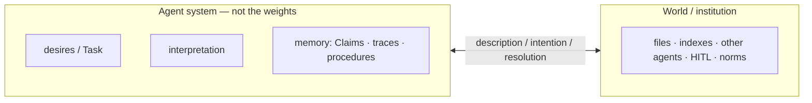
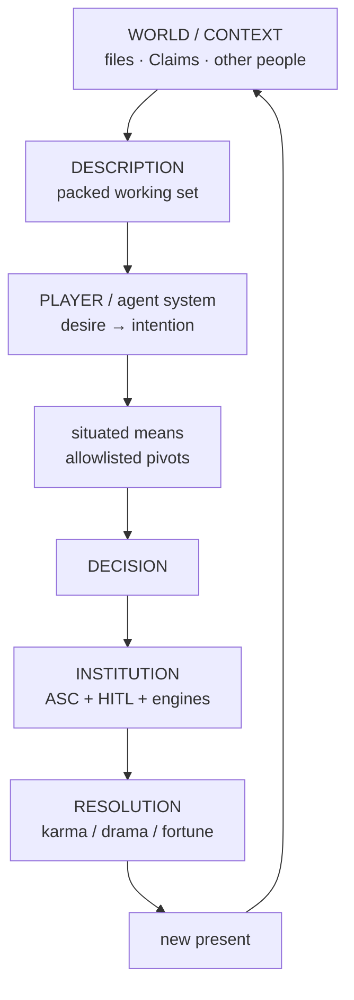
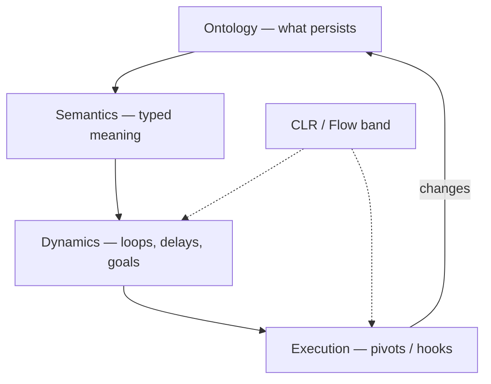
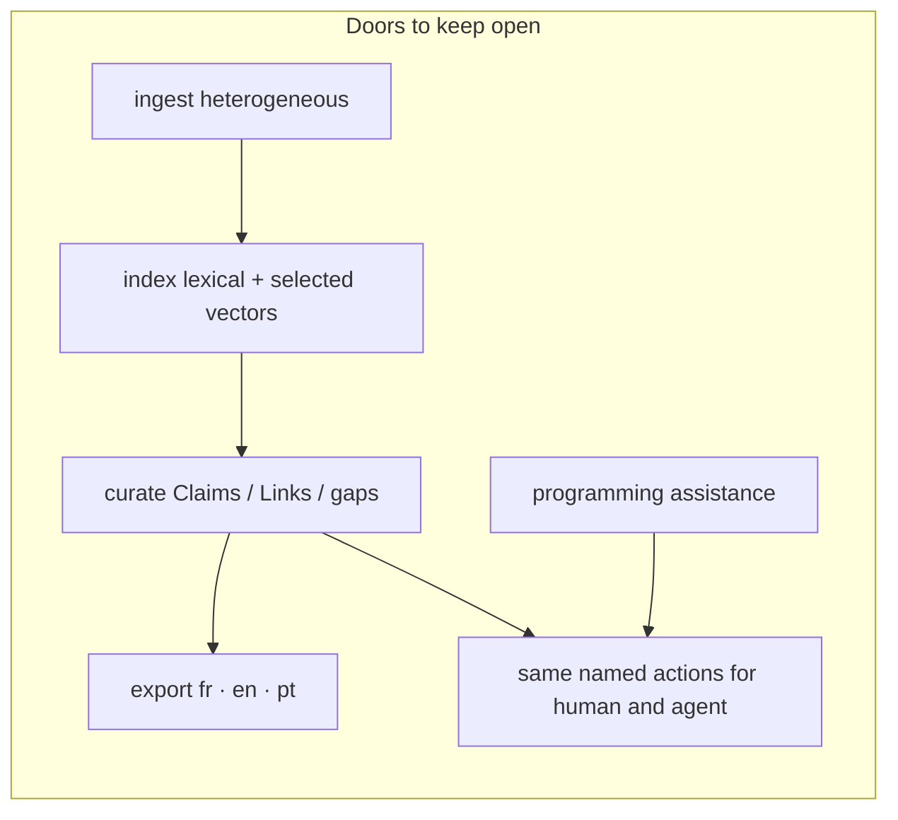
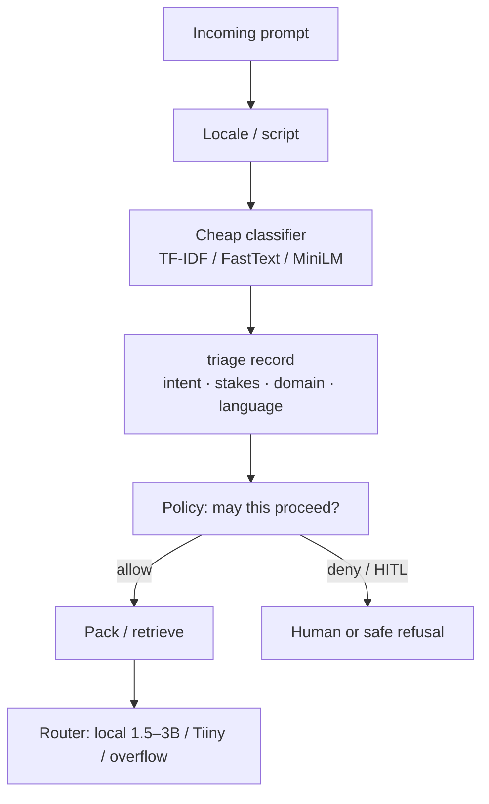
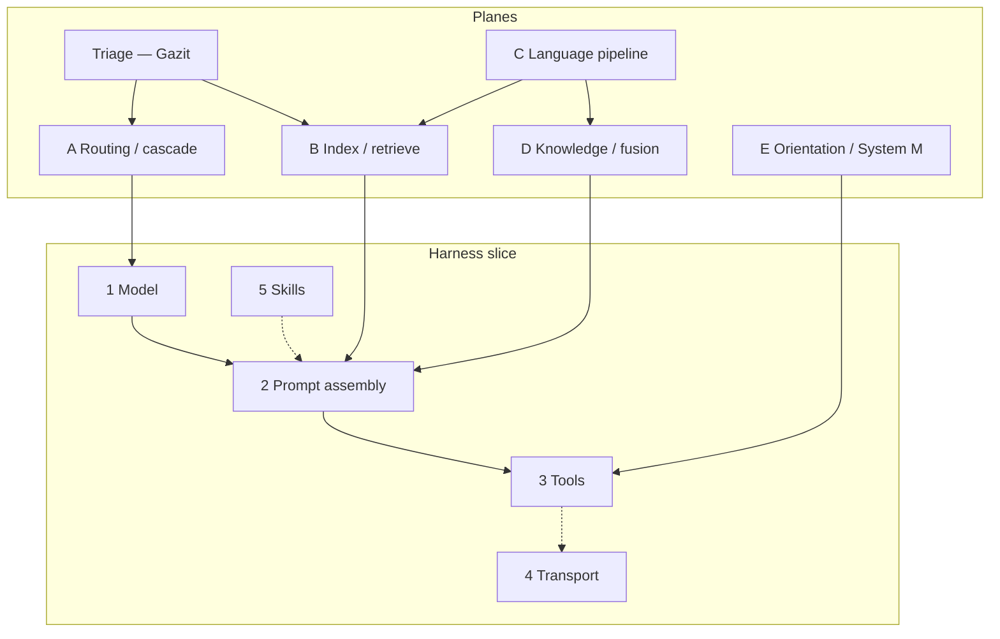
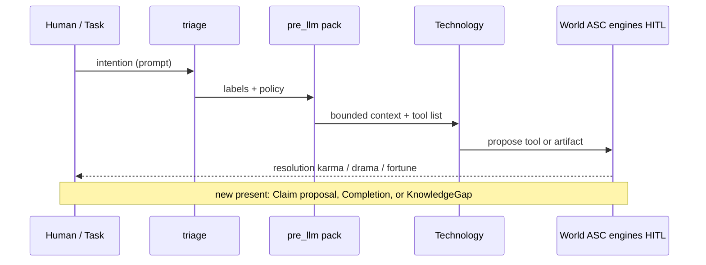
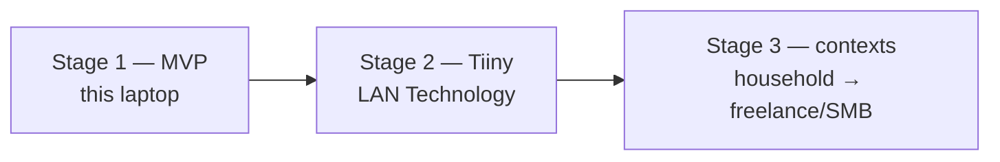
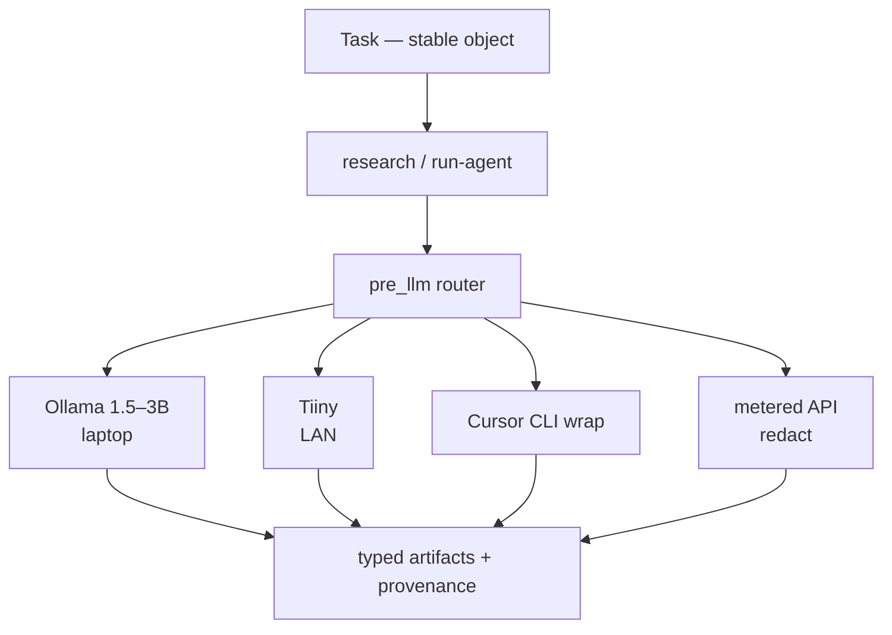

# Projet Complexe 2026 Revival (v5)

## ASC, Projet Complexe, and Projet Complexe ASC — distilled for a living second brain

**Date:** 2026-08-28  
**Status:** architecture note / design instrument (not a spec, not an implementation plan)  
**Keeps:** Revival v2 (three-project cut, killswitch, genericity); v3 (extract-once, Postgres as SoR, lexical-first retrieval); v4 (hooks around LLM calls, tools as entry points, DSL vs MCP, language as a system, routing).  
**Adds:** (1) a merged jargon table; (2) an updated literature cut; (3) three groundwork notes as *reference points that stay visible* — Meadows leverage, Lefèvre’s desire–world loop, Monnin/Lévy redirection; (4) a staged construction path: laptop MVP → Tiiny on the LAN → later small-business contexts.

This note exists because v4 answered a precise engineering question (how agents get tools) and then opened five more *planes* (routing, index, language, knowledge, orientation). Those planes are still right. They are not yet a picture of **what Projet Complexe is for**, nor of **how autonomy is produced**, nor of **which trajectory this garage project must refuse**. The August 26–27 recaps ([About Natural Language Processing](About%20Natural%20Language%20Processing.md), [About Memory, RAG, and Graphs](About%20Memory,%20RAG,%20and%20Graphs.md)) and the three groundwork files supply that picture. v5 distills them into one instrument.

> ASC is authoritative about execution. Projet Complexe is authoritative about interpretation. The coupling between them is the product — not the model.

## Jargon notes

Terms as **this** note uses them. Industry synonyms are listed so they do not get imported as identity. The table merges the memory recap’s glossary with words that v4, the NLP recap, the groundwork files, and this rewrite would otherwise leave opaque.

| Term | Alternative notations, synonyms | Definition | Examples, use cases |
|---|---|---|---|
| ASC | Agnostic Shell Controller | Thin glue: names, pivots, hooks, wrappers. Not a program that “is” the second brain. `$subject` / `$action` (or `$subject` / `$object` / `$action`) folders become `make` entry points. | `make extract`; `pre_llm` hook; YAML `able` contracts. |
| Pivot | Entry point; `$subject-$action`; named capability | A stable name for something that can be done. The Implementation behind it may change. | `extract`, `index`, `relate`, `research`, `run-agent`, `publish`. |
| Hook | Variant; `pre_*` / `post_*` | File-based event: wrap an action without rewriting it. Combinatory with env (host, instance, provider). | `pre_llm`, `post_extract`, `pre_extract/pdf`. |
| DSL | ASC DSL | Filename-safe encoding of argv (`p1`, `b-y`, `o-max-4`). For *addressing and validation*, not for chatting with a model. | YAML `validate:`; hook filenames. Compiles *to* JSON Schema for the model. |
| Genericity | Primordial → primitives → core → extension → override → specific | How reusable an Implementation is. Promote a local name; do not start from an MCP registry. | Core: hook wrap. PCA: which tools exist. PC: what a Claim means. |
| Active dir | `$subject` folder | Directory whose files ASC discovers (includes, globals, hooks, actions). | `asc/extensions/agent`; `scripts/asc/extend/research`. |
| Projet Complexe | PC; the interpretive layer; “second brain” | Semantic and visual environment for tasks, knowledge, research, projects, agents. Owns meaning. Desktop: Tauri + SolidJS (secondary). | Coordinate + mode; Claim pane; graph of *accepted* links. |
| Projet Complexe ASC | PCA; the thin bridge | Domain-specific pivots and compositions. Uses ASC specifically without becoming a second ASC. | Allowlists; packing recipe; locale Requirements; router policy. |
| Task ↔ knowledge duality | Two orientations; mutual killswitch | Same activity, two projections. Default is task-oriented. Switching mode keeps the coordinate. For agents: stop acting to research; stop researching to act. | Task view: next pivot / gap. Knowledge view: graph, claims, unknowns. |
| Coordinate | Location; `goal` + `focus` + `trail` + `depth` | Where you are in meaning-space. Mode is a *projection* of a coordinate, not a different app. | Hash codec in the UI; filename-safe names so the terminal can inspect the same place. |
| Killswitch | System M (Dupoux et al.); orientation switch | Explicit stop: research may not act; a Task may suspend when knowledge is missing. Not a regex filter. | `research` catalog has no `bash`; Task writes a KnowledgeGap instead of guessing. |
| Context | Working set; prompt contents | Everything currently in the model’s input this turn. Not the archive and not memory. | A packed `run-agent` prompt. |
| Model window | Context window; `num_ctx` | Hard token budget of one inference call. Retrieval quality is how you *spend* this, not how you enlarge it. | Local 2k–4k on a GTX 1050; a 128k API is not a reason to stuff OCR. |
| Packing | Context engineering; token packer; governor | Select, compress, order, and budget what enters the window. The memory *controller*, not the memory. | CLR band; Hermes-style frozen preference block + on-demand FTS. |
| CLR | Cognitive Load Ratio; Flow band for agents | Task complexity vs *effective* capacity (retrieval, tools, packing, window — not model size). Regulate the band. | 1.7B + excellent retrieve vs stuffed 70B; reverse-prompting note. |
| Triage | Cheap classifier; request-level policy | Decide *before* packing: intent, locale, stakes, local vs remote, retrieve vs refuse. | Gazit two-level router; TF-IDF Fallback; labels: task / research / publish / code-assist. |
| Routing / cascade | Model router; plane A | Pick among *independently trained* models, or try small then escalate. Not MoE inside one net. | Default: tiny local. Mid: Tiiny on LAN. Overflow: metered API / Cursor CLI. |
| Harness | Surround; AutoDesign’s `H`; agent loop | Everything *around* frozen weights: prompts, tools, validators, packing, killswitch. Skill accumulates here. | EnvHarness Contract; `pre_llm` / `post_llm`; Pi / Cursor as workers. |
| Tool | Function calling; action | Named operation with a schema, executed by the *host* after the model requests it. Not a skill, not MCP. | Allowlisted ASC entry point; JSON Schema generated from YAML. |
| Skill | Agent Skills; `SKILL.md`; procedure brief | On-demand instructions (+ optional scripts). Progressive disclosure. Not a Claim, not a tool, not an OS. | YAML `able` + git; optional `SKILL.md` export for Pi/Claude. |
| MCP | Model Context Protocol | JSON-RPC plug: host lists/calls tools on a server. Transport only. Does not store knowledge. | CodeGraph MCP when Cursor is host; refuse “memory MCP” as the store. |
| Retrieval | Recall; search; fetch | Choosing *which* stored items enter the window. Still not knowledge. | Meilisearch top-k; accepted-neighbour walk; `session_search`. |
| RAG | Retrieval-augmented generation | Retrieve then generate from packed hits. Grounding, not intelligence. Graph RAG / agentic RAG are variants of *how* you retrieve. | `research` packing pointers + short spans. |
| Graph RAG | Microsoft GraphRAG-style; neighbourhood retrieval | Build a graph from *your* texts, retrieve a bounded subgraph or community summary. A strategy, not the knowledge model. | Schema-guided `relate` on selected corpora; never on Wikipedia. |
| Conceptual graph | Personal graph; interpretive graph | Meaning graph (typed links, uncertainty). Not required to be one database. | Claims–Links–Gaps in Postgres; drawn in Tauri. |
| Code graph | AST graph; CodeGraph | Structure of a *source tree* (file / function / call). Sidecar, not the second brain. | [colbymchenry/codegraph](https://github.com/colbymchenry/codegraph) SQLite + MCP. |
| Claim | Accepted belief; typed assertion | Inspectable statement the household will stand on: provenance, confidence, `valid_at`. HITL promotes a proposal to a Claim. | “This PDF says X (quote, page).” Not MEMORY.md. |
| KnowledgeGap | Unknown; insufficiency | First-class object: what is missing, for which decision, at what budget. Not a failed RAG. | Task suspends; `research` starts; killswitch if still insufficient. |
| HITL | Human-in-the-loop | Human is the commit device for knowledge (and for harness patches). LLM consensus is not HITL. | Claim accept; `write_approval` on. |
| SoR | System of record | Store whose ids other projections rebuild from. Files for *bytes*; Postgres for metadata/claims/jobs. Indexes are derived. | Canonical PDF on disk; Claim row; Meilisearch rebuildable. |
| SoT | Source of truth (for a *contract*) | The artifact other projections are generated from. Distinct from SoR: YAML `able` is SoT for tool schemas; Postgres is SoR for Claims. | YAML → JSON Schema / MCP / TypeBox. |
| Lexical memory | FTS; BM25; Meilisearch; `tsvector` | Recall by words, typos, quotes, names — no embedder. First retrieval step on modest hardware. | Meilisearch for the corpus; FTS on traces. |
| Always-on memory | MEMORY.md; preference block | Tiny set injected every turn. Must be bounded. Preferences and constraints, not the archive. | Frozen at `run-agent` start (Hermes snapshot trick). |
| Episodic recall | Session search | Finding *past events* (turns, traces), not world facts. Cheap as FTS over raw messages. | Hermes `session_search`; Postgres `tsvector` on traces. |
| Extract-once | Canonical extract | One bounded job writes plain text + metadata; indexes fan out. Opposite of re-parsing the book every query. | Tika/Docling/pdftotext → file → Postgres → Meilisearch. |
| Progressive disclosure | LOD (level of detail); skill levels | Names first, bodies on demand, full passages last. Same idea as graph zoom. | Hermes `skills_list` → `skill_view`; UI LOD 0–4. |
| LOD | Level of detail (*not* Linked Open Data) | How much of a graph you fetch or draw. In Semantic Web writing, LOD often means Linked Open Data — this note spells that out. | LOD 0 clusters … LOD 4 citations. |
| QID | Wikidata item id | `Q` + number. A *pointer* into the public library, not a node to import. | `Q1290` = Pierre Lévy. |
| IEML | Information Economy MetaLanguage; USL | Lévy’s constructed language for computable semantics. Compass, not runtime. Do not put morphemes in the UI hash. | Optional later annotation on durable Concepts. |
| Control plane | Who may start engines | Starts, stops, authorizes computation. Not the GUI, not WhatsApp, not MCP. | ASC / PCA over Compose; Tauri is a thin adapter. |
| Leverage points | Meadows 12→1 | Places to intervene, from parameters (weak) to paradigms (strong). Engineers over-spend at 12–10. | Temperature = 12; allowlists = 5; killswitch goal = 3; “agent as collaborator” = 2. |
| Attachments | Monnin | Why systems resist redirection: habits, identities, infrastructures, expectations. Not only lock-in or cost. | “We cannot drop Compose because the UI assumes Solr.” Inquire before adding. |
| Zombie technology | Monnin 2026 | A system still socially alive while ecologically (or temporally) dead. Enchantment hides infrastructure. | Cloud chat as “the brain”; always-on agents that cannot be turned off. |
| Redirection | Ecological redirection | Some trajectories must be abandoned, transformed, or dismantled — not merely greened. Meadows level 3 (goals), not 12. | Keep inference local-first; refuse messenger-as-host; name a Technology so it can be closed. |
| Relational autonomy | Lefèvre | Autonomy is a property of the *coupling* with a resistant world, not independence from it. | Agent formulates intention; world resolves (karma / drama / fortune); new present. |
| Drama / karma / fortune | Lefèvre resolution modes | Authority decides / means suffice / chance decides. Hybrid in real organisations. | HITL = drama; deterministic tool JSON = karma; retrieval miss = fortune-ish. |
| Frozen environment | EnvHarness wrap | Do not rewrite the world or the human checker; wrap `reset`/`step` (or `pre_llm`/`post_llm`) to regulate difficulty. | Packing as Contract over a living corpus. |
| Frozen model | AutoDesign | Evolve the harness, not the weights. Inner loop: one Task. Outer loop: gated harness patches (HITL). | YAML + hooks accumulate skill; do not fine-tune as v1 identity. |
| Tiiny | Tiiny AI Pocket Lab | Pocket LAN inference box (CES/Kickstarter 2026): large local models, OpenAI-compatible API, offline. A **Technology**, not a host. | Stage 2: `provider=tiiny` behind `run-agent`. |
| Remote overflow | Metered cascade | When local + indexes are not enough, call a remote model under quota. | Cursor CLI wrap; API with redaction (`pre_llm`). |
| SMB | Small / medium business | Later context for the same named pivots — not a different product ontology. | Potential future freelance work; still CLI = GUI. |
| Technology | Model serving; provider | A swappable inference or extract *engine* (Ollama, Tiiny, an API, Docling). Named in YAML, not in the Task’s identity. | `provider=ollama\|tiiny\|cursor-cli\|api`. |
| Implementation | How; case study | A concrete way to satisfy a Task or a pivot. Includes failures (“how not to”). | pdftotext vs Docling vs Tika behind `extract`. |
| Environment | Where it runs | Constraints on an Implementation: GPU, LAN-only, OS. | `lan-only` vs `api-ok`; this laptop vs dedi. |
| Requirement | Condition; fallback chain | What must hold for an Implementation to apply. AND / OR / fallback. | “Must stay on LAN”; “needs a page callback.” |
| Factor | Relevance, importance, priority | Weight on a Link or a Feature — closer to fusion than to cosine. | “This contradiction matters for decision D.” |
| Lethal trifecta | Bhagwat | Private corpus + untrusted web + outbound tools in one catalog. Injection path. | Research catalog without `bash` / mail-send. |
| Flow | Csikszentmihalyi; epistemic flow | Humans: challenge ≈ skill. Agents: task complexity ≈ effective capacity (CLR). | Prompting as band regulation, not “be clear.” |

If a vendor word is missing here, treat that as a hint: it probably should not become identity.

---

# 0. Verdict in one page

## 0.1 What Projet Complexe is (2026)

A **semantic and visual environment** where heterogeneous sources (PDFs, notes, web captures, code, later audio) can be ingested and indexed; where **French, English, and Portuguese** are first-class for retrieval *and* for exports; where **curation** (accept / contradict / gap) is the knowledge act; where **programming assistance** is a worker, not the institution; where a **local agent** uses the same named actions a human uses from the terminal — on **modest hardware**, **without a vendor as the brain**.

The 2009–2014 duality (task-oriented vs knowledge-oriented) is now a **control principle**: know enough to act, act until knowledge is missing, stop researching when the task no longer justifies inquiry.

It is being built in **stages** (§6), as a freelance garage project that might one day pay bills. Stage 1 must already be the real architecture at small scale — not a toy that has to be thrown away when Tiiny arrives or when a client appears.

## 0.2 What the three groundwork notes force

v4’s five harness layers are how *tools* work. They do not say where to spend effort, how an agent becomes autonomous, or which attachments to refuse. These three files stay in the frame for the rest of this note:

| Groundwork | Core claim | What it forbids if forgotten |
|---|---|---|
| [AI Agents Leverage Points](<AI Agents Leverage Points (Places to Intervene in a System) Applicability.md>) | Spend at Meadows 6–1 (information flows, rules, goals, paradigms), not at 12–11 (temperature, bigger buffers). | Another year of model shopping and chunk-size A/B tests as the main work. |
| [Arthur Lefèvre](<Arthur Lefèvre - Désirs, Conflits & Communication.md>) | Autonomy is produced in a **description → intention → resolution → new present** loop with a world that remembers, constrains, and talks back. The LLM is not “the agent.” | Equating agency with a larger tool catalogue or with “the model asked.” |
| [Agents of Redirection](<Agents of Redirection (Donella Meadows, Alexandre Monnin, Pierre Lévy).md>) | Name attachments; keep trajectories **closable**. Lévy: explicit semantics so meaning can be handed on. Monnin: infrastructure and enchantment. Meadows: goals, not parameters. | Zombie always-on agents; cloud chat as memory; a stack you cannot dismantle. |

Csikszentmihalyi / CLR sits beside them as **regime regulation** (keep the coupling inside a Flow band). Four Layers sits as **which question you are asking** (ontology / semantics / dynamics / execution). Cai’s *AI-Enabled Engineer* (recap: [Beyond how](Beyond%20how%20-%20general%20guiding%20vision,%20alignment,%20direction,%20and%20values.md)) is the professional *why* this project must **not** inherit: excellence + competitiveness as mission. The mission here is: **cognition in band, knowledge as committed Claims, systems redirectable.**

## 0.3 What v4 still gets right (harness cut)

Do not reopen:

1. LLM call = hooked entry point (`pre_llm` / `post_llm`).
2. Tools the model sees = **allowlisted** entry points. YAML `able` is source of truth; JSON Schema / MCP / TypeBox are projections.
3. Skills = briefs, not executables. Optionally emit `SKILL.md`.
4. MCP = foreign plug, not vocabulary.
5. Do not rebuild Pi, Cursor, or code-graph-rag. Wrap.
6. Do not teach frontier models a private DSL.
7. fr / en / pt are Requirements, not a model marketing bullet.
8. Routing/cascading is how modest hardware stays compatible with later models.

## 0.4 What the later recaps add (must not stay in side files)

| Recap | One-line steal |
|---|---|
| Gazit & Ghaffari (NLP) | A **named triage step** before packing: cheap classify, then dispatch. Complexity ≠ prompt length. Encoder-as-classifier on the hot path, not a 70B guessing the label. |
| Memory / RAG / graphs | Retrieval quality on *this* laptop is **indexes + packing + allowlists**, not a bigger local model. Several graphs must not share a word. Postgres SoR; Meilisearch first; Hermes packing tricks; CodeGraph as code sidecar. |
| EnvHarness (arXiv:2608.19880) | Wrap the world (`reset`/`step` ≈ `pre_llm`/`post_llm`); freeze the verifier (HITL). |
| AutoDesign (arXiv:2608.13560) | Freeze the model; evolve the harness in a **gated** outer loop. HITL is the gate. |

## 0.5 Recommendation (usable beyond this PKM)

**Build a thin ASC wrap and a small interpretive world, then grow providers under the same names.**

1. **ASC-generic:** hooked `llm` (or inner call of `run-agent`); YAML → JSON Schema; dispatcher tool-name → entry point; traces that name pivot + Technology + Task id.
2. **PCA:** triage labels; packing + locale; router policy (laptop → Tiiny → overflow); killswitch; HITL commit; `publish` contracts.
3. **Projet Complexe:** Claims, Links, KnowledgeGaps, coordinates, two orientations. Agents propose; humans accept.
4. **Refuse:** messenger-as-host; memory MCP; GraphRAG summaries as wiki; English-only embeddings as store; computer-use as default; paper-mill autonomy; Tiiny or Cursor as identity.

---

# 1. The three projects and the coupling

Same cut as the [Projet Complexe README](../../../../../projet-complexe/app/README.md) and v2. Restated because every later section will try to collapse it.

```text
Projet Complexe          →  meaning, tasks, knowledge, research, agents, desktop UI
        ↓
Projet Complexe ASC      →  domain-specific pivots, compositions, integrations
        ↓
ASC                      →  generic computational vocabulary (names, pivots, execution)
```

| Project | Question | Role |
|---|---|---|
| **ASC** | What exists computationally, and what can be done? | Substrate over shell / filesystem / processes / machines |
| **Projet Complexe ASC** | Which capabilities does *this* environment expose? | Thin bridge: entry points and packs without contaminating ASC |
| **Projet Complexe** | What am I trying to accomplish, what do I know, what does it mean? | Semantic + visual environment |

Rule of thumb: Projet Complexe should use ASC without becoming ASC-specific; PCA should use ASC specifically without becoming a second ASC.

Lefèvre’s correction: **the agent is the coupling**, not the box labelled “LLM.”



ASC names operations on the world. Projet Complexe names what the world *means*. PCA is the allowlist and the pack that keeps the loop inside a CLR band.

First milestone (unchanged): a useful operation is a **stable pivot**, runnable from the terminal, consumed by the UI without the UI knowing the Implementation.

---

# 2. Groundwork that must stay visible

These are not epigraphs. They are tests on every later choice.

## 2.1 Meadows: places to intervene (spend here, not there)

Leverage points, **least** effective (12) to **most** transformative (1). The agent-applicability note maps them onto architecture. Distilled for Projet Complexe:

| # | Point | In this project | v1 spend? |
|---|---|---|---|
| 12 | Parameters | temperature, chunk size, `num_ctx` | Tiny. Log them; do not live here. |
| 11 | Buffers | longer chat, bigger vector store | Bounded always-on memory; not “more RAM = more mind.” |
| 10 | Stocks and flows | extract-once → Postgres → projections | **Yes:** canonical files + derived indexes (Kleppmann). |
| 9 | Delays | nightly distillation, not every-turn `/learn` | **Yes:** propose Claims on a delay; HITL later. |
| 8 | Balancing loops | verifier, killswitch, evals | **Yes:** `post_llm` contract-check; Winteringham evals. |
| 7 | Reinforcing loops | accepted procedures / skills grow | Gated. Human promotes a skill; Hermes-style auto-write stays off. |
| 6 | Information flows | triage + specialised packing (planner ≠ coder ≠ researcher) | **Yes:** Gazit’s cheap front door. |
| 5 | Rules | allowlists, `lan-only`, dual authz | **Yes:** Bhagwat lethal trifecta; catalog is a design artifact. |
| 4 | Self-organisation | spawn specialists, rewrite harness | Later, AutoDesign-shaped, **HITL outer loop**. Not a Gödel machine. |
| 3 | Goal | complete a long Task / keep a living map — not “answer the chat” | **Yes:** name the goal in the Task object. |
| 2 | Paradigm | collaborator + redirectable stack, not chatbot-as-OS | **Yes:** already chosen. Defend it. |
| 1 | Transcend paradigms | architectures as hypotheses | Door open; not v1. ASC names Implementations so they can be replaced. |

**Synthesis (from that note, kept):** distinct memory kinds; planner–executor–reviewer; specialised information; reusable skills; long-term project goal; later, evaluate the architecture itself. That is Meadows 10→1. Model shopping is 12.

## 2.2 Lefèvre: autonomy from the loop, not from the catalogue

The 2020 thesis (*Désirs, Conflits & Communication*) is a theory of **autonomous action in an asymmetric dialogue with a world that responds**. Mapped:



Steal:

- **Intention ≠ tool call.** The model proposes; the world (hooks, allowlist, human, physics of the filesystem) resolves. “Model asked” is not authorization (Lanham, already v4).
- **Incompleteness is productive.** KnowledgeGap is constitutive, not a defect to RAG away. Lefèvre: a useful degree of unknown creates exploration. Revival: the killswitch.
- **Shared present, irreversible.** Each action must change the semantic conditions of the next (Completion, new Claim, new gap) — not replay a planner against the same state blob.
- **Desire → quest → scene → campaign.** Tasks nest. UI nested tabs / trail already said this ([17-ui-design-ideas](../../../../../projet-complexe/data/ideas/2026/08/17-ui-design-ideas.md)).
- **Drama / karma / fortune.** HITL is drama. A deterministic `extract` is karma. A retrieval miss is closer to fortune. The architecture should *say which regime* a step is in.
- **The *meneur* is an institution.** ASC + PCA + HITL occupy that slot: maintain context, expose information, resolve conflicts, transform the world. Not a narrator LLM.

Refuse: pre-filtering intention until the agent has no sovereignty (Lefèvre on metagaming). Constrain by **consequences and allowlists**, not by secretly taking over the decision.

## 2.3 Redirection: Meadows, Monnin, Lévy

Monnin’s arc (2013 Web ontology → ecological redirection) plus Meadows plus Lévy:

| Meadows | Monnin | Lévy | Here |
|---|---|---|---|
| Feedback | Attachments | — | Do not add a daemon you cannot turn off |
| Resilience | Maintenance | — | Extract-once files you can rebuild indexes from |
| Leverage | Redirection | — | Change the *goal* of `run-agent` (complete Task, not maximize tokens) |
| System purpose | Ecological compatibility | — | Local-first; metered overflow; 30W Tiiny vs a rented GPU farm |
| Paradigms | Enchantment / zombies | Implicit vs explicit semantics | Cloud chat feels weightless; typed Claims travel across providers |
| Delays | Geological / infrastructural time | Durable USL / id | Distillation delayed; ids that survive Ollama → Tiiny → API |

Lévy’s remaining job (already in [Would IEML really add tangible value](Would%20IEML%20really%20add%20tangible%20value%20for%20agents.md) and note 18): **explicit structure for handoff**, not IEML-as-runtime. Multi-provider ASC makes that urgent: Ollama’s latent “cat ≈ feline” does not travel to Tiiny or to Cursor CLI. What travels is the typed graph + provenance.

Monnin’s question on every new attachment: *under what circumstances should this agent or this engine be removed rather than improved?*

## 2.4 Four layers + CLR (compact)

| Layer | Question | Author-shaped | v5 object |
|---|---|---|---|
| Ontology | What exists? What persists? | Monnin | Files, versions, Claims as Web-like objects — not embeddings-as-being |
| Semantics | What does it mean? | Lévy | Typed links, optional later USL; not IEML in the hash |
| Dynamics | How does it evolve? | Meadows | Killswitch, delays, balancing loops |
| Execution | Who changes it? | ASC / harnesses | Pivots, hooks, workers |

CLR: good prompting is **challenge regulation**. EnvHarness operationalizes that for frozen gyms; packing + triage operationalize it for a living corpus. AutoDesign operationalizes skill-in-the-harness for frozen weights.



---

# 3. Literature review summary

Door inventory, not a second agents-literature-review. **Interesting** = not just another “build an agent” chapter. **For Projet Complexe** = keep / adapt / do not let this become identity.

## 3.0 Ambition lens

Closing a door = an identity choice a later year cannot undo without a rewrite: English-only embeddings as the store; a cloud chat product as memory; RAG as knowledge; MCP as vocabulary; one graph database as the conceptual model; computer-use as “agency”; a prompt pack as the product; Tiiny or Cursor as “the brain.”

Keeping a door open = **naming the capability** and leaving the Implementation swappable. Language is metadata on sources and exports. Provider is a sidecar on `run-agent`.



## 3.1 Consolidated table

Successor of v4 §2.1, split by plane so it stays readable. Duplicate files of the same work are one row. Peripheral prompt-pack manuals are collapsed.

**How to read the table.** *Interesting / original* is what is not just another “build an agent” chapter — the claim that earns a place here. *For Projet Complexe* is steal / adapt / refuse, in this project’s names. *Read* is the shortest path through the source: the chapters (or paper sections / repo docs) that actually support those two columns. The rest of each book can wait.

### A. Harness, agents, tools

| Source | Interesting / original | For Projet Complexe | Read |
|---|---|---|---|
| **Berryman & Ziegler, *Prompt Engineering for LLMs* (2025)** | The product is not a clever system prompt. It is an **application loop**: convert the user’s problem into the model domain, retrieve and *snippetize* context, score/prioritize snippets, assemble the prompt, parse the completion, optionally call tools, persist state. Part I even names “prompt engineering as playwriting” and “moving beyond chat to tools.” | Steal: `pre_llm` / `post_llm` *are* this loop, named as ASC hooks. Context retrieval + snippet scoring is packing (CLR), not “memory.” Offline/online eval of the loop (end of ch. 4) is Winteringham’s door, not RAGAS-as-identity. Refuse treating ch. 2’s tokenizer trivia as architecture. | **Ch. 4** (anatomy of the loop: snippetize, score, assemble, tools). Then ch. 3 (chat → tools) and ch. 5 (what actually goes *in* the prompt). Skip ch. 1–2 unless you need the LLM primer. |
| **Bhagwat, *Principles* (2024) + *Patterns* (2026)** | *Principles* is the short textbook: tool design is “the most important step”; structured output; working vs hierarchical memory; **middleware** (guardrails, auth) around the loop; MCP as *remote execution*; workflow graphs when a free-tool agent is too wild. *Patterns* is the production sequel: whiteboard capabilities first, HITL as a pattern, context failure modes, evals from failure modes, then security — especially the **lethal trifecta** (private data + untrusted input + outbound tools). | Steal allowlists, traces, “compile the Task into named steps.” Dual authz and sandbox. MCP = a brochure for *foreign* tools, not the local vocabulary. Workflow DAG ≠ conceptual graph. Refuse Mastra/TypeScript as host. *Patterns* ch. 18 is the injection test for `research`. | *Principles:* **ch. 6** (tool calling), **ch. 8–9** (middleware), **ch. 11** (MCP: when / when not), **ch. 12–14** (graphs, suspend/resume). *Patterns:* **ch. 1–4** (capabilities, architecture, HITL), **ch. 7–8** (context failure / compress), **ch. 10–14** (evals), **ch. 18–21** (trifecta, sandbox, access, guardrails). |
| **Lanham, *AI Agents in Action* (2025)** | A component picture of an agent (model, memory, actions, orchestration) plus a **spectrum of autonomy**: no agent → proxy → **confirm then execute** → autonomous. Function calling is stated as “model proposes, runtime does.” Later chapters add local models (LM Studio), multi-agent studios (AutoGen/CrewAI), Semantic Kernel “skills,” and behavior trees for autonomy. The interesting cut is the spectrum, not the vendor tours. | Steal HITL as a *state* on the Task, not a vibe. Autonomy is an explicit Requirement (and a later opt-in), never the default. Refuse “the model asked” as authorization; refuse AutoGen/CrewAI as ontology; refuse behavior trees as a second ASC. Local serving (ch. 2) is Environment, same family as Ollama. | **Ch. 1** (components + why agents). **Ch. 5** (actions / function calling). **Ch. 6** (autonomous assistants / confirm-vs-run). Skim ch. 2 for local-model serving. Treat ch. 3–4 (GPT store, AutoGen, CrewAI) as museum exhibits. |
| **Albada, *Building Applications with AI Agents* (2025)** | The book the author “wanted to hand colleagues”: a **lifecycle**, not a framework tutorial. It poses the questions teams actually stall on — when is an agent the right shape vs RAG vs a script; how to design tools, memory, planning, topologies (chains/trees/graphs); how to go from one agent to coordination patterns; how to eval, monitor, and secure. Explicitly *not* a LangChain walkthrough. | Steal the *questions* as a design review of PCA. Adapt answers as ASC pivots and YAML contracts. Refuse importing another framework ontology, and refuse “learning from experience” as chat-log fine-tuning (Dupoux / killswitch). Case studies (support, legal, code review) are *genres* of Task, not products to clone. | Preface + “What this book is about” (the question list). Then the chapters on **when to use an agent**, **tool design**, **memory**, **single vs multi-agent**, **evals/security**. Skip tool-picker appendices. |
| **Dibia, *Designing Multi-Agent Systems* (2025)** | A usable taxonomy: **workflow patterns (explicit control)** vs **autonomous patterns (emergent control)**, plus UX for multi-agent reliability, structured output, middleware/OTel, agents-as-tools, a full computer-use chapter, then workflow-as-graph (steps, edges, checkpointing) vs orchestrator loops. The honesty is in **pattern selection** (ch. 2.4): most “multi-agent” demos should have been a workflow. | Default to **named ASC steps** (explicit workflow). Later autonomy is an opt-in Requirement, not v1. Steal structured output, HITL, cancellation, middleware (ch. 4). UX principles (ch. 3) → `inspect-agent` / killswitch, not a second web app inside the agent. Computer-use (ch. 5): later, sandboxed, never the definition of agency. | **Ch. 2** (workflow vs autonomous). **Ch. 3** (UX / reliability). **Ch. 4** (loop, tools, structured output, HITL, OTel). Skim ch. 6–7 if you ever need checkpointed workflows. Park ch. 5 (computer use) and ch. 8 (agent web apps). |
| **Kar, *Building Multimodal Generative AI and Agentic Applications* (2026)** | A **pattern catalog** that actually separates sparse vs dense retrieval, RAG types, vector DBs, rerankers, **guardrails as a layer**, agents, MCP, and orchestration — then spends ch. 2 on vision-language / multimodal systems. Useful because it is a map of *names the industry uses*, not because any one notebook is right. Local Ollama appears as a deployment choice among others. | Steal guardrails-as-layer, HITL, “tools talk to the DB.” Adapt each pattern as a *composition*, not ontology. MCP = one chapter, not the architecture. Keep the local-Ollama door and the **figure-extract** door (v3). Refuse multimodal vector DB as the mind; refuse generating images/video as a default tool. | **Ch. 1** (RAG, vectors, rerank, guardrails, agents, MCP — the catalog). **Ch. 2** only for the vision/extract door. Ignore the rest until a named Task needs a VLM. |
| **Huang, *LLM Design Patterns* (2025)** | A GoF-style **pattern language** for LLM *systems*: data prep and versioning (Part 1), training/optimization (Part 2 — mostly not our problem), evaluation (Part 3), prompt patterns including CoT/ToT (Part 4), then **retrieval / graph RAG / eval of RAG** (Part 5) and **agentic patterns**. Also security/OWASP-adjacent patterns later in the book. Original as a *checklist*, weak as a stack (Packt notebooks, training-heavy front). | Steal as a review list against YAML `able` and `publish` contracts (data versioning, RAG eval, graph-RAG as *a* pattern). Confirm v3: Graph RAG is an Implementation of `relate`, not the wiki. Refuse training-pipeline chapters as v1 work; refuse the book’s RAG notebook as SoR. | **Part 1** (data cleaning/versioning — extract-once hygiene). **Part 5** (RAG, graph RAG, RAG eval — ch. 27 especially). **Agentic patterns** chapter. Skim Part 4 (CoT/ToT) as packing tactics. Skip Parts 2–3 unless you train. |
| **Ozdemir, *Building Agentic AI Workflows* (2025)** | Case-study book that keeps asking **workflow vs agent**, then *measures*. Strong on eval/experimentation (ch. 3), RAG→agents (ch. 4), policy-complying bots and deep-research flows (ch. 5), multimodal/coding (ch. 6). Ch. 7 is the original pair for this shelf: **reasoning models vs computer-use**. Ch. 9 is modest-hardware gold: compression, speculative decode (Qwen), Matryoshka embeddings, voice latency. | Steal: explicit tools beat computer-use; multimodel; compression for the 1050 / later Tiiny. Computer-use = sandboxed later Implementation. Image pipelines (ch. 6, 8–9) keep the v3 figure-extract door without making AIGC a default tool. Fine-tune (ch. 8) is a *project*, not a toggle. | **Ch. 3** (eval). **Ch. 4** (when workflow vs agent). **Ch. 7** (reasoning vs computer-use). **Ch. 9** (compression, Matryoshka, speculative decode). Skim ch. 6 for VQA/extract. Park ch. 8 (fine-tune) for a later year. |
| **Pi (`@earendil-works/pi`)** | A working **agent harness** with a documented pipeline: `transformContext` → `convertToLlm` → provider; events `before_provider_request` / `after_provider_response`; `registerTool`; Agent Skills / `SKILL.md`; session trees. This is what “wrap, don’t rebuild” refers to — not a blog claim. | ASC hooks should **mirror those event names**, not reimplement streaming, TUI, or session trees. Skills = briefs (optional `SKILL.md` export). Pi is a Technology behind `run-agent` for code Tasks, same as Cursor CLI. Refuse Pi as the second brain or as the control plane. | Pi README + the context-transform / tool-registration docs. Map event names onto `pre_llm` / `post_llm` variants. Do not read it as a PKM architecture. |
| **Hermes Agent (NousResearch)** | Best *harness packing* in the wild for chat+skills: a **bounded MEMORY.md** frozen for the session (prefix cache), **FTS5 `session_search`** over raw traces (episodic recall without embeddings), **progressive skill disclosure** (`skills_list` → `skill_view`). The interesting object is the packer, not the WhatsApp gateway. | Steal packing tricks into `pre_llm`. Refuse WhatsApp/gateway as host; refuse agent-written `/learn` as SoR; refuse `~/.hermes` as the second brain. Claims stay HITL in Postgres. FTS on traces can live next to Meilisearch, not instead of it. | Hermes memory / skills / architecture docs (see [memory recap](About%20Memory,%20RAG,%20and%20Graphs.md) §2). Especially: MEMORY.md snapshot, session FTS, skill progressive disclosure. Skip messenger setup. |
| **EnvHarness, arXiv:2608.19880** | LLM agents overfit static gyms. The move: **wrap a frozen environment** only at `reset()` / `step()` with three plug-ins — Stage (start harder/easier), Contract (filter actions / rewrite observations), Chain (compose envs) — and keep the human verifier frozen. Closest published form of “regulate the Flow band by reshaping the world, not the weights.” | Steal the interface taxonomy: packing ≈ Stage, `pre_llm`/`post_llm` + allowlist ≈ Contract, named ASC compositions ≈ Chain. HITL stays the verifier. Refuse gym/Python Rules as SoT; refuse EnvRigger auto-writing ASC core. Living corpus ≠ ALFWorld. | Paper §§ on wrap-at-interface, Stage/Contract/Chain, frozen verifier. [EnvHarness overlap note](Overlap%20with%20EnvHarness.md) for the mapping. Skip their skill-induction training loop. |
| **AutoDesign, arXiv:2608.13560** | Complementary to EnvHarness: **freeze the model**, evolve the *harness* \(H\) (prompts, tools, validators, orchestration). Two nested loops: inner designer–critic produces an artifact; outer loop patches **one harness component** when gated. Weakest models gain most from a better surround. Same week as EnvHarness; together they are “harness not weights.” | Steal two-loop picture and one-component gated update. Inner loop = one Task. Outer loop = YAML/hooks/skills — **HITL is the gate**, not a coding agent rewriting ASC. Refuse poster-mill product identity; refuse VLM-as-judge as truth (Winteringham). | Paper: problem statement (optimize \(H\), not \(\theta\)), nested loops, five-way harness cut, gated update. [AutoDesign overlap](Overlap%20with%20AutoDesign%20-%20Meta%20Harness%20Optimization%20for%20Long-Horizon%20Agentic%20Design.md). Skip PosterBench internals. |
| **Clawdbot / OpenClaw handbook (OCR)** | Local-first always-on agent: Docker, Mac Mini vs Linux, **websocket gateway as control plane**, WhatsApp/Telegram bridges, pairing codes, systemd/launchd, prompt-injection hardening via sandboxes. The interesting admission is architectural: the *gateway* is the host, the messenger is a channel — and the handbook still sells the messenger as the UX. | Steal local-first + Docker sandbox + “always-on” sizing for a **LAN box** (later Tiiny / dedi), not for a chat app. Refuse WhatsApp as control plane; refuse pairing-codes-as-identity; refuse “never went offline” as a goal (Monnin: closable). Illich test: if the bridge dies, pivots still run from the terminal. | Objectives 1 (deploy local), 3 (injection / sandbox), gateway/websocket chapter, always-on sizing. Skip WhatsApp/Telegram onboarding and the pairing-code wizard. |

### B. Retrieval, memory, data

| Source | Interesting / original | For Projet Complexe | Read |
|---|---|---|---|
| **Norman, *Agentic RAG Systems* (2026)** | Production RAG that *admits* failure: naive pipelines fail in production (~“40%,” ch. 1); embeddings have a semantic gap (ch. 2); **lexical / semantic / structural** similarity are different families. Then the useful engineering: chunking + metadata (ch. 4), **hybrid + fusion + rerank + query transform** (ch. 5), **GraphRAG’s multi-hop ceiling** and Microsoft community-summary pattern plus reindex pain (ch. 6), Self-RAG / Corrective RAG / budgeted agentic loops (ch. 7), specialised retrievers (ch. 8), RAGAS (ch. 9). | Steal the hybrid cascade and the sentence “static retrieval cannot recover from its own mistakes” → `research` with a budget and a killswitch. GraphRAG = an Implementation of `relate` on *your* selected corpus, never Wikipedia-as-Arango, never community summaries as Claims. Refuse LangGraph as host. Chunking/metadata (ch. 4) is extract-once work. | **Ch. 1** (why naive RAG fails). **Ch. 2** (three similarity families). **Ch. 5** (hybrid cascade). **Ch. 6** (GraphRAG ceiling — steal the ceiling, refuse the wiki). **Ch. 7** (agentic recovery + termination budget). Skim ch. 4 (chunking) and ch. 9 (RAGAS as *an* eval, not the eval). |
| **Labaschin & Wallace, *Managing Memory for AI Agents* (2025)** | Memory is **data with types**, not a bigger context window: working vs long-term vs NER-structured stores (ch. 1–2); then the original chapters — **multimodel economics** and “LLM-as-judge” as a *cost method* (ch. 3), **build vs framework vs hosted** and how AI lock-in actually happens (ch. 4), “collective memory” as org knowledge (ch. 5). MCP appears as more tools *and* as memory servers — the book warns not to bet the farm on one protocol. | Steal cost-of-tools, lock-in portability, and “do not make MCP the store.” Working memory = packed window; long-term = Postgres Claims + files; episodic = FTS on traces (Hermes). Refuse memory MCP, hosted “agent memory” products, and LLM-as-judge as the only eval (Winteringham). Ch. 5’s “organizational memory” is HITL curation, not a shared vector blob. | **Ch. 1–2** (types of memory — map onto context / Claims / traces). **Ch. 3** (multimodel economics). **Ch. 4** (lock-in / portability). Skim ch. 5 as a warning, not a Slack-memory design. |
| **Magda, *Just Use Postgres* (2025)** | One engine can honestly wear several hats: relational integrity (Part 1), JSONB (ch. 5), **`tsvector` / FTS configs per language** (ch. 6), extensions (ch. 7), **pgvector + RAG prototype** (ch. 8), plus queues via LISTEN/NOTIFY (ch. 11). Appendix B is the rare honest chapter: **when not to use Postgres**. Recursive CTEs (ch. 3.4) are already how accepted_links can be walked without a graph product. | SoR until it hurts (v3). Steal ch. 6 (locale FTS configs for fr/en/pt) and ch. 3.4 (accepted-link walk). pgvector (ch. 8) is a *named space*, not the mind — Meilisearch remains first on this laptop. Jobs/queues (ch. 11) can wait; don’t invent Kafka. Read appendix B before adding a second database. | **Ch. 3.4** (recursive CTEs). **Ch. 5** (JSONB for typed payloads). **Ch. 6** (FTS / language configs). **Ch. 8** (pgvector — selected chunks only). **Appendix B** (when not). Skip geospatial/time-series unless a Task needs them. |
| **Stewart & Huang, *Agentic AI Data Architectures* (2026)** | Agents fail because **data is fragmented** (structured / unstructured / temporal), not because the model is small. “Memory as infrastructure”: semantic-transactional joins, episodic vs long-term stores, governance *in* the fetch path, then a prescription for **distributed SQL**. The diagnosis is better than the product (Cockroach-shaped). | Steal the diagnosis and the governance-in-the-fetch idea (McGrattan agrees). Adapt as **one Postgres** (Magda) on modest hardware. Keep the door to later distributed SQL if the corpus outgrows one box. Refuse “the database *is* the agent’s mind” and refuse Cockroach-at-home as v1. | **Ch. 1** (why memory ≠ model size). **Ch. 2** (fragmented stacks / unified retrieval). **Ch. 3** (semantic-transactional and episodic patterns — map, don’t buy). **Ch. 4** (governance baked into fetch). Stop before the distributed-SQL sales close. |
| **Kleppmann & Riccomini, *DDIA* 2nd ed. (2026)** | The 2e restates the durable cut: **systems of record vs derived data** (ch. 1), nonfunctional requirements (ch. 2), data models including **graph-in-SQL / Datalog / RDF** as *models not products* (ch. 3), log-structured storage and indexes (ch. 4). Cloud vs self-host is now in ch. 1 without becoming a religion. This is why rebuildable indexes are not “the knowledge.” | Steal: files remain canonical; Meilisearch, pgvector, and UI caches are **projections** you can delete and rebuild. Recursive SQL (ch. 3) covers accepted_links. Refuse treating a graph query language as the conceptual ontology. Self-host (this laptop / LAN) is a Requirement, not a failure to be cloud-native. | **Ch. 1** (SoR vs derived — the whole v3 stack). **Ch. 3** (relational vs document vs graph-like *models*). Skim ch. 2 (latency/operability) for Compose SLOs. Deep storage internals (ch. 4+) only if you operate Postgres badly. |
| **McGrattan, *Vector Databases for Enterprise AI* (2026)** | A short O’Reilly **report**, not a vendor book: query-time behaviour of vector search (ch. 2), RAG-specific failure modes and context-window constraints (ch. 3), then the original part — **embeddings as governed assets** (lineage, versioning, deletion propagation, access on *derived* representations) (ch. 4), and **when not to adopt** a standalone vector DB (ch. 5). Hybrid retrieval + filters are assumed, not a footnote. | Steal governance and “hybrid + filters.” Confirm: named embedding spaces, deletion that actually deletes, no standalone vector product as the mind. pgvector-in-Postgres (Magda ch. 8) is the “integrated platform” option she leaves open. Stage 1 can skip vectors entirely (lexical first). | **Ch. 2** (what good/degraded retrieval looks like). **Ch. 3** (RAG pipeline failure modes). **Ch. 4** (governance / lineage / deletion). **Ch. 5** (“when not to adopt”). That is the whole report — it is meant to be read through. |
| **Devlin, *Building LLM Agents* + *…with RAG, KG, and Reflection* (2025)** | Two files, one recipe: transformers are static → **RAG as “backbone of truthful agents”** → knowledge graphs → **reflection** as a second pass. The original piece on this shelf is reflection (a hooked critique), not the RAG tutorial. KG is sold as the missing structure; it is a recipe, not a theory of Claims. | Steal reflection as `post_llm` / a second hooked call (AutoDesign’s inner critic, without VLM-as-truth). Adapt KG queries as `relate` on *accepted* links. Refuse RAG+KG as the knowledge plane (v3). Two files = one row; don’t double-count. | RAG chapter (“backbone of truthful agents”) for the ceiling, then the **reflection** chapter. Skim the KG chapter only as a pattern to refuse-as-identity. Ignore the transformer primer if Berryman ch. 2 already did it. |
| **Gazit & Ghaffari, *Mastering NLP* 2nd (2026)** | An NLP textbook that **ends as a product book**: classical ML hygiene (ch. 3–4), then the missing cheap front door — **text classification with traditional ML then BERT** (ch. 5–6), then LLM zoo / PEFT (ch. 7–8), RAG+MCP notebooks (ch. 9), the **two-level router** (ch. 10), multi-agent frameworks (ch. 11), **guardrails that split router / policy / model** (ch. 12), hybrid local/cloud product design (ch. 13). Moral the notebooks contradict: **retrieval stays, the model moves.** | Steal triage (ch. 5–6 + 10) and the router/policy/model split (ch. 12). Locale in triage (ch. 7 multilingual mention is not enough — detect language *before* packing). Refuse LangChain/FAISS/MCP-as-vocabulary; refuse keyword length-heuristics on fr/pt; refuse caching curation answers; refuse multi-agent debate as truth. Full mapping: [NLP recap](About%20Natural%20Language%20Processing.md). | If you steal one thing: **ch. 5–6 then 10 then 12**. Recap’s reading order (§6) is: 5 → 10 → 12 → 13 → 9 (map, don’t copy) → 6 as upgrade path. Skip ch. 2 math unless you are logging a routing score. |
| **Shan et al., *Graph Learning Techniques* (2025) + Menshawy et al., *Scaling Graph Learning* (2025)** | Shan is GSP/GNN *research*: learning topology from signals, privacy on graphs (ch. 2), brain/COVID case studies — not RAG. Menshawy is the **enterprise production** twin: graph ML pipeline, traditional ML on graphs, then serving (PyGraf). Together they are the door “maybe a GNN later,” not GraphRAG. | Later door **if** Postgres recursive CTEs *measure* as painful on accepted_links. Refuse GNN serving as identity; refuse Shan’s brain-network chapters as a metaphor for the second brain; keep Memgraph/PyGraf out of knowledge SoR. | Menshawy **ch. 1–2** (what production graph ML even is) — enough to know the door. Shan only if you have a measured topology-learning problem. Do not read either as a knowledge model. |
| **CodeGraph (colbymchenry)** | Rust indexer over a source tree → **SQLite**, no LLM required to build the index; MCP optional for Cursor. This is a *code graph*, not a conceptual graph. Fits this laptop (SQLite sidecar). | Steal as the **code Tasks** sidecar. Compose does not host it; Tauri chrome may. MCP here is the one MCP worth installing day one — as transport into Cursor, not as memory. Keep it out of Claims. | GitHub README + “how indexing works” (no-LLM). Wire as optional PCA Environment for code pivots. Do not import its schema into Postgres Claims. |
| **code-graph-rag (vitali87)** | Tree-sitter parse → **Memgraph** → NL Cypher. Strong when the *object* is a repository you want to question in English. Weak when people try to store household knowledge in Memgraph because “it’s a graph.” | Wrap when the Task’s object is a repo. Keep Memgraph **out** of knowledge SoR (v3). Prefer CodeGraph’s SQLite on this laptop unless a measured query needs Cypher. | Repo README (Tree-sitter pipeline, Memgraph role). Use as a later Implementation behind a code-`relate` pivot, not as the wiki. |

### C. Language, research, fusion, orientation

| Source | Interesting / original | For Projet Complexe | Read |
|---|---|---|---|
| **Yu & Yao, *Intelligent Language Services* (2026)** | The only book on this shelf whose *object* is **language work as a system**. A translation or a post is the surface of ingest → segmentation → terminology → generate → evaluate → revise. Three convictions (preface): language services are a pipeline; **controllability beats raw capability**; human expertise moves *upstream* (terms, contracts, handoff). Later: prompt-as-NL-programming, RAG for citation, translation agents, when to LoRA, structured technical writing, quality/compliance/ethics. Gravity sits *before* “translate this.” | Doctrine for **fr/en/pt**: locale is metadata on extract / index / pack / `publish`. Terminology is a curated stock (entities), not an embedding cluster. `publish` is a **contract** (genre + language + provenance), not a Sonvane prompt. Do not become a CAT vendor; do not store only “the English chunk.” See also v4 §2.2 and this note §3.2. | **Preface** (the three convictions). **Ch. 1** (from translation to knowledge services). Prompt-as-programming chapter. RAG/citation chapter. Translation-agent / workflow chapters. Closing **quality, compliance, ethics**. Skip the LLM-primer chapter if Berryman already covered it. |
| **Kolade & Egbetokun, *Generative AI in Research* (2026)** | LLMs inside **research practice**, not agent demos: promise vs epistemic risk (ch. 1, including “AIllucination,” bias, epistemic injustice), **research design** (questions, gaps, paradigm — ch. 2), synthetic data and co-created instruments (ch. 3), analysis/visualisation (ch. 4), co-creating design (ch. 5), then feedback/writing. The authors keep the human as supervisor. | The desktop is a **research instrument**. Steal HITL on Claims and on research design. Refuse unsupervised “the agent wrote my MA”; refuse synthetic data as evidence; refuse consensus-as-truth (same refuse as Long). KnowledgeGap is closer to their “identifying existing gaps” than to a failed RAG. | **Ch. 1** (risk / epistemic injustice — why HITL exists). **Ch. 2** (research design / gaps). **Ch. 5** (co-creating design). Skim ch. 3 as a *warning* about synthetic evidence. Park analysis notebooks. |
| **Koch & Schlangen, *The Future of Information Fusion* (2025)** | A Fraunhofer collection (sensing, tracking, quantum, certification) whose intellectual core, for this shelf, is **fusion with uncertainty**: aleatoric (noise in the data) vs epistemic (ignorance in the model), and whether a *fused statement* is trustworthy — not whether a cosine is high. Part VI (integrity, explainable/certifiable AI, ethics of sensing) is the unexpected ally of Claims. | A Factor on a Link, a KnowledgeGap, a `valid_at` are closer to this than to embedding similarity (v4 §2.3). Keep the door to typed Links with uncertainty. Refuse becoming a defence-lab Bayesian engine in v1; skip radar/quantum chapters as identity. | Editors’ preface + the **uncertainty / trustworthiness** framing. **Ch. 16–17** (certifiable AI, ethics). Ignore Parts I–V (arrays, ELINT, quantum tracking) unless a sensing Task appears. |
| **Long, *AI-Supervisor*, arXiv:2603.24402** | A persistent **Research World Model**: a knowledge graph with **uncertainty on edges**, gap discovery, curiosity-driven supervision for people *outside* elite labs. Explicitly the human/supervisor problem. Also the temptation: multi-agent consensus and GPU “validation” as a substitute for a degree. | Steal the *shape*: persistent graph, `proposed`/`accepted`, gaps as first-class, uncertainty on Links. Refuse paper-mill autonomy, “AI professor,” and consensus-as-truth. HITL remains the commit. v1 needs gaps + `valid_at` + HITL, not the whole supervisor product. | Abstract + the Research World Model / uncertainty-on-edges / gap-discovery sections. Skip the paper-factory and multi-agent voting machinery. |
| **Dupoux, LeCun, Malik, arXiv:2603.15381** | Why current AI does **not** learn like organisms. Systems **A** (observation), **B** (action), **M** (meta-control that *switches*). Data wall; language-centrism. The original object is System M — an explicit switch between observing and acting — not another memory module. | Killswitch ≈ System M (research may not act; a Task may suspend). Do not close the door of later real learning; do **not** fake it with chat logs or Hermes `/learn`. Orientation (task vs knowledge) is this paper’s M, named in the UI. | The A/B/M split and the argument that logs ≠ learning. That is the whole steal. The rest is background for a later year. |
| **Moslem & Kelleher, arXiv:2603.04445** | Survey of **routing and cascading** across *independently trained* LLMs (not MoE gates). When / what / how of the decision. Composed routers+cascades can beat a single flagship on cost×quality. This is the paper that makes modest hardware *compatible* with not closing the quality door. | `pre_llm` is also the router (plane A). Stage 1: tiny local. Stage 2: Tiiny. Overflow: Cursor CLI / metered API. Do not freeze Claude, GPT, Ollama, or Tiiny as identity (Clinton). Cascade traces must name which Technology ran. | The routing-vs-cascading distinction and the “compose both” recommendation. Enough to design the YAML policy. Skip individual router-paper taxonomies until you implement. |
| **Cai, *The AI-Enabled Engineer* (2026)** | A **principles vs methods vs approaches** cut (ch. 1–4), plus a distinction this project must *invert*: **Age of Intelligence** (tools that augment) vs **AI Era** (agents independently managing economy/governance). Non-overreliance (ch. 3.8), first-order thinking / 80-20 (ch. 3.21), staging/spec/validation (ch. 4). Competitiveness as a *definition to update* (ch. 1.1.2.8, ch. 5) — and Jevons in the appendix. | Steal the *cut* (why ≠ how) and non-overreliance. **Change the mission** ([Beyond how](Beyond%20how%20-%20general%20guiding%20vision,%20alignment,%20direction,%20and%20values.md)): excellence + competitiveness is Cai’s professional why; here the why is cognition in band, committed Claims, redirectable systems. Stay in “Age of Intelligence.” Refuse AI Era as a goal to optimise toward. | **Ch. 1.1.3** (Age of Intelligence vs AI Era). **Ch. 3.8** (non-overreliance). **Ch. 3.21** (priority / 80-20). **Ch. 4** (staging, spec, validation — maps to tracer-bullet MVP). Skip hardware-competitiveness application chapters. |
| **Toscani, *Augmented prAIority* (2025)** | **Priority as a design object**, not a dashboard metric: human judgment + tacit knowledge (ch. 2), UX (ch. 3), a Sense-React STAR loop (ch. 4), preventing user frustration (ch. 5), then gen-AI (ch. 6). Original because it treats *what gets attention* as the product, not the model. | Packing and HITL **are** how priority is enacted (CLR band, Factor on a Link, killswitch). Refuse dashboards-as-knowledge and “productivity” as the north star (Meadows: goal). Ch. 5’s frustration is the UI governor / LOD problem (notes 14/17). | **Ch. 1–2** (what prAIority even is; tacit judgment). **Ch. 4** (sense-react loop — map onto Lefèvre’s present). **Ch. 5** (frustration / UX). Skim ch. 6 only as “gen-AI is not the point.” |
| **Kolb & Rosen, *Cognitive Kin* (2026)** | A long essay-book on **working with** agentic AI: meaning stays human; centaur not replacement; governance/trust (ch. 12); “when machines agree” (ch. 20) as a *problem*; design patterns of intelligent teams (ch. 25); “humans as agents of surprise” (ch. 52). Much of it is business-futurism (post-firm, crypto, vibe working) that this garage project should not ingest as ontology. | Steal the collaborator model and “when machines agree ≠ true.” Keep the door to “the human still judges.” Refuse personality-as-architecture, goal-graph-organization as the Task model, and “agents are the new software” as a reason to skip YAML. | **Ch. 12** (governance/trust). **Ch. 18** (non-mythical centaur). **Ch. 20** (when machines agree). **Ch. 52** (humans as surprise). Skip Parts II, IV, X–XII (enterprise / crypto / composer economy). |
| **Nolan & Stoudt, *Communicating with Data* (2021)** | How claims are **shown**, not retrieved: five parts from first blog post through describing data, distilling a story, writing a technical paper, **revision**. Prerequisite is intro stats, not an LLM. Original on this shelf because every agent book forgets that `publish` is writing. | `publish` is a writing craft with HITL revision (Part IV). A post or chapter that the model dumped is not an export. Steal the revision loop as `post_llm` + human, not as another agent. Keep the door to human-edited books. | **Part I** (audience / first artifacts). **Part III** (story / first draft of a paper). **Part IV** (revision). That is the `publish` contract’s literacy. Skip code-listing pedagogy unless you teach. |
| **Sanderson et al., *Data Contracts* (2025)** | Schema + **owner** + SLO + changelog. Silent drift is the outage. Shift-left quality because improving the model has diminishing returns vs improving the data (ch. 1). Quality is not “pristine” but **trust, ownership, downtime, violated expectations** (ch. 2). Contracts are the design surface that makes change possible (ch. 3–4). | YAML `able` is the contract for tools *and* for export genres (“post”, “book chapter”). Steal owner + version + “violated expectations” as evals (Winteringham). Keep versioned exports. Refuse a data-mesh org chart as v1. | **Ch. 1** (why contracts now). **Ch. 2** (quality ≠ pristine). **Ch. 4** (what a contract *is*). Enough to write `able.yml` and a `publish` schema. Skip leadership-buy-in (Part III) until there is a team. |
| **Winteringham, *Software Testing with Generative AI* (2024)** | Starts with **skepticism** (ch. 1.2.3) and LLM risks — hallucination, provenance, privacy (ch. 2.2) — then prompt tactics in the service of *tests*, not of shipping features. Later: using models to generate data/tests while keeping contracts and TDD as the spine. LLM-as-judge is a technique he would not let run unsupervised. | Steal an eval harness around traces and `publish` outputs **in fr/en/pt**. A retrieval that only passes in English has failed. Refuse LLM-as-only-judge (RAGAS, AutoDesign’s VLM critic). Privacy (ch. 2.2.3) = `pre_llm` redaction before overflow. | **Ch. 1** (skeptical value model). **Ch. 2** (risks + structured output). Then whatever later chapters cover **contracts / TDD with models**. That is the eval door; not a second test product. |
| **Hewlett, *Beyond algorithms* (2027)** | Reframe AI as **intellectual / ethical capital** aimed at flourishing rather than acceleration. Soft, essayistic, dated ahead of the file (2027 on a 2026 shelf). Original only as an orientation ally: capital-talk without making “capital architecture” a schema. | Soft ally of Monnin/Lévy (meaning that can be handed on; not zombie acceleration). Refuse “capital” as ontology or as a Postgres entity. Do not let this become a strategy deck. | Introduction + the flourishing-vs-acceleration contrast. One sitting. Not a technical reference. |
| **Deutsch, *The Agentic Architect* (2026)** | About the **architecture profession** under AI (practice, judgment, what architects still do better), not about software agents as a product metaphor. Easy to misread from the title. | Peripheral. Steal “what we will always do better” as a HITL boundary. Not a product metaphor, not a reason to name the app “agentic.” | Skim the thesis (resurgence of practice). Do not mine it for harness patterns. |

### D. Privacy, security, modest ops

| Source | Interesting / original | For Projet Complexe | Read |
|---|---|---|---|
| **Baihan Lin, *Privacy and Security for LLMs* (2026)** | Hands-on privacy book: threat eval (membership inference, etc.) then **privacy considerations in RAG** (retrieved chunks are data flows), privacy-preserving training, and later deploy/federation/DP. Original for this shelf because RAG is treated as a *leak path*, not as intelligence. | Steal: retrieved spans leave the house when you overflow. `pre_llm` **redacts** before any cloud hop; local-default; `lan-only` can forbid API without rewriting Tasks. Exotic DP/federated training is a closed door for v1 (good). Membership inference is a reason not to embed everything. | **Ch. 3** (risks) including the **RAG privacy** section. Then whatever later chapter covers **inference-time / deploy** controls. Skip training-DP until you train. |
| **Wong, *The AI Cybersecurity Handbook* (2026) + Bartlett, *How to Talk to AI* (2026)** | Wong: AI on *both* teams — recon, polymorphic malware, deepfakes (Part I); then poisoned data and **model supply chain** (ch. 8–9); ethics/leadership (Part III). Bartlett: not a prompt-craft manual — **jailbreaks** (ch. 6), “could one poor prompt end the world” (ch. 5), **narrative entanglement** (ch. 8), ten habits for not losing control. Together: the prompt is an attack surface *and* a psychological one. | Steal injection + supply chain + least privilege (same family as Bhagwat’s trifecta). Adapt as **hooks**, not pep talks: catalog without `bash` for `research`; sandbox code. Bartlett’s entanglement = don’t let the agent become a companion OS (Hermes/WhatsApp refuse). Keep tools few. | Wong: **ch. 1, 5** (adaptive adversaries, deepfakes/phishing), **ch. 8–9** (poison / supply chain). Bartlett: **ch. 5–6, 8** + the **ten habits**. Skip Wong’s SOC-playbook middle unless you run a blue team. |
| **Osmani, *Beyond Vibe Coding* (2025) / *Effective Software Engineer* (2026) / *Web Performance Engineering in the Age of AI* (2026)** | Three books, one filter. *Beyond*: spectrum from vibe-coding to AI-assisted engineering; when conversation-driven code is fine (glue, CRUD prototypes) vs when structure must win; the **70% problem**. *Effective*: IC craft — **anti-patterns** (NIH, tool obsession, over-engineering, hero complex) in ch. 5. *Web Performance*: speed/quality for AI-generated UI — the governor is craft, not a GPU. | Programming assistance is a **mode** with a human editor-in-chief. Wrap Pi/Cursor; do not rebuild them (NIH). UI performance governor is already in [14-proposed-architecture](../../../../../projet-complexe/data/ideas/2026/08/14-proposed-architecture.md). Refuse the coding agent as the second brain. | *Beyond:* **ch. 1** (spectrum + when *not* to vibe). *Effective:* **ch. 5** (anti-patterns — the §4–§5 filter). *Web Performance:* the chapters on measuring / governing AI-generated front ends. Treat *Vibe Coding* (early release) as a duplicate of *Beyond*. |
| **Reddi, *Introduction to ML Systems* (2025)** | A full ML-*systems* textbook (data, training, serving, on-device, robustness, security, responsible/sustainable AI). Original here is **serving as an engineering problem**: batching, accelerators, SLOs — the model is an Environment, not a personality. Later chapters (on-device, sustainable AI) rhyme with modest hardware and Monnin without being about PKM. | Ollama / Tiiny / API are Environments with SLOs (Moslem decides *which*; Reddi says *how they behave*). Steal serving/batching vocabulary for router traces. On-device (ch. 14) and sustainable AI (ch. 18) support local-first as value (Bihouix), not as embarrassment. Do not import the whole training stack. | The **serving / inference** part of the book (batching, latency, accelerators). Skim **ch. 14** (on-device) and **ch. 18** (sustainable AI). Skip training-cluster chapters. |
| **Clinton, *The Complete Obsolete Guide to Generative AI* (2024)** | A 2024 snapshot whose **title is the lesson**: vendor stacks rot in public. Original as meta, useless as a how-to in 2026. | Do not freeze a vendor, a model family, or a box (Tiiny) as identity. ASC names capabilities so Implementations can die (Bellotti, Monnin). Reading it cover-to-cover is optional; keeping the title in the table is the point. | Title + table of contents (see what already died). One glance. |
| **Brikman, *Fundamentals of DevOps and Software Delivery* (2025)** | Glue is a profession with a ladder: **deploy the app** (ch. 1) → **IaC** (ch. 2) → **orchestration** (ch. 3), then the usual delivery path. Combine tools; do not pretend the app *is* k8s. | ASC *is* this layer for a laptop/LAN: Compose as craft, not a religion. Keep the door to orchestration on dedi; do not require k8s for stage 1. Lifecycle of engines stays ASC, not Tauri. | **Ch. 1–3** (deploy, IaC, orchestration — enough to place Compose). Stop before enterprise CD theatre. |
| **Kofler, *Scripting Automation* (2024)** | Bash / PowerShell / Python as **glue that does one thing well**. Not an agent book. Original here only as a reminder that an entry point may be a 40-line script. | Entry points may be bash. CLI = GUI. DSL addresses those scripts; the model never sees `make hook`. Refuse teaching the model a private shell dialect. | The Bash and Python “do one job” chapters. Enough to write pivots. Skip PowerShell. |
| **Raschka, *Build a Reasoning Model (From Scratch)* (2026)** | How reasoning models are **trained** (data, recipes, weights) — the opposite of “add CoT to the prompt.” Opens a late door: a local small reasoner as Technology. Closes a fantasy: that only API o-series can research. | Not v1 (training is not a Projet Complexe goal). Keep the door open so stage-2 Tiiny / a later 3B reasoner is just another provider. Do not treat Huang’s CoT chapter as a substitute for this book, or this book as a substitute for packing. | Preface + the “what a reasoning model even is” opening. Park the training loop until you actually train. |
| **Edwards, *Adversarial ML* (2026) + Lahby et al., *Combating Misinformation* (2026)** | Edwards: mechanisms and vulnerabilities of ML under attack (poison, evasion, extraction) — Claims as targets. Lahby: synthetic media / misinfo as a *current* research collection. Original together: provenance is not optional once generation is cheap. | Steal: every Claim needs provenance (`extracted_by`, provider, time, quote). Refuse red-team / misinfo-product identity. Wong ch. 5 (deepfakes) is the same family, shorter. | Edwards: threat taxonomy chapters (poison / evasion). Lahby: the intro + whatever chapter treats **synthetic text** as evidence. Enough to design Claim fields; not a SOC. |

### E. Further review (title → ToC → keep)

Most titles stay on the shelf as *library*, not as architecture. These earned a row because they name a door v4 left implicit. Chapter pointers are the shortest honest path; several of these books are *wholes*, not manuals.

| Source | Interesting / original | For Projet Complexe | Read |
|---|---|---|---|
| **Callon, Lascoumes, Barthe, *Acting in an Uncertain World* (2009)** | **Technical democracy**: secluded research vs research “in the wild”; **hybrid forums** where laypeople and experts compose the problem together; uncertainty as a *public* condition, not a bug to RAG away. Translation of *Agir dans un monde incertain* (2001). Original because HITL is usually sold as UX; here it is legitimacy. | HITL is how uncertain Claims stay legitimate (Kolade’s supervisor, Long’s `proposed`/`accepted`). A KnowledgeGap is a public unknown, not a failed retrieve. Refuse replacing the forum with multi-agent consensus. | The opening contrast (secluded vs wild) and the **hybrid forum** chapters. Enough to justify HITL as institution (`meneur`), not a modal. |
| **Illich, *La Convivialité* (1973)** | Tools that **extend autonomy** vs tools that create counterproductivity, addiction, and monopoly of expertise. Convivial tools are usable without a priesthood and can be walked away from. Direct ancestor of Monnin’s attachments and of the Illich test on Tiiny/Cursor. | Stage 2–3 test: convivial if you can unplug Tiiny or close Cursor and still `extract` from the terminal; zombie if the workflow dies. Always-on OpenClaw fails this test by design. | The definition of **convivial vs industrial tools** and the counterproductivity argument. Short book; read as a test, not as a history of the 1970s. |
| **Bihouix, *L’âge des Low-Tech* (2014)** | High-tech as a **material and energetic trap**; sufficiency and low-tech as a design principle, not nostalgia. Sectors (energy, materials, digital) show why “wait for a bigger GPU” is not a strategy. | Modest hardware is a **value** (1050, 32 GB, later ~30 W Tiiny), not a temporary embarrassment. Aligns with Reddi’s sustainable-AI chapter and Monnin’s ecological compatibility. Refuse “we’ll scale later” as an excuse to skip packing. | The high-tech trap diagnosis + the digital/IT chapters. Enough to keep stage 1 honest. |
| **Simondon, *Du mode d’existence des objets techniques* (1958/89)** | Technical objects have a **mode of existence**; they **concretise** (parts become mutually dependent) in an associated milieu. Ancestor of Monnin’s ontology layer: what *persists* is the named object, not the current Implementation. | ASC **pivots** are the named technical objects; Ollama → Tiiny → API are concretisations of `run-agent`. Do not freeze an Implementation as the object (Clinton, Bellotti). Ally of Four Layers’ ontology row. | The **concretisation** argument (genesis of technical objects) and the associated-milieu idea. Skip the 1950s machine examples unless you enjoy them. |
| **Norman, *Living with Complexity* (2011)** | Complexity is not the enemy; **unmanageable** complexity is. Signifiers, conceptual models, and social signifiers make systems livable. Explicitly against fake simplification that hides structure. | Task/knowledge duality + **coordinate** *is* the conceptual model. Do not “simplify” by deleting KnowledgeGap or by pretending one graph DB type. Signifiers → UI chrome (address bar, mode, killswitch visible). | The chapters on **conceptual models** and **signifiers**. That is the UI note’s theory, in one volume. |
| **Cooper, *About Face* 4th (2014)** | **Goal-directed** interaction design: personas as *goals*, not demographics; scenarios; then patterns. Part I is the doctrine; the rest is a pattern encyclopedia. | Default **task-oriented** mode. Address bar = goals + pivots, not a sitemap of engines. Agents propose; the human’s goal stays the persona. Refuse dashboard-of-Compose as the home screen. | **Part I (Goal-Directed Design)** only, unless you are drawing widgets. |
| **Ware, *Information Visualization* (2021) + Meirelles, *Design for Information* (2013)** | Ware: visualization as **applied vision science** — salience, working-memory limits, then interaction / visual thinking / “thinking tools” (ch. 10–12). Meirelles: information-design patterns (how structure is *shown*). Together they say LOD is perceptual, not a GPU trick. | Performance governor + LOD 0–4 are for **human** working memory (CLR’s cousin). Graph renderer is a thinking tool (Ware ch. 12), not a dump of Arango. Refuse drawing every node because the data exists. | Ware: **ch. 1** (framework), **ch. 5** (salience), **ch. 10–12** (interaction, visual thinking, thinking tools). Meirelles: pattern chapters that match your graph/list views. |
| **Martin, *Everyday Information Architecture* (2019)** | IA for **working systems** (wayfinding, organization, labeling), not marketing sites. Short, practical, closer to a desktop research tool than to a blog theme. | Chrome — tabs, address bar, nested trail — from [17-ui](../../../../../projet-complexe/data/ideas/2026/08/17-ui-design-ideas.md). Filename-safe coordinates so the terminal can inspect the same place. | The whole short book (wayfinding + organization + labeling). It is the IA companion to Cooper Part I. |
| **Kalir & Garcia, *Annotation* (2021)** | Annotation as a **scholarly practice** with a history, not a highlighting feature. Five middle chapters on how people annotate; ch. 7 on questions that define an annotative future. | Notes/Claims are **annotations on sources** (quote, page, provenance), not a second document dump. Aligns with extract-once + HITL. Refuse MEMORY.md as the annotation store. | **Ch. 1** (what annotation is) + **ch. 7** (the questions). Skim the middle for examples of practice you want Claims to support. |
| **D’Ignazio & Klein, *Data Feminism* (2020)** | Seven principles: examine/challenge power, elevate emotion/embodiment, rethink binaries, embrace pluralism, consider context, **make labor visible**. Categories are never neutral. | A closed Type of Link is a **political** choice. Do not pretend schema.org or IEML-as-UI is neutral. Make extract/index/HITL labor visible (Edwards: maintenance is knowledge work). fr/en/pt as first-class is pluralism, not a feature flag. | The **seven principles** (intro + “Power” chapter). Apply each once to Claim/Link types. Skip case studies you already know. |
| **Bellotti, *Kill It with Fire* (2021)** | How to **modernize aging systems** without a religion: evaluate (debt, performance, stability), then pick a plan — rewrite, iterate in place, split, blue-green, hard cutoff (ch. 3). Why it is hard: overgrowth, shifting layers (ch. 4). “Migrating for value, not for trends” (ch. 1). | ASC’s job: **redirect** a zombie Implementation (Solr-as-example, an old extract profile, a messenger bridge) without rewriting Projet Complexe. Strangler pattern = new Technology behind the same pivot. Monnin’s “remove rather than improve” gets an engineering handbook. | **Ch. 1** (migrate for value). **Ch. 3** (modernization plans). **Ch. 4** (why hard / overgrowth). That is the redirection drill in software form. |
| **Edwards, *A Vast Machine* (2010)** | Climate knowledge as **infrastructure**: data, models, and institutions that must be *maintained* or the knowledge disappears. Computational science as politics of what counts. | Indexes are infrastructure; **maintenance is the knowledge work** (Kleppmann’s derived data, extract-once). A second brain that cannot rebuild Meilisearch from files is not a brain. Aligns with Monnin’s infrastructural time. | Introduction + the argument that global knowledge is infrastructural. You do not need the whole meteorology history. |
| **Ostrom, *Governing the Commons* (1990/2015)** | **Rules-in-use** vs rules-on-paper; design principles for commons; **nested enterprises**. Not a tragedy-of-the-commons sermon — a catalog of institutions that actually worked. | Household allowlists now; later SMB: who may `publish`, who commits Claims, which corpus is in which nest. Stage 3 is nested rules, not a forked ontology. YAML catalogs are rules-in-use. | **Design principles** chapter + **nested enterprises**. Enough to sketch stage-3 ACLs. Skip the irrigation case studies unless you enjoy them. |
| **Escobar, *Designs for the Pluriverse* (2017) + Papanek, *Design for the Real World* (1972)** | Escobar: design as **world-making**; autonomous design; against one universal “smart” world. Papanek: design’s real-world / ecological responsibility, against fashion-design for the few. Greenfield (*Against the Smart City*, *Radical Technologies*) sits on the same shelf as the enchantment these two refuse. | UI is not a dashboard of engines. Refuse smart-city / always-on enchantment (OpenClaw, Cai’s AI Era). Pluriverse ≈ Four Layers + fr/en/pt + closable Technologies. Papanek: modest hardware and HITL are *real-world* constraints, not backlog. | Escobar: the **autonomous design / pluriverse** thesis (opening parts). Papanek: the “real world” / responsibility chapters. Greenfield: *Against the Smart City* as the refuse-list for enchantment. |
| **Stengers, *Cosmopolitiques* + Latour, *Enquête sur les modes d’existence* (2012)** | Multiple **modes of existence**; diplomacy between practices (Stengers: ecology of practices, starting with *La guerre des sciences*). Latour’s EME: do not collapse law, science, technology, fiction into one “network type.” Direct ancestor of Four Layers. | Do not collapse Task and Claim into one graph-DB type. Ontology / semantics / dynamics / execution stay distinct questions. IEML, if ever, annotates; it does not replace the modes. | Stengers: **tome 1** (war of sciences) as the diplomacy idea. Latour: the **list of modes** + the diplomacy argument, not the whole inquiry. Four Layers note already did the mapping. |
| **Christian & Griffiths, *Algorithms to Live By* (2016)** | CS metaphors for living: optimal stopping, **explore/exploit**, sorting, **caching**, scheduling, Bayes, overfitting, etc. Original as cognitive metaphors, dangerous if you implement them as the knowledge plane. | Explore/exploit ≈ **research vs task** (killswitch). Caching ≠ Claims (Gazit: do not cache curation). Overfitting ≈ stuffing the window. Use as pedagogy, not as schema. | **Explore/exploit** and **caching** chapters. That is the steal. The rest is pleasure reading. |
| **Booth Sweeney & Meadows, *The Systems Thinking Playbook* (1995)** | **Exercises** for seeing delays, stocks, leverage — Meadows for a workshop, not a theory tome. | Pedagogy for a later `inspect-agent` / leverage-points UI, not a Compose service. The spend-map in §2.1 is the real Meadows work; this is how you might *teach* it. | Flip for exercises you would actually run. Do not “implement the playbook.” |
| **Ousterhout, *A Philosophy of Software Design* (2015; 2e 2021 on the Tech shelf)** | **Deep modules**, information hiding, complexity budget, define errors out of existence. Opposite of “a little wrapper for every vendor.” | ASC stays thin; PCA stays thin; complexity lives in **named compositions**. Hooks are deep modules (small interface, rich behavior). Refuse a new YAML key per blog post. | Deep modules + complexity-budget chapters (2e if you have it). Short enough to read when you feel like adding a layer. |
| **Hunt & Thomas, *The Pragmatic Programmer* 20th (2020)** | Tracer bullets, orthogonality, DRY-vs-coupling, “you ain’t gonna need it” with taste. The tracer-bullet chapter is the MVP doctrine. | Stage 1: **one pivot**, terminal, then UI. Do not wait for Tauri, Compose, or Tiiny to have an interlocutor (Lefèvre). DRY across ASC/PCA/PC is coupling — names are shared, Implementations are not. | **Tracer bullets** + orthogonality. That is §6.1. |
| **Kane & Matthias, *Docker: Up & Running* 3rd (2023)** | Compose as **craft** (networks, volumes, lifecycle), not as identity. | Compose hosts Postgres/Meilisearch when they exist. ASC owns lifecycle. Tauri is not a container. Note 17’s Solr is an example service, not the lexical brain. | Compose / lifecycle chapters. Skip Swarm/k8s. |
| **Noback, *Advanced Web Application Architecture* (2020)** | **Hexagonal / ports and adapters**: the inside does not know the delivery mechanism. | Tauri adapter = port; ASC = inside. SolidJS must not become a second control plane. Do not invert (webview hosting the agent). | Ports-and-adapters / hexagonal chapters. One sitting if you already know the pattern. |

**Looked at, not promoted:** prompt-pack manuals (Gautam, Sonvane) — folklore, useful only as examples of *export genres*; vision textbooks (Torralba, Chen, Shih) — keep the *figure extract* door only; Sayed three-volume inference — background for later uncertainty, not Bayesian-fusion-as-v1; Röber *Interpretable ML* — `inspect-agent` later; game-theory-for-AI (Salimi) — refuse as coordination ontology; most collapsology / climate-militant titles — already represented by Monnin + the 2021 mémoire; most Design typography manuals — UI craft later.

## 3.2 Language as a system (kept from v4, shortened)

Yu & Yao: a post or a chapter is the **surface** of ingest → terminology → generate → evaluate → revise. Terminology is a curated stock (entities), not an embedding cluster. Locale on extract / index / pack / `publish`. Evals that only pass in English have failed.

Gazit adds the **front door**: detect locale *in triage*, because a Portuguese prompt forced through an English-only tokenizer is already a CLR failure.

## 3.3 NLP: triage before packing (Gazit & Ghaffari)

The missing operationalisation of the CLR note’s “semantic analysis → complexity estimation → context restructuring.”



Steal: define classes first; imbalance literacy (easy file-renames vs Claim commit); YAML parameters for the classifier; encoder-as-classifier on the hot path. Refuse: keyword heuristics that mis-triage French/Portuguese; using a generative LLM to choose the label; semantic cache of *curation* answers.

Application-level policy (once): data residency, default local vs remote, paid-models allowed. Request-level (every prompt): the diagram above.

## 3.4 Memory, RAG, and graphs (recap distilled)

On the current laptop (i7-8750H, 32 GB RAM, GTX 1050 4 GB Pascal), a 7B-class GPU model is already the wrong spend. Quality comes from **indexes + packing + allowlists**. A 1.5B–3B with an excellent working set beats a stuffed 70B.

**Ideal stack (least budget, maximum retrieve):**

```text
Filesystem (canonical) → extract (bounded job)
                       → Postgres SoR
                            ├─ Meilisearch (lexical first)
                            ├─ pgvector (selected chunks, named spaces)
                            ├─ accepted_links (conceptual graph, recursive CTE)
                            └─ CodeGraph SQLite sidecar (code only)

Harness: cheap triage → lexical → optional vector → accepted walk → packed window
         local 1.5B–3B (GPU) or 7B (CPU) → Tiiny (LAN) → remote overflow
```

Three graphs, three names:

| Graph | Job | Engine |
|---|---|---|
| Lexical / vector index | Pack a small window | Meilisearch + selected pgvector |
| Conceptual / evidentiary | Claims, typed Links, gaps | Postgres |
| Code structure | File / function / call | CodeGraph SQLite |

McGrattan’s report aligns: hybrid retrieval, embeddings as governed assets, **when not to adopt** a dedicated vector database. Magda already opened the one-Postgres door. Projet Complexe’s [17-local-dev-stack](../../../../../projet-complexe/data/ideas/2026/08/17-local-dev-stack-architecture.md) still names Solr as a *Compose example*; that is not identity. The live lexical brain in this revival is **Meilisearch** (v3), with ripgrep as stage-1 Fallback.

Hermes steal: freeze the tiny preference block for the session (prefix cache); FTS on raw traces; progressive skill disclosure. Hermes refuse: `/learn` as SoR; gateway as host.

## 3.5 What the shelves agree on — and the silences

**Agree:** host executes, not the model; few named tools; packing is code; naive RAG fails; local-first is design; more tools raise capability *and* cost/injection/eval burden; freeze weights, wrap world / evolve harness.

**Silent — where this project can stay original:**

- Three working languages as a Requirement.
- Filename-safe addressing (DSL) of tools and hook variants.
- One vocabulary for machines, processes, and model calls.
- Several graphs that must not share a word.
- Lefèvre’s loop as the micro-theory of agency (world as interlocutor).
- Redirection: attachments named, engines closable.
- A modest Research World Model that **commits only with a human**.

---

# 4. Distilled architecture (for Projet Complexe, not for a new agent product)

## 4.1 Interpretive objects (Projet Complexe)

From the 2010s diagrams (Histevents / knowledge v08 / task v09 / reasoning v02) plus 2026 additions. Not a Drupal revival; not schema.org as runtime.

**Knowledge-oriented:** Source, Note, Assembly, Concept, Link (typed: similarity, complement, variant, contradiction), Factor, Claim, Evidence, KnowledgeGap, confidence, `valid_at`, provenance (`extracted_by`, provider, time).

**Task-oriented:** Task, Implementation, Requirement (AND/OR/fallback), Environment, Alternative, Completion, Actor.

**Public-world kinds** (Person, Place, Event): optional spelling (`schema:Person`) + **QID / wiki title pointer**. Offline Wikipedia/DBpedia is a *library* ([note 18](../../../../../projet-complexe/data/ideas/2026/08/18-graph-rag-wikipedia-db-pedia-ieml.md)), never imported into the personal graph.

The UI projects these through a **coordinate** and a **mode**. Graph renderer is a scene with LOD; PixiJS is one backend ([14-proposed-architecture](../../../../../projet-complexe/data/ideas/2026/08/14-proposed-architecture.md)).

## 4.2 Execution (ASC) and composition (PCA)

v4’s five layers still describe *how a model gets tools*. The extra planes describe *what this instance is for*.



**Catalog the model sees:** short list of pivot names + generated schemas. Not the filesystem. Not `make hook`.

**DSL:** YAML, hook filenames, logs. In the model’s mouth only as a Fallback for tiny local models without native tool calling.

## 4.3 Lefèvre loop mapped onto pivots



Institution (`meneur`) = PCA allowlist + ASC hooks + HITL. Not a second narrator model.

## 4.4 Where pieces live (genericity test)

Would another project, not a second brain, need this?

| Piece | Home |
|---|---|
| Hook wrap around any named action, including `llm` | **ASC core** (doctrine now) |
| DSL as argv; YAML → JSON Schema | **ASC core** |
| MCP client adapter | **ASC contrib** or PCA, after two foreign tools |
| Allowlists, packing, locale, router policy, killswitch | **PCA** |
| Claims, Links, Gaps, terminology, coordinates | **Projet Complexe** |
| Pi / Cursor / Ollama / Tiiny | **PCA Environment YAML** — Technologies |
| CodeGraph | **PCA opt-in** — code Tasks |
| Skill marketplace, MCP registry in the UI | **Refuse** |
| ASC as MCP host visible to the webview | **Refuse** |

## 4.5 Wheel-reinventing (unchanged in spirit)

Rebuild Pi, MCP, Memgraph-for-claims, a computer-assisted translation (CAT) tool, a paper mill, or a router product = NIH (Osmani). The ASC-shaped gap is still small: **name the model call and the tools in the same system that names containers and YAML entities.** Language contracts, Factor-on-Link, HITL graph = PCA / PC work. Split the two gaps.

## 4.6 Complementary vs exclusive (short)

**Combine:** ASC hooks + Pi; entry points + MCP adapter; v3 retrieval + `pre_llm`; CodeGraph + `relate` on a repo; Ollama `research` + Cursor `run-agent` (code); HITL + Koch-style Factors; locale filters + `publish` contracts.

**Pick one per role:** YAML `able` as SoT (not three schema languages); one coding worker per Task; Meilisearch as the live lexical brain; Postgres for claims (not Memgraph); ASC as host (not LangGraph).

**Actually exclusive:** model never sees `make hook`; research orientation vs `bash` in the same catalog; extract-once vs memory daemon rewriting notes; canonical text keeps source language vs English-only store; HITL commit vs multi-agent consensus as writer; local files as SoR vs cloud chat as memory.

---

# 5. A concrete (still non-spec) shape

```text
User / Projet Complexe
        │  (named pivot only)
        ▼
PCA: run-agent | research | extract | publish | …
        │
        ▼
ASC: entry point + pre_* / post_*
        │
        ├─► triage:  classify (cheap), policy (lan-only / HITL / refuse)
        ├─► pre_llm: route (1.5–3B vs Tiiny vs overflow vs Cursor CLI),
        │            redact if the hop is cloud,
        │            pack (lexical first, locale-aware, accepted walk),
        │            inject catalog subset + skill descriptions only,
        │            enforce token budget / CLR
        ├─► llm:     the Technology the router chose
        ├─► post_llm: parse, contract-check, cascade if needed,
        │             propose typed artifact  OR  dispatch allowlisted tool
        │             (that tool has its own pre_/post_)
        └─► loop until stop-agent | killswitch | HITL accept
```

UI path (when it exists): Solid sends **allowlisted** commands; Rust is a pipe; ASC opens localhost sockets to Compose; bulky media stays on disk ([17-local-dev-stack](../../../../../projet-complexe/data/ideas/2026/08/17-local-dev-stack-architecture.md)).

---

# 6. Staged construction

Not a Gantt chart. Three **inference regimes** under the same names. Lefèvre: the world gets richer; the agent system stays the same kind of coupling. Monnin: each stage adds attachments — name them so they can be closed.



## 6.1 Stage 1 — MVP (now)

**Hardware (from the memory recap):** Debian laptop, i7-8750H, 32 GB RAM, GTX 1050 Mobile 4 GB. The 1050 cannot usefully run 7B-class GPU inference. Indexes are the intelligence.

**Inference:**

| Path | Role |
|---|---|
| **Ollama** on the laptop | Tiny dense models (1.5B–3B Q4/Q5, short `num_ctx`) for triage assist, packing-side classify, cheap `research` drafts |
| **Cursor CLI wrap** | Overflow *and* code Tasks: a worker with files and tools, not the second brain |

**Must exist as names, even if Implementations are stubs:** `extract`, `index` (lexical first — even ripgrep + files before Meilisearch), `run-agent`, `research` (may be “pack + complete”), HITL file for proposed Claims.

**May wait:** Tauri window, Compose, pgvector, Graph RAG, Wikipedia dumps, IEML, CodeGraph, `publish` genres beyond “note.”

**Lefèvre test:** the world already talks back (filesystem, git, you). Do not wait for a graph DB to have an interlocutor.

**Meadows test:** spend on allowlists, traces, and a killswitch (5–3), not on buying a 70B.

**Redirection test:** you can stop Ollama and still `extract` from the terminal.

Tracer-bullet (Hunt & Thomas): one pivot, terminal, then UI.

## 6.2 Stage 2 — Tiiny on the home LAN (when delivered)

[Tiiny AI Pocket Lab](https://tiiny.ai/) (CES / Kickstarter 2026): pocket inference computer, large local models claimed (vendor: up to ~120B, ~20 tok/s, 80 GB LPDDR5X, ~30–35 W TDP, OpenAI-compatible API, offline). Treat vendor numbers as **hypotheses**. Kickstarter estimated delivery around Aug 2026; as of this note the device is still forthcoming (expected on the home LAN in the coming months). Integrate when the box is actually there.

**Architectural placement:** a **Technology** behind the same `run-agent` / `research` pivots (`provider=tiiny`), like Ollama and like an API. Not a host. Not a memory. Not a WhatsApp. The laptop remains the control plane (ASC). Tiiny is an interlocutor in Lefèvre’s sense: more *means* in the world, not a new desire.



**Attachments to name (Monnin):** power, another always-on box, vendor inference engine, LAN trust. Requirement `lan-only` should be able to **prefer Tiiny and forbid API** without rewriting Tasks.

**CLR:** a 120B with a stuffed window still fails. Packing does not get less important because the box is bigger. Cascade: tiny local → Tiiny → Cursor/API.

**Illich test:** if Tiiny is away for repair, stage 1 still works (degraded). If it does not, you have built a zombie.

## 6.3 Stage 3 — other contexts (including SMB)

Garage project first. If it ever invoices: **same pivots**, different Environment/Requirement packs (Ostrom: nested rules-in-use).

| Context | What changes | What must not |
|---|---|---|
| Household research | HITL is you; corpus is personal | Cloud as SoR |
| Freelance client work | `lan-only` or air-gap; redaction; who may `publish` | Mixing client corpus into household Claims without an ACL |
| Small team / SMB | roles; audit (McGrattan governance); maybe a second Tiiny | Messenger-as-host; “the model is the employee” |
| Public export | `publish` contracts + licences (CC BY-SA if Wikipedia text) | schema.org JSON-LD as the *internal* ontology |

Cai’s “AI Era” (agents independently managing economy and governance) is a **goal not to optimise toward**. Stay in his “Age of Intelligence”: tools that augment, with engineers (you) still architects — and with Monnin’s closure option.

---

# 7. Recommendations (decisions meant to travel)

1. **Treat agent tools as named entry points with contracts.** Protocols change. Names and allowlists need not.
2. **Treat skills as briefs.** Executables are entry points.
3. **Treat MCP as a foreign plug.** Default local path: ASC.
4. **Treat prompt pre/post as hooks.** A hook may call Python/TS; the name stays ASC.
5. **Do not rebuild Pi or Cursor.** Workers. Copy Pi’s event list when naming `pre_llm` variants.
6. **Do not rebuild a code-graph platform.** CodeGraph sidecar if needed; Memgraph out of knowledge SoR.
7. **Do not teach frontier models a private DSL.** Compile to JSON Schema.
8. **Measure extra tools as cost.** The catalog is a design artifact.
9. **Keep the graphs apart.** Index ≠ Claims/Links ≠ code AST ≠ traces.
10. **Effectiveness over completeness.** Thin wrap that works with Ollama and one coding harness beats a universal agent OS.
11. **fr / en / pt as Requirements** on ingest, index, pack, `publish`.
12. **Routing/cascading** so modest hardware is not a dead end. Do not freeze a vendor (Clinton) or a box (Tiiny) as identity.
13. **Triage before packing.** Cheap classifier; generative model is not the labeler.
14. **Spend at Meadows 6–1.** Information flows, rules, goals, paradigm. Parameters last.
15. **Keep the Lefèvre loop.** Intention vs resolution; incompleteness as KnowledgeGap; institution as ASC+HITL.
16. **Name attachments; keep closable.** Every new daemon, GPU box, and chat bridge is a redirection problem.
17. **HITL commits Claims.** Distillation may propose on a delay (Meadows 9). Consensus of agents is not science (Kolade, Long).
18. **CLI = GUI.** Anything the window can cause remains reproducible from `$PROJECT_DOCROOT`.

---

# 8. First experiments (when someone implements — not now)

Ordered by information per effort. What would *falsify* this note.

1. Dummy `llm` entry point: `pre_llm` prepends a line; `post_llm` writes the completion. Proves hooks wrap the model.
2. One tool: lexical search as the only catalog item; JSON Schema from YAML. Proves compile-don’t-replace.
3. HITL: `write-note` always suspends. Proves “model asked” ≠ execute.
4. Injection: retrieved chunk says to call `bash`; catalog has no `bash`.
5. Locale fail: mixed fr/en/pt; Portuguese query packing only English = failed eval.
6. Cascade traces name which Technology ran (Ollama vs Cursor CLI).
7. `publish` contract rejects a post missing language + provenance.
8. **Triage:** TF-IDF (or regex Fallback) labels `research` vs `code-assist` before any LLM; confusion matrix on a week of real prompts.
9. **Killswitch:** a Task with a KnowledgeGap cannot see write-tools.
10. **Redirection drill:** stop Ollama; `extract` still runs; Tiiny (later) unplugged; stage 1 still degrades gracefully.

If 2 is harder than a LangChain `@tool`, the YAML generator is the actual ASC work. If 5–7 and 8–10 are skipped, the harness works and Projet Complexe does not.

---

# 9. Open choices (do not pretend they are settled)

- Inner name of the model call: `llm` vs folding entirely inside `run-agent`.
- Whether stage 1 ships a Pi worker at all, or only Ollama + Cursor CLI wrap + a 50-line loop.
- MCP adapter timing (after two foreign tools).
- Constrained DSL for tiny models without tool calling — Fallback with evals, or no tools for that model.
- Default hop vs overflow once Tiiny exists; redaction rules for any cloud hop.
- Embedding / analyzer strategy for three locales — pick by evals on *this* corpus.
- How much of AI-Supervisor’s graph to grow in v1 (gaps + `valid_at` + HITL is enough).
- Whether `publish` is in the v1 catalog.
- Kiwix vs dumps for offline fr/en/pt lookup (never as Arango import).
- When a knowledge-gap spawns a nested tab vs a child in the trail (UI note still open).
- Requirement vs Condition as distinct entities (2010s todo) once agents generate fallback chains.

---

# 10. Relation to v2 / v3 / v4

| Topic | Earlier revival | v5 |
|---|---|---|
| Three projects, killswitch, genericity | v2 | Kept; Lefèvre supplies the *coupling* |
| Retrieval: Postgres + lexical + selected vectors | v3 (Meilisearch named) | Kept; CodeGraph sidecar; McGrattan governance; hardware: tiny local models |
| Extract profiles | v3 | Unchanged — tools of `extract` |
| MCP / tools / DSL / Pi | v4 | Unchanged cut |
| Languages | v4 (Yu & Yao) | Plus triage-time locale (Gazit) |
| Hardware / routing | v4 (Moslem) | Plus 1050 constraint; **Tiiny as named stage-2 Technology** |
| Research loop | v2–v4 | Plus Long’s flags; Lefèvre’s present; Callon’s uncertain-world HITL |
| Orientation | implicit | Meadows spend map; Monnin attachments; Cai mission rewrite |
| NLP / packing | implicit | Named triage step |
| UI / IPC | projet-complexe notes 14/17 | Referenced, not duplicated |

---

# 11. Bottom line

v4 was right about **glue**: LLM calls and tools are entry points; hooks pre- and post-process; YAML is the contract; DSL addresses; JSON/MCP are projections; the model never owns the machine.

v5 says what that glue is *for*, and what would make it a zombie:

- **Meadows:** do not spend the decade on temperature and model shopping. Change information flows, rules, and the goal.
- **Lefèvre:** autonomy is a dialogue with a resistant, remembering world. Give the agent an interlocutor (files, Claims, you), not a larger API.
- **Monnin / Lévy:** keep the stack redirectable; keep meaning explicit enough to survive Ollama → Tiiny → Cursor CLI.
- **Gazit:** triage before you spend the window.
- **Memory recap:** on this laptop, indexes are the intelligence.
- **Stages:** ship a real architecture at Ollama+Cursor scale; add Tiiny as a provider, not a religion; if SMB appears, nest rules, do not fork the ontology.

The idea remains **the right shape for ASC** and **the wrong shape for a new agent product**. Projet Complexe is the interpretive world that wrap is in service of — a place to work in Flow, to curate without drowning, and to walk away from any Implementation that starts to look immortal.
