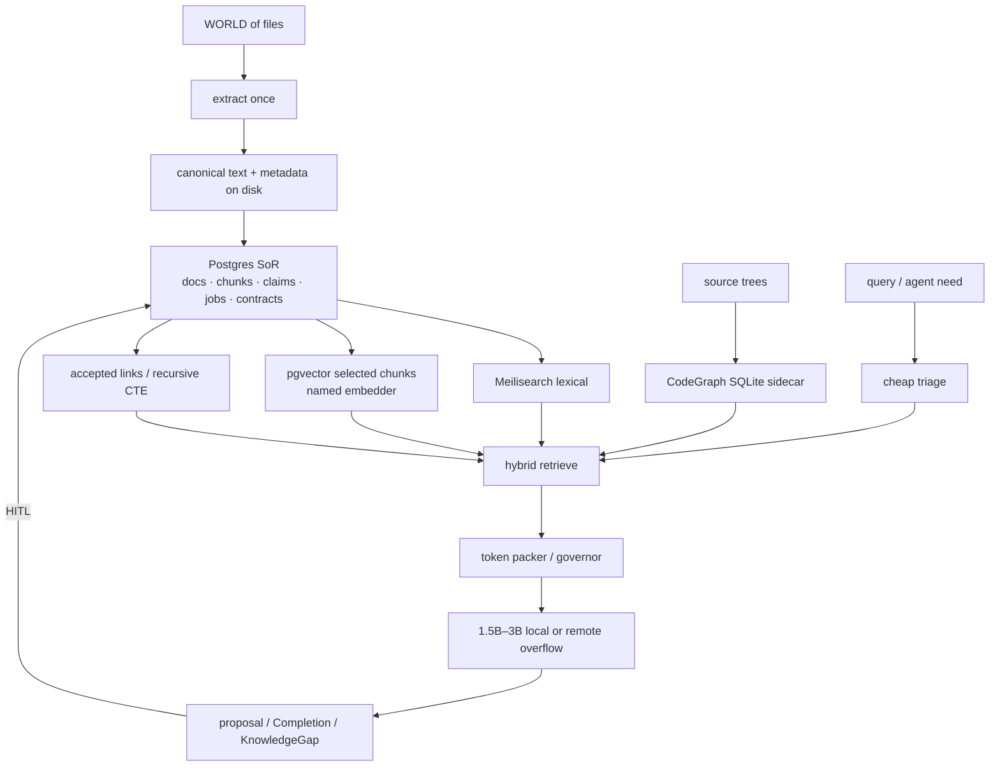
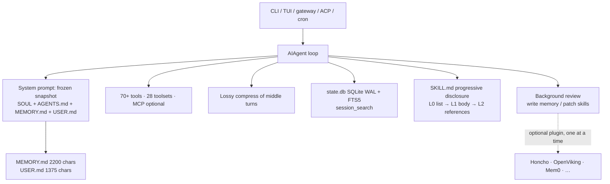

# About Memory, RAG, and Graphs

**Date:** 2026-08-27  
**Status:** recap / design instrument (not a spec, not an implementation plan)  
**Reads:** four prior Cursor chats (all recovered; one UUID was wrong — see §1.1); [NousResearch/hermes-agent](https://github.com/NousResearch/hermes-agent) and its memory / skills / architecture docs (2026); Revival v2–v4; Projet Complexe notes 14 / 17 / 18; EnvHarness and AutoDesign overlaps; NLP recap; AI agents literature review; CLR / reverse prompting; Four Layers; Cognitive Institutions; Long, *AI-Supervisor*, arXiv:2603.24402v2  
**Books (paraphrase only):** Labaschin & Wallace *Managing Memory for AI Agents*; Norman *Agentic RAG Systems*; Devlin *Building LLM Agents with RAG, Knowledge Graphs, and Reflection*; Magda *Just Use Postgres*; Stewart & Huang *Agentic AI Data Architectures*; Kleppmann & Riccomini *Designing Data-Intensive Applications* (2nd ed.); Gazit & Ghaffari *Mastering NLP*; Grootendorst/Alammar via the agents review; Bhagwat; Berryman; Kar; Lanham  
**Hardware this note is written against:** Debian 13 laptop — Intel i7-8750H (6C/12T), 32 GB RAM (~16 GB available under load), GTX 1050 Mobile 4 GB Pascal (driver 580 / CUDA 13), 32 GB swap, NVMe ~884 GB with hundreds of GB free. Overflow: dedicated remote server (16 GB RAM), not the brain.

This document **paraphrases**. It does not paste books, papers, or chat dumps into the second brain. That is the same failure mode the August notes already named for Wikipedia dumps: a library, not an import.

Each block is asked the same four questions used elsewhere on this shelf:

1. What was actually claimed (chat, paper, or book)?
2. How is it implemented in the wild?
3. Where does it sit on ASC / Projet Complexe ASC / Projet Complexe / Compose / Tauri?
4. Steal, adapt, or refuse?

---

# 0. Verdict in one page

Retrieval quality on this laptop is **not** a bigger local model. The 1050 cannot usefully run 7B-class GPU inference, let alone FreeToken-class MoE offload. Quality has to come from **indexes + packing + allowlisted tools**. A 1.7B–3B local model with an excellent working set beats a stuffed 70B and beats the 15 GB Devstral already sitting in Ollama.

The four chats, read together, say the same thing v3 already decided, and they add two corrections: hardware (tiny local models), and **which graph is which**.

| Source | What it actually adds |
|---|---|
| Codegraph projects comparison | Code graphs are a **sidecar**, not the knowledge plane. Steal **CodeGraph** (Rust + SQLite + MCP, no LLM to index). Do **not** make Memgraph/Qdrant the second brain. Do **not** make Tencent’s hub the memory OS. |
| EnvHarness then AutoDesign | Skill lives in the **harness**, not the weights. Wrap the world (EnvHarness). Freeze the model, evolve packing/tools with a gate (AutoDesign). HITL remains the only commit of Claims. |
| AI-Supervisor summary | Persistent **Research World Model** with uncertainty on edges, not a stateless paper pipeline. Steal persistence + `proposed`/`accepted`. Refuse unsupervised “AI professor,” multi-agent consensus as truth, and a dedicated lab graph product. (Wrong UUID `1ef63e72-…` pointed here.) |
| [Hermes Agent](https://github.com/NousResearch/hermes-agent) (this note, §2) | Best *harness packing* in the wild for chat+skills: bounded MEMORY.md, FTS5 on sessions, progressive skill disclosure. **Not** a research-world graph and **not** the control plane. Steal retrieve-on-demand for traces. Refuse WhatsApp-as-host, agent-written Claims, and `~/.hermes` as the second brain. |

**Ideal stack for Projet Complexe on this computer**, least performance budget for maximum retrieval quality:

```text
Filesystem (canonical) → extract (bounded job)
                       → Postgres SoR
                            ├─ Meilisearch (lexical first)
                            ├─ pgvector (selected chunks, named spaces)
                            ├─ accepted_links (conceptual graph, recursive CTE)
                            └─ CodeGraph SQLite sidecar (code only, MCP to Cursor)

Harness: cheap triage → lexical → optional vector → accepted walk → packed window
         local 1.5B–3B (GPU) or 7B (CPU) → remote overflow
MCP: optional transport. CodeGraph MCP is the only MCP worth installing day one.
```

**Compose vs SQLite in the Tauri app:** Compose for Postgres + Meilisearch (Projet Complexe ASC owns lifecycle). SQLite is allowed for **CodeGraph’s code index** and for **Tauri chrome** (settings, drafts, UI cache). SQLite is **not** the system of record for Claims, corpus, jobs, or the conceptual graph.

**Arango / Memgraph / Qdrant / FreeToken / Tencent hub / LangChain-as-brain / embed-everything / GraphRAG-as-truth:** refuse as identity. Later, maybe, if a named measurement says Postgres traversals hurt.



## Jargon notes

Terms as this note uses them. Industry synonyms are listed so they do not get imported as identity.

| Term | Alternative notations, synonyms | Definition | Examples, use cases |
|---|---|---|---|
| Context | Working set; prompt contents; “what the model can see this turn” | Everything currently in the model’s input (instructions, tools, retrieved spans, scratch). Not the archive and not memory. Overloaded also as project files (`AGENTS.md`) and Honcho’s injected “context.” | A packed `run-agent` prompt; Hermes system-prompt snapshot; AutoDesign’s design context `c`. |
| Model window | Context window; `num_ctx`; context length | Hard token budget of one inference call. Retrieval quality is how you spend this budget, not how you enlarge it. | Local default 2k–4k on this 1050; a 128k API is not a reason to stuff OCR. |
| Skill | Agent Skills; [agentskills.io](https://agentskills.io); `SKILL.md`; procedure brief | A markdown procedure the agent may load on demand (when to use, steps, pitfalls). Not a Claim, not a tool, not MCP. v4: skill folders are not a second OS. | Hermes `/learn` and `skill_view`; Cursor/Claude skill files; here: YAML `able` + git, not `~/.hermes/skills` as SoR. |
| Model Context Protocol | MCP | JSON-RPC plug so a **host** (Cursor, Claude, Hermes) can list/call tools from a **server**. Transport only. Does not store knowledge. | CodeGraph MCP when Cursor is host; refuse “memory MCP” as the store; ASC entry points when ASC is host. |
| Harness | Surround; `H` in AutoDesign; agent loop + tools + packing | Everything *around* frozen weights: prompts, tools, validators, packing, killswitch. Skill accumulates here, not in fine-tunes. | EnvHarness Contract; `pre_llm` / `post_llm`; Hermes AIAgent + MEMORY.md + FTS5. |
| Retrieval | Recall; search; fetch | Choosing *which* stored items enter the window. Lexical, vector, graph walk, or grep. Still not knowledge. | Meilisearch top-k; `session_search`; accepted-neighbour walk. |
| RAG | Retrieval-augmented generation; classic RAG | Retrieve then generate from the packed hits. Grounding, not intelligence. Graph RAG and agentic RAG are variants of *how* you retrieve. | Magda’s movie-plot prototype; `research` packing pointers + short spans. |
| Packing | Context engineering; token packer; governor | Select, compress, order, and budget what enters the window (lost-in-the-middle). The memory *controller*, not the memory. | CLR band; Hermes frozen MEMORY.md + on-demand FTS; OpenViking L0→L2 read. |
| Loop | Agent loop; inner/outer loop; graph of loops | Repeated plan → act → observe. Inner: one Task. Outer: evolve the harness (gated). A “graph of loops” is several loops with vetoes/anchors, not a knowledge graph. | AutoDesign designer–critic; Hermes background review; killswitch as the outer veto. |
| Control plane | Orchestrator; “who may start engines” | The layer that starts, stops, and authorizes computation. Not the GUI, not WhatsApp, not MCP. | ASC / Projet Complexe ASC over Compose; Tauri is a thin view; refuse messenger-as-host. |
| Claim | Accepted belief; typed assertion | An inspectable statement the household is willing to stand on: provenance, confidence, `valid_at`. Only HITL (or an explicit consensus rule) promotes a proposal to a Claim. | “This PDF says X (quote, page)”; not a Mem0 factoid; not MEMORY.md. |
| Edges and nodes | Vertices and relations; graph elements | Nodes are entities (Claim, Note, symbol, gap). Edges are typed links between them. An edge can be `proposed` or `accepted`. | Postgres `accepted_links`; CodeGraph call edges; Long’s `U=0`/`U=1`. |
| Conceptual graph | Personal graph; interpretive graph | The *meaning* graph (what relates to what, with types and uncertainty). Not required to be one database. Projected from tables, files, and indexes. | Claims–Links–Gaps in Postgres; drawn in the Tauri graph pane. |
| Knowledge graph | KG; property graph | Industry name for nodes+edges, often with an LLM filling triplets. Useful as a *projection*; fatal as unsupervised truth. | Neo4j/Memgraph/Arango products; Hindsight’s KG plugin; refuse auto-commit of triplets. |
| Research World Graph | Field graph; living map of a domain | The graph-shaped view of a research world: papers, methods, modules, benchmarks, gaps, limitations. Same object as RWM when stored as nodes/edges. | Long’s KG growing 7→13→19; here: tiny SQL tables, not Memgraph. |
| Research World Model | RWM | Long’s persistent, cross-project map agents read/write, with uncertainty on edges — as opposed to a stateless “write the paper” pipeline. | AI-Supervisor; steal flags + persistence; refuse the mill and Qwen-72B as default. |
| Semantic knowledge of the world | Semantic memory (CoALA); world facts | Stable-enough knowledge *about things*, distinct from “what happened in chat” and from “how to do X.” In products this is often quietly replaced by embeddings. | Claims + canonical passages + accepted links; **not** Hermes MEMORY.md (~1.3k tokens of preferences). |
| CoALA | Cognitive Architectures for Language Agents (Sumers et al.) | A 2023 map of agent memory: **working** (the window) plus long-term **episodic**, **semantic**, **procedural**, and **parametric** (weights). Grootendorst and Labaschin reuse this cut. Labels to steal; stores (Redis, Mem0, vector DBs) to refuse. | §5.2 mapping table; Hermes session / MEMORY.md / SKILL.md ≈ working+episodic / preferences / procedural — they under-build semantic. |
| Link graph (Karpathy-style) | LLM wiki; compilation-at-ingest | Notes compiled into a small linked wiki at ingest time, instead of retrieving raw chunks every query. A *generated* graph of pages, not the conceptual graph. | Karpathy 2026 gist; Tencent “Wiki” asset; adapt as optional compiled Notes, never as SoR. |
| ACL | Access-control list | Who may read/write which objects. In this note, a warning: vendor hubs sell ACLs as “memory OS.” | TencentDB Agent Memory team permissions; Postgres roles (model worker ≠ superuser). |
| System of record | SoR; source of truth for identity | The store whose ids other projections rebuild from. Files remain SoR for *bytes*; Postgres for metadata/claims/jobs. Indexes are derived. | Canonical PDF on disk; Claim row in Postgres; Meilisearch rebuildable. |
| Episodic recall | Session search; “did we discuss X” | Finding *past events* (turns, traces), not world facts. Cheap when it is FTS over raw messages; expensive when it is an LLM summary of the past. | Hermes `session_search`; FTS on `run-agent` traces; not Claims. |
| Always-on memory | System-prompt memory; MEMORY.md; profile block | The tiny set injected every turn. Must be bounded or it eats the window. Preferences and constraints, not the archive. | Hermes 2,200+1,375 chars; a frozen preference table at `run-agent` start. |
| Lexical memory | Full-text; BM25; FTS; Meilisearch; `tsvector` | Recall by words, typos, quotes, names — no embedder required. First retrieval step on this laptop. | Meilisearch for the corpus; FTS5/`tsvector` for traces; ripgrep for this repo. |
| Procedure | Procedural memory; hook; pivot implementation; skill | How to do a recurring job. Lives in git/YAML (here) or `SKILL.md` (Hermes). Promoted by human commit, not by a silent review. | `extract` hook; Hermes progressive `skill_view`; AutoDesign one-component patch. |
| Source tree(s) | Working copy; repo; codebase | Directories of *code* (and maybe notes) on disk, as opposed to the PDF/ebook corpus. | ASC git tree; a project under `~/Documents/`; CodeGraph indexes these, not the book HDD. |
| Session | Conversation; thread; `run-agent` invocation | One bounded interaction with lineage (compressions, parent ids). Not the knowledge plane. | Hermes `state.db` session; a Tauri research thread; CLI one-shot. |
| Session scratch | Working memory; scratchpad | Ephemeral notes inside one session. Discarded after the call except as traces. | Plan bullets in the window; not MEMORY.md; not a Claim. |
| Triage | Router; cheap classifier; request-level policy | Decide *before* packing: code vs knowledge vs episode, local vs remote, retrieve vs refuse. | Gazit two-level router; Hermes hybrid skill selector; `if episode-shaped: FTS traces`. |
| Distillation | L0→L3; consolidation; background review | Compress raw traces into denser objects. Only the last layer may become knowledge, and only through HITL. | Tencent L0–L3; Hermes post-turn review; nightly job that *proposes* Claims. |
| Extract-once canonical text | Canonical extract; contracted extract | One bounded job writes plain text + metadata from a file; all indexes fan out from that. Opposite of re-parsing and of `/learn` replacing the book. | Docling/pdftotext → file on NVMe → Postgres row → Meilisearch. |
| Progressive disclosure | LOD; L0/L1/L2; skill levels | Show names first, bodies on demand, full passages last. Packing applied to procedures and to graph zoom. | Hermes `skills_list` → `skill_view`; OpenViking abstract→full; note 18 LOD 0–4. |
| Stateless pipelines | One-shot agents; “AI scientist” scripts | Generate from a prompt, forget the field. No lasting map, no uncertainty, no cross-project links. | AI Scientist / Agent Laboratory as Long criticizes them; a chat with no traces. |
| Remote overflow | Metered cascade; LAN/cloud fallback | When local 1.5B–3B + indexes are not enough, call a remote model under quota — not FreeToken on Pascal. | Hard reasoning; fr/en/pt when local retrieve is weak; dedi for OCR/ASR batches. |
| Frozen environment | EnvHarness wrap; untouched verifier | Do not rewrite the world or the human checker; wrap `reset`/`step` (or `pre_llm`/`post_llm`) to regulate difficulty. | EnvHarness Stage/Contract/Chain; packing as Contract over a living second brain. |
| Frozen system-prompt block | Prefix-stable snapshot; prompt stability | Memory on disk may change mid-session; the injected prefix does not, so the cache stays warm. | Hermes MEMORY.md loaded once per session; steal for preference blocks here. |
| Prompt-injection scan | Untrusted-text filter | Regex/heuristics that block “ignore previous instructions” (and kin) in files injected into the prompt. A habit, not a killswitch. | Hermes scan of `AGENTS.md` / MEMORY.md; still review files you did not author. |
| Lossy middle-turn compression | Context compressor; stacked summaries | Drop or summarize old turns to fit the window. Fast; destroys early negations and citations (Labaschin). Compress *chat*; retrieve *corpus* from indexes. | Hermes `context_compressor`; `/compress`; not a substitute for Meilisearch. |
| CLR | Cognitive Load Ratio; Flow band for agents | Task complexity vs effective capacity (retrieval, tools, packing, window). Regulate the band; do not buy a bigger model first. | Reverse-prompting note; 1.7B + excellent retrieve vs stuffed 70B. |
| MoE, OLMoE | Mixture of Experts; tiny-MoE demo | Architecture that routes tokens to expert subnets. FreeToken-class MoE offload wants RTX 30+ and lots of RAM. OLMoE is a small demo, not quality on a 1050. | Refuse FreeToken here; stay dense 1.5B–3B Q4/Q5. |
| FTS5 | SQLite FTS5; full-text virtual table | SQLite’s built-in full-text index (BM25-ish, tokenizers for CJK/trigram). Hermes uses it on **messages**. Not Meilisearch for PDFs. | `state.db` `session_search` ~20 ms; optional trace sidecar; prefer Postgres `tsvector` if traces already live there. |
| CJK | Chinese / Japanese / Korean; `cjk_unicode61` tokenizer | Scripts that do not split words on spaces the way English FTS expects. A default word tokenizer under-indexes them; you need a language-aware analyzer (or a dedicated CJK tokenizer). | Hermes `messages_fts_cjk`; Meilisearch fr/en/pt analyzers are the same *kind* of problem — this corpus is multilingual; English-only FTS has failed (Winteringham). |
| Trigram | n-gram (n=3); `trigram` tokenizer; pg_trgm | Index of overlapping 3-character slices. Finds substrings and typos without a word dictionary. Complements word FTS: good for CJK, codes, and “I remember a fragment.” | Hermes `messages_fts_trigram`; Postgres `pg_trgm` / Meilisearch typo-tolerance; not a substitute for a named embedder. |
| HITL | Human-in-the-loop; accept/reject | A human is the commit device for knowledge (and for harness patches). Consensus of LLMs is not HITL. | Claim accept; `write_approval` **on**; AutoDesign train/dev gate analogue. |
| WAL | Write-ahead log | SQLite/Postgres journal so readers can proceed while one writer appends. Hermes documents WAL *contention* when CLI + gateway + worktrees share one `state.db`. | Why sessions-in-SQLite works until several writers; why knowledge SoR is Postgres. |

---

# 1. Existing tooling review

Quick analysis of:

- AI-Supervisor
- Code graph
- Code graph RAG
- TencentDB Agent Memory
- EnvHarness
- AutoDesign

## 1.1 AI-Supervisor

*AI-Supervisor: Autonomous AI Research Supervision via a Persistent Research World Model*, arXiv:2603. Revival v3 already listed the paper.

### What the paper actually claims

Current “AI scientist” systems (AI Scientist, AI-Researcher, Agent Laboratory, and kin) are mostly **stateless pipelines**: they generate ideas and text from prompts, do not keep a lasting map of the field, do not empirically probe gaps, and still need a human expert for direction and rigor. The pitch: curiosity-driven *research supervision* without institutional affiliation — not merely paper generation.

The core object is a shared **Research World Model (RWM)**: a knowledge graph of papers, methods, modules, benchmarks, gaps, and limitations, with uncertainty flags (`U=0` verified, `U=1` unverified) and performance metrics on edges. Agents read/write this graph; only corroborated findings get committed.

Three contributions the chat recorded:

1. **Structured gap discovery** — decompose methods into modules, check them on benchmarks, map real failures.
2. **Self-correcting discovery loops** — probe *why* things fail, benchmark bias, whether eval protocols still hold.
3. **Cross-domain development loops** — 5-WHY → abstract mechanism → search other fields, with a 10-criterion quality gate that forces *reassessment* (not just more search) on failure.

Pipeline sketch: 0 supervision (interest → directions) → 1 literature (parallel multi-venue search) → 2a build RWM → 2b gap probing + consensus → 3 method development → 4–7 eval, packaging, writing, review (route back on weaknesses).

Reported highlights (paper’s numbers, not independently re-run here): gap discovery on Scientist-Bench 27 tasks, alignment 4.44/5, precision 0.807, recall 1.0; full method-development loop 8.0/10 vs 5.6 without the cross-domain loop; 16 cross-project graph links as the KG grows 7→13→19; +24% relative precision from consensus vs best single agent; novelty 20.6/25 cross-domain vs 15.6 within-domain. Cost claimed ~$8–16/run with Qwen-72B. Code: [github.com/autoproflab-debug/AI-Supervisor](https://github.com/autoproflab-debug/AI-Supervisor). Limitations they state: non-zero API cost; human still needed for topic/contribution; quality capped by the underlying LLM; binary uncertainty is coarse.

**Bottom line of the chat:** research automation should be **active exploration + a living world model**, not one-shot LLM generation.

### Where it sits on this stack

| Their object | Here |
|---|---|
| Persistent RWM across projects | Postgres Claims / Links / Gaps + files — **not** a second graph product |
| `U=0` / `U=1` on edges | `accepted` vs `proposed` (v3 already stole this) |
| Gaps as first-class | KnowledgeGap already in v2 |
| Consensus before write | **Human** is the consensus device at household scale |
| Multi-agent society + quality gate | Allowlisted pivots + killswitch + HITL; not a chatting lab |
| Cross-project memory (7→13→19 nodes) | Persistence is the point of a second brain. Scale is tiny; SQL is enough |
| Qwen-72B full pipeline | Remote overflow, metered. Not this 1050. Not a default job |
| Unsupervised paper mill (phases 4–7) | **Refuse** as identity (v3 §9.7, v4 plane D) |

This is the missing fourth argument next to CodeGraph and Tencent: **a living graph with uncertainty is the right *memory* shape for research**, and it is still not a reason to install Memgraph, Arango, or an “AI professor.” It is a reason to keep `proposed`/`accepted` on links, to treat KnowledgeGaps as objects rather than failed RAG, and to refuse stateless chat-as-memory *and* unsupervised gap mining that writes the graph.

**Steal.** Persistent world across sessions. Uncertainty on edges. Gaps as objects. A quality gate that *reassesses* instead of searching forever (pair with EnvHarness/AutoDesign: the gate is HITL + killswitch, not a 10-criterion LLM rubric as ontology). Elastic token budget only as the packing governor.

**Adapt.** Their “consensus” → two extractors may *propose*; the human accepts. Cross-domain 5-WHY → a `research` composition, sandboxed, never production self-mod of pivots (v3). Binary U is coarse → `proposed` / `accepted` / `valid_at` / provenance is richer and cheaper.

**Refuse.** Standing up AI-Supervisor as the product. GPU benchmark jobs as default gap discovery. Multi-agent chat until agreement. Auto-commit of LLM triplets. “Spend until it looks like a lab.” Qwen-72B as the local brain. Their KG growth story as a reason to pick a graph database — 19 nodes is a Postgres table.

v3 §9.7 already had this steal/adapt/refuse table. The chat does not reopen it. It *grounds* it: the PDF is the temptation; the household stack is the refusal of the mill and the theft of the flags.

## 1.2 Code graph projects comparison

Question: differences between [colbymchenry/codegraph](https://github.com/colbymchenry/codegraph) and [vitali87/code-graph-rag](https://github.com/vitali87/code-graph-rag), then [TencentCloud/TencentDB-Agent-Memory](https://github.com/TencentCloud/TencentDB-Agent-Memory).

### What they actually are

| | **CodeGraph** | **Code-Graph-RAG** | **TencentDB Agent Memory** |
|---|---|---|---|
| Job | Pre-indexed **code** graph for coding agents | Full RAG + agent over a **code** graph: ask, edit, optimize in English | Team **memory hub**: chat, skills, wiki, *and* a code graph |
| Core | Rust parse kernel + Node CLI/MCP | Python + Tree-sitter | Node ≥ 22, Memory Core + Hub UI + Proxy |
| Store | Local SQLite (`.codegraph/`) | **Memgraph** + optional **Qdrant** | Hub DB + whatever the wiki/code pieces need |
| LLM to index? | **No** | Yes, for NL→Cypher and agent loops | Yes (keys required) |
| How agents attach | **MCP** | CLI + MCP | **Proxy** (point the agent’s base URL at it), not primarily MCP |
| Docker extra graph DB? | No | Yes | Hub, not a drop-in indexer |
| Fit on this laptop | **Yes** — sidecar | Painful — second graph engine + vectors | No — vendor hub as identity |

One-line difference the chat settled: CodeGraph is a **drop-in agent accelerator**. Code-Graph-RAG is a **standalone analysis / refactor platform**. Tencent is a **different category**: a shared “save file” for agent teams, where code graphs are only one of four asset types.

Tencent’s four assets (paraphrase of their README, not a product to install):

| Asset | Role in *their* product | Already exists here as |
|---|---|---|
| Chat memory | Preferences, facts, decisions; L0→L3 distillation | Session scratch ≠ Claims |
| Skill | Versioned reusable workflows | YAML `able`, hooks, pivots |
| Wiki | Structured docs + link graph (Karpathy-style) | Notes / files, not a memory OS |
| CodeGraph | Symbols, calls, impact paths | Programming-assistance worker; **not** the personal graph |

### Steal / adapt / refuse (code graphs)

**Steal from CodeGraph.** Local SQLite index, no LLM to parse, MCP so Cursor already knows how to ask “what calls this.” Watcher / auto-sync is optional. This is the least RAM for the most *code* retrieval quality on a 32 GB laptop that already runs Cursor. It matches v4’s rule: Tree-sitter work is **delegated**, not reimplemented. v4 named code-graph-rag as the example; **this chat revises the Implementation for this hardware toward CodeGraph.** Keep the pivot name (`code-index` / programming-assistance). Swap the engine without swapping the vocabulary.

**Adapt from Code-Graph-RAG.** Tree-sitter as the parse idea; NL→Cypher as a *later* research toy; dead-code / impact as reports, not as Claims. If a future measurement says you need runtime `CALLS` tracing, that is a named Environment, not day-one Compose.

**Refuse as identity.**

- Memgraph + Qdrant as the knowledge plane (v3 already chose Postgres).
- “The code graph *is* the second brain.” Code entities are not Notes, Claims, or KnowledgeGaps.
- Tencent hub: vendor ACLs, LLM keys, proxy-as-OS, collapsing chat/wiki/skills/code into one “memory product.” Steal the *cut* (those four are different types). Do not steal the product.
- Unbounded MCP tool catalogs. CodeGraph MCP is one allowlisted server for **code**, when Cursor is the host. When ASC is the host, a CLI behind an entry point is enough.

Revival v4 already said: code-graph-rag’s MCP is the correct use of MCP (neighbor host). This chat adds: **on a GTX 1050 + 32 GB box, do not also pay for Memgraph.**

## 1.3 EnvHarness, AutoDesign

Already written in durable form:

- [Overlap with EnvHarness](Overlap%20with%20EnvHarness.md) — [arXiv:2608.19880](https://arxiv.org/abs/2608.19880)
- [Overlap with AutoDesign](Overlap%20with%20AutoDesign%20-%20Meta%20Harness%20Optimization%20for%20Long-Horizon%20Agentic%20Design.md) — [arXiv:2608.13560](https://arxiv.org/abs/2608.13560)

Same week, two sides of “harness, not weights.”

**EnvHarness** wraps a *frozen environment* at `reset()` / `step()`. Three plug-ins: Stage (start harder or easier), Contract (filter actions, rewrite observations), Chain (compose tasks). Steal wrap + difficulty band. Refuse gym/Python-as-source-of-truth.

**AutoDesign** freezes *weights*, evolves harness H (context, tools, runtime, orchestration, evaluation). Two loops: inner generate–critique–revise; outer one-component gated update. Steal two-loop picture and gated update. Refuse self-rewriting ASC, poster mill, VLM-as-Claim.

**What this means for memory and RAG:** packing *is* the Contract. Retrieval *is* observation rewrite. The token governor *is* the difficulty band (CLR). Evolving “memory” by letting an agent rewrite hooks every night is AutoDesign’s outer loop **without** their train/dev gate and without HITL — refuse. Nightly consolidation that *proposes* packs, skills, or Claims, with a human accept, is the adapted outer loop.

---

# 2. Hermes Agent (Nous Research) — comparison

**Source:** [NousResearch/hermes-agent](https://github.com/NousResearch/hermes-agent) (MIT), docs at [hermes-agent.nousresearch.com/docs](https://hermes-agent.nousresearch.com/docs/). Read 2026-08-27 against this note’s themes (agentic memory, RAG, graphs, local indexes), not as a product review. The Social Media literature review already *saved* the repo and said it is **not a pivot**. That still holds. This section is the close comparison the four chats did not include.

“Research agent” in their marketing is easy to misread. In the README, **research-ready** means *batch trajectory generation* to train the next tool-calling model — Nous’s lab interest — plus a named profile you can create empty (`hermes profile create research --no-skills`). It is **not** Long’s Research World Model, not Graph RAG over a personal corpus, and not ASC `research`. It is a **general agent harness** (CLI / TUI / messaging gateway) that happens to be unusually serious about *bounded* memory and *on-demand* recall.

Hermes also migrates from OpenClaw (`hermes claw migrate`). v4 already refused WhatsApp/OpenClaw as the control plane. Hermes is the same gravitational class: a better-built always-on chat OS. Steal the memory *mechanics*. Do not steal the host.

## 2.1 What they actually built



| Layer | Hermes implementation | Capacity / cost |
|---|---|---|
| Working | Current conversation + frozen system-prompt block | Whatever the model window is; they compress the *middle* |
| Semantic-lite (always on) | `MEMORY.md` + `USER.md` in `~/.hermes/memories/`, injected once per session | **~1,300 tokens total** (2,200 + 1,375 chars). Hard fail on overflow; agent must consolidate in-turn |
| Episodic | Every CLI/gateway turn in SQLite `state.db`, FTS5 (+ trigram / CJK tokenizers) | Unlimited history. Query ~20 ms. Hits are **raw messages**, not LLM summaries |
| Procedural | `SKILL.md` under `~/.hermes/skills/`, agentskills.io | Names in the prompt; bodies loaded with `skill_view` |
| Optional “deeper memory” | Exactly **one** external provider — see §2.6 | Graphs, embeddings, dialectic user-modeling — **plugins**, not the core |
| Knowledge-from-books | `/learn` authors a *knowledge-base skill*: thin `SKILL.md` + `references/` per chapter, loaded on demand | Distillation, not extract-once canonical text |

Design principles they state (paraphrase): **prompt stability** (memory writes hit disk immediately but do *not* mutate the system prompt mid-session — prefix cache); **retrieve on demand** instead of stuffing months of chat; **one agent per home directory** (two writers compound each other’s MEMORY.md).

Session search vs memory, in their own cut: memory is the tiny always-on set; FTS5 is “did we discuss X last week?” That split is the most stealable object in the product.

## 2.2 What they are *not*

| Tempting reading | Reality |
|---|---|
| Hermes is the second brain | It remembers *you and the chat*. It does not model Claims, evidence, `valid_at`, or KnowledgeGaps |
| FTS5 is Meilisearch for the archive | FTS5 is over **messages**, not PDFs/notes/OCR |
| `/learn` is RAG | It distills a book into skill files. Progressive disclosure is packing. It is not provenance-preserving extract |
| External providers make it Graph RAG | Almost never. §2.6: Honcho is a profile; Mem0 is facts+vectors; only Hindsight leans KG. Optional, one at a time, often cloud |
| “Research-ready” = AI-Supervisor | Trajectories for *training*. Different paper, different job |
| Skills folder = Projet Complexe ASC | v4: skill folders are not a second OS. YAML `able` remains canonical here |

They are closer to **Tencent’s chat + skills** (with better token hygiene) than to Long’s living field-graph or to CodeGraph.

## 2.3 Side-by-side

| Dimension | Hermes | Projet Complexe (this note) |
|---|---|---|
| Product | Always-on agent you talk to (CLI, Telegram, Discord, Slack, WhatsApp, Signal, …) | Thin Tauri + CLI over ASC; interpretation lives in Claims |
| SoR | `~/.hermes/` markdown + SQLite sessions | Files + **Postgres** |
| Always-on “memory” | ~1.3k tokens of agent-curated notes | Not a stuffed prompt. Preferences can be a small file; knowledge is indexes |
| Episodic recall | FTS5 `session_search` | `run-agent` traces in Postgres; lexical via Meilisearch/`tsvector` |
| Corpus RAG | File tools + web tools + `/learn` skills; optional Mem0/OpenViking | extract → Meilisearch → selected pgvector → accepted walk |
| Conceptual graph | Plugin (if you pick Honcho/OpenViking) | Postgres `accepted_links`, HITL |
| Code graph | ripgrep-class file tools | CodeGraph SQLite sidecar |
| Uncertainty | Not first-class on edges | `proposed` / `accepted` / KnowledgeGap |
| Learning loop | Post-turn background review writes memory/skills; `write_approval` **off** by default | AutoDesign-shaped outer loop; HITL **on** for Claims |
| Tools | 70+ registered, MCP optional, 7 terminal backends | Allowlisted ASC entry points; MCP adapter |
| Local model | Any provider; Nous Portal as convenience | 1.5B–3B Ollama default; remote metered |
| Control plane | Gateway + messengers | Refuse messenger-as-host (v4). Dedi is overflow, not WhatsApp |
| SQLite | Correct for **sessions** (they already hit WAL contention with CLI+gateway+worktrees) | Correct for CodeGraph + UI chrome. Wrong as knowledge SoR |

## 2.4 Steal / adapt / refuse

**Steal — this is real packing discipline.**

- **Hard bound on always-on memory.** 2,200 characters is a feature. Labaschin’s stacked summaries and Tencent’s L3-without-HITL both fail by growing. Hermes fails *closed* (tool error, consolidate now). A Projet Complexe packer should similarly refuse to inject unbounded “memory.”
- **Frozen snapshot at session start.** Mid-session writes persist, but the prefix stays stable. Pair with CLR: do not reshuffle the working set every tool call.
- **FTS5 on episodic traces, raw hits, no summarizer in the retrieve path.** Cheapest high-quality “what did we say about X” on this laptop. ~20 ms, no GPU, no embedder. This is the lexical-first lesson applied to *chat*, which Meilisearch applies to the *corpus*.
- **Progressive disclosure for procedures** (list → body → reference file). Same shape as LOD 0–4 in note 18. Skills should not all land in the system prompt.
- **session_search vs memory.** Always-on facts ≠ searchable history. Do not collapse them (Mem0-as-everything, Tencent hub).
- **One writer per store.** Their warning about two agents sharing `HERMES_HOME` is Kleppmann: do not run split-brain authors on the same derived memory.

**Adapt — same shape, different SoR and gate.**

- Three layers (session / persistent / skill) map to working / episodic / procedural. **Semantic knowledge of the world** is the layer they under-build (a 2,200-char file + optional Mem0). That layer here is Claims + canonical files + Meilisearch.
- `/learn` → knowledge-base skill is the right *token* idea (index + on-demand chapters) and the wrong *epistemic* idea if it replaces the book. Adapt as extract-once + Meilisearch document + optional compiled Note. The library stays a library.
- `write_approval` exists but defaults **off**. Flip the default for anything that could become a Claim. Background review = distillation job (Tencent L0–L3), cheaper auxiliary model optional — **not** every turn on this 1050, and not silent.
- OpenViking’s L0/L1/L2 tiered read (~100 → ~2k → full) is packing. Do not add OpenViking as a daemon; the packer already has this job over Postgres ids.
- Hybrid skill selector (rules → patterns → FTS5) is Gazit triage for *procedures*. Cheap classifier before packing, already in the NLP recap.
- SQLite FTS5 for traces could be a **sidecar** (like CodeGraph). Prefer Postgres `tsvector` on the same SoR if traces already live there — one less file, one less WAL fight.
- Prompt-injection scan on MEMORY.md / AGENTS.md: steal the *habit* (untrusted text is not a tool argument). Do not treat regex scanners as the killswitch.

**Refuse — identity collisions.**

- Hermes (or OpenClaw, or the gateway) as Projet Complexe, as ASC, or as the Tauri backend.
- WhatsApp / Telegram / Discord as the place Tasks are born (v4; Social Media review on Moltbot).
- Agent-curated MEMORY.md as the research world. 8–15 bullet points are preferences, not a field map. Long’s RWM and this stack’s Claims are the other job.
- Mem0 / Honcho Cloud / Nous Portal as memory SoR (Labaschin lock-in).
- Default-on background writes into “who you are.”
- `SKILL.md` catalogs as a second OS; 70+ tools as the product surface; computer-use as default.
- Lossy middle-turn compression as a substitute for packing from indexes (Labaschin: summaries drop negations). Compress *chat*; retrieve *corpus* from Meilisearch.
- Using Hermes’s SQLite success as an argument for SQLite-as-app-DB. They use SQLite because the product *is* sessions. The second brain *is* documents, claims, and jobs — Magda’s Postgres case.

## 2.5 On this laptop

Hermes as an optional **neighbor** (like Cursor, like CodeGraph MCP) is plausible: one CLI, FTS5, small memory files, your existing API keys. Hermes as an always-on gateway + browser backend + Honcho dialectic every other turn is a RAM and quota tax the 1050 and the 16 GB “available” do not have.

Do **not** run Hermes Compose-class extras (Mem0 OSS + Qdrant, OpenViking server, Honcho) next to Postgres + Meilisearch + Ollama. That is the same zoo this note already refused.

If a mechanic is worth copying into Projet Complexe ASC, copy the **mechanic**, not the home directory:

```text
traces → FTS (Postgres tsvector or a tiny FTS5 sidecar)
preferences → bounded file or a small table, frozen at run-agent start
procedures → YAML able / git, progressive disclosure into the packer
corpus → extract + Meilisearch + selected pgvector + accepted walk
claims → HITL only
```

That is Hermes’s packing lesson sitting on v3’s engines, without becoming a chat OS.

## 2.6 Deeper memory providers (Hermes plugins)

Hermes’s core is MEMORY.md + FTS5 + skills. **Deeper memory** is an optional plugin: exactly **one** of these at a time, additive, never replacing the two markdown files. They prefetch before a turn, sync after, and add vendor tools. That is Labaschin’s product category (hosted or boutique memory) hanging off a serious harness.

Hermes’s own docs also mention **Memori** as a later ninth cloud plugin. It is the same category (structured cloud recall). Not tabulated below.

None of these is the Projet Complexe knowledge plane. Use the table to see *which job* each vendor actually sells, so the zoo is not mistaken for Graph RAG, RWM, or Meilisearch.

| Provider | What it actually is | How it differs from the others | Typical use (in Hermes) | Store / cost | On this laptop / for PC |
|---|---|---|---|---|---|
| **Honcho** ([plastic-labs](https://github.com/plastic-labs/honcho)) | **User-modeling** service: peers, dialectic LLM passes, session summary, “conclusions.” Models *who you are to this agent*, not your PDF corpus. | Not a document index. Extra LLM calls on a cadence (`dialecticCadence`). Multi-profile = multiple AI peers, one human peer. | Cross-session “what does this user expect”; multi-agent alignment; gateway identity mapping. | Cloud or self-host; `honcho-ai` | **Refuse as SoR.** Dialectic every other turn is a quota tax. Steal nothing but “user profile ≠ knowledge graph.” |
| **OpenViking** (Volcengine / ByteDance, AGPL-3.0) | **Hierarchical context DB** with filesystem-like `viking://` paths, auto-extract into six categories (profile, preferences, entities, events, cases, patterns). | Closest to “browse a knowledge tree.” Tiered read is packing, not a conceptual graph. Needs a **running server**. | Self-hosted “memory files” you can browse; ingest URLs/docs into the tree. | Self-hosted; free software | **Adapt L0 (~100 tok) → L1 (~2k) → L2 (full)** as packer LOD. **Refuse the daemon** next to Postgres+Meilisearch. AGPL is a license cliff if you embed it. |
| **Mem0** | **Fact extractor + vector search.** An LLM writes memories; you search/update/delete by id. Modes: Mem0 Cloud, Docker dashboard, or OSS in-process (LLM + Qdrant or pgvector). | Hands-off extraction (the temptation Labaschin named). Dedup and optional rerank. No typed Claims, no `valid_at`. | “Remember facts from chat without curating MEMORY.md.” | Cloud paid / OSS free | **Refuse as architecture** (already in the agents review). OSS+Qdrant is the zoo. If anything, pgvector-on-selected-chunks is the same *technique* without the product. |
| **Hindsight** (Vectorize) | **KG + entity resolution + multi-strategy recall**, plus `hindsight_reflect` (LLM synthesis across memories). Auto-retains full turns including tool calls. | The only plugin whose unique pitch is *cross-memory reflection*. Local mode = **embedded PostgreSQL**. | “Graphy” recall of people/things mentioned in chat; synthesis questions. | Cloud or local PG | **Refuse reflect-as-truth** (another generator). Local PG is ironic: PC already wants Postgres — for Claims, not for a second memory bank. Steal entity-resolution as a *later* extract worker, HITL. |
| **Holographic** | **Local SQLite fact store**: FTS5 + trust scores + optional **HRR** (holographic reduced representations: compositional vector algebra, NumPy). Tools: probe/reason/contradict + helpful/unhelpful feedback. | No extra server. Unique: `contradict` and asymmetric trust (+0.05 / −0.10). HRR is a 1990s binding trick, not Graph RAG. | Local-only Hermes users who want facts with a trust knob and no SaaS. | `$HERMES_HOME/memory_store.db`; free | **Least-bad plugin** if someone insisted on running Hermes memory extras here (no daemon). For PC: steal **trust + contradict → `proposed`/`accepted`**, not HRR, not a second SQLite brain. |
| **RetainDB** | **Cloud memory API**: hybrid Vector+BM25+rerank, seven memory types, delta compression, file ingest. | Team SaaS with a file locker bolted on. “Best for teams already on RetainDB.” | Shops that already pay for that stack. | Cloud, ~$20/month | **Refuse.** Duplicate of hybrid search you can do with Meilisearch+pgvector. Metered lock-in. |
| **ByteRover** | **CLI knowledge tree** (`brv`): fuzzy text then LLM-driven search; optional cloud sync. Extracts insights **before** Hermes compresses the window (so compression does not drop them). | Portable local tree + SOC2 cloud option. Pre-compression extract is a *timing* trick, not a new memory type. | Developers who want a `brv` folder they can copy; save-before-compress. | Local default; cloud optional | **Adapt the timing:** distill traces *before* lossy `/compress`. **Refuse** another tree beside git+Postgres. `curl \| sh` CLI is not ASC. |
| **Supermemory** | **Semantic memory + profile + session graph ingest** (`/v4/conversations`). “Context fencing” strips recalled memories from captured turns so they are not re-ingested (pollution loop). Multi-container tags per profile. | Graph API at session end, not a conceptual graph you edit. Fencing is the interesting mechanic. | Profile facts on a cadence; hybrid search over memories vs documents. | Cloud or `npx supermemory local` | **Steal fencing** (do not embed retrieved spans back into episodic traces). **Refuse** the graph API as RWM. Local Node server is another daemon. |

**How they cluster** (so the eight names collapse to four jobs):

```text
User modeling ............. Honcho
Fact/vector memory ........ Mem0, RetainDB, Supermemory (cloud-ish)
Tree / tiered packing ..... OpenViking, ByteRover
Local facts + scores ...... Holographic
Chat KG + reflect ......... Hindsight
```

**Differences that matter here**

- **Corpus vs chat.** OpenViking `viking_add_resource` and RetainDB file tools ingest *documents*. The others are mostly *conversation* memory. Projet Complexe’s corpus job is extract-once, not a plugin ingest.
- **Graph vs search vs profile.** Only Hindsight (and Supermemory’s session ingest) lean “graph.” Honcho is a profile. Mem0/RetainDB are search. Calling any of them Graph RAG is a category error.
- **Who writes.** Mem0, OpenViking, Hindsight, Supermemory auto-extract. Holographic defaults `auto_extract: false`. Hermes core MEMORY.md is agent-curated with a character cap. PC wants **HITL before semantic**.
- **Always-on tax.** Honcho dialectic, Hindsight auto-recall, Supermemory auto-capture all spend tokens *every turn*. That fights CLR on a 2k–4k local window.

**Verdict for Projet Complexe:** do not enable any of these as the second brain. Copy three mechanics at most — **tiered read** (OpenViking), **save-before-compress** (ByteRover), **fence retrieved text out of traces** (Supermemory) — onto Postgres + Meilisearch + the packer. If a future Hermes *neighbor* install needs one plugin on this laptop, **Holographic** is the only one that does not add a daemon or a cloud SoR; it still must not own Claims.

---

# 3. Binding architecture (do not reopen)

From Revival v3 (engine list) and v4 (hooks, tools, MCP). This note does not reopen the three-project cut.

| Layer | Authority |
|---|---|
| **ASC** | What exists, what can be done, where, how it executes |
| **Projet Complexe ASC** | Which possibilities this environment exposes; Compose lifecycle; packs; killswitch |
| **Projet Complexe** | What it *means*: Tasks, Claims, Links, gaps, HITL |
| **Tauri** | Thin visual control plane. CLI = GUI. Webview does not own sockets to engines |

**Knowledge ≠ RAG.** Claims, evidence, gaps, HITL. Indexes are projections. Extract once, fan-out. Canonical text on disk.

**Graph is conceptual.** Default store: Postgres JSONB + accepted-link tables + recursive CTEs. A dedicated graph engine stays an open, later choice if traversals hurt.

**Retrieval order (do not invert):**

1. Filesystem + filenames + git / ripgrep (still wins on *this repo* and on code).
2. Meilisearch lexical (quotes, names, typo-tolerant titles, filters).
3. Optional pgvector on *selected* chunks, **named embedding space**, never mixed across embedders.
4. Accepted-neighbour walk in Postgres (not a dump of proposed triplets).
5. Packed RAG inside `research` / `run-agent` — pointers plus short inert spans.
6. Offline encyclopedia (Kiwix) when the home link is down — never as graph nodes.
7. Graph-RAG community reports only on a chosen personal corpus, as generated Notes, not as the UI home.

**MCP** is optional transport. Tools = allowlisted ASC entry points. YAML `able` → JSON Schema projection. Local-first; cloud metered overflow. Killswitch Task ↔ research.

Note 17 still describes Solr / Tika / Arango as *examples*. v3 rewrote the engine list. Note 18 still holds: Graph RAG over *your* notes; Wikipedia as a library; IEML as a compass.

---

# 4. This laptop’s performance budget

Numbers from the machine on 2026-08-27, not from a brochure.

| Resource | Reality | Consequence |
|---|---|---|
| RAM | 32 GB; ~16 GB “available” with normal desktop + Cursor | Postgres + Meilisearch + Ollama 2B + CodeGraph SQLite **fits**. Postgres + Meilisearch + Memgraph + Qdrant + 7B GPU **does not**. |
| GPU | GTX 1050 4 GB Pascal | Embeddings: **CPU**. Generation: 1.5B–3B Q4/Q5 or CPU 7B. No FreeToken. No Devstral on GPU. |
| CPU | i7-8750H, 12 threads | Fine for Meilisearch, pgvector HNSW on a selected corpus, overnight embed batches, CodeGraph parse. |
| Disk | NVMe root + HDD Nextcloud for books | Canonical corpus on NVMe. Book library stays on the HDD; do not import it into the graph. |
| Docker already | local stacks exist (Solr 8, MariaDB, Redis, …) | Do **not** run those Compose stacks at the same time as the Projet Complexe stack if you care about the 16 GB headroom. |
| Dedi | 16 GB, HDDs, 200 Mbps | Batch OCR/ASR, heavy embed rebuilds, Kiwix dumps. Not interactive packing. |

**Energy / Meadows:** every always-on engine is a delay you cannot see. Prefer jobs that start, write, and exit (Kofler; Magda’s “land structured results then stop”). Meilisearch and Postgres are the two daemons worth paying for. Ollama is a daemon only when you are actually generating.

**Simultaneous-load rule of thumb** (not a benchmark, a ceiling):

```text
Always-on:   Postgres ~0.5–1 GB   Meilisearch ~0.3–0.5 GB
On demand:   Ollama 1.7B–3B ~2–3 GB VRAM / or 7B CPU ~5–8 GB RAM
Sidecar:     CodeGraph SQLite — process RAM, not a second DB server
Never-on-laptop-together: Memgraph + Qdrant + Arango + Solr + large Ollama
```

Cap Compose: `mem_limit` on Postgres and Meilisearch. `shared_buffers` 256 MB class, not a 16 GB dedi-sized Postgres on the laptop.

---

# 5. What “memory” is (and is not)

## 5.1 The industry collapse

Labaschin & Wallace are the honest field report: agents retrieve **nondeterministically**; hosted “memory” is lock-in; Redis/Mem0/LangGraph are worked examples, not a survey. Grootendorst follows CoALA: working / episodic / semantic / procedural / parametric.

The 2025–2026 product move is to sell **one** of these as the product:

| Product shape | What it actually stores | Why it fails as Projet Complexe |
|---|---|---|
| Vector DB as memory | Nearest chunks | Paraphrase ≠ Claim; no unknowns; embedder lock-in |
| Chat “memory” (vendor) | Summaries + preferences | Amnesia with a smile; negations die in summaries (Labaschin’s legal warning) |
| Memory MCP | Whatever the server embeds | Transport pretending to be a store (v4) |
| Tencent-style hub | Chat + skills + wiki + code graph | Four types smashed into one ACL surface |
| GraphRAG community reports | LLM summaries of clusters | Generated Notes at best; not the UI home; not truth |
| Hermes MEMORY.md as knowledge | ~1.3k tokens of agent notes + FTS5 on chat | Excellent *packing*; empty as a research world (see §2) |
| Fine-tune the notes into a 7B | Weights | Notes change; weights do not like to; cannot export across providers |

**Steal the labels. Refuse the stores.**

## 5.2 Mapping onto this stack

| CoALA / Labaschin label | Here | Store | Promotion |
|---|---|---|---|
| Working | Packed window for one pivot invocation | RAM / prompt | Discarded after the call, except traces |
| Episodic | `run-agent` / `research` events, tool traces | Postgres | Distillation **proposes**; HITL accepts |
| Semantic | Claims, accepted links, canonical passages | Postgres + Meilisearch + selected pgvector | Accept/reject, `valid_at`, provenance |
| Procedural | Hooks, pivot implementations, YAML `able` | Git + filesystem | Human commit, AutoDesign-style gated update |
| Parametric | Model weights | Ollama / remote | Frozen by default (AutoDesign) |
| Sensory | OCR / ASR / images | Canonical files; opt-in jobs | Cost cliff; not a default memory type |

Hermes’s three-layer cut (session FTS5 / MEMORY.md / SKILL.md) maps cleanly onto working+episodic / a *preference file* / procedural. It does **not** map onto semantic. That is why it can look like “the memory product” while still leaving Claims, gaps, and the corpus unsolved. Use it as a packing lesson (§2), not as the mapping above.

Tencent’s L0–L3 distillation is **interesting as a process**, toxic as a product. L0 = raw transcript. L1 = extractives. L2 = structured facts. L3 = durable Claims. Only L3 may enter the knowledge plane, and only through HITL. Nightly consolidation (Meadows delays), not every-turn embed.

Karpathy-style LLM wiki: compilation-at-ingest versus RAG. **Adapt** as: extract once to canonical text; optional compiled notes; never replace the files with a wiki service.

## 5.3 Packing is not memory

Berryman / Grootendorst / CLR: the window is a scarce working set. FIFO and stacked summaries destroy early constraints. Semantic cache helps repeated **single-shot** corpus questions and breaks in multiturn (Labaschin).

The packer (Revival v3) is the memory *controller*, not the memory. It selects, compresses, orders (lost-in-the-middle), and leaves inert citations as pointers.

Gazit/Ghaffari (NLP recap): **cheap triage before packing**. Classify → pack → choose Technology → authorize. Do not start `run-agent` by embedding the query.

---

# 6. RAG, Graph RAG, code-graph RAG

## 6.1 Classic RAG (still necessary, still insufficient)

Norman (*Agentic RAG Systems*) and Devlin: RAG is grounding, not intelligence. Production RAG is hybrid, evaluated, chunked on purpose, with a refusal path when retrieval is weak.

Magda chapter 8 is the *minimum* loop: embed selected rows, cosine search, prompt an LLM. A second brain needs contracts, provenance, accept/reject, killswitch, and a lexical engine that does not depend on an embedder being warm.

**Chunking (state of the art, stolen as policy, not as a library):**

- Hierarchical: document → section → passage. Retrieve small, expand parent if needed (Gazit; Norman).
- Do not embed 80-page OCR as one vector.
- Language-aware: fr / en / pt analyzers in Meilisearch; **named** embedding spaces if the embedder is multilingual vs English-only. English-only embeddings as the store is a closed door (v4).
- Selected corpora only. Photos, video ASR, bibliographic HTML: opt-in cliffs (note 17, still true).

**Hybrid retrieve (least budget, most quality):**

1. Lexical shortlist (Meilisearch) — cheap, names and quotes.
2. Optional vector re-rank or fusion on that shortlist — not a full-corpus ANN scan every query.
3. Accepted-neighbour walk, hop-limited (2–3), **accepted** edges only.
4. Tiny reranker on top-k **only if** a CPU model earns its keep in evals. Skip cross-encoders on the 1050.
5. Pack to token budget. If confidence is low: KnowledgeGap, not a fluent lie.

Agentic RAG (Norman): the model may *issue* another retrieve. Steal as an allowlisted `search-knowledge` loop with a step cap. Refuse unbounded “search until bored.”

## 6.2 Graph RAG (Microsoft-style and after)

Note 18 already defined it: turn *your* corpus into an explicit graph, retrieve a **bounded subgraph** or a **community summary**, not only similar paragraphs. It is still retrieval. It is not ASC. It is not the knowledge model.

State of the art in 2025–2026 (paraphrase, not a shopping list):

- Entity/relation extract → graph → local neighbourhood (cheap) vs Leiden/Louvain communities + LLM summaries (expensive, stale).
- LightRAG / lazy graphs: extract less, query more — tempting, still not Claims.
- Uncertainty on edges (Long’s RWM, [chat recap](969f7e68-b53b-42c3-aee0-5dc456d46eee), adapted in v3): `proposed` vs `accepted`. Binary `U=0`/`U=1` is coarser than `valid_at` + provenance; steal the *flag*, not the bit.

**On this laptop:** community-summary GraphRAG is a **batch job** on a chosen corpus, writing Notes. It is not an always-on indexer. Neighbourhood walk in Postgres is the interactive Graph RAG. Long’s RWM is the same walk plus HITL commit — not a 72B lab and not Leiden communities.

**Never Graph-RAG Wikipedia.** QID as a pointer, Kiwix as a book.

**Three graphs, three jobs** (this is the correction the four chats make together):

| Graph | Job | Engine on this box |
|---|---|---|
| Personal / research world | Claims, typed links, gaps, uncertainty | Postgres accepted_links |
| Code | Symbols, calls, impact | CodeGraph SQLite |
| Microsoft-style GraphRAG communities | Optional batch Notes on *your* corpus | Job, not a daemon |

Tencent’s wiki+chat+skills+codegraph hub is the collapse of all three plus procedures. Long’s mill is the collapse of the first into unsupervised agents. Hermes is the collapse of *chat + skills + optional plugin-graph* into a messenger-shaped OS. All three are refusals as identity. The useful remainder from Hermes is packing, not a fourth graph.

## 6.3 Code-graph RAG is a different graph

Mixing “Graph RAG” with “code graph” is how you get Memgraph as the second brain.

| | Personal knowledge graph | Code graph |
|---|---|---|
| Nodes | Claims, notes, people, works, gaps | Files, symbols, calls, imports |
| Edges | Typed, HITL-accepted | Parser-true (or traced) |
| Truth | Contested, dated, multilingual | The compiler is the critic |
| Engine | Postgres accepted_links | CodeGraph SQLite (this hardware) |
| Query | Meilisearch + walk + pack | MCP `codegraph_explore` / CLI |
| LLM at index time | Optional, never required | **No** (CodeGraph) |

Ripgrep remains cheaper than any graph for “where is this string.” The code graph earns its keep for **impact** (“what calls this”) and **structure** (“who implements this trait”), which grep lies about.

---

# 7. Local indexes (what to run, what to skip)

| Index | Role | Day one on this laptop? | Why |
|---|---|---|---|
| Filesystem + git | Canonical; addressability | **Yes** | SoR for bytes |
| ripgrep / glob | Code and this repo | **Yes** | Cheapest high precision |
| Meilisearch | Lexical projection, UI + packer | **Yes** | Typo-tolerant top-k; v3 default |
| Postgres `tsvector` | Fallback FTS | **Yes, as fallback** | Progressive enhancement if Meilisearch is down |
| pgvector | Selected semantic projection | **Yes, selected** | Named spaces; HNSW; CPU embed |
| CodeGraph SQLite | Code symbols/calls | **Yes, sidecar** | No extra server |
| FTS on `run-agent` traces | Episodic “did we discuss X” | **Yes, on Postgres** | Hermes’s FTS5 lesson; `tsvector` (or a tiny sidecar), not a second brain |
| Solr | Old note-17 lexical | **No** | JVM; other local project instances already have it in their stack; Meilisearch replaced it |
| Qdrant / Chroma / FAISS-as-identity | Vector boutique | **No** | pgvector is enough at this scale |
| Memgraph / Neo4j | Code or property graph server | **No** | RAM + ops; CodeGraph covers code |
| Arango | Multi-model graph | **Later, if measured** | v3: open door, not default |
| DuckDB | Analytics over extracts | **Maybe later** | Not SoR; good for one-shot reports |
| Redis | Cache / queues | **No as memory** | Labaschin’s default; lock-in of TTL-as-forgetting |
| Kiwix / DBpedia files | Offline encyclopedia | **Optional, on HDD/dedi** | Library, not import |
| Embed-everything | — | **No** | Fatal for small windows and for the 1050 |

**Embedder on this machine:** small multilingual on **CPU** (e5-small / nomic class — named Environment, not this note). Batch overnight. Do not GPU-embed on 4 GB Pascal. Do not mix spaces.

**Meilisearch vs Postgres FTS:** Magda is honest that `tsvector` tokenises, stems, ranks. It is not typo-tolerant UI search. Keep both roles distinct.

---

# 8. Databases: why Postgres, why not the zoo

## 8.1 Postgres as system of record (Magda, adapted)

Magda’s slogan is a pressure-release against a specialised store per feature, not a religion that deletes Meilisearch or the filesystem.

Steal:

- One identity for documents, chunks, claims, tasks, jobs, contracts (JSONB where schemaless, tables where queried).
- pgvector in-process with the SoR: no split-brain “the vector DB has a chunk the DB doesn’t.”
- Recursive CTEs for accepted walks at personal-graph scale.
- Roles: the model worker is not the superuser.
- Docker Postgres as the *dev shape* that later matches dedi.

Stewart & Huang (*Agentic AI Data Architectures*): distributed SQL as the unification story for enterprise agents. **Adapt:** the unification idea (do not add a DB per agent capability). **Refuse:** Cockroach / cloud Spanner as the laptop default. This is a local-first second brain, not an enterprise fabric.

Kleppmann (DDIA 2e): indexes are **derived data**. If Meilisearch dies, you rebuild from Postgres + files. If SQLite-in-Tauri is treated as SoR, you have a second brain that cannot be queried from the CLI, cannot be jobbed on dedi, and cannot be snapshotted cleanly. Local-first is **files + Postgres**, not “the GUI owns a sqlite file the agents cannot see.”

## 8.2 Arango, later

v2/note 17 put Arango in the default picture because one engine can do docs + graph + search. v3 moved graph to Postgres because:

- Personal accepted-link graphs are small.
- Traversal pain is a measurement, not a fear.
- Arango is another daemon, another backup, another query language for the UI to accidentally own.

Revisit Arango (or another graph engine) **only if** hop-2/hop-3 accepted walks on real data are slow or awkward in SQL. That is an Implementation swap behind `relate`. The conceptual graph does not move.

## 8.3 SQLite: two legitimate uses, one trap

| Use | Verdict |
|---|---|
| CodeGraph `.codegraph/` | **Yes.** Process-local code index; rebuildable from source. |
| Tauri settings, address-bar drafts, UI cache | **Yes.** Chrome, not knowledge. |
| Hermes-style `state.db` for *this product’s* Claims | **No.** They are right to use SQLite for *their* sessions. That is not an argument to make SQLite the knowledge SoR (they already document WAL contention with several writers). |
| Optional FTS sidecar for traces only | **Maybe**, if Postgres `tsvector` on traces is worse in practice. Same trap as CodeGraph: sidecar, rebuildable, not SoR. |
| App database for Claims / corpus / jobs | **No.** Breaks CLI=GUI, dedi overflow, Compose projections, Magda’s “land in Postgres.” |
| LiteFS / Turso as cloud SQLite | **No** as identity. Local-first is not “SQLite in the region.” |
| Embedded Postgres (PGlite, etc.) | **Later Fallback** if Compose is too heavy on a *smaller* machine. Not the first shape: PCA is already Compose-shaped so laptop and dedi rhyme. |

Tauri can *talk* to Postgres on `127.0.0.1` through the Rust side or through ASC. The webview still must not open DB sockets (note 17). That constraint is unchanged.

## 8.4 Compose vs “built into the Tauri binary”

| | Docker Compose (PCA) | Everything in the Tauri app |
|---|---|---|
| CLI = GUI | Natural | Lie — agents need the same engines |
| Dedi overflow | Same compose file, different host | Rewrite |
| Crash isolation | DB lives if the GUI dies | One process, one fate |
| RAM | Capped services | Temptation to “just sqlite” then regret |
| GPU | Ollama **on the host**, not in Docker (Pascal passthrough is not worth it) | Same if you are careful |
| Day-one complexity | Real (you already run Compose for local ASC project instances) | False simplicity |

**Opinion:** Projet Complexe ASC Compose = `postgres` + `meilisearch` (+ optional embed worker **profile**). Ollama stays native. CodeGraph stays native. Tauri stays a host process. OCR/ASR/Docling are **jobs**, not always-on JVM Tika.

Do not put Solr, Arango, Memgraph, Qdrant, Redis-as-memory, or a second MySQL in that compose file.

---

# 9. Harness, MCP, local vs remote tools

v4 already answered the original “drop MCP, use DSL” question: **local tools are ASC entry points; MCP is a plug for neighbor hosts.**

This chat cluster adds hardware teeth:

| Tool class | How it should appear | Protocol |
|---|---|---|
| extract, index, relate, research, run-agent | ASC pivots, YAML `able` | CLI / hooks; JSON Schema generated |
| search-knowledge | Pivot over Meilisearch + pgvector + walk | Same |
| code-index explore | CodeGraph CLI when ASC is host | **MCP when Cursor is host** |
| Computer-use / unbounded browser | — | Refuse as default |
| Memory MCP | — | Refuse as store |
| Remote MCP (GitHub, cloud DBs) | Optional, allowlisted, metered | Adapter, not vocabulary |

EnvHarness Contract = `pre_llm` / `post_llm` + allowlist + packed observations.  
AutoDesign outer loop = gated updates to packs/hooks, HITL, one component at a time.  
Hermes background review = the same outer loop **with the gate off by default**. Steal the split (always-on bound vs on-demand FTS). Do not steal silent writes.

Hermes as a **neighbor process** (optional CLI, like Cursor) is compatible with “MCP when Cursor is host.” Hermes as gateway/WhatsApp is not.

**Remote overflow:** Moslem & Kelleher routing (v3) + Gazit triage. Local default. Remote when stakes, language, or retrieval confidence demand it. Not when the 1050 is sad — the 1050 is *always* sad; design for that.

---

# 10. Ideal implementation (opinionated)

This is inspiration for Projet Complexe, not a spec. Names below are ordinary pivots, not `$` placeholders.

## 10.1 Data plane

1. **Bytes stay on disk.** PDFs, notes, code, media. Nextcloud books stay a library.
2. **extract** writes canonical text + a contract-shaped record (Sanderson: producer/consumer; quarantine bad parses). Docling / pdftotext / OCR / ASR as Implementations. No Tika identity. GROBID only for bibliographic when DOI lookup fails (v3).
3. **Postgres** is SoR for metadata, chunks, claims, tasks, jobs, accepted_links, embedder name + model card on each vector row.
4. **Meilisearch** is fed from Postgres (or from the same extract event). Per-locale indexes or language filters. Rebuildable.
5. **pgvector** only for chunks that survived a selection policy (not every OCR line).
6. **CodeGraph** on programming working copies only. `.codegraph/` gitignored. MCP attached to Cursor, not to the knowledge UI.

## 10.2 Query plane (packer)

```text
triage (cheap: heuristics / tiny classifier)
  → if code-shaped: ripgrep then CodeGraph
  → if episode-shaped: FTS on traces (Hermes session_search lesson)
  → if knowledge-shaped: Meilisearch top-k
       → optional vector on that candidate set
       → hop-limited accepted walk
  → pack to num_ctx (2k–4k local default; freeze preference block like Hermes MEMORY.md)
  → generate
  → post_llm: citations inert, proposals not Claims
```

Eval: Winteringham — retrieval that only works in English has failed. Measure recall@k **on this corpus**, hybrid vs lexical-only. Do not trust RAGAS as ontology.

## 10.3 Memory plane

- Session scratch in the harness (working). Frozen preference block at start (Hermes snapshot), not a growing dump.
- Traces in Postgres with FTS (episodic). Raw hits, not stacked summaries.
- Distillation job: L0→L3 **proposals**, human accept (semantic). Hermes review with `write_approval` **on**, and not every turn.
- Research world: links persist across sessions with `proposed`/`accepted` (Long, adapted). Gaps stay objects when retrieve is weak. Hermes MEMORY.md is not this layer.
- Procedures in git (procedural), progressive disclosure into the packer (Hermes L0/L1/L2).
- No every-turn embed. No Redis TTL as forgetting of personal knowledge. Forgetting is a HITL policy, not a cache eviction.
- No unsupervised consensus loop that writes the graph. Persistence ≠ a paper mill. Persistence ≠ a chat OS.

## 10.4 Process plane

- Compose up/down via ASC, not via the Solid view.
- Indexing is a job with a progress event the UI may watch (note 17 IPC).
- Heavy jobs: nice/ionice locally, or ssh to dedi.
- Killswitch: Task ↔ research (v2–v4).

## 10.5 What “done enough” looks like for a first Tauri slice

Not GraphRAG. Not a memory hub. Not 70B.

A search box that hits Meilisearch, a claim pane that hits Postgres, a graph pane that draws **accepted** links from SQL, a packing preview that shows token budget, and Cursor still able to ask CodeGraph about a repo. That is already more retrieval quality than a zoo of engines.

---

# 11. Steal / adapt / refuse (master table)

| Item | Move | Why |
|---|---|---|
| CodeGraph SQLite + MCP | **Steal** | Least budget, best code retrieve; no LLM to index |
| Code-Graph-RAG Tree-sitter / impact reports | **Adapt** | Ideas; not Memgraph-as-SoR |
| Tencent L0–L3 types | **Adapt** | Process; HITL before Claims |
| Tencent hub / proxy OS | **Refuse** | Vendor memory product |
| EnvHarness wrap + band | **Steal** | Packing as Contract; CLR |
| EnvHarness gym / Python rules as SoT | **Refuse** | YAML + DSL are SoT |
| AutoDesign two-loop + gated one-component | **Steal** | Evolve harness, freeze weights |
| AutoDesign self-patching production ASC | **Refuse** | Killswitch is not an optimizer |
| FreeToken / Pascal MoE | **Refuse** | Hardware mismatch |
| Ollama 1.5B–3B short ctx | **Steal** | Matches 1050 |
| Magda Postgres + pgvector | **Steal** | SoR; selected ANN |
| Magda “delete Meilisearch” | **Refuse** | Typo-tolerant UI + packer |
| Norman hybrid / eval / refuse-when-weak | **Steal** | Production RAG without the framework |
| Devlin RAG + graph + reflection | **Adapt** | Connecting outside the window; reflection = inspect + HITL |
| Stewart distributed SQL | **Adapt** | One SoR idea; not cloud Spanner |
| Kleppmann derived indexes | **Steal** | Rebuild Meilisearch; files remain |
| Labaschin memory types + lock-in warning | **Steal** | Labels and honesty |
| Labaschin Redis/Mem0 as architecture | **Refuse** | Stores |
| GraphRAG neighbourhood on accepted links | **Steal** | Interactive, cheap |
| GraphRAG community reports as home | **Refuse** | Generated Notes at most |
| Long RWM persistence + uncertainty flags | **Steal** | Living world, not stateless chat |
| Long `U=0`/`U=1` as the only epistemology | **Adapt** | `proposed`/`accepted` + `valid_at` + provenance |
| Long consensus / 72B lab / paper mill | **Refuse** | HITL is consensus; 1050 is not Qwen-72B |
| AI-Supervisor as a Compose service | **Refuse** | v3 already; this chat confirms the temptation |
| Hermes bounded MEMORY.md + frozen snapshot | **Steal** | Packing; prefix stability |
| Hermes FTS5 on sessions (raw hits) | **Steal** | On-demand episodic recall; no GPU |
| Hermes progressive skill disclosure | **Steal** | LOD for procedures |
| Hermes `/learn` as knowledge SoR | **Adapt** | Token shape; extract-once + Meilisearch here |
| Hermes `write_approval` default off | **Refuse** | HITL on for Claims |
| Hermes / OpenClaw gateway as host | **Refuse** | v4; messenger is not ASC |
| Honcho / Mem0 / OpenViking as PC memory | **Refuse** | Plugin zoo; Labaschin lock-in |
| Wikipedia in the graph | **Refuse** | Library / QID pointers |
| MCP as vocabulary | **Refuse** | v4 |
| MCP as CodeGraph plug for Cursor | **Steal** | Neighbor host |
| SQLite as app SoR | **Refuse** | Breaks CLI=GUI |
| Arango day one | **Refuse** | Measure first |
| Embed everything | **Refuse** | Small windows + 1050 |
| LangChain / FAISS identity | **Refuse** | NLP recap |
| Solr + Tika identity | **Refuse** | v3 engine rewrite |

---

# 12. Open tasks (not this note)

1. Name the embedder Environment (model card, multilingual, CPU batch).
2. Compose file with memory caps; document “do not run other local project stacks with Solr at the same time.”
3. CodeGraph as an Implementation behind a programming-assistance entry point; MCP optional.
4. Distillation job sketch (L0–L3) with HITL, no auto-Claim.
5. Eval set: fr/en/pt questions against a slice of the personal corpus — lexical vs hybrid.
6. Decide whether overnight 7B-CPU is worth the RAM vs remote overflow (quota, not GPU).
7. Unload or stop shipping `devstral-small-2` / 4.7 GB coder as default Ollama models on this GPU.
8. If episodic search is weak in practice: add FTS on traces (Postgres `tsvector` first; Hermes-style FTS5 sidecar only if measured). Do not install Hermes as the control plane to get that feature.

None of these reopen Postgres-vs-Arango as a religious war. They implement v3 on *this* box, with CodeGraph instead of Memgraph, Long’s uncertainty flags instead of an AI-Supervisor lab, Hermes packing instead of a chat OS, and a model small enough to leave RAM for the indexes that actually make it smart.
