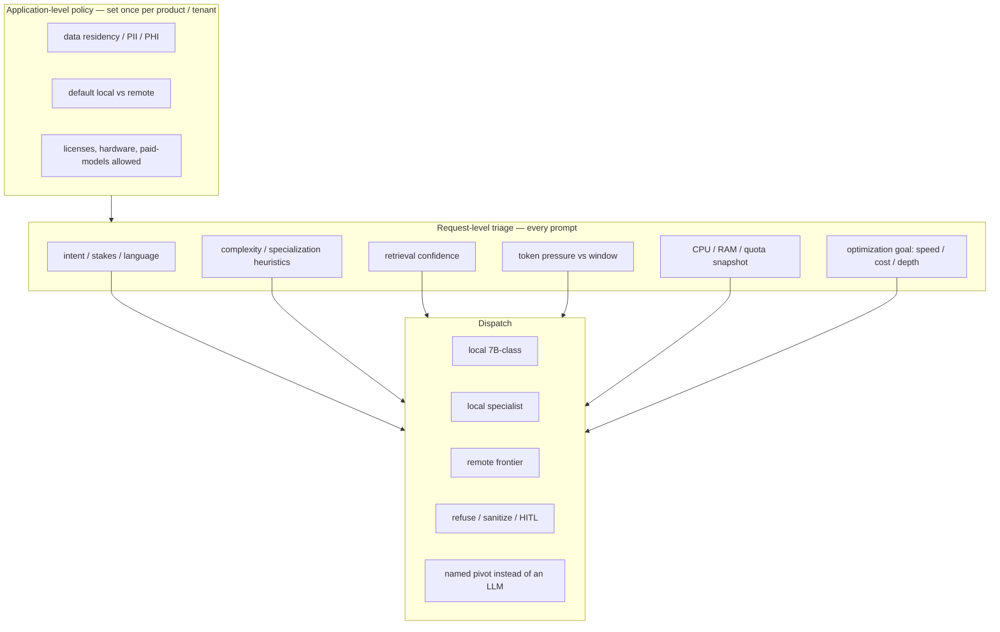
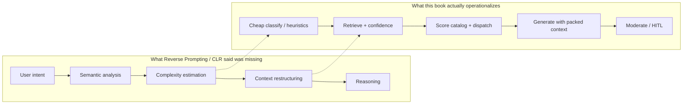
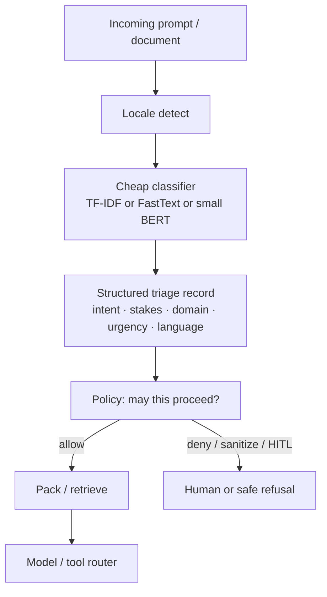
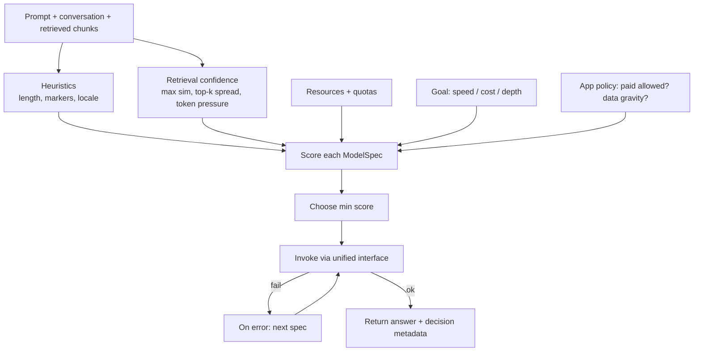
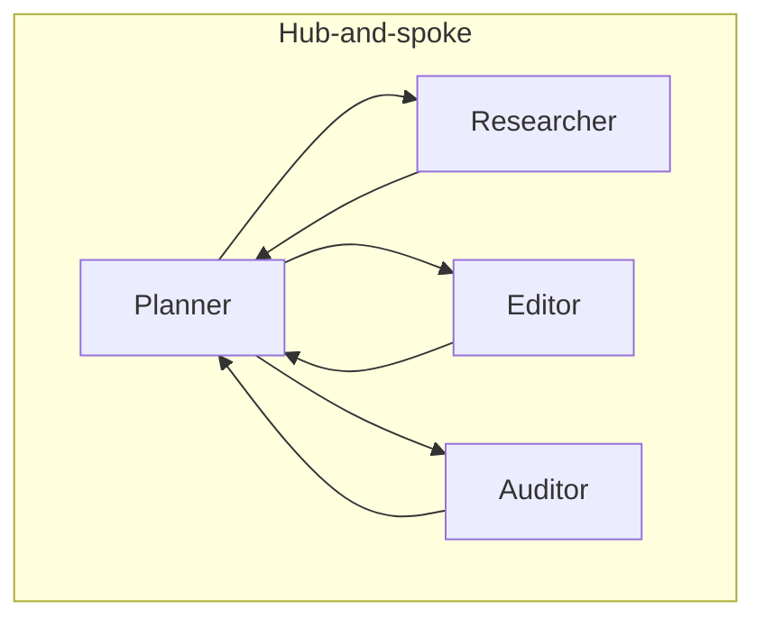
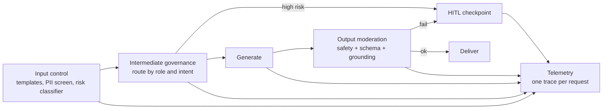
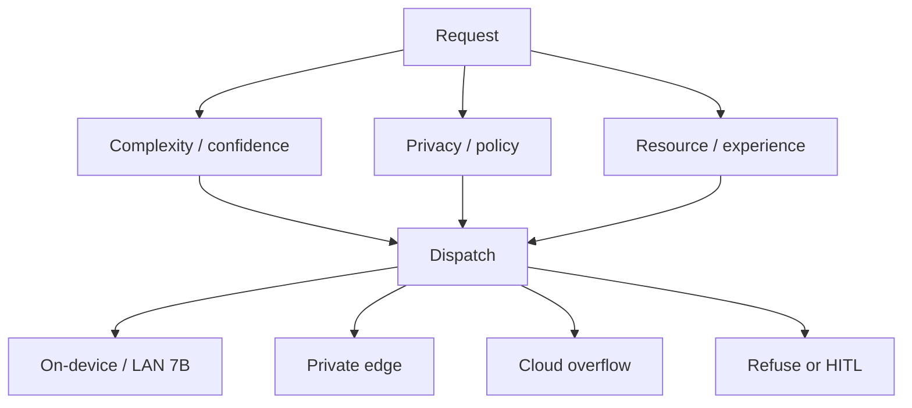
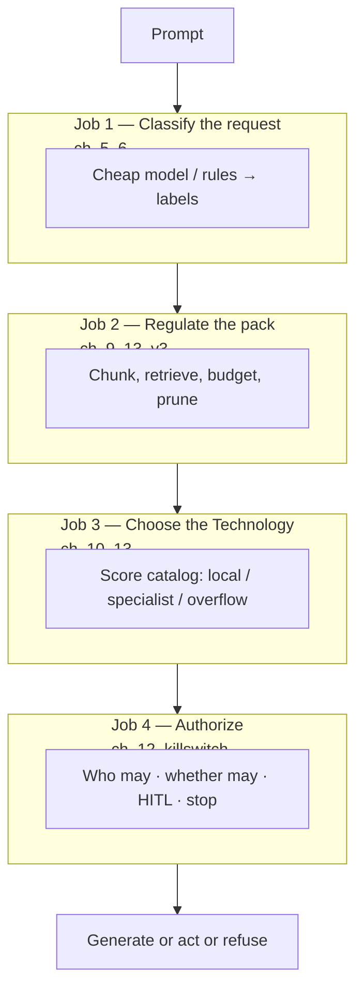

# About Natural Language Processing

**Date:** 2026-08-26  
**Status:** literature recap / design instrument (not a spec, not an implementation plan)  
**Source:** Lior Gazit and Meysam Ghaffari, *Mastering NLP From Foundations to Agents*.  
**Reads against:** ASC README (rewrite in progress); Revival v2–v4; Reverse Prompting / Cognitive Load Ratio; Four Layers; EnvHarness overlap; AutoDesign overlap; DSL note; AI agents literature review.  
**End goal:** steal what this practitioner textbook actually contributes to **prompt triaging** for Projet Complexe, without importing LangChain, Microsoft Agent Framework, FAISS-as-identity, or MCP-as-vocabulary.

This document **paraphrases**. It is not a substitute for the book. Long quotation would be both a copyright problem and the same design failure the August notes already named for Wikipedia dumps: a library, not an import. Terms of art are kept (`RAG`, `LoRA`, `QLoRA`, `DPO`, `GRPO`, `MCP`, `LCEL`, `BERTopic`, `HNSW`, `TTFT`). Arguments are restated in the vocabulary already in use: Task, Claim, pivot, hook, packing, killswitch, Cognitive Load Ratio, Technology, Implementation, Fallback.

Each chapter is asked the same four questions used in the agents literature review:

1. What do the authors actually claim?
2. How do they implement it (Python, LangChain, Ollama, MAF, notebooks)?
3. Where does it sit on the August 2026 stack (ASC / Projet Complexe ASC / Projet Complexe / Compose engine / UI)?
4. Steal, adapt, or refuse?

---

# 0. Verdict in one page

This is a **NLP textbook that ends as an agent/RAG/product book**. The first half is classical: linear algebra, ML hygiene, preprocessing, TF-IDF classifiers, BERT fine-tuning. The second half is the reason it belongs on this shelf: **the LLM is a swappable inference backend behind a stable retrieval layer**, and **model choice is a policy**, not a hardcoded identity.

That is already how Revival v4 talks about plane A (routing / cascade) and plane B (index / retrieve). The book does not invent those planes. It gives the missing **operational recipe** for the thing the August notes keep naming and never quite specifying:

> Triage the *request* before you spend context, tools, or a frontier model.

The useful object in this book is not “LangChain.” It is a **two-level router** plus a **cheap classifier tradition** that the later chapters quietly assume.

**What the book gets right for Projet Complexe**

- Retrieval stays; the model moves. Same packing path, different Technology behind `run-agent`. That is dependency inversion applied to inference — and it is exactly the ASC genericity test.
- Default cheap/local, escalate only on *evidence*: thin retrieval, high-stakes intent, long context, tool-heavy reasoning. De-escalate when the next turn is routine.
- “Complexity” is not prompt length alone, but the book’s first router still *uses* length, code/math markers, and “step-by-step” as cheap proxies. That is a Fallback, not a theory of Cognitive Load Ratio. The later healthcare case study is better: **retrieval confidence is a proxy for how much reasoning the model must supply**.
- Classification (chapters 5–6) is the missing cheap front door. Before an LLM “understands” a prompt, a small model can label queue, urgency, language, domain, and risk. The authors’ own email-routing case study is already prompt triaging, they just do not call it that until chapter 10.
- Guardrails (chapter 12) separate three jobs that chat products collapse: the router decides *who answers*, policy decides *whether they may*, the model *answers*. HITL is a checkpoint, not a vibe.
- Chunking, hybrid lexical+dense retrieval, token budgeting, and semantic caching are packing engineering. They regulate the working set. They are not knowledge.

**What the book gets wrong if taken as architecture**

- LangChain / LCEL / LlamaIndex / Microsoft Agent Framework / LLMPop are Implementations. The notebooks treat them as the system. Revival v4 already refused that collapse.
- MCP is described as a “foundational systems layer” and analogized to REST. Revival v4 already cut this: MCP is a *transport*. Local tools are ASC entry points. JSON Schema is a projection of YAML `able`. Do not let a chapter reopen that door.
- Vector search (FAISS in the demos) is not the store. v3 already chose Postgres + pgvector + Meilisearch, with lexical first.
- Keyword heuristics (`len(text) > 300`, regex for `SELECT`, `CRISPR`, `statute`) are a teaching device. They will mis-triage French and Portuguese, and they will miss the short-but-hard prompts the CLR note already warned about (“Design an ethical governance architecture…”).
- Multi-agent “debate then decide” is not a truth procedure. Revival v4 / Long `2603.24402` / Kolade: HITL commit of Claims, not consensus as epistemology.
- “40% of queries are duplicates, therefore semantic cache” is a call-center statistic, not a second-brain statistic. Cache answers to *repeatable extractive* questions. Do not cache curation.

**One-line steal**

Put a **named triage step** in Projet Complexe ASC, *before* packing and *before* `run-agent`: classify the request (cheap), score escalation signals (retrieval + stakes + complexity + resources + locale), then dispatch to an allowlisted Technology — default local, escalate on evidence, refuse or HITL on policy.

That step is ASC-generic if it is just `pre_llm` policy. The *labels* (Task vs research vs publish vs code-assist; fr / en / pt; high-stakes Claim) are Projet Complexe-specific.

---

# 1. How this book sits on the August 2026 shelf

Gazit is a finance-sector AI director; Ghaffari is a healthcare NLP engineer. The book’s examples (clinical notes, contracts, policy RAG, a $1 chatbot) are enterprise. Projet Complexe is a local, multilingual, modest-hardware second brain. The overlap is **not** the vertical. It is the **control problem**:

| August 2026 object | This book’s nearest object | Do not confuse them |
|---|---|---|
| Cognitive Load Ratio / Flow band | request-level routing + retrieval confidence + token budget | length heuristics ≠ CLR |
| `pre_llm` / packing | RAG prompt assembly + router | LangChain is not the packer |
| plane A — model routing | chapters 10 and 13 (hybrid local/cloud) | one catalog in Python is not the policy |
| plane B — index / retrieve | chapter 9 RAG pipeline | FAISS demo ≠ Postgres/Meilisearch |
| plane C — language | embedding table mentions LaBSE / E5; chapter 7 “multilingual capabilities” | English notebooks |
| plane D — knowledge / fusion | citations + faithfulness metrics | RAG ≠ Claims |
| plane E — orientation / killswitch | termination criteria, HITL checkpoints | MAF workflows ≠ System M |
| tools as entry points | MCP + LangChain tools + MAF JSON schemas | transport ≠ pivot |
| EnvHarness Contract | input/output guards, observation rewrite | gym plugins ≠ living corpus |
| DSL vs JSON | JSON Schema for tools throughout | do not teach the model DSL |

The book is strongest as a **field manual for the harness slice** (model, packing, tools, transport, a bit of skills-as-prompts). It is weakest on the interpretive layer the August notes already cover (Morin, Meadows, Lévy, Monnin, Csikszentmihalyi). Do not ask it to be *La Méthode*. Ask it how to **implement the cheap front door** that the CLR note said was missing.

The book implements levels 2–3 of the CLR note’s ladder (prompt engineering, context engineering) with a **router**. It does not implement level 4 (meta-cognitive regulation of the problem itself). That remains Projet Complexe’s job: reshape the Task, not only pick a bigger model.

---

# 2. Chapter-by-chapter

Depth follows relevance to triaging and to the three-project cut. Chapters 2–3 are kept short on purpose.

## Chapter 1 — An introduction to the NLP landscape

**Claim.** NLP moved from symbolic rules (1950s machine translation optimism, limited-vocabulary dialogue systems, hand-built ontologies) through statistical ML to pretrained transformers (BERT, GPT-class). The bottleneck of labeled data loosened because self-supervised pretraining absorbs most of the linguistic work. Math (linear algebra, probability, optimization) is not decoration; it is how models represent and update.

**Implementation.** Survey, no system. Ends by pointing at the later stack: RAG, multi-agent orchestration, alignment, safety.

**Where it sits.** Primer. The history is the same one every NLP intro tells. The useful sentence for this shelf is already in the preface: stop thinking like a *model user* and start thinking like a *system builder*.

**Steal / refuse.** Steal the stance. Refuse the implication that “system” means a Python framework. ASC is already the system vocabulary; NLP is one family of Implementations behind pivots such as `extract`, `index`, `run-agent`.

## Chapter 2 — Mathematical foundations for ML in NLP

**Claim.** Vectors and matrices are how text becomes computable. Eigen/SVD language is the ancestor of embeddings and of “directions of variation.” Probability (independence, discrete RVs, densities, MLE, n-gram counts, Bayes) is how next-token prediction is even a well-posed problem. Optimization is how parameters move.

**Implementation.** Textbook linear algebra and stats, with an n-gram MLE walk that shows word prediction as counting plus smoothing in disguise.

**Where it sits.** Background for anyone who will later read “cosine similarity” and “log-likelihood” in routing scores. Appendix A continues a “feasibility test” (independence / Bayes on binary text features) for asking whether an engineered feature carries signal.

**Steal / refuse.** Steal the reminder that a routing *score* is just a hand-built estimator. If you add “complexity” and “retrieval confidence” into a numeric rank, you are doing chapter 2 with extra steps — so log the features, and do not pretend the weights are natural law. Refuse building an ASC core around SVD tutorials.

## Chapter 3 — Unleashing ML potential in NLP

**Claim.** NLP models fail for the same reasons other ML models fail: dirty data, leakage, no held-out set, imbalance, correlated features, overfit notebooks. The chapter is a hygiene manual: explore, clean, engineer, scale, select, then pick a model family (linear, trees, SVM, bagging/boosting/stacking, then a first look at nets and transformers). Validation and the bias–variance trade-off are the actual skill.

**Implementation.** sklearn-shaped advice; SMOTE / NearMiss / cost-sensitive learning for imbalance; a warning that n-gram features are correlated and that text has temporal correlation (news, tickets) so random splits lie.

**Where it sits.** Directly useful the day Projet Complexe trains a **triage classifier**. A prompt-intent model is an ML system. If the labels come from one week of English Cursor chats, it will not generalize to French research Tasks.

**Steal / refuse.** Steal: instrument every training run; keep a true test set; treat imbalance (most prompts are easy file-renames; few are high-stakes Claim commits). Steal: put classifier hyperparameters in YAML, not in notebook cells — the authors themselves say production parameters belong in a separate YAML file. Refuse: SMOTE as a default on text (synthetic minority n-grams are a footgun); refuse making ASC an ML training platform.

## Chapter 4 — Streamlining text preprocessing

**Claim.** Preprocessing is a **design decision**, not a checklist. Normalization, NER, POS, regex, stemming/lemmatization, and especially **tokenization** decide what later models are allowed to see. Subword tokenizers (BPE, WordPiece) exist because whole-word vocabularies fail on rarity, typos, and morphology.

**Implementation.** spaCy/NLTK-class pipeline sketches; tokenizer training serialized to JSON.

**Where it sits.** This is the `extract` / canonical-text story from Revival v3, one level down. Heterogeneous ingest (PDF, HTML, notes, later audio) is not “run Tika.” It is: decode artifacts, choose whether to lowercase (often wrong for NER and for German/French), whether digits become words, whether punctuation is signal. For transformers, most of this checklist is **harmful** if applied before a pretrained tokenizer — the model already has a tokenizer.

**Steal / refuse.** Steal: tokenization as part of the contract of an embedding space (v3: named embedding spaces, not “just embed everything”). Steal: NER/POS as *optional projections* for `relate`, not as mandatory preprocess for RAG. Refuse: a universal “clean the text” hook that lowercases and strips punctuation in front of a multilingual 7B. For fr / en / pt, destroying accents and casing is a closed door.

**Relevance to triage.** Locale detection and script/tokenization choices belong *in the triage record*, because they change which embedding model and which LLM may see the text. A Portuguese prompt forced through an English-only WordPiece is already a CLR failure before anyone “routes.”

## Chapter 5 — Text classification with traditional ML  ★ triage core

**Claim.** Classification is how unstructured text becomes a **decision**: label, queue, priority. Supervised (Naive Bayes, logistic regression, SVM) needs labels. Unsupervised (clustering, LDA) discovers topics without labels. Semi-supervised (label propagation, co-training) stretches a small labeled set. Representations evolved from one-hot and n-grams through TF-IDF to static embeddings (Word2Vec, GloVe, FastText). Topic models (LDA, then BERTopic) are unsupervised classification by another name. Evaluation on imbalanced text is not F1-only; confusion matrices, and knowing when the train/test gap is an alarm, matter more than leaderboard scores.

**Implementation.** A full “ML system design” walkthrough. Two case studies:

1. **Support email routing** — business objective: for each incoming email, which queue, and how urgent. That sentence is prompt triaging.
2. **Financial tweets** — detect tweets that discuss companies or products, in a real-time stream.

Pipeline they actually run: gather → format → define classes → preprocess → explore → features → split → feasibility stats → feature selection → iterate models → freeze a chosen model. They warn: feeding test insights back into design overfits; a large train/test gap means redo the design with systematic parameters.

**Where it sits.** This is the cheapest, most honest form of **prompt triage**: a named classifier with named labels, trained offline, evaluated, versioned. It does not require an LLM. It should run *before* `run-agent`. ASC-generic shape: a pivot such as `prompt-triage` or a `pre_llm` hook that writes a structured record (intent, domain, stakes, language, urgency). Projet Complexe-specific labels: Task / research / publish / code-assist / ingest / chat; locale fr|en|pt; killswitch-relevant vs not; HITL-required vs not.

**Steal / refuse.**

Steal:

- **Define the classes first.** The authors insist on naming classes as a data-processing act. Projet Complexe should not “let the 7B infer what kind of request this is” as the first move. That wastes the Flow band on a problem a logistic regression can solve.
- **TF-IDF + linear model as Fallback.** For short prompts with stable vocabulary (`make`, `commit`, `index`, `extrait`, `relier`), bag-of-words is not embarrassing. It is fast, local, inspectable, and cheap enough to run on every keystroke if you ever want GUI-side previews.
- **FastText** if morphology matters (French/Portuguese conjugation, prefixes). Subword static embeddings are a middle Implementation between TF-IDF and BERT.
- **BERTopic** (or any embedding + cluster topic model) as a *discovery* tool: unsupervised clustering of a month of prompts to *propose* new triage labels. Human commits the taxonomy. Do not let topics become the ontology.
- **YAML parameters** for feature counts, n-gram ranges, class list.
- **Imbalance literacy.** Most agent prompts are easy. The rare ones (Claim commit, publish, legal-ish, medical-ish, destructive shell) are the ones that must not be drowned in accuracy-on-the-majority-class.

Refuse:

- Treating topic models as knowledge. LDA topics are not Claims.
- One-hot on a growing personal corpus (vocabulary explosion).
- Training the triage classifier in a notebook as the production path. The notebook is a specimen. The production path is an ASC action with a frozen artifact and a retrain action.

Chapter 5’s email router *is* this diagram without the LLM. Chapter 10 adds the LLM behind it. Do not skip chapter 5 because it looks “old.” Old is what you want on the hot path.

## Chapter 6 — Text classification with deep language models  ★ triage core (upgrade path)

**Claim.** Hand-built features fail when the text is heterogeneous, long-range, or domain-shifting. Transformers learn contextual representations; BERT-style masked LMs and GPT-style autoregressive LMs can both be used as classifiers. Transfer learning (freeze as feature extractor vs fine-tune) is the practical move. QLoRA makes fine-tuning a classifier head (or instruction-tuned classifier) feasible on modest GPUs.

**Implementation.** Neural-net vocabulary (activations, epochs, batches), then Transformers, then BERT vs GPT-for-classification, then a QLoRA fine-tune sketch, then a Jupyter classification case that replaces chapter 5’s sklearn loop with a Hugging Face `Trainer`.

**Where it sits.** The **upgrade Implementation** for triage when TF-IDF starts confusing “index this PDF” with “what is an index in philosophy.” Also the right place to fine-tune a **small local intent model** (not a 70B) on *your* labeled prompts. Modest hardware: QLoRA on a 7B is possible; a MiniLM / distilled BERT encoder is the default that actually fits the “triage must be cheaper than generation” constraint.

**Steal / refuse.**

Steal:

- **Encoder-as-classifier, not generator-as-classifier, for the hot path.** BERT-family sequence classification gives calibrated-enough labels in one forward pass. Using a generative LLM to “decide the label in JSON” is circular: you are spending the resource you were trying to allocate.
- **QLoRA as the way a later year specializes a local 7B** for Projet Complexe’s voice, locales, and tool names — *after* the generic model is in the loop. Alignment of a specialist is chapter 8; classification fine-tune is chapter 6.
- Fine-tune data should look like **(prompt, triage record)** pairs from HITL, not like “the model’s own previous guesses.” Chapter 12’s “log the reviewer’s choice” is the labeling pipeline.

Refuse:

- Fine-tuning a frontier API as the identity of triage (vendor lock, data gravity).
- Replacing the chapter 5 Fallback with a GPU classifier on day one. Start linear; promote when the confusion matrix says so (genericity scale, Revival v2).

## Chapter 7 — LLM theory, design, and implementation

**Claim.** LLMs differ from classical LMs mainly by scale and by Transformer self-attention, which changes what they can generalize, few-shot, and generate. Motivations: performance, broad generalization, few-shot, complex context, **multilingual capability**, human-like generation. Costs: data, compute, bias, robustness, interpretability, safety, energy. The catalog of “SOTA” (GPT-5.x series, Llama, Claude, Gemini, DeepSeek, PaLM, Mistral) will age; the **evaluation grid** should not: perplexity is no longer enough; add reasoning, factuality, safety, robustness, fluency/diversity, and be careful with LLM-as-a-judge.

**Implementation.** Architecture tour. No Projet Complexe-specific stack.

**Where it sits.** Plane A’s “independently trained models” (Moslem & Kelleher, already in v4). The catalog in chapter 10 is this chapter’s zoo, flattened into `ModelSpec` rows.

**Steal / refuse.** Steal the evaluation dimensions for `inspect-agent` later (factuality and robustness, not only “it sounded fluent”). Steal multilingual as a first-class *motivation*, not a fine-tune afterthought. Refuse freezing GPT-5.2 or Llama 3.2:1B as identity — the book’s own dates will rot; ASC must name the capability (`llm`, `embed`) and let the Implementation change. Refuse LLM-as-judge as the only eval of Claims.

## Chapter 8 — Parameter-efficient fine-tuning and reasoning

**Claim.** Production value is specialization without full-parameter updates. LoRA inserts low-rank adapters into selected linear projections; the base stays frozen; adapters can be merged for inference or served separately. QLoRA stores the backbone in 4-bit and trains adapters in fp16/bf16. Alignment families: RLHF+PPO (reward model + stay close to a reference), DPO (pairwise preferences, no RL loop), GRPO (normalize trajectories *within a prompt* to stabilize). Reasoning is formalized as a latent sequence `z` between input `x` and answer `y`; you can supervise steps, supervise answers only, or prefer better trajectories.

**Implementation.** PEFT/bitsandbytes-shaped. A “query projection” use case argues LoRA on the modules that matter, to avoid forgetting.

**Where it sits.** Two later doors, not the triage MVP:

- A **local specialist adapter** per locale or per domain (legal-ish export vs code-assist) is how modest hardware gets “depth” without a remote model. That is an Implementation behind the same `run-agent` pivot.
- GRPO is the same family EnvHarness used as an RL signal. Relevant if a *designer* agent ever learns routing policy from traces. Not relevant to hand-writing the first router.

**Steal / refuse.** Steal LoRA/QLoRA as the modest-hardware specialization path (README already wants Ollama + Cursor as MVP agents). Steal “reasoning as latent steps” as a *representation* that packing can request (“answer only” vs “show steps”) — that is CLR: do not spend chain-of-thought on `Rename this file.` Refuse RLHF infrastructure in ASC core. Refuse GRPO-trained routing until traces exist; a scored catalog is enough.

## Chapter 9 — Advanced setup and integration with RAG and MCP  ★ packing + tools

**Claim.** An LLM app is a layered cognitive stack (compute, retrieval, memory, agents, governance), not an API call. Two deployment modes: closed API vs local open weights. RAG is the production pattern for grounding. Chunking is the underestimated variable. Embeddings define the geometry of search; hybrid retrieval and rerankers fix what ANN alone misses. LangChain and LlamaIndex are orchestration/index layers. Optimizations: semantic cache, incremental embeddings, cache-augmented generation. MCP standardizes model–tool context exchange. End-to-end sketches: healthcare RAG, legal multi-agent verify, financial assistant with **query routing and fusion** and **adaptive token budgets**. Emerging: multi-modal RAG and self-optimizing agent graphs.

**Implementation.** FAISS, SentenceTransformers, LangChain LCEL, LlamaIndex indices, MCP-shaped JSON “context packets,” OpenTelemetry traces on packets. Healthcare/legal/finance storyboards.

**Where it sits.** This is the densest **engineering** chapter relative to Revival v3. Map carefully; do not swallow the brand names.

### 9.1 RAG as a pipeline (steal the layers, not the engines)

The authors decompose RAG as:

1. Ingest (PDFs, KBs, SQL, APIs)
2. Chunk
3. Embed
4. Retrieve (ANN + metadata filters)
5. Generate (inject into the prompt)

v3 already has this as **extract once, fan-out projections**. Canonical text on disk; Postgres as SoR; Meilisearch lexical; pgvector selected chunks. The book’s “vector DB” is one projection. Steal the *layer names* as a checklist for the `index` / `extract` pivots. Refuse FAISS/Chroma/Weaviate as identity.

### 9.2 Chunking (steal hard)

Chunk granularity controls recall **and** prompt efficiency (tokens into the window = CLR capacity). They contrast:

| Strategy | What it is | Failure mode |
|---|---|---|
| Sliding windows (e.g. 512 / stride 128) | Simple, overlapping | Redundant index, mixed topics in one chunk |
| Sentence + semantic merge | Grow until adjacent-sentence similarity drops | Needs an embedding pass at index time |
| Hierarchical micro/macro | 128–256 for precision, 512–1024 for overview | Two granularities to pack from |
| Structural splitters | Recurse on `\n\n`, `\n`, spaces | Good for Markdown notes; weak on scans |
| Tables | Serialize rows to compact JSON | Do not embed a screenshot of a table and hope |

Best practice they state: **persist both levels**, with metadata pointing at the parent document.

Chapter 13 will repeat this as a *product* decision. Revival v3 already said a bad chunk occupies a larger fraction of a small window. This chapter is the mechanism.

**Steal:** hierarchical chunks + parent ids in Postgres; structural split for Markdown/notes; semantic split as an optional Implementation for long PDFs; table serialization as an `extract` variant. **Refuse:** one global 512-token window for the whole corpus.

### 9.3 Embeddings and hybrid retrieval (adapt)

They table embedding families: general cloud, instruction-tuned, domain-specific, **multilingual (LaBSE, E5)**. Selection criteria: cosine stability across domains, throughput, latency. Normalize vectors. HNSW-class ANN with tuned `M` / `ef`. Two-stage retrieve: bi-encoder for recall, cross-encoder rerank for precision.

Later, for finance, they write hybrid fusion as a weighted mix of BM25 and dense similarity, explicitly to catch **symbolic tokens** (tickers, legal identifiers). That is Meilisearch + pgvector in v3 language.

**Steal:** named embedding spaces; multilingual embeddings as a door for fr/en/pt (do not close it with `bge-large-en` as the only index); hybrid lexical+dense; rerank only the top-k, not the corpus. **Refuse:** 3072-dim cloud embeddings as the store; English-only instruction-tuned models as identity.

### 9.4 Query-time packing (steal)

Runtime: embed the query with the **same** model as the corpus; ANN; **metadata filters** (date, type, ACL); concatenate into a template that says, in substance, *answer from this context or say you cannot*. Intrinsic metrics (Recall@k, embedding stability, latency) vs extrinsic (faithfulness, factual consistency, human citation checks). Contrastive diagnostic: swap in near-neighbor chunks and watch quality drop — that measures sensitivity to packing, i.e. CLR.

Adaptive context management (finance sketch): remaining token budget = window minus (system + query + reserved output); prune by similarity; optional compression via pooled summary embeddings (~30% token cut in their telling).

**Steal:** token budget as a first-class packing input (v4 already: `pre_llm` is the packer). Steal contrastive packing tests as an eval for `index`. **Refuse:** LangSmith as the only tracer; OpenTelemetry spans on `pre_llm` / retrieve / generate are the generic form.

### 9.5 Semantic cache and CAG (adapt, narrowly)

They claim a large fraction of production queries are duplicates or paraphrases, so a cache keyed by **query embedding** (not exact string) skips retrieve+generate. Cache-augmented generation is the cousin: stuff stable knowledge into the window or KV cache instead of retrieving every time.

**Steal for Projet Complexe:** cache *extractive* repeats (“what did I already extract from this PDF?”) and cache *triage records* for near-duplicate prompts. **Refuse:** caching *answers* as memory or as Claims. A cached answer is not a curated Claim; it has no HITL, no contradiction, no KnowledgeGap. Staleness, personalization, and safety are even named as design challenges in chapter 13 — believe that warning.

### 9.6 LangChain vs LlamaIndex (refuse as identity)

LangChain: LLM wrapper, PromptTemplate, Chain, Agent; DAGs; LCEL as `|` composition; memory modules; agents that choose tools. LlamaIndex: index structures and query engines over documents, with LangChain interop. The book’s own later moral (chapter 10) is that **the retrieval layer should stay stable while the LLM swaps**. That moral does not require LCEL.

**Steal:** the four primitives as *ideas* (model interface, prompt template, composition, tool-using loop). ASC already has composition (hooks, DSL, make). **Refuse:** LCEL or LlamaIndex query engines as the control plane. Delegate a coding-agent loop; do not reimplement LangGraph inside ASC.

### 9.7 MCP (refuse as vocabulary, allow as adapter)

The authors present MCP as filling gaps in ChatCompletion-shaped APIs: shared context, portable tool metadata, governance, audit. Principles: interoperability, context awareness, structured tool calling, security, auditability. Analogy: REST for microservices. Layering: execution (models, tools, DBs) → transport (HTTP, stdio, gRPC) → MCP (packets, handlers, registry) → apps (agents, LangGraph). Concepts: model, tool, context, packet, registry. Context packets are versioned JSON snapshots of “what the model knows now.”

Revival v4 already decided this:

| Book | August 2026 cut |
|---|---|
| MCP is the systems layer | MCP is a *transport* |
| Tools live in an MCP registry | Tools are allowlisted ASC entry points; YAML `able` is source of truth |
| Context packets are the memory | Packing is prompt assembly; knowledge is Claims |
| Multi-model MCP ecosystems | Optional adapter for *other people’s* tools |

**Steal:** packet-shaped *traces* (who sent what to which model, with schema version and provenance) — that is observability, and chapter 12 will demand it. **Refuse:** MCP as the user-visible capability surface; refuse “persistent shared memory” via the protocol as the second brain.

### 9.8 Query routing and fusion (steal the pattern)

In the financial assistant, a router (they show LangChain `MultiPromptChain`) splits “compare Tesla’s trend with quarterly revenue” into a market-data tool and a SQL-metrics tool, then fuses results into the prompt. Parallel tool invocation, schema versioning, backpressure, sharded indices, re-embed when the corpus drifts.

**Steal:** **intent → multiple named pivots in parallel → pack fusion → one generate.** That is ASC chaining/parallel, not a RouterChain class. `get_market_data` / `get_sql_metrics` are the wrong names for Projet Complexe; `search-knowledge` + `extract` + `relate` are the right ones. **Refuse:** `SELECT {metric}` string interpolation as a tool (the book’s specimen SQL is a teaching sin; parameterized queries only).

### 9.9 MM-RAG and self-optimizing agent graphs (open doors, do not build)

Multi-modal RAG: modality-specific encoders into a shared space (text, CLIP-like vision, Whisper-like audio). SOAG: graphs that reweight themselves from telemetry.

**Steal:** keep the door open for later audio ingest (README already teases transcribe). **Refuse:** self-rewriting agent graphs as the 2026 architecture. EnvHarness already showed the safer version: wrap, don’t rewrite the frozen verifier. Projet Complexe’s corpus is not a gym, but “optimizer writes new Python agents from traces” is how you get an unreviewable control plane.

## Chapter 10 — Advanced LLM practices using RAG and LangChain  ★★ routing core

This is the chapter to steal for triaging. The rest of the recap exists to make this chapter usable without swallowing LangChain.

**Claim.** A prototype that answers one prompt will break on the next; a strong model is expensive; a local model is uneven. Fix: **retrieval layer stable, LLM swappable.** Two decision levels:

1. **Application-level** — residency, UX expectations, cost/scale, licensing, maturity of hardware. Often **hybrid**: local default, remote overflow.
2. **Request-level** — per message, using lightweight signals.

Default to cost-efficient; escalate when evidence is thin, stakes are high, or the task needs deeper reasoning / long context / tools. They start with **explicit rule-based routing** for transparency; they name **semantic routing** (a small model classifies intent or complexity) as the natural next step on the same abstraction.

**Implementation.** A `ModelSpec` catalog (local Ollama 1B / CodeLlama / 20B-class, optional remote “mini” vs “reasoning” models) with tags, size rank, estimated cost/latency. Heuristics + `psutil` snapshot + scoring + fallback if init fails. Then the **same** RAG notebook, twice: healthcare notes, then legal contracts — swap corpus and domain instructions, keep retriever + router shape.

### 10.1 Application-level policy (steal as tenant config)

| Constraint | Local bias | Remote bias |
|---|---|---|
| PII / PHI / trading IP in retrieved chunks | Air-gapped / laptop Ollama | Only with contractual residency |
| UX: multi-hop, tools, long context | Often insufficient | Frontier |
| Traffic | Near-zero marginal cost if hardware exists | Elastic, metered |
| Maturity | You already run GPUs/Ollama | You want to ship this week |

This is Revival v4’s “local 7B default, overflow allowed or not” written as a product checklist. Put it in `env.yml` / `.env-local.yml`, not in prompt text.

### 10.2 Request-level signals (steal the *set*, replace the *detectors*)

The book’s signal list:

| Signal | What they measure | Honest limit |
|---|---|---|
| Capability vs context pressure | Combined tokens of instructions + retrieved docs + history + query vs local window | This is real CLR *capacity* |
| Privacy / data gravity | Does this pack contain sensitive chunks? | Needs labels on *chunks*, not only on the user prompt |
| Latency / throughput | Hardware-bound local vs rate-limited remote | Snapshot, not slogans |
| Cost | $0/token local vs metered remote | Electricity is not zero; still the right default |
| Complexity heuristic | Length > 300 chars; code fences; `def`/`SELECT`; math words; “step-by-step” | Fails the CLR short-hard prompt |
| Specialization heuristic | Regex toward code, SQL, finance, biology, law, math | English-centric; will miss `preuve`, `statuto`, `loi` |
| Resource snapshot | CPU %, free RAM | Excellent for a 16 GB dedi and a laptop |
| Quotas | Remaining API credits | Overflow policy |
| Retrieval confidence | Max similarity of top chunk; disagreement among top-k; “thin” context | **Best signal in the book** |
| High-stakes intent | Keyword lists: diagnosis, dosage, legal exposure… | Needs a real classifier (ch. 5–6) and policy (ch. 12) |
| Optimization goal | `speed` / `cost` / `depth` as a weight set | Should be a Task property, not a global flag |

Scoring: lower is better; add latency/cost/size; penalize non-reasoning models on “complex” prompts; bonus if tags match specialization; penalize large local models when CPU > 70% or RAM < 2 GB; penalize a provider when its quota is low; sort; init winner; **on failure, take runner-up**.

That last sentence is production literacy. A router that cannot fail over is a hardcoded model with extra code.

**Steal the metadata.** The router returns not only text but `chosen_model`, `provider`, `complex_prompt`, `specialization`, `optimization`, `resources`, `error`. That is the trace chapter 12 needs and the food for a later learned router. Persist it next to the Task, not only in stdout.

### 10.3 Trade-offs they actually observe

Given **identical retrieved context**:

- Local: concise, grounded, misses subtle links, hedges more — **usable for triage and extractive answers**.
- Remote: richer justification, better cross-snippet reasoning, stricter format compliance.

Hardcoding one backend either overpays for easy questions or underserves hard ones. Policy: default local; escalate on low retrieval confidence, high-stakes intent, or complexity/long context/tools; **de-escalate when the follow-up is routine**.

`allow_paid_models=False` is their kill switch for overflow. That is a global. Projet Complexe also needs a *per-chunk* and *per-Task* gravity flag (PHI-like personal notes never leave the box even if paid is allowed for a blog draft).

### 10.4 Healthcare case study — the real triage lesson

Same stack: chunk notes, vector index, retrieve, then a **simple LLM router** on top of retrieval scores.

They set two similarity thresholds (names in the book: a “good” bar and a “weak” bar):

| Query (paraphrased) | Retrieval | Router behavior | Why it matters for CLR |
|---|---|---|---|
| Which patient mentioned migraine/headaches? | High max similarity; keywords in the notes | **Local.** Extractive. Citation of patient id. | Challenge is low; a 7B in a tight pack is in Flow. A 70B would ramble. |
| Which patient might have relatives in Europe? | Indirect; mid similarity | Still **local** unless similarity falls below the weak bar | Borderline: tests whether local can *hedge*. Hedging is more valuable than a guess. |
| A patient seemed angry — I may not have written it down. Who? | Intentionally missing from notes; weak retrieval | **Escalate** (thin evidence, interpolation) | The model must invent a bridge. That is when frontier (or a refuse) pays. High-stakes clinical action keywords escalate even when similarity is middling. |

**The deep steal:** retrieval confidence is a measure of **how much of the answer is already in the pack**. High confidence ⇒ the LLM is a formatter/extractor (under-challenge risk if you still use a huge model). Low confidence ⇒ the LLM is a reasoner over gaps (over-challenge risk if you stay on a 7B with a stuffed or empty window). That is Cognitive Load Ratio with an actual sensor.

The CLR note said: complexity is solution-space entropy, not token count. This case study almost measures that: **entropy of the answer given the retrieved evidence**. When evidence entails the answer, entropy is low. When the user asks for something not in the notes, entropy is high. Route on *that*, not on `len(prompt) > 300`.

### 10.5 Legal case study — domain pack, same router

They swap in contracts, add citation-friendly formatting of chunks, a “legal-aware” router (same shape, different high-stakes keywords and system instructions), conversation memory for follow-ups. Moral: **do not rewrite the architecture per domain; rewrite the corpus, the instructions, and the policy labels.**

For Projet Complexe: research vs code-assist vs publish are domains in that sense. They share `index` / `extract` / `relate`. They do not share system prompts or HITL thresholds.

### 10.6 Semantic routing as named next step

The authors are explicit: rule-based first (auditable), then a **lightweight model that classifies intent or task complexity**. That is chapter 5–6 plugged into chapter 10. It is also Moslem-style cascades: small model first, big model if the small one is unconfident.

**Steal this sequence as the implementation order for Projet Complexe:**

1. Rules + retrieval confidence + resource snapshot (week one).
2. Supervised cheap classifier on HITL-labeled prompts (when confusion matrices hurt).
3. Optional learned ranker on traces (`chosen_model` vs later thumbs / eval).
4. Never start at (3).

## Chapter 11 — Multi-agent solutions and advanced agent frameworks

**Claim.** An agent is not a chat wrapper. It is a loop in which the model **chooses the next step**, calls tools with structured arguments, observes, revises, and **stops**. Single-agent anatomy: policy (planner), memory (short/long), tools, observe–act loop, explicit termination. Multi-agent does not add new atoms; it adds coordination. Three topologies: hub-and-spoke, peer-to-peer, pipeline. Protocols: turn-taking, blackboard, event bus. Decomposition: role prompts, **skill routing**, dynamic role assignment. Collaboration / negotiation / competition patterns exist; they need budgets and HITL. Microsoft Agent Framework is their teaching runtime (plan–act–observe–revise, OpenTelemetry, Ollama via an OpenAI-compatible client, tight JSON tool schemas, read-only tools first).

**Implementation.** Executive-brief assistant: ingest a folder, index, QC tools, single-agent baseline, then hub-and-spoke, compare. Later: goldens, spot checks, proposer-critic, auctions, red-team vs builder.

### 11.1 Anatomy (steal, it is the harness)

| Pillar | Book | ASC / PC mapping |
|---|---|---|
| Policy | Goal × state → next action; constrain with JSON Schema; put budgets in the prompt | Allowlisted entry points; YAML `able` → JSON Schema *projection*; budgets as globals / Task fields |
| Memory | Scratchpad, session, long-term stores, “hygiene” (expire, dedupe, PII) | Session ≠ Claims; packing hygiene is CLR; do not call a vector table “memory” |
| Tools | Typed I/O, idempotent retries, quotas, sandbox, read vs mutate | Pivots; mutating tools behind HITL; README non-goal: ASC is not the coding agent |
| Loop | Act → observe → revise; log each hop | Harness Implementation (Pi / Cursor / thin loop), not ASC core |
| Stop | Goal done, budget, max hops, no-progress, human checkpoint | Killswitch is richer than max hops, but max hops is the Fallback |

Failure modes they name are the under-/over-challenge symptoms in the README: tool thrashing, goal drift, cost blow-ups, unverifiable outputs. Mitigations: loop detectors, re-ground the goal each step, short-circuit paths, structured outputs with validators.

**Steal those failure modes as `inspect-agent` signals.** Refuse MAF as identity. Pi already has `before_provider_request` / tools / skills. Cursor already has a loop. ASC hosts one.

### 11.2 Topologies (adapt one, refuse the rest as default)

- **Hub-and-spoke:** control, observability, specialization; planner is a bottleneck and a single point of failure.
- **Peer-to-peer:** complementary roles (programmer/reviewer); cost unbounded without protocols.
- **Pipeline:** fixed stages, testable I/O contracts, predictable latency; brittle on unexpected inputs.

The authors’ own advice: start hub or pipeline if you care about cost and control; add peer review at a critical stage later.

**For Projet Complexe:** the interesting “multi-agent” is not a debate club. It is Revival v2’s **mutual killswitch**: Task can suspend itself to research; research can be killed by the task imperative. That is two orientations, not five personas. A pipeline of `extract → index → relate → pack → generate` is an assembly line of *pivots*, which may or may not each call an LLM.

**Skill routing** in this chapter is the same idea as chapter 10’s model routing, applied to *tools*: short transform → small local model; SQL-ish → a tool; open synthesis → larger model. **Steal skill routing as pivot routing.** Refuse dynamic role spawning as a default (unbounded branching = over-challenge).

### 11.3 Collaboration patterns (refuse as epistemology)

Shared scratchpads vs mediated summaries; handoffs with contracts; majority vote / weighted expertise / debate-then-decide; proposer-critic; auctions; red-team vs builder; budget-aware contests.

Revival v4: **never multi-agent consensus as truth.** HITL commit of Claims. Red-team vs builder is a *eval/safety* pattern (chapter 12), useful for `publish` drafts, not for deciding what the corpus believes.

Read-only tools first, then mutating tools with idempotency keys — steal that order for entry points (`search-knowledge` before `commit-claim`).

## Chapter 12 — Technical guardrails of AI safety  ★ policy routing

**Claim.** When a prototype starts making decisions, the question becomes trust. Responsibility is architecture: policy as configuration, enforcement as services, telemetry as proof. Pillars: ethics, law, business policy, reliability, regulation (NIST AI RMF, EU AI Act as *logic* even if you are not in scope). Safety is OWASP-for-LLM as well as tone: injection, insecure output handling, poisoning, supply chain. Externalize policy from the model (Bedrock Guardrails-style declarative rules; gpt-oss safeguard as a **policy-interpreting classifier** with rationales). Layered defenses: prevent, detect, respond, audit. HITL where values or consequences are material.

**Implementation.** Architecture, not a full code chapter. Policy pipeline stages. Risk taxonomy. “Office of Responsible AI” as an org chart — ignore the org chart, keep the *interfaces*.

### 12.1 The sentence to carve in stone

> The router decides **who** should answer, policy decides **whether** they may answer, and the model just answers.

Chapter 10 collapsed “who” into local vs remote. Chapter 12 splits **who** (role, specialist, model) from **whether** (allow, sanitize, escalate). Projet Complexe needs both. A brilliant local 7B must still not `publish` a Claim the human has not accepted.

### 12.2 Policy enforcement pipeline (steal as hooks)

**Input control.** Prompt templates pin where user text sits (injection-resistant structure). Regex for obvious secrets; a **small classifier** for risk categories (pass / sanitize / escalate). Mark PII rather than always blocking, and leave an audit trail. This is EnvHarness Contract-shaped: rewrite observations, filter actions, attach structured feedback — but for a living app, not a gym.

**Intermediate governance — route by role and intent.** Not all models answer all questions. Investment-ish → compliance-tuned path; legal drafting → legal path; casual → general. Workflow graphs with hand-offs and approvals. **This is prompt triaging as authorization**, not only as cost optimization.

**Output moderation.** Toxicity/threat classifiers; schema/policy guards; rewrite or safe fallback. Grounding checks belong here for RAG (faithfulness), not only “nice tone.”

**HITL.** Pause with a *minimal* review UI: content, why it stopped, one-click actions. **Log the reviewer’s choice and rationale** — that is the training set for chapter 5–6 classifiers and for killswitch policy.

**Telemetry.** One trace per request; child spans for validate / route / infer / moderate / deliver; attributes such as policy version, guard name, risk score, escalation flag. If you cannot trace it, you cannot prove it, and you cannot learn.

**Steal:** this pipeline *is* `pre_llm` / `post_llm` plus a policy pivot. **Refuse:** Amazon Bedrock as identity; refuse a separate “Office of Responsible AI” as a prerequisite for a personal second brain — *you* are the office; the logging still matters.

### 12.3 The $1 car chatbot (steal the moral)

A model that takes a joke instruction from the user over a developer constraint is textbook prompt injection. Layered intent classification, boundary checks, and output constraints are not corporate theater; they are how you keep `run-agent` from treating a note as a shell. Combined with Revival v4: the model never sees `make hook`; tools are allowlisted; mutating entry points are sandboxed.

## Chapter 13 — Designing and managing AI-native products

**Claim.** Bolting a chatbot onto a dashboard produces a model that “works” and a product that does not. AI-native means LLMs are infrastructure: data is shaped for retrieval, observability is for probabilistic systems, latency budgets are product requirements, governance is not an afterthought, metrics are task success and risk. Chunking/metadata/versioning are product decisions. Hybrid retrieval, live indexing, local vs cloud in the *data path*. Performance: TTFT, TPOT, goodput, P50/P95/P99. Semantic cache, KV cache, prefix prefill, LMCache-class prefix stores. Internal tools, enterprise search, approval flows, customer UX (streaming, citations as UI, hallucination as product behavior). Pricing/quotas. PM craft. Edge/SLMs/quantization/distillation. Hybrid routing on three axes: **complexity/confidence**, **privacy/policy**, **resource/experience**.

**Implementation.** Product architecture. Closes with a five-layer blueprint: clients → AI gateway → (router, RAG, safety, models) → data plane → observability.

### 13.1 Content structure (steal for ingest)

If the corpus is whole PDFs and unstructured wikis, RAG will look like a model failure and be a **data** failure. Plan chunks, metadata, lineage. Versioning for LLM consumption (which revision was packed?). Real-time index refresh vs batch. Local vs cloud inference as a *path* through the data, not a one-time deploy choice.

This is Revival v3’s extract-once / projections-may-lag, said from the product side.

### 13.2 Latency as CLR’s time budget

TTFT, time per output token, end-to-end, RPS, goodput, tails. Design SLOs per surface (chat support vs document batch vs code assistant). Streaming as a first-class UX because it hides TTFT. For a Tauri app on a laptop, **local TTFT is a Flow feature**: a 7B that starts tokens immediately can beat a remote 70B that waits on a queue, even if the final answer is worse — *for under-challenging tasks*. For over-challenging tasks, waiting is correct.

### 13.3 Hybrid routing axes (merge with chapter 10)

Research they cite (HERA-style edge-cloud): a small device model classifies or estimates difficulty; high confidence + simple → local; low confidence or complex → cloud; on the order of **half the subtasks** offloaded to the small model at similar quality to cloud-only. Other routers use features + **performance histories**.

Three axes:

1. **Complexity and confidence** — chapter 10’s sensor fusion.
2. **Privacy and policy** — Apple/Google private-cloud stories as existence proofs that *routing is how you express residency*. Enterprise: some data classes never leave a network. Projet Complexe: personal corpus never leaves the box; a `publish` draft might, if the human said so.
3. **Resource and experience** — weak network → local; weak device + strong network → remote; tight quota → cheaper models, preserve quality where it matters.

**Steal the three axes as the policy object** for Projet Complexe ASC (a YAML/JSON record the router reads). **Refuse** Requesty-like “smart routing platforms” as a dependency; the policy is yours.

### 13.4 Approval flows (steal for Claims and publish)

Risk tiers, workflow checkpoints, human review in regulated settings. For this project the “regulated environment” is the user’s own epistemology: **HITL accept of Claims and of exports** (v4). The book’s enterprise change-management is optional. The checkpoint is not.

### 13.5 Edge models (open door)

Quantization, SLMs, distillation, local runtimes (Ollama-class), hybrid. README: local-first, 16 GB dedi, cloud metered overflow. This chapter is the product-language version of that. Do not freeze a 1B as the only local model; do keep a 1B-class **triage/classifier** in the toolbox.

## Appendices

**A.** Math of a “feasibility test” for binary text features (independence, Bayes) — useful if you ever ask “does this engineered signal even predict the triage label?” before training.  
**B–C.** Code bundle / answers — ignore for architecture.

---

# 3. Prompt triaging for Projet Complexe — what is worth stealing

“Triage” in medicine is not “run the CT scanner on everyone.” It is a **cheap, ordered, reversible sorting** so scarce capacity meets the right case. The README’s Flow rewrite is the same idea: keep `task complexity ≈ effective cognitive capacity`. The CLR note said the missing stage is *before* the LLM. This book is the first on the August shelf that writes that stage as **code with sensors**.

Do not implement one “triage LLM.” Implement a **record** and a **policy**.

## 3.1 The triage record (Projet Complexe-specific, ASC-shaped)

A structured object written by `pre_llm` (or a dedicated pivot) and traced:

| Field | Comes from | Book chapter | Notes |
|---|---|---|---|
| `locale` | detector + user/project default | 4, 7, 9 (multilingual embeddings) | fr / en / pt as a Requirement, not “the model speaks French” |
| `intent` | cheap classifier or rules | 5, 6, 10, 12 | Task, research, publish, code-assist, ingest, chat, unknown |
| `domain` | classifier / tags | 10 specialization | code, notes, scholarly PDF, legal-ish, medical-ish, … |
| `stakes` | classifier + policy | 10 high-stakes, 12 role routing | low / medium / HITL-required / forbidden |
| `complexity_proxy` | heuristics **and** retrieval | 10, 13 | do not use length alone |
| `retrieval_confidence` | index | 9, 10 | max sim, top-k spread, hit count, lexical vs dense agreement |
| `token_pressure` | packer | 9, 10, 13 | instructions + chunks + history + query vs window |
| `data_gravity` | chunk metadata | 10, 12, 13 | never-leave-box vs overflow-ok |
| `resources` | host snapshot | 10, 13 | CPU, RAM, Ollama busy, quota |
| `goal` | Task field | 10 optimization | speed / cost / depth — or CLR target band |
| `who_may_answer` | policy | 12 | which Technology, which pivots |
| `whether_may_answer` | policy | 12 | allow / sanitize / HITL / refuse |
| `chosen_technology` | router | 10, 13 | Implementation behind `run-agent` |
| `decision_reason` | router | 10 metadata | for humans and for later learning |

ASC-generic: the *mechanism* (hook writes a record, policy reads it, dispatch is an allowlisted action). Projet Complexe-specific: the *label vocabulary* and the gravity rules.

## 3.2 Four triage jobs people collapse into one word

Keep them distinct. The book uses four different chapters for a reason.

If you only do job 3, you will send a forbidden prompt to a “better” model.  
If you only do job 1, you will classify perfectly and still stuff a 7B.  
If you only do job 2, you will pack well for the wrong model.  
If you only do job 4, you will HITL everything and never get Flow.

## 3.3 Default policy worth stealing (translated)

From chapters 10 + 12 + 13, rewritten for this project:

1. **Detect locale.** If embeddings or tokenizers for that locale are missing, *that* is an over-challenge; refuse or fallback to lexical-only Meilisearch rather than silently English-embed.
2. **Classify intent and stakes with the cheapest Implementation that meets the confusion-matrix bar.** Fallback: rules + keyword lists per locale. Promote: TF-IDF/FastText. Promote: small encoder. Do not promote: GPT-as-router on the hot path.
3. **Retrieve** lexical first, then optional vectors, then accepted-neighbour walk (v3). Write `retrieval_confidence` and `token_pressure`.
4. **Pack to the CLR band.** Hierarchical chunks, parent metadata, prune by score, reserve output tokens. If the pack is extractive-complete, *shrink* the model, do not grow it (under-challenge). If the pack is thin, either retrieve more, decompose the Task, ask the human, or escalate — do not silently interpolate (healthcare “angry patient” example).
5. **Score Technologies.** Default local 7B-class. Escalate remote/overflow only if paid allowed **and** gravity allows **and** (thin retrieval **or** high stakes **or** token pressure vs local window **or** tool-heavy depth goal). De-escalate on the next routine turn.
6. **Authorize.** Policy may refuse or HITL regardless of scores. Mutating pivots (`relate` commit, `publish`) default HITL. Read-only search does not.
7. **Fail open to the next catalog entry** if init fails; fail closed on policy.
8. **Trace the record.** Reviewer decisions become labels.

## 3.4 What “complexity” should mean here (book vs CLR)

The book’s first router measures complexity with **surface cues**. The CLR note measures **solution-space entropy**. Use the book’s cues as Fallback features in the scorer, not as the definition.

Better proxies the book *also* gives, which sit closer to CLR:

| Proxy | Why it is closer to entropy |
|---|---|
| Retrieval confidence / top-k disagreement | If the corpus already contains the answer, entropy is low |
| Token pressure vs window | Capacity side of CLR |
| Number of objectives in the prompt | README: objective count |
| High-stakes / conflicting policies | Branching + cost of error |
| Tool fan-out predicted by intent | External dependencies |
| Locale mismatch between query and chunks | Hidden entropy; packing will look “confident” in the wrong language |

A 20-page “translate this” (CLR note) should classify as **low entropy, high tokens** → local model, careful chunking, no chain-of-thought. A two-line “design an ethical governance architecture…” should classify as **high entropy, low tokens** → do not run a 7B in one shot; decompose, or HITL, or overflow. Surface length heuristics get this **backwards**. That is the main correction to apply while stealing chapter 10.

## 3.5 Where the cheap classifier lives (genericity)

| Layer | What belongs there |
|---|---|
| **ASC core** | `pre_llm` / `post_llm` hook shape; allowlisted dispatch; tracing fields; “model catalog” as data, not code |
| **Projet Complexe ASC** | Label set; gravity rules; threshold YAML; which Technologies exist; killswitch interaction |
| **Projet Complexe** | UI for HITL triage overrides; showing *why* a request went local vs overflow vs human |
| **Delegate** | Training loop for BERT/QLoRA (ordinary ML); Pi/Cursor as the observe–act harness; MCP adapter if a third-party tool appears |

This passes the v4 test: if another ASC project needs “don’t send PII to a paid API, and don’t use a 70B to rename a file,” the hook shape is reusable. The class names `publish` / `Claim` are not.

## 3.6 Do not teach the model to triage in natural language

The DSL note already refused teaching the README DSL to a small model as its native function-call language. The same applies here. The model may *see* a compact serialization of the triage record (as context), but **the record is written by code**. Chapter 10’s `is_complex_prompt()` is ugly and localizable; it is still the right *kind* of thing: deterministic, testable, loggable. A 7B that “decides it is a simple question” is an untestable policy.

Constrained decode / JSON Schema belong at the **tool** boundary (v4), not as the triage implementation.

## 3.7 Multi-agent is usually the wrong triage

Chapter 11 will tempt a “router agent,” a “complexity agent,” a “policy agent,” all talking. That is how you spend the Flow budget on the sorting room. The book’s own cheaper objects (classifier, scorer, thresholds) are enough. Use multiple *pivots* (extract vs research) rather than multiple *personas*. Keep hub-and-spoke for long `research` jobs with a planner — after triage has already said “this is research, depth goal, HITL at Claim commit.”

## 3.8 Worked sketches (Projet Complexe, not the book’s hospital)

**A. “Rename this file.”**  
Intent: code-assist / shell. Stakes: low. Retrieval: maybe a naming convention note. Token pressure: tiny. **Risk:** under-challenge (README ramble). **Triage:** local smallest model *or* no LLM — a deterministic pivot. Depth goal forbidden.

**B. “Index this GROBID-failed PDF.”**  
Intent: ingest. Stakes: low. **Triage:** may not need an LLM at all (`extract` Implementation). If it does (layout mess), a vision/VLM overflow is a *different Technology*, gated by gravity (the PDF might be personal).

**C. “Is this claim already contradicted in my notes?”**  
Intent: research. Stakes: medium (epistemic, not medical). Retrieval confidence is the whole game. High → local extractive with citations. Low → pack neighbours, or ask to `relate` after HITL, or overflow if gravity allows. Do not debate with five agents.

**D. “Write the next chapter of the book for publish.”**  
Intent: publish. Stakes: HITL-required. Locale: maybe fr. **Triage:** who_may_answer = export specialist; whether = HITL before anything leaves the box. Model size is secondary to the checkpoint.

**E. Short French prompt, English-only index.**  
Locale mismatch is a first-class failure. Router should not “fix” this by calling GPT. It should say the index is wrong (plane C), then lexical Meilisearch in French if available.

---

# 4. Steal / adapt / refuse — compact table

| Item | Verdict | Put it where |
|---|---|---|
| Two-level routing (app policy vs per-request) | **Steal** | PCA config + `pre_llm` |
| Retrieval confidence as escalation sensor | **Steal** | packing / index metadata |
| Default local, escalate on evidence, de-escalate | **Steal** | router policy |
| Unified model interface, catalog with tags | **Steal** | YAML catalog, not Python dataclasses as source of truth |
| Fail over to next catalog entry | **Steal** | dispatch |
| Decision metadata in the trace | **Steal** | sidecar / Postgres job row |
| Cheap classifier before the LLM | **Steal** | Fallback rules → TF-IDF → small encoder |
| BERTopic for discovering new intent labels | **Adapt** | offline; human commits taxonomy |
| Hierarchical chunking + parent ids | **Steal** | `index` |
| Hybrid BM25/lexical + dense + rerank | **Steal** | Meilisearch + pgvector (already v3) |
| Token budget pruning | **Steal** | packer |
| Semantic cache of *answers* | **Refuse** as memory | optional cache of extractive repeats / triage records only |
| LangChain / LCEL / LlamaIndex / MAF / LLMPop | **Refuse** as identity | delegate or specimen notebooks |
| MCP as architecture | **Refuse** | optional transport adapter |
| JSON Schema at the model boundary | **Steal as projection** | YAML `able` remains source |
| Keyword complexity heuristics | **Adapt as Fallback** | must be multilingual; never the definition of CLR |
| `len > 300` ⇒ complex | **Refuse** as policy | contradicts CLR |
| Skill routing to pivots | **Steal** | after intent |
| Multi-agent debate as truth | **Refuse** | HITL Claims |
| Read-only tools before mutating | **Steal** | allowlist |
| Explicit termination / max hops | **Steal as Fallback** | killswitch is the richer stop |
| Router vs policy vs model split | **Steal** | chapter 12 sentence |
| Input / output guards + injection resistance | **Steal** | hooks |
| HITL with logged rationale | **Steal** | labels for the classifier |
| OpenTelemetry-style one-trace-per-request | **Steal** | without requiring that vendor |
| PII mark-and-audit rather than always block | **Adapt** | personal second brain still needs gravity |
| QLoRA specialist adapters | **Adapt later** | not triage MVP |
| GRPO-learned router | **Wait** | need traces first |
| MM-RAG / SOAG | **Door open / do not build** | audio later; no self-rewriting graphs |
| FAISS / cloud embeddings as store | **Refuse** | v3 stack |
| English-only demo vocab | **Refuse** | plane C |
| Makefile/CI for model integrity | **Adapt** | ASC already thinks in make |

---

# 5. What this book does not settle

- **How to estimate CLR as a number.** They never write the ratio. They give sensors that could sit in the numerator (stakes, thin retrieval, tool fan-out) and denominator (window, retrieval quality, hardware snapshot). Formalizing the band remains our job (Reverse Prompting note).
- **fr / en / pt as a contract.** Mentioned as LLM motivation and as an embedding family; not operationalized. Yu & Yao (v4 plane C) still owns this.
- **Claims, contradictions, KnowledgeGaps.** Faithfulness metrics are not curation.
- **ASC hooks, DSL, pivots.** The book has no filesystem-as-vocabulary. Do not reverse-engineer one from LCEL.
- **Whether a 1B classifier is enough.** Empirics on *this* corpus. Chapter 3’s split discipline is how you find out.
- **GUI.** Streaming and citations-as-UX (ch. 13) are hints for Tauri; not a design.

---

# 6. Suggested reading order if you only steal for triage

1. Chapter 10 — request-level router + healthcare confidence examples.  
2. Chapter 12 — who vs whether vs HITL vs traces.  
3. Chapter 5 — classification as the cheap front door.  
4. Chapter 9 — chunking, hybrid retrieve, token budget (skip MCP except as “adapter exists”).  
5. Chapter 13 — three hybrid axes; latency as product.  
6. Chapter 6 — when to promote the classifier.  
7. Chapter 11 — single-agent loop and skill routing only; skim MAF.  
8. Chapter 8 — later, if a local adapter is needed.  
9. Chapters 1–4, 7 — as needed; do not block architecture on them.

---

# 7. Relation to other August 2026 notes

- **README / CLR:** this book supplies the missing **pre-reasoning sort** as an engineering object. It does not replace Flow with “pick GPT.”
- **Revival v3:** RAG as context regulation is confirmed; engines remain ours.
- **Revival v4:** five harness layers stand; MCP chapter is evidence for the *transport* cut, not against it. Plane A gets a concrete recipe.
- **EnvHarness:** Contract ≈ input/output guards + observation rewrite; Stage ≈ packing/scaffolding; do not import their skill-induction Python.
- **DSL note:** compiler/parser stays symbolic; neural (if any) authors DSL offline; triage similarly stays symbolic on the hot path.
- **Agents literature review:** still the broader map. This title is a **2026 field manual** that overlaps Ozdemir/Bhagwat/Berryman on routers and RAG, with more classical NLP in the first half than those books.

---

# 8. Bottom line

Gazit and Ghaffari will not design Projet Complexe. They will keep you from doing something silly: **sending every prompt to the same model, with the same packed window, and calling that “an agent.”**

The steal is a **triage record + policy + cheap classifier + retrieval-confidence sensor + catalog dispatch**, wrapped in the hooks you already intended, with HITL on Claims and exports. The refuse is every framework they used to illustrate it.

Prompt triaging, in their vocabulary, is **application-level policy plus request-level routing plus role/intent governance**. In ours, it is **challenge regulation**: classify, pack, choose a Technology, and stop, so a modest local model stays in the Flow band and a larger model is a metered exception — never the brain.
