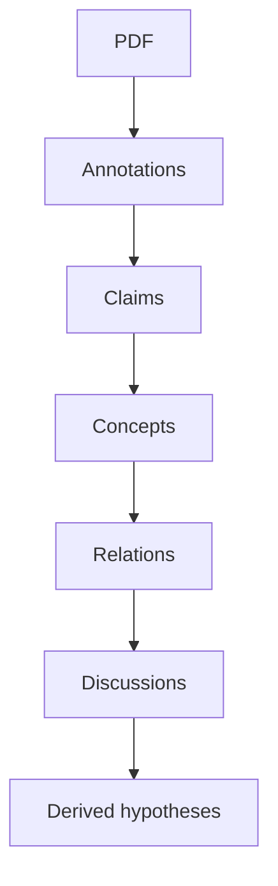
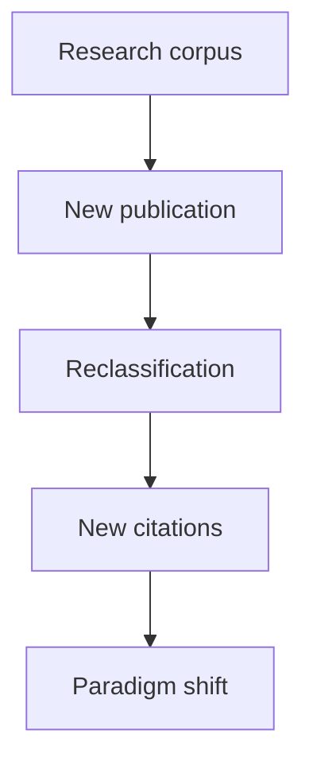
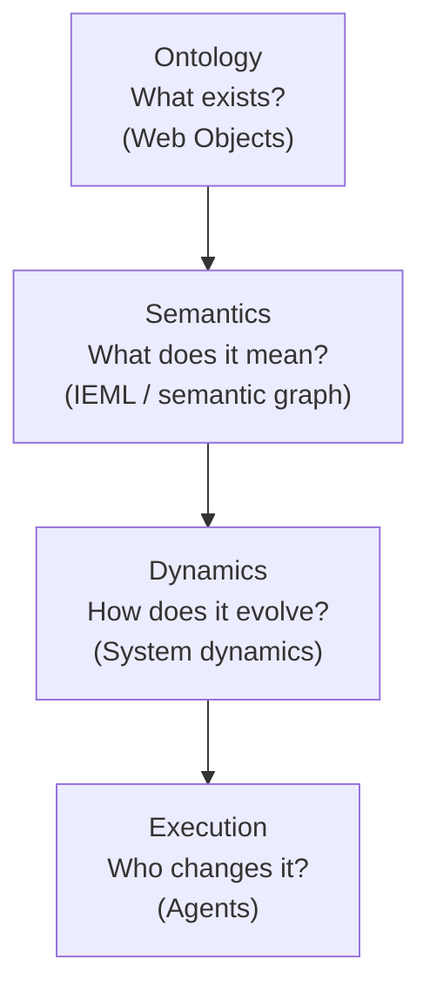

# Four Layers

## Ontology (what exists), Semantics (what does it mean), Dynamics (how does it evolve), Execution (change)

[https://chatgpt.com/share/6a70cfbf-87d0-83e9-af19-3657f2ce97c2](https://chatgpt.com/share/6a70cfbf-87d0-83e9-af19-3657f2ce97c2)

The interesting thing is that the four authors we've discussed are operating at four different levels of abstraction:

| Level | Author | Main concern |
| ----- | ----- | ----- |
| Philosophy of meaning | Alexandre Monnin | What is a digital object? How does meaning emerge on the Web? |
| Semantic infrastructure | Pierre Lévy | How can meaning become computable? |
| Dynamic systems | Donella Meadows | How do complex systems evolve? |
| Execution | Agent frameworks (Pi, Hermes, Agno, etc.) | How does computation act autonomously? |

## Monnin formalizes relationships rather than concepts

Lévy tries to formalize semantics.

Monnin is more interested in formalizing existence.

His thesis repeatedly returns to questions like

* What makes a Web object exist?
* What makes two objects "the same"?
* What survives edits?
* What is persistence?
* What is a document?
* What is a link?
* What is a version?

Those are ontological questions.

Instead of asking

> What does this concept mean?

he asks

> What kind of entity is this?

## This becomes extremely relevant for agent memory

Today's agents generally remember things as

fact

or

embedding

Monnin would probably argue that this is the wrong abstraction.

Instead an agent should manipulate Web objects.

For example

Each level becomes its own object.

That is much closer to the Web itself.

## His notion of identity is particularly valuable

One recurring idea in his thesis is that digital objects have identities that are not reducible to files.

For example

Wikipedia page

is not

HTML file

nor

URL

nor

text

It is something that persists through revisions.

Similarly,

Research Topic

is not

a PDF

It survives

* papers
* summaries
* conversations
* translations
* citations

This distinction is extremely important for long-lived agent memory.

## I think Monnin naturally suggests CRDT-like thinking

This is not something he explicitly develops, but it follows naturally.

Suppose multiple agents work simultaneously.

Agent A

extracts concepts

Agent B

summarizes

Agent C

finds contradictions

Agent D

creates taxonomy

Rather than overwriting memory, each produces transformations of the same evolving Web object.

That resembles

* event sourcing
* provenance graphs
* CRDTs
* version control

much more than today's RAG pipelines.

## Meadows supplies dynamics

Monnin is mostly static.

He describes what exists.

Meadows explains how those objects change.

For example

is a feedback system.

Now semantic objects become dynamic systems.

## Lévy supplies computable semantics

Monnin says

> Web objects possess identities and relations.

Lévy asks

> Can those relations themselves become computable?

That is almost exactly what IEML attempts.

Monnin provides ontology.

Lévy provides semantic algebra.

## LLMs change Monnin's assumptions

Monnin wrote in 2013.

Generative AI barely existed.

Consequently,

Web objects were mostly static.

Today they are increasingly generative.

A document can generate

* summaries
* critiques
* ontologies
* code
* hypotheses

Those outputs are themselves Web objects.

The graph becomes recursive.

## A useful formalism

If I were designing the architecture today, I would separate four layers.

That decomposition is remarkably clean.

## One addition I would make

Neither Monnin nor Lévy fully formalize time.

I think time is the missing dimension.

Instead of

Concept A

connected_to

Concept B

you would have

Concept A

became

related_to

Concept B

because

Paper X

on

2026-04-01

confidence

0.84

supported_by

7 sources

Now every semantic relation has

* provenance
* confidence
* temporal validity
* author
* evidence

The knowledge graph becomes a living history rather than a static ontology.

## What I think is emerging

Across the discussions we've had over the past weeks, I think an implicit architecture has been taking shape. It is not simply "an agent framework" but something closer to a computational epistemology—a system that represents, evolves, and acts upon knowledge.

| Layer | Function | Closest inspiration |
| ----- | ----- | ----- |
| Persistent digital entities | What exists? | Monnin |
| Semantic coordinate system | What does it mean? | Lévy |
| Dynamic feedback structures | How does it change? | Meadows |
| Probabilistic reasoning | What is likely? | LLMs |
| Autonomous action | What should be done? | Agent frameworks |
| Versioning, provenance, evidence | Why is it believed? | Web architecture, Git, event sourcing |

One notable omission remains: none of these frameworks provides a formal account of inquiry itself—how hypotheses are generated, tested, revised, and occasionally abandoned. That points toward another complementary tradition: Charles Sanders Peirce's pragmatism and semiotics, together with later work in belief revision, argumentation theory, and Bayesian epistemology. Those would naturally occupy a layer above semantics and below autonomous action, governing not just what the system knows, but how it changes what it knows in response to new evidence.

**Confidence level:** 0.95
