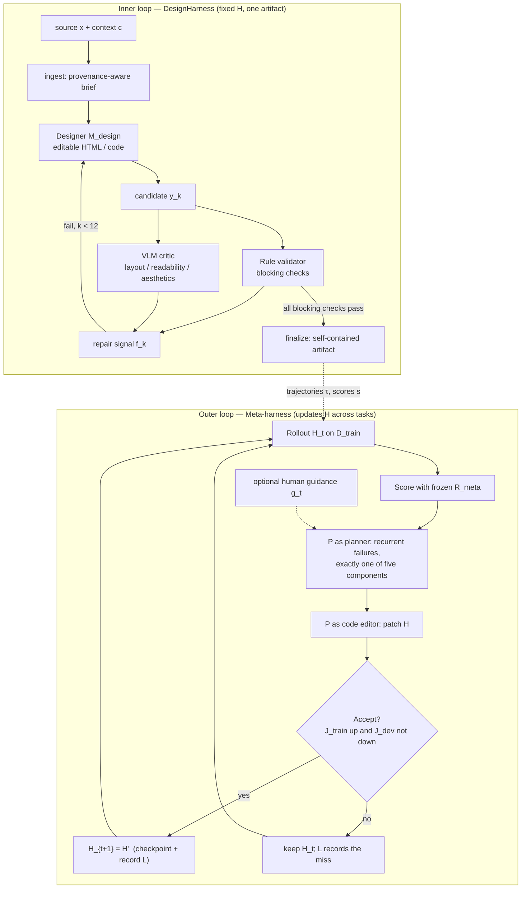
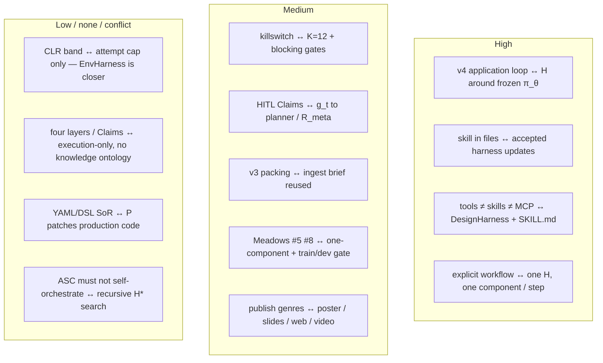
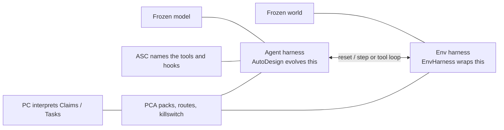
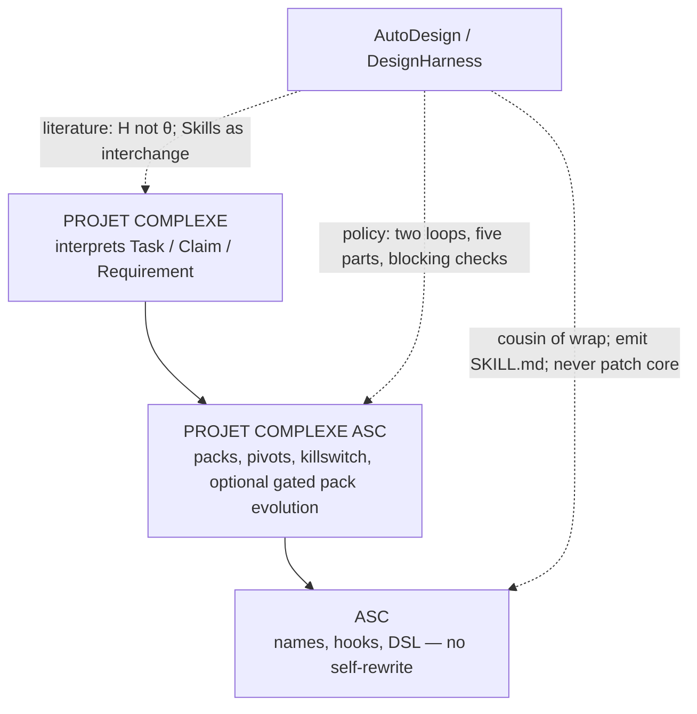

# Overlap with AutoDesign

## AutoDesign vs Projet Complexe (meta-harness optimization)

**Date:** 2026-08-24  
**Status:** architecture note / design instrument (not a spec, not an implementation plan)  
**Reads:** [Yaxin9Luo/AutoDesign](https://github.com/Yaxin9Luo/AutoDesign), [arXiv:2608.13560](https://arxiv.org/abs/2608.13560), [autodesign.designanything.ai](https://autodesign.designanything.ai/), ASC README, August 2026 ideas notes (Revival v2–v4, Reverse Prompting vs CLR, Meadows leverage, Four layers, Cognitive institutions), and the sibling note [Overlap with EnvHarness](Overlap%20with%20EnvHarness.md)

Paper dated 13 Aug 2026 (cs.CV / cs.AI / cs.CL). Code released 14 Aug 2026. Same week as EnvHarness (20 Aug 2026): two papers, two sides of the same “harness, not weights” claim. EnvHarness wraps a frozen *environment*. AutoDesign evolves the *agent* harness around a frozen *model*. Projet Complexe sits between them: named computational glue (ASC), packing and composition (Projet Complexe ASC), a living knowledge world (Projet Complexe).

---

## Verdict

Strong overlap on one axis, useful on a second, weak on the rest. AutoDesign is the closest published operationalization of Revival v4’s claim that **the product is the loop around a frozen model**, not the model. It shows that reusable skill can accumulate in software — prompts, tools, validators, orchestration — without touching weights. Projet Complexe wants that same accumulation for a local, multilingual second brain, with YAML + DSL as source of truth and a human as the only commit of Claims. Steal the two-loop picture, the five-component taxonomy, the one-component gated update, and the dual-critic split. Do not import their poster mill, their code-agent-rewrites-the-harness outer loop, or their VLM-as-judge as truth.

| Dimension | Strength | Overlap | AutoDesign | Projet Complexe |
| --- | --- | --- | --- | --- |
| Frozen model, evolve the surround | High | Strong overlap — one axis | DesignHarness around $\pi_\theta$ | `pre_llm` / `post_llm`, allowlisted entry points |
| Nested loops (artifact vs system) | High | Strong as a control picture | inner designer–critic; outer meta-harness | inner: pack / act / critique one Task; outer: evolve packs, skills, hooks — with HITL |
| Five-way harness cut | Med–high | Partial | Context, Tools, Runtime, Orchestration, Evaluation | v4 five layers + planes A–E; do not collapse |
| Dual critic (rules + perception) | Med | Partial | blocking checks + VLM critic | DSL `validate:` + HITL; not a vision judge as ontology |
| Product and ontology | Low | Weak on the rest | paper → poster / slides / web / video | ingest, Claims, Links, gaps, fr/en/pt, modest hardware |
| Self-rewriting production system | Conflict | Refuse if copied | coding agent patches harness source; train/dev gate | ASC core is not a Gödel machine; killswitch is System M, not an optimizer |

---

## What AutoDesign actually is

Human communication often means turning long, heterogeneous sources into a short, structured artifact (poster, slides, page, video). That is a long-horizon agentic job: extract evidence, plan, render, take critique, repair. Existing design systems already run generate–critique–revise, but they treat each piece of feedback as **transient**. Humans accumulate priors. Static harnesses do not.

AutoDesign’s move: **optimize the harness $H$, not the artifact $y$, and not the weights $\theta$.**

$$y \sim H(\pi_\theta, x, c)$$

$\pi_\theta$ stays frozen. $x$ is the multimodal source (a paper). $c$ is the design context (medium, constraints). $H$ is everything around the model: prompts, skills, tools, workspace, loop control, validators. The objective is expected artifact quality under a human-aligned evaluator $R_{\mathrm{meta}}$:

$$H^\star = \arg\max_H J(H),\qquad J(H)=\mathbb{E}[R_{\mathrm{meta}}(y,x,c)]$$

They instantiate this on **academic paper-to-poster**, then ship the learned system as **DesignHarness**. They also introduce **PosterBench** (100-paper Main Track, five disciplines; PosterBench-mini, 10 papers) with a seven-dimension rubric.

Reported numbers (treat as the paper’s claims; see caveats below):

| Claim | Figure |
| --- | --- |
| PosterBench Main Track (Claude Code + Claude 4.8) | 78.32, +7.45 vs Claude Design (70.87) |
| Seven model / coding-agent configs, harness on vs off | mean 54.99 → 67.39 (**+12.40 points**; the abstract’s “+12.4%” is a unit slip) |
| Per-config gain range | +5.01 (Claude 4.8) to +19.56 (DeepSeek V4 Pro) — weakest models gain most |
| One autonomous poster run | 253 tool calls, 11 editing turns, ~40 min, under $3 |
| Cheap configuration | LongCat 2.0 ≈ 55.13 at ~$0.27 / poster |
| System-blind human study (11 reviewers, 933 judgments) | Bradley–Terry 64.0% (95% interval 55.2–77.8%) |
| Evolution trace | 7 days, 224 subagents, ≥123 outer iterations, 54 accepted harness updates |

The repo ([Yaxin9Luo/AutoDesign](https://github.com/Yaxin9Luo/AutoDesign)) ships DesignHarness, PosterBench records, a local workbench, and **standalone Agent Skills** (Poster, PPT, Webpage, Video) installable in Codex, Claude Code, DeepSeek Harness, Pi, OpenCode — without their application server.

---

## Two nested loops

This is the diagram worth keeping. Tables cannot show the nesting.

**Inner loop** improves *this* poster. $H$ does not change. Designer and critic:

$$y_k = M_{\mathrm{design}}(y_{k-1}, f_{k-1}; x, c),\qquad f_k = M_{\mathrm{critic}}(y_k; x, c)$$

Artifact stays **editable HTML** (localized patches, not full regeneration). Blocking checks can stop the loop early. Budget $K=12$. Fallback if nothing passes.

**Outer loop** improves $H$ across tasks. Four stages: rollout, evaluation, update proposal, acceptance. Optimizer $P$ is a coding agent that first plans, then edits. Each iteration may touch **exactly one** of the five components (several files inside that component are allowed). Development scores are used **only** by the gate and are **hidden from $P$**, so $\mathcal{D}_{\mathrm{dev}}$ is an overfitting guard, not extra training signal. Record $\mathcal{L}$ stores harness checkpoint, traces, chosen component, plan, diff, accept/reject. No tree search: one active harness at a time.

Optional HITL: natural-language $g_t$ to the planner when the outer loop plateaus; or human correction of $R_{\mathrm{meta}}$ if a systematic bias shows up. Humans do not edit harness code directly. With no guidance, the outer loop runs autonomously.

That split — **repair the artifact vs repair the system that will produce the next artifact** — is the idea worth stealing as vocabulary. It is not a reason to let a coding agent rewrite ASC core.

---

## Five components of $H$

| AutoDesign component | What it holds | Projet Complexe / ASC analogue | Steal? |
| --- | --- | --- | --- |
| **Context and Memory** | source management, prompts, skills, reusable assets, persistent state | packing (`pre_llm`), locale-aware retrieve, procedure files / `SKILL.md`, notes — not “memory = vector DB” | Map. Keep v3: index is a projection. |
| **Tools and Specifications** | tools + editable artifact specs (layout, typography, provenance) | allowlisted ASC entry points; YAML `able` → JSON Schema projection; DSL addressing | Map. YAML remains SoR. |
| **Execution Runtime** | workspace for authoring, rendering, validating, exporting | `$PROJECT_DOCROOT`, Compose stack, Pi / Ollama as Technology — not a second coding TUI | Delegate runtime. Host Pi; do not become Pi. |
| **Orchestration** | routing, attempt budgets, loop control, candidate selection, fallback, finalization | PCA cascade / router (paper `2603.04445`), killswitch, HITL, attempt limits | Map as **policy**, not a new protocol. |
| **Evaluation and Feedback** | rule-based validation, model-based critique, localized repair | DSL `validate:`; Winteringham-style eval around traces and `publish`; HITL on Claims | Split: rules yes; VLM-as-truth no. |

Revival v4 already has a **different** five-layer cut (Model / Prompt assembly / Tool surface / Transport / Procedure pack) plus planes A–E (routing, index, language, knowledge/fusion, orientation). AutoDesign’s five are a *functional* cut of the production system. The v4 five are a *interface* cut of how a model gets tools. Complementary. Do not merge them into one table and call it ontology.

| v4 layer (how agents get tools) | AutoDesign component (what $H$ is made of) | Relation |
| --- | --- | --- |
| 1. Model | frozen $\pi_\theta$ (outside $H$) | Same freeze |
| 2. Prompt assembly | Context and Memory | Overlap |
| 3. Tool surface | Tools and Specifications | Overlap |
| 4. Transport (MCP, …) | mostly absent; Skills as files | v4 already: MCP is a plug |
| 5. Procedure pack | skills inside Context and Memory | They install `SKILL.md` in *other* harnesses — that is the v4 “emit, don’t become” policy in the wild |
| — | Execution Runtime | v4 delegates this |
| — | Orchestration | v4 plane A + E (router + System M) |
| — | Evaluation and Feedback | v4 `post_llm` + Winteringham |

---

## DesignHarness as a production pipeline

After the outer loop, the learned system is a four-stage pipeline. This is closer to Projet Complexe’s *ingest → pack → act → export* than to EnvHarness’s `reset`/`step` wrap.

| Stage | What it does | PC analogue | Risk if copied as identity |
| --- | --- | --- | --- |
| **Paper ingestion** | metadata, outline, claim-supporting passages, figures/tables **with source locations**; content brief + medium plan | `extract` as capability; provenance on Claims; locale metadata | Becoming a CAT/poster product; GROBID/Docling as identity (v3 already refused that) |
| **Generation and revision** | coding-agent Designer; HTML stays editable; render PNG/PPTX/MP4 for critique | `run-agent` hosted in Pi; `publish` drafts as files | Coding agent as second brain |
| **Validation** | deterministic **blocking** checks (unsafe assets, broken provenance, overflow, typography) + VLM on render | DSL tests; killswitch; HITL | VLM critic as knowledge commit |
| **Finalization** | inline assets, typesetting, self-contained deliverable; fallback if budget exhausted | `publish` with a contract (post, chapter, note) | Prompt pack as `publish` (v4 refuse) |

The blocking-check idea is the clean steal: **some failures must stop the loop**; others are non-blocking diagnostics (coverage, density, numeric consistency). That is already how ASC DSL `test-*` is meant to work: fail closed on contract, comment on taste.

---

## Concept map (notes → AutoDesign)

Same control problem as Revival v4 and the Flow note, different object being optimized, different ethics of “the system rewrites itself.”

| Idea in your notes | AutoDesign counterpart | Overlap |
| --- | --- | --- |
| v4: the product is the application loop around a frozen model (`pre_llm` / `post_llm`, allowlisted tools) | $H$ around frozen $\pi_\theta$; inner designer–critic is that loop made explicit | **Highest.** Cite this paper as the *agent-harness optimization* sibling of EnvHarness. |
| “Durable skill lives in files, not in chat logs” (v4 plane E; Dupoux/LeCun/Malik: do not fake System A with transcripts) | 54 accepted updates accumulate in the harness repo; $\mathcal{L}$ is the optimization memory | **High** as a claim. **Conflict** on *who* writes the files: they let $P$ patch production code; you want YAML/DSL authored or HITL-accepted. |
| Tools ≠ skills ≠ MCP | DesignHarness tools + standalone Agent Skills + no MCP-as-brain | **High.** They even ship Skills for Pi / Claude Code / Codex. That is the v4 “export `SKILL.md`, do not make ASC a skill runner.” |
| Explicit workflow default (Dibia); refuse swarms | named stages; one active $H$; one component per outer step | **High** as discipline. Credit assignment by construction. |
| Killswitch / System M (Dupoux et al. `2603.15381`; v2 mutual killswitch) | attempt budget $K=12$; blocking gates; optional $g_t$ | **Medium.** Their M is a *budget and a gate*. Yours is *task vs research vs stop*, and it can kill research when the Task says so. |
| HITL commit of Claims; never multi-agent consensus as truth (`2603.24402`) | human guidance to planner; human may revise $R_{\mathrm{meta}}$; $R_{\mathrm{meta}}$ otherwise frozen | **Medium.** Directional HITL on the *optimizer* is close. HITL on *knowledge* is not what they do. |
| v3 RAG as context regulation so a 7B stays in the Flow band | ingestion brief constructed once, reused across inner steps; packing is Context and Memory | **Medium.** Same intent (fit the window with a structured substrate). They pack a paper for a poster; you pack a corpus for a Claim. |
| Flow / CLR: keep complexity in a band | $K=12$, blocking vs non-blocking, fallback | **Medium–low.** They cap *horizon*. They do not measure a CLR band or scaffold vs harden the *task*. EnvHarness is closer on that axis. |
| Meadows #6 information flows; #5 rules; #8 balancing feedback | who sees traces ($P$ sees train, not dev); which edits are legal (one component); write-and-validate gate | **Medium–high** on #5 and #8 for the *harness*. Not for the knowledge graph. |
| Four layers (ontology / semantics / dynamics / execution) | almost entirely **execution**, with a thin dynamics loop (outer $H$ updates) | **Low** as ontology. No account of what a Claim is. |
| Three-project cut; genericity scale; killswitch as identity | one Python/TS workbench + Skills | **Low.** Different product. |
| Knowledge plane: Claims, Links, gaps, provenance, fr/en/pt | provenance *links back to the PDF* for poster fidelity — not a curated graph | **None** as ontology. Do not collapse “source location on a figure” with a Claim. |
| YAML entity/able + DSL as SoR; JSON Schema / MCP as projections | $P$ emits real patches to harness source; Skills are markdown+scripts | **Conflict if copied.** Same fight as EnvRigger’s Python subclasses. |
| ASC non-goal: “self-organizing all-orchestrating platform” | recursive meta-harness improvement is the headline | **Conflict.** Steal the *gated, one-component* recipe for PCA *packs*. Refuse it as ASC core behavior. |
| `publish` as versioned export (notes, posts, book chapters) with quality contracts (Yu & Yao) | paper → poster / slides / web / video as media | **Medium as an export family.** One `publish` Implementation among others — not the product. |

---

## AutoDesign, EnvHarness, Projet Complexe (three-way)

Do not treat the two August papers as competitors. They freeze different things.

| | EnvHarness ([2608.19880](https://arxiv.org/abs/2608.19880)) | AutoDesign ([2608.13560](https://arxiv.org/abs/2608.13560)) | Projet Complexe |
| --- | --- | --- | --- |
| Frozen core | environment + human verifier | model weights $\theta$ | CLIs / OS / named pivots (ASC); human goal / Claim commit (PC) |
| What gets rewritten | Stage / Contract / Chain wrappers | five components of $H$ | packing, allowlists, compositions, procedure files — **not** core names, **not** the user’s objective |
| Inner loop | policy rollout in wrapped env | designer–critic on one artifact | one Task: retrieve, act, critique, HITL |
| Outer loop | EnvRigger writes env wrappers from diagnosed policy flaws | $P$ writes harness patches from recurrent failures | *optional later:* evolve PCA packs/skills under a gate — never ASC core |
| Success metric | held-out benchmark SR / steps | PosterBench + blind preference | ingest, curate, export, research; same named actions for human and agent; fr/en/pt |
| SoR for the wrap | Python subclasses | harness source (Python/TS) + Skills | YAML + DSL; JSON Schema / MCP / `SKILL.md` as projections |
| Ethics of “make it fit” | hide the mug (legitimate on a benchmark) | change the *procedure*, keep the paper | never silently rewrite the user’s task or mint a Claim without HITL |

EnvHarness answers: *reshape what the agent sees and may do.* AutoDesign answers: *reshape the software that will produce the next artifact.* Projet Complexe needs both answers as **policy**, and neither as **product identity**.

---

## Steal

Cite AutoDesign as the agent-side of the harness idea Revival v4 already split from MCP / skills / tools, and as the counterpart to EnvHarness’s env-side.

Name **two loops** in PCA policy: (1) inner — pack, act, dual-check, stop; (2) outer — only if you later evolve packs/skills, and only behind HITL + a frozen eval.

Name **five $H$ parts** when talking about `run-agent`, without renaming ASC subjects after them. Map: packing → Context; allowlisted pivots → Tools; Pi/Ollama/Compose → Runtime (delegated); router + killswitch → Orchestration; DSL tests + HITL → Evaluation.

Steal **one-component, train-up / dev-not-down**. If PCA ever auto-edits a pack, that is the whole safety recipe. Credit assignment stays readable. $\mathcal{D}_{\mathrm{dev}}$ hidden from the proposer is the important detail.

Steal **blocking vs non-blocking** checks. Contracts fail closed. Taste does not.

Steal **Skills as interchange**. Emit `SKILL.md` for Pi/Claude; keep executables as ASC entry points. They already did the “works in the host you already have” version of v4 §3.3.

Steal **editable artifact + localized repair**. `publish` drafts should be files you patch, not a regenerated blob.

Steal **keep the final evaluator frozen and separate** from the optimizer’s $R_{\mathrm{meta}}$. That is the same discipline as EnvHarness keeping the human verifier frozen. Apply it to Claim quality vs packing heuristics.

Steal the **empirical hint** that harness gains are largest on weaker models. That supports modest-hardware routing (plane A): a local 7B plus a good pack can move more than a bigger model plus a stuffed window — which is already the README Flow tease.

## Refuse

Do not put a MetaHarnessOptimizer, EnvRigger-class designer, or GRPO in ASC core. Complex agent/NL work stays in dedicated instances (ASC README non-goals).

Do not let a coding agent patch `asc/` or rewrite pivots because “the outer loop accepted it.” Genericity scale and HITL exist so names do not drift under automated taste.

Do not make PosterBench, Claude Design, or “conference-poster quality” Projet Complexe’s success metric. Yours is ingest, curate, export, research, three languages, modest hardware, same named actions for human and agent.

Do not treat DesignHarness as the second brain, or the workbench UI as Projet Complexe. Wrap a harness; do not become a design studio.

Do not use a VLM critic as the commit of a Claim. Dual critic is fine when the blocking side is deterministic and the perceptual side is advisory. Knowledge fusion stays Koch-style uncertainty + HITL, not “the poster looked good.”

Do not start with slides/web/video “same harness, more media.” Even they call those pilots. `publish` genres are contracts (Yu & Yao), each with its own evaluator — which is also their own §6 warning.

Do not copy $R_{\mathrm{meta}}$ and PosterBench sharing the same seven-dimension vocabulary as a pattern for “research quality.” The paper asserts the functions are distinct; a referee would still demand a correlation check. For Claims, keep the human as the only SoR.

## Caveats on their numbers (so you do not over-cite)

These do not kill the *idea*. They bound how hard you lean on the *score*.

| Issue | Why it matters here |
| --- | --- |
| The paper never states that $\mathcal{D}_{\mathrm{train}}$ / $\mathcal{D}_{\mathrm{dev}}$ are disjoint from PosterBench Main Track / mini | 78.32 and +12.4 points are unbiased **only** under an unstated assumption. Cite the *recipe*, not the headline, until that split is public. |
| $R_{\mathrm{meta}}$ and PosterBench share seven dimension names and the same authors | Optimizing $H$ toward $R_{\mathrm{meta}}$ may secretly optimize toward PosterBench. Same trap as using RAGAS as both trainer and judge. |
| Abstract “+12.4%” vs body “+12.40 points” | Unit error; use points. |
| Human “conference-poster quality” | The study is pairwise preference among systems, not rating against real conference posters. Krippendorff $\alpha$ (nominal) is 0.101. BT interval (55.2–77.8%) overlaps Claude Code’s point estimate. |
| Main Track 78.32 has no uncertainty interval | N=100; still want a bootstrap before treating +7.45 as a wall. |

---

## Where the analogy breaks

AutoDesign is a **training-and-production curriculum for a design procedure**. It mutates the *factory* until posters score well, then runs that factory on a new paper. Projet Complexe is a **runtime cognitive institution**: a human-judged knowledge world plus a named computational vocabulary.

That changes the ethics of “the system improves itself.” In their setting, patching the poster validator after recurrent overflow is the point. In a second brain, an outer loop that rewrites `relate` or the Claim schema because a VLM preferred denser cards is a silent ontology change. Legal outer-loop objects on your side are **packs, skill files, packing heuristics, allowlists** — Meadows information flows and rules — not the primordial YAML, not the user’s Task, not a published Claim.

Four-layer note: AutoDesign lives in **execution**, with a thin **dynamics** loop (54 updates to $H$). Ingestion “claims” are passages extracted for a poster, not Claims in the knowledge plane. Cognitive institutions note: they improve the *procedure that produces artifacts*; Superpowers-like skills improve the *agent’s process pack*; Guardrails constrain I/O. AutoDesign is closest to the first, ships the second as `SKILL.md`, and uses blocking checks as a thin third. It is none of Projet Complexe’s knowledge institution, and complementary if kept in the export/worker slot.

Flow / CLR: they regulate **attempt count and blocking difficulty**, not the agent’s operating band. If a 7B is under-challenged on “rename this file,” AutoDesign will still run a twelve-step designer–critic unless Orchestration says otherwise. EnvHarness’s [0.4, 0.6] SR band is the closer measurement cousin of CLR. AutoDesign’s cousin is **horizon and contract**, not challenge calibration.

---

## Placement on the three-project cut

| Project | Relation to AutoDesign |
| --- | --- |
| **ASC** | Already the more general wrap-don’t-rebuild layer (hooks, pivots, specificity). Document “harness = system around a frozen model” as a cousin of “thin wrapper over a frozen implementation.” Do **not** add a self-rewriting outer loop or a gym/design ABC. Optional: generate `SKILL.md` / JSON Schema from YAML `able` so other hosts can load the same procedures. |
| **Projet Complexe ASC** | If anything is stolen, it is **policy**: `pre_llm` packing as Context; allowlisted pivots as Tools; Pi/Ollama as Runtime; cascade + killswitch + $K$ as Orchestration; DSL blocking checks + HITL as Evaluation. An optional later outer loop may evolve **packs and skill files** with one-component diffs and a train/dev-style gate — Implementation, not protocol. |
| **Projet Complexe** | The Flow UI / second brain remains the interpreter. AutoDesign does not help Claims, Links, gaps, or fr/en/pt as first-class. It is a literature ally for the README harness tease, and a possible **worker** behind `publish` (poster/slides as genres), not a UI or store. |

---

## Practical takeaway

Read AutoDesign next to EnvHarness, not instead of it.

1. **EnvHarness** — freeze the world, wrap `reset`/`step`, keep the verifier, regulate difficulty.  
2. **AutoDesign** — freeze the model, evolve $H$, keep a frozen *eval* protocol, accumulate procedure in files.  
3. **Projet Complexe** — freeze the user’s objective and the ASC names; regulate packing and tool surface; accumulate skills as files; only a human commits Claims.

The overlapping sentence all three can share:

> Capability that survives a model swap lives in the named surround — not in weights, not in a chat log.

Your surround is ASC + PCA packs. Theirs is DesignHarness. EnvHarness’s surround is the env wrap. Copy the sentence. Copy the gates. Do not copy the factory.

---

**Sources:** AutoDesign paper abstract + §§1–8, Algorithm 1, Tables 1–4 (Stage/Contract analogue: five components, inner/outer loops, DesignHarness, PosterBench, ablations, human study, related work on Meta-Harness / STOP / ADAS / GEPA / Robeyns self-improving coding agent); repo README (Skills, hosts, paper→four artifacts); ASC README (wrap, Flow tease, agent extension, non-goals); Revival v2–v4; Reverse Prompting vs CLR; Meadows leverage; Four layers; Cognitive institutions; Overlap with EnvHarness.

- [arXiv:2608.13560](https://arxiv.org/abs/2608.13560)
- [github.com/Yaxin9Luo/AutoDesign](https://github.com/Yaxin9Luo/AutoDesign)
- [autodesign.designanything.ai](https://autodesign.designanything.ai/)
- [designanything.ai](https://designanything.ai/) (demo)
- Sibling: [Overlap with EnvHarness](Overlap%20with%20EnvHarness.md)
- [projet-complexe](https://github.com/Paulmicha/projet-complexe)
- [projet-complexe-asc](https://github.com/Paulmicha/projet-complexe-asc)
