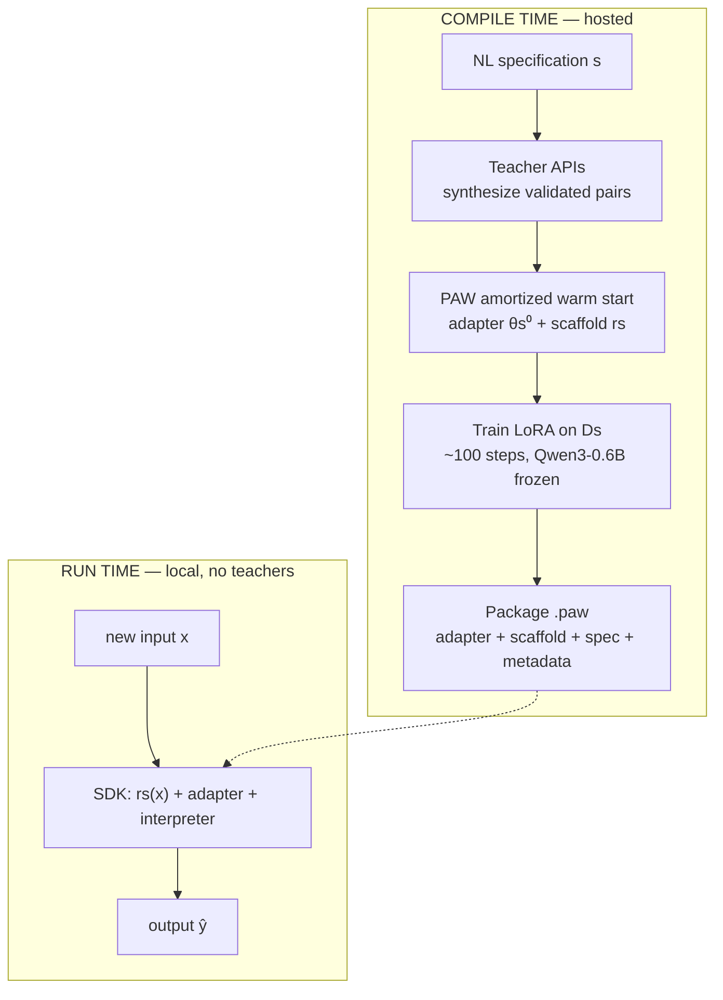
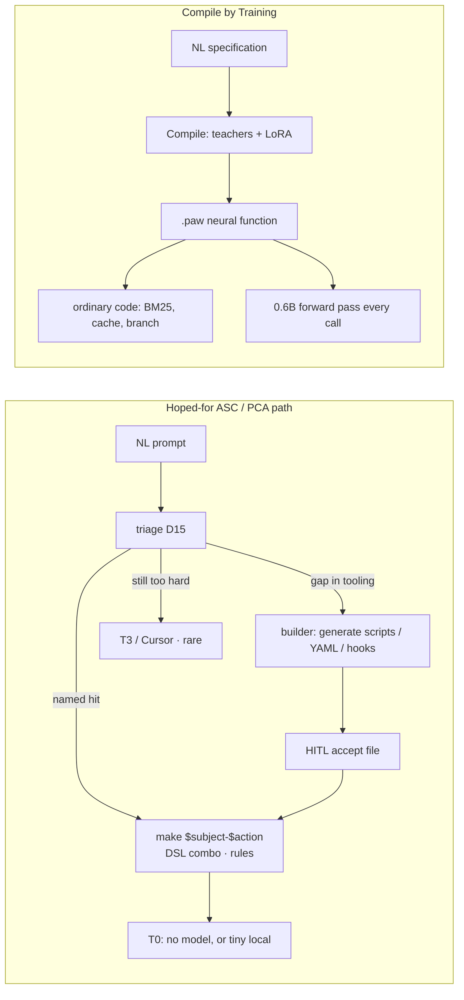
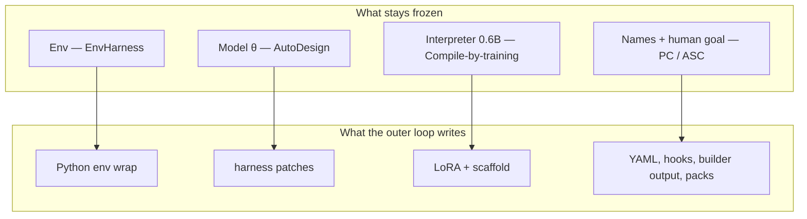
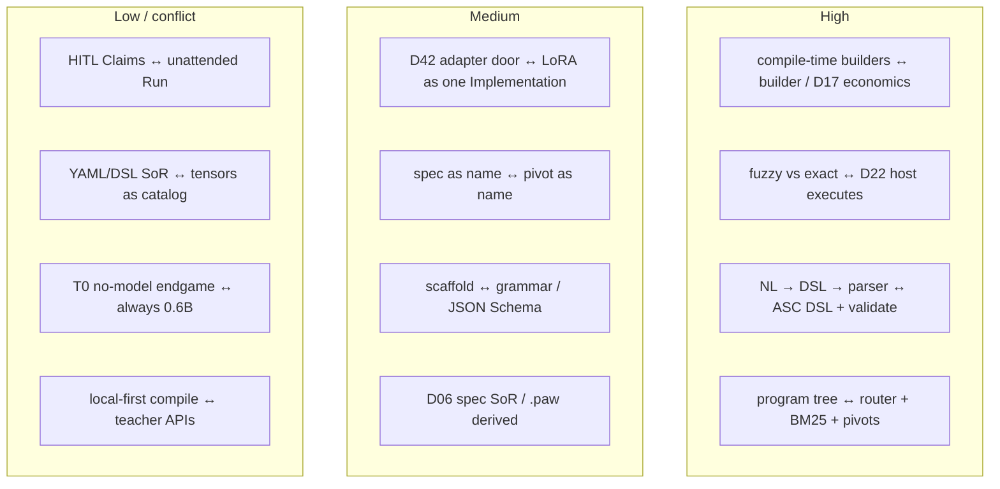
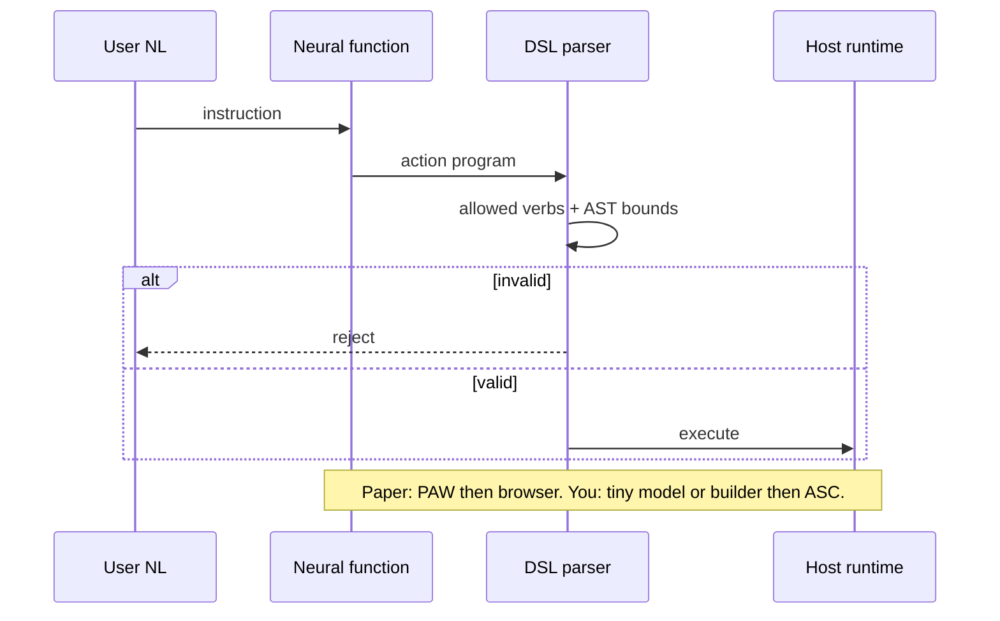
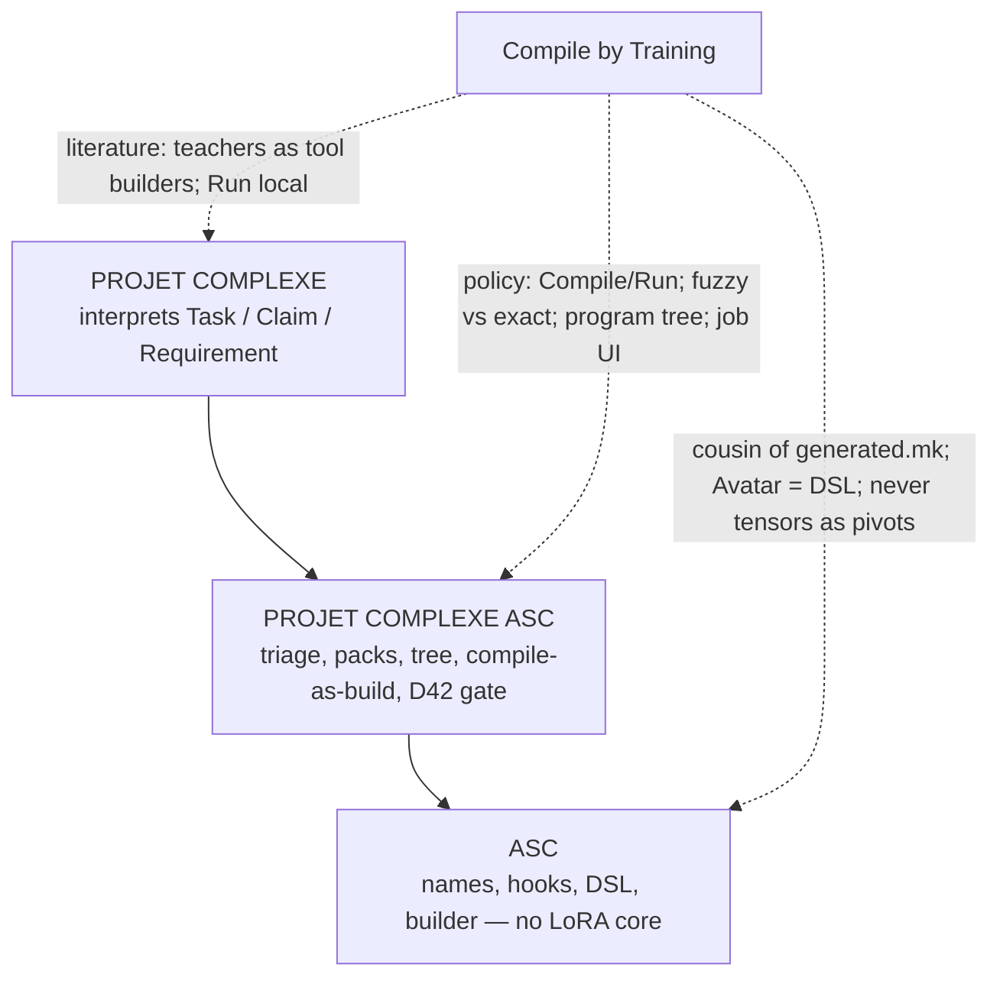
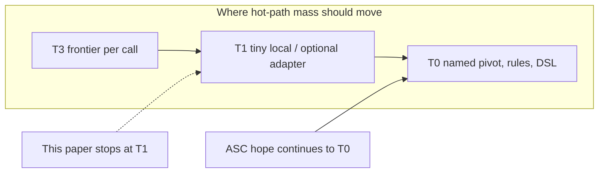

# Overlap with Compile by Training

## Compile by Training vs ASC / Projet Complexe (NL → reusable local functions)

**Date:** 2026-09-08  
**Status:** architecture note / design instrument (not a spec, not an implementation plan)  
**Reads:** [arXiv:2609.04199v1](https://arxiv.org/abs/2609.04199) (Deng, Nie, Shieber; 3 Sep 2026), sibling [Program-as-Weights](https://arxiv.org/abs/2607.02512) (Zhang et al., 2026), [programasweights.com](https://programasweights.com/playground?compiler=paw-ft-bs48), [paw-helper](https://github.com/programasweights/paw-helper), [claudish](https://github.com/programasweights/claudish); ASC README (builder, DSL, rules, workflow, agent, non-goals); Revival v5; sibling overlap notes [EnvHarness](Overlap%20with%20EnvHarness.md) and [AutoDesign](Overlap%20with%20AutoDesign%20-%20Meta%20Harness%20Optimization%20for%20Long-Horizon%20Agentic%20Design.md); folder 1 review (*agentic-ai, rag, retrieval, packing, workflow, anonymization*) especially file 00 register D14–D17, D22–D24, D42 and file 05 §§5, 25; folder 2 (*data stores…*) D06 files-as-SoR; Four layers note; Reverse Prompting vs CLR.

Paper dated 3 Sep 2026 (cs.CL). Same family as the two August “harness, not weights” papers, but it freezes a *third* object: a compact interpreter. EnvHarness wraps a frozen *environment*. AutoDesign evolves the *agent* harness around a frozen *model*. Compile by Training spends large models once, at *compile time*, to mint a reusable neural function that then runs locally without the teachers.

This note exists because that compile/run split is the closest published statement of a hope already in the ASC README and the September brief: **progressively reduce the need to call LLMs**, by growing named tooling (builder, DSL, rules), mapping natural language onto an expanding set of entry points and combinations, and reserving bigger models for rare, genuinely complex cases.

---

## Verdict

Strong overlap on the **amortization claim**, useful on **composition and NL→DSL**, conflict on the **compilation target**. Compile by Training is the closest published operationalization of “pay a teacher once, then run cheap and local forever.” Projet Complexe wants the same *economics* (runtime mass moving off frontier calls) with a different *artifact* (named ASC entry points, YAML, hooks, filename-safe DSL — and only later, if ever, a D42 adapter). Steal the compile/run interface, the fuzzy-vs-exact division of labor, the program-tree composition, and their own limitation sentence about deterministic control paths. Do not import hosted teacher APIs as the default compiler, LoRA as the identity of an entry point, or LEM/GPT-as-judge as knowledge quality.

| Dimension | Strength | Overlap | Compile by Training | Projet Complexe / ASC |
| --- | --- | --- | --- | --- |
| LLMs as compile-time tool builders, not runtime deps | High | **Strong** — the sentence you hoped for | teachers synthesize; GPU trains; run has no teachers | builder / `pre_llm` / D42: generate files (and, parked, adapters); runtime prefers T0 then tiny local |
| Recurring fuzzy work should not call a frontier model per input | High | **Strong** | email triage, extract-id, route, style transfer | D15 triage + D17 cascade; T3 only when \(\hat p \approx 1\) |
| Store, version, compose like software | High | **Strong as a claim** | `.paw` + SDK `paw.function(id)` | git on YAML/hooks/scripts; make pivots; entities |
| NL mapped onto a growing catalog of small functions | High | **Partial** | 30 pinned programs, 28 live neural nodes; BM25 + branch control in ordinary code | expanding `$subject/$action` + DSL combinations + `rules` / `workflow` |
| NL → structured executable, then deterministic validate | Med–high | **High on Avatar; conflict on medium** | finetuned PAW → action DSL → browser parser | ASC DSL as argv/validation; builder emits Bash/YAML; model never owns the machine |
| Compilation target | Conflict | **Opposite medium, same verb** | LoRA + scaffold for frozen Qwen3-0.6B | builder templates, hooks, pivots; D14 default = files not weights |
| Fewer human validations | Med | **Same wish, different gate** | spec once, then unattended `Run` | HITL on Claims and harness patches (D28); fewer *calls*, not fewer *commits of meaning* |
| Product and ontology | Low | **Weak** | playground, website helper, 3D avatar, Claudish | ingest, Claims, Links, gaps, fr/en/pt, modest hardware |
| Compile-time attachment | Conflict if copied | Hosted GPT teachers + GPU workers | spec leaves the house | D29 local-first; Five Safes on any hop; closable engines |

The overlapping sentence all four siblings can share (EnvHarness, AutoDesign, this paper, you):

> Capability that survives a model swap lives in a named surround — not in a chat log.

Their surround, after compile, is a LoRA sitting on a frozen 0.6B. Yours is ASC names + PCA packs. Copy the sentence. Copy the *build step*. Do not copy the weights as the catalog.

---

## What Compile by Training actually is

Many recurring text functions are easy to *describe* and painful to *encode as rules*, yet too narrow and frequent to justify a large remote call on every input. Email triage (“Signature needed by EOD” → `immediate`; newsletter → `wait`) is the running example.

They propose **compile by training**: a natural-language specification \(s\) becomes a reusable neural program \(p_s\).

\[
p_s = \mathrm{Compile}(s),\qquad \hat y = \mathrm{Run}(p_s, x)
\]

A shared frozen language model is the **interpreter**. Each compiled program supplies a **LoRA adapter** \(\theta_s\) and a **run-time scaffold** \(r_s\) (a compiler-generated prompt template that encodes the spec plus few-shot-ish structure, with a placeholder for \(x\)).

Two stages inside `Compile`:

1. **Teacher synthesis.** One or more teacher models generate a task-specific dataset \(D_s = \{(x_i, y_i)\}_{i=1}^n \sim T(s)\). Public recipe: GPT-5.4-mini and GPT-5.5 in a 2:1 mix; 2400 unique pairs expanded to 6400 training examples; strict JSON `{examples: [{input, output}]}`; malformed batches rejected.
2. **Specialization.** An amortized Program-as-Weights (PAW) compiler ([arXiv:2607.02512](https://arxiv.org/abs/2607.02512)) predicts an initial adapter and scaffold in seconds. Gradient descent then refines \(\theta_s\) for ~100 steps on \(D_s\). Public interpreter: quantized **Qwen3-0.6B**; LoRA rank 64, alpha 16.

The `.paw` artifact packages specification, adapter, scaffold, and interpreter metadata. It can be stored, versioned, cached, and reused. **Runtime SDK execution does not send future inputs to PAW or the teachers.** Compilation itself is a hosted job: the specification *does* go to the PAW service and teacher APIs.

They frame this as a software build:

> adaptation becomes a software build step, and large language models act as tool builders rather than run-time dependencies.

That is the line that rhymes with ASC’s builder extension and with Revival v5’s “harness, not weights” — with the caveat that *their* build emits weights, and *yours* is supposed to emit files.

Reported numbers (treat as the paper’s claims; see caveats):

| Claim | Figure |
| --- | --- |
| FuzzyBench-Hard mean LEM, amortized PAW | 0.224 |
| Same, compile by training | **0.836** (+0.612 absolute) |
| Compile latency (cold, May 2026) | 50.9 s B300 · 68.2 s H200 · 99.2 s RTX |
| Fast PAW compile | 3.5 s |
| Teacher mix (dev sweep) | mini-only 0.746 → 2:1 mini/GPT-5.5 **0.851** |
| Data scaling (unique pairs) | 1440 → 0.821; 2400/3600 → 0.836; 7200 → 0.866 |
| LEM judge (GPT-5.5 vs 128 author labels) | acc 0.977, \(\kappa = 0.946\) |
| Avatar Director, 44 hand-authored instructions | 43 structurally expected |
| Claudish web demo, 22 Aug – 2 Sep 2026 | 100,747 successful translations |

FuzzyBench-Hard is the subset of FuzzyBench on which the *fast* PAW compiler produced **no exact matches**. LEM still credits the fast compiler with 0.224 because some predictions are semantically right despite string mismatch. The 0.836 is therefore “hard cases the one-shot compiler failed exactly,” not “all fuzzy functions.”

Related work they name: Self-Instruct / Alpaca-style synthetic supervision, knowledge distillation, LoRA / adapters / prefix-tuning / QLoRA / AdaLoRA, **Prompt2Model** (Viswanathan et al., 2023 — spec → finetune pipeline), LoRA Land (many task adapters on a shared base). Their increment on Prompt2Model is the PAW program format, the amortized warm start, the minute-scale hosted service, and composition demos.

---

## The hope this paper is being read against

Stated in this session, and already implied by the ASC README (builder, DSL, rules, workflow) plus folder 1’s router:

1. **Progressively reduce LLM use** by growing *tooling*, not by growing prompts.
2. **Code generators** (ASC `extensions/builder`) fill gaps in per-project entry points until more workflows are named, tested, and allowlisted.
3. **Fewer human validations** as those workflows harden — not zero HITL on meaning, but less per-call babysitting.
4. **Triage / map** natural-language prompts onto an ever-expanding set of more-or-less generic entry points *and combinations* (DSL + `rules`).
5. **Reserve bigger models** for complex, increasingly rare cases.

Put next to `Compile(s)` / `Run(p_s, x)`, the pipelines look like twins until the artifact.

Same control idea: **do not pay a frontier model on the hot path of a recurring function.** Different answer to “what did we just build?”

| After the build, what exists? | Paper | Hoped-for ASC |
| --- | --- | --- |
| Inspectable source | NL spec + synthetic pairs + LoRA tensors | Bash/YAML/hooks the human can read and diff |
| Runtime engine | Qwen3-0.6B + adapter | often *nothing neural* (T0), else allowlisted pivot |
| How combinations happen | Python/TS tree + BM25 + compiled classifiers | DSL chaining/piping/conditionals; `rules` ECA; `workflow` |
| What “fewer validations” means | trust `Run` after one compile | trust *tests* and contracts; HITL still commits Claims |
| Failure mode they themselves name | teacher errors baked into \(\theta_s\) | silent wrong CLI (autoresearch class C) — already your eval target |

The paper’s own limitation is the steal that protects the hope:

> Applications that require guaranteed correctness should validate outputs or retain deterministic control paths.

That is already ASC doctrine: host executes; DSL `test-*` fails closed; `rules` / hooks are the deterministic path; the model proposes.

---

## Four compilers, four frozen cores

Do not treat August and September as competitors. They freeze different things. Projet Complexe still sits between them: named computational glue (ASC), packing and composition (PCA), a living knowledge world (PC).

| | EnvHarness ([2608.19880](https://arxiv.org/abs/2608.19880)) | AutoDesign ([2608.13560](https://arxiv.org/abs/2608.13560)) | **Compile by Training ([2609.04199](https://arxiv.org/abs/2609.04199))** | Projet Complexe |
| --- | --- | --- | --- | --- |
| Frozen core | environment + human verifier | model weights \(\theta\) | compact interpreter + the *spec* (once compiled) | CLIs / OS / named pivots (ASC); human goal / Claim commit (PC) |
| What gets written | Stage / Contract / Chain wrappers | five components of \(H\) | LoRA + scaffold per function | packing, allowlists, compositions, **generated scripts** — not core names, not the user’s objective |
| When the big model runs | EnvRigger diagnoses and writes Python | outer \(P\) patches harness source | **compile time only** (teachers) | overflow rung of the cascade; builder as a *file* generator under HITL |
| Runtime unit | policy step in a gym | designer–critic on one artifact | `Run(p_s, x)` on 0.6B | named pivot; T0 if possible |
| Success metric | held-out SR / steps | PosterBench + preference | FuzzyBench-Hard LEM; demo latency; 43/44 DSL | ingest, curate, export, research; same names for human and agent; fr/en/pt |
| SoR for the wrap | Python subclasses | harness source + `SKILL.md` | `.paw` + NL spec | YAML + DSL; JSON Schema / MCP / `SKILL.md` as projections |
| Ethics of “make it fit” | hide the mug (ok on a benchmark) | change the *procedure*, keep the paper | bake teacher taste into an adapter | never silently rewrite the Task or mint a Claim without HITL |

EnvHarness answers: *reshape what the agent sees and may do.*  
AutoDesign answers: *reshape the software that will produce the next artifact.*  
Compile by Training answers: *reshape a recurring text function into a local callable, and stop calling the teacher.*  
Projet Complexe needs the third answer as **policy for the hot path**, and must not take the LoRA as **catalog identity**.

A useful extra cut: **compile-time LLM vs runtime LLM.** AutoDesign and EnvRigger still spend large models *while the system is in production improvement*. Compile by Training spends them *before* the function is on the hot path. ASC’s builder, if it ever calls a model to emit a script, is in this third camp — a build job, not a `pre_llm` on every Task. That is why the overlap with *your* hope is tighter here than with the August papers, even though the medium (weights vs files) fights D14.

---

## Concept map (notes → this paper)

| Idea in your notes | Compile by Training counterpart | Overlap |
| --- | --- | --- |
| “Let’s make words matter”; pivots persist when implementations swap | spec \(s\) is the name; `.paw` is the implementation; interpreter can in principle swap if metadata says so | **High as a pattern.** Their runtime still *is* a model; yours often must not be. |
| ASC builder: generate simple ASC code from folder/string templates | teachers generate \((x,y)\); training specializes an adapter; amortized PAW is a warm-start template | **High as a verb (compile). Conflict as a noun (code vs LoRA).** |
| DSL: filename-safe argv, chaining, validate, YAML `validate:` | Avatar Director: NL → action DSL → deterministic parser + AST bounds | **Highest concrete overlap.** They already split neural (fuzzy) from parser (exact). |
| `rules` (ECA) + `workflow` (process packs) | paw-helper: compiled classifiers/answerers *plus* ordinary branch control, BM25, caches | **High as composition.** Their tree is PCA’s router drawn as neural nodes; yours wants named pivots at those nodes. |
| D15 triage before packing; Gazit cheap front door | compiled routing/classify functions in the helper tree; email-triage example | **High.** Difference: they *train* the front door; you start with rules + TF-IDF (folder 1 file 05 §25 Option A before any LoRA). |
| D17 cascade: T0 → T1 → T2 → T3; bigger models rare | compile once with GPT-5.x, run 0.6B forever; exact ops never go to the model | **High economically.** Your T0 (no model) is *stricter* than their always-on 0.6B. |
| D14 harness not weights; D42 parked `trained-adapter` | the whole paper *is* D42 Option B, productized, without the plateau gate | **Conflict if copied as default. Partial if read as the protocol’s distant cousin.** Folder 1 already allowed a triage *classifier* (not a generative adapter) after a measured plateau. |
| Lambert: IFT buys format; harness already buys format via grammar + `able` | scaffold \(r_s\) is IFT-by-compile; LoRA is extra | **Medium.** Their scaffold is your JSON Schema / grammar. Their LoRA is what Lambert said you often do not need. |
| D22 host executes; model proposes | “compiled functions make fuzzy decisions; ordinary code handles exact operations” (paw-helper) | **Highest doctrinal overlap.** Quote this in PCA policy. |
| D24 DSL compiles *to* JSON Schema; do not teach frontier models a private DSL | Avatar DSL is executed by *browser code*, not by the frontier teacher at run time | **High.** Same rule: private DSL is for the host. Their compile-time teachers *do* see the spec, not the DSL grammar as a chat API. |
| D28 HITL commit of Claims | human writes spec; no per-call HITL; no knowledge ontology | **Low / mismatch.** Their “fewer validations” is not your institution. |
| D06 files as SoR; `.paw` as derived | spec + recipe + teacher cache could be SoR; artifact is derived (Kleppmann) | **Medium if you steal the split.** Conflict if `.paw` becomes the only store. Teacher cache is a derived store with a cloud provenance problem. |
| D29 local-first; closable; redaction before hop | runtime local; **compile-time spec sent to teachers** | **Split.** Steal runtime locality. Refuse silent compile-time hops. Five Safes applies to \(s\), not only to \(x\). |
| CLR / Flow: keep complexity in a band | 0.6B + tight spec is a *capacity* choice; they do not measure a band | **Low–medium.** EnvHarness still closer on CLR. This paper is closer on *cost of capacity on the hot path*. |
| Prompt engineering as challenge regulation | spec engineering as compile input; scaffold structures the 0.6B’s job | **Medium.** Tight spec = lower branching factor for the interpreter. |
| Four layers (ontology / semantics / dynamics / execution) | almost entirely **execution**; compile job is a thin **dynamics** loop | **Low as ontology.** No Claim, no Link, no Gap. |
| Modest hardware (1050 4 GB; dedi is not an inference box) | run: 0.6B is laptop-plausible; compile: B300/H200/RTX + GPT-5.x | **Split.** Runtime fits the garage. Compile as they ship it does not — unless you drop teachers and use local synthesis, which they did not evaluate as primary. |
| ASC non-goal: complex NL/agent work in dedicated instances; no all-orchestrating platform | public playground + multi-site helper + avatar + translator as *apps* | **Low.** Different product. Do not become programasweights.com. |
| Agent extension: wrap/chain LLM prompts with pre/post hooks | compile *removes* the wrap from the hot path | **Complementary.** Hooks stay for packing, redaction, logging, killswitch. Compiled functions are one Implementation behind a pivot, not a replacement for hooks. |
| Autoresearch: agent-drivable CLI; class-C silent wrong | LEM 0.836 still means ~1/6 semantic misses; no CLI eval | **Warning.** A neural function with exit-0 wrong output is class C. Deterministic pivots remain the thing you can score for drivability. |

---

## Applications, mapped (what their demos actually argue)

### paw-helper — a program tree, not a chat

One backend, four sites, **30 compiled programs** (28 live). A page-aware question is routed through finetuned classifiers, answerers, selectors, validators. Exact work stays in ordinary code: BM25 over Piazza, caching, branch control, “open this link.” Parallel: course answerer + Piazza search → selector merges.

This is the picture worth keeping. It is *not* “one agent with 30 tools.” It is **many tiny compiled functions + deterministic glue**. That is closer to ASC (folders of `$action` scripts) than to a ReAct loop.

| Helper node | PCA / ASC analogue | Steal? |
| --- | --- | --- |
| Route site / topic | triage labels + router policy | Yes, as T0/T1 classifiers — rules first |
| Classify link / answer | typed intent | Yes |
| Course answerer + validator | `research` draft + checker | Validator yes; answerer is still generative — keep budget and killswitch |
| BM25 Piazza | Meilisearch / FTS (folder 2 file 03) | Yes — they already refused embeddings on this path |
| Selector / merge | packing policy, not a second model if a rule suffices | Prefer rules; neural selector only if eval says so |
| “I don’t know” | KnowledgeGap | Yes — they have a reject path; you already named the object |

Do not steal “28 LoRAs” as the implementation of the tree. Steal the **tree**.

### Avatar Director — NL to DSL to host

A finetuned PAW maps “jump twice, then dance” to a small action program (sequences, durations, repetition, parallel motions). **The browser validates and executes.** 43/44 structural hits on a hand set.

This is the cleanest diagram of what ASC already decided in v4/v5: the model (here: 0.6B+LoRA) may emit a **constrained program**; the host parses, bounds, runs. ASC DSL is the general case of that action DSL (entry points, `p1`, chaining, `test-*`). The paper accidentally argues for completing the builder and the DSL, not for replacing them with adapters.

### Claudish translator — two specs, two adapters, shared interpreter

One NL spec per direction; two LoRAs; 0.6B interpreter; 100k+ public calls. Amusing, and a warning: **style transfer is exactly the Lambert cell your harness already buys with Terms / genre / preference block** (folder 1 file 05 §27). A Claudish adapter is a product demo, not a reason to train household voice into weights.

### Email triage / arXiv-id extract — the “too fuzzy for rules?” test

The paper’s premise is that these are tedious as rules. Folder 1 already disagrees for a large subclass: classify and extract-id are **T0 / grammar / regex / MiniLM** until a golden set shows a plateau (D42). “Signature needed by EOD” is a *classification* problem. Lambert: a classifier is not post-training of a generative model. **Do not let the email-triage example license a LoRA for every label.**

Where the premise *does* hold: genuinely fuzzy, high-frequency, hard-to-enumerate mappings (messy log lines → a small enum; multilingual paraphrase → a locale tag when rules fail). Even then the D42 protocol applies: baseline, eval, version, closing drill.

---

## Register crosswalk (folder 1 D-IDs)

| ID | Decision | This paper | Verdict |
| --- | --- | --- | --- |
| D01 | Three scopes; coupling is the product | One SDK + hosted compiler | **Silent** on PC meaning; **conflict** if ASC becomes the PAW client |
| D06 | Files SoR; derived indexes rebuildable | `.paw` is a derived binary; spec is the plausible SoR | **Steal the split**; keep spec + recipe + eval in git; adapters deletable |
| D14 | Harness, not weights; no FT in stage 1 | Compilation *is* fine-tuning | **Contradicts the stage-1 default**; **fits D14 as amended** only behind D42 gates |
| D15 | Triage before packing | Compiled classifiers in the tree | **Confirmed as a station**; **refuse** starting with generative LoRA |
| D16 | Packing is code | Scaffold \(r_s\) is a frozen pack per function | **Partial** — a per-function pack, not a corpus packer |
| D17 | Cascade tiny → LAN → remote | Teachers at compile; 0.6B at run | **Confirmed economically**; compile-time T3 must still be quota + redaction |
| D22 | Host executes | Explicit in §6.1 | **Confirmed** — cite |
| D24 | DSL is addressing; compile to schema | Avatar DSL executed by host | **Confirmed**; do not invert |
| D28 | HITL for knowledge and harness patches | Spec author is HITL-once | **Not a substitute** for Claim accept |
| D29 | Local-first; closable | Run local; compile hosted | **Split** — name compile as a Technology with `how_to_turn_off` |
| D33 | Traces first-class | Job record + progress UI | **Medium** — steal job-as-build; keep pivot/Task ids |
| D34 | Redirection drills | Shared interpreter; delete one `.paw` | **Yes if** no other component depends on that adapter (their packaging helps) |
| D35 | Refuse-list | Playground-as-identity, judge-as-truth | **Refuse** PAW cloud as control plane; **refuse** LEM as Claim metric |
| D41 | Eval plane; judge ≠ generator | LEM is GPT-5.5 judging the 0.6B | **Conflict** if used as SoT; **ok** as a *dev* metric with a frozen exact set |
| D42 | `trained-adapter` kind; plateau first | Productized LoRA-per-spec without plateau | **The paper is the temptation D42 was written to slow down** |

Folder 2: a `.paw` file is not a note, not an extract, not a Claim. If an adapter is ever trained, it is a **Technology artifact** with `trained_on.hash`, sitting beside GGUF files, rebuildable from spec + seed + recipe *in principle*. Teacher-synthetic \(D_s\) is not a fonds in Servais’s sense unless you keep the pairs, the teacher ids, and the spec version. Without that, you cannot answer “why does this function say WAIT?” — Monnin identity / Edwards data friction.

---

## Steal

Cite Compile by Training as the **compile-time sibling** of EnvHarness (env wrap) and AutoDesign (harness evolution): freeze a small interpreter, spend teachers on a build job, run local.

Steal the interface as vocabulary for PCA policy, even if the Implementation is a Bash script:

\[
p = \mathrm{Compile}(\text{spec or template}),\qquad y = \mathrm{Run}(p, x)
\]

`Compile` in ASC is the **builder** (and, later, D42). `Run` is `make $subject-$action`. The builder’s job is to make `Run` not need a model.

Steal **fuzzy vs exact** as an explicit cut on every pivot: neural/LLM only where rules fail; retrieval, cache, branch, schema, allowlist, killswitch stay code. They drew it; v5 already had it; now it has a citation.

Steal **NL → constrained program → host parser** from Avatar Director as the picture of DSL + `test-*`. Complete that before training anything.

Steal **program tree of many small functions** from paw-helper as the shape of “ever-expanding entry points,” with BM25/lexical on the exact side. Map nodes to pivots, not to LoRAs.

Steal **compilation as a background job** (queue, progress, persist across navigation). Builder and any future adapter training should look like `make` / a thread entity, not a blocking chat turn. ASC already has threads, logs, instance lifecycle.

Steal **warm start then specialize**: amortized PAW ≈ template in `extensions/builder`; extra compute ≈ filling the template and running tests. You do not need their hypernetwork to take the *shape*.

Steal their **limitation** as a hard rule: synthetic supervision inherits teacher errors; guaranteed correctness → validate or keep a deterministic path. That is D22 + DSL tests + D28.

Steal the **empirical hint** that mixing a stronger teacher into \(D_s\) lifts LEM (0.746 → 0.851) and that data scaling saturates early (2400 ≈ 3600). If D42 ever opens, few good pairs beat many mediocre ones — and *your* pairs should come from `hitl_events`, not from GPT-5.5 inventing email.

Steal **runtime locality** as a product requirement: after compile, inputs stay on the machine. That matches D29 for \(x\). Apply the same sentence to whether \(s\) may leave.

## Refuse

Do not make `programasweights` / hosted Compile the compiler for ASC pivots. Attachment (Monnin): teacher APIs and their GPU queue become the build farm. `how_to_turn_off`: builder still emits files from templates with no teachers.

Do not treat LoRA-per-spec as the default filling of “tooling gaps.” Gaps in ASC are missing **named scripts and contracts**. The builder’s output is code the tests can fail. A 0.6B adapter cannot be `rg`’d, linted, or HITL-diffed as a harness patch.

Do not skip D42’s plateau. This paper is what it looks like when you skip it and still get a nice demo. FuzzyBench-Hard LEM 0.836 is not “the rules-plus-TF-IDF baseline was measured and lost.”

Do not send function specifications to frontier teachers without the same redaction / `local_only` / Five Safes pass you already require for \(x\). The spec *is* operational knowledge (how this household triages mail, what an arXiv extractor should ignore). Compile-time is still a hop.

Do not use LEM or a GPT judge as Claim quality, publish quality, or pivot correctness. Folder 1 already: exact-first; judge is a preference model (Lambert). Their \(\kappa = 0.946\) is about *grader agreement with authors on a fuzzy-function bench*, not about household truth.

Do not replace T0 with a 0.6B forward pass “because it is small.” Energy, latency, and drivability: a pivot that is a 40-line script (Kofler) still wins CLR for “rename this file.” The README’s under-challenged agent is what you get if every gap becomes a neural function.

Do not put a PAW interpreter in ASC core. Interpreter, teachers, LoRA training = dedicated instance (README non-goals), a Technology behind a pivot, closable.

Do not accumulate 28 undocumented adapters as a second vocabulary beside `$subject/$action`. If an adapter exists, it is an Implementation of an already named pivot, with YAML `kind: trained-adapter` and a closing drill.

Do not train household prose style (Claudish-class) into weights. Terms, genre skeletons, preference block.

Do not let “fewer human validations” mean auto-accepted Claims or auto-merged harness diffs. Fewer *runtime* model babysitting steps, yes. Meaning and names stay drama (Lefèvre), not karma.

## Caveats on their numbers (so you do not over-cite)

| Issue | Why it matters here |
| --- | --- |
| FuzzyBench-Hard is selected as “fast compiler got zero exact matches” | 0.836 is a gain on the *failures of one-shot PAW*, not a universal fuzzy-function score. |
| LEM is an LLM judge (GPT-5.5) | Same family of trap as AutoDesign’s \(R_{\mathrm{meta}}\). Cosmetic-tolerance is specified well; it is still preference-shaped. |
| Teacher mix uses the same model family as the judge | GPT-5.5 helps build \(D_s\) *and* grades. Risk of shared taste. |
| Compile latency measured on B300 / H200 / RTX | Not a 1050. Runtime 0.6B is the transferable number; 50.9 s is not. |
| Avatar 43/44 is structural, hand-authored | Supports NL→DSL, not open-world motion. |
| Claudish 100k requests | Load test of a toy translator, not of a second brain. |
| No user study (they say so) | Composition is demonstrated, not measured as workflow HITL reduction. |
| Synthetic \(D_s\) may inherit teacher errors (they say so) | Take this as given, not as a footnote. |

---

## Where the analogy breaks

Compile by Training is a **compiler from NL specs into parameter-efficient specialists on a shared tiny LM**. Projet Complexe is a **runtime cognitive institution**: human-judged knowledge plus a named computational vocabulary. ASC is **glue**, not a neural linker.

That changes “progressively reduce LLMs.” In their setting, success is: the hot path is still a model, just a small local one. In yours, success is: the hot path is increasingly **not a model** — a pivot, a rule, a validated DSL program — and the small local model is already a concession (T1), not the destination. Their 0.6B is your *intermediate* rung, productized. Your builder is trying to empty that rung into T0.

It also changes “fewer human validations.” They remove the teacher from `Run`. You still need a human when the output is a Claim, a harness patch, a client diff, or a publish draft (Osmani editor-in-chief; D28). A compiled triage function that never asks can still be *wrong* at 16% LEM; class-C silent error is worse for agents than a crash (autoresearch). Deterministic entry points plus tests are how validation actually drops.

Four-layer note: this paper lives in **execution**. The spec is not an ontology of household objects. “Immediate / wait” is a label, not a Claim. Cognitive institutions: they improve a *function factory*; Superpowers-like skills improve *process packs*; Guardrails constrain I/O. Closest to a factory for fuzzy callables; complementary if those callables sit *behind* pivots and never become the store.

Flow / CLR: a dedicated 0.6B with a tight scaffold is a way to **lower unused capacity** on a narrow task (less rambling than a 70B on “classify this mail”). It does not regulate packing for a living corpus and does not know about orientation killswitch. EnvHarness still owns the band metaphor. This paper owns the **amortized cost** metaphor.

Hardware and ecology: Selvan / D44. A 0.6B decode on the 1050 is cheap per call; *compiling* with GPT-5.5 × thousands of pairs is not a garage build. If the hoped-for path is “builder fills gaps,” the energy story is *generate a script once, run for years at ~0 W of GPU*. That is a better redirection story than minting LoRAs.

---

## Placement on the three-project cut

| Project | Relation to Compile by Training |
| --- | --- |
| **ASC** | Document `Compile`/`Run` as a cousin of instance init + generated.mk: **names are stable, implementations are built.** Builder stays the compiler that emits shell/YAML. DSL already is the Avatar split. Do **not** add a LoRA runtime to core. Optional later: a contrib Technology `kind: trained-adapter` that implements an existing `$action`, with the D42 YAML fields. |
| **Projet Complexe ASC** | If anything is stolen, it is **policy**: (1) every recurring fuzzy hotspot is a candidate for *compile* — first to a pivot/template, only later to an adapter; (2) program tree = router + lexical + checkers; (3) compile jobs are background threads with traces; (4) compile-time hops use the same `local_only` / redaction constraints as runtime. `rules` + `workflow` are the exact combinators; neural nodes are last. |
| **Projet Complexe** | The Flow UI / second brain remains the interpreter of Tasks and Claims. This paper does not help provenance, fr/en/pt as Requirements, or HITL graphs. A compiled function must not write L3. At most it proposes a label that a pivot already named. |

Genericity test (v5 §4.4): would another project, not a second brain, need this? **Yes** — any ASC instance with recurring text munging. That is an argument for keeping the *idea* in ASC-adjacent policy, and still not for putting PAW in `asc/`. Another project needs `make transcribe-file`, not `paw.function("4ef336…")` as the name.

---

## What this does to the hoped-for roadmap (without being a plan)

Read as a **filter** on the hope, not as a go-ahead to train.

1. **Expanding entry points** — confirmed. paw-helper is existence proof that a tree of small functions plus ordinary code beats one big call. Grow pivots and DSL combinations first; that *is* the catalog.
2. **Builder as compiler** — confirmed as the right *role*, with a different *backend*. Templates + tests + HITL on the diff. Teachers optional, behind redaction, and they should emit **examples or draft scripts**, not adapters, until D42 opens.
3. **Rules + DSL as combinators** — confirmed by Avatar + helper. Combinations are code. Do not compile each combination into its own LoRA (combinatorial explosion they do not solve; 28 nodes is still hand-pinned).
4. **Fewer validations** — only if `Run` is deterministic or checked. Neural `Run` *increases* the need for evals (Huyen; Winteringham), it does not retire HITL on meaning.
5. **Bigger models rare** — confirmed, and they add a nuance: bigger models may still run **at compile time**. Budget that as a build quota, not as “we went local.” Prefer local/synthetic-from-traces (`hitl_events`) when compiling classifiers (folder 1 file 05 §25).
6. **D42** — this paper is the strongest 2026 temptation to open the door early. Keep the door **named and parked**. If it opens, open it for a **classifier** (triage, locale, stakes), not for a generative function zoo.

---

## Practical takeaway

Read Compile by Training next to EnvHarness and AutoDesign, not instead of them.

1. **EnvHarness** — freeze the world, wrap `reset`/`step`, keep the verifier, regulate difficulty.  
2. **AutoDesign** — freeze the model, evolve \(H\), keep a frozen eval, accumulate procedure in files.  
3. **Compile by Training** — freeze a tiny interpreter, compile NL to a local callable, keep exact ops in ordinary code, spend teachers on the build.  
4. **Projet Complexe** — freeze the user’s objective and the ASC names; compile gaps into **files** (builder, DSL, rules); cascade so frontier calls get rarer; only a human commits Claims; adapters only after a measured plateau.

The sentence to keep from this paper:

> Large language models act as tool builders rather than run-time dependencies.

Your tool builder is ASC `extensions/builder` (and humans). Theirs is GPT-5.x plus LoRA. Same sentence. Different binary.

---

**Sources:** Compile by Training abstract + §§1–9, Figs. 1–6, Table 1, Appendix A–E (Finetuned Standard recipe, LEM grader, teacher prompt); PAW [arXiv:2607.02512](https://arxiv.org/abs/2607.02512); playground / paw-helper / claudish / avatar URLs in the paper; ASC README (wrap, builder, DSL, rules, workflow, agent, non-goals, Flow tease); Revival v5 §3.3, §4.2–4.4; folder 1 file 00 §§1, 12, 16.7; folder 1 file 05 §§1, 4–5, 25, 27 (D14/D42/Lambert); folder 2 file 01 §2 (D06); Four layers; CLR note; Overlap with EnvHarness; Overlap with AutoDesign.

- [arXiv:2609.04199](https://arxiv.org/abs/2609.04199)
- [arXiv:2607.02512](https://arxiv.org/abs/2607.02512) (Program-as-Weights)
- [programasweights.com/playground](https://programasweights.com/playground?compiler=paw-ft-bs48)
- [github.com/programasweights/paw-helper](https://github.com/programasweights/paw-helper)
- [github.com/programasweights/claudish](https://github.com/programasweights/claudish)
- Siblings: [Overlap with EnvHarness](Overlap%20with%20EnvHarness.md), [Overlap with AutoDesign](Overlap%20with%20AutoDesign%20-%20Meta%20Harness%20Optimization%20for%20Long-Horizon%20Agentic%20Design.md)
- [projet-complexe](https://github.com/Paulmicha/projet-complexe)
- [projet-complexe-asc](https://github.com/Paulmicha/projet-complexe-asc)
- [asc](https://github.com/Paulmicha/asc)
