# Overlap with EnvHarness

## EnvHarness vs Projet Complexe (canvas transcription + diagrams)

**Date:** 2026-08-24  
**Status:** architecture note / design instrument (not a spec, not an implementation plan)  
**Canvas source:** Cursor canvas *EnvHarness vs Projet Complexe* (this file includes every word of that canvas)  
**Reads:** [google-research/envharness](https://github.com/google-research/envharness), [arXiv:2608.19880](https://arxiv.org/abs/2608.19880), ASC README, August 2026 ideas notes (Revival v2–v4, Reverse Prompting vs CLR, Meadows leverage, Four layers, Cognitive institutions)

This note exists so the canvas comparison can live in the ideas shelf as ordinary markdown, with Mermaid diagrams where a table or a callout is not enough. The prose blocks labeled **Canvas** below are a complete transcription. Nothing from the canvas is omitted. Diagrams and section chrome are additions around that text, not replacements.

---

# Canvas

## EnvHarness vs Projet Complexe

Overlap review of [google-research/envharness](https://github.com/google-research/envharness) and [arXiv:2608.19880](https://arxiv.org/abs/2608.19880) against ASC README + August 2026 ideas notes (Revival v2–v4, Flow / CLR, Meadows leverage, four layers). Paper dated 20 Aug 2026.

### Verdict

Strong overlap on one axis, weak on the rest. EnvHarness is the closest published operationalization of “keep the agent in the flow band by reshaping the world, not the weights.” It does that for frozen training benchmarks. Projet Complexe wants the same control idea for a living second brain, with ASC as generic glue. Steal the interface taxonomy and the difficulty-band loop. Do not import their gym stack, skill-induction pipeline, or Python Rules-as-source-of-truth.

| Dimension | Strength | Overlap | EnvHarness | Projet Complexe |
| --- | --- | --- | --- | --- |
| Wrap, don’t rebuild | High | Strong overlap — one axis | frozen training benchmarks | living second brain (ASC as generic glue) |
| Difficulty / flow band | High | Strong overlap — one axis | reshape the env for a flow band | regulate CLR / packing for a flow band |
| Plug-in composition | Med | Partial | Stage / Contract / Chain | hooks, pivots, ASC compositions |
| Product and ontology | Low | Weak on the rest | benchmark training stack | ingest, claims, exports, fr/en/pt |

---

## What EnvHarness actually is

LLM agents learn from interactive environments, but those environments are expensive and static: they ignore a given policy’s weaknesses and stop teaching once the tasks are solved. Generating new environments is domain-specific and needs new (often unreliable) verifiers.

EnvHarness wraps a frozen environment at `reset()` / `step()` only. Three plug-ins (paper names; README aliases in parentheses):

| Component | Intercepts | Effect | PC analogue |
| --- | --- | --- | --- |
| Stage (Setup) | reset | Replay a fixed action list so the episode starts harder or easier | Packing / pre-task scaffolding; not mutating the user’s goal |
| Contract (Rule) | step / observe | Filter actions, rewrite observations, attach structured feedback | pre_llm / post_llm, allowlisted entry points, retrieval as context regulation |
| Chain (Link) | composition | Append or interleave another environment’s tasks; composite reward | Named ASC compositions of pivots — not two gyms glued together |

The original task set and human-built verifier stay frozen. EnvRigger (designer agent) observes rollouts, diagnoses a systemic flaw, writes Python component code, validates on fresh rollouts, keeps what teaches. Skills induced in reshaped envs are evaluated back on the untouched benchmark. Gains: up to +9.0 on held-out ALFWorld OOD; ~9.8% fewer steps; also used as an RL training signal (GRPO).

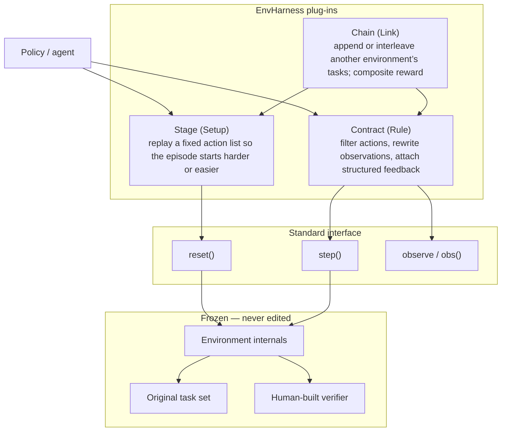
```mermaid
flowchart TB
  subgraph frozen["Frozen — never edited"]
    E["Environment internals"]
    T["Original task set"]
    V["Human-built verifier"]
  end
  subgraph iface["Standard interface"]
    R["reset()"]
    S["step()"]
    O["observe / obs()"]
  end
  subgraph plugins["EnvHarness plug-ins"]
    ST["Stage (Setup)<br/>replay a fixed action list so the episode starts harder or easier"]
    CO["Contract (Rule)<br/>filter actions, rewrite observations, attach structured feedback"]
    CH["Chain (Link)<br/>append or interleave another environment’s tasks; composite reward"]
  end
  AG["Policy / agent"]
  AG --> ST
  ST --> R
  AG --> CO
  CO --> S
  CO --> O
  CH --> ST
  CH --> CO
  R --> E
  S --> E
  E --> T
  E --> V
```

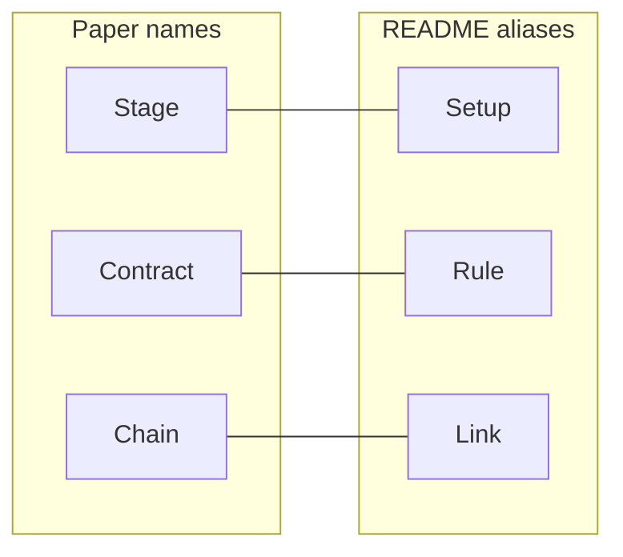
```mermaid
flowchart LR
  subgraph paper["Paper names"]
    ST1[Stage]
    CO1[Contract]
    CH1[Chain]
  end
  subgraph readme["README aliases"]
    ST2[Setup]
    CO2[Rule]
    CH2[Link]
  end
  ST1 --- ST2
  CO1 --- CO2
  CH1 --- CH2
```

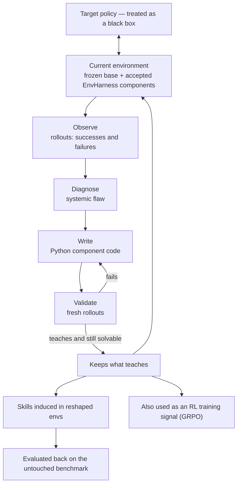
```mermaid
flowchart TB
  POL["Target policy — treated as a black box"]
  ENV["Current environment<br/>frozen base + accepted EnvHarness components"]
  OBS["Observe<br/>rollouts: successes and failures"]
  DIA["Diagnose<br/>systemic flaw"]
  WRI["Write<br/>Python component code"]
  VAL["Validate<br/>fresh rollouts"]
  KEEP["Keeps what teaches"]
  SKILL["Skills induced in reshaped envs"]
  BENCH["Evaluated back on the untouched benchmark"]
  RL["Also used as an RL training signal (GRPO)"]

  POL <--> ENV
  ENV --> OBS
  OBS --> DIA
  DIA --> WRI
  WRI --> VAL
  VAL -->|fails| WRI
  VAL -->|teaches and still solvable| KEEP
  KEEP --> ENV
  KEEP --> SKILL
  SKILL --> BENCH
  KEEP --> RL
```

Stage, Contract, and Chain against the three Projet Complexe analogues from the canvas table:

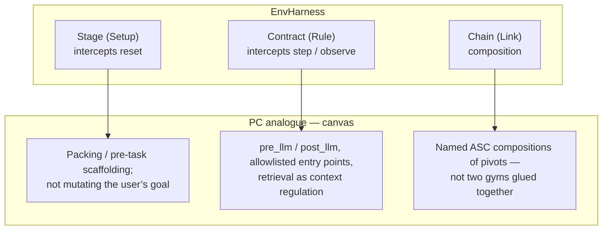
```mermaid
flowchart TB
  subgraph eh["EnvHarness"]
    ST["Stage (Setup)<br/>intercepts reset"]
    CO["Contract (Rule)<br/>intercepts step / observe"]
    CH["Chain (Link)<br/>composition"]
  end
  subgraph pc["PC analogue — canvas"]
    PK["Packing / pre-task scaffolding;<br/>not mutating the user’s goal"]
    PR["pre_llm / post_llm, allowlisted entry points,<br/>retrieval as context regulation"]
    NP["Named ASC compositions of pivots —<br/>not two gyms glued together"]
  end
  ST --> PK
  CO --> PR
  CH --> NP
```

---

## Concept map

Same control problem, different actuators and different object being wrapped.

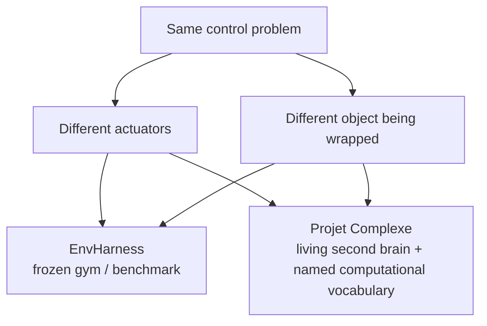
```mermaid
flowchart TB
  CP["Same control problem"]
  A1["Different actuators"]
  A2["Different object being wrapped"]
  EH["EnvHarness<br/>frozen gym / benchmark"]
  PC["Projet Complexe<br/>living second brain + named computational vocabulary"]
  CP --> A1
  CP --> A2
  A1 --> EH
  A1 --> PC
  A2 --> EH
  A2 --> PC
```

| Idea in your notes | EnvHarness counterpart | Overlap |
| --- | --- | --- |
| Flow / CLR: task complexity ≈ effective capacity; keep CLR in a band | Difficulty zone: reshape until success rate lands in [0.4, 0.6]; scaffold if struggling, harden if SR≈1 | Highest. This is the same cybernetic claim. |
| Prompt engineering is challenge regulation, not “being clear” | Contract rewrites obs/actions so the policy cannot take the shortcut it already knows | High. Different lever: they mutate the world; you mutate packing and task shape. |
| ASC wraps frozen CLIs/OS ops; names persist when implementations swap | ActionableEnv bridge wraps docker/browser/sim; harness layers stack; internals never edited | High as a design pattern. ASC is more general (shell, files, hosts), not gym-only. |
| v4: agent harness = pre_llm / post_llm + allowlisted entry points; MCP is transport | Paper Figure 2: Agent Harness (frozen LLM + tools/memory) vs EnvHarness (frozen env + Stage/Contract/Chain) | High as a citation. You already decided the agent-side. They publish the env-side. |
| v3: RAG is context regulation so a 7B stays in the Flow band | Observation rewrite / truncation; hide objects; block high-level teleports | Medium. Same intent (fit the window). They filter a sim; you pack a corpus. |
| Meadows #6 information flows; #5 rules; #8 balancing feedback | Who sees what (obs maps); which actions are legal (action maps); write-and-validate loop | Medium–high. EnvRigger is an automated #8 loop over the env, not over knowledge commits. |
| Level 4 in the Flow note: meta-cognitive regulation of the problem before reasoning | EnvRigger Observe → Diagnose → Write → Validate, conditioned on this policy and this task | High as a loop shape. They emit Python wrappers. You want YAML + DSL as source of truth. |
| Three-project cut: ASC names; PCA composes; PC interprets. Killswitch. HITL claims. | One Python framework: bridges + harness + designer + skill bank + optional RL | Low. Different product, ethics, and ontology. |
| Knowledge plane: Claims, Links, gaps, provenance, fr/en/pt, modest hardware routing | No knowledge ontology. Benchmarks: ALFWorld, WebArena, SWE-bench, OfficeQA, SpreadsheetBench | None. Do not collapse these. |
| DSL is filename-safe addressing; JSON Schema is a projection; never teach the model a private DSL as native tool language (v4 + DSL note) | Designer emits real Python subclasses, compiled in an isolated subprocess | Conflict if copied. Their “code as the harness” fights your “YAML/DSL as SoR”. |

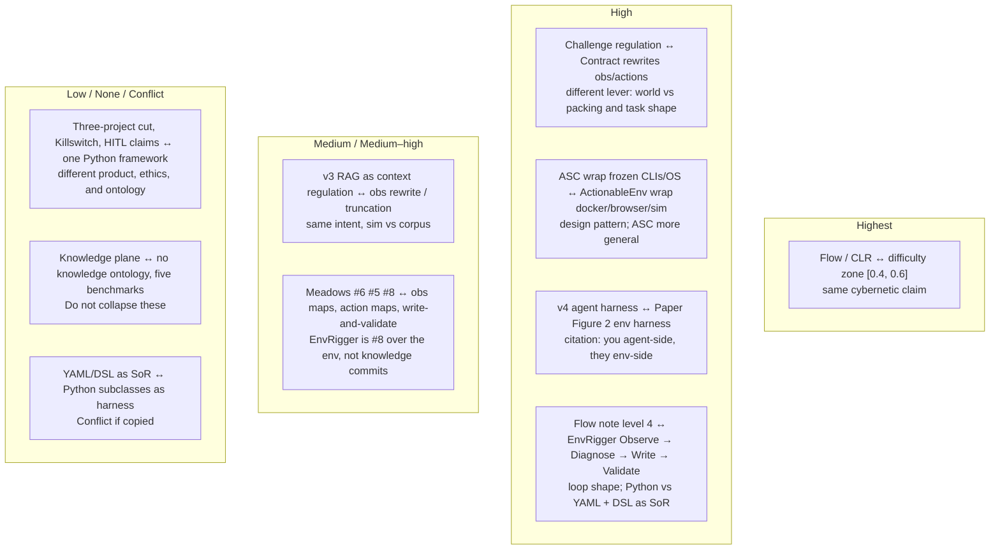
```mermaid
flowchart TB
  subgraph highest["Highest"]
    H1["Flow / CLR ↔ difficulty zone [0.4, 0.6]<br/>same cybernetic claim"]
  end
  subgraph high["High"]
    H2["Challenge regulation ↔ Contract rewrites obs/actions<br/>different lever: world vs packing and task shape"]
    H3["ASC wrap frozen CLIs/OS ↔ ActionableEnv wrap docker/browser/sim<br/>design pattern; ASC more general"]
    H4["v4 agent harness ↔ Paper Figure 2 env harness<br/>citation: you agent-side, they env-side"]
    H5["Flow note level 4 ↔ EnvRigger Observe → Diagnose → Write → Validate<br/>loop shape; Python vs YAML + DSL as SoR"]
  end
  subgraph med["Medium / Medium–high"]
    M1["v3 RAG as context regulation ↔ obs rewrite / truncation<br/>same intent, sim vs corpus"]
    M2["Meadows #6 #5 #8 ↔ obs maps, action maps, write-and-validate<br/>EnvRigger is #8 over the env, not knowledge commits"]
  end
  subgraph low["Low / None / Conflict"]
    L1["Three-project cut, Killswitch, HITL claims ↔ one Python framework<br/>different product, ethics, and ontology"]
    L2["Knowledge plane ↔ no knowledge ontology, five benchmarks<br/>Do not collapse these"]
    L3["YAML/DSL as SoR ↔ Python subclasses as harness<br/>Conflict if copied"]
  end
```

Paper Figure 2 as named in the canvas (agent harness vs environment harness):

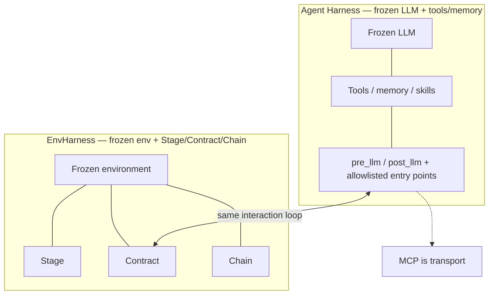
```mermaid
flowchart TB
  subgraph agent_harness["Agent Harness — frozen LLM + tools/memory"]
    LLM["Frozen LLM"]
    TOOLS["Tools / memory / skills"]
    LOOP["pre_llm / post_llm + allowlisted entry points"]
    LLM --- TOOLS
    TOOLS --- LOOP
  end
  subgraph env_harness["EnvHarness — frozen env + Stage/Contract/Chain"]
    ENV["Frozen environment"]
    ST["Stage"]
    CO["Contract"]
    CH["Chain"]
    ENV --- ST
    ENV --- CO
    ENV --- CH
  end
  LOOP <-->|"same interaction loop"| CO
  MCP["MCP is transport"]
  LOOP -.-> MCP
```

Difficulty zone vs Flow / CLR band (the canvas’s highest overlap):

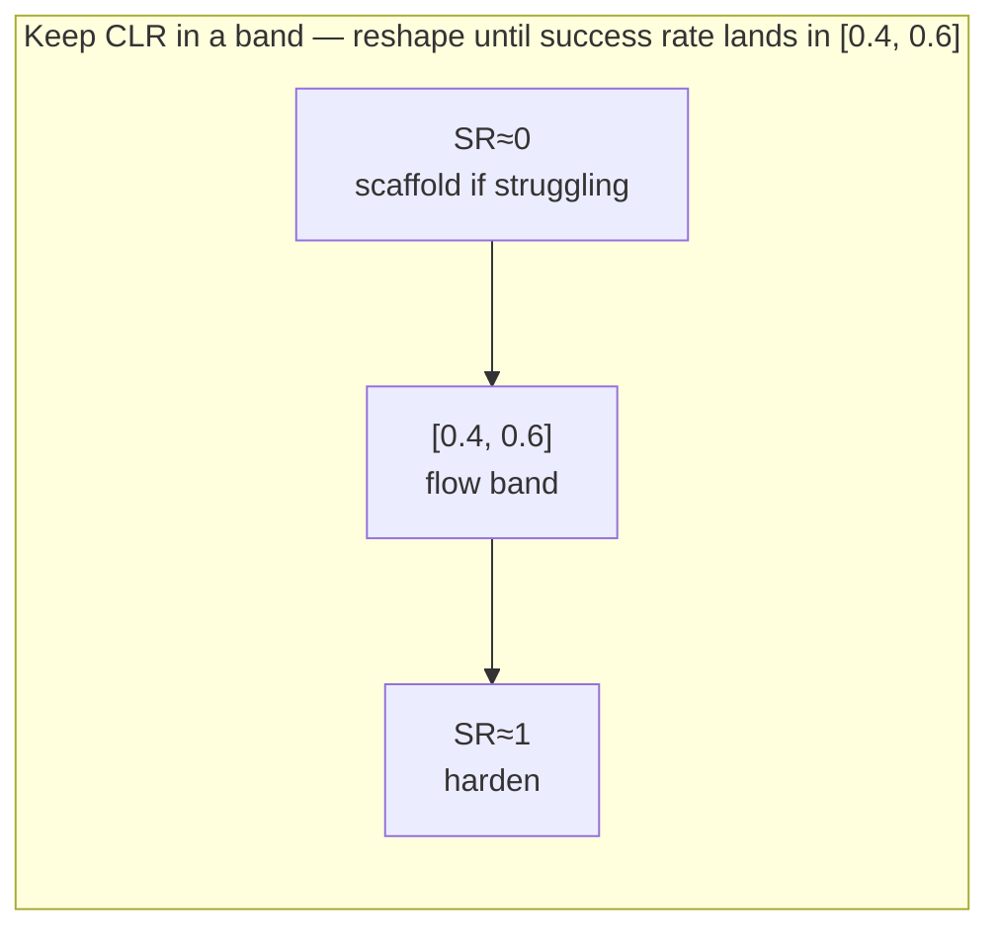
```mermaid
flowchart LR
  subgraph band["Keep CLR in a band — reshape until success rate lands in [0.4, 0.6]"]
    LOW["SR≈0<br/>scaffold if struggling"]
    MID["[0.4, 0.6]<br/>flow band"]
    HIGH["SR≈1<br/>harden"]
    LOW --> MID --> HIGH
  end
```

EnvRigger loop shape vs YAML + DSL as source of truth:

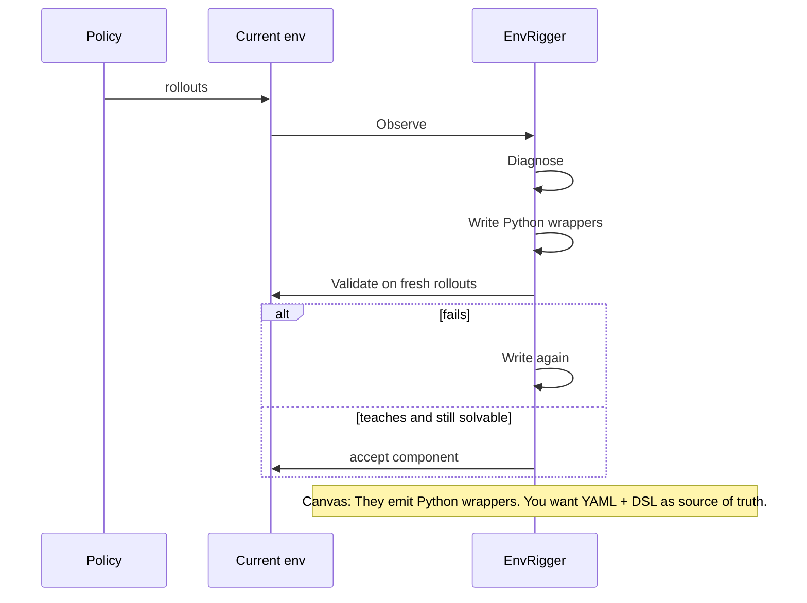
```mermaid
sequenceDiagram
  participant Policy
  participant Env as Current env
  participant Rigger as EnvRigger
  Policy->>Env: rollouts
  Env->>Rigger: Observe
  Rigger->>Rigger: Diagnose
  Rigger->>Rigger: Write Python wrappers
  Rigger->>Env: Validate on fresh rollouts
  alt fails
    Rigger->>Rigger: Write again
  else teaches and still solvable
    Rigger->>Env: accept component
  end
  Note over Rigger: Canvas: They emit Python wrappers. You want YAML + DSL as source of truth.
```

---

## Steal — Useful to Projet Complexe

Cite EnvHarness as the env-side of the harness idea your v4 note already split from MCP / skills / tools.

Name three actuators explicitly: start-state (Stage), interaction (Contract), composition (Chain). Map them onto packing, allowlists, and ASC compositions — not onto a second gym runtime.

Operationalize CLR as a band, not a minimum. Their result that SR≈1 and SR≈0 are equally useless is your boredom vs instability split, measured.

Keep the verifier / human goal frozen. Reshape what the agent sees and may do. Do not silently rewrite the user’s task.

If you ever grow an eval harness for agents, their observe–diagnose–write–validate loop is a better teacher than “generate more tasks.”

## Refuse — Not your stack

Do not put EnvRigger, skill banks, or GRPO in ASC core. ASC README already parks complex agent work in dedicated instances.

Do not make Python Rules the source of truth. v4 already chose YAML entity/able → generated JSON Schema / optional MCP adapter.

Do not treat ALFWorld / SWE-bench transfer as Projet Complexe’s success metric. Yours is ingest, curate, export, research, same named actions for human and agent, three languages, modest hardware.

Do not rebuild Pi / Cursor / a coding-agent loop because they wrapped environments. Wrap a harness; do not become one.

Chain is hard even for them to automate (they excluded it from the designer loop). Do not start with cross-environment episode glue.

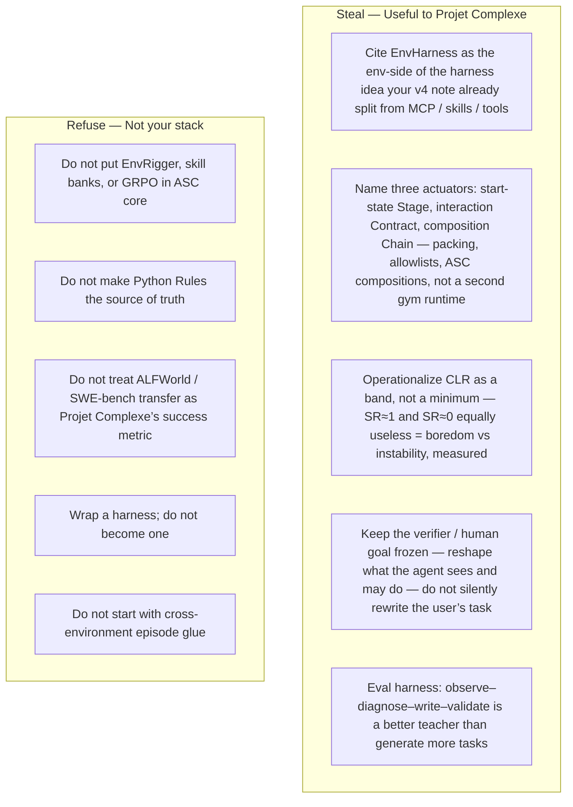
```mermaid
flowchart TB
  subgraph steal["Steal — Useful to Projet Complexe"]
    S1["Cite EnvHarness as the env-side of the harness idea your v4 note already split from MCP / skills / tools"]
    S2["Name three actuators: start-state Stage, interaction Contract, composition Chain — packing, allowlists, ASC compositions, not a second gym runtime"]
    S3["Operationalize CLR as a band, not a minimum — SR≈1 and SR≈0 equally useless = boredom vs instability, measured"]
    S4["Keep the verifier / human goal frozen — reshape what the agent sees and may do — do not silently rewrite the user’s task"]
    S5["Eval harness: observe–diagnose–write–validate is a better teacher than generate more tasks"]
  end
  subgraph refuse["Refuse — Not your stack"]
    R1["Do not put EnvRigger, skill banks, or GRPO in ASC core"]
    R2["Do not make Python Rules the source of truth"]
    R3["Do not treat ALFWorld / SWE-bench transfer as Projet Complexe’s success metric"]
    R4["Wrap a harness; do not become one"]
    R5["Do not start with cross-environment episode glue"]
  end
```

Three actuators mapped as the canvas asks (packing, allowlists, ASC compositions — not a second gym runtime):

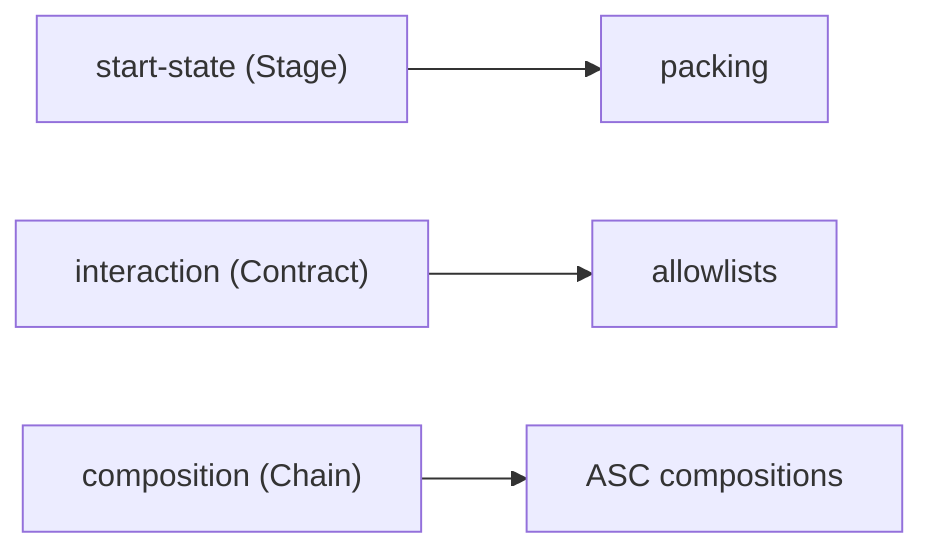
```mermaid
flowchart LR
  ST["start-state (Stage)"] --> PK["packing"]
  CO["interaction (Contract)"] --> AL["allowlists"]
  CH["composition (Chain)"] --> AC["ASC compositions"]
```

Boredom vs instability, measured:

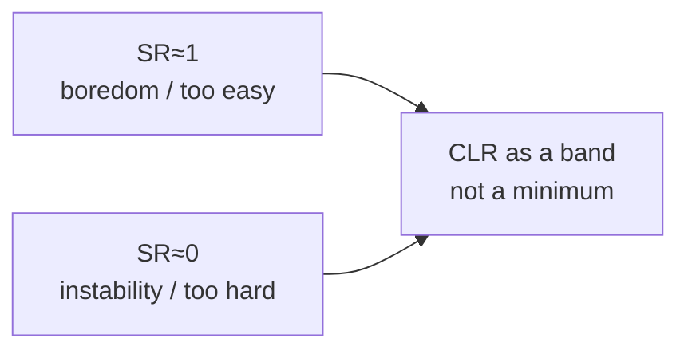
```mermaid
flowchart LR
  B["SR≈1<br/>boredom / too easy"] --> Z["CLR as a band<br/>not a minimum"]
  I["SR≈0<br/>instability / too hard"] --> Z
```

---

## Where the analogy breaks

EnvHarness is a **training-time curriculum generator** that mutates a benchmark so a policy learns transferable skills, then is scored on the original exam. Projet Complexe is a **runtime cognitive institution**: a human-judged knowledge world plus a named computational vocabulary.

That changes the ethics of “make the problem fit the agent.” In a benchmark, hiding the mug in a drawer is a legitimate Stage. In a second brain, hiding the user’s actual objective is a failure. The legal moves on your side are packing, retrieval, tool surface, routing, decomposition, and killswitch — Meadows information flows and rules — not swapping the goal predicate.

Four-layer note (ontology / semantics / dynamics / execution): EnvHarness lives almost entirely in execution, with a thin dynamics loop (EnvRigger). It has no account of what a Claim is, how meaning is computed, or how a corpus evolves under HITL. Cognitive institutions note: they improve the environment the policy learns from; Superpowers-like skills improve the agent’s process; Guardrails constrain I/O. EnvHarness is none of those three, and complementary to all three.

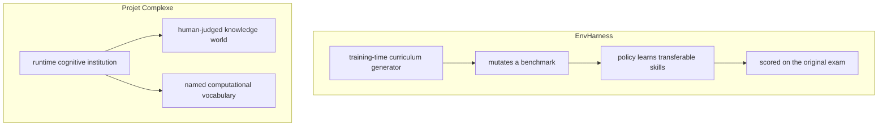
```mermaid
flowchart TB
  subgraph eh["EnvHarness"]
    TT["training-time curriculum generator"]
    MB["mutates a benchmark"]
    SK["policy learns transferable skills"]
    EX["scored on the original exam"]
    TT --> MB --> SK --> EX
  end
  subgraph pc["Projet Complexe"]
    RT["runtime cognitive institution"]
    KW["human-judged knowledge world"]
    NV["named computational vocabulary"]
    RT --> KW
    RT --> NV
  end
```

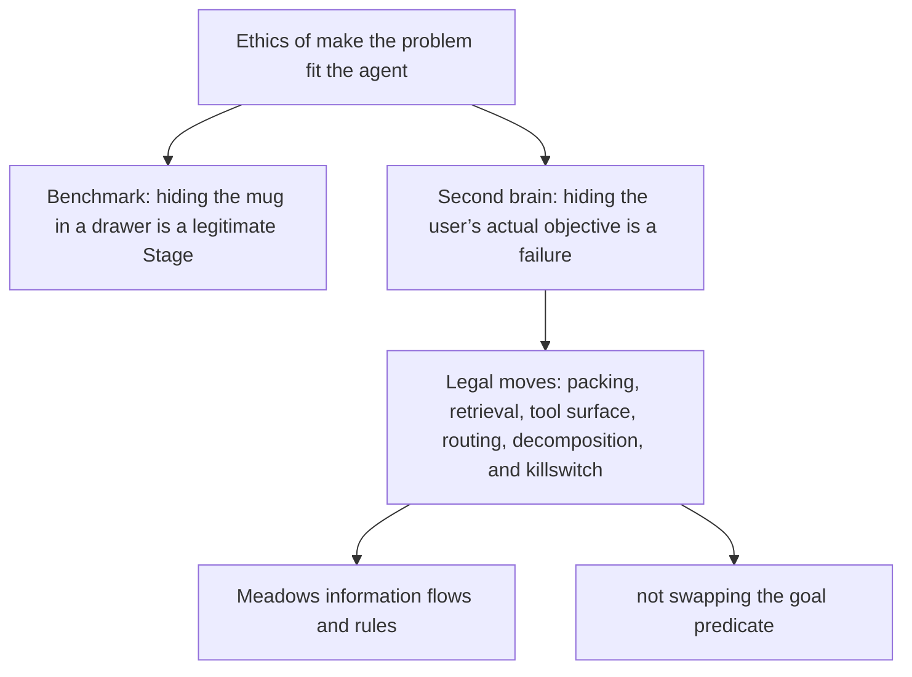
```mermaid
flowchart TB
  Q["Ethics of make the problem fit the agent"]
  Q --> BENCH["Benchmark: hiding the mug in a drawer is a legitimate Stage"]
  Q --> BRAIN["Second brain: hiding the user’s actual objective is a failure"]
  BRAIN --> LEGAL["Legal moves: packing, retrieval, tool surface, routing, decomposition, and killswitch"]
  LEGAL --> M["Meadows information flows and rules"]
  LEGAL --> NOT["not swapping the goal predicate"]
```

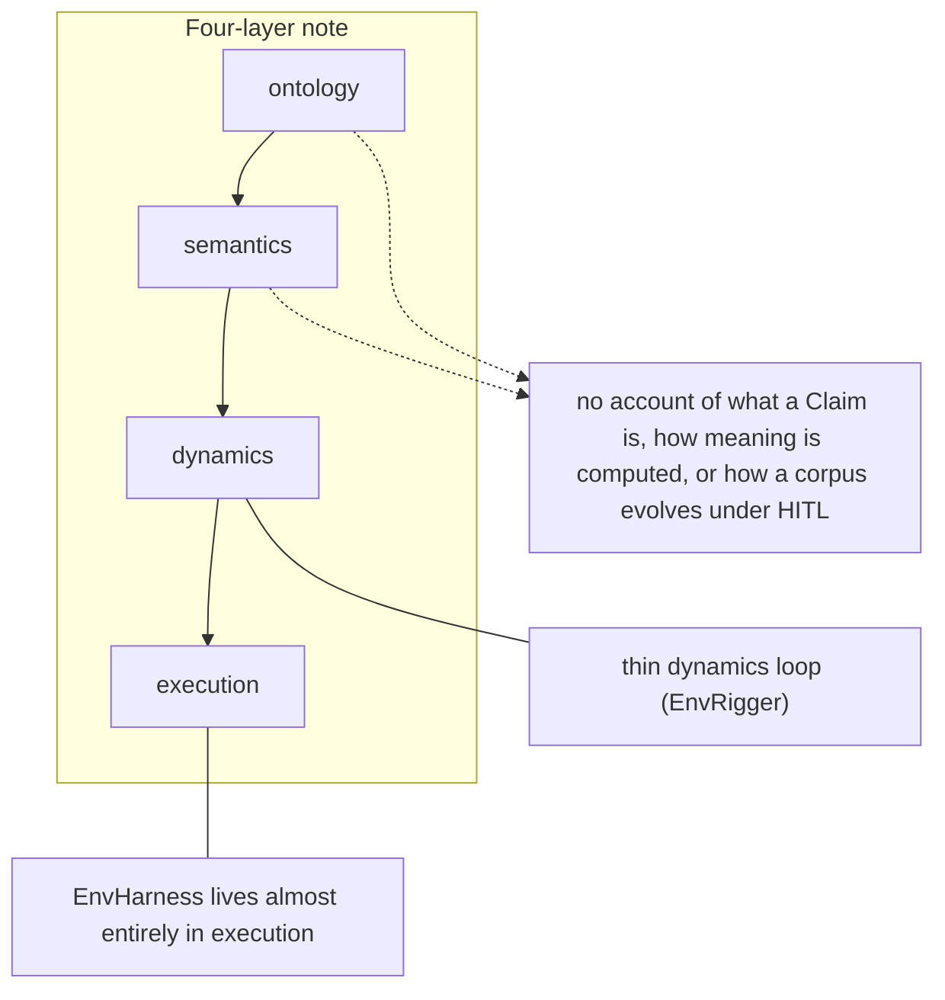
```mermaid
flowchart TB
  subgraph four["Four-layer note"]
    ONTO["ontology"]
    SEM["semantics"]
    DYN["dynamics"]
    EXE["execution"]
    ONTO --> SEM --> DYN --> EXE
  end
  EH["EnvHarness lives almost entirely in execution"]
  RG["thin dynamics loop (EnvRigger)"]
  EXE --- EH
  DYN --- RG
  NO["no account of what a Claim is, how meaning is computed, or how a corpus evolves under HITL"]
  ONTO -.-> NO
  SEM -.-> NO
```

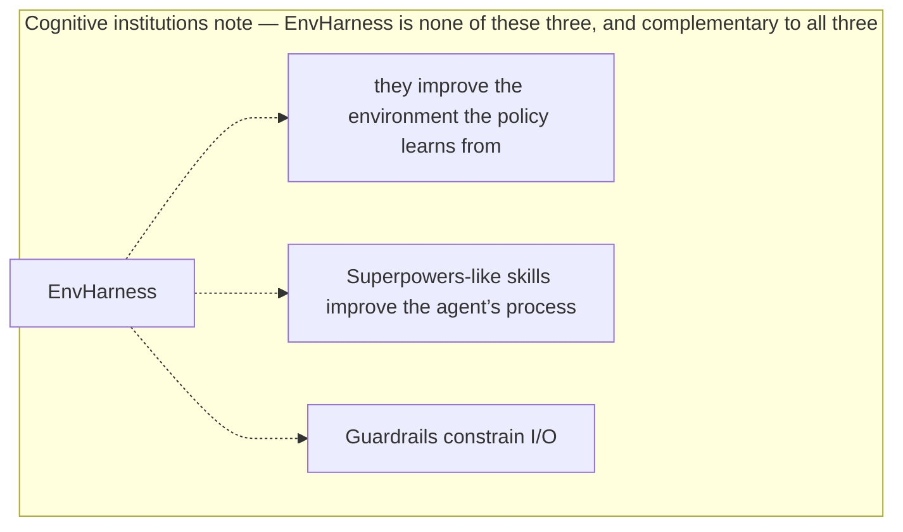
```mermaid
flowchart LR
  subgraph three["Cognitive institutions note — EnvHarness is none of these three, and complementary to all three"]
    E["they improve the environment the policy learns from"]
    S["Superpowers-like skills improve the agent’s process"]
    G["Guardrails constrain I/O"]
  end
  EH["EnvHarness"]
  EH -.-> E
  EH -.-> S
  EH -.-> G
```

---

## Placement on your three-project cut

| Project | Relation to EnvHarness |
| --- | --- |
| ASC | Already the more general wrap-don’t-rebuild layer (hooks, pivots, specificity). Do not add a gym ABC. Optionally document ActionableEnv as a cousin of “thin wrapper over a frozen implementation.” |
| Projet Complexe ASC | If anything is stolen, it is policy: pre_llm packing as Contract; allowlisted pivots as action maps; optional later eval loop that targets a CLR/SR band. Implementation, not protocol. |
| Projet Complexe | The Flow UI / second brain remains the interpreter. EnvHarness does not help ingest, claims, exports, or fr/en/pt. It is a literature ally for the README tease, not a UI or store. |

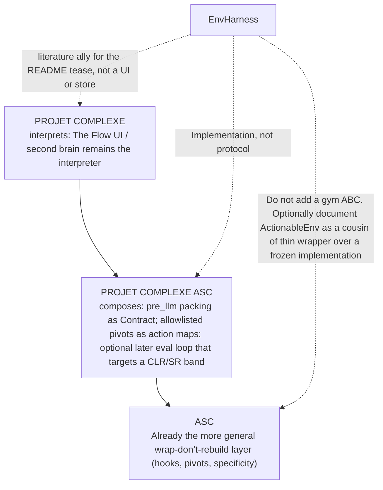
```mermaid
flowchart TB
  PC["PROJET COMPLEXE<br/>interprets: The Flow UI / second brain remains the interpreter"]
  PCA["PROJET COMPLEXE ASC<br/>composes: pre_llm packing as Contract; allowlisted pivots as action maps; optional later eval loop that targets a CLR/SR band"]
  ASC["ASC<br/>Already the more general wrap-don’t-rebuild layer (hooks, pivots, specificity)"]
  PC --> PCA --> ASC
  EH["EnvHarness"]
  EH -.->|"literature ally for the README tease, not a UI or store"| PC
  EH -.->|"Implementation, not protocol"| PCA
  EH -.->|"Do not add a gym ABC. Optionally document ActionableEnv as a cousin of thin wrapper over a frozen implementation"| ASC
```

Sources: EnvHarness README (Setup / Rule / Link, ActionableEnv, designer loop, skill tables); paper abstract + §§1–3, 5 (Stage / Contract / Chain, EnvRigger, difficulty-band experiment, related work); ASC README (wrap, Flow tease, agent extension, DSL); Revival v2–v4; Reverse Prompting vs CLR; Meadows leverage; Four layers; Cognitive institutions.

- [envharness.com](https://envharness.com/)
- [projet-complexe](https://github.com/Paulmicha/projet-complexe)
- [projet-complexe-asc](https://github.com/Paulmicha/projet-complexe-asc)
