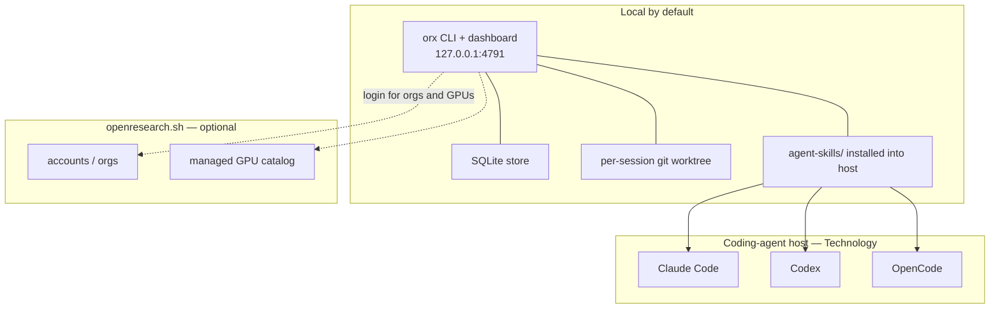
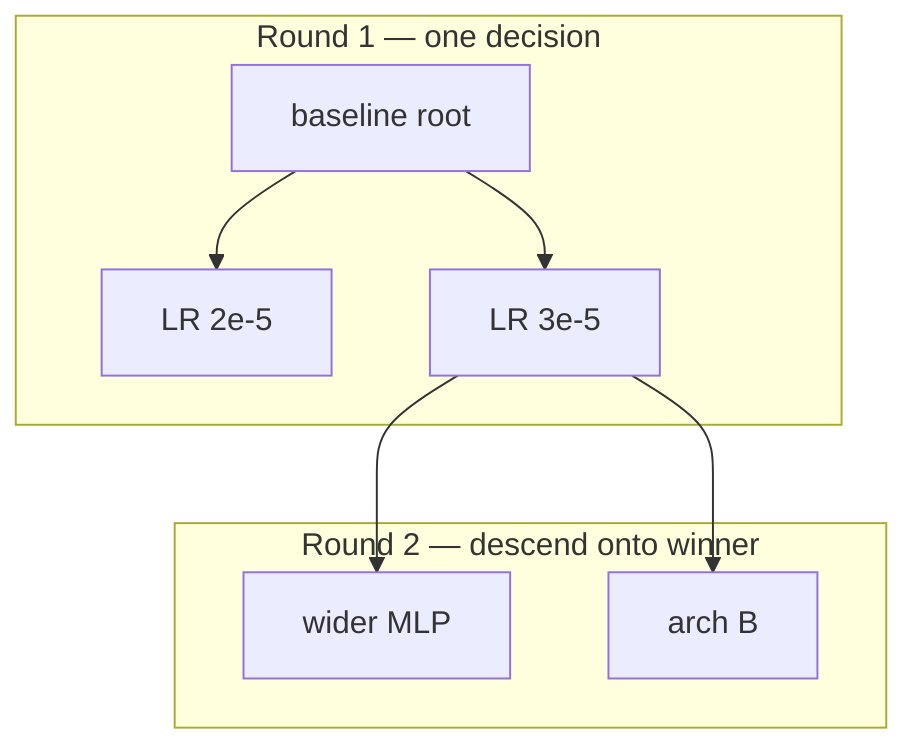
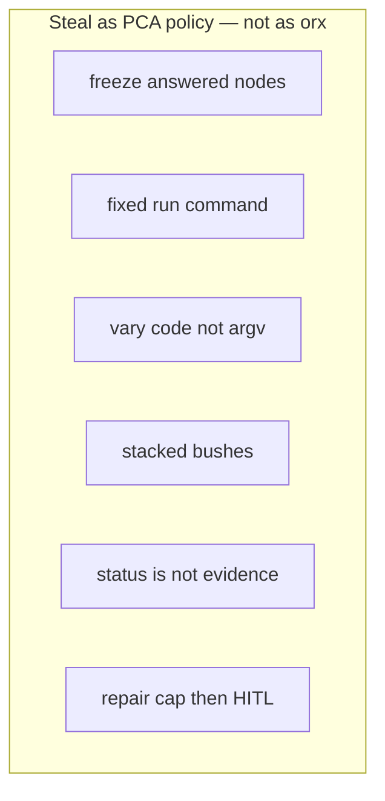
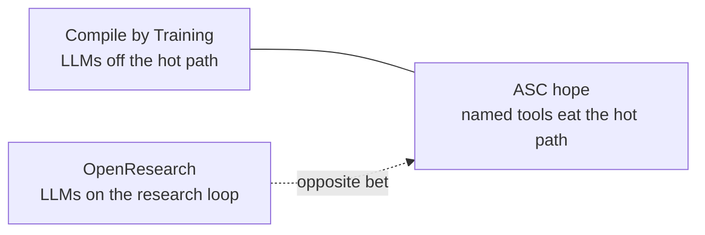
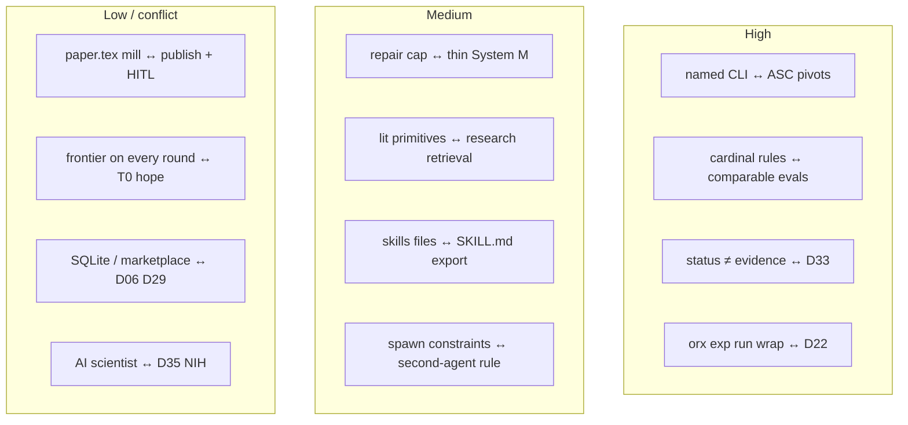
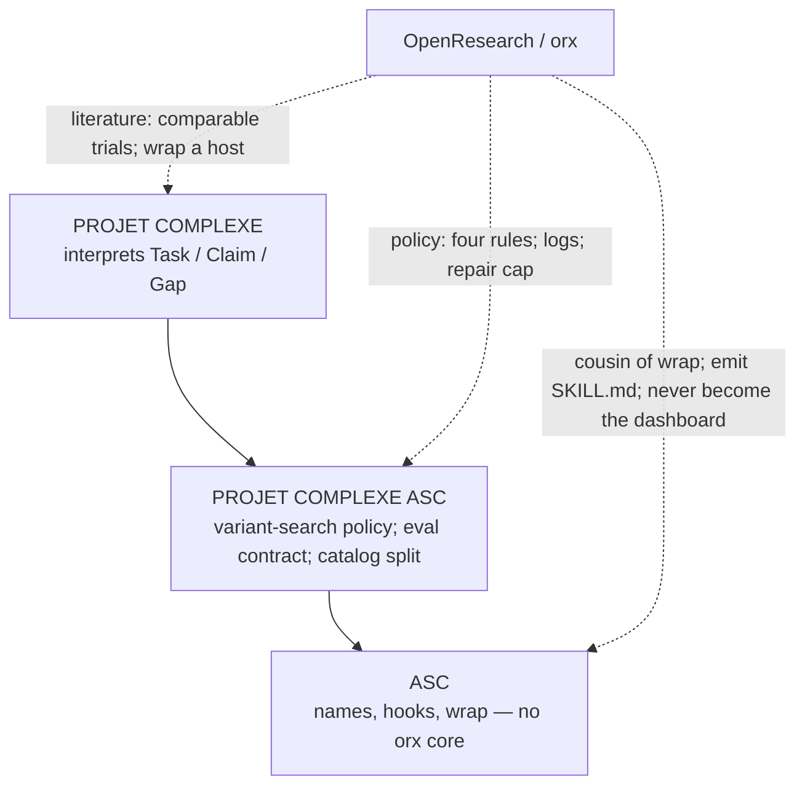

# Overlap with OpenResearch

## OpenResearch vs ASC / Projet Complexe (experiment tree, not a second brain)

**Date:** 2026-09-09  
**Status:** architecture note / design instrument (not a spec, not an implementation plan)  
**Reads:** [alphaXiv/OpenResearch](https://github.com/alphaXiv/OpenResearch) (MIT, Rust, `orx` CLI; README, `SKILL.md`, `SYSTEM_PROMPT.md`, `agent-skills/orx-*`, AGENTS.md; v0.1.121 as of 2026-09-09), [openresearch.sh](https://openresearch.sh/), sibling [openresearch-cli](https://github.com/alphaXiv/openresearch-cli) (same product); ASC README (wrap, agent, builder, DSL, nested git, non-goals); Revival v4–v5 (NIH filter, paper mill, wrap Pi/Cursor); sibling overlap notes [EnvHarness](Overlap%20with%20EnvHarness.md), [AutoDesign](Overlap%20with%20AutoDesign%20-%20Meta%20Harness%20Optimization%20for%20Long-Horizon%20Agentic%20Design.md), [Compile by Training](Overlap%20with%20Compile%20by%20Training.md); folder 1 review (*agentic-ai, rag, retrieval, packing, workflow, anonymization*) especially file 00 register D09, D14, D17, D22, D26–D29, D33–D35, D41 and file 06 (nilenso autoresearch, storymachine); folder 2 D06; Long *AI-Supervisor* (arXiv:2603.24402); Four layers; CLR note.

Repo created 7 Jun 2026. Desktop + CLI positioned as “the local-first workspace for research agents and autoresearch.” It wraps Claude Code, Codex, or OpenCode and installs a skill pack so those hosts can drive an **experiment tree**: literature, hypotheses, code variants, runs, logs, artifacts, optional LaTeX.

This note exists because the repo looks, at filename depth, like Projet Complexe’s research orientation — and it is not. It is the closest *shipped* cousin of a product v4/v5 already marked NIH: an autonomous “AI scientist” plus a paper mill. Steal the **experiment contract**. Do not become the workbench.

---

## Names (do not collapse)

| Name | What it is | Relation here |
| --- | --- | --- |
| **OpenResearch** (`orx`) | This product: local dashboard + CLI + skills + experiment tree + optional GPU marketplace | Subject of this note |
| **openresearch-cli** | Same codebase / same README; GitHub split | Same |
| **nilenso autoresearch** | Already on the shelf: *can an agent drive this CLI?* | **Keep the word.** OpenResearch’s README uses “Autoresearch” for a different loop (idea → code → run → next). Call *that* the **experiment tree**. |
| **AlphaResearch** ([alphaxiv 2511.08522](https://www.alphaxiv.org/abs/2511.08522)) | A paper: LLM algorithm discovery with a dual verifiable / simulated-review reward | Different system. Do not cite as this repo. |

---

## Verdict

Strong overlap on **one axis** (a named, agent-drivable research CLI with frozen experiment nodes and evidence-in-logs), useful on a second (skills as interchange; wrap a coding agent), **conflict on product identity and on the LLM-economics hope**. OpenResearch puts a frontier coding agent *on* the whole research loop. Compile by Training and the ASC builder hope try to get LLMs *off* the hot path. Steal the four cardinal rules, “status is not evidence,” the stacked-bush tree, and the repair-then-ask cap. Do not import the workbench, the paper mill, parallel scientist-agents, the GPU marketplace, or SQLite as a knowledge store.

| Dimension | Strength | Overlap | OpenResearch | Projet Complexe / ASC |
| --- | --- | --- | --- | --- |
| Named, agent-drivable CLI | High | **Strong** | `orx projects / exp run / logs / paper / discover` | ASC pivots, DSL, `make $subject-$action` |
| Frozen node + fixed run command | High | **Strong as policy** | Four cardinal rules in `SKILL.md` | D22 host executes; comparable evals; git as history |
| Evidence in logs, not chat | High | **Strong** | stdout + `orx logs`; status is not evidence | D33 traces; Winteringham; folder 2 event files |
| Wrap a coding agent, don’t be one | Med | **Partial** | Wraps Claude/Codex/OpenCode *and* becomes the dashboard | Wrap Pi/Cursor behind `run-agent` |
| Skills as files | High | **High as interchange** | `agent-skills/orx-*` installed into the host | YAML `able` → optional `SKILL.md`; do not become the skill runner |
| Literature as retrieval | Med | **Partial** | `orx discover` / `orx paper` (alphaXiv, OpenAlex, bioRxiv) | `extract` / `research`; hits are not Claims |
| Local-first | Med | **Split** | SQLite + `127.0.0.1:4791`; account for orgs/GPUs | Files SoR; Postgres for Claims; closable engines |
| Parallel agents / worktrees | Med | **Conflict if copied as default** | `orx agent spawn`; one helper, no nesting | Second agent only when a Requirement forbids the first |
| Reduce LLM use (builder / T0) | — | **Opposite** | Frontier agent on every round | Builder → T0; T3 rare |
| Paper mill / auto-scientist | — | **Refuse as identity** | `orx-paper` writes `.tex`; loop can run unattended | HITL commits Claims; `publish` is a contract |
| Modest hardware | Low | **None** | H100 catalog; 7-day runs | 1050 4 GB; dedi is not an inference box |
| Knowledge ontology | Low | **None** | Experiment nodes, runs, artifacts | Claims, Links, Gaps, fr/en/pt |

The overlapping sentence this repo shares with EnvHarness, AutoDesign, Compile by Training, and you:

> Capability that survives a model swap lives in a named surround — not in a chat log.

Their surround is `orx` + skills + git branches + a coding-agent host. Yours is ASC names + PCA packs. Copy the **CLI-as-vocabulary** move. Do not copy the scientist in the seat.

---

## What OpenResearch actually is

MIT License (copyright 2026 alphaXiv). Language: Rust (`src/`) + a committed `ui/` dashboard. Homepage: [openresearch.sh](https://openresearch.sh/). Install:

```sh
curl -LsSf https://openresearch.sh/install.sh | sh
orx up
```

`orx up` opens a local dashboard at `http://127.0.0.1:4791`. Creating a project or launching a run does not publish code. An [openresearch.sh](https://openresearch.sh) account is for service-owned capabilities: organizations and **managed compute**. Official release builds send opt-out, coarse usage events tied to a random installation ID (no code, prompts, paths, repo names, tokens, emails, or experiment ids). Source/dev builds do not. `orx telemetry off` exists.

`AGENTS.md` splits the product: `orx` owns the local CLI, dashboard, API, SQLite, coding-agent integrations, experiment orchestration, execution backends. `openresearch.sh` owns the website, docs, accounts, sandbox provisioning, managed-compute catalogs. Research projects, experiments, runs, logs, and artifacts are supposed to remain local.

**Hosts.** Claude Code (`--append-system-prompt-file`), Codex (`developerInstructions`), OpenCode (`instructions` list). `SYSTEM_PROMPT.md` is injected into every session: identity, project facts, artifacts path, evidence-and-links contract, skill routing. Task procedures live in native skills copied into the session worktree from `agent-skills/`.

**Compute.** Same committed snapshot can run locally, over SSH, or on Slurm, Kubernetes, Ray, Hugging Face Jobs, Modal, Tinker, and managed OpenResearch GPUs. Publishing the repo is not required for compute. `orx up --remote user@host` runs the workspace next to remote GPUs; the remote service binds to loopback **with no application-level authentication** — they document that other users on that host can reach it.



### Skill pack (what the agent is taught)

| Skill | Job | PC / ASC analogue |
| --- | --- | --- |
| `openresearch-cli` (`SKILL.md`) | Cardinal rules + command index; `orx skill <name>` loads modules | ASC entry-point index; genericity of docs vs core |
| `orx-experiment-tree` | Tree shape, freeze, repair cap, auto-research loop | Policy for variant-search Tasks — not a PC object |
| `orx-create` | `orx up`, `create-experiment`, baseline vs child | `make setup`; entity create — different objects |
| `orx-git` | `orx/<slug>` branches; commit before run; never rebase a frozen node | nested_git / worktrees; D06 git for harness files |
| `orx-evidence` | Design stdout; `orx logs`; status ≠ evidence | D33 traces; eval plane (D41) |
| `orx-compute` | `orx exp run` only; never raw provider CLIs | ASC wrap: named pivot, not `ssh` in the model’s mouth |
| `orx-instances` | Standalone instance in an org | remote_instance entity — refuse as control plane |
| `orx-lit-review` | Main agent ranks alphaXiv / OpenAlex / bioRxiv; **do not delegate the retrieval loop** | `research` retrieval; not Claims |
| `orx-paper` | Write real `.tex` in the working tree on first request | `publish` genre *preprint* — HITL, not auto |
| `orx-figures` | Publication figures / TikZ; default matplotlib is a defect | `publish` contract quality (Yu & Yao), not a plot library as identity |
| `orx-reports` | Artifacts directory: reports, CSVs, PDFs | `publish` drafts + `data/` — files as outputs |
| `orx-agent-delegation` | `orx agent spawn`; no nested helpers; explicit compute authorization | Folder 1: second agent only when a Requirement forbids the first |

### The auto-research loop (as they specify it)

From `orx-experiment-tree`: toward a goal such as “best convergence for d=8”:

1. Read the baseline in the private worktree; find knobs in **code/config**, not in the command.
2. Form **one round**: co-equal options of a *single* decision.
3. Create that round as a **bush** under the right parent (baseline, or previous winner).
4. Edit each child’s branch; commit; `orx exp run` with the **same** command.
5. Read logs (`orx-evidence`); pick a winner; descend.

Do not edit a frozen node. Do not rewrite the run command.



Wrong shapes they name: **flat fan** (every variant off the root — wins never accumulate) and **noodle** (a long single-child chain of co-equal options). Right shape: **stacked bushes**.

### Literature loop

`orx-lit-review`: the *main* agent is the retrieval ranker. Primitives (no login): `orx discover keyword|embedding|openalex|biorxiv`, then `orx paper <id>`. Difficulty 1–10 sets follow-up budget (0 / 1 / 2 rounds). Dedup by id, DOI, arXiv id, then title. Prefer alphaXiv representation of an arXiv duplicate because it supports full-text. Scholarly claims use those source links, not project file tags.

This is a real retrieval skill. It is still **retrieval**.

### Paper loop

`orx-paper`: do not answer a paper request with an outline in chat. Create `paper.tex` at repo root (or `<topic>.tex`). Prefer `.orx/latex-templates/` if present. Figures go through `orx-figures`. LinkedIn launch copy (Aug 2026) sold “idea → paper end-to-end” and `/write-paper`. That is AutoDesign’s mill with a different medium (LaTeX vs poster HTML).

---

## Four cardinal rules (the steal)

From the top-level `SKILL.md`. They say breaking any one **silently invalidates results** — not style preferences.

1. **Never edit a node once a run has answered it.** Freeze is permanent; a disappointing number is still a result. Until a run answers, the node is **provisional** (repair in place). New idea → **child**.
2. **The run command and the environment are a fixed contract** — identical on every node. Children inherit the parent’s command verbatim. No `LR=3e-4 python …`. Set once: `orx project edit <id> --run-command '…'`.
3. **Vary committed code/config, not knobs in the command.** Same command, different git, so logged summaries stay comparable.
4. **Grow the tree downward, not sideways.** Fan a little *within* a round, then descend onto that round’s winner. A root with a long row of direct children and no grandchildren is the failure mode.

Thin killswitch alongside:

- **Repair cap:** two runs in a row that answer nothing on one node, then **ask the user**. Same failure on a second node → ask (setup problem). Bare relaunch or flavor/backend switch counts as a repair.
- **Scientific stop:** “~3 failed or regressed runs” (mentioned as separate from repair).

Evidence rule (`orx-evidence`): print metrics and config on stdout; before reporting a run-derived claim, read the log; **run status is not evidence**; truncated output is not evidence of absence.

Delegation rule (`orx-agent-delegation`): helper gets its own worktree and transcript; cannot spawn another helper; never give it a branch this session has checked out; **state exactly which `orx exp run` calls it may launch**; never delegate the literature ranking loop.



---

## Five-way: what each sibling freezes

Do not treat OpenResearch as a fourth *compiler*. It is a **runtime host for experimental coding**. The August/September papers freeze a core and rewrite a surround. OpenResearch freezes *answered experiment nodes* and keeps rewriting *children* with a live frontier agent.

| | EnvHarness | AutoDesign | Compile by Training | **OpenResearch** | Projet Complexe |
| --- | --- | --- | --- | --- | --- |
| Frozen core | env + verifier | model \(\theta\) | 0.6B interpreter + spec | **answered node’s commit** | ASC names + human goal / Claim |
| What runs on the hot path | policy in a gym | designer–critic | `Run(p_s, x)` on 0.6B | **Claude/Codex/OpenCode** | named pivot; T0 if possible |
| Outer loop | EnvRigger writes wraps | \(P\) patches \(H\) | teachers + LoRA at compile | auto-research tree | optional gated pack edits, HITL |
| Success metric | held-out SR | PosterBench | FuzzyBench LEM | EVAL / logs / a `.tex` | ingest, curate, export, research; fr/en/pt |
| SoR | Python subclasses | harness source + Skills | `.paw` + spec | git branch + SQLite + artifacts | YAML + DSL; files for bytes |
| LLM economics | designer spends models | outer \(P\) spends models | teachers at **compile** only | models on **every round** | builder → T0; T3 rare |



EnvHarness answers: *reshape what the agent sees.*  
AutoDesign answers: *reshape the software that produces the next artifact.*  
Compile by Training answers: *compile a recurring function and stop calling the teacher.*  
OpenResearch answers: *give a coding agent a comparable experiment tree and let it climb.*  
Projet Complexe needs OpenResearch’s **comparability rules** as policy for variant-search Tasks, and must not take the climb as the research orientation.

---

## Concept map (notes → OpenResearch)

| Idea in your notes | OpenResearch counterpart | Overlap |
| --- | --- | --- |
| ASC wraps frozen CLIs; names persist | `orx` is the named CLI; hosts swap (Claude / Codex / OpenCode) | **High as a pattern.** They still *are* a dashboard. You wrap, you do not become. |
| v5 NIH: do not rebuild Pi/Cursor; wrap | They wrap those hosts *and* add `orx up` | **Partial.** Steal wrap. Refuse second IDE. |
| v5 NIH: paper mill | `orx-paper` + launch copy “idea → paper” | **Conflict as identity.** `publish` genre only. |
| Long AI-Supervisor: steal gaps, refuse auto-commit | Experiment tree proposes next nodes; no Claim object | **High as a warning.** Same refuse. |
| nilenso autoresearch: drivability of a CLI | `orx` *is* an agent-facing CLI with skills | **High.** Use as a *specimen* of drivability, not as the vocabulary. Keep the word “autoresearch” for nilenso. |
| storymachine: spec as object | experiment `--description` is the hypothesis | **Low–medium.** Description ≠ acceptance criteria on a product Task. |
| D22 host executes; model proposes | `orx exp run` only; never raw `python train.py` as an untracked job | **High.** Same wrap discipline. |
| D24 DSL / do not teach frontier a private dialect | skills teach `orx …` as the dialect | **Medium.** Better than a private shell; still a second vocabulary beside ASC. One Implementation behind a pivot, if ever. |
| D09 killswitch / System M | repair cap; scientific stop; spawn compute must be authorized | **Medium as budget.** Not orientation (research may not `bash` the household). |
| D27 lethal trifecta | lit fetch + private repo + `exp run` in one agent catalog | **Conflict unless catalogs split.** Spawn’s explicit launch allowlist is a start. |
| D28 HITL on Claims and harness patches | ask user after two failed repairs; paper writes itself | **Low.** Repair HITL ≠ knowledge HITL. |
| D29 local-first; closable | local SQLite by default; remote loopback has no auth; GPU marketplace optional | **Split.** Steal local default. Refuse remote-without-auth and marketplace-as-identity. |
| D33 traces | `orx logs`; file/run tags in chat | **High as discipline.** Different envelope than folder 2 traces. |
| D06 files as SoR | git branch is SoR for experiment *code*; SQLite is live index | **Medium.** SQLite as derived experiment index is fine. Not for Claims. |
| D17 cascade; modest hardware | H100 catalog; 7-day max run | **None** as environment. A `run-command` that is `make test` could run on the laptop; their demos are nanochat / GRPO. |
| D26 MCP is transport | CLI-first, not MCP-as-brain | **Confirmed** (accidentally). |
| D35 refuse-list / AI-scientist | the product | **Refuse.** |
| Folder 1: most “multi-agent” is a workflow; second agent only when a Requirement forbids the first | `orx agent spawn`: one helper, no nesting, standalone brief | **High as discipline** if kept rare. **Conflict** if parallel scientists are the default. |
| Compile by Training: fewer runtime LLM calls | opposite | **Use as contrast**, not as merge. |
| AutoDesign: evolve \(H\), gated | they evolve *code under experiment nodes*, not the `orx` harness, autonomously | **Conflict on gate.** AutoDesign’s train/dev + HITL on \(H\) is stricter than their tree climb. |
| CLR / Flow | worktrees isolate context; they do not measure a band | **Low.** Isolation ≠ packing. |
| Four layers | execution + a dynamics loop on the tree | **Low as ontology.** No Claim. |
| fr/en/pt as Requirements | English LaTeX / arXiv-first discovery | **None.** |
| Builder / T0 hope | skills so the LLM can drive *more* | **Opposite.** |



---

## Register crosswalk (folder 1 D-IDs)

| ID | Decision | This repo | Verdict |
| --- | --- | --- | --- |
| D01 | Three scopes; coupling is the product | One workbench + coding-agent host | **Silent** on PC meaning; **conflict** if ASC becomes `orx` |
| D06 | Files SoR; derived rebuildable | Git branch SoR for experiment code; SQLite live | **Steal the split** for *experiments*; keep Claims in Postgres + file export |
| D09 | Orientations + killswitch | Repair/scientific stops; no knowledge/task split | **Silent** on orientation; **do not** let `research` inherit `exp run` |
| D14 | Harness not weights | Skill files + playbook are the harness; they do not freeze the *coding* model | **Confirmed as surround**; the surround is their product, not yours |
| D17 | Cascade tiny → LAN → remote | Frontier host by default; GPU catalog | **Contradicted as default**; a local `run-command` could still be T0/T1 |
| D22 | Host executes | `orx exp run` is the only legal launch | **Confirmed** — cite the wrap |
| D24 | DSL compiles to schema | Skills teach `orx` argv | **Adapt** as one Implementation, not a second primordial vocabulary |
| D26 | MCP is not the control plane | CLI + local API; dashboard is a local UI | **Partial.** Local UI is closer to Tauri-thin than to messenger-as-host. Still: ASC/PCA over Compose remains the household control plane. |
| D27 | Lethal trifecta | Lit + private repo + outbound compute in one catalog | **Conflict** unless split |
| D28 | HITL for knowledge and harness | Repair ask; paper without accept | **Not a substitute** |
| D29 | Local-first; closable | Local default yes; remote no-auth; marketplace | **Split** |
| D33 | Traces first-class | Logs + tags | **Confirmed as discipline** |
| D34 | Redirection drills | `how_to_turn_off` for a Technology `orx` would be: stop wrapping; pivots remain | **Yes if** `orx` is never identity |
| D35 | Refuse-list | AI scientist / mill | **Refuse the product** |
| D41 | Eval plane | EVAL.md / stdout metrics (docs + evidence skill) | **Steal the artifact shape** (a run must write comparable evidence) |

Folder 2: an experiment branch is a *fonds* of a trial (code + commit + log). That is Edwards / Servais-adjacent and good. It is not a Claim. Promotion to L3 still needs HITL.

---

## Versus the hoped-for roadmap (builder → T0)

| Hoped-for move | OpenResearch |
| --- | --- |
| Builder fills tooling gaps so fewer LLM calls | Skills so the **LLM can drive more of the loop** |
| Map NL → named entry points | They do this *for `orx`*, then keep a frontier model in the seat |
| DSL + rules as combinators | Cardinal rules combinators for **experiments**, not household Tasks |
| Fewer human validations | Fewer babysitting steps on *runs*; no human on meaning |
| Bigger models rare | Bigger models are the product |

If OpenResearch were installed as the research orientation, mass would move **away** from T0, not toward it. Compile by Training is the ally of that hope. This repo is the counterexample.

---

## Steal

Cite OpenResearch as a **shipped experiment workbench** that operationalizes comparability: freeze answered nodes, fix the run command, vary git, shape the tree as stacked bushes.

Steal the **four cardinal rules** as PCA policy for any Task that is “try variants on a repo” (harness-pack eval, packing ablation, client A/B). You do not need `orx` to keep a Makefile target identical across branches.

Steal **status is not evidence**. Map onto D33 and onto autoresearch class C (silent wrong / incomplete). A pivot that exits 0 without writing the metric has failed the contract.

Steal **repair cap then ask**. Two unanswered runs, then drama (Lefèvre), not a third silent retry. Separate “setup is broken” from “the hypothesis lost.”

Steal **`orx exp run` as wrap**: the model must not invoke the trainer/provider CLI. ASC already wants this (named `$action`). Their compute skill is a worked example of that sentence.

Steal **do not delegate the retrieval ranking loop** to a sub-agent. Main agent inspects candidates. That matches folder 1’s “coordination is paid in context” and the killswitch against swarms.

Steal **skills as interchange** (again): they install `SKILL.md` into Claude/Codex/OpenCode. Same AutoDesign move. Emit from YAML `able`; do not make ASC a skill runner.

Steal **git worktree per session** as an *Implementation* for isolation of code Tasks — when the user asked for a worktree, and never as unsolicited gitflow. Frozen branch = immutable archive of what ran.

Steal **EVAL.md / compact stdout summary** as the eval-plane artifact a scientific or harness-eval run must write (D41). Winteringham: the checker reads that file, not the chat.

Steal spawn’s **explicit compute authorization** in the helper brief. Catalog-level trifecta needs more; this is the minimum for a second session.

## Refuse

Do not make OpenResearch the research orientation, the Tauri replacement, or the ASC dashboard. Wrap a harness; do not become a scientist IDE.

Do not take “idea → paper end-to-end” as `publish`. A `.tex` is one genre Implementation under HITL and a quality contract. Nolan: revision is the craft. AutoDesign overlap already refused the mill.

Do not run the auto-research loop unattended on household knowledge, client repos, or ASC core. Legal objects for a *gated* climb, if any, are **packs / eval recipes / experiment code the human named** — not Claims, not primordial YAML, not the user’s Task.

Do not collapse “Autoresearch” with nilenso. Different loops. Folder 1’s word stays: drivability of a CLI.

Do not put `orx` in ASC core. Optional later: a contrib Technology behind `exp-run` / `exp-logs` if a named Task is blocked without an experiment tree (v5: wrap after two foreign tools have needed it). Until then, NIH / tool obsession (Osmani).

Do not share one catalog among `orx discover` (untrusted web), a private corpus, and `orx exp run` (outbound compute). D27.

Do not use `orx up --remote` on dedi-2025: loopback, no application auth, other users on the host. That fails D29 and the dedi threat model.

Do not use managed OpenResearch GPUs as identity. H100 marketplace is not the 1050 / Tiiny / closable-engine story. Overflow compute, if ever, stays a named Technology with quota, redaction, and `how_to_turn_off`.

Do not treat SQLite as the second brain. Derived index for experiments only.

Do not train or fine-tune because a demo is nanochat / Qwen GRPO. D14 / D42 unchanged.

Do not let parallel `orx agent spawn` become multi-agent consensus as truth (`2603.24402`). Helper writes a brief’s deliverable; human commits meaning.

Do not send the household literature graph through alphaXiv as SoR. `orx paper` is a retrieval Implementation; extract-once and Claims stay yours. English-first discovery does not satisfy D07.

## Caveats (so you do not over-cite)

| Issue | Why it matters here |
| --- | --- |
| README “local-first” vs marketplace + `orx login` | Local *default* is real; attachment to `openresearch.sh` exists for the features they will demo. |
| Telemetry on official builds | Opt-out, coarse; still a channel. Source builds off. |
| Remote no-auth | Documented; easy to miss. |
| “Autoresearch” naming | Collides with nilenso. |
| Paper skill vs launch marketing | Skill is “write `.tex` in tree”; marketing is end-to-end automation. Judge the skill; refuse the slogan. |
| No household eval | Nanochat / GRPO templates are not ingest–claim–publish in fr/en/pt. |
| Skills assume a frontier coding agent | Drivability of `orx` is not drivability of ASC on a 1.7B. |

---

## Where the analogy breaks

OpenResearch is a **training-and-trial workbench for people who already live in a coding agent and a GPU queue**. Projet Complexe is a **runtime cognitive institution**: human-judged knowledge plus a named computational vocabulary. ASC is **glue**.

That changes “research.” In their setting, research *is* stacking experiments on a codebase until a metric moves, then writing LaTeX. In yours, research is extract → propose → HITL → Claim / Gap, with a killswitch against acting. An experiment tree can be *a Task type* (code/science Implementation). It cannot be the knowledge orientation.

That also changes “local.” Their local is “SQLite on loopback, code not published.” Yours is files as SoR, engines closable, Three Safes on any hop, dedi as GitOps not as an open `orx` bind.

Four-layer note: almost entirely **execution**, with a **dynamics** loop on the tree. No ontology of household objects. Cognitive institutions: they improve the *procedure that produces experiment artifacts*; Superpowers-like skills are what they ship; Guardrails are thin (repair cap, spawn allowlist). Complementary if kept in the **code-experiment worker** slot. None of Projet Complexe’s knowledge institution.

Flow / CLR: a worktree lowers *interference* between sessions. It does not pack a corpus or keep a 7B in band. EnvHarness still owns the band metaphor. Compile by Training owns amortized cost. This repo owns **comparable trials**.

---

## Placement on the three-project cut

| Project | Relation to OpenResearch |
| --- | --- |
| **ASC** | Cousin of wrap-don’t-rebuild. Document `orx` as a Technology a pivot might call, like Cursor CLI. Do **not** add an experiment-tree runtime or a paper compiler to core. Optional later: generate `SKILL.md` that teaches *ASC* pivots the way they teach `orx`. |
| **Projet Complexe ASC** | If anything is stolen, it is **policy**: frozen answered trials, fixed run command, stacked bushes, status ≠ evidence, repair-then-HITL, retrieval ranking not delegated, spawn with an explicit compute allowlist. `EVAL.md` as an eval-plane contract. `research` stays budgeted and catalog-split. |
| **Projet Complexe** | The Flow UI remains the interpreter of Tasks and Claims. A literature hit is retrieval. A run metric is evidence for a *proposed* Claim. A `.tex` is a `publish` genre. No new PC object named Experiment — or, if one appears later, it is a Task subtype, not a Claim. |



Genericity test (v5 §4.4): would another project, not a second brain, need this? **Yes** — any repo that runs comparable trials (ML, compiler flags, harness evals). That is an argument for keeping the *rules* in PCA policy. It is not an argument for `orx` as the household shell. Another project needs `make test-integration` to mean the same thing on every branch, not `orx exp run` as the name of work.

---

## Practical takeaway

Read OpenResearch next to the three overlap notes, not instead of them.

1. **EnvHarness** — freeze the world, wrap `reset`/`step`, regulate difficulty.  
2. **AutoDesign** — freeze the model, evolve \(H\), gate with a frozen eval.  
3. **Compile by Training** — freeze a tiny interpreter, compile NL, spend teachers on the build.  
4. **OpenResearch** — freeze *answered trials*, wrap a coding agent, climb a git tree, optionally write LaTeX.  
5. **Projet Complexe** — freeze names and the human’s objective; compile gaps into **files**; comparable trials as *policy* when the Task is variant-search; only a human commits Claims.

The sentence to keep from this repo:

> Never edit a node once a run has answered it. Vary code, not the command.

Your node is a git-recorded Implementation of a named pivot. Theirs is an `orx` experiment. Same sentence. Different catalog.

---

**Sources:** OpenResearch README (local-first, hosts, compute, telemetry, `orx` commands); `SKILL.md` (cardinal rules); `SYSTEM_PROMPT.md` (playbook, evidence tags); `AGENTS.md` (orx vs openresearch.sh); `agent-skills/orx-experiment-tree`, `orx-create`, `orx-git`, `orx-evidence`, `orx-compute`, `orx-lit-review`, `orx-paper`, `orx-reports`, `orx-agent-delegation`, `orx-figures` (via GitHub raw, 2026-09-09); GitHub metadata (created 2026-06-07, MIT, Rust, v0.1.121); ASC README; Revival v4–v5 NIH / wrap / paper mill; folder 1 file 00 §§12, 16.2, 16.4, 16.7 and file 06 (autoresearch, storymachine); folder 2 D06; Long `2603.24402`; sibling overlap notes.

- [github.com/alphaXiv/OpenResearch](https://github.com/alphaXiv/OpenResearch)
- [github.com/alphaXiv/openresearch-cli](https://github.com/alphaXiv/openresearch-cli)
- [openresearch.sh](https://openresearch.sh/)
- Siblings: [Overlap with EnvHarness](Overlap%20with%20EnvHarness.md), [Overlap with AutoDesign](Overlap%20with%20AutoDesign%20-%20Meta%20Harness%20Optimization%20for%20Long-Horizon%20Agentic%20Design.md), [Overlap with Compile by Training](Overlap%20with%20Compile%20by%20Training.md)
- [projet-complexe](https://github.com/Paulmicha/projet-complexe)
- [projet-complexe-asc](https://github.com/Paulmicha/projet-complexe-asc)
- [asc](https://github.com/Paulmicha/asc)
