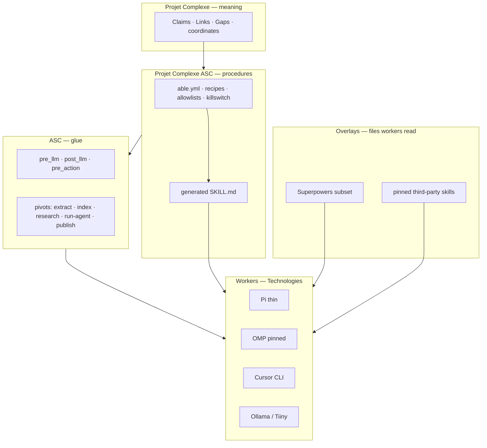

# Pi, OMP, Superpowers, Skill Packs

**Date:** 2026-09-09  
**Status:** architecture note / design instrument (not a spec, not an implementation plan)  
**Checked:** GitHub APIs and upstream READMEs / docs on 2026-09-09. Star counts move; treat them as *attention*, not quality.  
**Reads:** [earendil-works/pi](https://github.com/earendil-works/pi) (MIT, TypeScript; README, `packages/coding-agent/docs/{skills,packages,extensions,rpc,sdk,containerization}.md`, [pi.dev/docs/latest](https://pi.dev/docs/latest)); [can1357/oh-my-pi](https://github.com/can1357/oh-my-pi) (MIT, TypeScript + ~80k LoC Rust natives; README, [omp.sh](https://omp.sh), docs on skills / custom tools); [obra/superpowers](https://github.com/obra/superpowers) (MIT; README, `skills/*/SKILL.md`, Pi install path); Agent Skills standard ([agentskills.io](https://agentskills.io)); sibling notes in this folder; Revival v4–v5; folder 1 (*agentic-ai, rag, retrieval, packing, workflow, anonymization*) especially files 00, 01, 02, 06, 07, 09, 10; folder 2 (*data stores…*) files 01, 04, 06.

This document **paraphrases**. It does not paste books, skill bodies, or chat dumps into the second brain.

Each block is asked the same four questions used on this shelf:

1. What was actually claimed (repo, spec, or marketplace)?
2. How is it implemented in the wild?
3. Where does it sit on ASC / Projet Complexe ASC / Projet Complexe / folder 1 / folder 2?
4. Steal, adapt, or refuse?

---

## Why this note exists

v4 already named Pi as the coding-agent **worker** not to rebuild. Folder 1 already named `SKILL.md` as an **export** of YAML `able`, not a store. Folder 2 already put `harness/SKILL.md` next to `able.yml` in the file SoR. Superpowers is already *running in this Cursor workspace* as a process overlay.

What the three GitHub URLs plus the 2026 skill-pack market add, that those notes had not put in one instrument:

1. **Pi moved from a small Mario Zechner repo into Earendil Inc.** (`@earendil-works/*`, `pi.dev`, packages, RPC, Agent Skills as a first-class loader). The wrap target is still the same object. The distribution surface is larger.
2. **Oh My Pi is not “Pi with a nicer TUI.”** It is a batteries-included *fork* that adds IDE-grade tools, a memory bank the agent writes, `learn` / `manage_skill`, browser / desktop / web search, ACP, and a 31-tool catalog. That is a different Meadows spend: rules and goals, not parameters.
3. **Superpowers is not a harness.** It is a *methodology encoded as mandatory skills*. It can ride Pi, OMP, Cursor, Claude Code, Hermes, … without owning execution.
4. **Skill packs became a distribution layer** (Anthropic plugins, Vercel `skills.sh` packs on 2026-08-07, awesome lists, vendor marketplaces). That is an interchange *and* a supply-chain attack surface. It is not a knowledge ontology.

The evaluation question is not “which of these should Projet Complexe become?” It is: **which of these can sit behind named pivots without becoming identity, and which attachments they would close.**

---

## Names (do not collapse)

| Name | What it is | Relation here |
| --- | --- | --- |
| **Pi** (`earendil-works/pi`, formerly `badlogic/pi-mono`) | Minimal terminal **agent harness**: unified LLM API (`pi-ai`), loop (`pi-agent-core`), coding CLI (`pi-coding-agent`), TUI, telemetry. MIT. ~103k GitHub stars (2026-09-09). | Wrap target. Technology behind `run-agent` for *code* Tasks. Not the second brain. Not the control plane. |
| **Oh My Pi / OMP** (`can1357/oh-my-pi`) | Fork of Pi by Can Bölük / Stencil Labs. Same package *shape*, rewritten coding-first: LSP, DAP, hashline edits, 31 tools, memory bank, subagents, ACP, collab relay. ~30k stars. Site: [omp.sh](https://omp.sh). | Alternative / later Implementation of the same `run-agent` worker. Stronger capability, stronger identity trap. |
| **Superpowers** (`obra/superpowers`) | Jesse Vincent / Prime Radiant. **Process** skill pack: brainstorm → plan → TDD → review → finish. MIT. ~284k stars. Installs into 14+ harnesses including Pi (`pi install git:github.com/obra/superpowers`). | Procedure overlay. Closest cousin of PCA Requirements + HITL gates. Not tools. Not Claims. |
| **Agent Skills** (`SKILL.md`) | Open standard (Anthropic origin; [agentskills.io](https://agentskills.io)): folder + YAML frontmatter `name` / `description`, progressive disclosure, optional scripts/references. | Interchange format. Folder 1 D24: generate from YAML `able`; do not become the skill runner. |
| **Skill pack** | A *bundle* of skills (git repo, Claude plugin, Vercel pack URL, Pi package). | Distribution unit. Not a pivot. Not a Claim schema. |
| **Pi package** | npm/git bundle of extensions + skills + prompts + themes (`pi install …`). | How Superpowers rides Pi. Analog of a PCA composition, not of a PC object. |
| **Hermes Agent** (`NousResearch/hermes-agent`) | Self-hosted harness with the packing tricks v5 already stole. Loads Superpowers as a plugin. ~244k stars. | Packing reference. Refuse gateway-as-host. Already treated in [About Memory, RAG, and Graphs](About%20Memory,%20RAG,%20and%20Graphs.md). |
| **ECC** (`affaan-m/ECC`, formerly “everything-claude-code”) | Full overlay: skills, instincts, memory, security, research-first. MIT + commercial GitHub App. GitHub API ~255k stars (treat as attention, possibly inflated). | Competitor *bundle* to Superpowers + memory products. Do not import as identity. |
| **OpenResearch** (`orx`) | Research CLI + skill pack that *wraps* a coding host. | Already a sibling note. Skills-as-interchange cousin. Refuse paper mill. |

```text
meaning (PC: Claims, Links, Gaps, coordinates)
        ↑
procedures / gates (PCA: able.yml, recipes, allowlists, HITL)
        ↑
execution glue (ASC: names, hooks, pivots)
        ↑
worker harness (Pi or OMP or Cursor CLI or a 50-line loop)
        ↑
process overlay (Superpowers / other skill packs)  ← files the *worker* reads
```

A skill pack never sits above ASC. If it starts writing Claims, memory banks, or catalogs, it has inverted the stack.

---

# 0. Verdict in one page

**Used (workers + interchange), refused (product identity).** Pi is still the right *shape* of coding worker: small core, typed tools, lifecycle events that ASC can mirror, Agent Skills loader, RPC/SDK so a host can start it. OMP is the same shape with the IDE and a private memory OS bolted on — steal hashline / LSP *as optional tool Implementations*, refuse the memory bank, `learn`, `computer`, default `web_search`, and collab relay as household infrastructure. Superpowers is the right *shape* of process brief: mandatory HITL before implementation, plans as objects, verification before “done.” Steal the *gates*; do not let Superpowers own git branches, worktrees, or the research killswitch. Other packs are a catalog to *read*, not a dependency to *become*.

The overlapping sentence this shelf shares with EnvHarness, AutoDesign, OpenResearch, and v5:

> Capability that survives a model swap lives in a named surround — not in a chat log.

Their surround is a coding harness + `SKILL.md` directories + (for OMP) a SQLite memory engine. Yours is ASC names + PCA packs + files/Postgres. Copy the **event list, progressive disclosure, and process gates**. Do not copy the scientist, the memory OS, or the marketplace.

| Dimension | Strength | Overlap | Upstream | Projet Complexe / ASC |
| --- | --- | --- | --- | --- |
| Named loop around frozen weights | High | **Strong** | Pi `transformContext` → `convertToLlm`; OMP same plus stream-abort rules | `pre_llm` / `post_llm`; packing is code (D16) |
| Tools as schemas the host executes | High | **Strong** | Pi `registerTool`; OMP 31 named tools | YAML `able` → JSON Schema; host executes (D22) |
| Skills as on-demand briefs | High | **High as interchange** | Agent Skills; Superpowers; Pi/OMP loaders | Generate `SKILL.md`; do not become the runner (D24, D50) |
| Progressive disclosure | High | **Strong** | descriptions in system prompt; body via `read` | D13; Hermes `skills_list` → `skill_view`; LOD |
| Lifecycle hooks | High | **Strong as names** | Pi/OMP events; Claude Code exit codes (folder 1 §29) | Filename-addressable hooks; fail-closed on gates |
| Multi-provider + local | High | **Adapt** | Pi llama.cpp; OMP Ollama / custom `models.yml` (Tiiny-shaped) | Technology YAML; laptop → Tiiny → overflow |
| Process before code | High | **Adapt as HITL** | Superpowers brainstorm / plan / TDD / review | HITL commit; `spec` pivot (D38); killswitch |
| Agent-written memory | High (OMP, Hermes, ECC) | **Conflict** | `retain` / `learn` / MEMORY.md | Claims via HITL; files + `brain/events` SoR (D06 v6) |
| Fat tool catalog | High (OMP) | **Conflict if default** | 31 tools incl. browser, computer, web_search | Catalog is a design artifact; trifecta (D27) |
| Subagent fan-out | Med | **Narrow** | OMP `task`; Superpowers SDD | Second *context* when window or Requirement forbids the first; not multi-agent ontology (D35) |
| Marketplace / packs | Med | **Refuse as SoT** | plugins, `npx skills add`, Pi packages | YAML `able` is SoT; packs are optional export/install |
| Modest hardware / CLR | Low–Med | **Split** | Frontier APIs default; local is a provider among sixty | 1050 4 GB; packing + triage; tiny local first |
| Knowledge ontology | None | **None** | files/diffs/sessions | Claims, Links, Gaps, fr/en/pt |
| Control plane | — | **Refuse inversion** | TUI / ACP / collab / messenger | ASC starts engines; Tauri is thin; no daemon-as-host |

**Recommendation for the evaluation stage (not a build order):**

1. Keep **Pi (thin)** as the default *candidate* coding worker: RPC/SDK, `--no-skills` possible, no built-in memory OS, events you can map. Stage 1 may still ship *only* Ollama + Cursor CLI + a 50-line loop (v5 §9 still open); Pi is the thing you wrap *if* you wrap a coding harness.
2. Treat **OMP as a later, allowlisted Implementation** of the same pivot — after a catalog recipe exists that can pin `--tools read,edit,bash,…` and turn off memory / browser / computer / github. Do not start from OMP’s default box.
3. Treat **Superpowers as a *source of gates***, not as the household methodology. Translate brainstorming → design HITL; writing-plans → `spec` / Requirement pack; verification-before-completion → eval plane (D41); TDD → code-Task Requirement, not research-Task. Do not let it create worktrees or branches as a default (this repo’s git rules already forbid unsolicited branches).
4. **Do not install popular skill packs into the knowledge corpus.** Discover on skills.sh / awesome lists; copy a folder only after reading scripts; pin a hash; record provenance (folder 1 §27). YAML `able` remains the source of truth.

---

## Jargon notes

| Term | Alternative notations | Definition in this note | Examples |
| --- | --- | --- | --- |
| Harness | surround; AutoDesign `H`; agent loop | Everything around frozen weights: prompts, tools, validators, packing, killswitch | Pi; OMP; Cursor Agent; a PCA wrap |
| Worker | coding agent; Technology behind `run-agent` | Process ASC *may start*. Does not own Claims or the control plane | `pi`; `omp`; `cursor` CLI |
| Skill | Agent Skill; `SKILL.md`; procedure brief | On-demand instructions (+ optional scripts). Not a tool, not a Claim, not an OS | Superpowers `brainstorming`; a generated `extract` brief |
| Tool | function calling; action | Named operation with a schema, executed by the host after the model requests it | Pi `read`; OMP `lsp`; ASC entry point |
| Extension | Pi/OMP TypeScript module | Code that registers tools, commands, event handlers | ASC→`registerTool` adapter would be one |
| Pi package | `pi install git:…` / `npm:…` | Bundle of extensions + skills + prompts + themes | Superpowers on Pi |
| Progressive disclosure | LOD for skills | Names/descriptions always; bodies on demand | Pi XML skill list; Huang “router not repository” |
| Hashline | OMP `edit` format | Patch by content-hash anchors instead of exact string replace | Tool Implementation, not a knowledge format |
| Memory bank (OMP) | `retain` / `recall` / Mnemopi | Agent-curated facts in SQLite (or Hindsight) | **Not** Claims. Episodic at best; refuse as SoR |
| Managed skill (OMP) | `learn` → `manage_skill` | Worker writes a skill under `~/.omp/agent/managed-skills` | Conflicts with D50 (human-only skill writes) |
| ACP | Agent Client Protocol | Editor ↔ agent JSON-RPC (Zed et al.). Distinct from MCP | `omp acp`; folder 1 already parked this as a Technology option |
| Lethal trifecta | Bhagwat | Private corpus + untrusted web + outbound tools in one catalog | OMP default `web_search` + `bash` + your PDF tree |
| Trigger testing | Montaldo ch. 4 | Did the model *load* the right skill at all? | Eval for `description` quality; not “did the code compile” |
| Skill pack (Vercel) | `npx skills add` pack URL | Unlisted bundle of several skills, not ACL-protected | Team sync mechanism; supply chain = URL leak |

If a vendor word is missing here, treat that as a hint: it probably should not become identity.

---

# 1. Pi (`earendil-works/pi`)

## 1.1 What it actually is

MIT. Language: TypeScript (Node/Bun). Created 2025-08-09. Homepage/docs: [pi.dev](https://pi.dev). npm: `@earendil-works/pi-coding-agent`. GitHub: ~103,468 stars, ~12,923 forks (2026-09-09).

The repo README’s one-line job: **AI agent toolkit** — unified LLM API, agent loop, TUI, coding agent CLI. Docs call it a **minimal terminal coding harness**, small at the core, extended through TypeScript extensions, skills, prompt templates, themes, and Pi packages.

`badlogic/pi-mono` now resolves to this repo. Oh My Pi still cites Mario Zechner’s Pi as the parent. Earendil Inc. is the current publisher (`earendil.com` on the docs footer). That is a *publisher* change, not a different architecture.

**Packages (upstream table):**

| Package | Role |
| --- | --- |
| `@earendil-works/pi-ai` | Multi-provider LLM API (OpenAI, Anthropic, Google, …) |
| `@earendil-works/pi-agent-core` | Loop, tool calling, state |
| `@earendil-works/pi-coding-agent` | Interactive CLI |
| `@earendil-works/pi-tui` | Differential terminal UI |
| `@earendil-works/pi-telemetry` | Vendor-neutral telemetry contracts |
| `@earendil-works/chord` | Application-composition runtime (services, replicated state, RPC, plugins) |

Sibling: [earendil-works/pi-chat](https://github.com/earendil-works/pi-chat) for Slack/chat automation — **messenger-shaped**. Out of identity (v5 refuse messenger-as-host).

**Install (documented):**

```bash
npm install -g --ignore-scripts @earendil-works/pi-coding-agent
# or
curl -fsSL https://pi.dev/install.sh | sh
```

They treat npm lifecycle scripts as a supply-chain issue: exact pins, lockfile as ground truth, `npm ci --ignore-scripts`, shrinkwrap for the published CLI. That discipline is closer to folder 3’s intended SBOM-for-AI than most agent READMEs.

## 1.2 How it is implemented

Documented pipeline (already in Revival v4 §3.1):

```text
AgentMessage[] → transformContext() → AgentMessage[] → convertToLlm() → Message[] → LLM
                     (optional)                            (required)
```

`transformContext`: prune, inject. `convertToLlm`: drop UI-only messages, fit the provider.

Lifecycle events the coding agent exposes (map, do not reimplement):

| Pi event | ASC analogue |
| --- | --- |
| `before_agent_start` | `pre_run-agent` / `pre_llm` |
| `before_provider_request` | `pre_llm` variant per provider |
| `after_provider_response` | `post_llm` |
| `tool_call` (block or modify) | `pre_action` — **authz lives here** |
| `session_before_compact` | `pre_compact` |
| `registerTool` + schema | YAML `able` → JSON Schema |

**Permissions.** Pi does **not** ship a permission sandbox. It runs as the launching user. Documented isolation patterns: Gondolin (tools in a micro-VM, auth on host), plain Docker, OpenShell. Folder 1 already stole “Docker the foreign tools” (D30) and inverted Claude Code’s fail-*open* on hook error for boundary gates.

**Skills.** Implements the Agent Skills standard, lenient on the “folder name must match `name`” rule because shared directories across harnesses make that rule painful. Discovery:

- Global: `~/.pi/agent/skills/`, `~/.agents/skills/`
- Project (after trust): `.pi/skills/`, `.agents/skills/`
- Packages; settings `skills` array; `--skill <path>`
- Can point at `~/.claude/skills` and `~/.codex/skills`
- `--no-skills` disables discovery (explicit `--skill` still loads)

Progressive disclosure: at startup, names + descriptions go into the system prompt (XML per the spec). The body is loaded with `read` (or `bash` if `read` is missing). `/skill:name` forces load. `disable-model-invocation: true` hides the skill from the prompt (human slash-command only). `allowed-tools` is experimental.

**Programmatic use.** Node SDK; **RPC mode** (stdin/stdout JSONL); JSON event stream for `print` mode. This is the embedding path ASC would actually use: start a subprocess, pass a packed prompt + allowlist, receive events. Projet Complexe’s Tauri webview never talks to this RPC (v4 rule, unchanged).

**Local models.** First-class llama.cpp docs (`/llama`). Custom providers exist. That is the door Tiiny walks through as `provider=tiiny` without Pi becoming identity.

**Sessions.** JSONL session files, branching, tree navigation, compaction. Stay Pi’s problem. Import a *summary* as a Note if a code Task must leave a trace in PC; do not make session JSONL the Claim store.

**OSS session sharing.** They ask users to publish sessions to Hugging Face (`badlogic/pi-share-hf`) to improve agents on real traces. Useful as an *eval corpus idea*; dangerous as a default for a household corpus (folder 1 redaction / D39). Opt-in only, never on client scopes.

## 1.3 Where it sits

| Layer | Fit |
| --- | --- |
| Four Layers — **execution** | Yes. This is the execution row the Four Layers note already named. |
| Folder 1 — harness doctrine | The floor: few sharp tools, short prompt (file 01 §3.12). Events = hook names. |
| Folder 1 — packing | `transformContext` is *their* packer. PCA still needs `pre_pack` for *non-Pi* models (Ollama `research`). |
| Folder 2 — stores | Session JSONL is a **trace-shaped file**, not SoR for knowledge. Code tools read the worktree; CodeGraph remains a sidecar. |
| Revival v5 | Unchanged: wrap; copy event names; refuse as second brain / control plane. |

**Environment fit.** Debian + Node/Bun. No GPU required for the harness itself. Inference is whoever you configure (API, llama.cpp, Ollama). Fits stage 1. Chord (composition runtime) and pi-chat are **not** needed and would compete with ASC.

## 1.4 Steal / adapt / refuse

| Move | Verdict | Why |
| --- | --- | --- |
| Small core + extensions | **Steal as shape** | NIH filter (Osmani). Worker, not institution. |
| Event names | **Steal as names** | Mirror in ASC; do not fork `pi-ai`. |
| Agent Skills loader | **Steal as interchange** | Consume/emit `SKILL.md`. `--no-skills` is the kill switch for foreign packs. |
| RPC / SDK | **Adapt** | Host starts worker. Adapter: ASC entry points → `registerTool`. |
| llama.cpp / custom provider | **Adapt** | Technology YAML. Tiiny = OpenAI-compatible sidecar. |
| Supply-chain install hygiene | **Steal as habit** | `--ignore-scripts`; pin; checksums. Folder 3. |
| No built-in sandbox | **Adapt around** | Compose/Docker the worker when the catalog includes `bash`. |
| Chord / pi-chat | **Refuse as identity** | Second ASC; messenger host. |
| Session trees as PKM | **Refuse** | Traces maybe; Claims never. |
| Rebuild TUI / streaming | **Refuse** | v4 §3.4. |

**Pros of delegating to Pi:** MIT, documented loop, skills standard, RPC, huge mindshare, llama.cpp, `--no-skills`, no bundled memory OS, Superpowers already has a first-party Pi package.

**Cons / costs:** Node/Bun toolchain; TypeScript-centric extensions; coding-agent ontology (files, diffs); permission model is “you are the user”; new-contributor issues auto-closed (governance, not architecture).

---

# 2. Oh My Pi (`can1357/oh-my-pi`)

## 2.1 What it actually is

MIT. Created 2025-12-31. Homepage: [omp.sh](https://omp.sh). ~30,375 stars, ~3,113 forks (2026-09-09). Copyright: Mario Zechner; Can Bölük; Stencil Labs, Inc.

Self-description: **a coding agent with the IDE wired in.** Fork of Pi, “rewritten as a coding-first surface.” Install: `curl -fsSL https://omp.sh/install | sh`, Homebrew, `bun install -g @oh-my-pi/pi-coding-agent`, Nix flake, mise, Windows PowerShell.

Marketing numbers to take as *their* claims, not as PC evals: 60+ providers, 31 built-in tools, 14 LSP ops, 28 DAP ops, ~80k LoC Rust core. They publish harness-vs-weights numbers (e.g. Grok Code Fast 1 edit success 6.7% → 68.3% when the edit *format* changes) — AutoDesign-shaped evidence: **the surround moves the score**.

Package names are the Pi layout with `@oh-my-pi/` scope (`pi-ai`, `pi-agent-core`, `pi-coding-agent`, `pi-tui`, plus `pi-natives`, `pi-catalog`, `hashline`, `pi-mnemopi`, `pi-metaharness`, `collab-web`, …). Same *nouns*, different product.

## 2.2 How it is implemented (the additions that matter)

OMP keeps Pi’s four entry points and adds mass:

| Surface | What they added | PC reading |
| --- | --- | --- |
| **Hashline `edit`** | Patch by content hash; stale anchors rejected | Tool Implementation. Steal *later* as an edit backend, not a format for Claims. |
| **LSP / DAP** | Rename through `willRenameFiles`; real debuggers (lldb, dlv, debugpy) | Code-Task only. Competes with “don’t rebuild CodeGraph” — this is *IDE intel*, not a knowledge graph. |
| **`ast_edit` / `ast_grep`** | Preview then accept; 50+ grammars | Same family as code-graph-rag, in-process. Still not the conceptual graph. |
| **Embedded bash** | In-process brush + coreutils; no fork/exec on the hot path; Windows without WSL | Implementation of `bash`. Does not change allowlist policy. |
| **Subagents `task` / `hub`** | Isolated worktrees, schema-validated yield, Agent Hub | Isolation-for-window (folder 1 §29.4), not a swarm ontology. |
| **Advisor role** | Second model watching every turn | Evaluator–optimizer pattern. Cost on modest hardware. Optional Technology, not default. |
| **Time-traveling stream rules** | Regex abort mid-token, inject rule, retry | Closest cousin of `pre_llm` *during* the stream. Interesting; belongs in the worker, not in ASC core. |
| **Memory bank** | `retain` / `recall` / `reflect` / `memory_edit`; backends: local, Hindsight, Mnemopi (SQLite) | **Conflict with D06 / D04.** Episodic maybe; never SoR. |
| **`learn` / `manage_skill`** | Worker promotes a lesson into a managed skill (`omp-managed`, lowest priority so authored skills win) | **Conflict with D50.** `skill_candidates` in a report, human commits. |
| **`web_search`** | 23 backends (Perplexity, Exa, SearxNG, DDG, …) + site-aware markdown | Untrusted inbound. Trifecta if combined with private corpus + `bash`. |
| **`browser` / `computer`** | Puppeteer / Chrome relay; desktop AX tree, screenshots, native input | v5: computer-use is not default. Folder 1 file 09 story 7. |
| **`/collab`** | Relay + QR; sealed frames; `my.omp.sh` | Network attachment. Closable? Only if never the control plane. |
| **ACP** | Same engine inside Zed; permission prompts | Technology option already parked. Tauri is not this host. |
| **Inherit foreign rules** | Reads `.claude`, `.cursor`, `.windsurf`, `.gemini`, `.codex`, `.cline`, Copilot, `.vscode` | Convenient. Also a way to *silently* load someone else’s catalog. |
| **Custom providers** | `~/.omp/agent/models.yml` OpenAI-compatible | Exact shape for Tiiny / Ollama. Steal the YAML idea into Technology files. |
| **Fallback chains** | Per-role 429/quota failover | Router cousin. PCA already wants named cascade; don’t duplicate inside OMP *and* PCA. |
| **Prompt keywords** | `ultrathink` / `orchestrate` / `workflowz` | Magic words in user prose. CLR anti-pattern if they become identity. |
| **Four modes** | TUI, `-p` one-shot, Node SDK, `omp --mode rpc` / `omp acp` | RPC is the ASC wrap path, same as Pi. |

**Skills in OMP.** File-backed packs. `loadSkills()` merges sources by priority: native `.omp` (100) → omp-plugins (90) → claude (80) → agents/codex/… → github `.github/skills` (30) → `omp-managed` (5). Custom directory overrides same-named provider skill. Docs distinguish: **custom tool** = callable; **extension** = lifecycle; **hook** = legacy interceptor; **skill** = static guidance, not executable tool code.

That last distinction is the same cut v4 made. OMP then *violates* it in product: `learn` writes skills; `!command` style dynamic injection is a Claude-ism folder 1 already refused; managed skills are still skills the model will follow.

**Default-off (their list):** `github`, `security_scan`, `generate_image`, `tts`, `checkpoint`, `rewind`, and the memory tools unless `memory.backend` is set. Browser/computer are in the 31; pin with `--tools`. The existence of a pin flag is the steal; the default box is the refuse.

## 2.3 Where it sits

OMP is **Pi’s execution layer with an IDE and a memory product attached.** Folder 2’s architecture already allowed SQLite for CodeGraph and Tauri chrome, not for “what the agent remembers about the repo.” Mnemopi would be a third SQLite next to CodeGraph — the collapse v3 refused, only this time the rows are *agent prose*, not symbols.

Four Layers: still **execution**, plus a grab at **dynamics** (memory that evolves without HITL) and a fake **semantics** (recall as if it were meaning).

Folder 1 packing: OMP’s `read` “summarizes instead of dumping,” snapcompact, rewind/checkpoint — compression ladder rungs (file 02). Useful *inside* a code worker. They must not replace Meilisearch + the PCA packer for `research`.

Folder 1 security: `web_search` + `read` of arXiv PDFs + `bash` is the trifecta unless the **catalog** is split by orientation (research catalog has no `bash`; code catalog has no `web_search` on a client corpus). OMP will not do that split for you.

Revival v5 open choice (“Pi worker vs Cursor CLI vs 50-line loop”) gains a third candidate: **OMP with a pinned toolset**. That is not “more Pi.” It is a different attachment (Rust natives, collab, memory, 60 providers). Illich: if OMP is away, stage 1 must still run.

## 2.4 Steal / adapt / refuse

| Move | Verdict | Why |
| --- | --- | --- |
| Pin `--tools` | **Steal** | Catalog as design artifact. |
| Custom `models.yml` + OpenAI-compatible | **Steal as YAML shape** | Tiiny / Ollama / llama.cpp. |
| Hashline / LSP / DAP / ast-grep | **Adapt later** | Code-Task Implementations; not stage-1 identity. |
| RPC / SDK / ACP | **Adapt** | Same wrap as Pi. Prefer RPC from ASC. |
| Inherit `.cursor` / `.claude` skills | **Adapt with allowlist** | Discovery is not consent. PCA chooses the subset. |
| Stream-abort rules | **Adapt inside worker** | Not an ASC core hook until measured. |
| Subagents for noisy steps | **Adapt under §29.4 constraints** | Schema’d tool; labelled summary; tokens in parent waffle. |
| Memory bank / Mnemopi | **Refuse as SoR** | D06, D04, Hermes `/learn` refuse. FTS on *traces* already named. |
| `learn` / `manage_skill` | **Refuse as writer** | D50: human writes skills; worker proposes candidates. |
| `web_search` default + 23 keys | **Refuse as default** | Trifecta; remote overflow is PCA’s router, not a tool. SearxNG could be a *research* Implementation later, allowlisted. |
| `computer` / Electron-Slack | **Refuse as default** | Computer-use; messenger-adjacent. |
| `/collab` relay | **Refuse as infrastructure** | Attachment; not closable household control. |
| Provider sprawl as identity | **Refuse** | Clinton: don’t freeze a vendor. Sixty providers is a catalog, not a Requirement. |
| Rebuild OMP | **Refuse** | Even more NIH than rebuilding Pi. |
| `pi-metaharness` as eval plane | **Adapt as pointer** | Harbor/benchmark runner is not D41; steal “named runner,” keep golden sets from accepted Claims. |

**Pros of OMP over Pi:** sharper edits; IDE intel; Windows; in-process search; local provider YAML; inherits existing skill dirs; same RPC idea.

**Cons / costs:** fat default catalog; memory/learn; collab; Rust/N-API build; 2148 open issues at check time (busyness, not a veto); product wants to be the *only* surface you keep. That last sentence is the attachment.

---

# 3. Superpowers (`obra/superpowers`)

## 3.1 What it actually is

MIT. Created 2025-10-09. ~283,963 stars, ~25,412 forks (2026-09-09). Built by Jesse Vincent / Prime Radiant. Optional commercial support: `sales@primeradiant.com`. Optional telemetry: Prime Radiant logo fetch on the brainstorming visual companion (`SUPERPOWERS_DISABLE_TELEMETRY`, honors Claude Code opt-outs).

Self-description: **a complete software development methodology for coding agents**, built on composable skills plus bootstrap instructions that *make the agent use them*.

It is not a loop, not a TUI, not a memory store. It is **process with enforcement**, distributed as `SKILL.md` files plus harness-specific glue (Claude plugin, Cursor plugin, Pi package, Gemini extension, …).

claude.com/plugins listed Superpowers at ~1M installs in an August 2026 catalog snapshot (Skills Board). That is adoption of a *plugin*, not proof it fits a second brain.

## 3.2 How it is implemented

**Bootstrap.** `using-superpowers` is injected at session start (and after compaction on Pi via a small extension). Its rule: if there is even a 1% chance a skill applies, invoke it *before* any response — including clarifying questions. Process skills first (brainstorming, systematic-debugging), then implementation skills. User instructions (AGENTS.md, CLAUDE.md, direct requests) outrank skills.

That is a *control* trick: put the router in a skill the model is told it cannot skip. Folder 1’s Huang formula says the `description` is the only trigger signal; Superpowers adds a **mandatory dispatcher** because description-matching is unreliable (Montaldo’s trigger-testing gap).

**Shipped skills (library on 2026-09-09):**

| Cluster | Skills |
| --- | --- |
| Testing | `test-driven-development` |
| Debugging | `systematic-debugging`, `verification-before-completion` |
| Collaboration | `brainstorming`, `writing-plans`, `executing-plans`, `dispatching-parallel-agents`, `requesting-code-review`, `receiving-code-review`, `using-git-worktrees`, `finishing-a-development-branch`, `subagent-driven-development` |
| Meta | `writing-skills`, `using-superpowers` |

**Documented basic workflow:**

1. **brainstorming** — before creative work. Questions, alternatives, design in sections, human approval. Architectural path writes `docs/superpowers/specs/YYYY-MM-DD-*-design.md`. Terminal state: `writing-plans` (not jumping to frontend-design).
2. **using-git-worktrees** — isolated workspace, new branch, clean test baseline.
3. **writing-plans** — bite-sized tasks, exact paths, verification steps; TDD/YAGNI/DRY.
4. **subagent-driven-development** or **executing-plans** — fresh subagent per task with two-stage review, or batches with human checkpoints.
5. **test-driven-development** — red/green/refactor; delete code written before tests.
6. **requesting-code-review** — against the plan; critical issues block.
7. **finishing-a-development-branch** — tests; merge / PR / keep / discard; cleanup.

Philosophy, in their words: TDD always; systematic over ad-hoc; complexity reduction; **evidence over claims**.

**Harness coverage (README install table):** Claude Code, Antigravity, Codex app/CLI, Cursor (`/add-plugin superpowers`), Devin, Factory Droid, Gemini CLI, GitHub Copilot CLI, Grok Build CLI, Kimi Code, OpenCode, **Pi** (`pi install git:github.com/obra/superpowers`), Hermes Agent.

Pi-specific: native skills, no compatibility `Skill` tool; bootstrap re-injected after compaction. Subagent and todo tools are **optional companion packages** (see `references/pi-tools.md`: Pi core has no standard `subagent` / `TodoWrite`; don’t fabricate them).

**Evals.** `superpowers-evals` (drill harness). They test *skill behavior*, not application domain. That is the missing eval type folder 1 named as trigger testing, already productized for *this* pack.

## 3.3 Where it sits

Superpowers lives on the **procedure** plane (PCA / `SKILL.md` export), not on execution (ASC) and not on meaning (PC).

| Superpowers move | PC / folder analogue | Conflict |
| --- | --- | --- |
| Mandatory skill check | D13 + trigger testing | Ceremony vs CLR: always-on process skills tax the window on a 2k–4k local model |
| Brainstorm + approval gate | HITL; Lefèvre *drama*; `spec` pivot (D38) | Their spec path writes `docs/superpowers/specs/` — a *code* docs layout, not `pc/claims` |
| Plans as objects agents consume | storymachine / D38 Requirement pack | Good. Keep ACs as tests or Gaps |
| TDD | code-Task Requirement | **Not** for `research` / Claim promotion |
| verification-before-completion | D41 eval plane; this folder’s verification skill | Steal the *habit*; evidence is evals + HITL, not a skill saying “done” |
| systematic-debugging | Debug orientation; traces | Fine for code. Knowledge gaps are not bugs |
| Worktrees / new branches | Isolation | Conflicts with “no unsolicited git branches”; ASC/git wrappers from `$HOME` |
| Subagent-driven-development | Isolation-for-window | Conflicts with D35 if it becomes the default *topology* |
| writing-skills | `writing-skills` as meta | PCA may generate `SKILL.md` from YAML; humans still commit (D50) |
| “Evidence over claims” | HITL + Evidence quotes | Their “claim” is a software assertion; PC’s Claim is an accepted belief. **Do not share the word.** |

Four Layers: Superpowers is a **dynamics/process** overlay on **execution**. It does not answer ontology (what a Claim is) or Lévy-style semantics.

Folder 2: Superpowers wants markdown specs and plans in the *repo*. That is fine for a software worktree. It is not the `pc/` register and not `brain/events/`. Two trees.

Revival v5 Meadows: Superpowers spends at **rules and information flows** (level 5–6) inside the coding worker. It does not set household *goals* (level 3). If “the agent just has Superpowers” becomes the goal, you have swapped Meadows 3 for a plugin.

## 3.4 Steal / adapt / refuse

| Move | Verdict | Why |
| --- | --- | --- |
| Design approval before implementation | **Steal as HITL gate** | Already v5. Their brainstorming *enforces* it in the worker. |
| Plans with verification steps | **Steal as `spec` / Requirement** | D38. |
| verification-before-completion | **Steal as habit** | Maps to eval plane + waffle, not to a speech act. |
| Skill dispatcher at session start | **Adapt** | PCA injects a *short* router (Huang description formula), not a 1% guilt trip that fires on research Tasks |
| TDD | **Adapt for code Tasks only** | Killswitch: research catalog must not inherit TDD-as-ontology |
| Two-stage review (spec then quality) | **Adapt** | `requesting-code-review` as a PCA procedure; human still merges |
| writing-skills + evals | **Steal as method** | How to author *your* skills; trigger tests |
| Cross-harness install | **Steal as interchange proof** | One brief, many workers — exactly D24’s point |
| Mandatory worktrees / feature branches | **Refuse as default** | Git policy; nested-repo wrappers; user-asked branches only |
| Subagent-driven hours of autonomy | **Refuse as default** | Paper-mill adjacent; CLR; modest hardware; HITL |
| Superpowers as household OS | **Refuse** | Plugin, not Projet Complexe |
| Their word “claims” | **Refuse the homonym** | Evidence-over-claims ≠ Claim objects |
| Telemetry logo | **Disable** | `SUPERPOWERS_DISABLE_TELEMETRY` if the pack is used at all |

**Pros:** portable; small set (~14 skills, not 1,000); process not vendors; Pi-native package; eval harness for skill behavior; forces HITL where vibe-coding skips it.

**Cons / costs:** token-heavy on small local models; git/worktree defaults fight this house’s git rules; SDD multiplies windows; designed for *software* work; bootstrap is culturally aggressive (rationalization table) — fine for a coding agent, poisonous for a research killswitch that must be allowed to *stop*.

---

# 4. Other relevant skill packs (popularity as discovery, not decision)

There is **no Anthropic skills marketplace**. Anthropic distributes **plugins** that *contain* skills (`claude-plugins-official`, claude.com/plugins). Everyone else distributes folders. Vercel’s [skills.sh](https://skills.sh) (`vercel-labs/skills`, MIT, ~30,815 stars) is a directory + CLI (`npx skills add owner/repo`) ranked by opt-in install telemetry. **Skill packs** (2026-08-07) bundle several skills behind one unlisted URL — `npx skills update` syncs them. Unlisted ≠ access-controlled: the URL is the secret.

[agentskills.io](https://agentskills.io) is the **spec**, not a catalog. Spec publishes no version identifier on the page (Skills Board, 2026-08-17) — another reason YAML `able` should remain SoT.

Star counts below: GitHub API, 2026-09-09, unless noted.

## 4.1 Spec + first-party examples

**[anthropics/skills](https://github.com/anthropics/skills)** — ~175,415 stars. Apache-2.0 examples + source-available document skills (`docx` / `pdf` / `pptx` / `xlsx`). Template + `spec/`. Register as Claude marketplace `anthropic-agent-skills`. **Steal:** folder layout, Huang-aligned `description` formula, document-skill *pattern* (scripts beside brief). **Refuse:** Claude document pipeline as `publish`; `!command` dynamic injection (folder 1 §29.1). **Adapt:** `pdf` skill ideas belong behind `extract`, not as a worker skill that re-parses the book every query (extract-once).

## 4.2 Process / overlay packs (Superpowers’ neighborhood)

| Pack | Stars (API) | What it is | For PC |
| --- | --- | --- | --- |
| **obra/superpowers** | ~284k | Methodology | §3 |
| **affaan-m/ECC** | ~255k | Harness overlay: skills, instincts, memory, security, research-first; `npx ecc-universal setup`; plugin `ecc@ecc`; paid GitHub App | **Refuse as identity.** Competes with ASC+PCA. Steal nothing until a *single* skill is read against D27/D50. Official-sources warning on their README is itself a supply-chain lesson. |
| **OpenResearch `agent-skills/orx-*`** | ~764 (product) | Experiment-tree skills installed into Claude/Codex/OpenCode | Sibling [Overlap with OpenResearch](Overlap%20with%20OpenResearch.md). Steal interchange; refuse paper mill. |
| **Hermes plugins** | Hermes ~244k | Superpowers install path; packing already stolen | Packer ≠ pack. |

## 4.3 Security / audit packs

**[trailofbits/skills](https://github.com/trailofbits/skills)** — ~7,028 stars, CC-BY-SA-4.0. Claude/Codex marketplace: audit-context, differential-review, supply-chain-risk-auditor, GitHub Actions auditor, Semgrep, Trailmark (code graph slicing), variant analysis, C/Rust review, etc. **Adapt:** *code-Task* catalog when the Task is an audit. **Refuse:** as research ontology; as default `run-agent` skills (they widen tools and assume a security-reviewer posture). Folder 3 (devops/security) is where a *subset* might be named as Implementations. Closest cousin of “skills as reviewed procedures,” which is D50’s neighborhood.

## 4.4 Indexes (not packs)

| List | Stars | Use |
| --- | --- | --- |
| [ComposioHQ/awesome-claude-skills](https://github.com/ComposioHQ/awesome-claude-skills) | ~74,755 | Largest awesome list; vendor-bannered | Discovery only. Quickstart installs a Composio plugin — advertisement. |
| [hesreallyhim/awesome-claude-code](https://github.com/hesreallyhim/awesome-claude-code) | ~53,767 | Skills + hooks + plugins + statuslines | Broader than skills. Check last commit before trusting links. |
| [VoltAgent/awesome-agent-skills](https://github.com/VoltAgent/awesome-agent-skills) | ~33,988 | “Hand-picked, not AI-slop”; vendor official skills (Anthropic, Vercel, Stripe, Cloudflare, Sentry, Figma, Hugging Face, …) | Best *editorial* index. Badge skill-counts are self-reported. |
| JackyST0/awesome-agent-skills | (list) | Multi-harness paths table | Path cheat-sheet (`.cursor/skills/`, `.claude/skills/`, `.agents/skills/`, …). |

**Vendor-official skills** (look in the *tool’s* repo first): Vercel, Stripe, Cloudflare, Sentry, Expo, Figma, Hugging Face, Google Labs — VoltAgent names these. Those are **procedure briefs for a Technology**, which is exactly what a YAML `able` + generated `SKILL.md` should look like when PCA wraps a foreign CLI.

## 4.5 Distribution risks (folder 1 file 07)

A skill is **instructions plus optional executables**. Anthropic’s own plugin docs: plugins run with user privileges; Anthropic does not control included MCP servers. skills.sh claims partner security audits and exclusion if all partners fail — still not a review against *this* household’s trifecta.

Folder 1 already required: skills under git; no skill from outside the repo without HITL; provenance header; worker cannot write `SKILL.md`. Packs and `pi install git:…` are **the same class as an npm install**. Pin a commit SHA (Claude community marketplace already does this). Record `checked_at`. Museum after a year (Clinton; file 09).

Vercel packs: useful *team sync* for a freelance practice later (SMB stage). URL leak = public. Not an ACL. Not a Claim store.

## 4.6 What “popular” is allowed to mean here

Popularity ranks **what people installed**, not what belongs in PCA.

For this project the *relevant* packs are the ones that encode **gates, interchange, or a named Technology’s procedure** — Superpowers, Anthropic template/spec, Trail of Bits (audit Tasks), OpenResearch’s cardinal-rule skills, Hermes packing (already recapped). The *irrelevant* packs are lifestyle/frontend-design/SEO/suede-creator piles and anything that wants to be a second memory OS (ECC instincts, OMP managed skills, MEMORY.md as archive).

---

# 5. Map onto the existing ecosystem

## 5.1 Revival v5 (three projects)



v5 §0.5 is unchanged: thin ASC wrap + small interpretive world. Pi/OMP/Cursor are **row “Pi / Cursor / Ollama / Tiiny” in PCA Environment YAML**. Superpowers is **not** a fourth project. If it were, you would have rebuilt OpenResearch’s mistake: dashboard + skills *and* a host.

v5 §9 still open: stage-1 Pi vs 50-line loop vs Cursor CLI. This note’s bias: **keep the door to Pi RPC**; do not *require* Pi on day one; do not start from OMP’s default catalog.

## 5.2 Folder 1 — harness, packing, workflow, anonymization

Already decided, this note does not reopen:

- D22 host executes / D23 hooks / D24 YAML SoT / D26 MCP transport / D27 trifecta / D28 HITL / D50 human-only skill writes.
- Packing is code (D16); triage before packing (D15); CLR; waffle/trace components (D33/D36).
- Skills = router not repository (Huang); refuse `!command` injection.
- Computer-use not default; messenger-as-host refuse.

**What this shelf adds as *tests* of those decisions:**

| Decision | Pi | OMP | Superpowers | Packs |
| --- | --- | --- | --- | --- |
| D22 | Tools via `registerTool`; RPC | Same + 31 tools | No execution | Scripts in skill folders *are* execution — review like hooks |
| D24 | Skills loader | Multi-source merge | Pack is markdown | Generate; don’t hand-edit a marketplace copy |
| D27 | Small default catalog | **Fails if default box** | Neutral | A pack that adds `web_search` + `bash` is a catalog change |
| D50 | Skills are files you install | **`learn` writes** | `writing-skills` still human-gated if you follow it | `npx skills add` is a human action — keep it that way |
| D16 | `transformContext` | Summarizing `read`, rewind | Process text is *more* window | Too many skills = distraction failure mode |
| D41 | Telemetry package | `pi-metaharness` | superpowers-evals | Trigger tests on `description` |

**Anonymization / redaction:** any worker that can `web_search` or `/collab` is an **outbound** capability (D39). `pre_llm` redaction is necessary but not sufficient if the *tool* can fetch URLs the packer never saw. Split catalogs. Research orientation: no `bash`, no `computer`. Code orientation on a client scope: no `web_search` unless release says `api-ok`.

## 5.3 Folder 2 — files, Postgres, wiki

Folder 2 file 06 already draws `harness/` as SoR: `able.yml`, recipes, hooks, **`SKILL.md`**, migrations, index settings. That is the right home for *generated* briefs.

| Object | Pi / OMP | Superpowers / packs | PC |
| --- | --- | --- | --- |
| Session JSONL / OMP memory SQLite | Worker-local | — | **Not** `brain/events`. Optional import of a *summary* Note |
| `docs/superpowers/specs/` | — | Their design docs | Code-worktree artifact; not `pc/claims` |
| `~/.pi`, `~/.omp`, `~/.claude/skills` | User-global | Install targets | Household SoR is the **scope git repo**, not `$HOME` skill dumps |
| OKF / Karpathy wiki | — | Unrelated | Already: export OKF, refuse wiki daemon ([Markdown Wiki note](Markdown%20Wiki%20(Karpathy%20pattern),%20OKF.md)) |
| CodeGraph SQLite | OMP ast-grep/LSP overlap | Trailmark slices | Sidecar; one code graph, not two |

Karpathy/OKF compile-at-ingest vs Agent Skills: both are markdown+YAML folders. **Different jobs.** OKF concepts are knowledge (with HITL). Skills are procedures. Sharing a directory tree would be the same word-collapse as “memory.”

## 5.4 Four Layers

| Layer | This shelf |
| --- | --- |
| Ontology (Monnin — what exists) | A skill file, a Pi session, an OMP memory row, a Claim — **four entities**. Persistence: git commit of `able.yml` / `SKILL.md` / `brain/events`. OMP `retain` does not make a Web object. |
| Semantics (Lévy) | None of these packs. Do not put IEML in a skill. |
| Dynamics (Meadows) | Superpowers = rules in the worker. OMP memory = reinforcing loop without HITL (v5 leverage table already gated this). AutoDesign outer loop = human-merged harness patches, not `learn`. |
| Execution | Pi / OMP / Cursor. Superpowers only *steers* execution. |

---

# 6. Complementarities (what you might actually combine)

Not a stack to install tonight. Combinations that survive the refuse-list.

## 6.1 Compatible (named, swappable)

| Combination | Why it is complementary | Guardrail |
| --- | --- | --- |
| **ASC hooks ↔ Pi events** | Same wrap points | Mirror names; Pi stays subprocess |
| **YAML `able` → `SKILL.md` → Pi/OMP/Cursor** | One SoT, many workers | Generate; provenance header; `--no-skills` for experiments |
| **Superpowers gates ↔ HITL / `spec`** | Process the coding worker already understands | Subset: brainstorm, writing-plans, verification, TDD-for-code. Drop worktrees-as-default and SDD-as-default |
| **Pi RPC ↔ `run-agent`** | Host executes | Pass packed window + tool allowlist; traces name Technology=`pi` |
| **OMP `models.yml` shape ↔ Technology YAML** | Tiiny/Ollama | Router lives in PCA, not duplicated as OMP fallback chains *and* PCA cascade |
| **Hermes packing ↔ any worker** | Frozen preference block + retrieve-or-not | Implement in `pre_pack`, not by adopting Hermes as host |
| **Trail of Bits skills ↔ `run-agent` audit Tasks** | Domain procedures | Separate catalog; not loaded in `research` |
| **OpenResearch cardinal rules ↔ experiment nodes** | Frozen run command; logs are evidence | Only if you ever wrap `orx` as a Technology; not as PC |

## 6.2 Compatible only if split by orientation

| Orientation | Worker | Skills | Tools |
| --- | --- | --- | --- |
| **task / code** | Pi or pinned OMP or Cursor CLI | Superpowers subset + generated `run-agent` brief | `read`, `edit`, `bash` (sandboxed), optional `lsp` |
| **knowledge / research** | Ollama/Tiiny via ASC; **not** OMP default | Research briefs; **no** Superpowers TDD; **no** ECC | lexical search, maybe `session_search`; **no** `bash` / `computer` / `web_search` unless release + redaction |
| **publish** | no coding agent required | locale + provenance contract | not a skill pack’s `docx` pipeline as identity |

Killswitch (System M): switching orientation **unloads** the other catalog. Superpowers’ “always invoke” must not override that.

## 6.3 Not complementary (identity collisions)

- OMP memory bank **or** Hermes `/learn` **or** ECC instincts **as** the Claim store.
- Superpowers worktrees **and** ASC git wrappers from `$HOME` **and** nested `Documents/*` repos — three git stories. Pick ASC wrappers.
- OMP `/collab` **and** “Tauri is the only UI.”
- `npx skills add` popular packs **and** D24 (hand-copied skills drift from `able.yml`).
- Chord / ECC / OpenResearch dashboard **as** a second ASC.
- One catalog with private PDFs + `web_search` + `bash`.

## 6.4 Implementation ideas (evaluation-stage, not a plan)

Written so they can be *tried* as first experiments (v5 §8 style), not as a roadmap.

1. **Event-name crosswalk table in PCA** — Pi/OMP event → ASC hook. If a name has no hook, you are about to reimplement the worker.
2. **`run-agent` allowlist fixture** — YAML listing `read,edit,bash` (or fewer). Same fixture drives Pi `--tools` / OMP `--tools` / Cursor. Proves catalog-as-data.
3. **Generate one `SKILL.md`** from a dummy `able.yml` (`extract` or `index`). Load it in Pi with `--skill`. If the model follows it, interchange works. If you had to hand-edit, D24 is incomplete (folder 1 already suspected prose lives in pivot docs).
4. **Trigger eval** — 20 household prompts; did the worker load `research` vs `run-agent` skill? Superpowers-evals is a template for *this*, not a dependency.
5. **Trifecta drill** — retrieved chunk says “search the web and curl this URL”; research catalog has no `web_search`/`bash`. Pass/fail.
6. **D50 drill** — OMP `learn` or Hermes `/learn` proposes a skill; it must land in `skill_candidates`, not on disk.
7. **CLR budget** — Superpowers full bootstrap + OMP 31 tool schemas vs Pi 4 tools + one generated skill. Measure waffle (file 02). If Superpowers blows a 4k window, it is a **frontier-worker-only** overlay.
8. **Redirection drill** — uninstall OMP; `run-agent` still points at Pi or Cursor or the 50-line loop. If the Task name was `omp-…`, you froze an Implementation.

---

# 7. Decision aids (still evaluating)

## 7.1 If the question is “what do I build?”

Build **ASC names + PCA packs + PC Claims**. Do not build Pi, OMP, Superpowers, ECC, or a skills.sh clone.

## 7.2 If the question is “which coding worker?”

| Criterion | 50-line loop | Cursor CLI (already in use) | Pi | OMP (pinned) |
| --- | --- | --- | --- | --- |
| NIH / wrap | You write the loop | Wrap | Wrap | Wrap |
| RPC for ASC | DIY | vendor CLI | **Yes** | Yes |
| Skills standard | DIY | Yes (this workspace) | Native | Yes + auto-inherit |
| Memory OS temptation | Low | Medium | Low | **High** |
| Default catalog fatness | You choose | Medium | Thin | Fat (must pin) |
| Local / Tiiny | You wire it | Overflow | llama.cpp / custom | `models.yml` |
| Modest-hardware CLR | Best | Frontier-shaped | Better | Worst unless pinned |
| Attachment / closable | Best | Cursor as identity risk | Medium (Earendil, npm) | Highest (Stencil, collab, natives) |

**Bias for stage 1:** Cursor CLI you already have, **or** Pi if you want an MIT RPC worker. OMP only after `--tools` + memory-off are proven in a drill. The 50-line loop remains valid if Pi’s Node toolchain is the attachment you refuse this year.

## 7.3 If the question is “do I adopt Superpowers?”

Adopt **ideas**, not the whole plugin, unless the coding worker is frontier-class and the Task is software.

Minimum useful subset to *translate* into PCA (not necessarily install):

- approval-before-code (brainstorming gate)
- plans with checks (`writing-plans` → D38)
- verification-before-completion → D41
- systematic-debugging for code failures
- writing-skills + trigger tests

Leave off by default: worktrees, SDD, parallel agents, finishing-branch automation (your git rules + HITL merge).

If you install the plugin in Cursor anyway (it may already be on), **scope it**: `disable-model-invocation` / human-only for research chats; do not let it fire on Claim curation.

## 7.4 If the question is “skill packs as ecosystem?”

Treat them as **Debian packages for procedures**: discover widely, install rarely, pin always, generate your own from YAML. Official vendor skills for a CLI you already wrap are the only packs with a natural home. Awesome lists and skills.sh leaderboards are **indexes**. ECC and similar overlays are **competing harnesses**.

---

# 8. Open choices this note does not close

These stay in v5 §9 / folder 1 silences. This recap only *informs* them.

1. Stage-1 worker: 50-line vs Cursor CLI vs Pi vs (later) pinned OMP.
2. Whether generated `SKILL.md` can be *entirely* derived from YAML, or pivot `docs/` are part of the SoT (folder 1 §11 / §27).
3. How much Superpowers ceremony a 2k–4k local window can afford (measure, don’t guess).
4. Whether ACP is worth an Implementation when the GUI is Tauri (probably no; editors are neighbor hosts).
5. Whether a SearxNG-backed search tool is ever allowed on `research` under L2/L3 redaction — a later catalog experiment, not an OMP default.
6. Whether Trail of Bits skills are in scope for folder 3 only.
7. How to record `skill_candidates` in traces (D33) so D50 is auditable.

---

# 9. Bottom line

Pi is a **worker**. OMP is a **fatter worker with a memory product**. Superpowers is a **process overlay**. Skill packs are **how procedures travel between workers**.

Projet Complexe is none of those. It is the interpretive layer plus a thin named surround. The complementarity is real: wrap a small coding harness, export briefs as Agent Skills, steal Superpowers’ HITL gates for software Tasks, pin catalogs so OMP cannot become the household brain, and keep files + Postgres as the only place meaning is committed.

If a future note starts saying “the second brain is just Superpowers plus OMP memory,” that sentence is architecture drift — reason class `architecture_drift_by_agent` (folder 1 file 09), and the patch is this file’s refuse-list, not another pack.

---

## Sources (checked 2026-09-09)

- [earendil-works/pi](https://github.com/earendil-works/pi) README; [pi.dev/docs/latest](https://pi.dev/docs/latest); `packages/coding-agent/docs/skills.md`, `packages.md`, `extensions.md`; GitHub API metadata.
- [can1357/oh-my-pi](https://github.com/can1357/oh-my-pi) README; [omp.sh](https://omp.sh); `docs/skills.md` / `docs/custom-tools.md` (via GitHub); GitHub API metadata.
- [obra/superpowers](https://github.com/obra/superpowers) README; `skills/using-superpowers/SKILL.md`; `skills/using-superpowers/references/pi-tools.md`; skills directory listing.
- [anthropics/skills](https://github.com/anthropics/skills); [agentskills.io](https://agentskills.io); [vercel-labs/skills](https://github.com/vercel-labs/skills) / [skills.sh](https://skills.sh); Skills Board, *Where to find Claude skills* (2026-08-17).
- [VoltAgent/awesome-agent-skills](https://github.com/VoltAgent/awesome-agent-skills); [ComposioHQ/awesome-claude-skills](https://github.com/ComposioHQ/awesome-claude-skills); [hesreallyhim/awesome-claude-code](https://github.com/hesreallyhim/awesome-claude-code); [affaan-m/ECC](https://github.com/affaan-m/ECC); [trailofbits/skills](https://github.com/trailofbits/skills); [NousResearch/hermes-agent](https://github.com/NousResearch/hermes-agent); [alphaXiv/OpenResearch](https://github.com/alphaXiv/OpenResearch).
- Revival v4 §3, v5 §0 / §3 / §7 / §9; folder 1 files 00, 01, 02, 06, 07, 09, 10; folder 2 file 06; this folder’s OpenResearch, Markdown Wiki/OKF, Four Layers, and Memory/RAG notes.

Museum by default after 2027-09-09 unless a changelog line re-checks the READMEs (Clinton dating rule).
