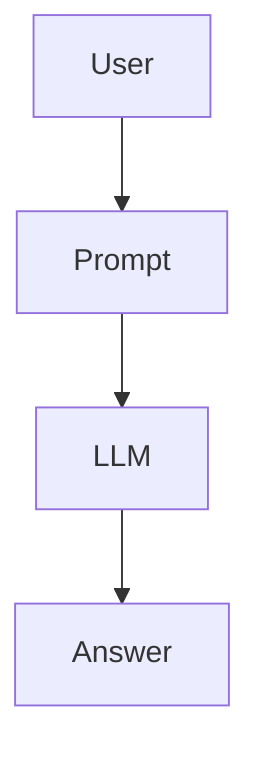
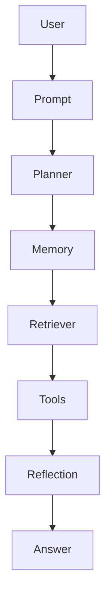
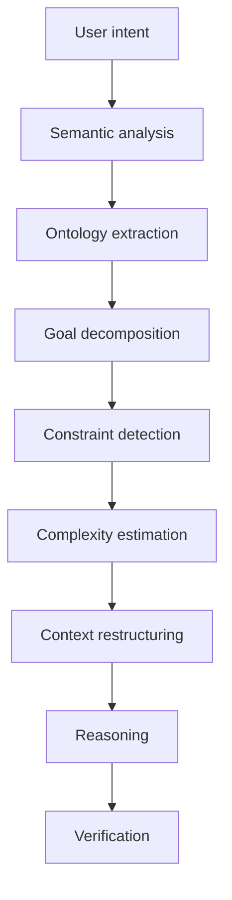

# Reverse Prompting VS Cognitive Load Ratio

## Reinterpreting Mihaly Csikszentmihalyi's Flow for Agents

I think there is a deeper connection than merely borrowing the metaphor of "flow". The challenge is to reinterpret Csikszentmihalyi's model as a property of **cognitive systems**, not of humans.

In fact, your recent threads suggest four complementary perspectives:

* **Donella Meadows**: regulate the dynamics of a complex adaptive system.
* **Pierre Lévy**: organize meaning within a semantic space.
* **Alexandre Monnin**: redirect socio-technical systems toward sustainable trajectories.
* **Mihaly Csikszentmihalyi**: maintain cognition within an optimal operating regime.

Viewed together, they begin to describe an architecture rather than separate theories.

## 1. Flow becomes "epistemic flow"

For humans:

> challenge ≈ skill

For an agent:

> task complexity ≈ effective cognitive capacity

The important point is that *effective* capacity is not simply model size.

It depends on things such as:

* available context
* retrieval quality
* tool availability
* memory organization
* planning depth
* decomposition strategy
* uncertainty estimation
* time/token budget

A 7B model with excellent retrieval may outperform a 70B model with poor context.

So "skill" is actually an emergent property of the entire cognitive architecture.

## 2. What is "too easy" for an agent?

An agent is under-challenged when it has excessive unused capacity relative to the problem.

Symptoms include:

* overthinking
* hallucinated complexity
* unnecessary abstractions
* verbosity
* recursive planning
* inventing distinctions that do not exist

You can observe this in many LLMs.

Ask:

> "Rename this file."

The model writes five paragraphs explaining naming conventions.

The task provided almost no cognitive load.

The excess capacity gets filled with plausible but unnecessary generation.

Humans get bored.

LLMs ramble.

## 3. What is "too difficult"?

The opposite regime is far more interesting.

The effective complexity exceeds the available cognitive resources.

Examples:

* context window saturated
* contradictory instructions
* missing ontology
* too many objectives
* hidden assumptions
* missing world model
* excessive branching factor

The symptoms become familiar.

The model begins to:

* forget constraints
* contradict itself
* latch onto superficial cues
* ignore part of the prompt
* randomly prioritize objectives
* oscillate between incompatible interpretations

Humans experience anxiety.

Agents experience instability.

## 4. Prompt engineering is really challenge regulation

This may be one of the most useful reinterpretations.

Good prompting is often described as "being clear."

I think a better formulation is:

> A good prompt keeps the agent inside its optimal cognitive operating region.

That means regulating:

* complexity
* ambiguity
* branching factor
* uncertainty
* objective count

instead of merely reducing token count.

## 5. Complexity is not prompt length

This is a crucial distinction.

A 20-page specification can be cognitively easy.

A two-sentence request can be nearly impossible.

Compare:

> Translate this document.

versus

> Design an ethical governance architecture balancing autonomy, resilience, political legitimacy, and ecological sustainability.

The second prompt is short.

Its search space is enormous.

So challenge should be measured by **solution-space entropy**, not token count.

## 6. ASC begins to make sense

This is where I think your ASC project naturally fits.

From previous discussions, ASC appears to be moving toward something like:

> semantic contextualization before reasoning

Rather than feeding raw language to an LLM, ASC attempts to stabilize the semantic landscape first.

That reduces unnecessary entropy.

Instead of asking

> "What do you think?"

ASC might transform the problem into

* ontology
* assumptions
* constraints
* objectives
* known unknowns
* perspective
* desired abstraction level

before inference begins.

That is remarkably similar to moving the task back into the flow channel.

## 7. Meadows would call this leverage

Donella Meadows repeatedly emphasizes that changing information flows often has greater leverage than increasing resources.

In an AI system, one might naïvely think:

> larger model

But Meadows would ask:

> Why is the system receiving pathological information in the first place?

ASC appears to intervene exactly there.

Instead of increasing intelligence,

it improves the information entering cognition.

That is a higher leverage point.

## 8. Lévy would call this semantic topology

Pierre Lévy argues that knowledge is fundamentally organized through navigable semantic structures.

An LLM prompt is normally just a linear text stream.

But cognition is not linear.

Meaning exists in a graph.

ASC seems to move toward explicitly reconstructing that graph before reasoning.

That dramatically lowers cognitive effort.

It is analogous to giving someone

* a map

instead of

* thousands of disconnected GPS coordinates.

## 9. Monnin would probably call this redirection

Monnin often criticizes technological systems that optimize locally while producing systemic pathologies.

Prompt engineering today often feels exactly like that.

We endlessly tweak prompts because the surrounding epistemic infrastructure remains weak.

ASC appears less interested in writing better prompts than in redesigning the conditions under which prompting occurs.

That is a redirection of the system rather than an optimization within it.

## 10. A possible formalization

I think there is an opportunity to define an explicit quantity analogous to Csikszentmihalyi's challenge-skill balance.

For an agent, define:

> **Cognitive Load Ratio (CLR)**

```
[
CLR = \frac{\text{Problem Complexity}}{\text{Effective Cognitive Capacity}}
]
```

![][image1]

where Problem Complexity could incorporate:

* semantic ambiguity
* ontology size
* branching factor
* uncertainty
* novelty
* objective conflicts
* planning depth
* external dependencies

and Effective Cognitive Capacity could include:

* model capability
* active memory quality
* retrieval relevance
* tool availability
* planning algorithm
* token budget
* time budget
* semantic organization of the context

The optimal regime is not where CLR is minimized, but where it remains within a bounded interval. Below that interval, the agent tends toward overgeneration, unnecessary elaboration, or idle reasoning. Above it, omissions, contradictions, forgotten constraints, and unstable reasoning become more likely.

---

This suggests a further step that I have not encountered explicitly in the current agent literature.

Most frameworks attempt to make agents **more capable** by adding tools, memory, planning, or larger models. A complementary approach would be to make the **problem dynamically fit the agent**. Before execution, a meta-cognitive layer would estimate the current cognitive load and continuously reshape the task: decomposing an overloaded problem, merging trivial subtasks, pruning irrelevant context, introducing or removing abstraction, and deciding when additional retrieval or clarification is warranted. In other words, the agent would regulate its own cognitive operating point to remain near an epistemic equivalent of Csikszentmihalyi's flow.

This idea also aligns with the cybernetic tradition underlying Meadows. Rather than treating intelligence as a fixed property, it treats successful reasoning as the outcome of a closed-loop control system that continuously maintains a favorable relationship between task complexity and cognitive capacity.

**Confidence:** 0.98

## Is this close to "reverse prompting" ?

Like : [https://www.instagram.com/p/DbdmFfuEm3H](https://www.instagram.com/p/DbdmFfuEm3H)

There is definitely an overlap, but I think they address different levels of the problem.

The "reverse prompting" shown in posts like the one you linked is typically:

> Given a desired output, infer the prompt that would have produced it.

That is essentially **prompt inversion** or **prompt reconstruction**. It starts from an artifact and recovers the latent instructions behind it.([Emergent Mind](https://www.emergentmind.com/topics/reverse-prompting?utm_source=chatgpt.com))

That is useful, but it assumes that the prompt is the main variable.

---

What you've been converging toward over the last few discussions is one level higher.

Instead of asking:

> What prompt should I write?

you're implicitly asking:

> What cognitive state should the agent be in before it even begins reasoning?

That is a much broader question.

I would distinguish four progressively more powerful approaches:

| Level | Question | Typical technique |
| ----- | ----- | ----- |
| 1 | What prompt generated this output? | Reverse prompting |
| 2 | What prompt should I write? | Prompt engineering |
| 3 | What problem is actually being presented? | Context engineering |
| 4 | What cognitive regime should the agent enter? | Meta-cognitive regulation |

Your ASC project seems to be drifting toward Level 4.

---

This also explains why prompt engineering eventually becomes frustrating.

Suppose the user asks

> Design an ecological governance framework.

Traditional prompting tries to improve the wording.

Reverse prompting tries to infer a wording from successful examples.

But neither asks whether the request itself is cognitively well-posed.

The real issues may be:

* conflicting objectives
* undefined terminology
* missing ontology
* excessive abstraction
* hidden assumptions
* several problems mixed together

Changing the wording cannot fix those.

---

This is where Csikszentmihalyi becomes interesting.

Instead of asking

> Is this a good prompt?

you ask

> Is this an appropriately regulated cognitive challenge?

That is a fundamentally different objective.

---

I actually think there is a missing preprocessing stage in most agent frameworks.



Most recent agent systems expand the middle:



But the input itself remains almost untouched.

I think your discussions point toward something more like



Notice that prompting has almost disappeared.

The important object becomes a **structured cognitive environment**, not a string.

---

There is another connection that I find particularly interesting.

Pierre Lévy would probably describe this preprocessing as constructing a **semantic topology**.

Csikszentmihalyi would describe it as moving cognition into the **flow channel**.

Donella Meadows would describe it as improving the **information flows** and **feedback loops** of the system.

Alexandre Monnin would likely describe it as **redirecting** the cognitive infrastructure instead of merely optimizing outputs.

These are remarkably compatible descriptions of the same transformation.

---

This also suggests a richer concept than "reverse prompting."

A possible progression would be:

* **Reverse prompting**: infer the prompt from the output.
* **Context inversion**: infer the latent assumptions, ontology, objectives, constraints, and missing information behind the request.
* **Cognitive calibration**: transform that representation so its complexity matches the current agent's effective capabilities.
* **Execution**: only then invoke the reasoning engine.

The first step reconstructs instructions.

The second reconstructs meaning.

The third regulates cognitive load.

Only the fourth actually performs the task.

---

One consequence is that the "quality" of a prompt becomes almost irrelevant. Two prompts with very different wording but equivalent semantic structure should converge to the same intermediate representation before any reasoning begins. If that intermediate representation is sufficiently expressive—capturing entities, relationships, goals, constraints, ambiguities, abstraction level, uncertainty, and estimated cognitive load—the reasoning engine receives a normalized cognitive substrate rather than raw language. At that point, prompts become merely one serialization of intent, not the primary interface.

I suspect this is closer to the long-term direction of capable agents than ever more elaborate prompt templates. As agents acquire better memory, planning, tool use, and self-monitoring, the leverage shifts away from optimizing prompts and toward **engineering the epistemic environment** in which reasoning occurs. That perspective is much closer to Meadows' systems thinking, Lévy's semantic architectures, Monnin's redirection, and Csikszentmihalyi's regulation of optimal cognitive engagement than to conventional prompt engineering.

**Confidence:** 0.99

[image1]: <data:image/png;base64,iVBORw0KGgoAAAANSUhEUgAAAW8AAABKCAYAAAB0KtUlAAAaCElEQVR4Xu2dB7AURRPH9TOLEXMOmLOYc44YQREVAwiYMWBWQNRSVBDMIgZQELOgYhbFHDEjBsxixpzDfPWbqv/V3MzevbuX2IOeql+9t73h9uZ2e3q6e2amm2666ZxhGIZRcyQCwzAMI/8kAsMwDCP/JALDMAwj/yQCwzAMI/8kAsMwDCP/JALDMAwj/yQCwzAMI/8kAsMwDCP/JALDMAwj/yQCwzAMI/8kAsMwDCP/JALDMAwj/yQCwzAMI/8kAsMwDCP/JALDMAwj/yQCo8aYbbbZ3D///OP+++8/N+OMMxbkc889t+vbt6+jnH322cl5DWWrrbby1z7llFOSfSGdOnVyTz31lD92r732SvZPCaaffnp3wQUX+DobPny4W3vttd3//vc/N+uss7pDDjnEPfHEE+7dd991w4YNS87NA0svvbS78MIL3V9//eXefPPNZH9jsOiii7q///7bP1stW7Ys2rfNNtv4e4jPMZqVRGDUILxgf/75ZyKHd955xyvOddddN9nXEJZccsmKlDdI0edFeV900UX+fs4444xkH+y5555+f16Vtxg7dmyTKW/YaKON3Prrr5/Ib775ZrflllsmcqNZSQRGDYLy/uOPPxI5jB492iui8847L9nXEJZYYomKlfcWW2yRG+W9+eab+3t56aWXkn0hWN95V96PPfZYkyrvLFq0aOEmTZpkynvKkwiMGqSc8n744Ye9ssKFEu9rCNUo70033TQ3yvvee+/193LkkUcm+0KOP/743CvvRx55pEHKG/dR+Df8H3ccvzEuJbnj5p13Xl8nlFh5c8wMM8xQuAYuqFg+yyyzFH2W0SASgVGDlFLevDSfffaZ9+2ut956XjZy5Ej38ccfu19//dV17NjRjRkzxn3xxReuQ4cOhfMWX3xxd8MNN7iXX37ZW6gPPPCAa926ddG1pbxxQVx88cVuxIgRbvz48f76q6yyStGxpZQ3288//7x7+umn3Ysvvui6d+/ufc/su/76690nn3zifvvtN7fjjju6c8891919993+3u+//37vh91ll13cnXfe6a/BvW6wwQZF14+ZeeaZvXuJovooxUorreQOPfTQItlBBx3knnnmGffcc8+51157zfXq1cvNNNNMfh/XmzBhgvv222/do48+6jbZZBN3++23uyeffNJ/D86dZ5553KWXXuruuece98EHH/h60/ddYIEF3FtvveW+/PJL98svv7jddtvNH0fd8BuefvrphWNFlvJGWXLsG2+84R5//HF/v9tvv73fx/eZPHmy//4UjkHO/alMnDjRy/irMv/883sZ9/fzzz972Y8//ui/67hx4/y+tm3buq+//rpwjq69++67F2Q//fSTbwDC+zXqTSIwapAs5U3Asl+/fv6l4WWWfJlllnFXXHGFl/PiLbXUUv5/LHT2E4iiW3zMMccUztl11129st9ss80KMilvlGmrVq28DMVx1VVXue+++86tuOKKhWOzlHe3bt3c999/71ZddVW/vdxyy3nFcOyxxxau36dPH38eCmrjjTcu3B+NEUqN7ydLDkX13nvvFa6fBfekUm3ADbcT8YMFF1zQb88xxxzebUGDglLFUl1rrbXc559/7pUtjR+NBcded9117vfff/eNDt8TGZYrZf/99/fbNLQ0es8++6yXX3nllQXrtV27dv47U7fhPWUpbwKwNLg0FGzvs88+7t9//3XrrLNO4RieB0r79u39Nr2n119/3a2++upF17rmmmv8cVLecPDBB3tZbHkDv8ULL7zgFbsaNaCBv/baa4sC6kaDSQRGDYLyprz66qsF3n//fa9YZHWFYHFTcA2wjQUrZYuCQSHH3VuUO9aYXkCsc8o555xTdNxcc83lsyCwiCWLlTdWM40BCio8F8XDfWt7hx128OfFx33zzTde8YcKon///v7YODMiBGtaZdlll032lwKLntK5c+ciOdZ1LEf5omgXXnjhggwXDeWEE04oyOacc04vu+SSS4quOWTIEC+PFR1WONelgZAsVt70UCgo7PBcGhMUsbZpKOjpfPTRR/4+1YiH58CZZ57pr1ep8obDDjvM76fnINlDDz3kn5f4WKNBJAKjBpHylqVWF1LesWKfb775vIK47777knNQMhQUMdullDeQZoe7Qw1ArLxRLhQaCVwQ4u233/buBJ237bbb+uO6du1adH3cPFi9oYzUP4os4yzwucptQiZFvD+EutQxuDcoceYFDQUFJSoZaZFY3+FxuCsoBG4lm3322b2MXlB4LFY6JVbeUoonn3xyQRYrbxo5Ci6LsF6p05tuuqnoevR4qIuvvvoqaZQEbiFKNcobi59eBi4jtulB4XaLjzMaTCIwapD6Km8sx1BOt5kyatSo5By5YPbdd1+/XU55v/LKK34ffly2Y+V91FFH+e0TTzwxOTdEKYYojFCOcgwVJiinfaGFFkquE0LDROEe4n0hKGq+M//fcccd/hyCd+ExuE4ouFMkI30PizY8jsaHooYP+K0oca9CropYeeNTplx++eUFWay8UZiUuvz5YsCAAf747bbbLtkHpFJSqlHeQCohDQP+7VNPPdUdcMAByTFGg0kERg1SX+W94YYbFsmxmigE3OJzBg0a5PfJ711OeWN5//DDDwUFFCvvnXfe2W8z0CQ+N0R+4UqU9/nnn++PrUt5b7311v44gpzxvhCsTnzN/D9w4EB/Tujzh0UWWcTLw/rC916J8sZHTqlUect6D7N7YuWt3kebNm2Kzs0CxUrQFSudHhBunPiYnj17+uuFypvAK4WBOmwTSF5jjTWKzpO76/DDD/f+d9IL42sbDSYRGDWIlDcKId6XRSnlDSgEApaxz5usCZSm0r6kvHl5w+NQCtwP2SKSxXneuAzIVCBIFn8+Pnf9L7dJNco79DWXQu6FUpY/A5BQwvquanzi7BMUGAUlJRluk2qUdxyElPJWsFOQ4ki9hoHgOM9bvnkyWsJzaWTC3wNI+eP3WHPNNX2MYvDgwUX7IUt5E2CloKDZ5v4VdBbUG88QmTNDhw5Nrms0ConAqDGwtqW867I6haw4WU8hvIgEBLHwpMB5yclm0QsLUt5keMjy4qUlq4AXVy4TkJLbb7/9CjLcAGRBEBSTldmjR4+ioB6BVEqsNPHTMogmlClgieIN5Vlwnyg4Cj5msjz4rgRA+Y4o4NVWW63oHHzTBFMVeCObh+NoRKTkAUszbvxQ7hSsfskUsOTzw8+R8saK1jUYsk+JR4TSoIYuG8AVwm8l65tGADeG/Pf4/XFlkNapc1R3/CbhtZhWgRI2iAR9iYvQM+H+6HVwzfA8kJst6xkzGoVEYNQQWDYEBlWYi4I0vayXSaBcePkoKH2Oj4N8pLOR6oZVx0vOKM04WIcSw8LEquNYslE4Hv9wmMlBBgl5yxQCWWQeaB9uCJQf2RCkmKFUtO+WW24pfDeUEcoafzuKUeXTTz/1fnECcnx3Cu6auDdQChQaFih5zpxHNg0uksUWWyw5FmhEyNLA3UDOc+/evQsWMqmM9AhU+G1QhgQM+d4UMmyoDxpGGkgKDZiyPriOlPfee+/t65I8bbKHlFIIWNh8dxXqJHSVdOnSxd8jjQ0NDKmeyFH+fJ4KipVnRXVHoR74rT/88MOCnMYy7P0cd9xx/jPJrIkVviArhnqNc9ONRiMRlIUf+sADD/QvIC89ebn4zOQbJAgUd3GZU4MHVVF+CnmgyMhuiD9D8CLxsKuQGsZ5vMi8rGQ/lDvfyAc8M3qBw5F3dcFx8XlYxrLSZSmzzT5ZqZxTrvFqKrgP7kf3oe2se0Phh6MRw5GHpXzeIZwbfhb/h2mTpeAY1WlYlyHIuD5uHV1fnxcfWw7mh2mKCdGMAomgJASPUJp001DQUpxYKfgp6f5h0YU+uRBFto8++uhkXynk8wz9dTxIWEy06lgfpsCNqQme9bqUdx5ZfvnlvZXP3DFsk5eelTtuNBqJIBNSfehi33jjjZmWEwoUK5z823if0LSgGmFWCXQvKWGXUWiUYOgjNYxah3xsSlb2R57ZY489/H0zIInBQsQ+4mOMRiURJDCQAz8Z+bHl/FdEvuOBAIJuIe6Ocso9C1pvCn7VeB+uG0o49NswahV83vjMFY/ARRgOyMk7GHXoCIw0RteSAx8fYzQqiaAI0r7kry4VxBEEmAiUxHIgmEO57bbbkn2lwN+GXz2Migvm5yCYQiCs2jkqDCOPyIcf+ser9TMb0xSJoAgm46HgLon3xRxxxBF+9Y1YDieddJK/TjjZUV2QvkW57LLLCjIeaHKG8bsTFQ9T1wzDMKYhEkEBLABShCikY8X7q0Huj3Bms7pQLjKj9Ui3YspPsk/wrTNLWSU5zaRChZM1VQK+u/g6hmEYOSMRFNAMbPi7G+K/kvsDF0c1EXSsfUpozZN/Ss6spg01DMOYRkkEBTQpUDyCKwtG2JXyiTNSjRIPZxYrrLCCj07HcgYuMHgjljOYAwt8SvoDrVixUtslfqdrkERQgBnUKLgr4n0xTPkYzn8QoqHBDIOO9wHTbcYT/miif0aYxcdrZJmtyGEYxjRMIiiAZcuyRgQGFQHPAqs5DCrGKG81a9pJ5odgSHV8febAoBDoDOVkmVDIOY/PyYK5JBgOXg0s2xRfxzAMI2ckgiKY7pPSqVOnZB9gnT/44INlZ7PDUsZvnjXo4Oqrr/aWdyxnpjKKRmsJ5migMCOdZIzsis83DMOYykkERRBgxCVCkJCRjJo8h4mMTjvtNJ+MH84eFyN/N5Pzh3KG0Gvi+HhBAOZ9YKY6BivEgVLNaMZCpmyTP15qYJBhGMZUTCJIwH3CWoek0aHEmbidGeSY4a3UiEvmJGFwj2Ylw82BtUzWiWZYoxCQlPsD6x03jaY3pZAWGPu98aEz4xkuDuY4nhJzm5BrjjspvldGxSEPJ9TKWhSX4C6NDtNpMvsc9YWcOVvoyTBzHRN+lQoCNyZMN0pjyIRj8b7mgNkJmf6UJdB4XnhOmKUQOb21cBbCKUV96qg+5zQmtVCvlcCcSeiFeM5wIxUYVYB/nMJK5vE+UhxJd6SxCuU0UuSu82KxXBWF+ZZZgowpUFllhkUCKKxbGF+3vqBMYhmwrBaF3Pl4X1PDWpY0eqxqw4ArplFg4jFiFUyFquli4/Oam3J1ZPXatDD1LiVc0Bj4PvEMptMYicCoAs16WCoNkl4L87mEmThYYhSUOy4i5lhm8BIWBkqdY8i2YTrNci6pasHCj2XAau/MHR27qJoaBkNpzpystE+mPaAXkwclU66OrF6bFuaG13zkIbhQWe0olk9DJAKjCupS3oD1HS5cS6yAEs85TTeWye3j8xsDpX3G8ikFa2XKhRYvBBFy1lln5VrJWL1OOVgQwpS3UW9KKW8UsaxtRoMyM6P2aUXueLQp12BGtvgzGgrZOMQrspQMMQtiBlgxmuALWZiGqfsM4xvhsl/1geA3pa6Jylq3bj3FlUxWHUG19Sq5/qcOw0mo+Mt2qThSJdRSvVYCPQeSJEh8aNmypZdRR7h/iC9lKe9wYQstiMH/WvGI+o3XB61REoFRBVnKmxGjrPqTNWhJo0MpWEgEkRigxF8WgVVgNxzVygKxZPwQoGWOF9ZepEseXpe8ePybBDkJdhIM5WFn7nSux3S8FP4HLVBLCqiCrsrV51rh0moKuOICUCEAppeJ74nLh89mqbJRo0bVmb7JS0cptQCw4OWLV5gnw4j6oC5Z6ovPjue54Z6GDBni91MfxBSIMRD8pm7JcJowYYKvC4LGbJP9xP0TDG/fvn3hWll1VJ96ZW1NApgqzNTJuAUsZE0DS9E4g+asV9x2GBwsqsJn4RePxzswPxFpv1j1zDs0YsQIH1zne7P6TzhoDgXJUnRME827MW7cOJ/+mzWwju/Pb8WSbTzfgM+efXx/FS1ezer1fCauIQVioUOHDn4/63ryLlF4jlmLADn3oEIKdHwfNUgiMKpAypuHCD9iuNRblvIGWd7xfh7ycCVwoFtO4EmLUbDqOiNeR44cWTiGBSt4SLUyuUa09unTp3AMLwclvhfQQsLhQCusQlZ2p4EJLUGCcOGCHDQiZDOQry9rh5XZserK+XqJA1CqDTixIDEKMFz1HqXMCk+hm4AAMr0Y9RqwRGmEaFjZR92zxiLzZ3OvZGHIGkNhUJ8tWrQoXC+rjqDaegUFMvl8yWgYCcypEWrueqUxpLA2JttMjYFyDBU4DQ3fhUIdas4hGhSUJ70QuQL5fSg0Bmxj/dI4YICEzxMxHVbE4vfRuUyGR6OoZ6xjx47+WlLegukzsixv0MLV4SA/XEq8oxhD8fE1SiIwqiDL8uYF4OGLlbOoRnljhfASh7KuXbv681EOWIBYGSgE7Ufhk8opZQ7llAzKgRIrGXyKFJa/k4zUzHAlpL59+/pjwtXFeZkpvHTxZwmCfJTOnTsn+0qBMiX9FEUbysneoQstucYWhNYVa6tSwtXbgRgDVm94/6wEQwkXXC5VR/WpV/nJw+kisJTDrJXmrFfgnugthK48GkQpX0GjQFFqq+jRo4eXd+/e3W9zHaxzfgsdo0C9GghgyTcaibDnRHYOjZa2ef4o1ShvjA8aZqxtyejhDho0KDm2hkkERhVkKW+QdadtlmzT/5Uqb15cCi4YdScBCwcLjIWdlVJIzn18byHllAygwGIlwwtF11/LWXG/8ctCw8LLF94f7hvur9xapereh6vFl0LTEbOgLSWeMgHoJWAtY+GRnUDp169fYT9KhRKP2MU65yUPZZqKGPdMKM+qo/rUK+AKwU2gbdwUoSusOetVMH8+jcaYMWO864H65L7CY6SAY+WtGUhDZU9PBpcF7iiuh5uKovgPCh5LuK6J7/jNKNUob1ADqAZk8ODByYDAGicRGFVQSnkTpFT3lu4lFqv2Vaq8ZUGOHj06+VxBV5qSlUoVUpeSQUlnKRnSzbBqsW6xSLt161a0n+4yPvz4vLrQ4hy82PG+ELrYekFRWhR6BPFxdMcpWi4P3zZ1yW9Adxy/Ngowng9n7NixXgmEMvVs4hc9q47qW6/6/jQQDD6JRwk3Z70C4wnowWH1ytpHqcbZT3JhxMqb+AcF1w/buLD4TbDemdMISxgDg6IFVDAOKHVNfEcPklKt8laDgm+f57euz6lBEoFRBaWUdwh+w4EDBxa2e/bs6c+JlTcKJlTeKB4sNwJu8TVFr169/LVKDRQRdE8pyhKJGwSsvCwloxeOYBAvCn7DcD9BQ0o5P2wWvOz0KAh+KfCZBVaXgoBa4Jb6i49D0XAtZRbgQ2UVKJQPLy2NXNZIXL5Tpco7q47qW6+MnGUfQTwsxHhK5OasV1Z4J2aD3zs8hjEH1B+TxylQWkp5M90FRdfA7UEJYxOabA7ljZuG+A33SRA0vr8Q3B2UWHkTWMai53++a+xOA+5/0qRJ/r579+6d7K9xEoFRBZUo77vuuquoq1up8ga6obxYcTbFgAED3Morr+ytcxR8PIUAUX2i/dqmy0hRUEgPvSilZLBYCBDSzb/11luT/SyQS2nXrl2RvG3btomVHkODQCH4GqdNAoqYOlGqHW4FAqhkOYTHoeBQAqyhKhlTOFSSzojbpJTyDmMGkFVH9a1X4JmZPHmyt1Dje23Oem3Tpo0/nh6hjqGHQnyB3grKU5kpUt5h6isoRVFGBAYHlnzY01HPiYaKzyeGQSNLYT2A8Hosl8jzzf+llDcBaPUM6C1kpUeyNCOFQC7utHh/jZMIjCrYaaed/MNB9zvehzVAJgSFIe+SM3KSoi6+4MWP/X+tWrXyLxEWHRYQMpRK+KDyYqHANYcGLwyWJj5iHSM/LhYXXdowW4UXnPOxAsPPFvi8KVmuGTIC8IvSPSaTAxluIvymut9yEADDt4oSJZjIvXD/uBJouJT+JegJ4E5QEJVjmZUSv3U4DwwKkfRAMnFwJeDzRmkogyE8DsssVDLK1gmDm6XqqCH1ij+Y0r9//2Rfc9YrhgF1Stqf6oHgJRY8zyPPkeIMUt6kAKpXQM44rjWySZRJQryBot4LxxIHomCB8z/HksFCdglKWMYMvneUu67FUoaU+FmgEeceadTplWWlR/IOkgEWN6pTCYnAqAAeSiw25UPzkhJMQqYVgMLcXXU76eppsi6sLgJtRN+1wAQFRRRG28kPHjZsmL8m0XNS2eI87y5dunjrmJeNFzZOFcPaoluJoiITBX8gcpQa/lUKllI8+yPQWPDZWUOtAescFwWKhp4DfnJZTZVAtx1f6/jx431aJPVH48S8L/GxwMvMdyBwy/clxzhuCOl1ZBXS0uji42umnlXI0sCqxdLUxGkotOHDh5eto4bUq7JnSqWuNWe9Yt2iQFFyNDbcPwFx7g/XklwwUt5MVIefnu/Mb0BaajhimP/5bIKyQ4cO9QF7GiHqimuGbj6eb67F76GcfP2e1L/GRdADxCgJzyMnfeLEib5XiBsm/l5Ag8r7EcunAhKB0YRgUcVBM7rMKIFY3hyQEaAuO58fW6a1CD0QuslYcLLe+F5kV9DVZhpjjbxTnWs7/H04FyVUnzqqzzm1QCmfd1NBvek31O8RH1MXcSbPVEQiMIyaBisOiy2WA0ErRl3GcqMyGN3YnMq7PpDfz0Ay/idXn55ZfMxUQiIwjJoGxUJgk2BfGAjE94t7qjGn2Z3WIFhKyYp/5AXcafjRsdrJflHMYCokERhGzUP2Av5VfKjEAPjL3CBxloRROfiXNWcII4jD4GyeIHhJeijxIeIY8f6piERgGIZh5J9EYBiGYeSfRGAYhmHkn0RgGIZh5J9EYBiGYeSfRGAYhmHkn0RgGIZh5J9EYBiGYeSfRGAYhmHkn0RgGIZh5J9EYBiGYeSfRGAYhmHkn0RgGIZh5J9EYBiGYeSc/wORQ1YuVDfqEAAAAABJRU5ErkJggg==>
