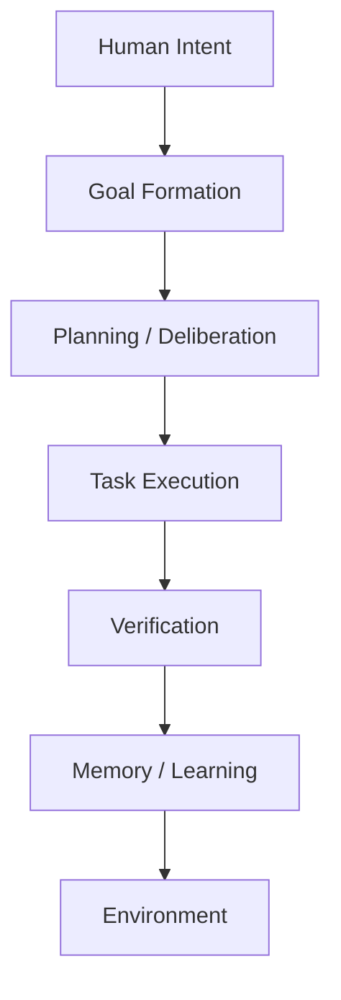
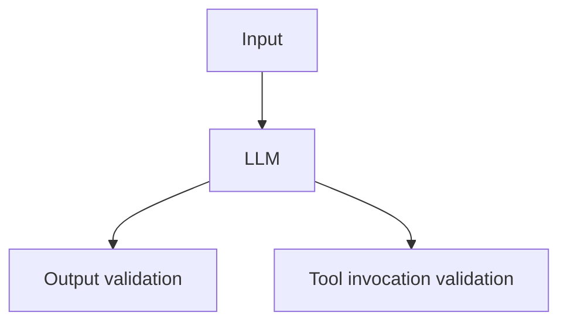
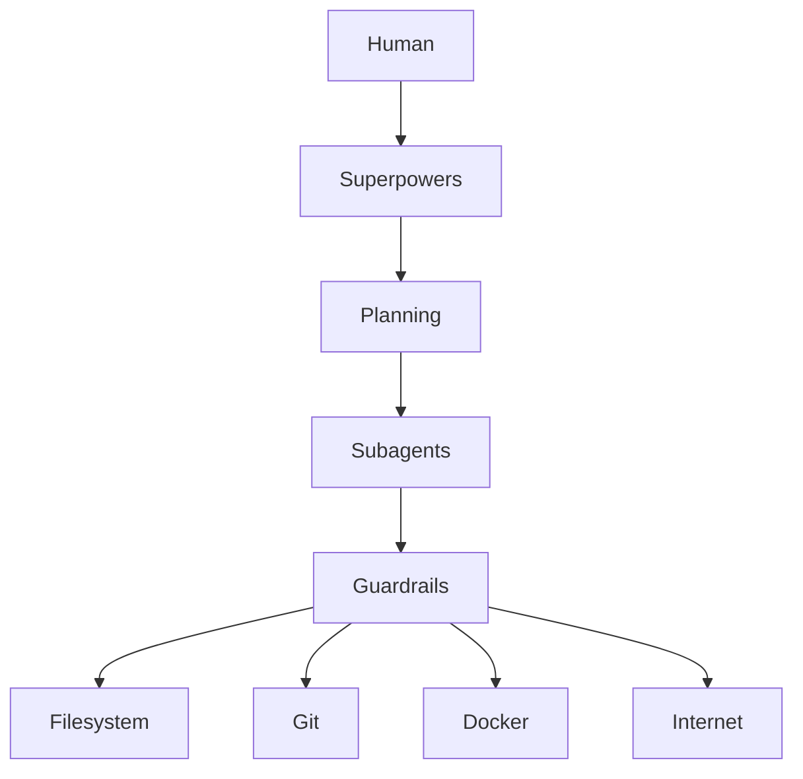

# Cognitive Institutions - a possible Meta-Framework

## on Comparing Implementations

[https://chatgpt.com/share/6a711897-45f0-83e9-8840-48b6dfba101f](https://chatgpt.com/share/6a711897-45f0-83e9-8840-48b6dfba101f)

What are the differences between the obra/superpowers and guardrails-ai/guardrails projects ? Actually, based on recent chats, can we "formalize" a set of comparison criteria for agent-related tools like these ?

–

These two projects operate at almost opposite layers of the agent stack.

| Dimension | Superpowers | Guardrails |
| ----- | ----- | ----- |
| Primary goal | Improve how an agent works | Constrain what an agent is allowed to do |
| Layer | Cognitive / workflow | Validation / safety |
| Target | Coding agents | Any LLM application |
| Philosophy | Better process → better outcomes | Better constraints → safer outcomes |
| Main abstraction | Skills, methodologies, workflows | Validators, guards, policies |
| Typical implementation | Prompt + skills + orchestration | Python middleware around LLM calls |
| Acts on | Planning and execution | Inputs and outputs |
| Success metric | Higher engineering quality and autonomy | Lower risk and higher reliability |

Superpowers describes itself as an *agentic skills framework and software development methodology*. Rather than focusing on the model itself, it injects reusable "skills" (brainstorming, planning, TDD, code review, worktrees, subagent delegation, etc.) into coding agents like Claude Code, Codex, Cursor, Pi and others. It attempts to make an LLM behave more like a disciplined engineering organization. ([GitHub](https://github.com/obra/superpowers?utm_source=chatgpt.com))

Guardrails is almost orthogonal. It wraps LLM calls with input/output validators. Those validators check things like schema correctness, hallucination detection, PII, profanity, structured JSON, policy compliance, and can reject, repair or retry outputs before they reach the application. ([GitHub](https://github.com/guardrails-ai/guardrails?utm_source=chatgpt.com))

## In systems terms

Since we've recently discussed Donella Meadows, Pierre Lévy, Alexandre Monnin and agent architectures, I think a useful decomposition is:

Superpowers mostly lives here:

- Goal Formation
- Planning
- Execution
- Verification

Guardrails lives here:

One improves cognition.

The other constrains behavior.

## They are complementary

An ideal coding agent would use both.

Superpowers says

> "Here's how to think."

Guardrails says

> "These outputs are unacceptable."

Those are different responsibilities.

## Towards a formal comparison framework

I actually think this is the missing piece in the current agent ecosystem.

People compare LangGraph vs CrewAI vs Agno vs Pi vs Hermes vs Guardrails vs Superpowers as if they all occupy the same layer.

They don't.

I would instead classify every project along approximately 15 dimensions.

### 1. Purpose

What problem does it solve?

Examples

* orchestration
* planning
* memory
* safety
* evaluation
* retrieval
* tool use
* coordination
* simulation
* learning

### 2. Architectural layer

For example

- User
- Interface
- Conversation
- Planning
- Reasoning
- Execution
- Tool abstraction
- Runtime
- Infrastructure

Many projects operate at different layers.

### 3. Cognitive function

Borrowing loosely from cognitive science.

Examples

* perception
* attention
* working memory
* episodic memory
* semantic memory
* planning
* reasoning
* reflection
* action
* learning
* self-evaluation

This was already emerging in our discussions about Pi and Hermes.

### 4. Degree of autonomy

Questions like

Can it

* answer one prompt?
* execute one task?
* execute plans?
* execute recursively?
* self-decompose?
* recover from failure?

### 5. Time horizon

Can it operate over

* seconds
* minutes
* hours
* days
* persistent projects

Superpowers explicitly optimizes for long engineering sessions.

### 6. Memory model

Examples

* None
* Conversation
* Semantic
* Vector
* Knowledge graph
* Filesystem
* Long-term
* Procedural
* Reflective

One of the strongest differentiators between Pi, Hermes, Agno, etc.

### 7. World model

Does the framework maintain an explicit representation of

* goals
* plans
* state
* resources
* dependencies
* constraints

or does it simply rely on the LLM context?

### 8. Control mechanism

How does it influence the model?

Examples

* prompts
* skills
* rules
* symbolic constraints
* finite state machines
* validators
* graph execution
* planners
* schedulers

Superpowers:

- mostly prompts + skills

Guardrails:

- validators

### 9. Feedback loops

Inspired directly by Meadows.

Questions

Does the system have

* monitoring
* evaluation
* retries
* reflection
* repair
* adaptation
* learning

### 10. Leverage point (Meadows)

This one is particularly interesting.

Every project intervenes at a different leverage point.

Examples

Changing

* parameters
* feedback loops
* information flows
* rules
* self-organization
* goals
* paradigms

Guardrails mainly modifies **rules** and **information flows**.

Superpowers modifies **decision processes** and partially the **goal formation** process.

That makes Meadows surprisingly applicable here.

### 11. Representation formalism

Inspired by Pierre Lévy and IEML.

What structures does the framework manipulate?

* Natural language
* JSON
* AST
* Graphs
* Plans
* Skills
* Knowledge graphs
* Ontologies
* Typed actions
* Events

### 12. Human-agent interaction model

Examples

Human

* commands
* reviews
* collaborates
* supervises
* teaches
* approves

Superpowers is strongly collaborative.

Guardrails is mostly invisible.

### 13. Extensibility

How are new capabilities added?

* Plugins
* Skills
* Validators
* Tools
* Policies
* MCP
* Python
* DSL

### 14. Verification philosophy

Does it rely on

* trust
* tests
* symbolic proofs
* validators
* human review
* consensus
* multiple agents

Superpowers emphasizes TDD and code review.

Guardrails emphasizes validation.

### 15. Adaptivity

* Static?
* Dynamic?
* Self-modifying?
* Learns?
* Reflects?
* Updates memory?

## Applying this framework

This becomes much more interesting when comparing the projects we've discussed over the last several conversations:

| Project | Primary role |
| ----- | ----- |
| Pi | Agent runtime and architecture |
| Hermes-agent | Persistent cognitive architecture |
| Agno | Multi-agent orchestration framework |
| LangGraph | Deterministic execution graph |
| Superpowers | Cognitive methodology / procedural skills |
| Guardrails | Runtime validation and policy enforcement |
| Mem0 | Memory subsystem |
| MCP | Tool interoperability protocol |
| Docling | Document perception / ingestion |
| FAISS | Vector memory backend |

Notice that these are mostly *composable modules*, not competitors.

## A possible meta-framework

The direction I think would be most valuable—especially in light of our discussions on Meadows, Lévy, Monnin, and Csikszentmihalyi—is to evaluate agent frameworks not as software libraries but as **cognitive institutions**. Each project can be characterized along four orthogonal axes:

* **Cognition**: planning, reasoning, memory, attention, reflection.
* **Governance**: constraints, policies, permissions, verification, accountability.
* **Ecology**: interaction with humans, tools, other agents, and the environment.
* **Evolution**: learning, adaptation, self-modification, and long-term development.

This reframes the ecosystem from a collection of libraries into a modular architecture for artificial cognitive systems. It also provides a stable basis for comparing future projects without being tied to transient implementation details.

**Confidence:** 0.98
