# AI Agents Leverage Points (Places to Intervene in a System) Applicability

The leverage points are ordered from **least effective (12)** to **most transformative (1)**. One of Meadows' central arguments is that engineers and organisations spend most of their effort at levels 10–12, while the largest improvements usually come from levels 1–6.

Given our previous discussions around **Pi**, **Agno**, **Hermes-Agent**, local LLMs, memory architectures, tool use, RAG, and building a lightweight agent framework, the leverage points map remarkably well onto AI agent design.

| # | Leverage Point | Explanation | AI Agent Context | Concrete Implementation Ideas | Relative Impact |
| ----- | ----- | ----- | ----- | ----- | ----- |
| 12 | Constants, parameters, numbers | Numerical tuning without changing behaviour. | Model temperature, context window size, retry count, embedding dimensions, timeout values. | temperature=0.2→0.4, chunk size 1024→2048, max_iterations=10 | ★☆☆☆☆ |
| 11 | Sizes of buffers | Increase or decrease storage capacity. Buffers absorb fluctuations. | Memory size, vector DB capacity, cache size, conversation history length. | SQLite → Postgres, larger embedding store, longer episodic memory | ★☆☆☆☆ |
| 10 | Structure of stocks and flows | Physical/logical architecture of the system. | Memory architecture, event pipeline, tool orchestration, message routing. | Separate semantic memory from episodic memory; event bus instead of direct calls | ★★☆☆☆ |
| 9 | Delays | Time between action and effect. | Memory consolidation, planning frequency, evaluation cadence. | Batch summarisation nightly instead of every turn; delayed reflection agent | ★★☆☆☆ |
| 8 | Balancing feedback loops | Mechanisms that stabilise behaviour. | Hallucination detection, confidence checking, evaluator agents. | Self-critique, verification loop, automatic retries on uncertainty | ★★★☆☆ |
| 7 | Reinforcing feedback loops | Positive feedback amplifies behaviour. | Learning from successful tasks, accumulating knowledge. | Skill library grows automatically; successful workflows become reusable | ★★★☆☆ |
| 6 | Information flows | Who knows what and when. | Which agent sees which memories, tools, observations. | Planner sees goals, coder sees repository, researcher sees Internet, memory manager sees all | ★★★★☆ |
| 5 | Rules | Explicit constraints and incentives. | Agent permissions, planning rules, tool policies. | "Never execute shell without approval", "Always verify web facts", capability permissions | ★★★★☆ |
| 4 | Self-organisation | Ability to restructure itself. | Dynamic agent creation, workflow generation. | Spawn specialised agents automatically; create new skills from repeated tasks | ★★★★★ |
| 3 | Goal | Purpose the system optimises. | What the agent is actually trying to maximise. | "Answer accurately" vs "Complete the user's project" vs "Continuously improve the knowledge base" | ★★★★★ |
| 2 | Paradigm | Underlying worldview. | Philosophy of intelligence. | Agent as chatbot vs operating system vs autonomous collaborator | ★★★★★+ |
| 1 | Ability to transcend paradigms | Recognise every paradigm is limited. | Meta-learning about architectures themselves. | Agent evaluates whether its own assumptions remain valid and replaces them | ★★★★★★ |

## Applying this to an AI agent architecture

### 12. Parameters

This is where nearly everyone begins.

- temperature
- top_p
- max_tokens
- retry_count
- embedding_model
- chunk_size

Changing these often produces only incremental improvements.

For example:

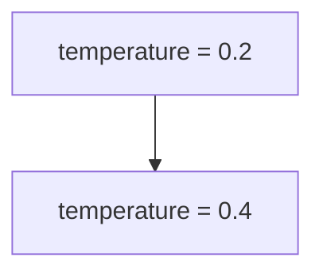

may improve creativity while reducing determinism.

Useful, but rarely transformational.

### 11. Buffers

Buffers smooth variation.

Examples include

* context window
* vector database
* memory cache
* document cache
* message queue

For Pi or Hermes this might mean

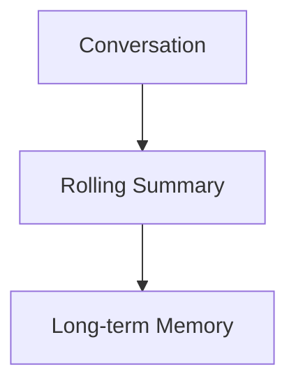

instead of simply truncating conversations.

### 10. Stocks and Flows

This is where architecture begins.

Instead of

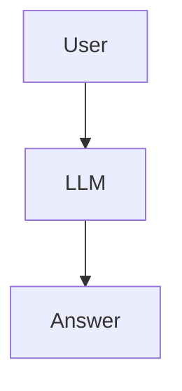

you might build

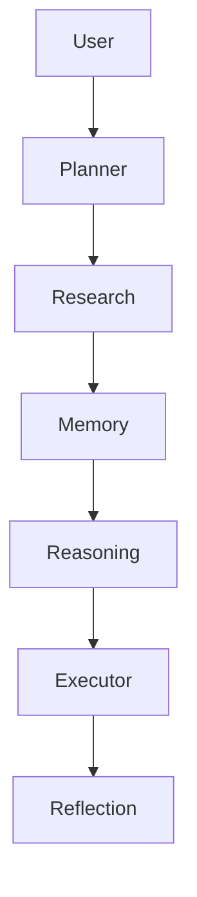

Nothing about the models changed.

The information flow changed.

This generally produces much larger improvements than parameter tuning.

### 9. Delays

Most current agents update memory immediately.

Meadows would ask:

Should they?

Perhaps

Immediate memory

creates noise.

Instead

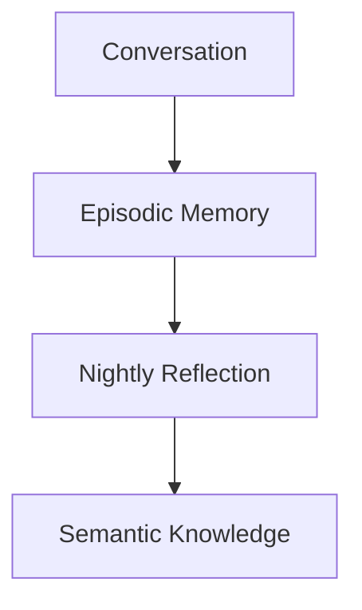

Now memories become curated instead of accumulated.

This is remarkably similar to human sleep.

### 8. Balancing Feedback

Most open-source agents lack sufficient negative feedback.

A better architecture:

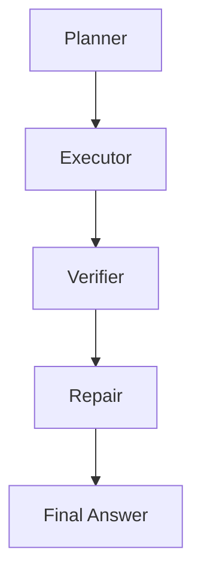

Examples

* compile errors
* failing tests
* hallucination detector
* source verification
* confidence estimation

Hermes already contains elements of this philosophy.

Pi could adopt similar evaluator loops.

### 7. Reinforcing Feedback

Good systems become better over time.

For example

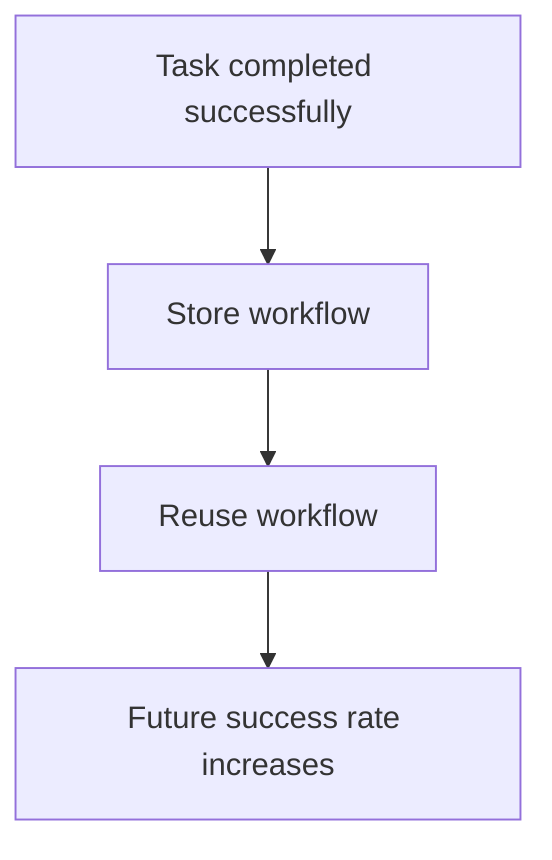

Eventually

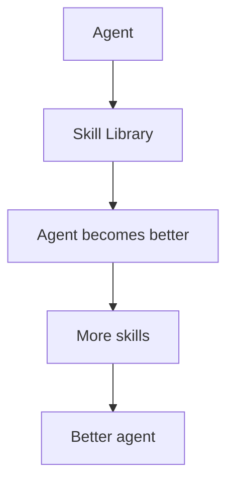

This positive loop is what makes human organisations improve.

### 6. Information Flow

One of Meadows' favourite leverage points.

Many agents currently give every component identical information.

Instead

```text
Planner
    sees:
        goals

Coder
    sees:
        repository

Researcher
    sees:
        web

Memory
    sees:
        long-term knowledge

Reviewer
    sees:
        everything
```

Information becomes specialised.

This reduces cost while improving accuracy.

This is precisely where multi-agent systems become significantly more effective.

### 5. Rules

Rules define behaviour.

Instead of

Agent can execute anything.

you might define

```text
Filesystem
    read-only

Network
    researcher only

Shell
    approval required

Database
    transactional only

Memory
    append only
```

This improves

* safety
* reproducibility
* debugging

Agno and Hermes both incorporate explicit capability and tool abstractions that align with this idea.

### 4. Self-Organisation

This is where systems begin changing themselves.

Imagine

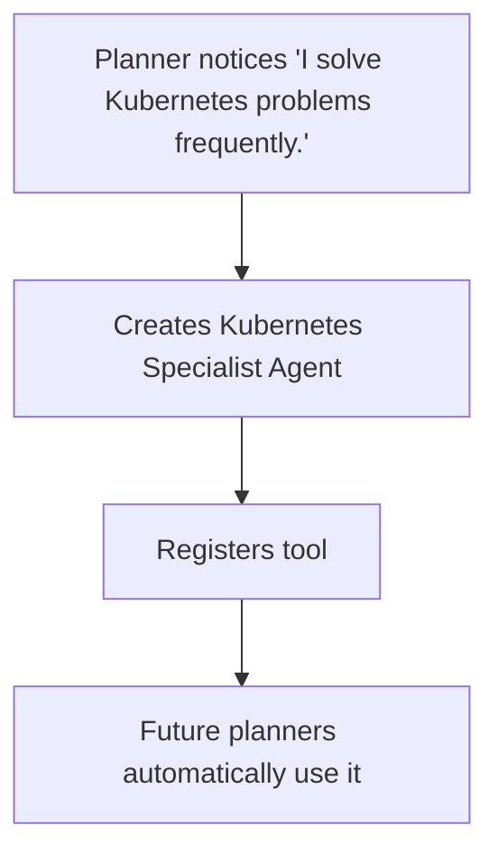

No human intervention.

Another example:

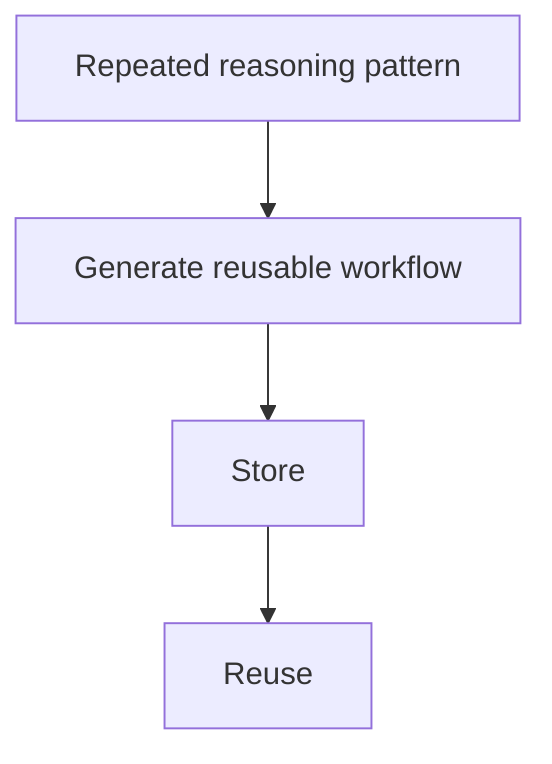

The framework becomes progressively richer.

### 3. Goals

Many agent frameworks optimise for answering questions.

That may be the wrong goal.

Instead

- Goal:
- Complete the user's project.

Now the agent naturally chooses to

* plan
* remember
* verify
* automate
* revisit unfinished work

Changing the goal changes every downstream design decision, often more than changing the implementation itself.

### 2. Paradigms

This is the deepest shift most architectures can make.

Examples include:

| Paradigm | Consequence |
| ----- | ----- |
| LLM as autocomplete | Minimal orchestration; prompt engineering dominates. |
| LLM as reasoning engine | Planner/executor loops, reflection, verification. |
| LLM as operating system | Tools, permissions, memory, scheduling, persistent processes. |
| Society of agents | Multiple specialised agents with communication protocols. |
| Cognitive architecture | Distinct memory systems, planning, learning, metacognition, executive control. |

Pi, Agno, and Hermes largely differ at this level. Pi leans toward a modular cognitive architecture, Agno emphasizes composable agent workflows and tooling, and Hermes-Agent explores richer long-lived cognition and memory.

### 1. Transcending Paradigms

This is Meadows' highest leverage point.

A truly adaptive agent would not commit permanently to any single architecture. Instead, it would treat architectures themselves as hypotheses to be tested. For example:

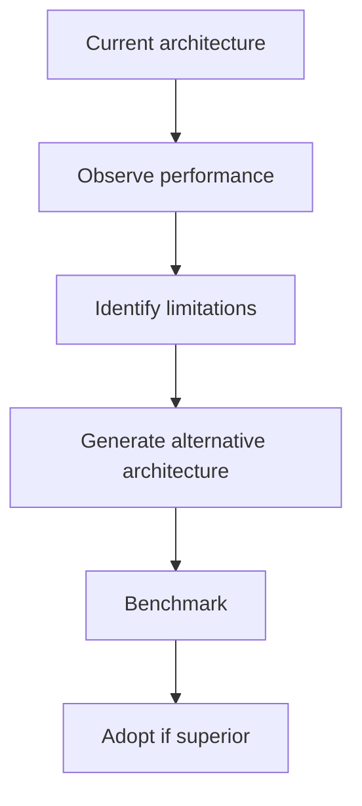

In practical terms, this could mean maintaining multiple planning strategies, memory systems, or coordination patterns and selecting—or even evolving—the most effective one for a given domain.

Such an agent becomes capable of improving not only its knowledge but also the way it reasons and organises itself. This moves beyond "learning new facts" toward "learning better ways to learn."

### Synthesis for your project

From the discussions we've had about building a lightweight, locally runnable agent framework inspired by Pi and Hermes, the highest-return investments are unlikely to come from experimenting with different local LLMs or adjusting inference parameters. The largest gains are more likely to come from:

1. Designing distinct episodic, semantic, procedural, and working memory systems rather than a single conversation history.
2. Building explicit planner–executor–reviewer feedback loops with verification and reflection.
3. Treating information routing as a first-class concern so each specialised agent receives only the context it needs.
4. Allowing the framework to accumulate reusable skills and workflows from successful executions.
5. Defining the framework's goal as completing long-term projects rather than generating isolated responses.
6. Eventually enabling the framework to evaluate and evolve its own workflows and architecture through controlled self-organisation.

This progression closely follows Meadows' hierarchy: it starts with architectural improvements (levels 10–6), progresses through behavioural changes (levels 5–3), and ultimately approaches adaptive cognitive systems (levels 2–1), where the agent can improve not only what it knows but how it is structured to solve problems.

**Confidence:** 0.99
