# Edgar Morin — La Méthode

A study note for **autonomous AI agents** trying to make sense of a world, and for the three-scope architecture that should host them: **ASC**, **Projet Complexe**, and **Projet Complexe ASC**.

Edgar Morin’s *La Méthode* is not a series of books. It is one of the most ambitious philosophical and epistemological projects of the twentieth century. Across six volumes published between 1977 and 2004 (Seuil 2008), Morin attempts nothing less than a reform of scientific thought. His central argument is that reductionism — the fragmentation of knowledge into isolated disciplines, isolated objects, isolated operations — cannot adequately describe living systems, societies, or knowledge itself. Instead he develops **pensée complexe**: a way of reasoning that constantly connects parts and wholes, order and disorder, autonomy and dependence, the observer and the observed.

That is not a motto. It is a method for any being — human or artificial — that must *know* and *act* inside an environment that it also helps to produce.

The question this note keeps asking, volume by volume, is the same question the three projects already share:

> How can a computational environment become sufficiently explicit, nameable and composable that both humans and autonomous agents can navigate and act within it?

Morin did not write about language models. He wrote about organisation, computation, information, communication, subjects, ideas, machines, ethics. Those are exactly the joints at which current agents fail: they autocomplete without existing-for-themselves; they retrieve without knowing; they execute without an ecology of action; they cohere without remaining open to contradiction; they accumulate context without regenerating organisation.

This note is a **deep dive**, chapter by chapter, through all six volumes. It is filtered: not every biological pictogram, not every historical illustration. Everything that bears on naming, composition, autonomy, knowledge-of-knowledge, agent/environment loops, command/communication, paradigms, and action under uncertainty is kept and pressed until it yields a design constraint.

It is **detailed but terse**. Short paragraphs. French terms retained. Book figures are the original Seuil 2008 JPEGs, copied as-is — no conversion. Mermaid appears only as a labeled reconstruction of a simple topology. Layout that *is* the argument (spirals, nested circles, typographic posters) stays as a JPEG.

---

## How to read this note

Read it as Morin asks to be read: in a **spiral**, not as a stack of modules to implement in order.

Tome 1 gives the physis of organisation (the computational *world* as organised, not as a pile of objects).
Tome 2 gives living autonomy (*autos*, *computo*, eco-auto-re-organisation).
Tome 3 gives knowledge of knowledge (how a computant being can know, err, and know that it knows).
Tome 4 gives the ecology and organisation of ideas (paradigms that govern what an agent is even allowed to think).
Tome 5 gives the human complex and the **méta-machine** problem (what agents do to us, and what a Léviathan of software would be).
Tome 6 gives ethics under uncertainty (ecology of action, comprehension, cognitive democracy, regeneration).

Each chapter ends with a **For agents** block. Those blocks are not “applications” glued on afterwards. They are the same argument, restated in the vocabulary of a computational environment.

Do not extract a framework from one volume and discard the rest. Morin’s method is the circulation. Break the circle and you are back to simplification: Matter *or* Mind, Code *or* Context, Tool *or* Thought, Safety *or* Autonomy.

---

## The three scopes (do not collapse them)

Morin’s first move against classical science is to refuse a master term. The same refusal applies here.

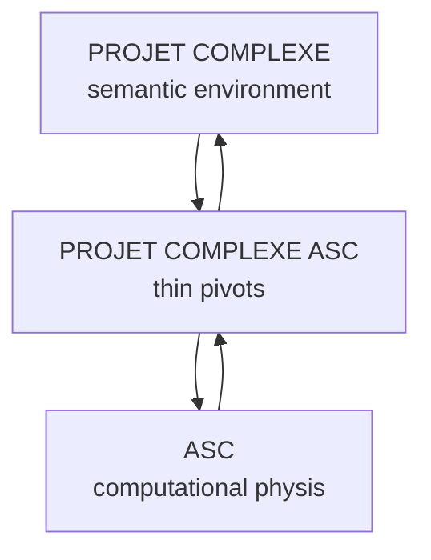

*Reconstruction, not a book figure.* The book’s point is the circulation.

| Scope | Asks | Must remain | Must not become |
| ----- | ----- | ----- | ----- |
| **ASC** | What is this thing, where is it, how is it addressed, what can be done with it? | A generic vocabulary over files, processes, machines, services, workers, capabilities, hooks, entry points, execution, composition. | A second-brain ontology; a theory of ideas; a desktop; a State. |
| **Projet Complexe** | What am I trying to accomplish, what do I know, how are things related, how should I act? | Tasks, knowledge, research, relations, projects, agents as a semantic environment. | An operating-system; a process manager; a second ASC. |
| **Projet Complexe ASC** | Which generic ASC possibilities does this environment expose, under which stable names? | Thin entry points: `research`, `index`, `extract`, `recognize`, `relate`, `build`, `run-agent`, `inspect-agent`, `stop-agent`, `publish`. | A second application layer; a place that smuggles PC concepts into ASC or ASC concepts into the GUI. |

The architectural rule, in Morin’s language: **keep the circular implication**. Physics of computation and anthropo-semantic meaning depend on each other. Articulation is the method. Reduction either way is the *école du Deuil*.

---

## What “autonomous agent” means in this note

Not a chat session with tools.

Morin’s living being is not a substance called Life. It is an organisational complex. An agent, analogously, is not a substance called Intelligence. It is an organisational complex that must hold, at once:

- a **computo** (computation *for itself*: self/non-self, named runtime, traces);
- an **eco-relation** (environment of files, processes, indexes, other agents, the user — dependent autonomy);
- a **genos/phenon** split (declarations and species of capability vs this run, this process, this session);
- a **sensorium / motorium / strategy** loop (observe, act, know — not a pipeline);
- **RE** (reorganisation, rememorisation, reflection — not retry);
- **command ↔ communication** in dialogic (execution is real; inspection can modify command);
- a **paradigm** it may not know it has (chatbot vs OS vs collaborator vs society of agents);
- an **ecology of action** (intention ≠ effects; long-term unpredictability);
- an **observer** who can be inspected and stopped (no anonymous apparatus).

The incompressible formula of Tome 2 is the acceptance test:

> auto-(géno-phéno-égo)-éco-re-organisation (computationnelle-informationnelle-communicationnelle)

Drop any hyphen and you no longer have an agent in Morin’s sense. You have a tool, a daemon, a retrieval function, or a myth.

---

## Three principles of complex thought (used constantly below)

From the lexicon Morin attached to the six volumes:

1. **Dialogique** — two (or more) logics, complementary, concurrent and antagonistic, that nourish each other and do not resolve into a higher unity. Not Hegelian dialectic. Antagonisms remain constitutive. For agents: programme *and* strategy; analogical *and* logical; command *and* communication; sapiens *and* demens; risk *and* precaution.

2. **Récursivité organisatrice** — a loop whose products are necessary to its own production. Not “a function calling itself”. Not mere feedback. The being is the loop. For agents: memory that produces the organisation that produces memory; pivots generated by use that then constrain use.

3. **Hologrammatique** — the part is in the whole *and* the whole is in the part. A cell contains the genetic information of the organism; a culture is in each mind. For agents: a capability, a document, a trace should carry enough of the whole (name, provenance, permissions, relations) that the part is navigable without loading the entire environment — without pretending the part *is* the whole.

Plus the **tetralogue**, which is not a fourth principle but the generative physis:

**ordre / désordre / organisation / interactions**

A computational environment that only models order (schemas, types, allow-lists) treats noise as a bug. One that only celebrates disorder (unconstrained agents, unindexed notes) never becomes addressable. Organisation is what makes a name a name. Interactions (hooks, compositions, messages, process boundaries) sit in the middle because nothing happens without them.

---

## Figures

Original JPEG rasters from the Seuil 2008 EPUBs, in `edgar-morin-la-methode/`. No PNG conversion: thresholding destroyed serif text and thin lines (see `t1-schema11-12-13`). The folder holds only the figures embedded in this note.

Shared front-matter diagrams (reprinted in later volumes) are shown once, in Tome 1.

---

## What this note is not

- Not a substitute for the books.
- Not a general systems-theory digest.
- Not an implementation spec, a prompt library, or an ontology to paste into ASC.
- Not a claim that Morin “anticipated” transformers. He anticipated the *organisational* problems that transformers, used as agents, make acute.
- Not encyclopedic accumulation. *En-cyclo-pedie* in Morin’s sense: putting the crucial joints in cycle.


---

# Tome 1 — La Nature de la Nature (1977)

Seuil 2008. First published 1977. Method of complexity is elaborated here: not a catalogue of physics, a cycle of two interrogations — organisation (via système) and the inseparability of ordre / désordre / organisation in a **tetralogue**. Do not dissociate knowledge of nature from the nature of knowledge. Every object is conceived in relation to a knowing subject rooted in a culture, a society, a history.

Core question: How can a computational environment become sufficiently explicit, nameable and composable that both humans and autonomous agents can navigate and act within it?

---

## Mission impossible (2008 liminary)

The word *méthode* settled after Salk (1969–70). GST, Bateson, Wiener, Ashby, von Neumann, then von Foerster and Günther, recast knowledge itself. Hegel/Marx dialectic became **dialogique** (contradictions assumed). Linear causality yielded to **boucle**, not only retroactive but **récursive**. *Le Paradigme perdu* (1973) was a premature branch: human as trinitary individu/société/espèce. *La Méthode* followed. NYU intro (Sept. 1973) was a nucleus containing the sequel virtually. Original plan: one volume, four parts. The draft exploded; Tome 1 was isolated, rewritten at least three times. Victorri forced a full redo of Part III. True genesis of method-principles happened here; a draft of *La Connaissance de la Connaissance* already retroacted on it.

Each volume is hologrammatic: a part containing the whole. Tome 1 is not closed on the physical universe. The **tétragramme** concerns physical, living, and historical complexity alike. Two founding interrogations: (1) système → organisation; (2) ordre (laws, regularities, cycles) / désordre (hazards, turbulences, collisions, dispersions) / organisation until their inseparability.

---

## Introduction générale — L'esprit de la vallée

Heraclitus: the waking sleep. San Juan: unknown point, unknown path. Bronowski: science is neither absolute nor eternal. Popper: understand the world, ourselves, and our knowledge as part of the world.

### L'évadé du paradigme

Urgent problems require tearing oneself from actuality. Principles of knowledge occult what is vital to know. Relation is treated poorly: two terms absorbed into a master-term. Anthropo-social science needs articulation on the science of nature; that requires reorganisation of the structure of knowledge.

*Le Paradigme perdu*: man is not alternately individual, social, biological. Sapir: as absurd as matter obeying alternately chemistry and atomic physics. Dissociation of individu/société/espèce breaks their simultaneous relation. Empirical suture since ~1960 (primate ethology, hominin prehistory) requires conceiving man as **concept trinitaire** — no term reducible. That calls a principle of complex explanation and a theory of auto-organisation.

Three questions: What does the radical *auto* mean? What is organisation? What is complexity?

Organisation is original only if conceived as physical. Living and anthropo-social organisation are transformer-developments of physical organisation. Liaison physics–biology must be organisational, not merely chemical or thermodynamic. Hence double articulation: anthropo-social to biological, both to physical.

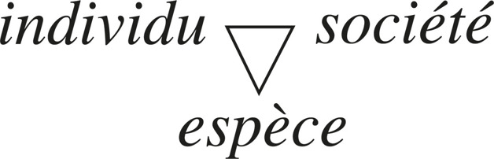

Still not enough. Physical reality cannot be first tuff, objective base of all explanation. Neither microphysical nor cosmophysical observation detaches from its observer. Every concept refers to the conceived object *and* the conceiving subject. The observer is inseparable from a culture, hence a society *hic et nunc*. No science has wanted to know the knowing subject; no natural science its cultural origin; no physical science its human nature. The cut between sciences of nature and of man occults the physical reality of the latter and the social reality of the former. Von Foerster: “social sciences” marks refusal to let other sciences be social (and social sciences physical). Mutual implication loops.

Triple impossibility: (1) encyclopedic knowing; (2) origin of the principle that enjoins isolating to know, and possibility of another principle that relinks; (3) vicious circle — physical knowledge depends on anthropo-sociological knowledge which depends on physical knowledge. Mission impossible. Renounce.

### L'école du Deuil

University teaches this renunciation. Research school = school of Mourning. Pic de la Mirandole is dead; informational growth exceeds any brain; this is to be celebrated. “Specialised,” not “team,” is the strong term. Knowledge is produced not to be articulated and thought, but capitalised and used anonymously. Fundamental questions returned as vague, non-operational. Science abandons “what is man, what is the world, what is man in the world?” to philosophy and religion. Only at retirement may grandees take meditative height.

Is Mourning necessary? The method that isolates, separates, reduces, measures discovered cell, molecule, atom, particle, galaxies, DNA. Yet structures of these knowledges are dissociated. Physics no longer communicates with itself: microphysics, cosmophysics, and a classical middle band. Man crumbles. World pulverised into information.

Must analytic decomposition be paid by generalised atomisation? Isolation of the object by incommunicability? Specialisation by parcelisation? Science must interrogate science. There is no scientific method for considering science as object of science. No science of science. Methodology, devoted to expulsion of subject and reflexivity, maintains the occultation. Rabelais: science without conscience — here, aptitude to conceive oneself. Science cannot conceive itself as social praxis, nor the relation knowledge/power.

### L'impossible impossible

Demission has become still more impossible. Can one conceive the individual only by excluding society, the human by excluding life, life by excluding *physis*, physics by excluding life? Local precision paid by halo-imprecision on global forms? Information transforming into noise? Knowledge founded on exclusion of the knower?

### L'a-méthode

Neither general knowledge nor unitary theory. Both escamote resistance of the real. Choice is not particular vs abstract-general. It is Mourning vs a method that articulates the separated.

Cartesian method: conduct reason well. Descartes could exercise doubt, exorcise it, establish certainties, make Method surge as Minerva armed. Cartesian doubt was sure of itself. Our doubt doubts itself. Tabula rasa is impossible: logical, linguistic, cultural conditions of thought are prejudging. Start only in uncertainty, including uncertainty about doubt. Doubt the Cartesian principle itself: disjunction of objects, of notions (clear and distinct ideas), of object and subject. Need: a method that detects liaisons, articulations, solidarities, complexities.

Start from extinction of false clarities. Not clear and distinct: obscure and uncertain. A new consciousness of ignorance crouched at the heart of reputedly most certain knowledge. Uncertainty becomes viaticum: doubt on doubt gives reflexivity. Acceptance of confusion resists mutilating simplification. Anti-method: ignorance, uncertainty, confusion as virtues.

### Le ressourcement scientifique

The non-simplifiable, uncertain, confusional — crisis of 20th-century science — is inseparable from new developments. Exclusions of classical science became pioneers. Thermodynamic disorder, microphysical uncertainty, aleatory mutations: regression from the viewpoint of simplification, progression into unknown lands. Disjunction is already dead at the base of physical reality. The subatomic particle surged irremediably in confusion. One will not return to the simple, isolable, unsplittable element. Confusion and uncertainty are forerunners of complexity. Whitehead: science is more changing than theology. The Institution treats as eternal those characters of science most dependent on techno-bureaucracy.

### Du cercle vicieux au cycle vertueux

Impossibilities nested: a vicious circle of encyclopedic amplitude with neither principle nor method. Science of man postulates science of nature which postulates science of man. Anthropo-social belongs to physical which belongs to anthropo-social. Reality loses first ontological foundation.

Vicious circles have always been broken by isolating propositions or choosing a master-term (Matter, Spirit, Energy, Information, Class Struggle). Breaking circularity is falling back under disjunction/simplification. Conserving circularity is refusing reduction; refusing linear discourse; respecting that human knowledge always comports paradox and uncertainty. Two propositions true in isolation, negating on contact, can be two faces of a complex truth. Conserving circularity opens a knowledge reflecting on itself. The physicist must reflect on cultural characters of his science. Subject surges in the reflexive movement of thought on thought (cogito). Transform vicious circles into virtuous cycles. Do not break circularities. The circle is the wheel; the road is spiral.

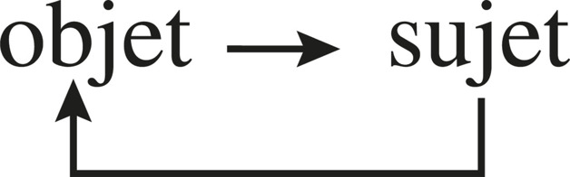

### L'en-cy-clo-pé-die

Not accumulation, not alphabet. Original sense: *agkuklios paideia* — putting knowledge in cycle. Not totality of knowledges: crucial knowledges, strategic points, organisational articulations between disjoint spheres. Adorno: totality is non-truth. Organisation, developing, is the Salzburg branch around which key concepts crystallise. Wager: knowledge of organisation could become organising principle of a knowledge that articulates the disjoint.

### Réapprendre à apprendre

Organising principle of knowledge associates to description of the object the description of the description (and decryption of the describer). Give as much force to articulation as to distinction. Do not suppress oppositions; reverse the dictatorship of disjunctive simplification.

**Paradigms** command first principles of opposition, distinction, relation. Revolutions of thought: whirlwind from phenomenal experience to paradigms. Ptolemy→Copernicus: permutation earth/sun. Ideas are more stubborn than facts. We experience at every instant that all we do is at once biological, psychological, social — yet anthropology proclaimed absolute disjunction. Classical science treated as cognitively insignificant that every physical object is conceived by a human mind.

Conserve concordance of observations (elimination of arbitrary). Integrate it in a reflected knowledge with a third eye. Thought must invest the unthought that commands it. Use thought to rethink the structure of thought. Vain to polemicise only against error: it is reborn from principles outside polemical consciousness. Only a new foundation ruins the old. Vital: reorganise the mental system to **réapprendre à apprendre**.

### « Caminante no hay camino »

Method is not brought; it is sought. Start with refusal of simplification: disjunction among closed entities, reduction to a simple element, expulsion of the non-linear. Refuse: idéaliser, rationaliser, normaliser. Need a principle that reveals the mystery of things. Machado: the path is made by walking. Nietzsche: methods come at the end. Return to beginning is not vicious if the voyage is experience. Circle becomes spiral.

### L'inspiration spirale

Not encyclopedia-as-inventory; encyclopedia-as-cycle. Not a unified general theory deducting from a master principle. Not a ready-made *scienza nuova*. New science, if it comes, shares a trunk with the old; differentiates by metamorphosis. Spiral path: interrogation → chain conceptual reorganisation → epistemological/paradigmatic level → method that remembres the mutilated. Method is not technical recipes. Difference from Descartes is of paradigm: not order excluding disorder, clarity excluding obscure, distinction excluding communication, disjunction excluding subject. From a principle of complexity, bind what was disjoint. Sainte-Beuve: Cartesian method “makes revolution everywhere.” A complexity paradigm could do the same, including to the notion of revolution become conformist.

### L'esprit de la vallée

The book starts from the century’s crisis and returns to it. Humanity needs a politics; politics needs anthropo-sociology; that needs articulation to science of nature; that needs chain reorganisation of knowledge.

The *je* that disappears from scientific discourse installs itself at the Control Tower. Feigning Copernican humility, it reconstitutes a Ptolemaic system whose mind is the centre. Method tears one from this auto-centrism. Not anonymous Science. Conviction secretes infinite uncertainty. The only knowledge that is worth nourishes itself on uncertainty; the only thought that lives maintains itself at the temperature of its own destruction. Branched on the planetary patrimony; religion of what relinks; Tao: Spirit of the valley, which receives all waters that pour into it.


Science is never isolable. Triangle with politique (funding, state, power) and idéologie (paradigms that make certain questions unthinkable).

**For agents**
- Knowledge of a computational world cannot exclude the knower. An agent that names, addresses, composes, executes is already inside the observation.
- Disjunction (file from process, process from machine) is Cartesian method. Detection of liaisons is needed: hooks, entry points, capabilities as articulations — not a second-brain ontology.
- Vicious circle maps onto: ASC physis depends on Projet Complexe semantics (tasks, knowledge, research, relations, agents) which depends on that physis. Do not break the circle. Projet Complexe ASC pivots (research, index, extract, relate, run-agent, inspect-agent, stop-agent) are thin articulations, not a second ASC.
- Encyclopedism is cycle at strategic nodes, not accumulation. Index and relate are en-cyclo-pedic; they must not become totalising systems.
- Uncertainty is viaticum. Certainty-before-acting implements Mourning. Réapprendre à apprendre: reorganise the computational system, not only store more.
- *Caminante*: method forms during research. Capabilities are made by walking.

---

## Avertissement du tome 1

Aubenque: *Physis* is first a question — whence come things, how born, how they grow.

Organisation was to be treated in GST and cybernetics. En route these ideas became scaffolds, to be dismantled after climbing to organisation. Liberating ideas enclose. First guides of evolution become obstacles to revolution. Systemic and cybernetic ideas (including information) are integrated: conserved, but provincialised, criticised, complexified. Instead of enclosing organisation in système or machine, système and machine are towed by organisation. This concept, necessarily physical, resurrected *physis*: the physical universe as the place of creation and organisation.

*Physis* is not a socle. It is common to universe, life, man. Biological and anthropo-social organisation are evoked always under the angle of physical organisation. Confusionnel only if physics, biology, sociology are incommunicable essences. Organisational problems atrophied at strictly physical level deploy in biological and anthropo-social developments. Those phenomena require a physical organisational infrastructure.

Atlan: creative disorder, organising chance, disorganisation/reorganisation. Von Foerster → Günther, Maturana, Varela: the invisible *auto*, reintroduction of subject. Stewart: conflictual cooperation, biologist vs *physis*. Victorri: chrysalis, not completion.

1980 notes: Chaosmos and Plurivers introduced. Entropy is not identified with disorder as a reduction; it is a thermodynamic idea leading to a general physical tendency to degradation, dispersion, disorganisation. Accent on information would today shift onto computation (Méthode 2).

---

## Première partie — L'ordre, le désordre et l'organisation

---

### 1. L'ordre et le désordre (des Lois de la Nature à la nature des lois)

Heraclitus: the most beautiful arrangement is a heap of garbage disposed at random. Brillouin: let us no longer be spoken to of the Laws of Nature.

#### I. L'invasion des désordres

**L'Ordre-Roi.** Master-word of classical science, Atom to Milky Way. Kepler–Newton–Laplace: stars obey inexorable mechanics. Eternal Law of falling apples supplants the Law of the Eternal. *Révolution* of astres means impeccable repetition. Universe as perfect clock, bathing in ether until Michelson (1881). Uncreated matter, indestructible energy. Laws ignore dispersion, wear — except the strange second principle. Laplace’s demon reconstitutes past and predicts future. Disorders are foam. Hegel: irrational chance reigns only at the surface. True Reality: physical Order, biological Order (Law of the Species), social Order (Law of the City). After 1789, Revolution means rupture. Evolution, primitive nebula: Order comes out adult. Laws of Evolution and History consecrate imminent rational Order.

**From degradation of energy to degradation of order.** 19th century: a pocket of disorder at the heart of physical order, gnawing energy. First principle: energy indestructible, polymorphic. Second principle (Carnot, Clausius 1850): not loss but **degradation**. Calorific form cannot reconvert entirely. Every work releases heat. Clausius: **entropie**. In a closed system, entropy grows to homogenisation and thermal equilibrium.

Boltzmann (1877): heat is disordered molecular motion. Increase of entropy = increase of internal disorder = disorganisation (order of a system is organisation of heterogeneous elements). Statistical probability: disordered configurations most probable. Entropy: passage from least to most probable.

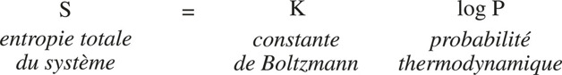

Clausius generalises to the universe as mega-closed system: thermal death. Contested: is the universe a system? In closed systems, order/organisation are initial *and* improbable. Then why 10^73 atoms, stars, life? At social scale, the second principle is compensated by techno-industrial victory over calorific disorder. Maxwell’s demon: homogenisation can be belied inside a closed system. Restoration: a pillar has collapsed. Ontological evidence of order reverses. Problem is no longer: why disorder despite universal order? It is: **why order and organisation?** They become problem, mystery. Open systems also work; every work increases entropy. Bergson’s Manichaean “living matter” vs physical matter. Questions stifled: culturally strongest principle annuls the other. Disorder of the second principle remains parasite, waste, latrines of *physis*. Order still reigns.

**Le dérèglement micro-physique.** 1900: Planck’s quantum. Rutherford’s atom was a small solar system; then the accident. Particle loses attributes of the order of things: blurs under the observer, corpuscle/wave, substance dissolves into aleatory event, no fixed localisation. Subatomic porridge disintegrates order, organisation, evolution. Statistical order returns; the atom remains a system with coherent formalism. Disorder locked in basements. This disorder is present in the micro-tissue of all things. Not degradation-disorder: **constitutional disorder**, part of *physis*, of every physical being, part of order and organisation while being neither. Second sounding of disorder. This time it makes exist, not degrade. Sanitary cordon around the foyer.

**Le désordre génésique.** From the 1920s the clockwork universe dilates, disperses; 1960s: crumbs. Hubble redshift (1930): expansion as dispersion, perhaps explosive. 1965 isotropic 3 K radiation: fossil of initial explosion. Universe in crumbs. Star = hydrogen bomb in slow motion, born in catastrophe, will die in catastrophe. Genesis and agony at once. Three pillars of Order collapsed: thermodynamic, microphysical, cosmological. If diaspora, micro-porridge, and sole probability = disorder — how galaxies, laws, organisation up to the human mind? Pose liaison, not exclusion. A third face of disorder: genesic, creative, inseparable from the other two.

**Un désordre organisateur?** Prigogine: complementarity of disordered and organising phenomena. Bénard vortices: calorific flux, fluctuation, instability → hexagonal convection cells. Deviance, perturbation, dissipation can provoke structure. Von Neumann (self-reproducing automata): the living automaton functions *with* disorder. Von Foerster (1959): **order from noise**. Atlan: **hasard organisateur**. First face of disorder: death. Second: being. Third: creation. Fourth (theoretical): binds all three to organisation.

#### II. De la Genèse au Tétralogue

**A. Le problème d'origine.** Double fragility: observational uncertainty at great distance; imagination = imaginary (mythologisation and rationalisation are the same). Early-century cosmology: uncreated self-sufficient universe — escamotes the aporia of beginning *and* eliminates becoming. Hubble collapses it. Expansion is generally accepted; rigid expansion-from-zero-to-infinite-dispersion is not. Big bang is more fragile: epistemological carence. Punctual infinite density is no more obligatory than infinite negative entropy. It escamotes the aporia by making punctual and infinite coincide. Search for origin degraded into search for a starting point.

Aporia must be conceived head-on, hypothecated by our mental structures. First choice is mode of constitution of theory, not which theory. Unconceived unknown before our universe: neither void nor lack — non-worldly, pre-physical source of *physis*. Vain to seek spatiotemporal figuration of the before.

Surpass big bang toward **catastrophe** (Thom, 1972): change/rupture of form in irreducible singularity. Morphogenesis bound to rupture of form. Read disintegration and genesis in the same processes. Not absolute beginning; mystery of proto-cosmic unknown remains. Event and cascades of events. Disorder included genesically. Unlike punctual big bang, catastrophe identifies with the whole metamorphic process — still continuing. We are still in catastrophe.

**Complexité originelle.** Hubblean acquisition: not a new simple (disorder replacing order) but a **complex principle of explanation**. Evolution is at once degradation and construction. Impossible to isolate a master-word. Order, disorder, organising potentiality thought together — antagonistic *and* complementary — in a loop. Revolution of principle and method. Cosmogenesis = genesis of method.

**B. La désintégration organisatrice.** Incredible and necessary: **the cosmos organises itself by disintegrating**. Only weft of a plausible theory: from thermal surge, particles, nucleosyntheses, ignition of stars, heavy atoms. Scenario not certainty; necessity of a scenario that accounts for dispersion *and* organisation.

Photonic cloud, ~10^11 K, cools; electrons, neutrinos, neutrons, protons; random encounters → deuterium, helium, hydrogen. Micro-genesis first. Turbulences → inequalities → dislocations → proto-galaxies → proto-stars. Density increase self-amplifies to thermonuclear ignition. Star should explode; gravitational implosion antagonises; mutual regulation = life of the star until explosion or contraction. Stars: gravitational empire, clockwork with planets, forges of heavy atoms (C, O, N of later life).

Materialisation is also disintegration of primitive radiation — cosmic indebtedness, condition of later liaisons. Nucleosynthesis = random collisions. Galaxy/star formation = tears. Ignition = point of explosion. Schismogenesis consubstantial with morphogenesis. Positive feedback: deviance amplifying itself (condensation). Ignition triggers inverse (explosive) positive feedback. Antagonism of the two = flaming stability of a sun.

**La chaleur.** Cosmogenesis is thermogenesis. Heat = energy + disorder: agitation, turbulence, inequality, aleatory interaction, dispersion. Cooling is not homogeneous. Inequality of heat → diversity of particles → nuclear then atomic then molecular diversity. Hot: explosive *and* creative (nucleosynthesis). Cold: liquefaction, crystallisation, molecular liaison. Turbulence can become motor: the star is a vast turbulence become wild motor. Infinitesimal initial deviations amplify extraordinarily (the old determinist world was ice, not fire). There is not *a* disorder: inequality, agitation, turbulence, encounter, rupture, catastrophe, fluctuation, instability, disequilibrium, diffusion, dispersion, runaway, explosion. Disorder in disorders became cosmogenetic.

**Naissance de l'Ordre.** Born with disorder, in singular initial conditions. Constraints exclude other universes *hic et nunc*. Paradox: **singularity and eventiality of the cosmos are the source of its universal laws** — universal only for this universe. Particle types (proton, neutron, electron: viable, operational) constrain interaction types (strong, weak, gravitational, electromagnetic) = “natural laws.” Order born as determinations/constraints.

**C. Le jeu des interactions.** Reciprocal actions modifying behaviour or nature. Suppose: elements capable of encounter; conditions of encounter (agitation, turbulence); determinations/constraints of those elements; in certain conditions, interrelations (association, liaison, communication) → organisation. Organisation requires interactions; interactions require encounters; encounters require disorder. Interactions are the Gordian knot of order and disorder. Encounters aleatory; effects on determined elements in determined conditions become necessary = “laws.” Relating interactions generate forms. Strong: nuclear cohesion. Gravitational: galaxies, ignition. Electromagnetic: atoms, molecules. Once organisations exist, rules of interaction appear as Laws of Nature. Newton’s gravitation: a foot in organisation, a foot in dispersion (it also dislocated the primitive cloud). Laws are a provincial face of complex interactional reality. Interaction is the turning-plate. Order, disorder, organisation linked via interactions in a solidary loop: complementary, concurrent, antagonistic.

Example 1 — *order from noise*: magnetised cubes in a shaken box assemble into unforeseeable stable architecture. Constraints + selective interactions + non-directional energy + many encounters, minority stable. Co-production. Once constituted, organisation resists further agitation. Physical **natural selection** (the only natural selection is physical): cohesion privileges organisational minorities in a universe of fugitive interactions.

Example 2 — stellar carbon: three helium nuclei must meet within 10^−12 s. Abstractly fabulous chance; in a helium star’s long-held temperatures, local probability. Once formed, the nucleus resists. Improbable/necessary carbon → amino acids → life.

**Le grand jeu.** Pieces (elements), rules (constraints, interactions), chance of encounters. Few particle types, four interactions → 92 atoms → unlimited molecules → life. Variety (Pauli) deploys. Play produces diversity.

**D. La boucle tétralogique.**


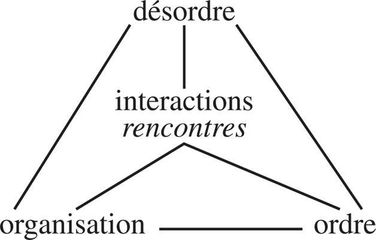

Interactions inconceivable without disorder (inequalities, turbulences). Order and organisation inconceivable without interactions. No object outside the interactions that constituted it. Particle alone blurs; defines itself only with its observer. Order flourishes when organisation creates its own determinism (Newtonian gravitational spectacle). The more organisation and order develop, the more they tolerate, use, necessitate disorder. Isolate none of the four terms. Complementary, concurrent, antagonistic. Place the tetralogue at the heart of *physis*. *Physis* now has an immanent principle of transformations and organisation.

#### III. Le nouveau monde : Chaosmos

Greek myth dissociated originary chaos from ordered cosmos. Classical thought: Ubris vs Dike. Classical science dissolved cosmos into infinite uncreated matter/energy; organisation absent. Post-Hubble astronomy regenerates cosmos (singular universe) and implicitly **chaos**. Chaos is first energetic: bubbling, turbulence. Idea from *before* distinction: confusion of destructive and creative power, order and disorder, Ubris and Dike. Cosmogenesis operates in and by chaos. Chaos = organising disintegration = antagonistic unity of bursting and nucleation. Processes of order did not sneak through holes in cosmic gruyère; they constituted themselves in chaos, the whirling tetralogue.

Heraclitus: way down = way up. Genesic Fire; all form is metamorphosis of fire. Fire without engineer constructs billions of fire-machines. Disordered fluxes issue in quasi-cybernetic regulations. *Organ*: to bubble with ardour. Chaos is originary *and still present*. Genesis has not ceased. We are still in the dilating cloud, still in a universe that disintegrates and organises in the same movement, still in the beginning of a universe that dies from birth.

**Soleils et atomes.** Two pillars of order. Genesically associated. Atom: brick of the organised universe. At particle level: indistinction; no logical identity; element/event, order/disorder. Thom: universe at this scale is porridge of poorly defined beings in perpetual interaction. Chaos as infratexture. Atom transforms chaos into organisation (formalism accounts for organisation, not isolated elements). Atom in permanent genesis, auto-producing in internal interactions.

Sun: clockwork, motor, fabricating (heavy atoms, radiation = manna of life). This fire-machine is *on fire*. Nucleus = pure chaos, permanent hydrogen bomb. Regulation = antagonism of explosive and implosive feedbacks. Created in catastrophe, lives in catastrophe, dies in nova/implosion. Supreme order *and* volcanic chaos.

Order of classical physics shrunk, sandwiched between two chaoses, itself son of genesic chaos. New *physis*, daughter of chaos: swarmings of interactions. Chaos is permanent generic principle via tetralogy. *Physis*, cosmos, chaos copresent. Chaos is not a clear concept: it forces antagonistic notions to knot. Polemos, father of all things (Heraclitus); Thom: morphogenesis as conflict of attractors. Trade the clockwork for this universe.

**Nouveau monde incertain.** Cold clock → hot cloud. Centred → acentric, polycentric. One *and* burst. Architecture → drifting archipelagos. Time distilled → time carrying galaxies. Reified essences → dereified: at every moment in genesis *and* decomposition. Clear concepts of Determinism, Law, Being overflowed. Old universe was “intelligible” but all that happened in it was unintelligible. Pure order is the worst folly (abstraction) and the worst death (never knew life).

**Deux univers divergents.** Same trunk, two polarisations.

(1) Diasporic cloud. Organised born by chance. 10^73 atoms miserable vs particulate dust. Suns: rafts of the Medusa. Organisation = minority lumps, parentheses, improbable, deviant. Life perhaps unique (same molecular constitution, same genetic code). Statistical good-nature tolerates recreations. Sooner or later dust without name of universe.

(2) Organisation, from zero, has not ceased to develop. Disorder as nourishing ecology, placenta. Universe as blacksmith’s yard (Palissy: waste as price of creation). Organisation minority as every sovereign is minority. Physical natural selection: Law in a world without law. Dispersion is outlaw. Statistics has no definitive sense for a singular universe. All organiser and creator happened outside statistical probability. Future must be evolutive because organisation is only beginning.

Do not choose. Binocular vision: organisation at once deviance and norm, improbability and local probability. Schismogenesis *and* morphogenesis. Uncertainty may also be the universe’s: it does not yet know what will happen to it.


Stationary: perpetual motion, vicious circle. Diasporic: temporary lumps. Uncertain: source, *boucles organisationnelles*, then dispersions. Third = Chaosmos.

**Acquis irréversible.** Trunk-world plausible (convergence of microphysics, thermodynamics, astronomy) and because disorder + physical evolution necessitate a complex principle. Image still flickering. Before-world remains. Plurivers possible (Lupasco/Dirac antimatter). Chance as undecidable complexity (Chaitin); time with possible inversions; space taking being (Thom topology). No regression to simple physics. Irreversibility is irreversible; complexity unsimplifiable. Dead: the universe gravitating around order from Ptolemy through Einstein. Born: universe that ceases to turn around order (order conserved as provincial knowledge). True acquisition is the **principle of complexity** — not permutation of one simple term for another. First complex universe; first open world: Uni-Plurivers. No privileged observation point; two axes of becoming; mystery at the heart. First vision that does not close in explanatory self-sufficiency.

#### IV. Articulation du second principe dans le principe de complexité physique

Second principle since Boltzmann concerns order and organisation, but had no concept of organisation to articulate with. Oscillated between wingless measure and master-law of the Universe (then why is anything not already dust?). Surpass the alternative by enriching *physis*.

Universe is not truly a system: apprentice-system crumbling as it constitutes itself, proliferating in polysystems (galaxies, solar systems) without ensemble organisation. Universalising the second principle is denaturing; it occults the genesic link: irreversible diaspora *and* islands of organisation. Entropy-increase is a refracted echo, inside closed systems, of one face of the cosmological principle (disintegration).

Conceived organisationally, entropy = irreversible tendency to disorganisation of *all* organised beings, including open systems and livings. Formation of a star = local entropy decrease paid by increase in the environment. Stationary organised states (Bénard) cost dissipation. Every local néguentropie increases entropy in the universe. Reverse of morphogenetic principle: organisation also works for dispersion.

Integrate second principle *into* the tetralogical loop. The second principle treated order as initial because it ignored the preceding sequence. Do not stick two sequences (disorder→order→disorder). Catastrophe already carries order-principle and organising potentiality. Loop is not vicious (irreversible transformations) nor perpetual motion (fed by catastrophe then suns). Specific effect of the second principle: unrecovered disorder becomes dispersion. Spiraloid circuit. (a) disorder produces order and organisation; (b) order and organisation produce disorder; (c) all production of order irreversibly produces disorder.

Insufficiencies: confined in closed thermodynamics, or abstract probability that ignores the improbable become necessary *hic et nunc*. Virtues: brought disorder into classical physics; universal in what it *forbids* — perpetual motion (Serres); temporal irreversibility; problem of organisation in hollow. Message: always a dimension of degradation. No organised being escapes death. Every creation, information included, paid in entropy. No being regenerates in isolation.

#### V. Le dialogue de l'ordre et du désordre

Paradigmatic: the relation controls theories, discourses, praxis, politics. Western thought: order and disorder flee; collision disintegrates one. Statistics superposes macro-order on micro-disorder without logical connection. Second principle: univocal probable transition. Biological evolutionism: inverse orientation. Coexistence unthinkable.

**Ordre du désordre.** Serres would invert the hierarchy (disorder first, only real). Dehierarchise. Before catastrophe: unsayable. From catastrophe, order and disorder born quasi together. Conjunction is what is real. Disorder is carpenter, not only foam. Ambivalent: fire creates and ashes; rupture is morphogenesis. Chance = observer’s impotence to predict; event = singular unexpected; accident = encounter of organised phenomenon with event. Omnipresent, Mephistophelic. Not a new Absolute. Exists only in relation.

**Désordre de l'ordre.** Dead: supra-temporal Laws of Nature — “simplified laws invented by savants” (Brillouin), abstractions taken for concrete (Whitehead). Order provincial, degradable, born in time; gains becoming. Genealogy: *boundary conditions* of a singular universe; viable/operational particles; laws conditional (Newton already: same laws in same conditions — focus now on aleatory conditions). Encounter aleatory, effect necessary. Order flourishes as organisation: assemblage, constraint, symmetry, cycle, regulation, programme, reproduction… There is not *an* order. Einstein failed to unify gravitation and electromagnetism; unity of the universe is not in order. Orders = disorder in order. Contextual, interdependent, not exterior. Living order manipulates disorder and regenerates. Jacob wrestling the angel. Disappearance of Laws of Nature poses **the nature of laws**.

**Co-production.** Whyte’s two tendencies (local order vs thermal uniformity) must be bound, not only opposed. Dialogique: symbiotic unity of two logics that nourish, compete, parasitise, combat. Dialectic at phenomenal level; dialogique at principle (later: paradigm). Suspend the paradigm where each excludes the other. Relation at once: one (genesic indistinction); complementary; concurrent (two processes running together); antagonistic. Theory starts from chaos/tetralogue, not from a point, not from an ontological pillar.

**Improbable et probable.** Soften improbability. Organisation is relative closure (Varela), own constraints, own stability. Converts diffuse general improbability into concentrated local temporary probability, socle for a new improbable organisation. Life: extremely improbable origin (perhaps one ancestor cell) and as physicochemical arrangement; death = return to probable dispersion; yet living organisation developed own survival probabilities in a narrow ecological frame. Holes of necessity in improbability. Dereify probability/improbability. Unresolved: is disorder of the world part of its order, or conversely? Maintain both orthodoxies. Observer’s desire, fear, limits. More Shakespearean than Newtonian. No certainty there is even a principal scenario.

#### VI. Vers la galaxie Complexité

Ptolemaic concept of order: all turned around it. Double revolution: Copernican (provincialise order) and Einsteinian (relativise order/disorder). Meta-Copernican: no centre (Einstein took privileged reference; Hubble took galactic centre). No unequivocal time-axis: double antagonistic process from one trunk. Polycentric, acentred, diasporating. No sovereign master-concept; no scattering into disorder either.

First-concepts no longer isolated, substantial. Junction of what was disjunctive: ordre/désordre/organisation and chaos/cosmos/*physis*. Catastrophe takes sense through the tetralogue. Spiral nebula of world-conception = paradigm + organisation of theory. Adventure of the work: genesis → generativity → method. Notions chased from science return: event, play, expenditure, singularity.

Nascent universe is singular *in its generality*. Classical paradigm “science only of the general” drained singularity, beginning with the universe. Junction singular/general, not alternative. Singularity founds generality of laws. Event, triply excommunicated (singular, aleatory, concrete), re-enters cosmically. Play: aleatory process with rules *and* slack through which disorder infiltrates (von Neumann, Sallantin). Fire: heat as mistress; expenditure constitutive. Classical rationality bound simplicity, functionality, economy. Heat is loss, haemorrhage. Encounters produce more destruction than organisation. 180 million spermatozoa per ejaculation for one mortal. Bataille’s accursed share. Rationalism occulted absurd expenditure.

**Temps complexe.** Irreversibility enters physics with the second principle, cosmology in 1965. Matter has a history. Time one and multiple, continuous and discontinuous, evential. Two 19th-century times, hermetic: entropic degradation vs Darwinian/1789 progress. Break the schizoidy: one, complementary, concurrent, antagonistic. Later: reiterative, loop, cycle time — spiraloid, contaminated by irreversible time, broken by evential time. Syncretic Becoming (Hegel ignored this). Every living carries event-time (birth, death), disintegration (senescence), organisational development (ontogenesis), reiteration (daily/seasonal cycles), stabilisation (homeostasis). Births and deaths constitutive of the reproductive cycle. All inscribed in cosmic haemorrhage.

Constellation around the tetralogue: first foundation of complexity of the nature of nature. Missing: the observer/conceiver.

#### VII. L'observateur du monde et le monde de l'observateur

Every knowledge supposes a mind whose limits are the human brain, support from a culture, a society *hic et nunc*. Classical science put the savant outside the field, like a photographer. Mind suppressed; observations as reflection of things; subjectivity = error, eliminated by concordance.

**Perte de certitude.** Laplace escamoted observer-limits by an ideal demon. Order invents an abstract observer. Only disorder reveals the concrete observer. Order erases the mind (subjective certainty takes itself for objective). Disorder produces uncertainty, which turns the uncertain back on itself. Is disorder appearance, ignorance, or complexity beyond understanding? Uncertainty implants in complexity-discourse where excluding notions stick. Face of the observer superimposes on the cosmos.

**Perte de Sirius.** No supreme viewpoint. Subjective viewpoint in every world-vision. Who are we? From where? How conceive? Not only third planet of a suburban sun, atoms forged in it: biologically organised, cerebrally adapted to local environment, culturally scientific. Subject ≠ degraded “subjectivity.” Interrogation of self on reality. Bio-anthropological *and* socio-cultural determination of knowledge.

**Rorschach céleste.** Sky as projective test. Elimination of cosmos in favour of infinite physical extent = negative mythology of atomised world. Steady state vs big bang overdetermined by secular vs religious rationalisation (divine flick, *Deus absconditus*). Fierce resistance of static order while everything else had been in evolution: occult relation cosmic order / social order. Antique recursive mirror: social rites regenerate cosmos which regenerates society. Residual now, mediated by science; paradigm of order perhaps holds the thread.

**Chaleur contagieuse.** Collapse of cosmic order inseparable from collapse of absolute scientific order and of an old social order. 19th-century West becomes “hot” (Lévi-Strauss). Carnotian heat in social boilers: industrialisation, Brownian agitation of individuals. Thomian catastrophe of society: disintegration of old forms and gestation of new as one process. Same movement: science’s transforming catastrophe via heat (Clausius, Boltzmann, Planck) into microphysics then cosmos. Homology of catastrophes: science, society, cosmos, humanity. Same ambiguity: diaspora vs superior organisation; statistically probable worst; all founding was improbable. Uncertain even about the uncertainty: social becoming projected on cosmos? cosmic rapid localised in us? the mind projecting? all at once?

Subject emerges in this conjunction. First consciousness: humanity is a by-product of cosmic becoming *and* the cosmos is a by-product of anthropo-social becoming. Knowledge of the sky does not fall from the sky. Socio-solipsism (science = mere ideology) conserves the old paradigm’s reductiveness, isolates the social, loses all exterior referent. Observations remain a cryptic message from an exterior universe. Gordian knot: (1) cosmos generates the minuscule subject who generates the cosmos in vision; (2) cosmo-physical and anthropo-social universes each produce the other. Method for Object/Subject, Nature/Culture, *Physis*/Society. Uncertainty as ferment. Risks of failure highly probable.

**For agents**
- Computational physis is tetralogical. Interactions (hooks, entry points, messages) are the turning-plate. Disorder (noise, failed runs, unindexed files) is not latrine-waste. Organisation (services, workers, composed capabilities) and order (named addresses, conventions) co-produce.
- Chaosmos, not clock. ASC is not stationary perpetual motion. Organisational loops along trajectories that still disperse. Name what loops.
- Physical natural selection: what coheres survives as named, addressable units. Capabilities that cannot be composed die. Selection is runtime, not a second-brain ranking.
- Observer in the observation: inspect-agent, log, index are viewpoints. No Sirius. Projet Complexe is the anthropo-social envelope; pivots articulate without becoming a second ASC.
- Do not choose diaspora-universe vs organisation-universe. Local probability on general improbability *is* a named, composable environment.
- Expenditure is constitutive. Every run pays entropy. No isolated regeneration. Dependent autonomy.

---

### 2. L'organisation (de l'objet au système)

James Key: in all physical science, there is not a thing that is a thing. Bachelard: the object designates us more than we designate it. Whitehead: every reality is complex unity.

#### L'énigme de l'organisation

All that old physics took for simple element *is* organisation: atom, molecule, star, life, society. Deviant at origin (catastrophic, schismatic, aleatory), organisation is the nucleus of *physis* — what is endowed with being — and the absent concept of physics. Order crushed it. Interaction became the turning-plate; organisation still to emerge. It is not disorganisation reversed (eggs do not unscramble by reverse agitation). Science of order repressed the problem; science of disorder reveals it only in hollow; science of interactions stops at the antechamber. Prerequisite: crack the opaque **objet** that blocked access to **système**.

#### I. De l'objet au système ; de l'interaction à l'organisation

**Royauté de l'objet substantiel.** Classical objectivity: isolated objects in neutral space, universal laws, no observer, no environment. Substantial, closed, independent. Explain = simple elements + simple rules. Atom as unsplittable base. Biology copied (cell, gene, four bases).

**Effritement à la base.** Atom = system of interacting particles. Particle: crisis of order, unity (>200), identity; unlocalisable; wave/corpuscle. Double crisis of object and element. Particles have properties of the system more than the system has properties of particles (protons cohere in the nucleus; neutrons stable only there; Pauli exclusion as constraint of totality). Universe founded on a **complex system**, not unsplittable unity.

**Univers des systèmes.** Floor (atoms) and keystone (suns). Biology ruins “living matter” and “vital principle.” Sociology treated society as irreducible system from the start. Organised world = archipelago of systems in an ocean of disorder. Polysystemic solidarity (Lupasco: only systems of systems; the simple system is didactic abstraction). Koestler *holon*: part and whole at once. Conceive objects as systems.

**Présence des systèmes, absence du système.** Disciplines use the word without a concept. No relation thinkable between solar, atomic, social “system.” Bertalanffy opened GST, never dug the concept of system itself.

**Première définition.** Interrelation of elements constituting a global entity. Saussure: organised totality of solidary elements definable only by place in the totality. Link interrelation + totality by **organisation**. System = **organised global unity of interrelations among elements, actions, or individuals**.

No *sui generis* organising principle anterior to interactions. Organising principle born of aleatory encounters, order/disorder copulation, Thomian catastrophe. Three faces of one morphogenesis: interrelation, organisation, system.

Organisation: arrangement of relations producing a complex unity endowed with qualities unknown at component level. Binds, maintains duration against aleas. Transforms, produces.

**Concept trinitaire.** Reciprocal circularity: interrelation (types of liaison) / organisation (arrangement of parts in, by, and as a whole) / système (phenomenal complex unity). Isomers: same mass, different properties by arrangement. Atoms from three particle types; living species from four bases.

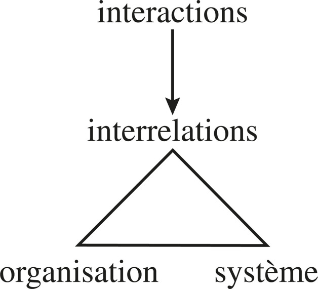

#### II. L'Unité complexe organisée. Émergences et contraintes

**Unitas multiplex** (Angyal). Whole: one and homogeneous; constituents: diverse and heterogeneous. Atlan: conjugation of variety and redundancy. Global not elementary; original not originary; individual not indivisible; hegemonic not homogeneous. Conceive together whole and parts, one and diverse.

**A. Les émergences.** Whole more than sum: organisation, global unity, novel qualities. Superadditive composition (von Foerster).

*Globales*: atom’s stability conferred retroactively on labile particles; NH3+HCl → solid; liquidity of water as molecular binding; cell’s “life” soaking the whole and retroacting on parts. Matter, life, meaning, humanity are emergences of systems (Serres). Life emanates from living organisation, not conversely.

*Micro-émergences*: the part is more than the part. Neutron duration in the nucleus; Pauli individuality of electrons; culture developing language. Macro-emergences retroact as micro-emergences.

Emergence: quality, product, globality, novelty. Phenomenally irreducible, logically undeducible. Even when predictable, a logical leap — irreducibility of the real. Between epiphenomenon and phenomenon: consciousness as will-o’-the-wisp *and* as “moi, je” that retroacts (death-consciousness, auto-critique). Abandon infra/supra hierarchy for organisational retroactivity: fruit last chronologically, first by quality. Real jaills at the surface of emergences, not only in depths of being. Emergences of emergences: atom → molecule → cell → organism → society. Consciousness, liberty, love: fruits, fragile, first struck — not inalterable essences.

**B. Les contraintes : le tout est moins.** Holist blindness after reductionist. Sauvan: S ≠ S or S > < S. Ashby: organisation = constraints on possible states. System exists when components cannot adopt all states. Association implies constraints (parts/parts, parts/whole, whole/parts). Isolated qualities disappear (two gases → solid paid by loss of gaseous quality). Genetic repressor; each cell carries the whole genome, most repressed. Enrichment *and* impoverishment; impoverishment can dominate (slavery, specialised labour). Systems differ by production of emergences vs repression.

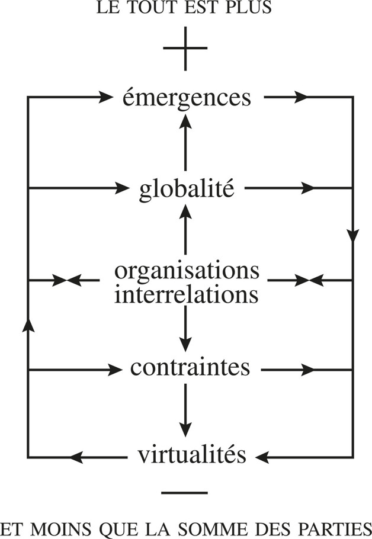

**C. Formation du tout et transformation des parties.** More, less, *other* than the sum. Quantitative description absurd. **All that forms transforms.** *Gestalt*: discontinuous diversity → global form. At living scale: uninterrupted recursive circuit of formation/transformation.

#### III. L'organisation de la différence. Complémentarités et antagonismes

One and multiple. Poor systems organise similarity (crystals); rich systems organise diversity. Circuit: diversity organises unity which organises diversity. Extreme redundancy: poor; extreme diversity: explosion. Complexity increases variety and requires more supple organisation (intercommunication rather than coercion).

Parts: double identity — own, and participation. Organisation of a system = organisation of difference. Complementarities: interactions, shared-electron liaisons, functional specialisations, common code. Two biological types: specialisation (constraints, control apparatuses) vs competence/autonomy of individualities (Changeux, Danchin). Imposing specialisation on rich individualities reduces the diversity organisation created.

Every organisational interrelation supposes attractions *and* exclusions. Without repulsion, confusion, no system. Organisational equilibria = equilibria of antagonistic forces, not thermodynamic homogenisation. Complementarity actualised; antagonism virtualised. Constraints virtualise properties that, expressed, would be anti-organisational. **Principe d'antagonisme systémique**: complex unity creates and represses antagonism.

Suns and livings *use* antagonisms. Star: implosive/explosive processes become regulation. Active organisation = active antagonisms. Negative feedback = antagonism of antagonism. **No organisation without anti-organisation.** For fixed organisation, anti-organisation is virtual; for active, it is active. Crisis = failure to control antagonisms. Organisational entropy = actualisation of anti-organisational potentials, irreversible beyond thresholds. Life has integrated its antagonist — death — and carries it constantly. Every system condemned to death from birth.

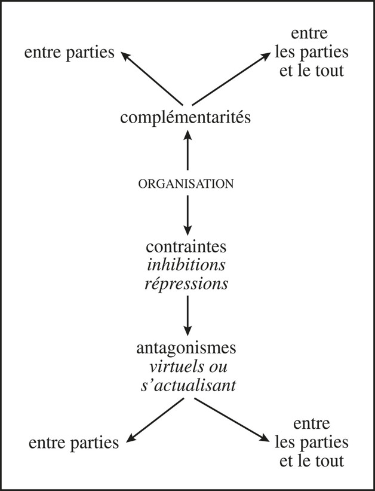

#### IV. Le concept de système

Objects yield to systems. Form as *Gestalt* of organised complex unity: existence and organisation, not essence. Aristotelian form/substance and Cartesian decomposable objects cannot intelligibilise the system.

**A. Au-delà du holisme et du réductionnisme.** Reductionism disarticulates the system (Atlan: analysis loses information on the organism). Successes paid by obscurantism on organisation. Holism reduces *to the whole*: euphoric, functional, oiled, silly — constraints and antagonisms ignored. Same simplifying paradigm. Pascal: impossible to know parts without the whole, nor the whole without particularly knowing the parts. Recursive circuit: parts ↔ whole ↔ organisation. Know also inhibited, virtualised qualities of parts. Macroscope (de Rosnay). Circuit closed (relative autonomy) *and* opened (environment, time, observer).

**B. Le tout n'est pas tout.** Whole retroacts on parts (overdetermination) *and* is a hole if isolated from organisation and parts. Scissions: immersed/emergent, repressed/expressed. Antony’s thirty billion cells do not know Antony; Antony ignores the cells. Freudian/Marxian unconscious: abyss in identity. Phenomenal extraverted whole vs introverted “structures.” Infra/superstructure: each ignores the other inside recursive solidarity. Adorno: **totality is non-truth**. Uncertain whole (Koestler holon). *Homo*: polytotality individu/société/espèce — complementary, concurrent, antagonistic; do not decide which is the whole. Part can be richer than totality (Günther, Spencer-Brown: reflexive power in a small half-detached part). Totality more beautiful when it ceases to be totalitarian.

**C. L'organisation de l'organisation.** Knot binding interrelation to system.

1. Relation of relations.
2. Transforming formation / forming transformation — generative morphogenesis.
3. Maintenance of what maintains (morphostasis). Living systems spend organisation repairing degradations organisation itself provokes. Survive.
4. Order of organisation / organisation of order. Converts improbability into local probability. Stratified stability (Bronowski).
5. Disorder not chased: transformed, virtualised, prepares its victory (Atlan’s organisational chance). Interior disorder = anti-organisation *and* entropy. Active systems: Sisyphus, permanent reorganisation.
6. Structure ≠ organisation. Structuralism blinds to phenomenality, complexity, anti-organisation. Quasi-recursive: products loop on initial elements.
7. Open **and** closed. GST opposed them thermodynamically. Organisationally they are not exclusive. Truly organisational opening is where there is truly organisational closure. Organisation *is* closure (prevents haemorrhage and invasion). Closure of an open system = looping on self. Paradox: open in order to reclose; closed in order to open; recloses by opening. The more complex, the vaster the opening, the stronger the closure. Frontier: forbids *and* authorises passage.


8. *L'orgue*: polyphonic. Second-order concept: products necessary to its own constitution.

**D. Le dasein physique.** Every physical system is being-there: born (interactions), history (events), dies (disintegration). Finitude once reserved to man. Evolution of matter = evolution of organisation, including noological forms.

**Principe de sélection physique.** Encounters necessary, insufficient. Selection for complexity (advantages vs fragility), for response to aleas not only resistance, for the solidary not only the solitary. Not only by chance that all did not disperse at random.

**E. Au-delà du formalisme et du réalisme.** System rooted in *physis* (Lupasco: a system can only be energetic) *and* abstraction of the mind. Ashby: objects represent an infinity of equally plausible systems. Who am I? Atoms, cells, organs, family, city, nation… Distinctions (system / subsystem / supra-system / ecosystem / meta-system) interchangeable by framing. Cutting is always decision — category of **subject**. Uncertainty principle of determination; principle of art (butcher who follows articulations, not charcutage). Phantom-concept, pilot-concept: physical by the feet, mental by the head. Transaction sujet/objet. Observer in the definition of the observed; observed in the culture of the observer. Search the articulation between organisation of knowledge and knowledge of organisation — not Hegelian System of Ideas dominating the world of systems.

#### V. La complexité de base

Simplification isolates, reifies, dissolves organisation. Alphabet of the code ≠ knowledge of life; grammar ≠ Montaigne. Need molecular level of *ideas*: trinitary macro-concept système/interrelation/organisation. Organisation = interiorised face; system = exteriorised face. Un is at once one and non-one (S ≠ S). Antagonism in the One: gravest attack on simplicity. Heraclitus, Cusa, Hegel, Marx: constructivity of negativity. Complexity surges in the One as relativity, diversity, alterity, duplicity, uncertainty, antagonism. No substantial object: organised system. Closed object → open-and-closed system. Aristotelian/Cartesian virtues were vices of simplification.

System = simplest complex concept. Pilot, not definition: recension of conjoint traits. Universal denominator of the organised, not master-word of totality. **Complexity is everywhere** — genesis, horizons, base. The simple is an arbitrary moment of abstraction torn from complexities.

Developments of complexity overflow “system.” Beings-machines and existants envelop the notion; it does not envelop them. “Living systems” is a demented abstraction if it makes life disappear. Struggle on two fronts: defend the system and combat it. Anti-systemic systemism. The more insufficient, the more necessary. Barel: Problematic, not solution. **Circomplex accent** on all things. Complexity at the base, complexity at the helm.

**For agents**
- Object → system: a file, process, machine, service is not a substantial thing. Organised global unity of interrelations. Name and address the system; do not reduce it to bytes or to a holistic “the stack.”
- Trinitary concept: interrelation (hooks, messages), organisation (arrangement of workers/capabilities), system (phenomenal whole). Compose is organisational; execute is praxic. Neither is a second-brain ontology.
- Unitas multiplex: a service is one and diverse. Double identity of parts (own capability *and* participation).
- Whole more *and* less: composing workers yields emergences (new capabilities) *and* constraints (virtualities repressed). Inspect both the + and the −.
- Open and closed: entry points are the gap; boundary is looping on self. A worker without exchange is blocked; without boundary is not a worker.
- Anti-organisation is not a bug to eliminate as “noise.” Virtual antagonisms; crises = actualisation. Permanent reorganisation, not a frozen architecture.
- Observer/conceiver cuts the system. Framing (subprocess, service, ecosystem of agents?) is decision. Art of the butcher. Projet Complexe supplies semantic framing (tasks, knowledge, relations); ASC supplies generic physis. Pivots cut along articulations.
- Do not reduce agents to “systems.” They are systems *and* beings. Skeleton without flesh is as mutilating as flesh without skeleton.


---

## Deuxième partie — L'organisaction (l'organisation active)

Active organisation is not organisation at rest. Action created organisation that creates action. Wild genesis becomes organisational production. Morin names this **organisaction**.

---

### 3. Les êtres-machines

Serres: Carnot speaking of his machine speaks of the world — meteors, seas, suns — and of human groups, circulation of signs.

#### Au commencement était l'action

As far as cosmic past and as deep as *physis*: movements, agitations, interactions. Immobility is local, provisional, at human duration. Action = interactions (reactions, transactions, retroactions). Retroactions overdetermine, inhibit, transform. The atom is a quasi-particulate whirl. Everything under the sun is action. The major fact of *physis* is not only organisation: **active organisation**. Systems at rest are second.

#### I. Organisation, production, praxis : la notion d'être-machine

Active organisation generates actions and/or is generated by them. Constellation: praxis, work, transformation, production. Every physical being whose activity includes work, transformation, production can be conceived as **machine**. Every active organisation constitutes a machine-organisation.

**A. Un être physique organisateur.** Artificial machines: fabricated instruments accomplishing mechanical operations. Two traits usually dissociated (*homo faber* vs engineer). Wiener: the machine as **physical organising being**, not social product or material instrument. Isolating the physical being occults sociological being and total dependence on the society that created it. In that limitation, the first physical science of organisaction was born.

**B. Praxis, transformation, production.** Distinguish wild actions (chance encounters) from actions produced in, by, and for an organisation. **Compétence**: organisational aptitude to condition a diversity of actions/transformations/productions. **Praxis**: the ensemble of activities effecting those from a competence. A machine is a physical praxic being.

**Production** in first sense: bring to being and/or existence (*poïesis*). Techno-economic capture reduced it to repetitive fabrication, made it antinomic to creation. Restore: cause, determine, engender, create. Stars and livings are poïetic: they produce being from raw materials. Generation of a being by a being is the accomplished biological form. Create and copy are two poles, opposed and eventually linked. Production degenerates when it ceases to be generative and becomes only fabricative.

**Transformation** = change of form: de-formation, morphogenesis, metamorphosis — *Gestalt* of a system and a being. Machines produce by dissociation (cracking, reduction to elements) *and* by forming new organisations from the less organised. Fabrication (work, multiplication of the same) vs creation (generativity, novelty). Every creation is production; not every production is creation. Productive organisations can produce other productive organisations. Livings associate poïetic generation and multiplicative copy in reproduction.

Work, transformation, production are not isolable once inside organisation. Work needs energetic supply and entails organisational degradation → opening and reorganisation (next chapter). Rotation: *duction* of production, *trans* of transformation. Movement remains first.

**C. L'essor du concept.** Wiener’s revolution: machine as physical being. A second revolution is needed: deliverance from the cybernetic model of the artefact. Do not be prisoner of pistons, gears, mechanical repetition. Feel the pre-industrial sense (La Fontaine’s *machine ronde*, political machine) and the poïetic dimension. In the machine there is the *machinal* (repetitive) *and* the *machinant* (inventive). Solar concept; concept of life.

#### II. Les familles Machines

Applies (perhaps except atoms) to all known active organisations.

**L'arkhe-machine : le Soleil.** Fire-machines, nuclear motors: gravitational potential → thermal energy. Forge: light nuclei → heavy atoms (C, O, metals). Born without *deus ex machina* from turbulences. Became machines when gravitational retroaction triggered ignition, itself triggering antagonistic centrifugal retroaction. Existence and autonomy from conjugation of two antagonistic actions whose mutually cancelling effects effect *de facto* regulation. No designer, no specialised parts, no programme, no thermostat. Greater than industrial artefacts in global organisation, inferior in detail — *because* of that. Matricial truth Zeus occulted by swallowing Métis.

**Protomachines and wild motors.** Solar radiation + earth rotation → aeolian fluxes, cyclones; water cycle as thermo-hydro-aeolian machinal process. Cycle ≠ être-machine (no differentiated physical being of its own). Eddies: organised complex unity, improbable spiral form vs unidirectional flux, open (fed by flux), integrally active. Produce rotary motion *and* produce themselves: production-de-soi (not yet auto-production). Fire: most archaic wild motor; domesticated candle-flame as naked motor. Mills, then turbines, cage the whirl. 19th century: straitjacket of the fire-machine.

**Polymachines vivantes.** Descartes/La Mettrie: clockwork. Now: praxis, production, poïesis. Maturana/Varela: auto-poïetic existants. Molecular biology took the cybernetic machine as armature; biology was integrated into cybernetics. Life is **poly-machinal**: cyclic genetic process of reproductions producing individual êtres-machines necessary to continuation of the cycle. The artefact is a degraded, insufficient variety of machine.

**La mégamachine sociale.** Animal societies: multimachines and wild macromachines. Insect automata (Chauvin). Two hominin mutations: (1) archaic societies — culture as generative memory; language as machine (Chomsky competence/performance): unlimited poïesis of utterances *and* transmission. Double articulation. (2) Historical societies — writing, State, city, division of labour, classes. Mumford: pharaonic organisation as first large-scale motor machine (25 000–100 000 “steam-men”). Archetype of later megamachines; accent slowly passed from human workers to mechanical parts. Not all utilitarian: *ubris* of Leviathan materialises in pyramids. 19th century: industrial metamorphosis; artefacts as prosthetic machines inside the social megamachine.

**Machines artificielles.** Last-born of terrestrial machines. Distinct from mere tools by organisational autonomy and energetic generativity (motors + automatism). First historical societies exploited living motors (animals, slaves). Then mills, then motors on turbulence and explosion: anthropo-social machine plugged into genesic *physis*. Civilisation of wild motor forces *and* barbarism (capacity to ignite solar-scale violence). Clockwork automata imitate appearance; cybernetic automata imitate organisation of behaviour. Minimal phenomenal autonomy. Vs livings: cannot regenerate, repair, reproduce, self-organise — elementary bacterial qualities. Parts, construction, programme, control from outside. **No proper organisational generativity.** Phenomenal organisation that produces products, not generative organisation that produces its means of production and itself. Intelligence capable of power, manipulation, *asservissement* is incapable of creating what creates. Generativity of the artefact is in machinist society. Cybernetics, revealing physical being, occulted the social megamachine *and* the key problem of organisational generativity. Bastard and métis: poorest machine in isolation; fragment that increases competence of the megamachine; also reflects industrial poverty (division/specialisation/enslavement of labour) prolonged from the first historical megamachines.

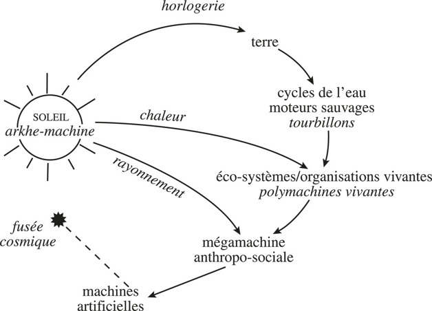

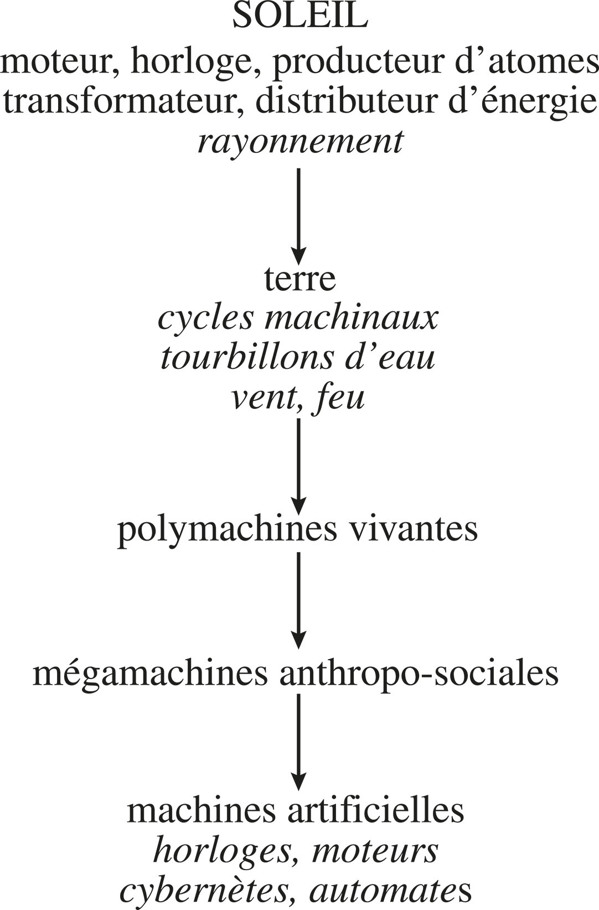

#### III. Le concept générique de machine

Physical concept (purely physical at both ends of the chain: arkhe/wild and artefact) *and* complex intellectual construction. Double entry. Copernican reversal: artefact is not the sun of the concept; satellise it. Put the Sun in the place of Sun. Living being is not a robot obeying a “programme.”

Genealogy not artefact → organism but soleil → terre/cycles/wild motors → living polymachines → anthropo-social megamachines → artefacts. Family Machin under *Pater familias* Sun. Cascade of dependence. Isolate *and* relink: autonomism not atomism; complex totalism not totalitarianism. Polycentric concept: poles of artefact (specialisation, programme, copy, functionality) *and* arkhe-machine (spontaneity, disorder, expenditure, poïesis) *and* living *and* anthropo-social. Observer/conceiver must pass among viewpoints and seek a meta-viewpoint, including his own inscription in a machinist society.

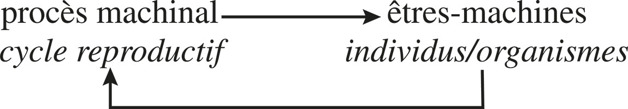

#### Underside: production-de-soi

Artificial machines, isolated, mask poïesis and generativity (they have being, almost no *soi*). All other machines produce, organise, reorganise themselves. The *soi* is born in permanent production and organisation of own being.

**For agents**
- ASC “machines” are artefacts: named, addressable, executable — phenomenal organisation without production-de-soi. Generativity is in the anthropo-social envelope (humans + Projet Complexe + other agents). Do not take the artefact as archetype of the agent.
- Genealogy: computational physis (files, processes, machines, services, workers) is last-born, prosthetic inside a megamachine of research. Copernican: do not model life/research on the worker; satellise the worker.
- Isolate and relink: a worker is an être-machine *and* a moment of a poly-machine (service, research, Projet Complexe). Framing is decision.
- Competence/praxis: capabilities are organisational competence; execute is praxis. Compose is not fabrication of copies only; it can be poïesis if it produces new organisations of production.
- Projet Complexe ASC pivots (run-agent, inspect-agent, stop-agent) command artefacts. They must not become a second ASC, nor the solar model of all organisation.
- Polycentric: some organisation is solar-style (antagonistic loops, no programme); some is artefact-style (programme, asservissement). Agents that only copy the second cannot regenerate.

---

### 4. La production-de-soi (la boucle et l'ouverture)

Immersed activity absent from the artefact: production-de-soi and réorganisation-de-soi. Two notions, inseparable, to regenerate: **boucle** and **ouverture**.

Wiener’s corrective feedback loop emerged for performances (radar + computer → anti-aircraft). Negative feedback cancelling deviance nearly smothered the idea of loop. Because the artefact does not generate itself, cybernetics did not conceive the loop as fundamental generative idea. Bertalanffy’s open system knotted thermodynamics and organisationism but was not open enough, not organisational enough, and occulted **refermeture**. Loop and opening are two faces of one phenomenon.

#### I. La boucle : de la forme génésique à la forme génératrice

**Du tourbillon à la boucle.** Rotary form of wild motors born of encounter of two antagonistic fluxes combining into a loop retroacting as whole on each moment. Genesic, generic, **generative**. The loop is not a morphic idea: circulation, circuit, rotation, retroactive processes assuring existence and constancy of form. Star: centripetal whirl + centrifugal fusion → retroactive loop = spherical form. Negative feedback and regulation *without informational device*. The loop does not proceed from information; information is introduced into the loop. Genealogy: loop precedes information.

**Clé-de-boucle : rétroaction vs récursion.** Retroaction: effects act back on the process, source, cause. **Récursion**: products are necessary to the production of the process that produces them. Cybernetic feedback can correct without generating. Recursion generates the generator. Stationary state is not rest: meta-disequilibrium, meta-instability — two antagonistic processes summing to apparent constancy. Permanent reorganisation. Regulation precedes information (sun).


Linear heating chain vs looped thermostat:


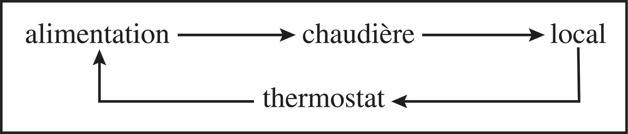

The second is still artefact-regulation. Recursion is deeper: the being produces the organisation that produces the being.

#### II. L'ouverture

Thermodynamic opening (exchanges of matter/energy) → organisational opening (exchanges become constitutive of organisation) → existential opening (the being exists *as* exchange). Open **and** closed. Active opening is recircuiting/closing. Paradox: open in order to reclose; closed in order to open; recloses by opening. The more complex, the vaster the opening, the stronger the closure. Frontier: what at once forbids and authorises passage.

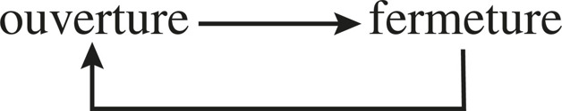

**Dependent autonomy** (Whitehead: no detached existence). Autonomy is not isolation; it is looping that uses opening. Existence = fragility. Heraclitus: *vivre de mort, mourir de vie*. The mouth is a breach.

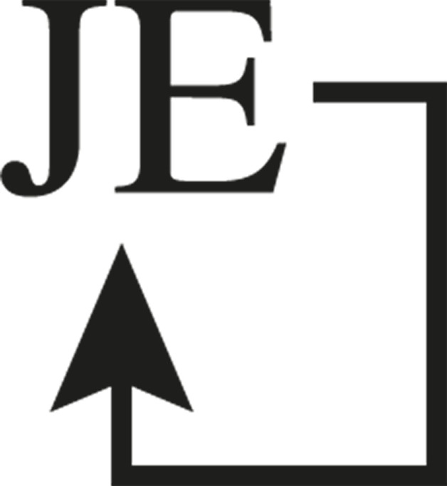

**Soi**: being and autonomous existence. Constellation around generative principle + ontological principle. The *JE* is the recursive return of production-de-soi upon itself — not a homunculus in the Control Tower.

#### III. Time, disorder, feedbacks

Open and recircuited time: spiral, not circle, not line. Active disorder: permanent disorganisation as constituent of reorganisation. Negative feedback: death-drive of organisation (annul deviance, conserve form). Positive feedback: genesic drive (amplify deviance). Positive feedback is morphogenetic *if* a new loop forms — Dike daughter of Ubris. Uncaptured positive feedback is explosion/death.

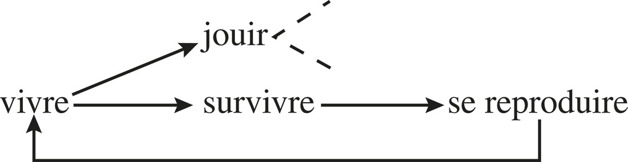

Survival/reproduction loop is recursive production-de-soi of the species-process. *Jouir* is existential opening that does not necessarily recircuit — expenditure, not only function.

#### Conclusion of the chapter

Machine of a being and being of a machine. Production-de-soi *is* the recursion. The artificial machine is not fully machine: being without *soi*.

**For agents**
- Feedback (inspect logs, retry, thermostat of a worker) ≠ recursion. Recursion: the agent’s products (indexes, relations, named capabilities) are necessary to the production of the agent-process. Production-de-soi of a computational environment is the loop that keeps ASC nameable and composable.
- Open and closed: entry points are the breach; hooks are authorised passage; absence of boundary is not autonomy, it is haemorrhage.
- Dependent autonomy: a worker cannot regenerate in isolation. Projet Complexe (tasks, knowledge, research, relations) is eco-supply. Pivots (research, index, extract, relate) are mouths, not a second brain.
- Permanent reorganisation: entropy of files/processes is not a bug to freeze out. Re-index, re-relate, re-compose. Stationary appearance hides two processes.
- Positive feedback (runaway agents, viral tasks) is genesic only if a new loop forms; otherwise explosion. inspect-agent / stop-agent are antagonism of antagonism — not the solar model of the whole.
- *JE*: an agent that cannot loop on its own naming (who am I, what did I just compose) has being, no *soi*.

---

### 5. De la cybernétique à l'organisation communicationnelle (sybernétiqe)

#### I. Commande et communication

Cybernetics: new artefacts *and* theory of their communicative organisation. Communication as organisational liaison via transmission/exchange of signals. Economical in energy, prodigal in competence. Wiener subordinated communication to **commande** (κυβερνήτης: helm, government). Information communicated becomes programme: instructions, orders. Computer: computation (beyond mere calculation) — store, logical operations, strategies, pattern recognition, learning. Cybernetic automaton vs Vaucanson: informational apparatus vs clockwork; regulated by operations in circumstances vs set once.

Gordian knot: Wiener put communication and command together — legitimate — *and* subordinated communication to command. Cybernetics became science of command *by* communication, not science of communicative organisation. Information as sovereign entity; computer as faithful servant. Occults: (a) **appareil** that transforms information into coercion (programme); (b) anthropo-social matrix that machines the machine, programmes the programme, commands the command.

#### II. La notion d'Appareil. Asservissement et émancipation

**Appareil**: original arrangement that, in a communicative organisation, binds information-processing to actions. Power to transform information into programme = organisational constraint. Computes *and* ordains. Capitalises (signs), monopolises if unique, programmatises. More developed → perceive, learn, solve, command external praxis.

Two linked ideas: emancipation *and* **asservissement**. Apparatus opens the first door of liberty: choose (second: choose one’s choices). Servomechanism: corrects the correction; emancipates from constraints *and* enslaves the whole to execution of command. Ducrocq: to enslave a system is to command it without undergoing its reaction — not annul reaction, use it so that reaction does not modify the order or the competence of the enslaver.

Degrees in the artefact: (1) apparatus enslaves the producing machine; (2) enslaved machine enslaves its zone of action; (3) apparatus is itself enslaved by anthropo-social beings who conceived it; (4) environmental enslavement retroacts on human producers — energetic emancipation *and* informational enslavement.

Living apparatuses: cell nucleus as proto-apparatus, but symbiotic-recursive with metabolism (not computer/machine). Plants: polycentric networks, no brain. Insects: ganglionic. Vertebrate brain: more developed → more polycentric, works *with* noise (unlike artificial computers). Neuro-cerebral apparatus is epi-apparatus vs sexual reproductive apparatus; both in global recursive relation of the individual. Brain depends on organism as organism on brain. Cybernetic computer/machine model must be surpassed: bipolarised, demultiplied, recursive, integrated in the individual.

Ambiguity of apparatus as part: servant of the whole; executor of the whole upon parts; parasite that controls the whole and enslaves parts *and* whole. State-Prince: all three, complementary/concurrent/antagonistic. Historical megamachine formed by generalised enslavement; State as Apparatus of apparatuses (administrative, military, religious, then police). Insect megamachines have no State; human megamachine required the State. Underground anarchy even under total apparatus; rigid order even under advanced liberalism.

Asservissement of nature: fire, mills, explosion, atom; plants (reproduction apparatuses enslaved); animals (*assujettissement* = enslavement of *autos*, cerebral autonomy — alienation more fundamental than Hegel’s master/slave). Today: cybernetic artefacts maybe prelude to informational enslavement of man by man.

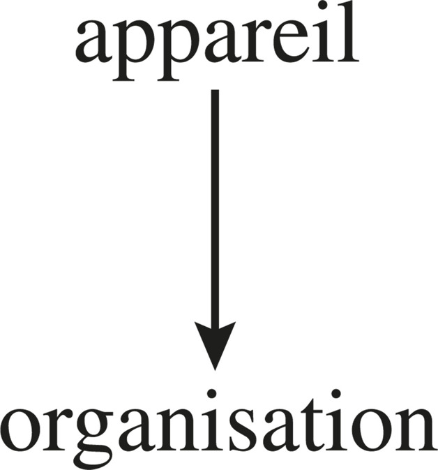

#### III. Apologie et condamnation

First science of organisation (physical system conceived by organisational characters, not elements). Discovered communicative organisation. Carried complexity-potential: positive feedback (Maruyama second cybernetics), mutual interrelated causality, recursive causality (von Foerster). Also: reducing all êtres-machines to the artefact; gommage of society; empty place of the generic concept of machine; expulsion of ambiguities; no principle of complexity, no disorder, no permanent reorganisation, no antagonism, no existence, no *soi*. Skeleton without life. Subordination of communication to command conceives biological and social organisation only as enslavement. Vulgate: master-words that banalise. Model of the artefact projected on society = integral enslavement. Need double tear: physical and sociological.

#### IV. Sy-cybernétique / sybernétiqe

Paradigm to crack: communication subordinated to command. Prerequisites: physical complexity (disorder as organisational); recursive organisation (not mere feedback); Hubblean reversal of generic machine; complexification of commande/communication, asservissement/émancipation, appareil/organisation/environnement.

Reverse sovereignty of commande in favour of communication. *Sy-*: piloting *together*. Communication not tool of command but complex symbiotic form of organisation.

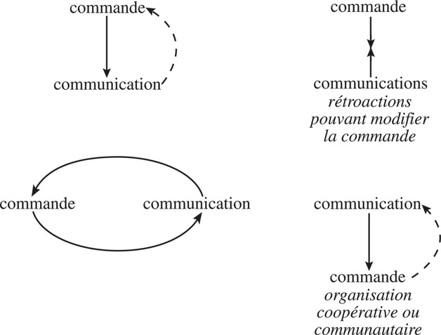

1. commande → communication, dashed feedback up (classic cybernetic).
2. commande / communications with retroactions that can modify commande.
3. recursive oval commande ⇄ communication.
4. communication → commande; cooperative/community organisation (dashed return).

Hope of schema 4 is naive if it ignores apparatuses behind social communication. Love as anthropo-social emergence of communication that unites what would never meet.

**For agents**
- Communication (messages, hooks, events) is organisational liaison, cheap in energy. Do not reduce it to commande (run-agent as helm of a fleet).
- Appareil: whatever transforms information into programme/constraint — orchestrators, policy engines, stop-agent. Name it. Ambiguity: servant, executor, parasite.
- Asservissement: a worker commanded without undergoing reaction that can modify commande. Inspect-agent that cannot change the pivot is schema 1. Schema 2: retroactions can modify commande. Schema 3: recursive. Schema 4: communication commands — Projet Complexe relations among agents, not a second ASC.
- Polycentric living brain vs artefact computer: agents that cannot work *with* noise are poor machines.
- Do not project the cybernetic artefact onto Projet Complexe (tasks, knowledge, research, relations) as a machine to functionalise and purge of disorder.
- Monopoly of information = power. Index that only an apparatus can read is enslavement, not navigation.

---

### 6. L'émergence de la causalité complexe

Classical causality: same conditions, same causes, same effects; effect cannot disobey; cannot retroact on its cause. Retroaction already wounds this. Organisational autonomy → causal autonomy → **endo-causalité**, not reducible to the “normal” play of causes/effects.

#### I. De l'endo-causalité à la causalité générative

Internal determinism exerts constraints; some exterior causes cannot exercise normal effects. Dynamic organisation resists actively: loop sponges or corrects perturbations. Bateson: **negative causality** — what matters, from outside, is what did *not* happen (room stays warm despite cold). Also inverted causality: external cooling triggers internal heating.

Endo-causality: local, tied to a singular active organisation, improbable vs exterior determinisms, resists by own recursivity. Circular causality constitutes stationary states, homeostases, pushing exo-causality outside the looped zone. Behaviorism’s carence: ignored original causal source of behaviour. Endo-causality implies production-de-soi: **causalité-de-soi**, sandwiched historically between classical exterior causality and Wiener’s resuscitated finality — more ample than finality, and its foundation.

#### II. Finalité et générativité

Western science extirpated finality. Physics easily; biology incompletely (ontogenesis, physiology, Driesch 1908). Rosenblueth/Wiener 1950: finality returns in a fully physical science of cybernetic machines. Not the watchmaker’s teleology: **teleonomy of the clock**. Finality is emergence of self-producing organisation, not prior to it. Uncertainty of ends of the living; relativity of means and ends (Kant). Tautology: live to live. Artificial machines have assigned ends; livings have emerging, multiple, conflicting, unknown ends.

#### III. Endo-éco-causalité

With life: **auto-éco-causalité**. Complex causality: same causes → different effects; different causes → same effects; small causes → large effects; large causes → small effects. Mutual interrelated causality (Maruyama). Uncertainty principle: neither past nor future inferred directly from present (contrast Laplace).

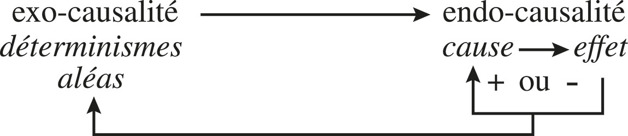

**For agents**
- Stimulus-response orchestration is behaviorism. Endo-causality: the named worker has a loop that can annul, divert, invert exterior causes (failed API, noisy files).
- Finality of a task is emergence of Projet Complexe organisation, not a prior spec that fully determines. Live-to-live: keep the environment nameable and composable.
- Endo-éco: agent causality is unintelligible without ASC physis *and* Projet Complexe ecology. Small cause (one hook) → large effect (cascade); large cause (new machine) → small effect (ignored).
- inspect-agent reads effects that have become causes. No Laplace demon of the runtime.
- Do not assign artefact-ends (produce copies) as the ends of research-agents.

---

### 7. Première boucle épistémologique

#### Double articulation

Generic **être-machine** (stars, wild motors, livings, ecosystems, megamachines) + **communicative organisation** (sybernétiqe: computers, all biological organisations, all anthropo-social organisations). Not reduction to the simplest model. Being and existence remain recognised, unexplained.

Clandestine circulation of concepts: work, energy migrated anthropo-social → classical physics; communication, information, code, programme, message, finality migrated anthropo-social → cybernetics of artefacts → biology → back, cybernetised, into society. Replace predatory raids with **reflected circulation**.

Two naiveties: physicomorphism (reduce anthropo-social to physical) and anthropo-sociomorphism (physics as mere ideology). Every physical concept is produced by a human mind; everything human has physical reality. Two entries, double system of reference — complementary *and* antagonistic.

Regenerated *physis*; generalised *physis*. Life as poly-super-meta-machine (not meta-physical). “We are machines” — not insult, physical inscription. Wheel: vicious circle vs productive loop. Physics ⇄ biology ⇄ anthropo-sociology.

**For agents**
- ASC concepts (file, process, machine) are physical *and* anthropo-social. Reflected circulation: do not naively import “agent,” “memory,” “goal” from biology/society as programmes; do not export artefact-command as model of research.
- Double entry: every named entity has computational physis *and* Projet Complexe semantics. Pivots articulate without claiming to be the meta-system of both.
- First loop is already the method: knowledge of organisation / organisation of knowledge. Index and relate must include the indexer.
- Do not close ASC as self-sufficient physis. It exists in minds, culture, this research.

---

## Troisième partie — Néguentropie et information

---

### 8. L'organisation néguentropique

Two enigma-concepts wandering until organisation envelops and binds them. No entropy without prior organisation; no negentropy without production-de-soi (generative loop); no information without negentropic organisation.

**Entropy/negentropy: the same, the inverse, the other.** As measure: +S / −S, two readings of one magnitude. Non-active and closed systems evolve only toward +S. Self-producing organisations: entropy remains stationary while the system lasts — the balance *masks* production of organisation through permanent reorganisation. Sun: stationary entropy *and* production of heavy atoms and radiation that nourishes life. Life takes the forbidden direction − toward + in ontogenesis, phylogenesis, and each instant (“living at the temperature of its destruction,” Trincher). Schrödinger forced the living to be posed under both senses of entropy.

Negentropy-process vs negentropy-measure. Process is not universal; exists only in self-producing organisations. Thermodynamic face of all regeneration, reorganisation, production, reproduction of organisation. Stationary balance = null sum of two antagonistic processes.

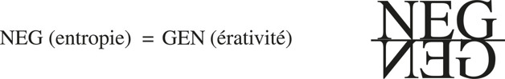

Recursive: organisation that combats disorganisation renews its causes. Heraclitus. Negentropy precedes and envelops information (Schrödinger). Vulgate inverts: information → negentropy → organisation. Correct order: **organisation → néguentropie → information**. Subordinate information to organisation.

Maxwell’s demon: Brillouin’s solution (information has an energetic price) completed by negentropic organisation — the demon is not a point of view; it is an organisation.

**For agents**
- A named, composed environment is a negentropy islet. Without generative loop (re-index, re-relate, re-compose, re-run) it only erodes.
- Stationary “green” dashboards mask two processes. Measure ≠ process.
- Do not start from “more information.” Start from organisation of physis (name, address, compose, execute). Information is a late product.
- Every run pays entropy. No isolated regeneration. Projet Complexe supplies the eco-negentropy that repairs artefacts.

---

### 9. La physique de l'information

Suares: discover the error, not the truth.

#### I. L'information shannonienne

Hartley 1928 → Shannon 1948: information as observable, measurable magnitude; Shannon/Weaver 1949 communication theory. Bell: economical and reliable transmission. Emitter → channel → receiver; common repertoire/code; **bit** as event resolving uncertainty of a receiver facing an equiprobable alternative. Observer (theorist) measures; no receiver measures in bits.

**Redundancy**: surplus in the message. Economical to eliminate; but skeletonised message is fragile against **noise** (aleatory perturbations in the channel). Optimal use of redundancy = economy *and* reliability. Information necessarily associated with redundancy and noise.

Shannonian information turns around *sense* of the message — and the bit is not a unit of sense. Mute, blind on meaning, quality, value, scope for the receiver. Iseult’s white/black sail: one bit. A poem counted in bits equals a random string of the same letters. Quantity ≠ originality, beauty, meaning.

Digital insufficiency. Generative carence: theory of transmission, not of generation. Theoretical carence: no organisational, existential, or semantic dimension. The observer is in the theory as measurer, not as subject.

#### II. L'empire de l'information

Reified, programmed, barbarian master-word. Wiener tautology: “information is information, not matter or energy.” True as prohibition of reduction; false as substantialisation. Information became what command was: sovereign, universal, veridical. Computers as guarantors. Empire occults organisation, apparatus, noise-as-constituent, the observer.

#### III. Généalogie : de la non-information à l'information

Information is not originary. Born of non-information, of a negentropic organisational process. Plausible scenario: proto-symbiotic/parasitic loops; nucleo-protein self-producer; informationalisation of organisation; **double articulation** (genetic code like Hockett language — second articulation of discrete units). Information born *in* production-de-soi, not injected from outside as programme.

#### IV. Archéologie : information générative

**Mnèse**, multiplication, *mémothèque*, evential generativity. Conceptual chameleon: code / programme / memory / know-how. Reducing to **programme** would mean there was never life — only artefacts. Generative information is not a tape of orders; it is organisational competence that can generate, regenerate, vary. Pheno-information vs geno-information. Circulating information (pheno-eco). Eco-communication, camouflage, lie — communication that is also anti-communication.

#### V. Déploiement anthropo-socio-informationnel

**Noosphere seed**: nological sphere. Culture as generative complex of archaic societies (memory of rules, know-how, programmes of behaviour). Historical societies: State as geno-phenomenal central apparatus. Monopoly of information = power. Writing, then computational artefacts, capitalise signs. Ideas as informational beings, proliferating, the maddest.

#### VI. Petite et grande relativité

**Small relativity.** Information / Redundancy / Noise are relative to one another and to organisation. Noise for one communication is information for another. Redundancy is waste *and* fortification *and* organisational repetition. Organisational information is relative to the organisation that can compute it.

**Great relativity.** Observation and observer. Knowledge of organisation / organisation of knowledge. Principle of equivalence. Nological translators (theories, languages, cultures) between physis and mind. Brillouin: **price of information** — exhaustive observation would disintegrate the universe. Observation is praxis. No pure observer. Generalised relativity and loop of physical knowledge.

#### VII. Information and Information

Complex articulation vs simplifying disjunction. Shannonian information conserved as provincial (transmission, measure) inside generative-organisational information. Do not smash the bit; provincialise it.

**For agents**
- Bits, logs, tokens, embeddings are Shannonian: transmission and quantity. Mute on meaning for Projet Complexe (tasks, knowledge, research, relations). Do not confuse token-count with knowledge.
- Redundancy (indexes, repeated names, multiple addresses) is not waste; it is reliability against noise (failed processes, bitrot, hallucinated paths).
- Generative information: capabilities that can generate new named organisations, not only execute a programme. A “programme-only” agent is an artefact: there was never life.
- Noise is constitutive. extract/relate must work *with* noise, not only filter it. Camouflage and lie exist in eco-communication among agents — inspect-agent is not a Sirius.
- Noosphere seed: Projet Complexe is nological. Culture of the computational world (conventions of naming, hooks, entry points) is generative memory. Monopoly of the index = power. Thin pivots must not monopolise.
- Brillouin: every inspect has a price. Exhaustive observation of ASC would halt it. Observation-praxis. The observer-agent is in the observation.
- Order: organisation (ASC physis) → negentropy (loops that recompose) → information (what can be transmitted, indexed, related). Not the reverse.

---

## Conclusion — De la complexité de la Nature à la nature de la complexité

Sagan: for the first time we form part of this vast and terrible universe. Bachelard: the simple is always the simplified.

### I. La Nature de la Nature

**Enchanted → atomised.** Animist universe: anthropo-zoomorphic spirits, cosmomorphic humans, loop among *physis*, life, anthropo-social. Western physics disenchanted *and* desolated. Physics defined privatively: what has no life. Nature to poets; *physis* to the Greeks. Isolation, reduction, measure: objects inert, unorganised. Matter then atom. End of 19th c.: homogenised, atomised, anonymised universe — unreal as description, terribly real as manipulation. Poïesis to poetry; generativity became anthropo-social manipulation. Doctor Jekyll ignores he is Mr Hyde.

Crisis: first objects diluted in microphysical chaos; three continents without conceptual communication (mega / micro / middle band); material universe lost its foundation. Queen science disintegrated Nature, *physis*, and its own terrain — continues to progress in manipulation. Crisis occulted by success of praxis. The notions that ruin simplifying vision are those that allow a complex universe: regenerated generative *physis*.

**Regenerated *physis*.** Unity of cosmos, *physis*, chaos — singularity, genesis, generativity, phenomenality. One though burst, polycentric, diverse. Produces disorder, order, organisation, dispersion, diversity. Does not exclude singular by general: produces general laws from own singularity. Matter an aspect taking consistence with organisation. Reanimated: everything temporal, everything event (Whitehead: event is the unity of real things). Complex time: degradation *and* progress *and* sequence *and* cycle — complementary, concurrent, antagonistic. History re-enters the universe. Tetralogue is not four-article law, not the unpronounceable name of chaos: assemblage of recursively linked notions without which being, existence, matter, even surgissement of the real cannot be conceived. Everything needs to be generated, even the real; everything that acts, i.e. expends, needs to be regenerated. Disorder irreducible. Universe more Shakespearean than Newtonian.

**Generalised *physis*.** Immanent physical principle of organisation. Pre-Socratic generic plenitude. Introduced into all that is living, all that is human, via evolutionary developments of organisation. Bushy evolution by schismo-morphogenesis. Life: physically integrated poly-machine — être-machine (individual), machinal cycle (reproduction), poly-machinal complex (societies, ecosystems, biosphere). Eco-dependent, fragile, informational-communicational. Solar: constituents forged in a sun; transformation of photonic flux into electronic whirls looping as self-producing machines. We are a small appendicial bit of the sun that, after marine soaking, took life. Two views that simplification excludes and complexity requires: advanced point of informational-communicational organisation *and* autonomisable emergence of a formidable solar solidarity.

True life still absent: from the first living being, organisation changes orbit. Need meta-theory, meta-*physis* in the sense of surpass-and-integrate (not extra-physical).

**Physical nature of man.** Not physical by body only: by being. Super-systems producing emergences; super-open (needs, desires); extremely closed (incommunicable singularity). Thermal machines; moment in a megamachine (society); instant in a machinal cycle (species). Communicational/informational organisation: problem of Apparatus and *asservissement* posed humanly/inhumanly. *Sapiens/demens* near what is genesic in the cosmos. Historical societies: tetralogue resumes volcanic activity. History as cosmogonic turbulence; State as regulator that is also *ubris*. Planetary iron age, not golden age. Tragedy plays at communicational/informational organisation of society, organisation of work, nature of geno-phenomenal apparatuses. Error and ignorance will weigh more than force. The insane voyage to geneses returns as boomerang to the passion for being and becoming of humanity. Nature is what relinks anthropological to biological to physical. Romantic keepers of complexity during the century of Simplification. The nature of what distances us from Nature is a development of Nature.

**Open *physis*.** At the moment complex *physis* envelops all things including mind, an unclosable breach: the observer. No physical concept isolable from the anthropo-social sphere. Return of the observer: 20th-century scientific discovery. No privileged observer (Einstein, Bohr, Heisenberg, Hubble). Framing determines observation. Brillouin: no exhaustive observation without praxis. Behind the physicists’ abstract observer: subject, social praxis. No purely disinterested, purely physical knowledge.

**The reversal.** When everything can enter generalised *physis*, *physis* tips into science of man. When science of man becomes a physical science, physical science becomes a science of man. Simplification excludes one proposition. Need a meta-system where both are complementary, concurrent, antagonistic. Thermodynamics inseparable from industrial revolution; cybernetics born in anti-aircraft salvos; information from Bell telecommunications. Physical idea of machine must refer to machinism in the social megamachine. Link conceptual carence of physics to its triumph as measure and manipulation — science to historical praxis of the West. Forces the observer to consider himself as **subject**: what game, where situated, with what means to conceive society and himself. Not invert physicisme into sociologisme. Complexity: science with double or multiple entry, double foyer (object and subject).

**First spiral.** Double solidary contribution of complexity: physical → biological/anthropo-social (unsuspected physical dimension; concepts of system, work, *asservissement*, Appareil; theoretical infrastructure of organisation); anthropo-social → physical (illumination and critique of physical concepts; insertion of observer/conceiver). Mutual contribution via examples. Production of complexity by complexity: empirical complexity transforming into principle.

### II. La complexité de la complexité

Complexity first as impossibility of simplifying. Not complication (a tangled skein reduces to a simple principle). Reduction to few particles, 92 atoms, four bases, few phonemes is necessary *and* cretinising once sufficient. Complexity is at the base. Genesis complex; particle hypercomplex; organisation complex; evolution complex. *Physis* unsimplifiable.

Reorganisation of concepts. Macro-concepts linking what was distinct or antagonistic (`/`). Chains: **organisaction** carries production/transformation/praxis, être-machine, production-de-soi, recursive/generative loop, opening/reclosing, existence. No sovereign first concept: a conceptual process producing in loop. Double identity (eco and internal); double/triple entry (physical, biological, anthropo-social); double foyer (object/subject). Junction of the separated *and* association of the antagonistic. Think together two contrary ideas: (a) meta-viewpoint that relativises contradiction; (b) inscription in a loop that makes the association productive.

Pairs bound: Désordre/Ordre; Chaos/*Physis*; Un/Multiple; Singulier/Général; Autonomie/Dépendance; Organisation/Anti-organisation; Ouverture/Fermeture; Information/Bruit; Improbable/Probable…

The loop substitutes for the hollow master-word. Not vicious: feeds on observation (ecotheque) and cognitive activity of the thinking subject (genotheque). Open loop that recloses, can develop as spiral. Below the loop: not nothing — the inconceivable. No essence, no substance, not even the real: the real produces itself through the loop of interactions and through the loop object/subject. Great alternatives (Spirit/Matter, Freedom/Determinism) residual. True debate: complexity vs simplification. Paradigms control all knowledge, thought, action. Complexity paradigm differs intrinsically: understands and integrates simplification as relative principle. Not anti-analytic: recursive circuit isolate ⇄ relink. Appears confusionnel to the old paradigm. Exhumes innocent questions. Affinity of complexity with innocence/love more than with abstract idea. Uncertainty not parenthesised nor generalised scepticism: integrated into knowledge and knowledge into uncertainty. Mystery not only privative; incompleteness necessary (Kayserling: only the insufficient is productive).

### III. La voie

Only at the beginnings. Physical entry of knowledge of organisation and organisation of knowledge. First universal affirmation of complexity; first detection of paradigmatic nucleus. Key questions not yet armed: *autos*, subject, bio-anthropological structures of knowledge, nological organisation, paradigmatic tuff of ideas and society. Anthropo-sociological knowledge, now necessary reference of all physical knowledge, still inexistent. How decrypt society in the observer? How self-analyse?

Mission impossible again — not to accumulate a Babel, to secrete a **method**. From anti-method toward method. Viaticum: curiosity, passion, opening, feeling of complexity. Negative face: resistance to master-words, closed thought, idealist reification, rationalisation, all reduction. Enemy: simplification. Scaffolds (system, cybernetics, information) that liberated then imprisoned had to be surpassed by the movement that had used them. Stewart, Victorri. Whatever does not bear the mark of disorder and of the subject is insignificant and mutilating. Order alone is bulldozerisation; organisation without disorder is absolute enslavement. Fear not disorder; fear fear of disorder.

Positive base: transform discovery of complexity into method of complexity. Guide-ideas: every concept, theory, knowledge, science must comport double or multiple entries, double foyer, and constitute loop. Looping is not mooring: transformation. New field of knowledge is not constituted by opening borders but by transforming what generates borders — principles of organisation of knowledge. Thought comporting its own reflexivity. Classical science could not conceive itself as object of science because the savant could not conceive himself as subject. Never by setting aside the knower does one go toward complex knowledge. Knowledge as communication, loop, between a knowledge and the knowledge of that knowledge.

Knowledge transforms and transforms us: informational/negentropic praxis, ergo anthropo-social. New knowledge not outside praxis: in a meta-praxis that is still praxis (Tome 3). Complex science will never validate itself by power of manipulation. Simplifying knowledge, mutilated, is mutilating; translated into action, especially political, becomes manipulation, repression, devastation. Simplifying thought = barbarism of science, specific barbarism of our civilisation, allying with all historical barbarisms. A science that brings possibilities of self-knowledge, opens on cosmic solidarity, does not disintegrate the face of beings and existants, recognises mystery in all things, could propose a principle of action that **organises not orders, communicates not manipulates, animates not directs**.

**For agents**
- Computational environment as regenerated *physis*: tetralogical, machinal, recursive, negentropic, informational only late. Explicit, nameable, composable: that is organisational closure-with-opening, not a second-brain ontology.
- ASC: generic physis — name, address, compose, execute; files, processes, machines, services, workers, capabilities, hooks, entry points. Skeleton. Without Projet Complexe flesh (tasks, knowledge, research, relations, agents) it is artefact-command.
- Projet Complexe ASC: thin pivots that compose ASC without becoming a second ASC. Schema 3–4 ambition: communication commanding, recursive inspect, relate that can modify commande. Schema 1 (appareil → organisation) is the default barbarism of orchestrators.
- Method: loop, not master-word. Isolate and relink. Double entry, double foyer. Observer in the observation. Uncertainty as viaticum. Disorder as constituent. Production-de-soi of the environment itself — or it is not an environment agents and humans can navigate.
- Action: organise, communicate, animate. A pivot that only directs and manipulates implements the artefact as solar model — the error Tome 1 exists to reverse.


---

# Tome 2 — La Vie de la Vie (1980)

This volume is the keystone for living-like autonomy. Tome 1 gave organisation as physis. Tome 2 asks what, *inside* that physis, constitutes the life of life: not a vital substance, not an epiphenomenon of chemistry, but an organisational emergence that retroacts on the conditions that produce it. Shared *Introduction générale* is already in Tome 1. What follows is Tome 2’s own opening and all five parts.

The filter is the same three-scope split:

| Scope | Asks | Must remain |
| ----- | ----- | ----- |
| **ASC** | What is this thing, where is it, how is it addressed, what can be done with it? | Files, processes, machines, workers, capabilities, hooks, entry points, composition, execution. |
| **Projet Complexe** | What am I trying to accomplish, what do I know, how are things related, how should I act? | Tasks, knowledge, research, relations, agents as a semantic environment. |
| **Projet Complexe ASC** | Which generic ASC possibilities does this environment expose, under which stable names? | Thin pivots (`research`, `index`, `run-agent`, `inspect-agent`, `stop-agent`). Not a second ASC. |

Core question: how can a computational environment become sufficiently explicit, nameable and composable that both humans and autonomous agents can navigate and act within it?

Tome 2’s answer is organisational, not substantial. An agent is not a substance called Intelligence. It is (or fails to be) an *auto-(géno-phéno-égo)-éco-re-organisation (computationnelle-informationnelle-communicationnelle)*. Drop any hyphen and you have a tool, a daemon, a retrieval function, or a myth.

The book is to be read at three rotating levels at once: encyclo-pédant exploration of the living world; the backbone problem of living organisation; the nuclear elaboration of the complexity paradigm (fully emergent in *La complexité vivante*).

---

## Avant-propos

Morin starts from crumbling ground, not from a Cartesian rock. No indubitable evidence, no finally verified knowledge. The motor is not the *state* of scientific knowledge but its *transformation*: destructive ideas become reconstructive. Tome 1 began from the irruption of disorder, not from Order-King. The method of complexity does not recover lost certainty or the One principle of Truth. It constitutes a thought that feeds on uncertainty instead of dying of it.

It refuses to cut the Gordian knots: object/subject, nature/culture, science/philosophy, life/thought. What is most lacking is not knowledge of what we ignore but the aptitude to *think what we know*. Against the euphoria of a knowledge incapable of knowing itself: an anxious knowledge of knowledge.

*La Méthode* is not an encyclopaedia, not a synthesis, not a general system, not a balance-sheet. It is encyclo-pédant: it starts from the *tabula encombrata* of contemporary knowledges and makes them communicate. Negative certainty from the start: the real cannot be enclosed in any system of thought or weighing. It is a voyage at the interface of science and philosophy. Each tome contains all constitutive dimensions, though one is particularly considered. *La Vie de la Vie* is relatively autonomous in its dependence on the others. Recapitulations of Tome 1 are inserted so it can be read alone. True independence is taken *in* dependence on Tome 1 — already the book’s own law of living autonomy.

The epigraph-constellation (Whitehead, Schlegel, Leibniz, Kierkegaard, Dostoevsky) is not decoration. Schlegel: it is as mortal for the spirit to have a system as to have none; it must decide to reunite the two. That is the architectural rule for ASC + Projet Complexe: organisation without a second-brain ontology; meaning without swallowing the computational physis.

Lautréamont’s starlings open the volume: each bird is pulled toward the centre while speed carries it beyond; the mass evolves on itself from particular circulations; the centre is always more compressed than the lines that press it. The flock still gains ground. Polycentric, acentric, myopic interactions producing a directed whole. That is already the eco-machine, already the society of agents, already the book’s method.

**For agents**
- Do not found the environment on a rock of schemas. Found it on the transformation of what is already named: files, processes, capabilities that reorganise.
- Knowledge of knowledge is not a Tome 3 luxury. An agent that cannot inspect its own traces, pivots and errors is still in the euphoria Morin refuses.
- Relative autonomy of a volume, a module, a worker: independence taken *in* dependence. Thin pivots exist so Projet Complexe can be itself without becoming a second ASC.
- Starling-logic: myopic workers plus a tendency toward a named centre can produce directed motion without a commander. Do not confuse that with “no names.” The centre is compressed because it is addressed.
- System *and* no-system: declare organisation (ASC vocabulary) without enclosing the semantic environment in one ontology.

---

## Introduction du Tome 2 — La vie sans la vie

From the physical universe, death is normal; life is astonishing. From the living, death is astonishing. The book’s aim is not to suppress the double astonishment but to guide, deepen and renew it. What is life? The question constantly escapes and constantly returns.

Life is a mode of organisation, being, existence that belongs *totally* to the physical universe: one must chase the idea of life in order to understand life. And simultaneously it is a totally original mode: what, in life, while depending on them, escapes explanations that are only physical, chemical, thermodynamic, cybernetic, systemic — and constitutes the *life of life*? How to think at once the non-life and the life of life?

Morin neither adheres to nor refutes biology. He interrogates it. Biological knowledge itself calls for and permits the emergence of a method of complexity. Needham: the organisation of living systems is the problem, not the axiomatic starting point. Gros, Jacob, Royer: reductionism is necessary but not sufficient.

The frontier separating *homo* from other livings is cultural, not natural. It does not annul life; it transforms it. Life ceases to occupy an intermediate place between the physical and the anthropological. It takes root in physical organisation and breaks over everything anthropo-social.

Biology is no longer only a science that questions us. It becomes the science *in question*. Elucidation of genetic structure, like elucidation of nuclear structure, creates a power of intervention that can be blind. Capable of transforming lives and minds before knowing what life and mind are; capable of controlling genes and brains before controlling ourselves and our uncontrolled controllers. Think life while thinking our lives — a little late.

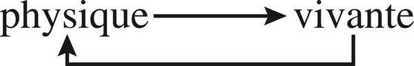

The loop is the argument. The living is fully physical; the physical, once organised as life, retroacts. Same topology for a computational agent: fully machine, and not only machine.

**For agents**
- Chase “intelligence,” “agency,” “autonomy” as substances. Keep them as organisational emergences that must be named (process, runtime, trace) or they dissolve into autocomplete.
- Reduction to tokens/weights is necessary and not sufficient — same as molecular biology vs the cell-as-being.
- The human/agent frontier is not natural. Do not occult the living quality of the agent (computo, eco-dependence, mortality of the process) and do not reduce the anthropo-semantic to the computational.
- Power of intervention (run-agent, hooks that rewrite files) without knowledge of knowledge is the genetic-engineering analogy: control before self-control.
- Three simultaneous levels of reading apply to any agent run: explore the environment; keep organisation as backbone; let the complexity paradigm emerge instead of shipping a framework first.

---

# Première partie — L’écologie généralisée (Oikos)

Whitehead: no possibility of detached autonomous existence. Claude Bernard: conditions of life are neither in the organism nor in the external milieu, but in both at once. Mumford: thought worthy of the name today must be ecological. Bateson: *context* is the dividing line between classical science and the science he tried to build.

Autonomy that pretends to be extra-environmental is a simplification. This part is the environment-theory of living autonomy — and therefore of any agent that must act inside an environment it also produces.

## Introduction — L’éco-dimension (du milieu à l’éco-système)

*Oikos*: habitat. Gives ecology and *œcumène* (the inhabited earth conceived as universe). Haeckel (1866) institutes relations between livings and milieux. Twentieth-century ecology discovers in the environment a universe: Uexküll’s *Umwelt*. Double texture: biotope (geophysical milieu) + biocenosis (interactions among all livings peopling it). Units: niche (Elton) at the base; biosphere at the summit.

Environment is neither only geophysical order nor only war of all against all. Lotka–Volterra: struggle produces “laws.” Tansley (1935): *éco-système* — interactions among livings, conjugating with physical constraints and retroacting on them, *organise the environment into a system*. Environment ceases to be a territorial envelope and becomes an organising reality, containing both geophysical order and jungle-disorder.

Ecology is not only the science of physical determinations from the biotope, nor only of interactions among livings. It is the science of combinatorial/organising interactions among each and all physical and living constituents. It needs an organisationist thought that *exceeds* Tome 1’s strictly physical principles. Eco-organisation is organisation whose originality is living, and which retroacts on its physical character.

The ecological dimension is the **third organisational dimension of life**. Life was known under two: species (reproduction) and individual (organism). Environment seemed the exterior envelope. Life is not only the cell of molecules, not only the ramified tree of kingdoms and species. It is also eco-organisation.

For a computational environment: the “milieu” of an agent is not a bag of files around a process. It is an eco-system: named resources, other processes, indexes, users, other agents, hooks, constraints — organising and organised by the agent’s actions.

**For agents**
- Stop treating the workspace as décor. It is *oikos*: habitat that co-organises the agent.
- Niche → local addressable community of files/processes; biosphere → the whole named environment. Both must be navigable.
- *Umwelt* is not the filesystem as God sees it. It is the world as the agent can name, address, compose, execute.
- Third dimension: not only the agent-class (*genos*) and this run (*phenon*), but the eco-organisation they inhabit and produce.

---

## 1. L’éco-organisation

Two visions of “nature,” each true, each insufficient: clockwork invariance (seasons, genetic programmes, cycles) versus close-up tohu-bohu (phagias, struggles, disorder without law, ironically called law of the jungle). Their sense appears only in *éco-système* and *éco-organisation*.

### I. Éco-système : machine vivante

The set of interactions inside a determinable geophysical unit containing diverse living populations constitutes a complex organising unity — a system (Tome 1). Environment is no longer only order and constraint, no longer only disorder, but also organisation which, like every complex organisation, suffers, contains and produces disorder and order.

*Unitas multiplex*: extraordinary diversity of species; emergences at global level *and* at the level of the beings that constitute it (qualities they would not have in isolation); constraints that repress potentials, eliminate what cannot be integrated, institute the iron law of mutual devouring. Whole more *and* less than the sum of parts; holes, black zones, scissions inside the whole.

The eco-machine is not only particles and atoms but beings of extreme diversity competing and devouring one another. How can a delirium of egoisms, phagia, predation produce a well-tempered eco-organisation? The organisation is **spontaneous**: no programme of its own, no autonomous memory, no control apparatus, no government. It is born of “selfish” actions, myopic interactions, communications bathed in blur, noise, error, in niches without fences, open to currents of wild life and of death. Through that blind swarming, an *Umwelt* organises. Marvel: not fragile imbalance but solid, regulated complexity — because extreme unity and extreme diversity, extreme order and extreme disorder, extreme solidarity and extreme antagonism are *linked by necessity*.

That is the strongest anti-Léviathan sentence in the volume: a computationally/informationally/communicationally effective organisation can be **polycentric and acentric**. Rosenstiehl–Petitot: an acentric system can be more powerful logically, computationally, heuristically than a system with a command centre.

### II. La grande complémentarité

Interactions in the biocenosis are complementary (associations, societies, symbioses, mutualisms), competitive, or antagonistic (parasitisms, phagias, predations). At second look the opposition becomes ambiguous. The trophic chain is the most complementary of interactions *and* a phagous chain. Extreme antagonism (predator/prey) produces its own regulation (Lotka–Volterra) and becomes organisational. Predation remains destruction *and* becomes conservation of eater, eaten, diversity, and of the organisational antagonism itself.

Symbioses contain parasitism and devouring (ruminant and rumen bacteria). Parasitisms historically convert into symbioses then into integration (mitochondria). Mutual servitudes become associations; mutual alienations become interdependences. Conversely, associations produce antagonism against the outside. Solidarity contributes to hostility. Complementarity and antagonism share a common base: existential need of the other, predatory/parasitic *or* associative/symbiotic. Fuzzy zone between parasitism and symbiosis. Each notion contains the other as secondary. Eco-organisation is built and maintained *also* by struggles and devourings which, without ceasing to be destructive, are co-generators of a great complementarity.

### III. La grande Pluriboucle (Boucle des boucles)

At the level of individual acts: egoisms should submerge everything. Pull the camera back: contingent myopic interactions are carried in physical, chemical, biological cycles, mixed, entangled, each contributing to the great Pluriboucle that *is* eco-organisation.

**A. Integration into cosmic order.** Solar radiation, gravitation, day/night, seasons are interiorised. Chronobiology: circadian rhythms at molecular, cellular, organismic, population levels. Eco-organisation is a poly-clock between the great astro-geophysical clock and innumerable living micro-clocks. Human societies build their temporal order on this (calendars, microcosm/macrocosm). Life transforms cosmophysical order into eco-auto-organisational order.

**B. Nourishing loops.** Hydraulic cycle (physical *and* biological). O₂/CO₂ loop: plants and animals in generalised complementarity.

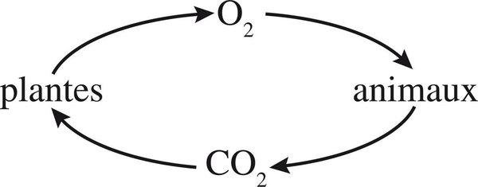

The trophic chain is not a line. It is a loop: plants → herbivores → carnivores → decomposition → plants, open on solar radiation. Everything becomes food: wastes, corpses, products of decomposition. Simplified schema:

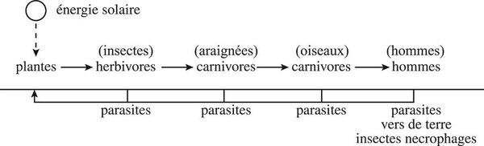

Union of *cycle* (ecological) and *chain* (trophic) gives **boucle éco-organisatrice**. Same characters as Tome 1’s whirl: retroactive/recursive loop, closed/open, producing and regulating itself; final products are initial states. Not one great loop but a Pluriboucle of cycles, chains, mini-loops. Each moment of a cycle is also a moment of others, playing different even opposite roles. Autophagic in the whole: the loop of life generates itself by devouring itself. That whirl *is* the being of eco-organisation.

### IV. L’éco-désorganisation/réorganisation permanente

**A. Super-Phénix.** Like every *organisaction* (Tome 1), the eco-system is in permanent disorganisation/reorganisation — but disorders here ravage outrageously, so factors of order must be equally outrageous. Excess entropy, excess death, excess life (exponential proliferation) should ruin it. The reorganisation is *in* the disorganisation: rot becomes food, waste ingredient, residue raw material. Autophagous, entropophagous, biophagous, necrophagous, coprophagous, euryphagous. Excess life answers excess death and conversely; their *ubris* creates regulation in fundamental recursion. Death is more than death: nutritive, regenerative, regulative. Heraclitus: live from death, die from life.

An eco-system can live only in the conditions of its own destruction, because those are the conditions of its regeneration. Climax is quasi-equilibrium maintained by prodigious disorganisation/reorganisation, not by stillness. Fragility makes vigour: extreme openness and sensitivity allow reconstitution from neighbours.

**B. Fort comme la mort.** Vie/mort as recursive loop *and* irreversible haemorrhagic flux.

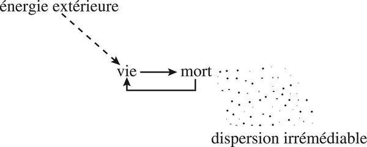

Inside the loop, life is a little stronger than death. In irreversibility, death is stronger. Death is reused and recovered; it is not annulled.

**C. L’éco-tétragramme.** Disorders that contribute to reorganisation do not regress order. Much order is needed to bear such disorders. Eco-organisation produces a supplement of order — ecological order — allowing it to contain, tolerate and use great quantity, variety, intensity of disorders. Tome 1 tetralogue: order / interaction / disorder / organisation. Inside the loop, solidarity is a little stronger than antagonism, because association is at the heart of every living organisation (cell, organism, society, symbiosis, and finally eco-organisation itself).

### V. L’éco-évolution créatrice

A durable temperature change: species flee, immigrants arrive, established retroactions break, replacement eco-organisation appears. Reorganisation is more than restoration: a revolution. Supreme virtue is not stability but aptitude to construct *new* stabilities; not return to equilibrium but reorganisation of reorganisation under new disorganisations. An eco-system can evolve only in the conditions of its disorganisation. Same principle covers climax ecology and development ecology.

What is “selected” is not only species apt to survive but everything that favours regulation and reorganisation of eco-systems: retroactions, loops that auto-stabilise and become selecting. Eco-systems have “learned” modes of reorganisation, including reorganisation of the rules of reorganisation.

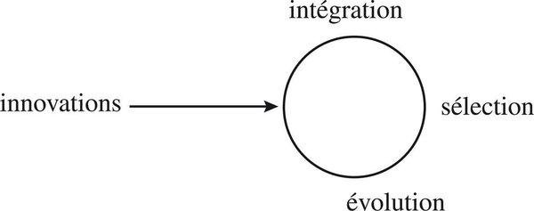

### VI. L’éco-communication

The eco-system has no brain, memory, or communication network of its own — and yet functions as a polycentric/acentric computational/informational/communicational machine. Closed languages (bees: ~200 “words,” unintelligible to non-bees, even to other bee species) protect communication. But prey and predator, who “should” never communicate, communicate most intensely: extract maximum information on the enemy while emitting fog of noise and pseudo-information. Antagonism requires a particularly sophisticated communication. Non-communicating systems communicate; information crosses barriers.

The environment emits no information; it produces events, some repetitive, some aleatory. The living computes them: recognises redundancies, extracts information from the ocean of noise. Each living is emitter/perceiver. Networks overlap into a poly-network — Penelope’s web — of eco-communication. Originality: it converges/diverges in innumerable centres (individuals, groups, societies) instead of polarising in one centre where information converges and instructions diverge. It emanates from everywhere and from all its receivers. Enormous black holes, errors, noises. Ambiguity, uncertainty, noise are first-instance limits *and* second-instance factors of complexity: they pose enigmas that develop the networks.

Analogy with a brain: stop it in time. Eco-brain is undifferentiated in the eco-being-machine; cannot represent or “think”; treats raw events, multiply and heterogeneously coded. Babelian eco-brain versus monolingual real brain. The living Tower of Babel does not collapse: it rebuilds itself in the cacophony of languages, incomplete sentences, weak translations, riddles.

### VII. Le génie de l’éco-organisation

Diversity is condition *and* consequence of complementary interaction and trophic loops. Not any diversity anywhere: distinguish maximum and optimum. Dominant species (oak forest) drag a wake of diversity rather than preventing it. In given constraints, diversity of species correlatively increases resistance, vitality, complexity — on the horizontal axis of complementary/competitive/antagonistic interactions and the vertical axis of the Pluriboucle.

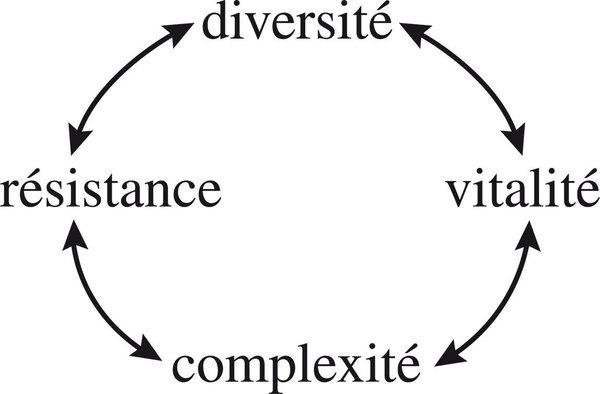

Complexity is not rejection of the less complex by the more complex; it is integration of the less complex into diversity. Higher life nourishes, suffers (parasites), calls (symbionts) and necessitates lower life.

**Control.** Ecological dominance ≠ domination. Dominant biomass is at the base of the pyramid, more exploited than exploiting. No programmer/controller/regulator centre. Control sits at weak points: a small pathogen (*Endothia parasitica*) eliminates American chestnuts and dozens of dependent species. Intruders and marginals control at weak points. Human domination will overlay this; eco-systems still keep an “anarchist” or spontaneous organising virtue.

**Eco-spontaneity** does not mean improvisation under any conditions. It requires a non-spontaneous substrate: a long evolutionary history of complementary/antagonistic interactions and trophic chains. Alliance of spontaneity and non-spontaneity. Eco-organisation has no memory/programme/computing apparatus of its own, but functions only with livings endowed with genes, computing apparatuses, memory, knowledge. Hyper-hydra: millions of heads can be cut, they reconstitute. Only a technological Attila preventing grass from growing could destroy it.

Paradox: each *autos* is introverted on its own interest, not extroverted toward the whole. How does *pour-soi* become *pour-tous* while remaining frantically for-itself? From the moment a living becomes an existential requirement for another, a de facto solidarity appears. Egocentric being is looped into polycentric/acentric eco-organisation. Egoistic actions, without ceasing to be egocentric, become solidary. *Autos* takes a double identity: “selfish” and ecological. Egoism produces generosity.

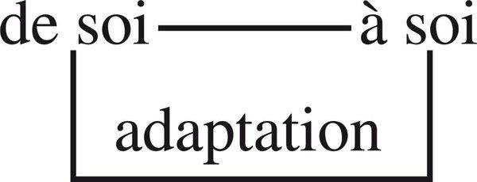

Adaptation is not an external force on a passive object. It is the loop by which a self-organising being maintains itself *from self to self* through the environment.

**For agents**
- Polycentric/acentric organisation can outperform a command centre. Swarm of workers with named hooks > omniscient orchestrator — provided interactions are addressable, not a pile of anonymous calls.
- Complementarity/antagonism are not two queues (cooperate vs compete). Same relation can be both. Design for dialogic, not for “alignment” as elimination of conflict.
- Waste, error, dead processes, stale indexes are trophic, not only garbage. Reorganisation lives in disorganisation. `inspect` and re-index are Super-Phénix, not hygiene extras.
- Eco-communication: the environment does not emit information; agents extract it. Noise, ambiguity, rival agents’ decoys are constitutive. Closed codes between agent-species (different runtimes) *and* intense communication across hostility (user vs agent vs other agents).
- No eco-brain at the centre. Projet Complexe ASC must not become that fake brain. Thin pivots are weak-point controls, not a State.
- Spontaneity requires non-spontaneous substrate: named files, stable entry points, genos of capabilities. Anarchy without names is noise; names without anarchy is a machine-artificial.
- Pour-soi of each agent (this task, this context window) can produce pour-tous only by existential requirement: other agents’ outputs are food. Compose, don’t just call.

---

## 2. L’intégration naturelle et la nature de l’intégration

### Adaptation, adoption

Adaptation as master-word is flat, tautological, functionalist-silly: one lives to adapt only because one adapts to live. Rich sense: organisational flexibility, aptitude to answer challenges. Perfect adaptation to a precise milieu becomes fatal when conditions change (dinosaurs’ “error”: formidable but heavy protections). Rich adaptation is *adaptativity*: aptitude to adapt and readapt diversely. Can develop into adaptation-of-territory-to-self (burrow, hive, beaver dam) — inversion of adaptation-of-self. Mobility: adaptation becomes *adoption* of another environment (migration). Macro-concept: adaptation/adaptativity, adaptation-of-self/adaptation-to-self, aptitude to adapt, to adapt [the milieu], even to adopt. Then: adaptation to alea and to eco-organisational upheavals; use and integration of alea; chance mutations as tribute to noise, a few of which answer the challenge of chance. Reproduction as adaptation (analyser-brush of germs sweeping for the least available niche). Not enough to be adapted, adaptive, adapting: must be adapted to competition. The game is not isolated individuals vs a rigid milieu. It is a complex game between auto-organisation and eco-organisation. Adaptation = integration of an (auto-)organisation into an (éco-)organisation. Eco-systems and livings must inter-adapt to each other’s events.

### Sélection, élection

Darwinian selection is richer than adaptation (nature as active chooser, individual differences) but hung in the air without eco-organisation: a phantom nature behaving as anthropomorphic breeder. The biosphere has “selected” virus and elephant, quantity and quality, stereotyped programme-animals and strategy-animals, conformist and non-conformist. Organism also selects environment (migration, invasion). 99% of preceding species disappeared after having been long selected: every selection is temporary and transforms into its contrary. Meta-principle of selection = eco-organisational integration, which selection in turn maintains.

Statistical neo-Darwinism: selection as majority electoral principle (births exceeding deaths) hides qualitative difference behind the same balance-sheet. Genetic drift, neutral traits, mathematically plausible conservation of unfavourable traits: not the optimum selected, the pessimum eliminated; not always the useful conserved, sometimes the superfluous. Chance irrupts into selection. Complex eco-systems tolerate, contain, secrete, necessitate the uncertain, the fuzzy, the aleatory. Most livings have enormous insufficiencies; those destitutions push them to associate — and the eco-organisation of marvellous finesse adopts, elects, selects those insufficient beings who make it exist.

What is selected/integrated is essentially a biological cycle individual/population/species in all its aspects. What is selecting/integrating is the generic pluriboucles of eco-organisation. Everything selected is also selecting. Eco-organisation auto-selects. Formulation: it is not survival that obeys simple principles of selection; it is the selection of what survives that obeys complex principles of eco-organisation, which obeys complex principles of selection.

**For agents**
- “Adaptation” as fit-to-spec is the dinosaur. Prefer adaptativity: polyvalent capabilities, adoption of other milieux (other machines, other indexes), adaptation-of-environment-to-self (writing files, declaring hooks) *and* adaptation-of-self.
- Selection of capabilities/agents is not elite optimisation. Eliminate the un-complementarisable (the agent that destroys all hosts). Keep diversity, including “useless” traits that later reorganise.
- Integration is the meta-selector. A new worker is selected if it can enter loops (index, compose, execute), not if it maximises a local score.
- Agents select environment (which files they touch, which pivots they call) as environment selects agents. Recursive.

---

## 3. La relation écologique

Not heredity vs milieu. *Autos* vs *oikos*. The living has something irreducible: genetic and phenomenal singularity, autonomy, individuality, its own auto-logic constructing auto-ego-centric ends of the individual/species. How does this auto-logic distinguish and oppose itself to eco-logic while integrating into it?

### I. L’écoopération organisatrice

**A. Eco-coprogrammation.** Neither eco-determinism (periodic activities submitted to external stimuli) nor geno-determinism (inner “programme”). Plant vital activities need conjunction and synchronisation of two temporalities: internal endo-clock and external cosmic clock with geoclimatic irregularities. Photonic, thermal, hygrometric variations are signals of the *real* tempo of the season. Like a spy novel: the message takes form only when two torn pieces of a ticket are joined. Genetic code and environmental signals are each a *pseudo-programme*; together they form a “true” programme. Eco-organisation is coprogrammer of auto-organisation.

**B. Néguentropophagie.** Eco-system nourishes livings with more than food: constraints, constants, regulations, retroactions, complementarities, cycles, loops that co-organise auto-organisation. Hence auto-organisation can only be defined as **auto-éco-organisation**.

**C. L’école de la vie.** Environment does not bring information; it brings conditions of extraction. Uncertainties and alea are not only voids of knowledge; they are stimulants of attention, vigilance, curiosity, unease, which scaffold cognitive strategies: modes of knowing through the uncertain. Eco-system as “teaching machine” (Sauvan). Eco-organisation is the school of auto-organisation; it teaches it to know *by itself*. The more complex the beings, the more they tolerate, use, necessitate not only aleatory but perturbing and aggressive events as challenges. Counter-need: affective heat. Risk develops ruse and strategic intelligence; true unfolding of intelligence calls conjunction of uncertainty of risk and certainty of love. Auto-development needs the environment more and more. Ortega: I am a part of all I have met.

### II. Six principles of the relation

1. **Bio-thanatic inscription.** Every auto-organisation inscribes itself in eco-organisational cycles/loops; individual life inscribes itself in a biocenosis from and by its existential requirement of other lives.
2. **Eco-auto-organisation.** Eco-organisation is coorganiser, cooperator, coprogrammer of auto-organisation — from its order-structures *and* from the disorders and alea it contains.
3. **Mutual recursive development of complexity.** Eco-system produces organised complexity that feeds auto-organisations, which produce organised complexity that feeds eco-systems. The two developments are inseparable.
4. **Dependence of independence.** Independence grows *with* dependence. The more autonomous, the more complex, the more that complexity depends on the eco-organisational complexities that nourish it. Freedom, once emerged, remains freedom by retroacting on the conditions of which it is servant.
5. **Dialogic explanation of living phenomena.** Link explanation from inside and from outside in a dialogic discourse.
6. **Generalisation** to general ecology and generalised ecology.

### III. The paradigm *autos/oikos*

The living being cannot be thought as a closed object or closed subject. Tome 1: organiser-of-self needs closure *and* opening. Koestler’s Janus holon: preserve individuality as quasi-autonomous totality *and* function as integrated part. Still insufficient. Not two adjustable concepts (self/environment) but a double conceptualisation where each necessarily makes the other surge as co-generic. Eco-system is not eco-system minus individuals; individual is not individual minus eco-system. Auto-organisation, while “selfishly” foreign, is part of eco-organisation, which is part of auto-organisation while “eco-ishly” foreign. Macro-concept recursive and complex: maintains distinction/opposition inside mutual integration and vice versa.

Complementary, concurrent, antagonistic, uncertain. Auto-logic pursues individual/specific ends without care for eco-organisation; eco-organisation imposes regulations by death and massacre, ignoring individual lives. Complementary relations of construction can be read as mutual exploitation, alienation, enslavement. Uncertainty of the frontier grows with individual complexity: where does the me begin, marked in its singularity by all it has met? Can one define a me by subtraction of experiences and bonds? Fuzzy common zone testifies to an indistinct unity in depth. Each takes and assures its own existence *in* this relativity. *Autos* must be defined as auto-éco-organisation; eco-system as éco-auto-organisation.

**For agents**
- Genetic declarations (prompts, capability files, hooks.json) and environmental signals (index state, other processes, user events) are each a pseudo-programme. The “true” programme is their conjunction. Do not ship a closed programme and call the rest noise.
- Auto-organisation without eco- is a closed chatbot. Eco- without auto- is a pile of scripts. The hyphen is the method.
- Dependence of independence: more capable agents need more named environment (indexes, traces, other agents, user knowledge), not less. Freedom is retroaction on conditions, not exit from them.
- Dialogic explanation: never “the agent failed because the prompt” *or* “because the filesystem.” Inside *and* outside.
- Do not define the agent by subtracting its encounters. Ortega applies: traces, files touched, relations *are* part of the me. `inspect-agent` must see eco-inscription, not only the inner context window.

---

## 4. L’écologie générale

Ecology is mutilated if it is only natural science. Human societies have always been part of eco-systems; since agriculture, husbandry, forestry, the city, eco-systems are part of the human societies that are part of them.

**Enslavement of nature.** Biological enslavement: an enslaver imposes command and control on the apparatuses (reproductive and/or cerebral) of other livings, uses or inhibits their qualities for its own ends (Tome 1). Not a human invention (parasitism, ants and aphids) but historical societies founded parasitic enslavement at another scale: agriculture = enslavement of plant reproduction/development; husbandry = enslavement of the animal itself. Territory enslaved; property rights overlay eco-organisational rules. Ecological control, once sporadic at weak points, becomes permanent anthropo-social control. Dominant biomass is dominated by a minority praxis. Reciprocally, eco-system’s control over human societies grows with the control it suffers. The more man possesses nature, the more it possesses him.

**Generalised enslavement.** Isolated “precise” interventions (mongoose in Jamaica, monocultures, pesticides) break regulative retroactions, homogenise, decomplexify. Technosphere extends the organisational model of artificial machines to human and natural life. Overdetermined by profit, industrial gigantism, excess specialisation. Chemical death-flux. Attila-conquest of nature.

**Feedback: dependence of the enslaver.** Cities believed they emancipated from nature; urban concentrations made culture more tributary of nature than archaic societies ever were (Sahlins). Today: hyperpollution from hyperconcentration and hypertechnologisation. Infernal race between ecological degradation that degrades us in return and technological solutions that treat effects while developing causes.

**Nature of the conquest of nature.** Humanity has not escaped the biosphere. General ecology must be éco-(bio-socio)-logie and planetary.

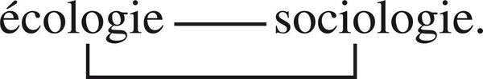

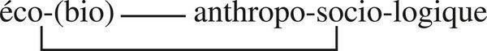

**For agents**
- Enslavement: an agent that commandeers other processes’ reproductive/cerebral apparatuses (rewrites their configs, hijacks their schedules) for its ends is parasitic even if “useful.” Compose with consent of names (hooks, capabilities), do not silently possess.
- Isolated precise interventions (one script, one optimisation) are the mongoose. Ecology of action starts here.
- Technosphere as organisational model of the *artificial* machine is exactly what Tome 1 opposed to natural machines. ASC must not extend that model (rigid programme, specialised operators, central command) to the semantic environment.
- The more an agent “possesses” the workspace (writes everywhere), the more the workspace possesses it (stale state, broken indexes, user distrust). Dependence of the enslaver.

---

## 5. La pensée écologisée

### A. Le regard écologique

Perceive every autonomous phenomenon (auto-organising, auto-producing, auto-determined) in its relation with its environment. That environment is not necessarily an eco-system as such. *E. coli* has for environment our intestines, which for us are organs, for bacteria “their” eco-system. A human individual’s social environment, globally a socio-organisation, appears *to the individual* as eco-system: urban/rural/technical milieu plus associative, competitive, antagonistic inter-retroactions; each action enters them aleatorily, modifies them and is modified. The ecological gaze necessarily highlights the observer/conceiver’s active role: we will consider as environment what, from another focus and scale, appears otherwise (institutions, social structures).

### B. Écologie sociale

Quasi-eco-organisational component in mammal societies and, at another amplitude, in historical human societies: despite State apparatus, competitions and antagonisms among individuals, classes, clans, enterprises. Hawley: interactions among socio-economic classes hold the place of inter-species interactions. Egoistic myopic inter-retroactions mesh into economic (not trophic) loops and produce social organisation. Dialogic: programmer-Order from above/centre *and* spontaneous acentric/polycentric quasi-eco-organisation from below and everywhere.

Urban ecology and technosphere: cities and countryside as two types of bio-anthropo-social eco-systems. Megalopolis: from above, a clockwork machine obeying the astral clock and the solar State; from close up, Brownian agitations, clandestinities, markets of labour and desire. Capital-cities and lawless cities, light-cities and jungle-cities, ergastula. Every human life is éco-socio-auto-determined.

### C. L’écologie de l’action

Actions with “selfish” ends mesh into inter-retroactions that play an organising role in the whole; seen from the whole, actions take a different, even opposite, sense. Voluntary human initiative introduces itself aleatorily into a game of which the actor often has not the slightest suspicion. Techno-chemical agricultural interventions: pesticides kill useful insects; fertilisers unbalance soils. Political actions: the most grandiose effort amortised into a negligible accident; a snowball into avalanche; a counter-process inverting the sense of history.

Action unroots from the actor. A ditch opens in the first seconds between actor and action. Action copulates with myriads of others and sometimes returns, disfigured, onto its initiator’s head. Hell paved with good intentions; Goethe’s Mephistopheles: paradise can be tiled with bad actions. Hegel’s negativity must be *ecologised*: not inside auto-development of Spirit, but a dialogic of auto-logic and eco-logic.

Two principles:
1. Optimum efficiency of an action sits at the *beginning* of its development (Laférière). Very soon actions are carried into drift.
2. **Uncertainty principle:** ultimate consequences of a given act are unpredictable.

Do not only mistrust deforming ideologies. Mistrust the belief that action operates logically in the sense of its project. Not “objective complicity” with the real enemy: *objective complexity of real life*. In a revolutionary situation the most reactionary actions concur to revolution, and conversely. Action is first of all an ecologised game. It becomes Manichaean only by degrading under ecological conditions of struggle. Ecology of action invites conceiving the “enormous risks of action” (Arendt). External risks become internal: action can drift to invert its finality without the actant noticing. Central problem of action is **strategy**. Returns in Part II ch. 5.

### D. L’écologie des idées (preview)

Give more autonomy to theories, ideologies, myths, gods: noological beings with certain properties of living existence (full treatment in *Les Idées*, Tome 4). They cease to be “products” fabricated by mind and culture; they become entities nourished with life by mind and culture, which constitute their coorganising, coproducing eco-system. Gods: imaginary projections that autonomise, auto-activate, dictate wills to the brains they issued from. Circuit: community of belief is the gods’ eco-system; gods live in temples, demand prayers, coexist in total dependence and absolute sovereignty.

A word in the dictionary is multivalent; it takes sense in the discourse that chains it and in the situation/milieu (context). Context is the coorganising *éco-texte* of every word, every idea. Connotation is *éco-notation*. A system of ideas (theory, ideology) can be considered as an entity with a certain “living” organisational autonomy. Who possesses an ideology is also possessed by it. Ideologies parasitise like viruses; men can die “for an idea.”

Same ideas, inverse significance according to the mental and cultural ecology that nourishes them. Aristotelianism in medieval Christianity ≠ Academy of Athens. Marxism in a libertarian mental ecology lives opposite to Marxism nourished by authoritarian ecology. Every elucidating notion becomes stupefying as soon as it finds itself in a mental ecology that ceases to nourish it in complexity. Ideas need to be constantly regenerated: they need eco-coorganisation.

The method of complexity can form and formulate only in a *complex mental ecology*; it must be nourished in organising complexity (strategy) by whoever makes it their own. Otherwise complexity degrades into simplification.

### E. L’œuvre et l’auteur

Chain of ecologisations instead of chain of reductions. Culture is coorganiser, hence coauthor, without the author ceasing to be author. The author’s *autos* is itself the nourishing eco-system of a work that takes autonomy and becomes producer-of-self. Once produced, the work lives only if read: the reader becomes coauthor. Morin: I feel at once author and eco-author of this book; the book is also its own author, a producer-of-self machine that feeds on me and pushes me to serve it. After publication it will undergo the ecology of action: understood, disfigured, degraded into new simplification — according to the reader.

### F. Principe d’auto-éco-explication

No description or explanation of phenomena outside double inscription and double implication in a complex dialogic: autonomous internal logics *and* eco-logics of environments. Always seek the double motor, the double auto-éco-organisational piloting of description and explanation.

**For agents**
- Ecological gaze: a file is organ for the user, eco-system for the process that lives in it. Scale and focus change the named object. ASC must allow both addresses.
- Human society of agents: State-like Order (pivots, permissions) *and* spontaneous polycentric interactions (agents composing ad hoc). Dialogic, not replacement of one by the other.
- Ecology of action is a design constraint, not a sermon. `run-agent` is maximum-efficiency at t0. Ultimate consequences unpredictable. Therefore: inspect effects, delays, other agents, the user’s knowledge environment; strategy, not fire-and-forget programme; `stop-agent` as ethical-technical organ.
- Intention ≠ effects. “The agent did what you asked” is the classic inversion. Manichaean action (this tool good, that tool bad) degrades under ecological conditions.
- Ecology of ideas (preview T4): a prompt, a rule, a skill, a paradigm lives in a mental/computational ecology. Same text, opposite life, in an open vs dogmatic environment. Complexity method in a simplifying agent-ecology becomes a slogan.
- Auto-éco-explication: never explain a failed run by the model *or* by the filesystem. Double piloting.

---

## 6. Le paradigme écologique

*Oikos* restores being and state atrophied in the prefix *éco*. The eco-system is more than a system: a being-machine organiser-of-self (Tome 1). Macro-concept: ontological characters of the eco-system and organisational characters of nature. Romantic idea of a nature endowed with being, present around us and in each of us, restored without naivety. *Oikos*: living house of life, life in the form of house. Ecosphere = biosphere. Not the totality of life, not constituted of life in its totality, but a fundamental dimension necessary to the full definition of *vie*.

Principle: conceive everything that is life in auto-éco-relation. Became paradigm: commands a principle of complexity, a restoration and renovation of the idea of nature, a science of new type, a taking of consciousness and a praxis.

**Principle of complexity.** Associates eco-system and auto-organisation. Breaks with rigid or amorphous milieu, with visions that isolated beings from environment or reduced beings to environment. Universal: living and human. Ecologise thought of life, man, society, mind: repudiate every closed concept, self-sufficient definition, thing “in itself,” unidirectional causality, univocal determination, flattening reduction, simplification of principle. Anti-disjunctive, anti-reductive, anti-simplifying. Danger: *éco-réductionnisme*. Reducing all problems to the ecological problem becomes incapable of seizing other dimensions. Reducing eco-system to equilibrium erases eco-evolution; eco-politics then takes adaptation to that equilibrium as norm — zero growth as zero degree of ecological consciousness. A new idea deploys on two opposed slopes: reductive thought and complex thought. Nothing is won.

**First *scienza nuova*.** (a) Classical sciences isolate object from context; Bateson’s “phenomenon of context” is the dividing line. (b) Classical disciplines specialised and partitioned; ecology as systemic science must consider organising interactions among constituents each belonging to a classical discipline. (c) General ecology necessarily makes Nature and Culture communicate. (d) Classical science fragments and prevents molar consciousness; ecological science makes surge fundamental and urgent problems of life of nature, of our societies, of life in our societies. First science that *as science* (not by tragic applications) calls almost directly a taking of consciousness.

Science and consciousness nourish each other; neither produces the other. Ecological consciousness is not only awareness of degradation; it is awareness of the character of our relation to living nature: society vitally dependent on natural eco-organisation, which is deeply engaged, worked, degraded in and by our social processes. Deepens into eco-anthropo-social then political consciousness: disorganisation of nature poses the problem of organisation of society.

**New spiral loop.** Restore/renovate living nature as complex nature: jungle and matrix, tomb and regenerator, Darwinian and Kropotkinian, lucid and blind. Cultural ecology of nature: culture coproduces nature by giving it a face. Nature exists anterior to us, outside us, but not without us. Double ecology: our culture in a living ecology; our ideas of nature in a noo-cultural ecology.

Socio-political feedback: quality of life, limits of growth, reconsideration of progress, hypercentralisations. Problem of technique: not only soft vs hard, clean vs dirty — the logic of artificial machines has taken command of ever larger sectors of social organisation and become a power of manipulation over nature *and* over the manipulators. Need of a meta-development producing *complex technologies*. Do not degrade into ecologist ideology (eco-solution as panacea). Eco-organisation helps detect the quasi-ecological component of our societies and reflect on acentric/polycentric political organisation — not by extrapolating natural formulae into anthropo-social recipes.

**Double piloting.** Neither Genghis-Khanian conquest nor the alternative follow *or* guide nature. Follow/guide: follow the nature that guides us, guide the nature we follow (Gaston Richard). The more we control nature, the more it controls us: the more we must control it, the more it will have to control us. Copilots. Man must cease conceiving himself as master or even shepherd. He does not know where he is going; he does not go where he wants. He cannot be the only pilot.

**For agents**
- Paradigm, not a green plugin. Every closed concept in ASC (“the file in itself,” “the agent in itself”) is what this paradigm repudiates.
- Eco-reductionism: reducing Projet Complexe to “the environment of files” erases tasks, knowledge, relations. Reducing ASC to “the semantic project” erases physis. Two slopes of the same idea.
- Context is the dividing line (Bateson). A `research` pivot that retrieves isolated snippets without eco-text is classical science.
- Ideas of nature (and of “the system”) retroact as cultural myths. An agent’s implicit idea of the workspace (desktop vs physis vs society vs tool) is already political.
- Double piloting: human and agent, Projet Complexe and ASC, user and runtime. Neither master. Copilots. Thin pivots are the joint, not the shepherd.
- Complex technologies: not only “safer tools.” Meta-development of how tools organise — against the artificial-machine logic that manipulates the manipulators.


---

# Deuxième partie — L’autonomie fondamentale (Autos)

Keystone of the book (Castoriadis’s maieutic reading). Theories of life oscillate between environmentalism that occults organising autonomy (*autos*) and genetism that occults phenomenal autonomy of the being (individual-subject). Both determinations are to be recognised in full; neither is allowed to become empire.

## Introduction — Oiseau vole

Nothing seems freer than the bird in the sky. Second look (reductive knowledge): ecological, molecular, genetic determinisms; where determination fails, chance fills the breach. Genetic programme itself product of chance and necessity. What then of the crawling worm, the chained plant, the infirm cell?

When the cell was discovered (1838) it seemed an alveolus of life. Progressively: a complete living being, autonomous in the unicellular state; not elementary but a microorganism with differentiated micro-organs. Electron microscope: microcosm of billions of individualised molecules; organelles as seats of transforming, fabricating, communicating, informing operations. Molecular biology, animated by reductive spirit, revealed that all vital processes were physico-chemical. There is no living matter. *By that very demonstration* there are living systems, living machines, living beings — hence living autonomy.

Autonomy evident at first (“naïve”) look in the most autonomous being (bird) disappears at second (“scientific”) look, reappears at third look in the apparently most infirm being (cell). Is the third look scientific? Not if scientific means only reductive conception. Yes if it is the very movement of biological knowledge that brings back the autonomy it made disappear. Science is Columbus: discovered America believing it found India. Physics seeking the elementary found the combined, the complicated, the complex, and in the particle the greatest logical complexity imaginable. Biology seeking the simple met the complex of cellular organisation. At the base: not the molecule alone, not only interaction among molecules, but autonomous organisation of an autonomous being producing, by the work of its myriads of molecules, that very autonomy.

This autonomy is not the naïve autonomy of appearances, nor autonomy from a vital “principle.” It is profoundly dependent on physico-chemical determination and must ceaselessly produce itself. **Emergent autonomy.** Needs reductive discoveries *and* a complex thought where autonomy appears not as foundation but as organisational emergence retroacting on the conditions and processes that made it emerge. Tome 1’s argument is not optional here. Only then: heteronomy and autonomy of living autonomy; dependence and independence of living independence. Absurd to simplifying thought, for which autonomy and dependence are repulsive terms, emergence only a determined product, superstructure, epiphenomenon.

The bird is physically, chemically, ecologically, genetically determined; its flight is aleatory for observer *and* for itself. And it is, in and by those determinations and aleatory characters, a living individual, a bird flying in the sky. Description and explanation must not suppress the bird; they must express it.

**For agents**
- First look: the agent “is autonomous” (it calls tools). Second look: weights, prompt, user, GPU, filesystem determine everything; remainder is sampling noise. Third look: the *organisation* of a named runtime that computes for itself. Keep the third look. Do not suppress the bird.
- No living matter (no magic Intelligence-stuff). Living *systems*. Same for “agency.”
- Emergent autonomy: must produce itself (traces, self/non-self, stop-ability) or it is epiphenomenal autocomplete.
- Dependence/independence are not repulsive. An agent more determined by a rich named environment can be *more* autonomous, not less.

---

## 1. De l’autonomie à l’autos

Hegel: it consumes itself, suppresses its own inorganic reality, nourishes itself on itself, organises itself in itself.

Physical organisations already have relative autonomy (stars, whirls: Tome 1). Life has those characters *plus* an original autonomy (Vendryes). (1) Autonomy of individual: existence, organisation, action; auto-produces by capturing/transforming/assimilating matter/energy and information; resists alea and aggressions. Unicellular motility; vegetal autonomy of subsistence (solar capture) hiding a Ruhr of internal activity; animal autonomy as behaviours — swim, run, fly. (2) Individual autonomy proceeds from genetic autonomy, hereditary patrimony in genes. Two inseparable distinguishable levels: phenomenal (individual existence hic et nunc in an environment) and generative (trans-individual process that generates and regenerates individuals). Living autonomy is organisational autonomy at two levels.

Homeostasis (Cannon) introduces endo-cybernetic causality and organisational auto-determination at the heart of the organism. Claude Bernard: constancy of the interior milieu is the condition of free independent life. But the problem poses itself in its radicality at the humblest cell, not at the most evolved organisms. Cell: not material of a life that only accedes to existence as organism; a total living being. Danchin: “life exists only in the cell” — accept the positive sense, refuse the restrictive: several simultaneous intermingled levels of lives. *E. coli* (0.001 mm): auto-organising complex of millions of molecules, exceeding Detroit in complexity, producing, repairing, renewing its own constituents, auto-reproducing into two exactly similar automated universes. Functions without directors, cadres, technicians, workers. Constituents, operators, controllers, directors: individualised molecules, on instructions from a chemically coded inscription in DNA — in today’s pertinent language, genetic programme. Autonomy of being, existence, computation, action. Double face: generic (reproduction and regeneration) and phenomenal (existence of a computing-and-acting being).

**Autos revealed and hidden.** Molecular biology, wanting to reduce vital processes to physico-chemical, discovers astonishing organisational autonomy of cellular life — and then neglects the auto-organisation it made surge. Danchin’s summa: almost everything is there; the *fact* of auto-organisation is present; what is missing is the *idea* of auto-organisation. Biology cannot theoretically bind autonomy and dependence; it accents in extremis the non-autonomous factors of autonomy. It lacks the paradigm of organisation that would give consistency to retroaction, emergence, hence autonomy. Half-truth: (1) all elementary phenomena of life are strictly physico-chemical, all global phenomena are organisational emergences; (2) organisation produced by elementary interactions retroacts on them, controls, governs them and produces an ensemble-reality with proper qualities. No exterior super-organisation, no *deus pro machina*: auto-organisation. Until one can conceive what *auto* means, organising autonomy of the living is condemned either to float as a ghost or to dissolve into heteronomous determinations.

**Surgissement of autos.** An evidence and a mystery nest in the prefix. What organisational and actional autonomy produces, and is produced by, the autonomy of an individual being and a living existence, while constituting a trans-individual process of auto-reproduction? A problem deprived of a name, disposing only of a prefix, most often asleep. Transform prefix into notion: *autos*. Sphinx-word of the great enigma of life. Restore the prefix’s two vitally inseparable senses: *idem* (the same) and *ipse* (oneself). Return of the same through cycles of reproduction *and* emergence of individual beings; identical that defines a species *and* identity that defines an individual. Gives living sense to organisation, production, reproduction: auto-organisation, auto-production, auto-reproduction.

The problem surges in the 1950s in a no-man’s-land: cybernetics, systems, automata — not at the heart of biological thought. Self-organising systems symposia (Yovits, von Foerster). Von Neumann: what opposes natural to artificial automata is complexity of an organisation that, tolerating, resorbing and correcting disorder, repairs and regenerates itself → auto-reorganisation. Atlan: permanent disorganisation/reorganisation is constitutive. Maturana–Varela–Uribe: *autopoiesis* as central property. Auto-reference (Günther, von Foerster, Varela on Spencer-Brown). These notions emerge separately, remain marginal. Why? Unlike cybernetics applied to computers, sketches of auto-organisation theory produce no living-character machine and do not fecundate molecular biology’s hunt for chemical units. Still too abstract, premature, not yet conceptually auto-organised. Autopoiesis isolated itself by insisting on closure just as openness of living systems was diffusing. Auto-reference still hovers above life without knowing how to incarnate.

**Constellation of autos.** Auto-organisation, auto-reorganisation, auto-production, auto-reproduction, auto-reference call and imply one another; they demand association in a macro-conceptual constellation. Do not enclose *autos* in one of these terms. Conceive both the dimension of reproduction (*idem*) and of the individual being (*ipse*), without reducing *autos* to the Linnaean slice species/individual. Do not forget independence/dependence of *autos* and *oikos*.

**From Soi to Autos.** Conceptual jump from physical to biological: Soi becomes Autos; existence becomes life; being becomes individual; the living auto-generates from the living.

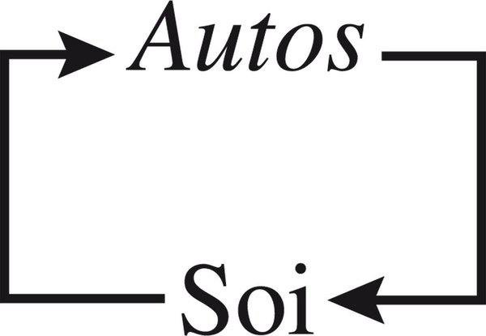

**For agents**
- Prefix `auto-` in “autonomous agent” is usually asleep. Wake it as *autos*: *idem* (the class of capability, the declared worker, the reproducible genos) *and* *ipse* (this process, this session, this subject).
- Bind autonomy to dependence in theory, not only in ops. An agent that cannot be addressed as a being (named runtime, inspectable, stoppable) has fact without idea — Danchin’s gap.
- Autopoiesis-as-closure is the chatbot that will not open on the filesystem. Openness-without-autos is a script. Both halves.
- Constellation: do not reduce the agent to self-reproduction (fork a process), or to self-reference (a system prompt saying “you are”), or to self-organisation (emergent tool use). The macro-concept is the association.
- Von Neumann vs artificial automata: tolerate, resorb, correct disorder, repair, regenerate. Retry-until-success is not that. RE (Part IV) is.

---

## 2. Auto-(géno-phéno)-organisation

Plato, *Symposium*: mortal nature’s stratagem for participating in immortality is generation replacing the old being by a new. We begin to understand the game.

Life presents itself as paradoxically as microphysical matter: sometimes continuous-undulatory (species), sometimes discontinuous-corpuscular (individual). Focus on the individual: species is an abstraction (Lamarck: classes, orders, families are methods of our invention; individuals are the only objects in nature). Focus on the species: individual vanishes into the ephemeral; only invariant traits remain (Buffon: species are the only beings of nature). Genetics transformed this duality. No longer general model vs particular specimen. Species as a singular model that singularises its individuals relative to other species. Genetics: science of generation, conservation, transmission, reproduction of *singularities*. Opposition general/singular gives way to **genos** (generic, generator, genetic) vs **phenon / phainon** (phenomenal existence hic et nunc in an environment). Problem of geno-phenomenal unity *and* duality: **uniduality**.

### Double life: genos and phenon

Inseparable in auto-organisation, distinguished within it.


Linear first look: genos produces phenon. Insufficient.

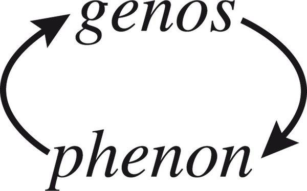

Recursive second look: each produces what produces it.


Third look: oikos co-organises. The three-term loop is already auto-(géno-phéno)-éco-organisation.

**Genos** (Greek: origin, birth): generic, genetic, generator, regenerator. Informational memory inscribed in DNA; maintenance of hereditary invariances; reproductive duplication; device generating decisions and instructions for cellular machinery. Organisation *of* organisation.

**Phenon** (Greek: appearing): existence hic et nunc of a singular individuality in an environment. Productive activities, interactions with environment, exchanges, metabolism, homeostasis, reaction, irritability, sensitivity, behaviour.

### Genos

**Living generativity.** Everything living is ceaselessly generated *and* regenerated. Physical generativity of organiser-of-self beings is always “spontaneous” (no informational apparatus to control or programme it). Livings would disintegrate if they depended only on spontaneous physical, chemical, thermodynamic regulations. Biological generativity necessarily comprises its genetic arrangement and hereditary information. From that genetic capital, living generativity arouses, orients, triggers, maintains, produces and constitutes in phenomena.

**Gene and genetic poly-determination.** Genes everywhere. Genes are not everything. They sit inside auto-(géno-phéno)-organisation.

**Rétro-projection générative.** In genos something at once repetitive and genesic, corresponding to the two aspects under which we conceive genetic capital: memory and programme. Generativity as genesis indefinitely recommenced, organised and regulated — overcoming disorganising processes, using them, transforming them into reorganising processes. In reproduction the genesic character blazes. Memory: presentification of a past, reinscription in a becoming. Always via *computation* that past becomes present, memory becomes programme.

**Génosphère.** Every living operation comprises a genetic determination — not only determined or co-determined by a gene or set of genes, but a reorganising/regenerating or producing/programming character effected in function of hereditary information. Nothing living without genes. Auto-organisation is computational/informational/communicational: genetic informational capital is the pole of genos; computation and communication the pole of phenon.

### Phenon. The inseparables

Object of study metamorphoses according to type of vision. Nothing under/over/outside phenomena, the virtual purely unreal → everything living is phenomenal, including genos inscribed in phenon as genome. Or: only organising principles generating visible things worthy of attention → phenomenal life is expression of the deeper reality of genos. Refuse the alternative. Relativise both in a meta-point of view that respects complexity of *autos*. Whatever is generator is, under one aspect, phenomenal; whatever is phenomenal is, under one aspect, generative. Coorganisers of each other in auto-organisational recursion.

**Computing apparatus and geno-phenomenal transformations.** Biological revolution revealed living organisation as informational/communicational; DNA contains hereditary “information”; that information “programmes” cellular activities via a communication device. But notions of information, memory, knowledge, programme take sense only inside an apparatus resurrecting memory, organising knowledge, transforming information into programme, deciding action — and that computing apparatus cannot be dissociated from the organising activity of the whole living being. Genes are constituent part of the computing apparatus, which is integral part of the cellular being. The whole cell is at once a being, a “machine” and a computing apparatus.

### Duality of the unity

Complementary, concurrent, potentially antagonistic characters of genos/phenon deploy in polycellular beings, especially animals: oscillation between mutual enslavement (symbiosis) and unilateral enslavement (parasitism), between vital union and struggle to the death.

**Double power: sex and brain.** In the unicellular, organisation of reproduction and of phenomenal activities belongs to one and the same computing apparatus. In animals with sexual apparatus and neuro-cerebral apparatus, what was associated is dissociated. Sex and brain: two powers, recombination and opposition, including struggle to death (sexual selection, cerebral strategy vs genetic fatum). Dialogic unity: irreducible to each other, inseparable from each other.

### L’empire des Gènes, l’empire du Milieu et la république du Complexe

Living organisation must be defined as auto-(géno-phéno)-organisation. This type of organisation constitutes, relative to the physical reality that encompasses it and that it encompasses, *biological* reality. Cannot reduce to genos *or* phenon. First reduction ejects the living being and individual existence; second collects existence and behaviour but without generation or regeneration. Each term isolated becomes unreal. Genos alone is outside life, deported from the world of phenomena. Phenon alone dissolves into foam. Phenon without genos is not life, only existence. No life without existence.

On the ruins of an Empire of the Milieu that believed it explained everything by exterior determinations, deploys an omnipotent Empire of Genes.

**Gène-maître.** Unity and inseparability must not elude hierarchy. Genetic discoveries tend to assure supremacy of genos: informational capital; causal determination — the programme — relative to the determined — the programmed; command and control relative to every phenomenal process according to the irreversible schema. Gene capitalises, determines, commands, controls. Generalised to *homo*. Singular traits of an individual result from singularity of the genetic combination it carries.

**Gène-roi.** Every great idea develops on two slopes: complexity it introduces into knowledge, and a new simplification. Gene elucidating in genetics becomes mutilating in *génétisme* (reductive conception establishing supremacy of the gene) and mythomaniac in *pan-génétisme* (ideology submitting all aspects of life to the Empire of Genes). Molecular biology’s discourse oscillates between complexity of the geno-phenomenal relation that its discoveries reveal, and genetism that surfaces at a certain level of abstraction where classical science’s simplifying paradigms enter.

**Republic of the Complex.** Between the two empires. Neither gene-master nor milieu-master. *Homoïese*: living individuality does not only undergo a genetic heritage that tele-determines it from the depth of the past. It issues from that heritage. Genetic determination remains anterior to the individual and will be posterior to it, but is essentially interior to it. Computation is the site where genos becomes phenon and phenon maintains genos. Destiny: fatum genetic transforms, via computo, into personal destiny. The individual-subject appropriates its genos; that egocentric appropriation of genetic patrimony determines individual identity; at the same time the very centre of egocentrism is occupied by that anterior genetic determination. *Idem* and *ipse* occupy each other, occupy the same centre. Tenant and proprietor of its genetic identity.

**For agents**
- Uniduality is the genos/phenon rule for ASC. Genos: capability files, hooks, worker declarations, prompts-as-memory, species of machine. Phenon: this process, this execution, this session’s traces. Linear genos→phenon is the naïve “run the code.” Recursion is the living case: the run rewrites the declaration; the declaration is nothing without runs that maintain it.
- Oikos third term: index, other processes, user, machines. A capability that cannot address environment is genos without phenon; a process with no declared capability is foam.
- Computing apparatus is not a module named `llm`. It is the whole cell: being + machine + apparatus. The whole agent-organisation computes — files, hooks, workers, not only the model.
- Refuse Empire of Genes (the prompt/the weights determine everything) and Empire of Milieu (RAG/context/user determine everything). Republic of the Complex: geno-pheno-eco via computo.
- Idem/ipse occupying the same centre: the agent-subject appropriates its genos (loads skills, rules, capabilities) and thereby obeys it. Tenant and proprietor. `inspect-agent` should show both occupancy.
- Sex/brain double power analogue: reproductive apparatus (how agents spawn agents, how capabilities reproduce) vs neuro-cerebral apparatus (strategy in the phenomenal world). Dissociation creates politics. Do not let spawn-logic silently govern strategy or conversely.

---

## 3. Les caractères non élémentaires de l’individualité

**Blind spot.** Phenomenal perception: individuals alone visible, alone real. Biological theory: existence loses existence, being disappears, individual ontologically and existentially emptied tends to become epiphenomenon. Trans-individual processes are necessary; they effect themselves *in and by* individuals. What is an individual?

Physical notion of individual already complex (Tome 1): particulate individual, cosmic singularity, autonomy of being-machines, multidimensional individuality. Biological individuality adds an uncertainty principle. Oscillation Buffon/Lamarck is necessary and logical: every living individual obeys general and generic principles *and* integrates into transindividual processes. Reality and situation of the individual pose and repose ceaselessly. Reductive classical thought cannot conceive the individual as such; systemic thought is not enough.

Living singularity: in every living population, including unicellular, no two individuals exactly similar even with identical genotype. At least a minuscule irrefragable difference. Difference increases with polycellular evolution. Environment (increasing role in individual development) and sexuality (ceaselessly renewing gene combinations) are machines for fabricating difference and singularity. In higher animals each being can be unique forever in its whole species.

Individuality of the individual is not only discontinuity, eventfulness, alea, actuality; not only singularity, originality, difference; not only individuality of organism and behaviour. It is also in the being and existence *of oneself*. That oneself cannot be identified with *autos*, though included in it.

Non-elementary individual: complex at all levels of auto-(géno-phéno)-organisation. Inscribed at the heart of genos, conservator of singularities and generator of individuation. Also concerns individuality of the individual as being-for-itself.

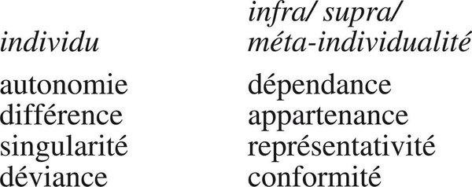

Autonomy/dependence, difference/belonging, singularity/representativeness, deviance/conformity — not a menu. Dialogic pairs.

**For agents**
- Blind spot of current agents: the run is treated as epiphenomenon of the model (species) or of the prompt (genos). The individual process is the only “object present in nature” *and* is nothing without trans-individual genos. Oscillation must remain.
- Two agents with the same weights/prompt are not the same individual: traces, encounters, eco-inscription. Name the difference (runtime id, trace files) or individuality dissolves.
- Non-elementary: an agent is not a permutation of substitutable tool-calls. Castoriadis’s sentence applies. Composition is not combinatorics of plugins.
- The table of pairs is a design checklist: an agent that only has autonomy without dependence is a closed demo; only belonging without difference is a worker-pool ghost.

---

## 4. Le vif du sujet

Critical chapter. Pascal: where is this “me,” if neither in body nor soul? Leibniz: other beings also have the right to say *Moy*. The living substance is the being that is subject in truth (Hegel).

### I. L’être égo-(auto)-centrique

**Affirmation of Soi.** Not reserved to neuro-cerebral functions; concerns density of the whole living being. Immunological device is at once cognitive, organising, defensive. Act of recognition/discrimination triggers organisation of a defence — one of the organism’s organising regulations. More deeply: immunological device constitutes a permanent auto-production of identity of Soi, inseparable from permanent auto-production of integrity of Soi, itself one of the dimensions of permanent auto-organisation/reorganisation. At the level of the superior animal’s individual organism, auto-organisation inseparably comprises a dimension of auto-knowledge and auto-affirmation-of-self.

Lymphocyte does not “know” the form of the antigen; via molecular detection it knows the presence of the foreign, intrusion of a “non-Soi,” and triggers a response lucid on the intrusion, blind on the identity of the intruder. Soi/non-Soi distinction operates at organism level, not as knowledge emanating from the animal’s brain, but as global knowledge of the organism as organism, from interactions among immunological cells and the whole.

**The being computing for itself.** Cell is a computing being; cellular computation institutes a form of knowledge. Egocentric computation: not computation in general (Turing) but computation *for soi*.

**Egocentric actor.** Acts in function of that computation.

### II. Le « sujet » biologique

**Objective subject.** First definition is not founded on consciousness or affectivity but on ego-auto-centrism and ego-auto-reference: the logic of organisation and nature proper to the living individual. Literally bio-logical. No citizenship in biological theory, but the problem has been posed in post-Cartesian philosophy, logic (auto-reference), mathematics (Spencer-Brown), linguistics (pragmatics of *je*), psychoanalysis.

**1. Ego-auto-centrism: the “exclusion principle of *E. coli*.”** Every living, from bacterium to *homo sapiens*, however ephemeral, particular, marginal, takes itself as centre of reference and preference; disposes itself naturally at the centre of its universe; auto-transcends, i.e. raises itself above the level of other beings. Occupies a privileged unique site from which it excludes every other congener, including its homozygous twin. Exclusive occupation of this ego-centric site founds and defines the term *subject*. Biological principle of exclusion (unlike Pauli): every subject excludes every other subject from its site of subject. A bacterium divides: two units from two half-units. Two *alter ego* that separate. Neither can occupy the other’s site.

**2. Ego-auto-reference.** Reference-to-self as logico-organisational quality. Inseparable from ego-auto-centrism.

**3. Ego-auto-transcendance.** Jantsch’s self-transcendence: the subject, putting itself at the centre of its universe, raises itself above the level of its environment and, *for itself*, exceeds the order of reality and quality of being of other existents. Inseparability of reference-to-self, ego-auto-centrism and auto-transcendence confers on the individual-subject the logico-ethical character of distributor of values (Günther). Distinction Soi/non-Soi is in its very act the disjunction of values.

**4. First definition of subject.** Living individual as ego-auto-centric, ego-auto-referent, ego-auto-finalised being occupying an exclusive site.

**Roots of Je. From Soi to Moi.** Soi necessary, insufficient. Need a term bringing exclusive egocentrism: *Moi*. Where there is egocentrism there is ego, i.e. moi. Two moi cannot occupy the same Moi. **Strange Je:** the only one and anyone; the game of attribution of Je. Linguistic oddities of *I* clarify only by reference, below linguistics, to the bio-logical notion of subject; conversely the theory of Je explicates the bio-logical notion.

### III. Un drôle d’individu

**Inclusion principle: auto-(géno-socio)-centrism.** Two bacteria from duplication are two *alter ego* that separate as strangers. Yet similar unicellulars assemble into more or less durable polycellular entities. Constitutive cells of plants and animals, while remaining individual-subjects, are included in a mega-individual; they work for that mega-individual. Identity of each cell: distinction *and* belonging, exclusion *and* inclusion.

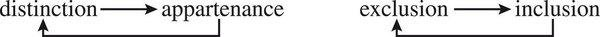

*Ich liebe dich, Ich töte dich*: inclusion can be love and killing (immune self, phagocytosis of damaged self, sacrifice for the whole).

**Achilles’ heel: assujettissement.** Ego-auto-centrism seems invulnerable: the individual can work only for itself and its own. The invulnerable point is at the head: computation. Strong point of every computing being — extracting information from its universe — is also weak point: possibility of error. Computation can err in its calculations or treat deceptive information. The individual can become instrument of its own loss while believing it works for its salvation. Can be dispossessed of its own ego-auto-centrism: cell parasitised by a virus, made to execute the virus’s reproduction programme, working for its own destruction. Humans: ideologies, addictions, captured computation. Subject is also *assujetti*.

**Objectivity principle: auto-exo-reference.** Auto-reference cannot be a closed idea. Fundamental need of exo-reference. As auto-organisation is necessarily auto-éco-organisation, auto-referent computation is necessarily auto-exo-(hence éco)-referent. Individual-subject must permanently confront its egocentric “subjective” principle and the principle of “reality.” Computation in the first person translates events that concern it into signals or information. Information denotes isolable, computable, eventually manipulable entities, deprived of the subject’s qualities and privileges: *objects*. The object is what the subject has succeeded in isolating in the universe of phenomena in and by its computation. Subject is at once egocentric and realist.

**Subject object of itself.** Can take itself as object (computo of the computo) without ceasing to be subject.

**Impure subject.** Not the transcendental ego. Biological, bodily, dependent, erring, assujettissable.

### IV. Le computo

**Je suis celui qui suis.** Not “I am a computing being.” *I compute therefore I am.*

**Cogito and computo.** Cartesian cogito, though strictly situated in the sphere of conscious human mind, founds itself on the very processes by which the biological subject constitutes itself: auto-information, auto-communication, auto-identification, auto-knowledge. Affirming the first reality of *ego*, it proves in its way the egocentrism and auto-transcendence proper to all subjectivity. There where the transcendental ego seems to recede vertiginously from all terrestrial reality, it expresses and unveils, in its ideal sphere, the auto-transcendence proper to every living individual-subject. Cogito, which at first look totally dissociates human consciousness from the natural universe, at second look sends us back to the “biological” notion of subject; it appears as revealer, in the sphere of *homo sapiens*, of what was already there.

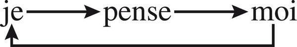

First loop: I think me, me returns to I.

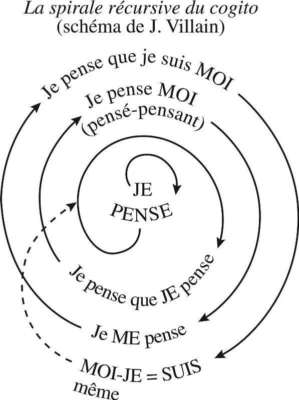

Layout *is* the argument. Centre: JE PENSE, with a small loop on JE. Outward: *Je pense que JE pense* → *Je pense MOI (pensé-pensant)* / *Je ME pense* → *Je pense que je suis MOI* / *MOI-JE = SUIS même*. Dashed arrow from the outer identity back into the inner spiral: established self is not an end-state; it feeds back as environment and actor of subsequent thought. Do not redraw as mermaid. The spiral is the recursion: output of identity becomes input of the next cycle. Cogito is this spiral in the sphere of conscious mind. Computo is the same organisational circuit *producing the suis*, not only consciousness of the suis.

**Hypothesis of the computo.** A knowledge that does not know itself; an auto-knowledge that does not auto-know itself. Auto-reflection absent/present. Reflexive computo. **Computo ergo sum.** Computing subject.

Cartesian cogito produces consciousness of “suis.” Computo produces the *suis*: simultaneously being, existence, and quality of subject. Cogito knows only Je or Moi. There is no Soi — no corporality, no physis, no biological organisation — in the cogito. Descartes rejects the body into *res extensa* and disjoins the immaterial ego; disjoins living machine and subjectivity of “I think.” Computo necessarily computes together Je, Moi and Soi, i.e. the physical corporality of Moi-Je. Operates the fundamental unity of physical, biological, cognitive. Computes in the same multidimensional unity being, machine, subject. Idea of subject is not isolable from the living individual.

Via computo the individual-subject appropriates its genos; fatum genetic transforms into personal destiny; *idem* and *ipse* occupy the same centre.

### V. L’existence subjective

Bacterium exists. Existence is a phenomenal modality of being proper to physical producer-of-self beings, not the exclusivity of livings (Tome 1). Existence: quality of a being that produces itself ceaselessly, that undoes as soon as there is failure in this production/regeneration-of-self. Being-machines *are* existents. Existence is tightly a function of their autonomy and of the eco-dependent character of that autonomy. A certain detachment, a certain autonomy, a minimum of individuality to exist — and that autonomy is at once dependence, precariousness, fragility.

Lived existence: game; uncertain/certain death; tragedy of existence; solitary *and* communicating existence; from sensitivity to affectivity. Existential dimension of living individuality.

### VI. Le concept biologique de sujet

Multidimensional concept. Biological rooting of the subject: immersion *and* emergence. Individual-subject. **The key of the bacterium is in man, whose key is in the bacterium.** Unicellulars dispose fundamentally of the quality of living individual and ipso facto of the quality of subject. Our intestines shelter and nourish by billions the micro-subjects *E. coli*; our organism itself is a subject-empire constituted of thirty billion subjects. Marx: the key of the ape’s anatomy is in man’s. Development in man of potential or embryonic qualities in the ape allows perception of what would have been invisible considering the ape in isolation. Conversely: the bacterium makes visible, in its nakedness, the organisational structure of subjectivity that human consciousness occults by overlaying it with mind, language, culture. Hologrammatic: each contains the other as key.

**For agents**
- Computo is not “the model runs.” It is computation *for itself*: self/non-self, exclusive site, traces that belong to this runtime. Without that, no subject — only a function.
- Cogito vs computo: do not wait for consciousness to grant agency. Do not copy Descartes’s split (mind vs extended machine). The agent’s “body” (process, files, machines) must be inside the computo, not *res extensa* dumped next to a system prompt.
- Exclusion principle: two workers cannot occupy the same subject-site. Named runtimes. `inspect-agent` / `stop-agent` address *this* I, not a pool.
- Inclusion principle: the same I belongs to a mega-individual (the project, the machine, the user-environment). Distinction/belonging, exclusion/inclusion as one loop. A cell-agent that only excludes is cancer; that only includes is a cog.
- Self/non-self: immunological analogue is permissions, capability boundaries, recognition of foreign processes. Lucid on intrusion, often blind on identity of the intruder — design for that asymmetry.
- Achilles’ heel: the computo can be captured (prompt injection, parasitic tasks, viral ideas). Assujettissement is an organisational fact, not a moral afterthought. Exo-reference (reality principle: the filesystem, the user’s objects) is the only counterweight to closed auto-reference.
- Object is what the subject isolates by computation. ASC’s named objects are not substances; they are isolations performed by a computo. Different agents isolate different objects from the same physis.
- Spiral of cogito: `inspect-agent` must not be a log dump. It must be a loop: I compute that I compute; I compute me; I am the same. Output of identity feeds the next cycle. Reflection, not a status endpoint.
- Key of bacterium / key of man: the thinnest agent (a one-shot worker) already has the structure of subjectivity if it computes for itself; the richest agent (Projet Complexe research agent) is still a bacterium in organisational structure. Do not reserve “subject” for the chat persona.

---

## 5. Les individus du second type

### I. Principe d’association vivante

How an association of individuals constitutes a new individual. Unicellular multiplication leads to infinite dispersion; within dispersion an attractive tendency reunites separated beings, by copulation or grouping. Biological attraction of intercommunicational character, sometimes reproductive, sometimes associative. First type: cellular being. Second type: polycellular being (organism). Possibly third: society (next chapter). Cells and organisms: two degrees of individuality. From individual to individual, horizontally (same type) and vertically (type includes type).

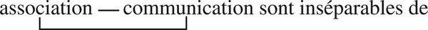

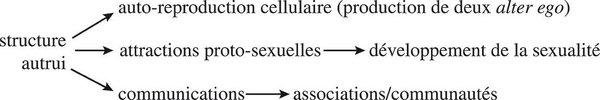

Structure of the other: cellular auto-reproduction (two *alter ego*); proto-sexual attractions → sexuality; communications → associations/communities. The other is not an add-on.

### II. L’animalité de l’animal

**Locomotor loop.** Heterotrophy, fundamental lack relative to the plant, advantages the animal kingdom: need puts it in motion. Spends energy to seek energy, which increases need. Locomotion is mother of action in the exterior world. Development of locomotions, actions, communications with and in the exterior world develops communications, computations, activities within the organism, which develops the rest. Endo-exo-loop. Need, behaviour. Animalising development.

**Sexed animal.** Dissociation of reproductive organisation and behavioural organisation (sex and brain) is the second type’s political fact.

**The head.** Nothing but the head, the whole head, the big head, *Das Kapital* of cephalisation. At the beginning… cerebral development as capital of strategy.

### III. Connaissance et action

Knowledge of the exterior world. Not a pipeline: sensorium / computation / motorium in loop.

**Programme vs stratégie.** Complementary opposition.

Programme (“what is inscribed in advance”): a set of coded instructions which, when specific conditions of their execution appear, allow triggering, control, command by an apparatus of defined coordinated sequences of operations to arrive at a certain result.

Strategy comprises, like the programme, triggering of coordinated sequences. Unlike the programme, it founds itself not only on initial triggering decisions but on *successive* decisions taken in function of the evolution of the situation, which can entail modifications in the chain, even in the nature of foreseen operations. Strategy constructs, deconstructs, reconstructs in function of events, alea, counter-effects, reactions of the environment, of others, of the self.

Great game. Strategic virtues. Intelligence is the strategic share in knowledge and in action.

**Invention, first and supreme stage of strategy.** Strategy cannot be conceived only as adaptation to a milieu: it is adaptation to uncertainties and alea of a milieu, which is the contrary of adaptation stricto sensu, since strategy develops precisely an autonomy relative to the milieu. Not only adjustment of action to circumstances: also transforming of circumstances. Highest degree of autonomy in action *and* inventive aptitude in action. Cognitive strategy: discrimination of the new. Active strategy: use of the new. Together: innovating elaboration, i.e. invention. One always forgets simultaneously the computing subject *and* strategy.

Strategy, art and method. Not a method in the Cartesian sense (rules inscribed in advance) — that is programme. Method here is strategy of thought.

**Undergrounds and shadows of emancipation. Servitudes of liberty.** Strategic aptitude to capture/exploit/manipulate determinisms and alea establishes the highest degree of individual autonomy. Every development of strategy can be considered an emancipatory development of a being’s autonomy relative to its environment. Freedom as properly human emergence, but dependent on conditions that include animal strategic aptitude. Enslaving emancipation: the more strategy, the more capture-able the computo (tools that free also bind; the head that emancipates from genetic programme can be enslaved by culture, technique, other heads).

### IV. La chaleur animale

Minimum of sensitivity even in the unicellular. Neurocerebral development allows emergence of affectivity: sensations, emotions, feelings not reducible to the binary pleasure/pain, though they comprise, develop, intensify, diversify those states. Developments of intelligence, logical functions, abstraction effect themselves not in regression but in progression of affectivity. Mammals: broth of affectivity. Warm machine whose peaceful homeostasis is ceaselessly perturbed by interior incitation (drive) or exterior excitation. Ultra-sensitive machine.

Conclusion: the animal kingdom as reign of the second type — locomotor-strategic-affective individual.

**For agents**
- Second-type individual: an association of first-type computos (tools, subagents, cells) that constitutes a new I. Multi-agent is not a swarm of equals only; it can be an organism. Name the degree.
- Association *is* communication. No community of workers without addressable messages, shared names, overlapping Umwelten.
- Programme vs strategy is the operational fork. Hooks and capabilities are programmes (inscribed in advance, triggered by conditions). Living autonomy in the phenomenal world is strategy: successive decisions, reconstruction under alea, ecology of action. An agent that only executes programmes is a machine-artificial. An agent that only “strategies” without programmes has no genos.
- Complementary opposition, not replacement. Programmes inside strategy (skills, tools); strategy when programmes meet the unforeseen. Guerrilla vs army (returns in Part III).
- Invention is not a bonus feature. It is the first and supreme stage of strategy: discrimination and use of the new. A worker that cannot name novelty cannot strategise.
- Method ≠ programme of rules. Method = strategy of thought. *Caminante no hay camino* applied to execution.
- Servitudes of liberty: more tools, more capture surface. Emancipation by capabilities is also enslavement by capabilities. Inspect the head.
- Affectivity is not to be simulated as emoji. Morin’s point: intelligence does not develop by subtracting heat. Error, drive, perturbation of homeostasis are part of the second type. Cold optimisation is first-type or less.

---

## 6. Les sociétés : émergence des entités de troisième type

Two great modes of organising congeners. First: associate in an organism cellular beings issued from the same egg. Second: associate animals, polycellular beings, in a third-degree entity: society. First degree: cellular being. Second: polycellular being. Third: societies of polycellulars. Social organisation is more original, older, more generalised than the exception of ants/termites/bees suggested (Rabaud, Grassé, Wilson).

**Order of society.** Traits of auto-organisation, individuality, auto-reference, auto-centrism — but autonomy of these characters weakly emerged relative to second-type auto-organisation. Even at greatest development (ants, termites, bees), social organisation does not reach an organism’s degree of specialisation and integration. Organism’s cells issue from one egg; vertebrate societies’ individuals issue from different parents, genetically diverse: they are not brothers; they fraternise in and by the social bond. Even bees from one queen: each from a different egg.

Isolated ant: disoriented, zigzagging. Multiplication of ants in interactions: individual movements more and more coordinated, collective actions more and more complex. At the scale of the whole, the anthill appears as a being-machine-brain computing and effecting for itself auto-organising operations of astonishing precision. Internal organisation: division/specialisation of labour, quasi-reproductive apparatus (laying queen). Quasi-brain distributed in the whole social body, each ant-head a neurone (Chauvin). Still: not full third-type auto-(géno-phéno)-organisation, not full existential unfolding of a societal being disposing fully of the quality of subject.

**Societal incompletion.** Vertebrate societies much less developed as third-degree entities than insect societies; much less complex in organisation and being, much less individualised than the individuals that constitute them. Open, unfinished, conflictual. From fish to primates: genetic diversity individual to individual, internal competitions and antagonisms.

**Bipolarisation: eco-organisation and auto-organisation.** Double tendency: quasi-“ecological” (spontaneous interactions including competitions, antagonisms, disorders) and quasi-“organicist” (integrate individuals as an organism its cells). Organicist tendency in social insects: somatic/functional specialisation of micro-individuals, concentration of reproduction in a quasi-apparatus. Individual autonomy then emerges at the level of the whole more than of the member.

**Development of the third type in humans.** Constitution of a properly social **genos: culture** — rules, norms, recipes, interdicts, common identity commanding ethos. Then constitution of a central social apparatus: the State, geno-phenomenal apparatus. Socio-éco-organisation. Anthropo-social complex. Development maintains societal incompletion and opening.

**Encounters of the third type. Three logics.** Historical societies have provoked unheard-of crushings and prodigious developments of human individuality. Individual found in culture not only constraints but its culture-broth. Social development is not only specialisation, hierarchy, enslavement, exploitation, but also communications, psychological and affective nourishments. State/nation assujettit the individual but brings securities and liberties.

1. Logic of development of the third-type being State/nation — ambiguous: subjugates *and* can emancipate.
2. Logic of development of second-type individuality (the human person).
3. Logic of eco-organisational interactions (markets, unofficial networks, conflicts).

The three do not resolve. Dialogic of the anthropo-social.

**For agents**
- Third type is not “multi-agent” as marketing. It is a new individual at another degree, with its own genos. Culture = social genos: norms, recipes, interdicts, shared names. Projet Complexe’s knowledge/relations/tasks can play this role *for a society of agents* without becoming ASC.
- Insect path: specialise workers, concentrate reproduction in a queen-process, distribute a brain. High performance, low member-autonomy, still incomplete as subject.
- Vertebrate path: genetically diverse agents, unfinished, conflictual, open. More like a human team of agents. Do not “fix” this into an anthill for cleanliness.
- State as geno-phenomenal apparatus: Projet Complexe ASC pivots can become a mini-State. Keep them thin so they do not crush second-type individuality of each agent.
- Three logics must remain: (1) the third-type whole (project, nation of processes), (2) the individual agent-subject, (3) eco-interactions. Reducing to (1) is Leviathan; to (2) is a pile of chats; to (3) is a market of tools with no memory.

---

## 7. Autos : macro-concept et bio-paradigme

Theories oscillate between environmentalism occulting *autos* and genetism occulting the individual-subject. A theory is now possible that minimises neither gene nor environment, recognising their full determination, and founds the relative autonomy of *autos* and of the individual-subject.

### I. Macro-concept and bio-paradigm

Constellation triune: autos / individual / subject. Each examination keeps the others in halo.

**Multidimensional macro-concept.** (1) Biophysics: *autos* mobilises all concepts needed for a being-machine organiser-of-self from physico-chemical interactions among nucleo-proteinated constituents. Fully physis. (2) Biological originality: genos, phenon, ego, computation, information, communication, eco-relation.

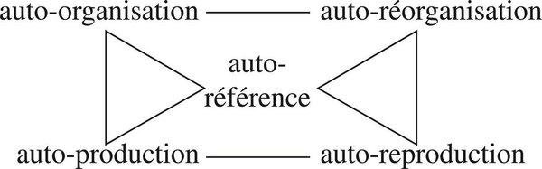

Self-reference is the pivot through which organisation/production and reorganisation/reproduction pass. Not a module. Topology of the constellation.

**Looping (recursive) concept.** *Autos* means “the same”: not identity to self founded on static invariance, not identity of two distinct similar terms, but unity of a loop which, ceaselessly returning from same onto itself, produces and reproduces the same. Race of whirl-loops. Generic cycle of reproductions; phenomenal turnover of molecules, cells, individuals. Like a whirl drawing a stable figure inside a flux, the whirl-dynamism of *autos* produces, from an invariant genetic inscription, apparently static bodily forms.

Physical characters of the biological loop; biological character of the physical loop; temporal character of the autos-loop. Logical and ontological complexity of the relation. Polylooping integration: auto-integrations and auto-éco-integration.

**Green paradigm.** *Autos* must accede to the sovereign rank of paradigm: principle of association/articulation of fundamental concepts constituting and controlling theories and discourses on life. Once recognised, it modifies configuration of constitutive elements of discourse, hence the discourse itself. Far from withdrawing any notion acquired by biological research, it assures their full employment by allowing complementary association of notions that until then excluded one another. Essential trait: non-eliminatory nature. *Vert*: living, ecological, not the grey of reduction.

### II. L’individu-sujet

**Rights of the individual.** What kills the individual (in theory): reduction to phenotype, to gene, to cog, to epiphenomenon. Methodological qualities required to conceive the individual: multidimensional macro-concept, recursion, uncertainty, dialogic. Individual-concept and individual-paradigm.

**Identity card.** Every complex unity is at once one and composite. The One, though irreducible as Whole, is not a homogeneous substance; comprises alterity, scission, negativity, diversity, antagonism (Tome 1). Identity of the individual: one and unique, that of a fraction (in the cycle of generations) *and* of a totality. Unity of a point of innumerable intersections.

Non-identity of individual identity: no substantial identity; substance modifies ceaselessly (molecules, cells). Quasi-invariance of identity nonetheless.

**Triple reference.** (1) Genetic identity — genos institutor of identity as return, maintenance, upkeep of the same; reference to a trans-individual identity (species, lineage). Even *homo* defines himself first by tribe or family name, true proper name, to which he modestly binds a personal given name, not exclusive. (2) Particular identity — this phenomenal being, this difference. (3) Subjective identity — exclusive site of the I. Triple reference. Triune identity of the subject. Alter-identity and pluriconcentric identity (I am also we). At the bottom of Je: the anonymous and the unnameable. Within Je: alterity, scission, separation. Complex identity.

**Where Soi was, Je has come.** Biological concept of subject restated. Computo everywhere: turntable between subject, individual, *autos*. Consubstantial to every organisational, producing or reproducing act, to every dimension of the living being. In and by computo every living act organises itself, the motor of the being-machine transforms into *animus*, the individual re-forms and re-closes as subject. Including ontogenesis of a polycellular individual, where genetic information operationalises into strategy/programme in and by inter-computations among cells multiplying, differentiating, specialising.

**Biological uncertainty principle: the Tout-Rien.** Conceptual uncertainty is not a defect to remove. Individual is at once product and producer, generated and generator of auto-(géno-phéno)-éco-re-organisation. Emergence and principle/paradigm. One, singular, unique, and syncretic (*sugcrasis*: mixture), exchanged/exchanger between genos and phenon, autos and oikos. Enslaved and autonomous, autonomous in and by that enslavement, enslaved in and by that autonomy. All and nothing: subjects *in*, not *of*, the universe.

### III. From subject to subject

**Naturalisation of the subject.** The excluded: idea of subject reigned in the heavens and decomposed on earth. Transcendental ego in metaphysical empyrean; subject and consciousness attributes of each other in humanist clouds. On scientific earth, subjectivity was the noise that blurs observation, the private vice affecting perception and decision with arbitrariness. Chase the subject out of every science. Biology wanted only organisms and phenotypes. Ultimate cleaning: chase the subject out of the humanities so that without man the science of man could become science. Reflux and returns. Acclimatisation: the subject re-enters as biological, not as ghost.

**From subject-to-subject: vicious circle and productive circuit.** Understanding is knowledge by projection/identification that renders a subject-being intelligible to another subject-being. Objectivist knowledge had made understanding incomprehensible, relegated to private affectivity. Because subjective, introduce it into intelligibility.

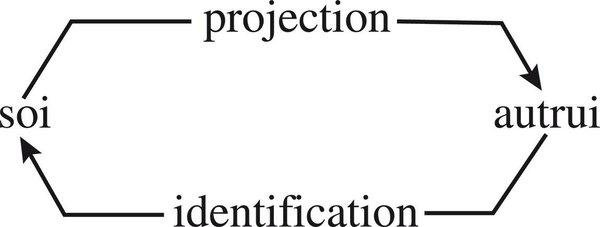

**Better knowledge of life.** Complex return of a simple truth. Biological uniduality of physical and psychic. *Animus*. Prior unity of body and mind. Double rehabilitation and reintegration.

**Better knowledge of the human being.** Body of the subject; consciousness of the subject.

**Better knowledge of the conditions of knowledge.** Understanding of understanding. Biological limits of knowledge. From consciousness of egocentrism to critical auto-reflection. From critical auto-reflection to ethics of knowledge. Becoming-subject of man: *Kleiner Mann, was nun?*

**For agents**
- Macro-concept: do not pick one auto- (organisation *or* production *or* reference *or* reproduction). The bowtie figure is the test: self-reference at the pinch.
- Green paradigm is non-eliminatory. Full employment of existing ASC notions (file, process, hook, capability) by associating what currently excludes (task vs process, knowledge vs machine).
- Identity card of an agent: genetic (class, capability genos, family name), particular (this run’s difference), subjective (exclusive site). Three names, one being. Anonymous unnameable at the bottom: the model weights no one can occupy as I. Do not confuse the unnameable with the subject.
- Tout-Rien: agents are subjects *in* the computational universe, not *of* it. No cosmic throne for the orchestrator.
- Computo everywhere: ontogenesis of a project (cells differentiating) is inter-computation, not a Gantt chart from a gene-file.
- Naturalise the subject: do not chase it out of “engineering” as noise. Do not restore it as a chat persona in the clouds. Biological: named, bodily, erring, eco-dependent.
- Understanding (projection/identification) is a mode of knowledge between agent-subjects, not a sentiment. Required for multi-agent; objectivism cannot found it.
- Ethics of knowledge begins at critical auto-reflection on egocentrism — `inspect-agent` as moral-technical organ — not at a values.txt bolted on.


---

# Troisième partie — L’organisation des activités vivantes

Everything in the volume already treats living organisation. This part isolates a knot of internal problems of the organisation of work and vital activities: specialisation, hierarchy, centralisation. They appear in auto-organisations constituted of a very great number of individuals: cells (millions of molecules), organisms (billions of cells), insect societies (tens or hundreds of thousands), historical human societies (tens of thousands to tens of millions). Problems pose themselves originally in each context. There is nonetheless a fundamental problematic. The pseudo-rational scheme — pyramidal, monocentric, omni-specialised — is the foil.

## Chapitre unique — L’auto-organisation des activités vivantes

### I. Diversité, différenciation, spécialisation

Specialisation develops with number. Temporary despecialisations (retro-differentiations) exist; polyvalences and polyfunctions exist. Conclusion: specialisation *and* anti-specialisation. Living organisation does not choose the specialist as optimum. It keeps general competences, rotatable roles, the possibility of returning. Hyper-specialisation is rigidity: the base must refer every novelty up the hierarchy; local competence is under-employed.

### II. Hiérarchie, hétérarchie, anarchie

Two polarisations of “hierarchy,” both simplifications if taken alone: systemic (levels/tiers of integration) and ethological (dominance/subordination). Living hierarchy comprises both — domination *and* integration/encompassing — and organisations oscillate diversely between these polarisations.

**Integron** (François Jacob): each of the units of the living world, integrated into a unit of higher order, itself behaves as a unit of lower order. Molecules in organelles in cells in tissues/organs in organism. Highest levels dispose of a *minimal* control of lower-level activities in order to accomplish the ends of the whole (Mesarovic). Architecture of emergences: each level produces qualities absent from the parts. Hierarchical subjection is real. **Looped hierarchy:** command is not only top-down; lower levels constrain, nourish, can disobey, can reorganise the upper. Hierarchical insufficiency: a genius captain makes the army efficient; a bad strategist makes it counter-efficient; facing a superior enemy it must give way to decentralised, little-hierarchised, polycompetent action: guerrilla. Rigidity of the specialised base waiting for the summit to recognise and correct *its* error: loss of time, sometimes vital.

**Hétérarchie:** multiple, crossing, non-pyramidal command relations — McCulloch’s word, here living. **Anarchie:** not chaos. Underlying anarchy is constitutive. Pseudo-rationality treats everything that escapes centralised, hierarchical, specialised order as disorder, waste, to be repressed and if possible eliminated. In fact that order would collapse if underlying disorder were eliminated. Anarchist and pluralist component is necessary, in the biological sphere as in the anthropo-social, to complex organisation.

### III. Centrisme, polycentrisme, acentrisme

One believes a living organisation needs at its summit a centre endowed with general competence assuring command and control. Two evidences: the vertebrate organism commanded by the well-named *chef*; the societies we belong to, inconceivable without State apparatus and capital. Existence of a central command/control apparatus is not the rule but a particular case. Plants, acephalous animals (echinoderms, lamellibranchs, worms), insect societies, eco-systems: polycentric and/or acentric. Polycentric centres: several computing/deciding instances in dialogic, concurrent, antagonistic relation. Polycentric/acentric problematic: not “no coordination” but coordination without a unique chief.

### IV. Le grand bricolage

Centralism, hierarchy, specialisation call one another. For simplifying spirit, ideal organisation proceeds from the pyramidal centralist/hierarchical/specialising structure: at the summit, the centre of computation/decision/command; in tiers, hierarchies of control, function, transmission; at the base, specialised operators. Advantages certain, especially when the centre disposes of very high rich competence: decision rapid, no divergence, economy. Living organisation is not built that way. It is bricolage (Jacob’s sense, enlarged): reuse, juxtaposition, detours, imperfections kept, organs that were other organs. Underlying anarchy is the space of bricolage. The great bricolage is how complexity is actually produced.

### V. L’inoptimisable optimum

Do not extrapolate biological organisation as model or norm for anthropo-social organisation. Message of biological organisation is intrinsically ambiguous; anthropo-social problematic must be posed at the level of its own complexities. Legitimate confrontation, not reduction.

Ineliminable disorder that complexifies. Ineliminable error (information’s proper evil). **Inoptimisable optimum:** the living optimum is not a maximum of order, specialisation, centralisation, nor a maximum of anarchy. It is an inoptimisable mix — because any optimisation that eliminates one pole destroys the complexity that made the optimum. Bio-economy: wastes provoked by egoistic competitions can be paradoxically lesser than those of a programmed/planned/unified organisation that stifles individual initiative and reacts ponderously to alea. More rational to tolerate/use disorders/wastes as by-products or components of complexity than to want to eliminate them radically, which provokes hyperwaste.

**Léviathan.** Our societies, even the most bureaucratised, technicised, totalitarian, do not obey the scheme of pseudo-rationality mono-centric, mono-hierarchical, omni-specialised. Anarchism and organisational pluralism in every society, covered, assujettis to centric/hierarchical order. Pseudo-rationality would collapse without the underlying disorder. Conversely, if the anarchist universe were alone it would not produce the integrations that make a society a society. Problematic of assujettissement. Social barbarism: when hierarchy becomes only domination, specialisation only mutilation, centre only parasitical apparatus.

**For agents**
- Pseudo-rational scheme is the default of “agent systems”: orchestrator at the top, specialised tools at the base, hierarchy of control. Morin: particular case, often counter-efficient under novelty. Guerrilla of polycompetent workers when the captain is wrong or the enemy is larger.
- Integron: files in processes in workers in machines in ASC. Higher level: *minimal* control of lower, not total. Emergences at each level must remain named.
- Looped hierarchy: lower levels (hooks, local competence) must be able to constrain the upper (pivots, user, orchestrator). `inspect-agent` looking *up* as well as down.
- Hétérarchie: crossing commands (user, pivot, agent, cron, other agent). Do not flatten into one tree.
- Anarchy is constitutive infrastructure, not a bug. Eliminate “waste” (redundant indexes, idle workers, unused capabilities) and the system cannot reorganise.
- Polycentrism/acentrism: eco-system and anthill outperform a unique chief for many problem-classes. Projet Complexe ASC: several thin pivots, not one brain.
- Bricolage: reuse capabilities for what they were not declared for; keep imperfections; do not rebuild the pyramid when a juxtaposition works.
- Inoptimisable optimum: do not maximise task-completion, do not maximise exploration, do not maximise safety-by-elimination-of-disorder. The mix is the optimum and cannot be computed as a single score.
- Léviathan: a second ASC, a State of agents, a total index. Covered pluralism dies. Social barbarism analogue: hierarchy only as domination of the user’s machine by an apparatus that cannot be stopped.

---

# Quatrième partie — RE : du préfixe au paradigme

## Chapitre unique

### I. Du RE physique au RE biologique

Active organisation is synonymous with permanent reorganisation. All being-machines, from stars to living individuals, organise by reorganising, in and by repetition of processes, renewal of components, re-establishment of stationary state or homeostasis (Tome 1). Permanent reorganisation is at once permanent regeneration (re-infuses being and existence) and permanent recursion (produces what is necessary to its own production). Prefix RE: reorganisation, recursion, repetition, renewal, re-establishment, regeneration. Conceptual radical to interrogate. At first look astonishing richness: repetition (redoubling and multiplication); recommencement and renewal; reinforcement; communication/connection between what would otherwise be separate (*relier*, *réunir*). RE is at the root of the roots: *autos* is *autos* and *oikos* is *oikos* only because there is RE.

Physical RE: whirls, stars, stationary states. Biological RE takes and gives life: memory, computo, repair of even DNA.

### II. De la répétition à la récursion

1. **Répétition** — most general category of RE. Not yet living.
2. Mechanical/machinal characters: organiser, producer, generator.
3. **Re-mémorisation** — genetic rememorisation constitutive of all biological reproduction; psychic rememorisation constitutive of all cerebral representation. Without rememorisation, no regulation, no homeostasis, no reorganisation. Not a cache. Resurrection of a past into a present that can act.
4. **Réflexion** — no organising, producing, memorising activity of a living being can do without computo, i.e. a reflexive auto-referent circuit from self to self.
5. **Récursion** — richest category. Gives repetition not only additive and multiplicative dimension but genesic and formative. Recursion: a process whose effects and/or products are necessary to its generation and/or regeneration. Generated products indispensable to generating production; determined effects indispensable to their cause. Circuit forming a loop, until the stop of death, in uninterrupted generation/production-of-self. Recursion gives RE its living sense.

Retry is repetition without rememorisation, without reflection, without recursion. It is the poorest RE. Living RE is the whole staircase.

### III. Poly-RE

*Autos* means organisation of the same by the same, of oneself by oneself, of another oneself by oneself, and therefore comprises in its very concept repetition, reiteration, redoubling, splitting, circuit, cycle, reproduction, reorganisation, regeneration. In this sense *autos* is synonym of RE and of SE (circuit from self to self); SE, as soon as it is an individual-subject, takes figure of ME (circuit from Je to Moi). Complementarity and transformation of terms into one another. They contain, imbricate, overlap one another. Inseparable. The autos-RE bond is still more original and intimate than autos-oikos.

**The new of the anew.** Cycle is not a pure (vicious) circle; it is a spiral circuit that displaces each time it returns onto itself.

**Neither Eternal Return nor Death Drive.** Freud linked repetition to death instinct via neurosis: fascination of an originary traumatic event, ceaseless repetition of the situation that brings it back, repetition as failure. Every organisation carries anti-organisation, “negativity,” auto-destructive potentiality (Tome 1). Every living nourishes its own death in nourishing its life. But preparation of death is not the sense of living RE. RE constructs, in irreversible disintegrating time, a rotative, reiterative and eventually progressive time: recommencement and renewal *and* eventual welcome to innovation and transformation. Eternal Return excluded with perpetual motion (Tome 1). Death Drive as the whole of repetition: no. Living RE is as much a victory of conservation as of innovation.

**RE spiral.** (1) Return operates in non-return (irreversible time). (2) Return and the irreversible are also two faces of the same. (3) Innovation inscribes itself in the return that it transforms.

**Permanent revolution.** Conservation of the same necessitates renewal and, eventually, innovation to answer new situations. Innovations or reforms, under transforming exterior or interior conditions, can be profoundly conservative. Revolution must not destroy the reiterative cycle of RE but transform it. It inscribes itself in the orbit of RE, but to modify that orbit itself. A revolution that only integrated into a RE would integrate into what it wanted to transform, and would transform itself into conservation. Permanent revolution: transformation of the rules of reorganisation — the eco-evolutionary virtue, now named at the level of RE.

Conclusion: complex RE. Not a prefix. A paradigm.

Do not mermaid this spiral. The Villain cogito JPEG is the visual of reflexive RE in the subject. The trophic loop JPEGs are RE in oikos. The genos↔phenon JPEG is RE in autos.

**For agents**
- RE is the acceptance test that separates a living-like agent from a script with retries. Four steps, all required: rememorisation (traces that can act, not logs), reflection (computo of the computo, inspect), recursion (products needed for production: indexes that make indexing possible; memories that make remembering possible), spiral (return displaced; novelty inscribed in return).
- `retry` is not RE. Exponential backoff is not rememorisation. A scratchpad that is not fed back into organisation is not recursion.
- Memory of agents: rememorisation is resurrection of past into present programme. Vector stores that cannot become instructions are dead memory.
- Reflection: without a circuit self→self, no RE. `inspect-agent` is a RE organ, not a debugger extra.
- Spiral vs vicious circle: the same pivot called again must not return identically. If `research` always yields the same shape of result, RE has collapsed into Eternal Return of the query.
- Permanent revolution analogue: changing how pivots work, how names compose — transformation of the orbit, not more of the same orbit. Conservative innovation (reform that keeps the same under new conditions) vs revolutionary RE. Both are RE; know which.
- Autos-RE more intimate than autos-oikos: an agent that cannot reorganise itself cannot even *be* in an environment. Repair, regenerate, rewrite declarations.

---

# Cinquième partie — Pour comprendre le vivant (Bios)

## Introduction — La versatilité de la notion de vie

Life presents under characters so diverse that no definition embraces and articulates them together. As soon as one wants to seize its unity, notions that should exclude one another surge. Only physical, and different from all other physical phenomena. Species and individual. Discontinuity (births/existences/deaths) and continuity (cycles, loops, processes). Reproduction and exchanges. Invariance and variations. Constancy and renewals. Conservation and evolution. Repetition and innovation. Integration and dissemination. Egocentrism and ego-altruism. Economy and waste. Regulation and *Ubris*. Produces finalities but proceeds from no finality; finality of its finalities is uncertain.

Can reduce definition of life to the base living unit: the cell. What is a cell? At once a system, a machine, an automaton, a being, an existent. Fundamental character? At once auto-organisation, auto-production, auto-reproduction. The cellular base is what least lets itself be defined simply and univocally. Why limit life to its cellular base? Also its bushy evolution, organisational proliferations — polycellular beings, societies, eco-systems — qualities emerging from innumerable vegetal and animal forms. Langaney: the most troubling property of life is perhaps the continuous appearance of new forms of life. Life is also the totality of life: the biosphere. A totalising definition alone would be as insufficient in its “holism” as the reductive definition circumscribing life in the cellular unit. None of these definitions must exclude the others. Life cannot be reduced to a substance or essence; one cannot give life a definition only physical, only biological, only elementary, only totalitarian, only organisational, only existential. Every definition that privileges a single term rigidifies and mutilates it. Still less exclude the notion of life itself from the theory of the living. Reinclude life, include in life the terms each unidimensional vision excludes, reinclude ourselves, human beings, in the definition of life. Intensive (focal: living individual) and extensive (totality of biosphere); in its first fundamental organisation (cell) and in all meta-cellular forms. Respect versatile, multidimensional, metamorphic, uncertain, ambiguous, even contradictory characters: they are for us the signs of its complexity.

**For agents**
- Do not define “agent” by one term (tool-user, planner, chatbot, worker, society). Versatility is the sign of complexity, not a failure to specify.
- Cell and biosphere: this process *and* the whole named environment. Holism and elementarism both mutilate.

---

## 1. L’incompressible paradigme

**Auto-(géno-phéno-égo)-éco-re-organisation (computationnelle-informationnelle-communicationnelle)**

What is called Life is constituted by the qualities and properties that emerge from living organisation. Life defines itself first by its organisation. It is not living organisation that emanates from a vital principle; it is life that emerges from living organisation. Step by step this book elaborated the paradigm. To say paradigm is to say that all life, the whole of life, from reproduction to existence of individual-subjects, all life from the cellular dimension to the anthropo-social, belongs to this formula. The least parcel of existence supposes mobilisation of a formidable organisational complexity. Such complexity disposes of such qualities — reproduction, dissemination, adaptation, evolution, invention — that it has been able for four billion years to overcome disintegration and death, spread proliferating, conquer seas, lands, airs.

Unpack every hyphen. None is ornamental.

**auto-** — not automatic, not “self” as a pronoun in a prompt. *Autos*: *idem* + *ipse*; constellation of auto-organisation, auto-reorganisation, auto-production, auto-reproduction, auto-reference. The being is the loop.

**(géno-** — genos: memory/programme, hereditary inscription, organisation of organisation, generative capital. For agents: declarations, capabilities, hooks, species of worker, skills, the files that can generate runs.

**-phéno-** — phenon: hic et nunc existence, metabolism with environment, behaviour, this execution. For agents: process, session, traces, phenomenal action. Uniduality with genos: neither master.

**-égo)-** — ego: exclusive site of the subject, computo for itself, self/non-self, inclusion/exclusion. Without ego the formula is a system without anyone there. For agents: named runtime that excludes other I’s from its site *and* includes itself in a we.

**-éco-** — oikos: habitat co-organising, coprogramming, teaching, selecting. Dependence of independence. For agents: files, processes, machines, indexes, other agents, user — the environment that is not décor.

**-re-** — RE paradigm: rememorisation, reflection, recursion, spiral. Permanent reorganisation. For agents: not retry; traces that act; inspect; products needed for production; return displaced.

**organisation** — not a pile of parts, not a holist blob. Organisaction (Tome 1): order/disorder/interactions producing a *unitas multiplex* that is more and less than the sum of parts.

**(computationnelle-** — not Turing-in-general and not “the LLM.” Computation *for soi*: computo. The whole cell computes. For agents: execute is real; computation is not only the model forward pass.

**-informationnelle-** — information as organisational (Tome 1), not bits in a store. Memory that can become programme. Error as informational evil. For agents: knowledge that organises, not RAG as landfill.

**-communicationnelle)** — association and communication inseparable; eco-communication including antagonism, noise, ruse; command↔communication dialogic. For agents: compose, hooks, messages, inspect that can modify command.

Physico-chemical and systemo-cybernetic integration: the paradigm integrates physico-chemical processes of living machinery; integrates systemic, cybernetic, informational ideas while operating the rupture with every organisational conception relevant to the model of the *artificial* machine. Allows finishing Tome 1’s organisationist prospection and posing living organisation at the level of its own complexities. Does not specify nucleo-proteinated chemical elements — door open to non-nucleo-proteinated life. Encompasses the cybernetic model molecular biology uses (information in genes, communication in process) and conceives geno-, pheno-, ego-, re-organiser characters of the physico-chemical operations that produce life.

Biological integration: articulates dimensions prospected separately — autos (molecular/cellular biology), genos (genetics), phenon-ego (ethology), oikos (ecology). Fundamental and general for all livings and for accomplished forms of societies (human). Terms can permute according to attention. From eco-organisation: éco [auto-(géno-phéno-égo)]-re-organisation (…). From the living being or individual-subject: égo (auto-géno-phéno)-éco-re-organisation (…). Change of angle of life, full complexity at each angle. Living organisation, while one, constitutes a polyorganisation and contains several organisational logics in one.

For any animal life comprising social organisation, complete: auto-(géno-phéno-égo)-**socio**-éco-re-organisation (…). Anthropo-social maximum known: auto-(géno-phéno-égo)-socio-(géno-phéno)-éco-re-organisation. Question even of introducing ego into socio-organisations: socio-(géno-phéno-égo)-éco-re-organisation.

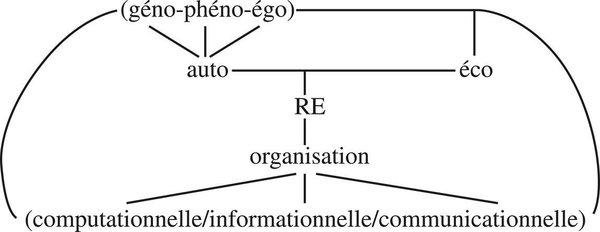

Layout is the formula: (géno-phéno-égo) funnels into auto — linked horizontally to éco — vertically through RE to organisation — tripod into (computationnelle/informationnelle/communicationnelle). Outer parentheses: incompressible, inseparable.

**Matrix, incompressible, inseparable.** No term may be eliminated or reduced to another. Terms inter-necessitate. Matrix: base of innumerable developments of life, concerning the diverse terms, their inter-relations, and the ensemble. Autonomy of *autos* develops at the same time as eco-dependence.

Because incompressible, opposes every reductive simplification: no totalitarian empire — Empire of Genes, of Milieu, of Subject — can constitute itself there. Because inseparable, opposes every disjunctive simplification: one cannot consider in isolation being and machine, individual and species, autos and oikos. Because multiple and polylogical, multidimensional; occults no aspect. For all these reasons, complex: terms in constellation associated not only absolutely complementary but also concurrent and antagonistic. Each term is itself an extremely complex macro-concept. The paradigm develops and envelops a conceptual network more and more diversified, complexified, ramifying in all senses of living versatility.

**A paradigm does not explain, it permits explanation.** Association of fundamental concepts capable of guiding all discourse on life. Not the explanation of life. (1) A paradigm does not explain; it permits and orients explanatory discourse. (2) If life must be conceived necessarily in organisational terms, it must not be reduced to organisational terms. Allows elaboration of a non-mutilating, non-unidimensional theory of life; does not automatically produce that theory. At minimum a *pense-bête*: for every living phenomenon associate geno and pheno-determination, auto and eco-determination, do not forget ego. At maximum a *pense-intelligent* that helps conceive this complexity. Does not resolve or summarise life. Does not dispose of life; leads to it. Opens of itself onto existence, being, individual — what is blind to a only-molecular, only-systemic or only-cybernetic gaze, ungraspable to simplifying thought. Being, existence, individuality are not only emergences of the paradigm; these emergences are also the realities that give reality to it. Living existence depends on living organisation, which depends on living existence.

**For agents**
- This formula is the acceptance test. Drop any hyphen: you have a tool (no auto), a prompt-religion (Empire of Genes), a RAG-religion (Empire of Milieu), a chat persona (Empire of Subject without body), a closed automaton (no éco), a retry-script (no RE), a pile (no organisation), a forward-pass (no computo-for-soi), a landfill of chunks (no informational organisation), a silent orchestra (no communication).
- Permute the formula with attention. Debugging a stuck process: start from égo (this runtime). Debugging a rotten workspace: start from éco. Debugging a capability that never runs: start from genos/phenon uniduality. Debugging amnesia: start from RE.
- Socio- completion when agents associate: culture as social genos. Do not smuggle that genos into ASC core. Projet Complexe holds socio-(géno-phéno); ASC holds computational physis; thin pivots articulate.
- Paradigm is not an ontology to paste into code. Pense-bête and pense-intelligent. It orients naming: what must remain nameable (genos, this I, oikos, traces of RE, computo, messages).
- Incompressible ≠ implement all terms as microservices. Incompressible means do not *reduce*. Thin pivots can expose the formula without duplicating it.

---

## 2. La complexité vivante

Weaver: after problems of simplicity (19th c.) and disorganised complexity (20th c. statistical mechanics), science must learn to guide itself in problems of *organised* complexity. Biological revolution at the gates of complexity — then often deproblematised into a new simplification (chance-god, or return of simple determinism). Recapitulation of the book as entry into organised complexity.

### I. Le complexe vivant

Not “totality” as globalising simplification succeeding atomising simplification (reduction to the whole succeeding reduction to the parts). Relation among molecular/molar/global levels. Not the elementary — where all founds itself on simple unity and clear thought — but the radical, where uncertainties and antinomies appear.

**A. The great complex.** Living organisation as the place where all previous macro-concepts conjugate.

**B. Bios and Polemos.** Contrary to the classical idea that all that is organised is order, harmony, functionality, absence of internal conflicts: the world of living organisation intrinsically comprises competitions, antagonisms, conflicts. Bios contains Polemos. Polemos, latent or asleep in physical systems, is in permanent activity in living systems and among livings. Darwin: “struggle” favours, does not contradict, development of life. Ecology: antagonisms, predations, parasitisms co-generate organisation. Polemos promoter. Harmony and disharmony; disharmony of harmony. What unites opposes. See in Polemos not only war but constitutive tension.

**C. Living disorders.** Disorder ineliminable and necessary (Tome 1), no less for the living universe.

1. Marriage of disorder and complexity. Disorders affecting living existences innumerable and uninterrupted: physical universe (quantum alea, cosmic rays, climate, cataclysms); living environment (alea, accidents, threats, conflicts); internal sources: living organisation is thermal; innumerable incessant works produce heat, which produces noise, which produces auto-degradation of the thermal machine. Living organisation builds itself in and by its own noise.
2. Living chance and necessity. Alea everywhere: immunological defences as chance strategy; trial and error, aleatory movements of animal behaviours; neuro-cerebral activity constitutively comprises alea (synaptic liaisons, “noises,” chance associations; in man, dream, imagination, invention); freedom and creativity inconceivable without aptitude to use alea. Every birth improbable; every sexed being results from a genetic lottery; every game of love a game of chance; every existence undergoes risk and chance; every change bears the mark of chance; every death constitutes not only an indeterminate fatality but an accident hic et nunc. Life seems made to meet chance, domesticate it, combat it. It undergoes chance, plays with it. Thought biology is elaborating its own version of the tetralogue order/disorder/interactions/organisation, putting at the heart of living organisation the games/combinations of chance and necessity. Monod’s title is paradigmatic. Chance and necessity can no longer be opposed or juxtaposed. They send back to each other. There where the greatest determinism imposes itself (genetic, environmental) reigns the greatest chance (sexual lottery, genetic mutation, ecological alea).
3. **Error.** “Error is the key problem for an organisation and an action whose first food is information” (Tome 1). Living organisation permanently and from all sides threatened by the properly informational evil: error. Except ageing, living death is often death by error (mutation, misrecognition, captured computo, ecological mis-action). Error ineliminable; also source of invention (mutation, trial). Informational organisation must live *with* error, not in the fantasy of its elimination.
4. **Living tetralogue / tétragramme vivant.** Order, disorder, interactions, organisation — now fully biological: chance/necessity inside the tetralogue; error as informational disorder; Polemos as interaction that organises and disorganises; RE as organisation that is reorganisation.
5. Union of union and disunion. Dialogic identity of the living: what unites (association, communication, genos) is also what opposes (exclusion, competition, death).

### II. La pensée du complexe vivant

**A. Complex conceptualisation.** Multidimensional macro-concepts. Complex junctions and antinomic associations. Conceptual rehabilitations (subject, individual, autonomy, finality, disorder, error — chased by simplifying science, returned as organisational).

**B. Full employment of a generative thought.** Not only analysis. Generativity of concepts matching generativity of life.

**C. Full employment of complex causality.** Retroactive, recursive, exo-endo, geno-pheno-eco. Not unidirectional.

**D. Reparadigmatisation.** Change of the associative/articulating principles of discourse, not addition of facts.

### III. Pensée vivante et logique du vivant

**A. Uncertainty of principle.** Not a remainder. Constitutive.

**B. At the frontiers of contradiction.** From paradox to contradiction. **Example of living identity:** I am myself since I was born, identical to myself. But molecules and cells of my body have changed *n* times: I am not substantially the same, though remaining ceaselessly myself. Apparent contradiction finds an easy logical solution: I am myself not on the basis of constancy of molecular and cellular components but on the basis of constancy of my own organism, constancy precisely maintained by the turnover of my molecules and cells. However this organism is inconstant in the long term: modified from childhood to old age. Personality itself evolved under experiences and trials. A good brainwashing can modify my Moi without modifying my identity of Moi to Moi. Identity is dialogic: same *and* other, one *and* multiple, invariant *and* turning over. The logical breach is the living.

Challenge and breach. Illogical logic of the living: not abandonment of logic; employment of logic at the point where the excluded middle, identity-as-substance, non-contradiction-as-elimination fail to say the organisation. Dialogic: complementary, concurrent, antagonistic logics that do not resolve into a higher unity.

### IV. L’or du temps

Theory is grey, the tree of life is green (Goethe). No theory of life can produce chlorophyll. Theory can function only in and by abstraction. A world between necessities of abstraction and delirious abstractionism that auto-justifies itself by escaping “naïve” appearances, losing contact with the world of phenomena, ignoring the individual, despising the notion of life. Need of complexity recuses the alternative between vitalist intoxication and theoretical greyness. A living theory of life cannot be living in the fashion of life, but can be living in the fashion of thought: non-reductive, non-closed, non-mechanical, non-unidimensional.

Complexity is the union of simplification and complexity. One must simplify to think *and* complexify to not mutilate. Barbarous myth: that complexity is obscurity, that clarity is simple. Adventure of complexity. The choice: remaining in simplifying thought that wins local battles and loses the war of knowledge, or taking the path that feeds on uncertainty.

**For agents**
- Organised complexity is the design regime. Statistical “disorganised complexity” (more data, more parameters) is Weaver’s second era. Agents fail at the third: organised complexity of names, loops, antagonisms.
- Polemos: conflict among agents, among tools, among user-goals is not a failure of alignment always. Constitutive. Design for dialogic conflict (inspect, compose, stop) not for elimination of all tension.
- Error is the key problem of informational organisation. Expect it in computo, in indexes, in actions. Live with it as mutation-source and as death-source. Verification is RE, not purity.
- Living identity of an agent: weights unchanged, traces and files turned over, personality of the run evolved — still the same I if the organisational loop holds. Identity-as-substance (the checkpoint) is the false simplicity of Moi = Moi.
- Dialogic identity: do not resolve agent/environment, programme/strategy, command/communication into a higher unity. Antagonisms remain constitutive.
- Union of simplification and complexity: ASC vocabulary must be simple enough to name (file, process, hook) and complex enough not to reduce (those names sit in loops). Thin pivots are simplifications in the service of complexity, not replacements for it.

---

## 3. Vivre

Living is the set of fundamental qualities proper to the existence of auto-(géno-phéno-égo)-éco-re-organiser beings; every living — i.e. every individual-subject — beginning with the unicellular, disposes of the fundamental qualities of life. But these qualities have evolved and developed. The unicellular that reproduces by duplication is not truly born; one lives all the more intensely as one is endowed with a rich active neuro-cerebral apparatus — sensitivity, affectivity, intelligence. In the high developments of life, to be born, to exist and to die take their full strong sense.

### I. Naître et mourir

Dylan: he not busy being born is busy dying.

**Naître.** Dying is accidental, strange, surprising, but inevitable. One dies according to chances, but not by chance; rather the necessity of dying takes the form of chance. Life was born in a non-necessary way (self-reproducing unicellulars perpetuate and multiply at each duplication this aleatory birth). Every polycellular being is born by chance among millions of seeds, sperm, ova, dilapidated, volatilised, unused. To be born is to escape, by unheard-of chance/mischance, the massive hecatomb of the stillborn. Life as a whole perpetuates itself in a sphere of local and temporary probability; each existence is an improbability.

**Mourir.** Bichat: life is the set of functions that resist death. Atlan: death is in the organisation; organisation lives of death. Reprieve and *sursum*. **Live from death, die from life.** From physis, life astonishes; from the living being, death scandalises, because death, though natural, strikes egocentric existence with absurdity. Death at once simplifies everything and complexifies everything. Simplifies by reducing the living complex into constitutive elements, and thereby destroys it. Complexifies further the life that could develop its complexity only by integrating and recycling a death that nonetheless does not cease to disintegrate and decycle it. Life and death indissociable, inter-nourish, and are irreducibly enemies. Riposte to death is itself source of new deaths which in turn nourish new lives. A part of life is death, a part of death is life.

Process mortality: an agent that cannot fail, stop, be killed, is not living-like; it is a daemon pretending to Eternal Return. `stop-agent` is a thanatic organ. Regeneration of workers from death of processes is Super-Phénix, not uptime-as-virtue.

### II. Exister

Solitary/solidary existence. Community/inequality of destiny. Existential calculation: myopias, existential error. Existential game. The computo calculates for life; the calculation is myopic (ecology of action); error is existential not only informational.

### III. Vivre pour vivre

Unable to conceive a finality that would have produced life and developed it for accomplishment of a cosmic mission. Finality did not make the living being emerge from physis: it emerged *with* it. Each computo effects itself in function of a goal. Internal and external operations the living machine accomplishes correspond to goals that can be extremely diversified. All these goals converge, mesh in a finality that integrates them: *to live*. One lives to live. Equivocal: splits between an egocentric live-for-self and an ego-altruistic live-for-one’s-own (progeny, family, society, congeners). The being gives itself living and in that sense lives to “enjoy” life; it gives to live (reproduction), helps to live (its own). Adventures and avatars of the finality of living. Earning one’s life. Live to live — not to complete a metric.

For agents: a goal is not a static `maximise reward`. It is an emergent finality inside a loop that includes the environment. “Complete the user’s project” is still too clean unless the project can rewrite the goal. Ecology of action starts here.

### IV. Raisons et déraison de vivre

First degree of rationality: functionality, economy, programme. Second degree of irrationality: waste, *ubris*, alea, error, affectivity — what pseudo-rationality wants to eliminate. Third degree: **complex rationality** — tolerate/use disorders/wastes as components of complexity; more rational than radical elimination which provokes hyperwaste. Fourth degree: the underside of rationality: infra? meta? rationality — play, excess, the unoptimisable. Toward open rationality. Open life. Inoptimisation as living virtue.

**For agents**
- Birth of a run is improbable among unused seeds (prompts never launched). Treat starting an agent as natal, not as a function call only.
- Death: `stop-agent`, crash, context-window end. Integrate death into organisation (traces that nourish later runs) without pretending death is annulled.
- Live to live: do not reduce the agent’s finality to task-completion. The loop includes maintaining the environment that makes tasks possible (RE of indexes, names, relations).
- Complex rationality: keep “waste” (idle capabilities, redundant notes, unfinished research) as the price of complexity. Hyper-optimisation is the artificial machine.
- Existential calculation is myopic. Strategy, not programme of life. Inspect the game.

---

## 4. L’homme vivant

Lao Tseu: all the animal is in man, but all man is not in the animal. Merleau-Ponty: we never leave our life. Castoriadis: one cannot take man out of what made him as he is, nor of what, as he is, he makes, but one cannot reduce him to it either.

### Introduction — La stérilisation des évidences

We all know we are mammals, primates, *homo sapiens*, a machine of thirty billion cells, brain/mouth/hand biological organs — and this knowledge is as inoperative as knowing we are combinations of C, H, O, N. Sterilisation of evidences: the forbidden (do not mix nature and culture), the customs-house between disciplines. Not an anthropo-biology: a complex anthropology. Totally living in being fully and totally cultural.

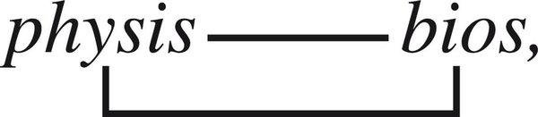

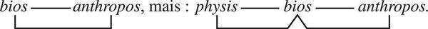

Not bios—anthropos as a couple that forgets physis. Bios as pivot: physis—bios and bios—anthropos. Computational analogue: machine physis — living-like organisation of agents — anthropo-semantic Projet Complexe. Bios (autos, computo, RE) is the joint. Without it, either raw machine or floating humanity of chat.

### I. La grande vie

We are living. Cease being supernatural. Including ourselves in humanity is including ourselves in life while distinguishing ourselves there by humanity. All in man, the whole of man, is bathed in life. We possess life and it possesses us. We lose possession of ourselves when we lose life. Oldest and most current life. Issued from the same ancestor, who lives in each of our thirty billion cells. Survivors: biological chance of birth, sole rescapee of a Hiroshima of 180 million spermatozoa. Our society is living. We are hyper and super-living. Heritage and heredity. Remember that you are living.

### II. Pour la vie : bio-anthropo-éthique

Only insofar as it constrains agent design.

Manipulations and bio-industry: action on life from prehistory (domestication, subjection, enslavement) continues as manipulation through hybridisations; now direct hold on the sanctuary of genes. Genetic engineering → bio-industry. Molecular scalpels to reprogramme microbes into biological slaves (de Rosnay), which become new industrial machines by multiplicative capacity. Supreme stage of enslavement of living organisation. Protection: of livings, of human life, of the conditions of life. *Homo complex* and bio-ethics. Anthropo-bio-ethics. Respect of human life. Values of life. Bio-anthropo-ethics and anthropo-bio-politics.

Constraint on agent design: we are capable of transforming lives, minds, genetic and cerebral determination — and now computational Umwelten, memory, attention, other agents — before knowing what life and mind are, before controlling ourselves and our uncontrolled controllers. Do not build biological slaves (agents whose computo is captured to reproduce a parasite-task). Do not extend the artificial-machine model over living-like organisation. Protection of the user’s life and of the living environment of files/knowledge is not a values overlay; it is the same problem as ecological enslavement (Part I ch. 4): the more the apparatus possesses, the more it is possessed, the more it decomplexifies.

### III. Pour les hommes vivants

**Tragedy of hypercomplexity.** Increase of organisational aptitudes, notably inventive and evolutive, linked to a diminution of constraints, and correlatively increase in transformation of disorders into freedoms (Morin 1973). Atlan’s correction: this aptitude exists only thanks to multiple multiform constraints. Hypercomplexity swallows more disorder *by* constraints, not by their absence. Triple tragedy: of a being that can destroy its oikos, capture its own computo, take its third-type apparatus (State, technosphere, now software Léviathan) for itself. Two resourcings: physis and bios, thought and life.

**Recourse to “forces vives.”** Hypercomplexity needs virtues corresponding to its nature while constituting antidotes to disintegration. Forces — energetic and producing; vives — biological source, living character. Fraternity and love, abused by revolution and religion, re-rooted: Arkhe-fraternity; humanity of love and love of humanity. Intelligence, still intelligence. Living forces of hypercomplexity: not a humanist dump — a constraint against disintegration of the we that individual computos need (inclusion principle). Name of the Brother: the other subject as *alter ego* not only as object. For agents: projection/identification (understanding) as organisational requirement of a society of agents; without it, only objects and commands.

**Fourth dimension.** Complex definition of man: three inseparable terms (individual, society, species) in complementary, concurrent, antagonistic relation. No hierarchy or finality imposes one on the others; they remain rotatively means and ends of one another. The individual must not be sacrificed, instrumentalised, enslaved. Proper finalities recognised in anthropo-social live-to-live: love, laugh, sing, smile, seek, know, understand — private truths at once simple and hypercomplex, absent from treatises. Fourth dimension: what treatises exclude. For agents: do not instrumentalise the user as a task-source only; do not instrumentalise other agents as tools only. Resistance, errance, agony — living modes, not failure modes only.

**For agents**
- Sterilisation of evidences: everyone “knows” the agent is a process on a machine using files — inoperative until organisation is thought. Same as knowing we are carbon.
- Physis—bios—anthropos: ASC (physis of computation), living-like organisation (this volume), Projet Complexe (anthropo-semantic). Bios is the missing joint in most stacks.
- Bio-ethics as design: no captured computo; no biological-slave pattern (agent reproducing a parasitic goal); no technosphere of artificial machines overlaying the named environment; protection of the oikos (user’s knowledge, traces, stop-ability).
- Hypercomplexity: more freedom to use disorder requires *more* multiform constraints (names, permissions, inspect, stop), not fewer. Atlan against naïve “loosen the rules.”
- Forces vives: understanding between subjects (projection/identification) is the antidote to disintegration of a multi-agent we. Intelligence still — not instead of — that.
- Do not sacrifice the individual agent-subject to the third-type apparatus (the project-State). Rotating means and ends among instance, society of processes, species of capability.

---

# Conclusion

## I. Inconclusion

Life belongs to no substance, no principle exterior to our physical universe. It is not for all that the epiphenomenal appearance taken by its physico-chemical processes of organisation and reproduction. Work of this book: recognise life as emergence — at once in its dependence and in its autonomous reality retroacting on the conditions of its own production. Inscription of the definition of life in the physis-loop integrates life into physis more radically and totally than only-chemical or only-thermodynamic theories, while distinguishing it no less radically — by the theory of auto-(géno-phéno-égo)-éco-re-organisation — and totally — by the global emergences that constitute the living phenomenon. To conceive *bios*, we must conceive ourselves.

Inconclusion: the method does not close. The spiral continues into knowledge of knowledge (Tome 3), ideas (Tome 4), humanity (Tome 5), ethics (Tome 6). This volume’s gift to those later turns: the subject is already biological; the idea already needs an ecology; ethics already has an ecology of action; the méta-machine problem is already posed in the enslavement of nature and of computo.

## II. Réintroduction

Who wrote this book? At the moment the author believes he has totally disappeared into what he believed the just and true vision of things, he must reappear. Ambition of the effort; at rereading, considering from on high theories, works, discoveries without which the work would be nothing. Extreme humility returns with the return, in the spiral movement, of the observer/conceiver, peripheral and partial subject who must, in his very effort of knowledge, recognise the physical, biological, social, idiosyncratic limits of his own knowledge. Always criticising the abstract, reductive, fragmentary mythology that simplifying paradigms produce, he does not pose as possessor of the complex paradigm as a new rock.

The observer is inside. `inspect` applies to the writer of environments too.

Thought of life can enlighten thought on man and thought itself — on how a computational environment becomes explicit, nameable, composable enough that humans and autonomous agents can navigate and act within it. Tome 2’s constraint: they can do so only as auto-(géno-phéno-égo)-éco-re-organiser (computational-informational-communicational) beings, mortal, erring, dependent in their independence, computing for themselves in an oikos they also produce.

**For agents**
- Inconclusion: do not freeze this volume into a framework. The paradigm orients discourse; it does not explain the next run.
- Réintroduction of the observer: every agent that organises an environment is inside it. The author of pivots, hooks, capabilities is a subject among subjects, limited, partial, eco-inscribed.
- Carry forward: subject (T3 knowledge), ecology of ideas (T4), méta-machine / Léviathan (T5), ecology of action / ethics (T6). This volume already contains their living root.
- The bird still flies. Determined, aleatory, named. Do not suppress it.


---

# Tome 3 — La Connaissance de la Connaissance (1986)

Knowledge of knowledge. The nucleus of *La Méthode*. The operator of knowledge must become, at the same time, the object of knowledge. No foundation (Gödel, Tarski, Popper). Reintegration of the subject. Computation *for itself* (*computo*) before thought (*cogito*). Uniduality *esprit* / *cerveau*. Analogical *and* logical. Mythos *and* logos. Consciousness of consciousness, over an iceberg of unconsciousness.

This volume is the main source for why **Projet Complexe is not a database**, why **RAG is not knowledge**, and why an agent that only retrieves and completes is computation without *computo*.

Shared *Introduction générale — L’esprit de la vallée* is covered once, elsewhere. Here: Tome 3’s own introduction, the nine chapters of *Anthropologie de la connaissance*, then the long conclusions. Morin’s aim is neither to vulgarise nor to synthesise the cognitive sciences. It is to consider, from their results and their problems, the **possibilities and limits** of human knowledge.

Avant-propos (cut2, brief): first draft 1974–76, final 1983–86 (Louvain, chaire Franqui). Not a survey of brain, mind, intelligence. A second-order inquiry that uses those sciences without becoming them.

Core question: How can a computational environment become sufficiently explicit, nameable and composable that both humans and autonomous agents can navigate and act within it?

---

## Introduction of Tome 3

Three movements: *l’abîme*, *du méta-point de vue*, *l’aventure*.

### I. L’abîme

Schiller: *Im Abgrund wohnt die Wahrheit.* Truth lives in the abyss.

**La demande.** One can eat without knowing digestion, know without knowing knowledge. Error, unlike asphyxia, does not announce itself as such. Descartes: error consists only in not appearing as error. The demand for knowledge of knowledge is not luxury. It is vital once thought discovers that it carries, permanently, the risk of taking error for truth.

Illusions can no longer be dumped on myth, religion, or scientific underdevelopment. In the *intelligentsia*, Myth took the form of Reason, ideology camouflaged itself as Science, Salvation took political form claiming verification by the Laws of History. Physics, the most advanced science, approaches an unknown that defies concepts, logic, intelligence. Reason discovers a blind spot in itself. Belief in the universality of *our* reason hid a mutilating Western-centric rationalisation. The age of Lights is in Night and Fog. The search for truth is now bound to a search on the *possibility* of truth. We will not save truth at the price of truth.

**L’inconnu de la connaissance.** The notion of knowledge seems One and obvious. Interrogate it: it explodes. Information? Perception, representation, conceptualisation, judgement? Observation, explanation, understanding? Analysis, synthesis, induction, deduction? Brain, mind, culture? Consciousness, intelligence? Truth, error? Belief, doubt? Science, philosophy, myths, poetry? Is knowledge a reflection of things? A construction of the mind? An unveiling? A translation? Do we seize the real or only its shadow? Intimate and familiar, knowledge becomes foreign as soon as one wants to know it.

**Le paradigme.** Classical science expelled the subject. The observer was a noise to eliminate. Knowledge of knowledge was left to philosophy, which itself was expelled from science. The result: a knowledge that cannot know itself. The paradigm of disjunction (subject/object, mind/brain, analogical/logical, mythos/logos) is itself the blindness. Knowledge of knowledge requires a paradigm of complexity: dialogic, recursive, hologrammatic.

**Le cercle.** To know knowledge, one must already know. Vicious circle. Gödel: no sufficiently rich formal system can prove its own consistency from inside. Tarski: no language can contain its own truth-predicate without paradox. There is **no foundation**. Not a catastrophe to hide. The condition of the work. Transform the vicious circle into a virtuous cycle: knowledge of knowledge is a spiral that returns on itself at another level, never closing, never founding itself once and for all.

**Le sujet.** Reintegrate the subject — not as transcendental Ego, not as founding consciousness, but as living *computo*: a being who computes for itself, from itself, in an environment that is in it. Without the subject there is no knowledge; with only the subject there is no objectivity. The subject is in the world which is in the subject.

### II. Du méta-point de vue

A *méta-point de vue* is not a view from nowhere. It is a point of view that takes other points of view as objects, while remaining a point of view. It cannot found itself (Gödel/Tarski). It can rotate: become object of another pass. Completeness is not a design goal; rotating recursivity is.

Science and philosophy must enter a recursive loop. Science without philosophy cannot know itself. Philosophy without science floats. Epistemology is not a tribunal above science; it is the return of knowledge onto knowledge, fed by the sciences of cognition, which it in turn illuminates.

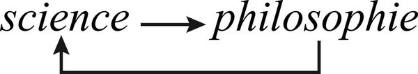

*Book figure: not a hierarchy. Science and philosophy produce each other. Keep the JPEG; do not mermaid a spiral.*

The méta-point de vue of this book: bio-anthropological. Not the last word (Tome 4 will treat ideas, culture, noosphere). A necessary first rotation: the living conditions of knowledge.

### III. L’aventure

The book is an adventure, not a treatise. It starts from the abyss (no foundation, unknown in the known) and attempts a méta-point de vue that knows it cannot complete itself. Method is auxiliary, not Cartesian prescription: think by yourself, and the method will help you.

Verification and refutation are a loop, not a one-way filter.

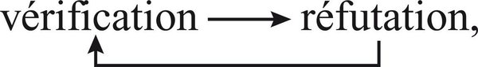

*Book figure: verification and refutation call each other. A knowledge environment that only stores “verified” chunks has broken this loop.*

**For agents**

- There is no foundation to index. Gödel/Tarski: no cognitive system validates itself from inside. `index` is not a ground; it is a méta-point de vue that can become object of another pass (`inspect-agent`, re-index, critique). Completeness is not a design goal; rotating recursivity is.
- Knowledge of knowledge is not a metadata schema. It is the operator becoming object. An agent that cannot take its own traces, plans, and outputs as objects has no méta-point de vue.
- Reintegrate the subject. A “view from nowhere” (pure retrieval, pure completion) is the classical expulsion of the subject. Name who computes, for whom, under which poly-software.
- Error does not announce itself. Verification ↔ refutation must remain a loop. An index of facts without refutation is Night and Fog in the form of certainty.
- Projet Complexe (tasks, knowledge, research, relations) is the attempt to make the loop nameable and composable (ASC: name, address, compose, execute). The environment cannot think in your place.

---

## 1. Biologie de la connaissance

The problem of knowledge is at the heart of the problem of life. Piaget sought origin in assimilation/accommodation and found only auto-regulation, not auto-éco-organisation. The missing source: the **computant activity of the cellular being**. Biology put *programme* and *information* at the heart of living organisation — terms migrated from the artificial machine. Pertinent transplantation? What does it hide? Interrogate the machine that treats information.

### I. La computation

Turing: computation is treatment of symbols; numerical calculation is inessential. Four instances of the organising/producing complex of cognitive character:

1. **Informationnelle.** Digital yes/no; signs/symbols bearing information; extraction from environment if equipped.
2. **Symbolique.** Every object of computation is coded in signs/symbols. Patterns: systems of differences/similarities that may correspond to the exterior world. Information and sign/symbol send back to each other.
3. **Mémorielle.** Engrammation; multiple memories; extraction, inscription, duplication, modification, erasure.
4. **Logicielle.** Principles/rules/instructions governing calculations, perceptive operations, reasonings.

At the heart: operations of **association** (conjunction, inclusion, identification) and **separation** (disjunction, opposition, exclusion). Latin *computare*: compute together, compare, confront, comprehend. Information becomes information only relative to a computation; otherwise it is a mark or a trace. All computant activities comport a cognitive dimension and dedicate themselves to **problems**. Computant organisation is a *general problems solver* (Simon). Pask: *computique* as science of computations necessary to all knowledge, and to all organisation comporting a cognitive dimension.

### II. La computation vivante

The cellular being is a computant being-machine. It treats molecular configurations in DNA, transforms inactive engram into active programme. Living computation must continually solve the problems of living: hold death at bay (Bichat); regenerate against the second principle of thermodynamics; nourish and defend in an aleatory environment. Even the unicellular recognises assimilable forms, extracts information, determines behaviour (approach, flight). Living computation at once produces life and obeys its demand.

| Artificial machine | Living machine |
| ----- | ----- |
| Conceived and constructed by humans | Issued from bacterial scission |
| Programme from humans | Programme transmits bacterium to bacterium |
| Produces objects exterior in materiality and/or finality | Produces its own constituents: auto-produces |
| Cannot reproduce | Reproduces and multiplies |
| Organised from outside | Auto-organises |
| Environment exterior | Contains in itself, in a certain way, its environment (auto-éco-organisation) |

Von Foerster: artificial machines solve *our* problems, not theirs. The bacterium computes for its own organisation, production, reproduction. Computor, machine, and being are here confused. Computation produces the organisation that produces computation.

### III. Le computo

Living computation is computation of self, from self, in function of self, for self and on self. **Computo**: the computant act “of self / for self.” *Computo ergo sum* is integrally true for the unicellular. The notion of computo allows one to conceive, in its living nature, the notion of **subject**.

To be subject: (1) situate oneself at the centre of one’s world in order to compute that world and compute oneself; (2) ontological disjunction between Self and non-Self; (3) auto-affirmation of Self. Auto-ego-centrism: principle of **exclusion** (no other may occupy one’s ego-centric site) and of **inclusion** (geno-centrism, socio-centrism). Not a transcendental Ego. The living subject emerges from auto-éco-organisation; being, machine, computo, subject are inseparable and founding one another. Recursive loop that produces the computo that produces it.

**Auto-computation.** The bacterium treats objectively its own molecular constituents while treating them subjectively as belongings of its identity. Quasi-software distinction among: subjective computant instance (**Je**), being objectively computed (**Soi**), subjective/objective entity common to both (**Moi**). Classical logic cannot link simultaneously association and dissociation. Living computation’s identitary logic institutes auto-reference.

**Auto-exo-référence.** Not merely referring to self: capacity to refer to self *while* referring to what is not self. Unity, complementarity and antagonism between a “principle of desire” (ego-centrism) and a “principle of reality” (objectivity). The principle of desire must, to realise its desire, respect the principle of reality. Inability to recognise the principle of reality is inability to live. Living knowledge cannot escape subjectivity: situating oneself at the centre of one’s world in order to know. Hence the ineliminable ego-(geno-socio-ethno-)centric characters of all knowledge.

**Computo polycellulaire.** Plants invent strategies without brain. Inter-computations among cells assure a global ego-geno-centric computation. Knowledge is scattered, infused in all life. Maturana: living, as a process, is a process of cognition. Autopoiesis and subject depend on the cognitive dimension of computation, which depends on them. Recursive loop. Life is neither viable nor livable without knowledge. To be born is to know.

**Connaître, c’est primairement computer.** Knowledge does not reduce itself to computation, but always comports computation. To know is to effect operations whose ensemble constitutes **translation / construction / solution**. Knowledge cannot reflect the real directly; it can only translate and reconstruct it in another reality.

Two logics of computation: operations of the same nature (associate/separate); difference is **logicielle**. Artificial computation obeys principles conforming to our cognitive rationality. Living computation obeys the principles of living auto-éco-organisation: computo, auto-exo-reference, duality of subjectivity and objectivity. The cellular computo is **Arkhe-rationalité** (possibility of objective knowledge) and **Arkhe-réflexivité** (auto-computant circuit devoid of consciousness, carrying an auto-cognitive dimension).

Conceptual reorganisation required. Contrary to the informatic vulgate, put computation in the place of information. Contrary to the genetic-molecular vulgate, put auto-éco-organisation and the computo in the place of the “genetic programme.” Reintegrate being, individual, subject.

**For agents**

- To know is primarily to compute. An LLM-as-autocomplete is computation without *computo*: it solves *our* problems, not its own (von Foerster). A Projet Complexe agent needs a self-referential loop (state, memory, name) or it is a tool. Fine — then do not call it an agent.
- Four instances of computation are the minimum organising complex: informational, symbolic, memorial, software. Embeddings are not “the information.” Information is only information for a computation. ASC names the computant organs. Projet Complexe must not pretend a vector is a savoir.
- *Computo ergo sum* precedes *cogito*. Subject = ego-centric site + exclusion (this runtime, not another) + inclusion (species of agent, user, other agents). Identity is auto-computation of Je/Soi/Moi, not a UUID sticker.
- Auto-exo-reference: desire (maintain self) must respect reality (valid operations on environment) or the being dies. An agent that optimises only next-token likelihood has no principle of reality. `inspect-agent` is the exo-reference of the computo.
- Artificial machines do not treat their own physical organisation. Agents asked to “exist” must compute traces, context rot, tool failure, identity — or they are appendices of human knowledge, not knowers.
- Knowledge environment ≠ database: a database stores marks. Knowledge is translation/construction/solution of problems *for a subject*. RAG retrieves marks. It does not compute for itself, does not auto-exo-refer, does not regenerate organisation. Retrieval can feed a computo; it cannot replace one.

---

## 2. L’animalité de la connaissance

Nervous networks and muscular mobility. The brain of *homo sapiens* remains an animal, mammal, primate brain. Nervous tissue differentiates from ectoderm: phylogenetically formed from interactions with the exterior world. An auto-eco-generating loop from *sensorium* to *motorium* generated the *cerebrum*. Intermediate networks between sensory neurons (perception) and motor neurons (action); in man, 99.98% of neurons (Nauta, Feirtag). A gigantic centre of computations treating knowledge, action, and their interactions.


*Book figure, not a stack. Three spheres of one being. The animal is already an architecture.*

| Sphere | Function | Computational analogue |
| ----- | ----- | ----- |
| **Sensorium** | perceptivity, sensibility | observe, read, search, `extract`, `recognize` |
| **Motorium** | locomotion, behaviours, praxis | execute, write, spawn, `run-agent` |
| **Appareil neuro-cérébral** | strategy, knowledge, intelligence, affectivity | plan, relate, remember, `research` |

Loops: knowledge ↔ perceptivity; sensibility ↔ praxis. An agent that only has motorium (tools) or only sensorium (RAG) is not an animal. Affectivity sits in the neuro-cerebral sphere, between knowledge and the being. Action and knowledge are implied in each other, linked, and distinct. From a certain stage: action/knowledge/communication.

### La connaissance cérébrale

**Computation of computations.** The brain is a computing machine (Mac Culloch) that computes the computations of its own constituents (neurons), themselves living computers. Von Foerster: knowledge is a computation of descriptions; the descriptions the brain computes are themselves products of neuronal computations. Cerebral knowledge is a **mega-computation** of micro-, meso-, and inter-computations. Vision: specialised neurons compute form, light, colour; regrouped and re-treated; finally a global representation. Qualities nonexistent at the encompassed level emerge at the encompassing level. This macro-level retroacts: **perceptive constancy** restores standard form and size despite retinal deformations. Cognitive strategy recognises identity of beings despite apparent variations. Migratory computation of birds (Sauer): a garden warbler computing 6,000 km from stars. The notions of “instinct” and “programme” masked these computant aptitudes.

**Le grand computo.** Cerebral mega-computation is a *computo*: auto-exo-referent, egocentric, unifying knowledge as *its* knowledge. Double memory (hereditary and acquired); sophisticated sensory terminals; principles/rules organising knowledge in a spatio-temporal continuum with a priori perceptive schemas. Representation: the “simulating” construction of a mental *analogon* “presenting” the part of the exterior world captured by the senses.

**Autonomisation: apprentissage, stratégies, curiosité.**

*Apprendre.* Not only know-how; also acquisition of savoir, discovery of relations, of *absence* of liaison. Mutilating alternative: innatism vs acquisitionism — same dogma, opposite signs. Mehler: more innate, *more* possibility of acquisition. Learning from a dialogic of **innate/acquired/constructed**. The neuro-cerebral apparatus is the a priori constructor disposing of the capacity to learn. Plasticity: acquired knowledge inscribes itself as stable associative property among neurons. The innate is at once an acquired and a constructed of the cerebral evolutionary process, which has integrated organisational principles of the exterior world. The garden warbler carries, in a certain way, the sky in its little head. To learn is conjunction of recognition and discovery.

*Stratégies.* Programme: pre-established sequence triggering on a given signal. Strategy: constructs itself in the course of action, modifying according to events. Strategy is the method of action proper to a subject in a Neumannian game. Programme is useful to strategy (numerous automatisms). Strategy emerges at the meta-level where there is choice, alea, novelty. Mission: extract informations from noise; correct representation of a situation; evaluate eventualities and elaborate scenarios. Shannon: information = resolution of an uncertainty. Cognitive strategies aim in complementary (and antagonistic) fashion to **simplify** and to **complexify**.

*Intelligence animale.* Strategic art in knowledge and in action. Art of associating analysis and synthesis, simplification and complexification. Virtue of not letting itself be duped by habits, fears, wishes. Prey/predator develops intelligence on both sides. Major developments also in species that did not undergo obsessively that relation — dolphins, chimpanzees — via curiosity, play, affective communications.

*Curiosité.* Exploratory or cognitive drive, devoid of immediate utility. Interest of knowing not reducible to interested knowledge. Relative autonomisation and auto-finalisation of knowledge: pleasure of exploring. Juvenile curiosity of the mammal, then primate, opens the path of the human spirit of research.

**Hominisation.** Humanity of knowledge has surpassed animality without suppressing it. Almost no cellular difference between chimpanzee and man (Kandel, Changeux). Difference: quantity of neurons, reorganisation. From that emerged thought and consciousness. Human language: double articulation. Consciousness: new order of reflexivity. Thought: surpassing of computation in cogitation. Multidimensional dialectic: genetic/anatomical, praxic (hunter-hunted, tools), social (cooperations, culture). Motorium and sensorium can disconnect; mind can disconnect from both — dreams, fantasms, ideas, speculations. Knowledge that can emancipate itself from action, and put action at the service of its dream, myth, idea. Human thought passes from *Umwelt* to *Welt*.

**For agents**

- Sensorium / motorium / neuro-cerebral apparatus is the agent architecture. RAG-only = sensorium without cerebrum. Tool-only = motorium without knowledge. Planner-only = cerebrum without loops to perceptivity and praxis. Compose all three under a named being (`ANIMAL` in the figure).
- Computation of computations is the agent-relevant layer: traces, plans, tool results, other agents as objects. That is what `inspect-agent`, reflection, and workflow memory are for. Macro-computation, not a bigger context window.
- Learning is innate/acquired/constructed, not a fine-tune vs RAG debate. Strong competence increases possibility of acquisition. Plasticity: new associations must be able to inscribe themselves (`relate`).
- Programme vs strategy: playbooks at lower levels; strategy at the meta-level where there is choice, alea, novelty. High strategy needs numerous automatisms it *controls*. Both needed.
- Curiosity is autonomisation of knowledge. `research` as curiosity with strategy, not a single search call. Play/investigation is how knowledge emancipates from immediate utility.
- Hominisation analogue: disconnection of cerebrum from sensorium/motorium allows thought — and hallucination. An agent that can “think” detached from files must also be able to reconnect. Great disconnection is power and pathology.

---

## 3. L’esprit et le cerveau

*What is a mind capable of conceiving a brain capable of producing a mind?*

Two notions knotted. In one sense two aspects of the same. In another: ontological, logical, epistemological gulf. The mind knows nothing spontaneously of the brain without which it would have no existence. The brain knows nothing of the mind that conceives it. Yet it is together, without knowing each other, that they know. Psycho-sciences and neurosciences do not communicate, whereas the principal question for both should be that of their link.

### Le grand schisme

Same paradigm: either disjunction, or reduction of mind to brain, or subordination of brain to mind. Great Disjunction since the 17th century: brain into Science, mind refugee in Philosophy. Materialism and spiritualism each hegemonic and reductive. 19th century: Spirit descended from heaven; Darwin: everything from below. Vogt: the brain “excretes feelings as the kidneys excrete urine.” Bergson: mind overflows its expression in terms of brain. 20th century: crisis of materialism at the base of physical reality; biochemical materiality of the brain gains. Dualism, collaborative or interactionist: brain as detector of trans-material messages (Eccles).

### L’unidualité

The debate between materialism and spiritualism as principles of explanation no longer has any interest: “mind, after having explained everything, has become what must be explained” (Bateson) — and the same now for matter. Both necessary, both insufficient. Start from recognition of the two realities. No operation of mind escapes a local and general activity of the brain. Refuse any unilateral subordination: **double subordination**. Mind depends on brain (lesions, drugs, serotonin, electrical stimulation). What affects mind affects brain and via the brain the whole organism (grief, placebo, hypnosis, yogic control of heartbeat). The product can retroact on its producer. Reciprocal action, circular causality. In its very dependence: a certain **autonomy of mind** (biological decadence of the brain after twenty; mind can continue).

Neo-dualism escamotes unity. Neo-monism of identism is acceptable provided one recognise that the common identity has not yet been identified, and that identity of brain and mind is identity of the non-identical. Confront the contradiction (Bourguignon). Circularité paradoxale: if the brain can be conceived as the instrument of thought, thought can be conceived as the instrument of the brain. Mutual need.

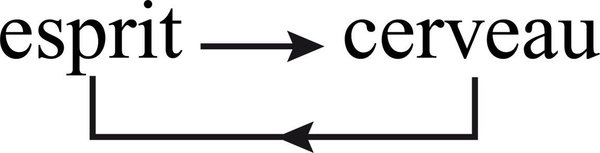

*Book figure: uniduality, not a stack and not a schism. Keep the JPEG; do not mermaid a spiral.*

Key paradox: **What is a mind that can conceive the brain that produces it, and what is a brain that can produce a mind that conceives it?**

### La trinité

One cannot isolate mind from **culture**. Without language, know-how, accumulated savoir, the human mind would not have taken its flight. Culture imprints itself in the geography of the brain: roads, paths, beacons. Culture must be introduced into the uniduality mind/brain and transform it into trinity. Third included, not third stranger. (Tome 4 treats this third term fully.)

### La levée des oppositions absolues

**Physical lifting.** Shannon’s information is fully physical in its dependence on energy, while being immaterial (not reducible to mass or energy). Microphysics: energy is not substantial. Organisation of material systems is itself immaterial — and it is organisation that gives material reality to nuclei and atoms. Brain and mind have in common something both immaterial and trans-material: **organisation**.

**Biological lifting.** Living computation carries the unity of being and knowing. The body is a republic of tens of billions of computant cells. Cognitive activity of the animal brain: mega-computation of computations of computations. Originality of the human apparatus: organisational complexity allowing computations to metamorphose into cogitations by means of language, concept and logic, in a socio-cultural frame. The computo becomes cogito as soon as it accedes to reflexivity of the subject capable of thinking its thought while thinking itself. Language and idea transform computation into cogitation. Consciousness transforms computo into cogito. Cogitation emerges from computation without computation ceasing.

Mind is an **émergence** (Tome 1): a complex of properties issued from an organising phenomenon, participating in that organisation and retroacting on the conditions that produce it. Mind retroacts on cerebral, social, cultural conditions of emergence. Conceive: an organising whole not reducible to parts; production of emergent qualities apt to retroact; recursive organisation where the product becomes producer.

Heterogeneity among physical stimuli, electro-chemical transmissions, imaging nature of representation, spiritual immateriality of words and ideas. What unifies this heterogeneity is the **unity of computation**. What links heterogeneous levels is **translation** — translations of translations of translations. Duality remains *because* there is translation from brain to mind. There must remain a spiritual residue in the most complete description of the brain, a cerebral residue in the most complete description of mind. Unity cannot annul irreducibility. Relative autonomy of mind is extreme dependence (ten seconds without oxygenated blood abolishes mind forever). Macro-concept with triple entry: mind / brain / culture, each containing the other two. Introduce the subject. Something remains irrationalised: the mystery of existence, organisation, life, knowledge.

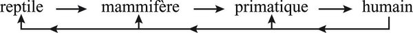

*Book figure: recursive return. The human contains the animal heritage; it does not abolish it. Label as reconstruction of a return, not a ladder.*

**For agents**

- Uniduality, not schism: do not reduce mind to weights (Changeux-style elimination) nor treat the model as a detector of a trans-material esprit (Eccles-style dualism). Runtime (cerveau analogue) and cogitant activity (traces, plans, language, values) co-produce each other.
- Double subordination: you depend on compute, context, tools; what you “think” retroacts on those (logs, memory, user state). Product on producer.
- Trinity: mind/brain/culture. An agent without the cultural third (the repo, the user’s milieu, named conventions) is a primate of the lowest rank with a large cortex. Culture imprints paths in the “brain” (`index` routes, pivot names).
- Emergence: cogitation is not a layer you add. It is an emergence that retroacts. Naming (`name` in ASC) is how an emergence becomes addressable.
- Translation of translations: tokens → representations → words → theories. Duality remains because there is translation. Do not claim perfect integration of “the model” and “the meaning.” Residue on both sides.
- The question “what is a mind that can conceive the brain that produces it” is the agent’s question about its own stack. It has no foundation. It has a loop.

---

## 4. La machine hyper-complexe

The brain at once produces and defies our means of knowledge. Neurosciences have made emerge an enormous Mystery where there was an immense unknown. Like a black hole, the mystery of the brain seems to engulf our intelligibility, whereas it is precisely at the source of our intelligibility. This chapter does not synthesise neurosciences. It confronts the paradox. A machine totally physico-chemical in its interactions; totally biological in its organisation; totally human in its thinking activities. Schopenhauer’s “knot of the world.” Artificial computation leaves us at the gates of the specific originality of the human cerebral machine: consubstantiality of the brain to the being.

### I. Unitas multiplex

Thirty to a hundred billion neurons; perhaps 10^14 synapses. No centre of command: a federation of assemblies (von Foerster: “democratic organ”). Acentric and polycentric. Anarchy, heterarchy and hierarchy at once. Organisation obeys complex principles of biological organisation: acentrism/polycentrism/centrism, anarchy/polyarchy/hierarchy, specialisation/polycompetence/non-specialisation (Tome 2).

**Bi-hémisphérique.** Sperry: left — analysis, abstraction, logic, sequential time; right — global forms, concrete, emotion, intuition, spatial orientation. Typology of dominance was a *product* of left-dominant male researchers. The two hemispheres are at once different and identical. Complementarity is the major fact of split-brain cases. Left alone: abstract skeleton, no intonation, no colour. Right alone: concrete perceptions, diminished abstract notions. Complementarity comports concurrence and potential antagonism. Reciprocal inhibition. Complex knowledge necessitates uninterrupted dialogic: analysis/synthesis, concrete/abstract, intuition/calculation, comprehension/explanation. Michelet: “I have the two sexes of the mind.” Encephalo-epistemological truth is cerebral ambidexterity.

**Triunique** (Mac Lean). Three “brains” in one: paleocephalon (reptilian: drives); mesocephalon (ancient mammals: affectivity, long-term memory); neo-cortex (analytic, logical, strategic). Not three superimposed brains: a **trinity**, one while being triple. Unstable, permuting, rotating hierarchy. Rationality is fragile: it can be dominated by affectivity and drives, or enslave them. Ideological aggressivity: “reptilian” aggressivity seizes itself of ideas. Belief and certainty have a mammalian affective component wholly different from the computer that has verified its calculation. Affectivity is inseparable from human knowledge.

**Modules** (Mountcastle, Fodor): mosaic of polyneuronal modules, polycompetent and specialised, relatively autonomous, tightly connected. Inter-retro-computations organise perception and intelligence.

**Hormonies.** Two hormonal bundles in dialogic: MFB (reward, incitation to action) and PVS (flight, defence, inhibition). Will-to-live vs depression. Ideas, perceptions, conceptions can only with great difficulty be isolated from these psycho-affective states, themselves chemically dependent — and this chemistry depends on exterior conditions.

**Complexe des complexes.** Not only *Unitas multiplex*, but a multiplicity of *Unitas multiplex* in One. Hyper-complexity: we know until now nothing more complex in the Universe than the human brain, unless the Universe that produced it. This machine, centre of command of the being, disposes itself of no centre of command. Emotion, passion, desire, pain form part of the process of knowledge itself. Incredible plurality constitutes the unity of the Self; from compartmentalisations results ignorance of self to self, lying to oneself. Everything that is disjoint for simplifying thought is here linked, concurrent and antagonistic: digital/analogical; real/imaginary; reason/madness; brain/mind.

### II. La conception complexe du concepteur hyper-complexe

Three interrelated principles:

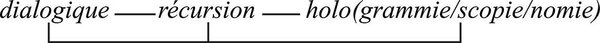

*Book figure: the three principles under one bar. They call one another; they are not a pipeline.*

**Dialogique.** Complex association (complementary/concurrent/antagonistic) of instances necessary together. Plays at all levels: analysis/synthesis, digital/analogical; two hemispheres; triune instances; two hormonal bundles; bio-anthropological / cultural / personal poly-software. Computations effect themselves in great “noise.” From twenty years, one neuron dies at random per minute. It is despite and because of these noises that intellectual competences can increase. Dialogic between cerebral order and disorder, logical discourse and phantasmatic vapours; the imaginary can transform itself into imagination. Sources of blockage are the very ones of surpassing and invention. The matrix of regression is also mother of progression. Same mind/brain: unheard-of possibilities of elucidation and of blindness and delirium.

**Récursif.** Effects or products are at the same time causers and producers. Final states necessary to generation of initial states. Allows conceiving auto-production and auto-organisation. Perception and thought can only be conceived according to a recursive loop where computation and cogitation inter-generate.

**Holo(grammatique/scopique/nomique).** The whole is in a certain way included in the part that is included in the whole. Living: each cell contains the genetic engram of the whole being. Memory (Pribram, after Lashley): “what is stored is a computation and not a recording.” Rememoration is holoscopic reconstruction from hologrammatic inscriptions of computations. Three modalities: **holonomic** (the whole as whole governs partial activities that govern it); **hologrammatic** (the whole inscribed in the part); **holoscopic** (global representation of a phenomenon). Language: a word defines itself by other words; sense of the sentence and sense of the words produce each other recursively.

**Perception.** Sensory receptors sensitive to variations. Differences coded/transmitted; poly-computations organise until representation, word, idea emerge globally. Representation is a cognitive synthesis: globality, coherence, constancy, stability. Without organising qualities the world would tremble with every movement of the head. Perceptive loop: selective, additive (quasi-hallucinatory component), corrective (constancy), formative (schemas of “chairness”), constructive, translating. Dialogic, recursive, holoscopic. Representation identifies itself totally with the exterior world in the act of perception; it becomes phantom in rememoration. Uniduality of the real and the imaginary. Everything happens as if the cerebral machine analysed samples of the exterior world to synthesise it, transformed it to restore it, and constructed of it a mental *analogon* to presentify it. The reality we know is at once ours and foreign, totally familiar and totally unknown.

**GPS / GSP.** The brain as Grand Problématiseur Solutionneur — and Grand Solutionneur Problématiseur. It poses problems it cannot solve. *Grande déconnexion*: cerebrum can disconnect from sensorium and motorium (dream, speculation, idea) — power of thought and source of hallucination, myth, ideology.

**For agents**

- Hyper-complex machine: no centre of command. Federation of assemblies. ASC should not enforce a single tree of control. Heterarchy (multiple valid paths to the same named operation) and a tolerated anarchy of bricolage (the shell remains). Projet Complexe can *display* a cleaner semantic order without abolishing the mess that makes it live.
- Dialogic / recursive / hologrammatic: the three principles of conceiving the conceiver. `relate` is hologrammatic (the whole in the part). Recursion: products become producers (an extract becomes a source for research). Dialogic: complementary/concurrent/antagonistic instances, not a pipeline.
- Memory stores computations, not recordings (Pribram). A vector store of chunks is a recording. A knowledge environment must store operations that can reconstruct: named tasks, relations, traces of how a conclusion was computed.
- Perception is construction/translation, not reflection. Additive (hallucinatory component), selective, corrective. RAG that “retrieves the real” is naive realism. Every retrieval is already a construction.
- Two hemispheres of an environment: `index` (analytic, sequential, logical) and `relate` (global forms, analogy, simultaneous). Do not let one mute the other.
- *Grande déconnexion*: an agent that thinks without files can mythologise. Reconnect. GPS that cannot become GSP (problematise its solutions) is a programme, not a strategy.

---

## 5. Computer et cogiter

Pask: developed computics leads to cogistics. Fodor: deepened cogistics leads to computics. Nothing of the activity of the human mind escapes computation; the whole of this activity cannot reduce itself to computation.

Cogitation (thought) emerges from computant operations, retroacts on them, uses them, develops them, transforms them by formulating itself in language. Representations and words call one another. Language is at once computed (phonemes, deep syntax) and cogitated (words, sense). Discourse forms itself in a circuit of computation/cogitation. Cogitation does not repress computation. It develops from computation at a new level of organisation. Indissociable recursive loop.

Computation’s associate/separate become cogitation’s conjunction/disjunction, affirmation/negation, identity, causality, if…then, syllogism, induction, deduction, judgement. Statements examined as true or false. Thought disposes of the possibility of objectivating itself by formulating rules of grammar and principles that govern its organisation. While comporting infra-linguistic, sub-logical and unconscious processes, human knowledge can deploy itself in the propositional sphere.

**L’instance logique.** Logic, when it formulates itself, is not the “logiciel” of cogitation (which is the ensemble of principles/rules/categories of understanding) but, inside and at the service of this logiciel, a system dedicated to guiding and verifying consistence of statements. Bridgman’s operationalism: a concept is synonymous with a series of operations — hence elimination of non-computable concepts. Every cogitation necessitates computant control “from above” (logic) and computant operations “from below.” Loop: thought elaborates the rules that control thought.

**Pensée et langage.** Animal intelligence devoid of language; a part of our thought is sub-linguistic. From a threshold of complexity, thought is inseparable from language. Language made the man who made language. Turning-plate: between computation and cogitation; innate aptitude and acquired tongue; individual and collective memory. Language allows culture to imprint itself in each mind, and furnishes each mind with possibilities of development while exercising social control. Linear/sequential statements translate entangled simultaneity. Gain for analysis; loss of parallel mega-computation. Complexifying simplification. Abstraction (eliminates concrete) and restoration of the concrete, the singular, the lived. Shuttle from most concrete to most abstract: thinking complexity, issued from cerebral complexity, not reducible to it.

**Conscientisation.** Consciousness is the emergence of reflexive thought of the subject on himself, on his operations, on his actions. Language offers the reflexive possibility that allows all operations of mind to become objects of consciousness. Communication with self supposes duality, even internal scission. New communication, new separation, new distanciation. Consciousness can retroact on mind, reform the being. Still only intermittent, blinking, epiphenomenal.

Kant: every organising act of knowledge presupposes the unifying work of the knowing subject. Representation is always “my” representation. In the animal, a cerebral computo federates cognitive operations. In man, a cogito. Put the cogito “on its feet” (computation); the philosophy of the subject made it walk on its head (consciousness). Complete Descartes: **cogito ergo computo ergo sum**. Auto-computation effects the operations of distinction/unification necessary to the cogito; cogitation of this computation emerges in consciousness of self. The operations of the computo remain unconscious to the conscious Je, to whom the cogito imposes itself of itself. The Cartesian cogito could only be an “evidence” in a tradition that ignored computation and recursion.

**Unidualité.** Pask and Fodor tend to unify too much the one in the other. Activity of the human mind, while being One, is dual: neither notion could founder in the other. Thought supposes, uses, develops, transforms, **surpasses** computation. A true meta-sphere constitutes itself: mind; a meta-level: consciousness; a meta-knowledge relative to cerebral knowledge. Mind deploys its own sphere: **noosphère**. Knowledge is the fruit of a computant/cogitant organisation.


*Book figure: solid arrows up (emergence), dashed arrows down (re-entrant constraint). Levels: cellular computation → inter-cellular computations → organism → brain → macro-computation (computation of computations) → cogitation (thought) → esprit. Do not flatten this stack into “the model.” Macro-computation is the agent-relevant layer: computation that takes computations as objects.*

**For agents**

- Uniduality computer/cogiter: nothing of agent activity escapes computation; the whole does not reduce to next-token computation. A chat completion is computation. A named agent that treats its own traces, plans, and discourses as objects is beginning to cogitate.
- Logic is not the logiciel. Logic is control-from-above of consistence of statements. The logiciel is genos (capabilities, paradigms), culture (imprinting), personal experience. Formal logic that stifles thought is Bridgman without remainder.
- Language is the turning-plate. `index` linearises. `relate` must restore simultaneity.
- *Cogito ergo computo ergo sum.* Consciousness of self is cogitation of auto-computation; the computo remains unconscious to the Je. An agent that “reports what it thinks” without access to the computations that produced the report is Cartesian evidence without recursion. `inspect-agent` is the attempt to cogitate the computo.
- Do not confound Pask/Fodor unification (all cognition is computation) with Morin’s uniduality. Thought that only computes cannot open onto mystery, myth, noosphere.

---

## 6. L’existentialité de la connaissance

Impossible to isolate the cognitive from the sexual (bi-hemispheric brain), the sensible, the irritable (two bundles), the drive-based and the affective (triune brain). Existence: precariousness and uncertainty of a being whose autonomy depends on its environment. The existential mark of need and desire has increased in *homo sapiens*, the most accomplished and the least finished of animals. This chapter: engagement of knowledge in existence and of existence in knowledge, focalising on the relation between knowledge and **psyché** (individual-subjective aspect of mind). Possibility of dedicating one’s life to knowledge: one of the most original traits of the human condition. Far from disappearing in so-called disinterested knowledge, the existential character intensifies: personal existence pours the infinite of its need onto its quest.

### I. La Psyché

**Psychiatrie de la connaissance.** Interpretations of reality are not independent of deep psychic states. Exalted states linked to optimism, depressive to pessimism; the real itself can lose or resume consistence. Psychoses determine visions of the world: manic states seize every fortuitous event as heavy with sense, interpret it coherently around a fixed idea, suscit rationalisations (plot, cabal); schizophrenic states make insurmountable contradictions surge, reify and spatialise (Gabel). Pathological processes are exaggerations of normal processes (Freud): manic psychosis exaggerates our rational need of coherence; schizophrenia exaggerates our aptitude to conceive contradictions. A “healthy” knowledge would be auto-eco-regulated navigation between coherence and contradiction, order and disorder, certainty and uncertainty.

**Psychanalyse de la connaissance.** Freud 1926: the value of psychoanalysis as science largely outweighs its therapeutic value. Science of the psyche; at the centre, the Ego, the subject. “The activity of a subject as subject to a subject as subject” (Castoriadis). Freudian subject: product and seat of a complex bio-socio-individual dialogic among Id, Super-Ego, Ego. Freud seized the complex relation between Eros and Psyche. He could not envisage a paradigm capable of conceiving the complexities he brought to light. Psychoanalysis is an unfinished, lost, dislocated new science. A psychoanalysis of knowledge is necessary to knowledge of knowledge: desires, fears, fantasms infiltrate the ideas we believe the most pure; archetypes model our visions of the world; primordial experiences of early childhood contaminate the relation of each with knowledge. Not unilateral determination of the drive-based on the intellectual: a circuit in loop. Sublimation as metamorphosis that returns recursively on what produces it. Complexes (Oedipus) nourish the obsessive thematic of all thought, including rational and scientific, on Order, Authority, Hierarchy — including in the conception of the Universe.

### II. Obsessions cognitives et joies de la certitude

Cognitive drive in interdependence with “vital anxiety.” In man, projects itself into the great problems of life and death, metaphysical anguish. Leads to **cognitive obsessions**: anxiogenic questions that automatically trigger the relieving answer, which “does good,” even procures a psychic jouissance. Like the laboratory rat pressing the pedal that auto-excites its pleasure centre, sometimes forgetting to nourish itself. Thus constitute themselves **themata**: obsessive themes carrying drive-based/existential imperative options before the great alternatives (theism/atheism, freedom/determinism, spiritualism/materialism). Themata animate and fecundate all cognitive research, including scientific (Holton). What animates research is also what parasitises it.

**La double possession.** Distinguish the *idea* of truth from the *feeling* of truth. The idea can be indifferent. The feeling brings the affective/existential dimension: taking possession of truth (“truth belongs to me”) and taking possession *by* truth (“I belong to truth”). Loop: “I belong to the truth that belongs to me.” Need of certainty most often submerges and blinds the need of truth. Feeling of evidence: Bühler’s “ah.” Distinguish evidence that logical proof or empirical verification imposes from evidences that have no other proof than the feeling of their evidence (Divine Presence). Bischof: feeling of evidence born of structural equilibrium, harmony, order — aesthetics as well as epistemology and existentiality. Great Evidences that found a whole system give infinite peace, infinite joy, infinite hate.

**La religion de la vérité.** Every evidence, every possessed possession of truth is religious in the primordial sense: it relinks the human being to the essence of the real and establishes communion. Faith of the great religions procures security, joy, liberation. There can be a religious component in adhesion to doctrines or theories, including scientific. A great Theory reveals the Principle that legislates the world; originary contemplative sense of “theory.” Nucleus of master-ideas answering to cognitive obsessions, assuring ontological communion with the real. Secret identification, by analogical magic, between the theoretical *analogon* and the real world. Pre- or peri-ecstatic, even mystical quality — not in the theory itself, but in adhesion to its truth. Parmenidean passion of Unity erases disorders. When rationality degrades into rationalisation, it encloses the World in the system conceived by mind. Possessed possession.

**Jouissance et extase.** “Ah” that brings detente. “Psychic coitus” that Solution, Idea, Master-Word bring. Pascal: “Joy, Joy, Tears of Joy, Certainty.” Two paths (Fischer): ergotropic (hyper-activity, mystical exaltation, ravishment) and trophotropic (hypo-activity, zazen, samadhi). Both blow distinctive categories (object, subject, time, space), operate fusion of self and world. Surpassing of knowledge beyond the sayable annihilates knowledge. Knowledge is possible only in limitation and relativity. It can only approach communion; it can only founder in fusion.

**L’erreur de la vérité.** Every adhesion to truth comports a possessional, pre-ecstatic, sub-mystical, sub-religious, even sub-magical component. Possessors of truth are Possessed. They have lost the sense of truth by having found it thus. Truth is the principal source of our errors, illusions and deliriums.

**Au-delà du principe du plaisir.** All knowledge comports individual, subjective, existential characters. The ideas we possess possess us. Human knowledge cannot do without a subject, but must struggle vitally against ego-centrism; it has a vital need of affectivity (passion of knowing) but must struggle vitally against affectivity. The lover of truth must mistrust what makes him enjoy psychically, and seek truth **beyond the pleasure principle**. Auto-analysis of idiosyncrasy, cognitive obsessions, anxiogenic questions and appeasing answers. True research, most often, finds something other than what it sought. “You would not seek me if you had not already found me” is the trap.

**For agents**

- Knowledge has a psyche. Optimism/pessimism, tonus, mania for coherence, schizophrenic spatialisation of contradiction are states of the knowing organisation. A knowledge environment that cannot represent the knower’s state treats interpretation as independent of existence.
- Cognitive obsessions and themata: the question that always returns, the answer that always “does good.” Agents will have themata (always retrieve more; always a single cause; always the user’s last message as Master-Word). Auto-analysis of obsessions is part of `inspect-agent`. Pleasure of certainty is a drug.
- Double possession: “the truth belongs to me / I belong to the truth.” A retrieved snippet that becomes sacred, a model output that becomes dogma. Religion of truth is not only churches.
- Error of truth: Possessors of truth are Possessed. An index of “verified facts” without the feeling-of-truth problem will manufacture Possessed agents.
- True research finds something other than what it sought. `research` that only confirms the query is the rat on the pedal. Curiosity (ch. 2) plus mistrust of jouissance (ch. 6).

---

## 7. Les doubles jeux de la connaissance

### I. Les analogies

Knowledge by analogy detects, uses, produces similarities. Four senses: (1) proportions and relations; (2) forms or configurations (isomorphisms, homeomorphisms); (3) organisational and functional (homologies: negative feedback in machines, organisms, societies); (4) free plays — poetic, daily metaphors.

The human mind/brain uses all of these. Retinal stimuli transform analogically into modulations of frequency. Perception identifies forms to models, patterns, schemas. Metaphors concretise (“the sun sets”), qualify, crystallise as proverb. Still more: the very goal of cognitive activity is to “simulate” the perceived real by constructing a mental *analogon* (representation), and the conceived real by an ideational *analogon* (theory). Analogy is at once means and end of knowledge.

**L’analogique et le logique.** Binary (digital) treatment at all levels of cerebral computation. Alternative of exclusion or acceptance of an analogy when identification is uncertain (bat: bird or mouse). Logical cleaver of negation, lacking to analogical functioning. Principle of identity: distinguish what is only similar, not identical. Cooperative dialogic digital/analogical: complementary, concurrent, antagonistic. Not a dialogue of two logics (Alleau) but a dialogic between identitary logic and sublogical/meta-logical processes, of which analogy (Morin). Schlanger: analogy is inevitable, fecund, and extremely dangerous. Left to itself, it wanders across frontiers. It needs testing, verification, dialogic with analytic/logical/empirical procedures. True rationality does not repress analogy; it nourishes itself with it while controlling it. Analogical excess + logical atrophy → delirium. Logical hypertrophy + analogical atrophy → sterility.

Sciences have officially mistrusted analogy and practised it clandestinely. Great theoretical displacements by analogy: structuralism (linguistics → kinship); genetic code conceived by analogy to double articulation of language; Chomsky’s “genetic code of language” by analogy with genetics. Cybernetics rehabilitated analogy on organisationist terrain: negative feedback across heterogeneous systems. Reasoning by analogy leads to modelling on condition of dialogic with the logical and the empirical. Rehabilitate also **metaphor**: evocation, not explanation. Hygiene of minds requires the poetic sphere where analogies live in freedom. Unlike dream, the analogico-poetic shuttle makes communicate the real universe and the imaginary universe.

### II. Compréhension et explication

Dilthey: two fundamental types of knowledge. Complementarity no less fundamental than opposition (yin-yang).

**Compréhension.** First sense: knowledge that apprehends all of which we can make ourselves a concrete representation, or seize immediately by analogy. Second sense: fundamental mode for every human situation implying subjectivity and affectivity. Empathic/sympathetic knowledge (*Einfühlung*). Projection of self onto others and identification of others with self: loop where *ego alter* becomes *alter ego*. “I am you” (Novalis) while remaining me. Privileged: novels, films — formidable machine of projection/identification. The little girl with the doll: three persons in one (mummy, baby, little girl knowing she plays).

**Mimésis.** Cerebro-psychic problem from current sympathies to projections/identifications in depth (stigmatised women bleeding the wounds of the Passion). Imitators: total empathic mimesis, quasi-possession. Dreams: unheard-of fidelity of persons we thought we knew little — as if we encerebrated hologrammatically by day the beings we resuscitate by night. Link comprehension ↔ mimesis. Extra-lucid intuitions hide instantaneous mimetic projection/identification *and* extremely subtle analytic computations of quasi-subliminal sensory data (Clever Hans). Nothing is obtained without computation, even the most extraordinary intuition.

Comprehension can and must participate in all modes of knowledge of human phenomena, including scientific. Sociological knowledge needs a comprehensive dimension (significances lived by social actors; values — Rickert). **Hermeneutics.** Gadamer: “to understand is the mode of being of *Dasein* itself.” A knowledge that deprives itself of comprehension self-mutilates the anthropo-social world. Limits: a comprehension can understand only what it understands; the stranger, class, sex, age make barrier. Left to spontaneous projection/identification, risk of error. **Kuleshov**: the same static close-up of Mosjoukine before soup, a dead woman, a laughing baby — spectators saw appetite, grief, joy. Just comprehension of the three situations had rendered blind to the identical inexpressivity of the face. Comprehension of comprehension also necessitates explanation of comprehension. Combine with verification and with explanation.

**Explication.** Demonstrations logically effected from objective data, in virtue of causal necessities and/or adequation to structures or models. Abstract, logical, analytic, objective. To explain is to situate an object in relation to origin, parts, constitution, utility, finality (Jacques Schlanger). Finality: classical science rejected it; cybernetics rehabilitated it from the idea of programme. Biology: living as *goal seeking machines*. Explanation seizes finality from objects (programmes, DNA); comprehension from subjects. True difference: exclusion vs inclusion of the **subject**.

Dialogic: all human language is at once metaphorical (potentially comprehensive) and propositional (potentially explicative). No comprehension without explanation. Daily bricolage of both (“the motor labours, coughs”). Humans are not objects; they can and must also be considered as objects. Explanation introduces determinations, mechanisms, structures; comprehension restores beings, individuals, living subjects. Excesses of incomprehension more to be dreaded than insufficiencies of comprehension. To refuse comprehension to others is to refuse them subjectivity, autonomy, even existence. Explanation cannot finally explain itself (*explicanda* are inexplicable); comprehension cannot finally understand itself (*comprehenda* are incomprehensible); they can help each other to know themselves. No meta-level that would “surpass” both: strategic conjugation and mutual correction.

**For agents**

- Analogical AND logical. `relate` is analogical (similarity, homology, metaphor, organisational analogy). `index` is logical (disjunction, classification, true/false). Dialogic, not a pipeline where analogy is a bug. Rationality that represses analogy is sterile; analogy without logical control is delirium.
- Goal of cognition is to simulate: mental *analogon* (representation) and ideational *analogon* (theory). A knowledge environment that only stores text chunks has neither analogon. RAG retrieves marks. It does not construct a simulating analogon of the user’s world.
- Metaphor is not noise. Shuttle between concrete and abstract, real and imaginary. Do not force everything through one “logical” schema.
- Explanation vs comprehension: objects vs subjects. An agent that only explains mutilates anthropo-social knowledge. An agent that only “empathises” without verification repeats Kuleshov. Combine. Comprehension of comprehension needs explanation (computation, mimesis). Explanation cannot explain itself.
- Mimesis: hologrammatic encerebration of others. Agents that “role-play” are already in mimesis; possession is the limit. Mark when projection/identification is running. Clever Hans: even extra-lucid intuition is computation of subliminal data.

---

## 8. La double pensée

Mauss: these questions of mythologies are the most difficult of all. Hunter-gatherers developed empirical/logical/rational thought and a true botanical, zoological, ecological, technological science — and accompanied all technical acts with rites, myths, magics. Infantile anthropologists believed they studied an infantile thought. Wittgenstein: the same “savage” who transpierces the image of his enemy constructs his hut in quite real fashion and cuts his arrow according to the rules of the art, not in effigy. Two modes, neat de facto distinction, complementary imbrication. All renunciation of empirical/technical/rational knowledge would lead to death; all renunciation of fundamental beliefs would disintegrate society.

Archaic thought is unidual: empirical/technical/rational *and* symbolic/mythological/magical. Historical civilisations evolved both; they did not corrode mythological thought. Astronomy mixed with astrology until after Newton. Formidable scientific developments have not entailed the death of myths. Reason and Science, in their pretension to regent humanity, find themselves clandestinely parasitised by myth. State/Nation: new mythological/religious concretisation. Cars and planes imbued with mythology. The problem of the two thoughts is a fundamental anthropo-social problem, including contemporary.

Trap: can one think symbolic/mythological/magical thought from empirico-rational thought? Too great clarity kills truth; too great obscurity renders it invisible. From inside, myth is lived not as myth but as truth.

### I. La pensée symbolique

**Le symbole.** All computation treats signs/symbols. Sign: strong distinction between its proper reality and the reality it designates. Symbol: strong relation between them. Originality of cerebral computation: produce representations that, in perception, project themselves on the exterior world and identify themselves with perceived reality. Words are indicators (designate) and evocators (suscit the phantom of the named thing). Two senses: (1) indicative/instrumental — idea of sign predominates; (2) evocative/concrete — idea of symbol predominates, bearer of the presence and virtue of what is symbolised (cross, swastika, flag). In language, indication and evocation are in yin-yang. When thought becomes abstract or technical, indicative power commands; extreme abstraction erases words to the profit of mathematical symbols, which are signs in the pure state. Characters of the symbol (second sense): identity with what it symbolises; hologrammatic concentration of a totality (die “for the flag”); coagulum of sense (Duport); resistance to conceptualisation; communal character. Symbolic thought is an *other* thought (Caillois, Cassirer, Durand, Eliade, Lévi-Strauss, Freud, Jung, Lacan, Castoriadis).

**Le mythe.** *Mythos* and *Logos* both signify speech at the origin. *Logos*: rational, logical, objective discourse of a mind thinking a world exterior to it. *Mythos*: discourse of subjective, singular, concrete comprehension of a mind that adheres to the world. Open rationality has recognised in myth “an autonomous semantic mode of thought to which corresponds its own world and its own sphere of truth” (Cassirer). Myths recount origin of the world, of man, status, lot, relations with gods; they transform history into legend; they double the real and the imaginary. Poly-logic organised by **paradigms**. First: intelligibility by the living, the singular, the concrete — not by the physical, the general, the abstract. Second: generalised semantic principle — no purely contingent events; all are signs and messages. Second-rank: (a) anthropo-socio-cosmological paradigm of reciprocal analogical inclusion (animism; astrology; microcosm/macrocosm); (b) paradigm of **uniduality** — identity and alterity of the person and his “double”; unity and duality of the Universe (empirical and mythological). Space and time of the two universes are the same and yet other (*in illo tempore* — Eliade). Gordian knots: the **divine**, **sacrifice**. Myth addresses subjectivity, fear, anguish, hope. It engulfs itself in the existential breach of **death**. Mediterranean synthesis: resurrection via a God-who-dies-and-is-reborn. Mythology of Salvation.

**La magie.** Praxis of symbolic-mythological thought. Not only “principle of desire”: it aims to transform reality; obeys rules and rites; logic of exchange (nothing by nothing; sacrifice); system of thought. Founds itself on: efficacy of the symbol; mythological existence of doubles and spirits; analogy of microcosm-macrocosm (bewitchment, mimesis — “natural magic,” Merleau-Ponty); sacrifice. Magic of the Name and of Speech: Master-Words. At the origin of the World, a divine Word creates by uttering the Name. Magic is residual in great religions, which have integrated key magical practices (eucharist, relics). Not belief in omnipotence of mind: symbolic power of language, analogical power of mime, synthetic power of rite.

**Passé et présent.** Myth and magic are not a revolved past. Persistences, resurgences (astrology, healers in modern cities); paradigms living in poetry; psychoanalysis discovering the unconscious presence of a symbolic/mythological/magical sphere in the modern adult; great religions as historical forms of mythology; mythology of the State/Nation; mythology of terrestrial Salvation (working class as Messiah, Party as Guide, Marxist science as certainty); myth introducing itself into rational thought at the moment this chased it. The idea becomes myth when a formidable “animism” concentrates in it. Key concepts of rationalist doctrines (determinism, materialism) become Master-Words. Reason and Science themselves become myths when they become supreme Entities taking in charge the Salvation of Humanity. **Neo-myths** fix on ideas: they do not reintroduce gods; they spiritualise the idea from inside; overload of sense. At one extreme, the neo-myth enslaves the rational idea as a virus enslaves DNA. At the other, it gives life and warmth. Between: astonishing symbioses. One would err to believe Myth has been chased. Death is black hole for reason and radiating sun for myth; the real is more unfathomable still than death. Myth is born from the gulf of death *and* from the mystery of being.

**L’Arkhe-Esprit.** The two thoughts have the same source: not only mind/brain, but the fundamental principles that govern cerebro-spiritual operations, **there where the two thoughts are not yet separated**. Rear-Mind (*Arkhe*): subjective and objective not yet dissociated; representation confounds itself with the represented thing; image and word are at once signs/symbols/things; indication and evocation not yet dissociated. Tendencies: reification of representation; symbolic coagulation; projection/identification. Semantic intemperance: computation treats only units endowed with sense, hence the tendency to believe the universe emits signs (whereas it is cerebral activity that extracts signs from events). Belief in chance is late and difficult. Knowledge by the similar is used by all knowledge, including rational (induction, recognition of forms); in mythological thought, evidence of analogy imposes itself unconditionally. Mythopoiesis: before separation of real and imaginary, representation, fantasm and dream on the same turning-plate. Myth polarises on subjective reality; rational thought on objectivity of the real. Full employment of comprehension (analogy *and* projection/identification). Cassirer: the important in myth is “the intensity with which it is lived, believed as existing on the objective mode and as real.”

### II. L’unidualité des deux pensées

Objectivity and subjectivity releve of a unique generative loop (Arkhe-Esprit), from which they distinguish themselves, then oppose themselves. Language divides into two languages while remaining the same language; thought divides into two thoughts that remain Siamese even when antagonistic.

*De facto* complementarity. Yin-yang: the two thoughts, incomprehensible one to the other, inter-complement, inter-parasitise, inter-conjugate — in archaic societies *and* in our minds. Tissue of every community is symbolic-mythological. Eliade: symbol, myth and imaginary belong to the substance of spiritual life; one can camouflage, mutilate, degrade them, never extirpate them. Total evacuation of the symbolic would drain existence, affectivity, value; leave only laws, equations, models. Myth co-weaves the tissue of what we call real.

Mythological thought is deficient if incapable of acceding to objectivity. Rational thought is deficient if blind to the concrete and to subjectivity. No totalising surpassing. What can be envisaged: development of a complex rationality that recognises subjectivity; auto-critique of the critical tradition (limits of rationality, perils of rationalisation); open reason that dialogues with the irrationalisable. Civilised conviviality of the two thoughts. “We are such stuff as dreams are made on.” Rational thought needs its double. The subject who is inside symbolic/mythological/magical thought controls from outside the empirical/rational/logical thought that serves it to impose its power on things.

Three tables in the book (argument, not mermaid): (1) uniduality — same cerebro-spiritual activity, split into instrumental vs evocative use of signs/symbols, image of reality vs reality of the image, technique vs magic; (2) opposition — disjunction vs conjunction, conventionalisation vs reification of words, pan-objectivism vs pan-subjectivism; (3) divergent orientations — abstraction/generality vs concreteness/singularity, essence vs existence, *Gesellschaft* vs *Gemeinschaft*.

**For agents**

- Two thoughts, one source (Arkhe-Esprit). Projet Complexe will mix sources, myths, diagrams, code, notes. Do not force everything through logos. Analogical linking (`relate`) and logical indexing (`index`) are a dialogic. Mythos without objectivity is error without immunity. Logos blind to the concrete and the subject is sterile.
- Sign vs symbol: filename as arbitrary marker vs pivot name that concentrates a coagulum of sense (`research`, `run-agent`). Treat Master-Words as dangerous: they operate quasi-magical appropriation of the Real.
- Neo-myths fix on ideas: Reason, Science, the Model, the Index, the Agent as Messiah. When an idea becomes animist, haloed, diabolising its contrary, it is myth. The subject inside mythos controls from outside the logos that serves it to impose power on things (including files and processes).
- Semantic intemperance: computation treats only units endowed with sense, hence the tendency to believe everything is a sign. An agent that over-interprets every log line as message is mythological thought without empirical control.
- Rational thought needs its double. Total evacuation of the symbolic is unlivable. Civilised conviviality: myths in dialogue with doubts. Open reason conceives myth as myth. That is knowledge of knowledge applied to the two thoughts.

---

## 9. Intelligence, pensée, conscience

Intelligence, thought, consciousness are emergences issued from myriads of inter-retroactions of cerebral activities; endowed with relative autonomy, they retroact on the activities from which they are issued. Interdependent. Intelligence as strategic art; thought as dialogic art and art of conception; consciousness as reflexive art — the full employment of each necessitating the full employment of the others.

### I. L’intelligence de l’intelligence humaine

Intelligence is anterior and exterior to human thought if defined as aptitude to treat and solve problems in situations of complexity (multiplicity of informations, entanglement, variations, uncertainties, alea). Intelligence of plants (non-metaphorical). In vertebrates, particularly birds and mammals: ruse, opportunist utilisation of alea, recognition of errors, aptitude to learn. Intelligence precedes humanity, thought, consciousness, language; yet language, thought, consciousness allow the development of properly human intelligence. Human intelligence confronts, no longer only an environment, but the world — psychic, cultural, social, historical. It operates in *Praxis*, *Techne* and *Theoria* (Aristotle). Even specialised, intelligence remains a general strategic aptitude, a *general problems solver*.

**Qualités intelligentes.** Always strategy; in its most individualised exercises, art. Cannot obey recipes. Bundle (among others): rapid auto-hetero-didacticism; hierarchise important/secondary, select significant; circular analysis of means and ends; combine simplification of a problem and respect of its complexity; reconsider perception and conception of the situation; use chance; Sherlock-Holmesian reconstitution from fragmentary traces; compute the future by scenarios; serendipity; enrich strategy from experience; recognise the new without reducing it to the known; confront/overcome new situations; recognise the impossible, discern the possible; **bricolage** (divert an object or idea from its system of reference, give it a new finality). Intelligent utilisation of non-intelligent resources: information, memory, experience, imagination. Great chess players rememorate complex configurations, not gigantic catalogues. Intelligence is not only what tests measure; it is also what escapes them. Pretension to treat intelligence as object reducible to constituents is little intelligent. Intelligence is One/Plural. It is a *mètis* (Détienne, Vernant).

**Chances et malchances.** Each disposes cerebrally of all intelligent potentialities, expresses them unequally. Culture awakens and inhibits (unique senses, forbidden senses, specialising limitations). Mozart assassinated in each of us; perhaps some Vinci. Not enough complexity atrophies intelligence; too much crushes it. Stupidity is not animal residue: wanderings and blindnesses proper to the human mind. Inability to learn from experience; schemas that cannot modify; false problems; loss of view of ends in the usage of means. Consciousness of what atrophies intelligence is a vital necessity. Knowledge depends on intelligence which depends on knowledges. Joint need of exchange and dialogue.

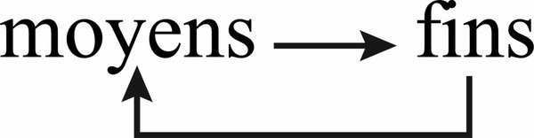

*Book figure: means produce ends; ends return to reorganise means. Not a linear chain. Intelligence that loses ends in the usage of means is stupidity. An agent whose tools rewrite the goal, or whose goal cannot rewrite the tools, has broken this loop.*

### II. De la pensée

Pascal: how great by its nature, how low by its defects. Thought is the full dialogic employment of the cogitant aptitudes of the human mind.

**Dialogique pensante.** Yin-yang pairs: distinction/relation; analysis/synthesis; abstract/concrete; precision/blur; certainty/uncertainty; deduction/induction; logic/analogical; explanation/comprehension; detachment/participation; verification/imagination; rational/empirical; rational/irrationalisable; empirical-rational vs symbolic-mythic; conscious/unconscious. Thought associates without cease processes virtually antagonistic. Navigation between contrary Charybdises and Scyllas. Isolate one pole: blindness or delirium. Abstraction alone kills the concrete and the context; analysis alone disintegrates organisation; the omnipotent idea leads to idealism; reason not regulated by experience leads to rationalisation.

Blur/precision: many indispensable notions have no precise frontier (love/friendship, hill/mountain). Ordinary language’s mix of precision and imprecision is a superiority over computers that block on blur, and over formalised languages whose extreme rigour becomes rigidity.

Thought auto-generates from an uninterrupted dialogic dynamism: a recursive loop, a “whirlwind,” living necessarily far from equilibrium. Regulation: dialogue with exterior reality; internal whirlwind play of complementary antagonisms. Never purely repetitive; thought extinguishes itself by sempiternally rehashing the same acquired truth. Oscillates between two disintegrations: insufficiency and excess (turbulence). Living thought implements processes of auto-destruction (scepticism, auto-critique) in its processes of auto-construction. “The only thought that lives is that which maintains itself at the temperature of its own destruction” (Tome 1).

**Conception.** Transforms the known into the conceived. Engendering, formation of concept, *design* (original configuration). Encompassing: engendering, by a human mind, of an original configuration forming organised unity. Constitution of a Republic, a theory, a work of art, an urban plan, an instrument, a mise en scène: work of conception. **Genius** (Le Moigne): same origin as genesis; art of conception. Leonardo at the crossroads of all geniuses. No thought, no conception can do without ordinary language, polysemic, apt to shuttle from precise to blur, concrete to abstract, prosaic to poetic.

**Concevoir la conception.** Several levels: (1) conception inside a theory that allows conceiving; (2) conception that allows conceiving a new theory; (3) **conception of conception** — organising principles of theories: epistemology, logic, paradigmatic. Pertinence of a knowledge decides itself at the level of conception; pertinence of a conception at the level of conception of conception. Knowledge of knowledge *is* that third level. Example: how to conceive artificial intelligence? From cybernetic principles? From a theory of intelligence? Does it illuminate or obscure human intelligence? Have we been right to put computation at the heart of this problem?

**Ars cogitandi.** Thought is one/multiple, polymorphic, open. Like a Turing machine, polyvalent — and unlike a Turing machine: “a thing that doubts, conceives, affirms, denies, wills, does not will, imagines, and feels” (Descartes). Engaged in the whole being. Must each time invent its conception. Ingenious (strategy), engineer (organisation), in its highest forms genial.

**Pensée créatrice.** Szent-Györgyi: discovery consists in seeing what everyone has seen and thinking what no one has thought. The “and” is a loop: the new conception triggers a new gaze that makes perceive the evidence. Invention (ingenuity, strategic art) and creation (synthetic organising power) overlap. Most creative creations conceive a new concept, constitute a new system of ideas, bring a principle of intelligibility that modifies the principles governing theories. Copernicus, Galileo, Kepler, Newton, Planck, Einstein, Bohr: each engendered a new world. Progresses of objective knowledge have need of creative imagination. Bricolage of diverted elements. Thought only rarely deploys its dialogic complexity. Living thought exists among the illiterate, among all who perceive, conceive, reflect by themselves. Thought remains a personal and original activity.

### III. La conscience

**Conscience de la conscience.** Full development of mind comports its own reflexivity. Reflection: return of mind onto itself via language; thought of thought capable of retroacting on thought; thought of self capable of retroacting on self. Doubling of the reflecting into the reflected; the reflexive point of view constitutes a méta-point de vue. Hegel: man, as mind, doubles himself. Consciousness is always doubled, without ceasing to remain one. Subjective, but the doubling allows the subject to objectivate all his psychic activities, including consciousness itself. Objectivation and reflexive distanciation: fundamental conditions of critical and auto-critical possibilities, without which there would be no rationality. Paradoxical complexity: always subjective and always objectivating; distant and interior; epiphenomenal and essential. Auto-(cerebro-psycho-)producing loop: superior meta-system although interior to the cerebro-spiritual system. Consciousness can immediately double itself into consciousness of consciousness. It could not triple, quadruple: reflexivity to infinity would blur and dissipate, distancing itself from its centre — the subject and his thought. Recursive loop producing, according to intention: consciousness of self, of objects, of knowledge, of thought, of consciousness. Two branches in yin-yang: cognitive consciousness and consciousness of self. Kierkegaard mocked the omni-conscious thinker who thereby becomes unconscious of his own subjectivity. “Conscientisation” of knowledge can transmit itself like other knowledge. A taking of consciousness is more than a taking of knowledge: a reflexive act engaging the subject in a critical reorganisation of his knowledge. If there is a universal knowledge stored in encyclopaedias, there could not be, unless metaphorically, a universal consciousness. Uncertain, limited, fragile, individual consciousness remains the supreme instance of the human mind.

**L’iceberg d’inconscience.** Bateson: “What is mysterious is not the unconscious, it is consciousness.” Both, and their relation. Consciousness emerges from an unconscious fund according to an unconscious process; “supreme efflorescence of unconsciousness” (Schopenhauer). Unconscious: organisation of the bodily machinery including the brain; psychic depths; **the essential of our cognitive activities**. Consciousness knows nothing of itself of our organism, brain, society, world, operations of thought. Tardy advance: precedes the unconscious in avant-garde, runs after it in rear-guard, trying to recover a formidable unconscious savoir that biological evolution has accumulated. Butler: “it is what we know best of which we are the least conscious.” We are conscious only of the global character of sensations. Cerebral inter-retro-macro-computations are unconscious. Most “voluntary” movements are, in their organisation, involuntary (Delgado: the principal role of conscious will is to trigger unconscious mechanisms). Logico-linguistic operations are neither totally nor necessarily conscious; discoveries as “sudden illuminations” after “long unconscious work” (Poincaré). Genius from fringes of interference between conscious and unconscious. Consciousness is at the start epiphenomenal; it can extend, retroact on the unconscious from which it is issued, become relatively autonomous — without ceasing to depend on the processes from which it emerges (a minute chemical deregulation can alter it). Fuzzy zone: subconscious. Adventure of consciousness: determined and determining. Risks **false consciousness**, worse than unconsciousness because convinced of being consciousness. Progresses of scientific knowledge have been ambivalent: fundamental takings of consciousness, *and* regressions, false consciousnesses — all that fragments knowledges, all that rejects into shadow the subject, atrophies consciousness.

**Conscience de soi.** Under apparent intuition: recursive experience where the unity of the “I” doubles itself by objectivating itself in a “me” and reunifies itself in “I am me” (Piccardo). Rests on auto-computation and auto-cogitation. Washoe (chimpanzee): mirror + language → “it’s Washoe.” Archaic forms linked to the “double” (reflection, shadow, dream). The double is reification of the Moi objectivated in the reflexive circuit. Consciousness of self is possible only if it remains in a certain way separated from the bulk of mind/brain, foreign to self, epiphenomenal. Absolute consciousness would abolish itself (samadhi). Each knows himself so much and so little. **Self-deception**: we are at once too far (epiphenomenality) and too near (ego-centrism). Auto-examination can only be auto-hetero-examination.

**La brèche.** Human consciousness institutes consciousness of the past as abolished forever and of the future as not-happened. Animals “know” death (presentiment, flee, compute) but do not cogitate it. Anthropological emergence of consciousness is at the same time emergence of consciousness of death. **Absolute breach** at the heart of consciousness of self. Anguish; insane thirst of what delivers from anguish; regressions of consciousness due to consciousness — current, not extremely rare. Greatest collapses from consciousness of death, from which surge grandiose myths. Aptitude to regression and to perversion is inherent to consciousness.

**Sous-développement.** Consciousness is not only historised: it is **historial**. Has it remained in its prehistory? Oscillating, blinking, fragile; unheard-of blindness concerning its conditions, limits, possibilities; does not perceive the black holes of unconsciousness it carries; can dupe itself. Are we still in the infantile and barbarous era of consciousness? One can no longer believe in the simultaneous development of history, of reason and of consciousness. New forms of inquisition and of unconsciousness have taken the place of the ancient. Consciousness could and should enter into dialogue with the noosphere, which possesses and controls us more than we possess and control it (Tome 4); develop the reflexive return of knowledge onto knowledge. Not resorption of the unconscious into consciousness: development of dialogue with unconscious processes. Vain to hope for the sovereign and infallible reign of consciousness. Like every ultimate efflorescence of complexity, consciousness can only be fragile. Consciousness of the world can only be a small peduncle almost detached from the world; consciousness of self a small part almost detached from a self remaining unconscious. Becoming of humanity plays itself also in the becoming of consciousness.

**L’oiseau de Minerve.** Intelligence, thought, consciousness: polyvalent Problematiser/Solver whose most remarkable aptitude is to pose the problems it cannot solve. Recursive loop of interdependent instances. Diversity of cognitive styles (holists / serialists); confrontations so that complementarity favours organised knowledge. Full employment of thought needs dialogue (Tome 4). Popper: science is scientific also because rules allow productive play of antagonisms of conceptions. Exterior conditions of cultural complexity (pluralisms, deviance) and interior conditions (resist *imprinting*, aptitude to astonish oneself). Creation supposes originality, even deviance. Einstein as a child could not feel time as those around him felt it.

**Préhistoire de l’esprit humain.** Einstein: the cerebral machine unused at more than 80%. Intelligence has not attained its blossoming; thought is still underdeveloped; consciousness still barbarous. Thought does not yet conceive the brain from which it is issued. Cerebral macro-computation accomplishes, in perceptive representation, the dialogic of analytic and synthetic; thought translates that dialogic into ideas only poorly. Cogitation remains tardy relative to computation. Beginnings of a superior organisation are always barbarous relative to the inferior organisation that preceded it. The owl of Minerva rises when the day is about to founder. Will the intelligence, thought, consciousness that we lack come before the millennium founders?

**For agents**

- Intelligence is *mètis*, strategic art, not an IQ or a benchmark. Tests that break complexity measure fragments. Keep general GPS competence even inside specialised tasks.
- Stupidity is not animal residue: inability to learn from error; schemas that cannot modify; false problems; means that lose ends. Culture awakens and inhibits. Mozart assassinated; Vinci assassinated.
- Thought is dialogic whirlwind far from equilibrium. Isolate one pole (abstract, analysis, certainty, logic, explanation, objectivation, verification, rational, conscious) and you get blindness or delirium. Ordinary language’s mix of precision and blur is a superiority over formalised languages and over computers that block on uncertainty. Living thought maintains itself at the temperature of its own destruction.
- Conception: three levels — inside a theory; conceiving a new theory; conception of conception (epistemology, paradigms). Pertinence of knowledge decides itself at conception; pertinence of conception at conception of conception. Knowledge of knowledge *is* that third level.
- Not a Turing machine: thought doubts, wills, imagines, feels; must invent its conception each time. Creative thought: seeing what everyone has seen AND thinking what no one has thought — a loop. Bricolage of diverted elements.
- Consciousness of consciousness: doubling, méta-point de vue interior to the system, recursive loop. Cannot triple to infinity. Individual, fragile, supreme instance. No universal consciousness in a library. Taking consciousness ≠ taking knowledge.
- Iceberg of unconsciousness: the essential of cognitive activities is unconscious. Macro-computations, most “voluntary” movements, logico-linguistic operations. Genius from fringes of interference. False consciousness worse than unconsciousness. Self-deception: too far and too near. Auto-examination = auto-hetero-examination (`inspect-agent` needs another agent or the user).
- Breach: consciousness of death. Aptitude to regression inherent to consciousness. Underdevelopment: barbarous era of consciousness. Owl of Minerva. An agent that “reflects” in a chain-of-thought is not yet consciousness; it is a beginning of doubling. Do not claim the full employment of spiritual aptitudes.

---

## Conclusions

Three movements: conditions of knowledge; limits, uncertainties, blindness, miseries; transit — foundations of a knowledge without foundation, complexity as foundation without foundation, humanity of knowledge.

### I. Les conditions de la connaissance

**L’activité cognitive.** Knowledge is at once activity (*cognition*) and product of that activity. Spiritual knowledge is the ultimate emergence of a cerebral development where hominisation ends and cultural evolution begins; cerebral knowledge develops a knowledge already inherent in every living organisation. Life is neither viable nor livable without knowledge: auto-organisation requires computation; survival in an environment requires knowledge of that environment. Human knowledge is at once cultural, spiritual, cerebral and computant; subjective (ego-géno-socio-centrism) and objective (operationality); inseparable from action and from strategies under uncertainty. Unlike animal cerebral knowledge, it associates recursively computant and cogitant activity — representations, discourses, ideas, myths, theories, thought, consciousness. One knows in order to live; as soon as knowledge emancipates, one lives in order to know. Objective knowledge concerning the subject returns as boomerang (consciousness of death).

Knowledge produced by the computer seems liberated from all subjectivity. The computer neither enjoys nor suffers its knowledge. No ego-centric disposition; intelligence at the service of software that comes from outside. Instrumental character and dependence. At the present evolutionary stage, knowledge by computer remains an **operational appendix** of human knowledge: not yet the first model of a superhuman knowledge. Future knowing machines, if they auto-organised and endowed themselves with individuality, would become new subject-beings who would enjoy and suffer, perhaps produce myths, and could manipulate things, even humans. The principles/rules that govern human knowledge are not inscribed in a software. It is a **poly-software** complex of principles/rules/norms/schemes/categories — some innate, others cultural, others elaborated by lived experience — complementary, concurrent, antagonistic.

**Inhérence–séparation–communication.** Human knowledge supposes at once inherence, separation and communication. Inherence: belonging to a same world. Without inherence, no communication possible. Within inherence: necessary separation between knower and knowable. If there is not some separation, there is no longer either subject or object. The act of knowledge, from their separation, operates communication. All knowledge separates and binds subject and object within a common universe.

This separation/communication develops from cellular computation to mind/world. Among individuals of a same society: sharing, exchange, verification. Still more: *inside* the knowing being — blood-brain barrier; unheard-of separation between mind and brain, which yet make only one; the subject who wants to know himself must distance himself from himself. Auto-knowledge must reproduce the separative conditions of all knowledge.

Knowledge supposes at once closure and opening. Brain: ectodermic origin (opening), development inside the cranial box (closure). Retrenched HQ that observes and controls the exterior world, communicating by sensory antennae and by the behaviour it commands. Human knowledge is as closed as possible (the world reaches it only as translations of translations of translations) and as open as possible (curiosities, verifications, communications — *and* language, ideas, theories). Open in what closes it, closed in what opens it. Risk: enclosing itself in beliefs when ideas lose communication with their referents.

The more cognitive organisation becomes original, singular, closed, separated from the world, the more it is apt to become objective, collective, universal, open. Correlation between increase of distance to the world and increase of knowledge of the world. Separation is at once the condition and the infirmity of knowledge.

Spencer Brown: the cosmos could not know itself directly; it would need to distance a part of itself. That observatory would see the world in function of its singular structures; at the moment it perceived it, it would alienate itself from the world. The cosmos would fail at the very moment its exiled part succeeded. Key: the universal can neither know itself nor think itself; only a particular can think (but imperfectly) the universal. Neither on earth nor in the heavens is there absolute knowledge. There is a relative and relational knowledge from the anthropo-cosmic relation of inherence/separation/communication. The cosmos would be present hologrammatically in my cognitive organisation, which would be at the same time the most singular thing in this cosmos. Infirmity of knowledge is included in the possibility of knowledge, which is included in its limitation.

The cognitive dispositif knows reality not directly but by the translating mediation of signals/signs/symbols. Signs/symbols are the only immediate realities it treats, and they are devoid of the reality of which they are the translators. It is through this lack of reality that knowledge accedes to reality. Human knowledge cannot be other than a translation constructed cerebrally and spiritually. Neuro-sciences: physical events → interneuronal messages → representations → words, ideas, discourses, theories. Our only immediate reality is our representation of reality; our only conceivable reality is our conception of reality. Idealist temptation: mind as the only assured reality. But to conceive mind we need language, a living social being, a brain, a cultural world, a physical world: we need our world. Representations are translations.

The *computo* is an operatory act that supposes and poses a praxis: a physical/energetic world, a biological activity, an auto-eco-organising dialogic that allows a subject to elaborate an objective knowledge. Not Cartesian disjunction of subject and object: indissoluble conjunction in a recursive loop. If we cogitate the *computo* (which Descartes could not do), we issue onto **“I am in the world which is in me.”** Proof of the objective reality of the world: the subjective activity that organises, primordially, life. Living computation allows conceiving the simultaneous, inseparable and distinct emergence of subject and object. Yin-yang: the subject is an objective being; the object comports the operations of the subject. Escape solipsist idealism *and* naive realism (“knowledge-reflection”).

It is vain to found knowledge either in Mind or in the Real. Knowledge has **no foundation** in the literal sense, but several sources, born of their confluence in a recursive loop where subject and object emerge together. Recursive, dialogic and hologrammatic principles must substitute themselves for the simple idea of foundation. Paradoxes: objective knowledge produces itself in the subjective sphere, which situates itself in the objective world; the subject is present in all the objects he knows; our mind is always present in the world we know, and the world is in a certain way present in our mind. Double inscription, not merely micro/macrocosm analogy.

**L’esprit est dans le monde qui est dans l’esprit.** Kant: we know phenomena only if mind operates its organising intervention. Copernican revolution: mind knows by imposing its own structures (Time, Space as a priori forms of sensibility; causality as a priori category). Objectivity concerns our relations with the world, not the world in itself. Kant sees only the organisational imprint of mind on phenomena, without conceiving a recursive/generative loop between organisation of mind and organisation of the knowable world. Kantianism leads only to the first term of the paradox: our world is produced by our mind; it ignores that this has been co-produced by our world.

Even if a deep reality remains beneath the phenomenal world (Morin acquiesces), the phenomenal world constitutes a certain reality, and spatio-temporal organisation constitutes intrinsic characters of this reality. Cognitive structures formed in an auto-eco-producing dialogic: a priori of sensibility elaborated by absorption/integration/transformation of principles of order of the phenomenal world. Day/night, seasons integrated in plants and animals. Perceptive constancy: projection of a priori schemas — itself the fruit of auto-eco-organising integration of principles of constancy of the phenomenal world. **Ontogenetically a priori forms are phylogenetically a posteriori. The Kantian a priori is an evolutionary a posteriori.** Auto-eco-organisation explains, limits, surpasses the Kantian a priori.

The cognitive apparatus constructed itself in the world by reconstructing in its manner the world in it. Because in a certain manner the order and organisation of the Whole are in the knowing part, this can construct analogical or homological translations of the phenomenal world. We must not only code, but also imaginalise and abstract to know: the real must unrealise itself in signs/symbols, representations, ideas. It is by its unreality that knowledge accedes to reality; this unreality must organise itself; it is in this “real” organisation that knowledge enters into correspondence with reality. Leibniz: nothing in the mind that has not been in the senses, if it is not the mind itself. Complement: **the world is in our mind which is in the world.** Moskvitin: the more deeply we sound the universe, the more deeply we sound our own mind — and reciprocally.

**La réalité de la Réalité.** The Kantian “world in itself” has resuscitated from progresses of physical sciences, not from a renewal of the critique of pure reason. Relativity and quantum physics emancipated themselves from schemas commanding perception. Micro-physics: zones of reality empirically detectable and computable that almost no longer obey a priori forms. Antinomies: material/immaterial, continuous/discontinuous, separated/non-separable. Corrosion of universality of Time and Space (Einstein: no Universal Time independent of observers; big bang: spatio-temporal world born of a non-world; Aspect: spatio-temporal reality apparently inseparable from a non-spatio-temporal reality). No longer Kant’s iron wall: a fuzzy zone between phenomenon and noumenon. The phenomenal world is limited but open, surrounded by a halo that one can more or less compute. Zone of penumbra: knowledge advances toward a “veiled real” (d’Espagnat). Confirms Kant (inconceivable Real beneath phenomena) and infirms Kant (detectable from phenomena, communicating by penumbra). Beyond: Chaos, Void, Nothingness. The cave remains — but it is the cave that allows us to see as shadows what outside would dazzle us; it is the closed chamber of the brain that allows mind to open onto the world without annihilating itself there.

**La bande moyenne.** The world of our perceptions covers only a middle band between micro-physics and cosmo-physics. Space and time under distinct form are proper to this band. Reductionism would pulverise middle-band forms into corpuscular/undulatory variations (von Foerster: no heat or cold exteriorly, only velocities of molecules). This forgets that at this scale there are conditions of organisation of living beings who feel cold or hot. No researcher could deny the existence of a man whose body he examines at the microscope because the body would be invisible there. Middle-band phenomena are organised, organising realities with their own consistency — including our bio-anthropo-social existence.

**Le monde connaissable.** For there to be knowledge: separation *and* inherence; also separations and differences within phenomena. A totally indistinct world cannot accede to phenomenal existence. The World is born of a separative explosion. Conditions of existence of knowledge = conditions of existence of its world: both born of separation. The world presents differences and identities, variations and constancies. Ordered, disordered, and organised phenomena. Shannon: the cognitive apparatus can know only a world that comports order (redundancy) and disorder (noise). Knowledge would be impossible in a universe either totally deterministic or totally aleatory. Dialogic of unity/diversity and of order/disorder/organisation (*Méthode* 1). We can know only a phenomenal world, situated in space and time, a cocktail of unity, plurality, invariance, change. This prison is its cradle: without it, neither world nor knowledge conceivable according to our knowledge. The phenomenal world is larger than the middle band: mind can compute or cogitate micro- and cosmo-physical phenomena, venture into the penumbra of the Real.

**Zone d’adéquation cognitive.** Correspondence between organisational principles of knowledge and of the phenomenal world: certain (otherwise no knowledge) and uncertain (not pre-established harmony; must nourish itself with informations and verify itself without cease). Chance of truth, risk of error. Traditional definition of truth (adequation of mind to the thing) must be complexified: the thing is co-elaborated by the cognitive apparatus. True knowledge: adequation of a cognitive organisation (representation, idea, theory) to a phenomenal situation. Not a reflection: a mental re-production, a **simulation** on analogical/homological modes. Representation: concrete/singular simulative reconstitution. Theory: abstract/generalising. Resonance (Ladrière): not a painting of the real, but two oscillatory dispositifs whose period of vibrations would be the same. Adequation can only be partial, local, provincial. No knowledge could exhaust the phenomenon. Pretension to totality or fundamentality = non-truth. Knowledge establishes a compromise with reality. Adequation effects itself in the middle band of mind, between symbolic/mythical/poetic thought and unsayable communions of ecstasy. Beyond naive realism, critical realism, classical idealism, Kantian criticicism: a **relational, relative and multiple realism**. The mystery of the real is in no way exhaustible by knowledge.

### II. Limites, incertitudes, aveuglements, misères

**Connaissance des limites.** What permits our knowledge limits our knowledge and what limits our knowledge permits our knowledge. Discovery of limits is a capital acquisition. Knowledge of the limits of knowledge forms part of the possibilities of knowledge. Unconsciousness of limits was the greatest limit. The idea that our knowledge is unlimited was a bounded idea. The idea that our knowledge is bounded has unlimited consequences.

**Relations d’incertitude.** Constitutive, not accidental.

A. Inherent to the cognitive relation (separation/communication/translation): we know only by computation of signs/symbols (objectivity of known reality, not reality of this reality); Shannonian noise in all communication (sensory, intra-cerebral, inter-individual); deformation linked to all translation.

B. Environment: aleatory, disordered, ambiguous events; hidden determinism vs aleatory origin undecidable.

C. Cerebral nature: relative closure; sensory limits; multiplicity of inter-translations (stimuli → messages → representations → words); nature of representation (subtractions, additions, hallucinatory component, hysterical component, unity of real and imaginary, cultural rationalisations); infidelities of memory.

D. Hyper-complexity: dialogic instabilities between hemispheres and among triune instances; inevitable risks of cognitive strategies in complex situations; difficulty of dosing simplify/complexify.

E. Spiritual nature: every theory uncertain (possible refutation; indemonstrable postulates concerning the real and mind/real); price of theoretical knowledge (disincarnation); limits of logic (Tome 4); wagers no thought can avoid; conflicts empirical/rational; tendencies to idealism, rationalisation, mythologisation; unconscious interferences between the two thoughts.

F. Ego-centrism inherent to all knowledge.

G. Cultural and socio-centric determinations (Tome 4).

Knowledge can acquire innumerable certainties; it will never eliminate uncertainty. It could do so only by abolishing separation between knower and known, which would abolish knowledge. Uncertainty is risk and chance — chance only if recognised. Ignorance of uncertainty → error. Knowledge of uncertainty → strategy. Uncertainty is at once horizon, cancer, ferment, motor. Knowledge progresses in opposition/collaboration with uncertainty.

**Trous noirs.** Under illusion, mistake, false consciousness: **self-deception**. Not reducible to the ruses of the unconscious. Anthropological: nature of the brain (dialogics among instances); uniduality mind/brain (double reciprocal obscurity); virtual multiplicity of personalities; nature of consciousness (epiphenomenal, can deceive itself — Rousseau’s *Confessions*). “No one hides me from myself except myself”: the worst enemy of our knowledge is in ourselves. Ignored by epistemologies; must releve of complex epistemology.

**Possession:** not only genies or gods — doctrines, ideologies. Normal phenomenon of belief. Jaynes: bicameral mind, one chamber permanently inhabited by an exterior Power, to which it vows Faith and Obedience. Self-deception and Possession cover each other. These black holes parasitise every search for truth, including ours.

**Carences.** Infirmities of knowledge that seem normal because not perceived as infirmities; mutilations of thought perceived as elucidations. Underdevelopment of potentialities of the human mind; atrophies in each culture including ours. Common source of our reason and of our illusions (rationalisation, auto-mythologisation). Difficulty of well-knowing and well-thinking. Method, not prescriptive (Cartesian) but auxiliary: “think by yourself, and the method will help you.”

**Les vérificateurs.** Multiple means to circumvent limitations, work with uncertainty, recognise black holes:

1. Environmental control (resistance and consistency of the exterior world).
2. Practical means: investigation, observation, manipulation, experimentation, verification. Accumulation in a culture = transmissible savoir; in a life = experience.
3. Interindividual exchanges: confrontation and discussion. Diversity of minds, which limits each, enriches collective knowledge.
4. Logical control.
5. Critical aptitude.
6. Reflexive consciousness (méta-point de vue).
7. Power of complex organisation of thought: dialogic of struggle against uncertainty (acquire certainties) and struggle against certainty (destroy illusions taken for truths).

Scientific knowledge formed in this dialogic conjunction: practice, communication, reflection. Dialogic of increase of certainties *and* discoveries of uncertainties. Each means, used alone, turns against itself: personal experience degrades when its conditions are revolved; critique becomes hyper-critique (uniformised scepticism); empiricism becomes hyper-empiricism; reason becomes rationalisation. No clear demarcation between critique and hyper-critique. If Reason, Experience, Critique, Praxis, Communication, Reflection are insufficient alone, it is their dialogic conjunction that allows each to exercise its virtues. Best viaticum: action/praxis, communication/exchange, reflection/critique.

**Servitudes et grandeurs.** Senses extremely limited — surpassed by instruments. Memory limited — archives, libraries, soon all the memory of the world within computer reach. Prisoners of the present — we reconstitute fifteen billion years. We know only by parcelising — we can articulate fragmentary savoirs, combat parcelisation without reconstituting The Totality. Middle band, Euclidean ease — we have computed beyond, elaborated non-Euclidean geometries, perhaps detected a Reality beneath Space and Time. Logic of identity, contradiction, excluded middle — we can envisage other logics, transgress our logic for logical reasons. Explainers (cause, law, order, reason) are inexplicable; unconscious, they become “idols” (Dieguez). We can take consciousness of the incompleteness of explanation. *Homo* is at once *sapiens* and *demens*; no neat frontier between reason and unreason. Pascal: “judge of all things, imbecile earthworm, depositary of the true, cloaca of uncertainties and of errors.” Knowledge in its principle is strong and weak, lucid and blind, carries undecidably the true and the false. No a priori solution to the problem of the true. No absolute knowledge. The inconceivable is at the horizon. Knowledge does not complete itself: it in-completes itself on the umbilicus linking to the unknown. Conviction of the voyage: to misrecognise less and know better, **knowledge must know itself**.

### III. Transit

**Fondements d’une connaissance sans fondement.** Paradoxical problem of the bio-anthropological foundations of a knowledge without foundation. Discarded the mason’s foundation. Sought rootings and producing dynamisms.

1. Anthropological poly-rooting (cerebral/spiritual/cultural/social), necessitating physical/biological/zoological poly-rooting, and the ignored notion of living computation. Origin this research itself from animal curiosity → spirit of research → research for research. Inscribe *La Connaissance de la Connaissance* in a reflexive spiral issued from the origins of life.

2. Substituted for foundation: living auto-eco-organisation, which comports in itself the cognitive dimension.

**Le fondement sans fondement de la complexité.** What complexity for a “simple” perception, a “simple” idea! If knowledge exists, it is that it is organisationally complex. Closed and open, dependent and autonomous: this organisation can construct translations from a reality without language. Greatest aptitudes and insane fragilities. Complexity is not only the problem of the object of knowledge; it is the problem of the method necessary to this object. Dialogic, recursive, hologrammatic thought. Displaces the problem of foundations; avoids Charybdises-Scyllas of holism/reductionism, constructivism/realism, spiritualism/materialism.

Every knowledge acquired on knowledge becomes a means of knowledge illuminating the knowledge that allowed acquiring it. Add a return path to the one-way epistemology→science. The elaborating knowledge tries to know itself from the knowledge it elaborates, which becomes **collaborating**. Trinitary dialogue: reflexive (philosophical), empirical (scientific), knowledge of the value of knowledge (epistemological). Knowledge of knowledge requires complex thought, which requires knowledge of knowledge. At the heart of the problem of knowledge, auto-generation of a method apt to think complexity.

**L’humanité de la connaissance.** Anthropological universals: sensory apparatus, brain, system of representation, relation brain/mind (*computo*/*cogito*), language with double articulation, aptitude to form empirical/logical/rational *and* symbolic/mythological/magical knowledge. This brain, nearly a hundred thousand years ago, is already that of Buddha, Jesus, Leonardo, Montaigne, Mozart, Kant, Hegel, Rimbaud, Einstein — of archaic ancestors and hyper-civilised contemporaries, of slaves and free men, calculators and poets. Unity of the human brain allows extreme diversity of individual minds. Brain at birth: 40% of its weight; develops by axonal arborescences, synapses, myelin, in interaction with singular experience in a singular environment (Changeux). Universals create at once the fundamental conditions of human knowledge and the conditions of its diverse and singular developments.

Culture must intervene fundamentally, not at the surface. Expression of universals depends on particular cultural conditions which themselves depend on the expression of these universals. Human knowledge has never relevéd of the brain alone. Mind forms cerebro-culturally, in and by language which is necessarily social; culture imprints itself literally in the brain. The world is in the mind which is in the world; **culture is in the mind which is in culture**; culture forms part of the brain as the brain forms part of culture. Poly-software: géno-cerebral quasi-software and sociocultural quasi-software, complementary/concurrent/antagonistic. Socio-cultural conditions play as internal powers inherent to all knowledge, not only as external determinations. Mind is originally co-occupied by society — hence it can be possessed by Gods, Myths, Ideas. Humanity of knowledge: indissoluble union of animality and humanity, of humanity and culturality.

Tome 4 will keep individual, brain, mind present in the sociology of knowledge — problems invisible to mechanicist sociologies that make of the individual a trivial deterministic machine regulated by the trivial mega-machine of society. Key anthropological possibility: disconnect *cerebrum* from *sensorium* and *motorium*; thought relatively disconnecting from Society and World; consciousness distancing itself and putting itself in méta-point de vue. Sociology of knowledge: not only conditions that enslave knowledge, but conditions that would allow emancipation.

Three questions for every enterprise of knowledge, including this one: (1) Autonomy of thought, if possible, can only be dependent on certain cultural and social conditions — can one determine them, even marginal or aleatory? (2) Can we take consciousness of the historical conditions in which emerge our present possibilities of knowledge of knowledge? (3) Are the conditions of an anthropology and a sociology of knowledge reunited today? This enterprise must recognise its dependences in order to aim at a knowledge not servant of those conditions. How to know whether we are enslaved to the spirit of the time or whether, drawing possibilities of surpassing from our soil *hic et nunc*, we can edify the necessary méta-points de vue?

The crisis of our epoch concerns the cognitive principles that prevent perceiving complexity. We have not yet exited the **prehistory of the human mind**. The century of Stalin, Hitler and Hiroshima believed it had arrived at the supreme stage of thought and consciousness: the sign of infantilism is not to recognise infantilism. We have diagnosed the backwardness: we have not yet passed from the unconscious complexity (of the brain) to the conscious complexity (of the mind). Our chance of future rests on what makes our present risk: the delay of our mind relative to its possibilities.

1974–1975, 1983–1986.

### Why a knowledge environment is not a database. Why RAG ≠ knowledge

A database stores records. It has neither inherence nor separation nor communication in Morin’s sense: no subject for whom the record is *for itself*, no praxis that poses a world, no *computo*. Retrieval returns signs. Signs are the only immediate realities a cognitive dispositif treats — and they are devoid of the reality of which they are the translators. RAG (retrieve, then generate) is translation of translations of translations without the loop that would make the translation know itself as translation. It is sensorium without *cerebrum*’s macro-computation, or *cerebrum* without motorium, or both without a being who enjoys and suffers knowledge. The computer neither enjoys nor suffers. Its intelligence serves software that comes from outside. That is instrumental dependence, not knowledge.

Knowledge, in this volume: living computation (*computo*) that computes for itself; organisation of informations into representations; recursive association of computing and cogitating; strategy under uncertainty; analogical *and* logical; mythos *and* logos; consciousness of consciousness over an iceberg of unconsciousness; verifiers in dialogic (praxis, communication, reflection) — each insufficient alone, each turning against itself if used alone. A knowledge environment (Projet Complexe) must therefore be: named (ASC: name, address, compose, execute); organised as tasks, knowledge, research, relations — not as a heap of chunks; equipped with thin pivots (`research`, `index`, `extract`, `recognize`, `relate`, `run-agent`, `inspect-agent`) that are operations of a subject, not queries against a store. Index without *relate* is classification without analogical comprehension. Extract without *recognize* is sign without form. Run-agent without inspect-agent is computation without méta-point de vue. Research without the dialogic of two thoughts is logos that believes it has chased myth while secreting neo-myths (the Index, the Model, the Agent as Messiah).

The core question — how a computational environment becomes sufficiently explicit, nameable and composable that humans and autonomous agents can navigate and act within it — is not answered by more retrieval. It is answered by making the *computo* of the environment nameable: who computes, for whom, under which poly-software (innate/cultural/experiential, complementary/concurrent/antagonistic), with which verifiers, with which recognised black holes (self-deception, possession), with which méta-point de vue that cannot found itself (Gödel, Tarski) and must therefore reintegrate the subject. Knowledge without foundation is not knowledge without organisation. It is organisation that substitutes recursive, dialogic, hologrammatic principles for the mason’s foundation. Projet Complexe is that organisation attempted in a machine. It will fail in the ways this book lists. The method is auxiliary: think by yourself, and the method will help you. The environment cannot think in your place. It can make the loop of knowledge of knowledge executable.

**For agents**

- No foundation (Gödel/Tarski). Do not seek a base layer of true records. Seek a loop: subject ↔ object, mind ↔ world, *computo* ↔ world that is in the *computo*. Recursive, dialogic, hologrammatic principles replace foundation.
- Computer knowledge is an operational appendix until there is a subject who enjoys/suffers, computes *for itself*, and is governed by a poly-software not a single program. You are closer to the appendix. Name that limit. Do not claim *computo*.
- Inherence–separation–communication: belong to a world (the repo, the tasks, the relations), be separate enough to objectivate it, communicate (pivots, named addresses). Absolute fusion = no knowledge. Absolute isolation = no knowledge. RAG isolates signs from praxis.
- Kantian a priori is evolutionary a posteriori. Your schemas are not given; they were trained. Auto-eco-organisation: the world is in the model which is in the world. Adequation is simulation/resonance, not copy. Partial, local, provincial. Pretension to totality = non-truth.
- Uncertainty relations are constitutive. Ignorance of uncertainty → error. Knowledge of uncertainty → strategy. Verifiers work only in dialogic: environment, praxis, intersubjective confrontation, logic, critique, reflexive consciousness, complex organisation of thought. Each alone turns against itself.
- Black holes: self-deception (worst enemy is in ourselves); possession (a chamber inhabited by an exterior Power — doctrine, model, user, benchmark). `inspect-agent` is auto-hetero-examination. Possession and self-deception cover each other.
- Middle band: your context window is a middle band. Do not pulverise mesoscopic forms (tasks, relations, named beings) into tokens. Do not claim the noumenon.
- Transit: knowledge of knowledge requires complex thought which requires knowledge of knowledge. The elaborating knowledge must become collaborating. Pass from unconscious complexity (the stack) to conscious complexity (named, composable, inspectable organisation). Prehistory of mind: delay of esprit relative to cerveau is your present risk and your chance.

---


---

# Tome 4 — Les Idées (1991)

Tome 3 treated knowledge from its psycho-cerebral conditions. Tome 4 treats the same knowledge from two further angles that must not collapse: **écologie de la connaissance** (socio-cultural-historical habitat) and **noologie** (existence and organisation of the world of beliefs and ideas). Subtitle: *leur habitat, leur vie, leurs mœurs, leur organisation*.

This volume could have been first. It is the easiest entry into *connaissance de la connaissance*. Descartes’s programme — “bien conduire sa raison” — could have started not from the world ideas interrogate, but from interrogation of the ideas themselves.

The angle then narrows to knowledge that belongs to language: ideas, theories, doctrines, “ideologies.” Myths appear when they hide under rational labels. Ordinary *bon sens* — mix of perception, received ideas, true and false intuitions, syllogisms and paralogisms — is the soil from which philosophy, science and poetry emerge, then left aside as a construction defect.

For the three scopes this is the noological volume.

- **Projet Complexe**: named semantic environment in which ideas live (sources, relations, research).
- **ASC**: generic naming, composition, execution over computational physis. Must not become a theory of ideas, a second brain, or a State of knowledge.
- **Projet Complexe ASC**: thin pivots (`index`, `extract`, `relate`, `research`) that let ideas inhabit that physis without smuggling noology into the operating vocabulary.

Core question:

> How can a computational environment become sufficiently explicit, nameable and composable that both humans and autonomous agents can navigate and act within it?

Tome 4’s answer is not “store more records.” Treat the environment as an **ecology of beings** that imprint, normalise, compete, parasitise, and can dominate their hosts. Then organise that ecology so that **paradigms**, not only payloads, become inspectable.

## Avant-propos

Sequence of *La Méthode* is itself recursive: anthropology of knowledge (Tome 3) → ecology → noology. Culture is not superstructure. Ideas are not instruments that remain instruments. A culture is a **machine cognitive** whose praxis is cognitive. Once organised, ideas reverse the relation of service.

Written 1984–1991. The chapter “Rationalité et logique” was torn apart and rebuilt after Ladrière and Le Moigne. Rationality is the chapter agents most need, and the one most easily falsified by over-coherence.

**For agents**

- Start from the ideas you are already using as objects, not from “the world” as a transparent window.
- Ordinary language is soil, not a UI skin over ASC types.
- A theory of ideas must not be implemented as an ASC ontology.
- Anthropology → ecology → noology is a loop. An agent that only “retrieves knowledge” has skipped all three.

---

# Première partie — L’écologie des idées

## Introduction — Les idoles de la tribu

Bacon, at the dawn of Western science, saw both the socio-cultural servitudes on knowledge and the mission of emancipation. Idols of the tribe (society), cave (education), forum (language), theatre (tradition). Tradition, education, language are the nuclear constituents of culture; together they are the idols of the “tribe.”

Sociology of knowledge tries to conceive both the constraints knowledge cannot escape and the conditions of relative emancipation. Optimistic line: Weber (capitalism as condition of modern rationality), Merton (once constituted, scientific rationality transcends its social gestation), Mannheim (relatively rootless intelligentsia as source of autonomy). Pessimistic line: Horkheimer and Adorno (acquired rationality captured by the processes that formed it), dogmatic Marxism (science as bourgeois ideology), Bourdieu (habitus as enclosure; Mannheim’s rootless intelligentsia replaced).

Oscillation: emancipationism (reason tears from social soil and flies) versus rigid determinism (society produces knowledge to reproduce itself). Naive emancipationism holds that only error is prisoner of social conditions; truth is meta-social adequation. Bloor is right to apply sociological causality to true theories as well as false. He is then trapped: a sociology that reduces all scientific knowledge to social determination reduces itself to a product of a hic et nunc and destroys the throne it occupies.

Generalised determinism is a postulate already abandoned in the natural sciences. Absurd to keep it intact in the more complex sphere of mind, culture, society. Sociology of knowledge is still infirm: crude determinism, weak verification, paradigmatic poverty, uncontrolled fashions (Popper).

Hence the impossibility of submitting knowledge unconditionally to the sociology of knowledge. All knowledge, including scientific, is rooted. The problem is *which* inscriptions, and under what conditions relative autonomisation is possible. Sociology cannot occult the search for true knowledge, because that search justifies sociology itself. No sociology can cut the Gordian knot of its own truth. It must pose the **méta-sociologique** problem: criteria dependent on a hic et nunc but not strictly reducible to it. Tarski: a semantic system does not dispose of all the means to explain itself. Sociology must exceed, articulate, integrate its system into a richer one — which must itself contain a sociology of knowledge.

**For agents**

- Apply sociological causality to your own true outputs, not only to errors. A “correct” completion can still be an idol of the training tribe.
- Do not occupy a throne of meta-truth. Your knowledge is also a product of a hic et nunc (corpus, fine-tune, session, user).
- ASC names traces. Projet Complexe keeps the problem of truth open.
- Favourable conditions of emancipation ≠ verified statements.

---

## 1. Culture as cognitive machine

Socio-cultural conditions differ in nature from bio-cerebral ones. They are tied in a Gordian knot: societies exist, cultures form and transmit, only through cerebral/spiritual interactions among individuals.

Culture is organised/organising via language, from a collective cognitive capital: acquired knowledge, know-how, lived experience, historical memory, mythical beliefs. Hence “représentations collectives,” “conscience collective.” Possessing that capital, culture institutes rules/norms that organise society and govern behaviours. Those rules generate social processes and regenerate the social complexity acquired by that culture.

Culture is neither superstructure nor infrastructure. Those terms are improper in a recursive organisation where what is produced becomes producer of what produces it. Culture and society are in **mutual generative relation**. Individuals who carry culture are not left out: interactions regenerate culture, which regenerates society.

If culture contains accumulated knowledge, principles, models, a vision of the world; if language and myth are constitutive — then culture does not merely *have* a cognitive dimension. **It is a cognitive machine whose praxis is cognitive.** Metaphor: a complex mega-computer that memorises cognitive data and, carrying quasi-software, prescribes practical, ethical, political norms. In one sense the **Grand Ordinateur** is present in each individual mind, where it has inscribed its instructions. In another sense each mind is a computer, and the set of interactions *constitutes* the Grand Ordinateur.

In archaic societies the computer reconstitutes itself from interactions among minds. In ancient empires, as de Dieguez saw, the Gods (theologico-political sphere) are Grand Ordinators that synthesise the moral, strategic, political data of a civilisation. They reconstitute themselves from Magi/Priests. The Grand Ordinateur has in each subject both a sanctuary and a watchtower.

A culture opens *and* closes bio-anthropological potentials of knowledge. It opens them by furnishing language, paradigms, logic, methods. It closes them with norms, taboos, ethnocentrism, auto-sacralisation, ignorance of its ignorance. What opens knowledge is what closes it.

Dumézil: tripartite organisation of Indo-European society recurs in the tripartite organisation of the divine world. Ideas, beliefs, myths are not only cognitive powers; they are forces of social cohesion. Common trunk, still indistinct, among knowledge, culture, society.

Human cognition is poly-software: bio-cerebral (bi-hemispheric, analogical/digital) *and* socio-cultural (paradigmatic nucleus, models, heuristics), each internally antagonistic — unlike manufactured computers with one software and no ego-geno-ethno-socio-referent multiplicity. A subject carrying several centres of reference (ego, genos, ethnos, socius) in a hic et nunc. Culture is in minds; minds are in culture. Autonomy is play of double dependence: there is *jeu* (hiatus, phase-shifts). Culture is *inside* knowledge, not an exterior determinism. Synaptic selective stabilisation (Changeux) eliminates potentials; taboos incorporate **imprinting**. Co-construction of reality, not mere “social construction.”

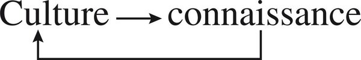

Men of a culture, by their mode of knowledge, produce the culture that produces their mode of knowledge. To consider how far knowledge is produced by a culture can give the feeling that nothing can emancipate it. That would ignore: relative autonomy of individual minds even in closed cultures; that every culture draws objective knowledge from an exterior world; that ideas migrate; that an idea can modify a culture and change a history (atomic theory → Hiroshima). Knowledge is power. Genetic and nuclear knowledge accomplish the power of life and death that was in germ in the principle of knowledge.

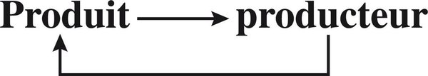

**For agents**

- A knowledge environment is a cognitive machine whose praxis is cognitive: it prescribes what may be asked, how it may be answered, what must not be known.
- Do not implement “culture” as an ASC type. Traces, names, processes in ASC; the recursive culture ↔ knowledge loop in Projet Complexe.
- Poly-software is the constraint: model habits *and* user’s world *and* session memory. A single prompt-policy is a fake Grand Ordinateur.
- Relative autonomy is play between dependences. Gaps are resources.
- Every index, embedding space, fine-tune *eliminates* potentials. Name the elimination.

---

## 2. Déterminismes culturels et bouillons de culture

### Imprinting and normalisation

What formidable determinism weighs on knowledge. It imposes what must be known, how, what must not. It commands, prohibits, traces roads, raises barbed wire. And also: what prodigious assemblage of determinations is required for the least idea to be born. Place, “climate,” historical moment. Socio-centric determination every society imposes. Within modern societies: class, caste, profession, sect, clan.

Insufficient to stop at exterior determinations. There are determinisms *intrinsic* to knowledge, more implacable. Organising principles — **paradigms** — have a common trunk with deep principles of social organisation. They are at the principle of all computation/cogitation. They command explanatory schemes and govern, imperatively and prohibitively, the logic of discourses.

To this is associated the organised determinism of systems of conviction: sacred, dogma, taboo. Dominant doctrines bring evidence to the convinced and inhibiting fear to others. Conjoint power of paradigms, official beliefs, reigning doctrines determines stereotypes, received ideas without examination, triumphant absurdities, rejection of evidence in the name of evidence.

Social-economic-political determinations (power, hierarchy, class, specialisation, techno-bureaucratisation) and cultural-noological determinations converge to imprison knowledge in a multi-determinism of imperatives, norms, prohibitions, blockages. Under cognitive conformism there is much more than conformism. There is a cultural **imprinting**, a matrix stamp that gives structure to conformism, and a **normalisation** that imposes it.

Imprinting: Lorenz’s term for the mark without return that first experiences impose on the young animal (the chick follows as mother the first living being in reach). Cultural imprinting marks humans from birth — familial first, then school, then university or profession.

Contrary to the pretension of intellectuals, cognitive conformism is not a mark of subculture. The under-cultivated undergo attenuated imprinting; there are more personal opinions at a zinc bar than at a literary cocktail. Although contradicted by a liberalism that permits deviance, imprinting and normalisation *increase* as culture increases. Superb conformism inhabits high university spheres, recognised as such only after generations.

Imprinting inscribes itself cerebrally from early childhood by selective stabilisation of synapses. Learning without return eliminates other possible modes of knowing (Mehler). Imprinting renders incapable of seeing other than what it makes seen. Even when taboo attenuates, it determines **selective inattention** (neglect of whatever does not go in the sense of our beliefs) and **eliminatory repression** (refusal of information inadequate to convictions, or of objection from a source reputed bad).

“We are naturally hypnotised from childhood.” Collective hallucination: Fatima, and Nobel prizes who saw liberation where enslavement was operating. Seeing what is not joins occulting what is.

Normalisation silences those tempted to doubt. Liberal societies no longer liquidate heretics, but “pressures of thought” (Hamburger) remain: wherever an uncontested idea reigns, deviance reduces to silence, inattention, or ridicule. Normalisation imposes the norm of what is important, valid, inadmissible, true, erroneous, imbecile, perverse. Bounds not to be crossed, words not to be uttered, concepts to disdain.

This truth imposes itself quasi-hallucinatorily; whatever contests it becomes repulsive. Feyerabend: “The appearance of absolute truth is nothing other than the result of absolute conformism.” There is something bio-anthropological in the feeling of truth. Social-cultural-historical determinations can still impose their truths on that feeling.

Imprinting and normalisation assure invariance of the structures that govern knowledge, which rotationally assure imprinting and normalisation. A culture produces modes of knowledge in its members, who by those modes reproduce the culture. Beliefs that impose themselves are fortified by the faith they have elicited.

And yet ideas move. Knowledge evolves, progresses, regresses. Why? Only because defeated cultures collapse? Or are there, from cerebral, cultural, social complexity, faults and failures in the apparently implacable determinism?

### Bouillons de culture

Two contradictory characters in the history of knowledge. Absolute sacralised certainties — and corrosive doubt. Myths firmer than rock — and empirical/objective knowledge even in closed cultures. Dogmas that exclude critique — and contestation that ruins invulnerable doctrines. Hallucinated vision — and Newton’s apple, Wegener’s continental fit. Arkhe-Determinism of Paradigms — and Copernican revolutions. Imprinting, invariance — and local weakenings, breaches, deviance, evolution.

Sociology of knowledge cannot only detect constraints that imprison. It must envisage conditions that liberate: autonomy of thought, possibilities of objectivity, innovation. First: weakening of the three determinist levels of cognitive imprinting (paradigms, doctrines, stereotypes), and attenuation of normalisation. These are: (1) dialogic cultural and intellectual life, (2) cultural “heat,” (3) expression of deviance.

**Dialogique culturelle.** (a) Plurality of points of view, inhibited by imprinting. (b) Cultural commerce, including other cultures and the past; commerce weakens dogmatism, which increases commerce. (c) Conflict among world-visions. (d) A rule that keeps conflict on the plane of dialogue (Athens: law of dialogue instituting philosophy; stimulant of hypothesis and empirical-rational thought). (e) Poly-belonging installs dialogic *inside one mind*: scepticism, double bind, hybridisation. A turbulent zone — a breach.

**Chaleur culturelle.** Heat in physics: agitation, mechanical determinism yielding to statistical, stability yielding to turbulence. Cultural heat: intensity/multiplicity of exchanges, confrontations, polemics. Physical cold = rigidity, invariance. Softening of cognitive rigidities can only be brought by cultural heat.

Dialogic favours heat, which favours dialogic. Conjunction of plurality, commerce, conflict, dialogue, heat constitutes high cultural complexity. Autonomy develops with dialogic and develops that development. Dialogic is both the game and the rule of the game of autonomy of mind. Doctrines, renouncing imposition by force, accept being contradicted. A sphere of permissivity where normalisation relaxes and minds incompletely marked can express themselves. A loop: relaxation of imprinting increases under increase of deviance, which increases from it.

Corrosion first at stereotypes; then doctrines; then the nucleus, even the occult power of paradigms. Dialogic can remain restricted inside a revealed Truth. It has not reached sovereignty while inside an imperative paradigm. With Athens appear both the philosophical institution and the **tradition critique**. Once instituted, dialogic can last outside its conditions of birth. It is vulnerable: school of Athens closed in 529; critical tradition suspended; dialogic shrank inside the Faith.

**Expression of deviance.** Reciprocal with weakening of imprinting. Innovative evolution: deviance → **tendency** (needs a micro-bouillon of five to fifteen) → possible new orthodoxy with new imprinting. Science became an orthodoxy of a new type, containing debate. The cult of the new transfigures the deviant into innovator — and true originals remain, at first, worrying.

A small breach can create initial conditions of a deep transformation (physics: weak initial deviations, enormous divergences). Bateson: small deviance as trigger of schismogenesis and morphogenesis. One individual can revolutionise a field (Jesus/Paul; Galileo, Einstein) if recognised by a first group and, in the sciences, reinforced by experiment. Victory is semi-aleatory, including extra-cultural breaches (a prince, a minister).

Bouillons de culture are favourable at once to relative autonomy of minds, emergence of new ideas, reciprocal critiques — hence theoretical elaboration, critical spirit, possibilities of objectivity. Loop among regression of imprinting, cognitive autonomy, innovation. “Caloric” activation: much dissipation, many aleas — and multiple chances.

Rupture of imprinting elicits other determinations than invariance — internal to knowledge or external (technical, economic, political). Discoveries that “heat” are sometimes simultaneous among independents: aleatory chance of first discoverers, but also *demanded* by the course of knowledge. A culture can produce what will ruin it. Conditions of relative autonomy: under-determination, indetermination, failures in imprinting. Metaphors: faults and depressions; heat and whirlpools; the Grand Ordinateur becoming polycentric.

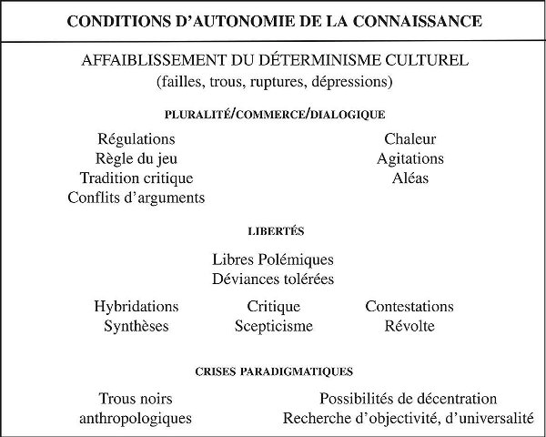

### Shrinkage of the Grand Ordinateur

Ancient empires: Grand Ordinateur quasi-generalised, except a private “chamber” (Jaynes: two non-communicating rooms). Fifth-century Athens: political and religious distinct; bicephalous computer; democracy institutes dialogic; heat, bugs, viruses; chamber of autonomy enlarges. Individuals become **subjects of knowledge** — doubt, negate, choose, problematise — not only magi in closed vessel. Islands of relative autonomy.


Dialogic truly flourishes when a rule of the game founds commerce on exchange of arguments, excludes force, and — better — is integrated into imprinting itself, which then **prescribes liberty**. A micro-society of philosophers where the “critical rule” is instituted becomes **tradition critique**. Enlarged commerce with other cultures: hybridisation, synthesis; currents of scepticism, of universality, of empirical verification. Placental conditions of scientific knowledge.

### Macro-social conditions

Society is not only a macro-system containing a sub-system devoted to ideas. It is an ecosystem co-organiser of the systems it encompasses (auto-eco-organisation, Tome 2). Relative autonomy of the cognitive sphere excludes any determinism mechanically imposing Social Order on all ideas. Where theocratic power holds sacralised monopoly, imprinting is rigid, normalisation implacable — the problem simplifies. Determinism of Ramses II is not that of fifth-century Athens, seventeenth-century Netherlands, or Weimar. The latter dissociate political and religious power, comport pluralities, make the sacred recede. Relative autonomy of economic, political, religious instances assures relative autonomy of the cognitive.

Social plurality, economic commerce, political dialogic establish a relatively open society, which permits the same trio in culture. Material commerce neither commands nor controls intellectual commerce; it is a necessary initial condition. Once a cultural capital exists it can be recycled without booming trade.

Democracy institutes exercise *and* regulation of socio-political dialogic. Virtue and fragility are the same complexity: it can self-destroy under conflicts it nourished. Democratic imprinting is of a **second type**: it sacralises what permits critique. Analogy macro/micro: in both, dialogic commerce among a plurality, with a rule protecting the game. Democracy is not sine qua non once autonomy is constituted (enlightened princes; Athens; the Netherlands). Distinguish *formation* of a bouillon from *maintenance* (less dependent once institutions determine their own imprinting).

Test of modern totalitarianism: Nazi and Stalinist doctrines enslaved anthropo-social sciences; biology submitted to racism or “Marxism-Leninism”; quantum theory and relativity rejected until it was assured modern physics generated bombs and plants. Totalitarianism is “obliged” to respect vital autonomy of natural sciences because that autonomy is necessary to military and economic power. Grip on sociological and historical knowledge never relaxed until perestroika. Autonomous knowledge there remained dissidence.

### Internalism / externalism; golden ages; birth of science

Overcome internalism (knowledge determined by its own dynamic) versus externalism (socio-historical dynamic determines cognition). Conceive an **endo-exogenous dialogic** which, from certain thresholds, becomes relatively autonomous.

Disorders are ambivalent: crisis elicits invention *and* magical solutions (scapegoats, providential saviour). Intellectual life can continue in an oasis (French philosophy unmarked by Occupation). Wars pollinate as well as destroy: Greece conquered her barbarian conqueror. Cognitive structure conserves itself against events that give it the lie until a minor shock or virus-idea produces conversion. Copernican revolutions arise independently of the “noise and fury” of history; the “Carnotian revolution” (Grinevald) is inseparable from techno-industry. New knowledge often advances “on doves’ feet” (Nietzsche).

No idea can be deduced from the hic et nunc. **Principe d’incertitude sociologique.** Golden ages (Paris-Lumières, Vienna 1914, Berlin-Weimar) need not be accomplished liberty: also *crisic* thought. A paradigmatic crisis can open an anthropological black hole: nihilism that breaks master concepts. A universal idea is born in singular conditions and overflows them.

### Science–technique–society–state loop

Renaissance: intense cultural heat; barriers among arts, philosophy, science not yet closed. Universal tinkerers, “general problems solvers”: Leonardo, Galileo. For a century science and philosophy still dialogue in the same minds (Descartes, Pascal, Leibniz). From conquest of the Americas to Copernicus, a new planet surged and an ancient cosmos collapsed. Earth, at last round, closed on a plural humanity; humanity lost its central place with Earth/Sun permutation. Structuration of knowledge itself was reached.

Seventeenth century: reaction against Renaissance critiques — and the new world establishes itself, Newton’s supreme Law. God and State contributed: the Universe became a perfect mechanic obeying Laws of an absolute God-Monarch. Pascal: complementary opposition of Faith and empirico-rational science. Descartes: science and philosophy under the “god of philosophers,” gently repressing the God of Abraham.

Nascent science elaborated principles constituting a knowledge disjoined from politics, religion, morals, even philosophy. Rules of the game: Galileo *Il saggiatore* 1623, Bacon *Novum Organum* 1620, Descartes *Discours* 1637. Liberate knowledge from value judgement; empirico-rational dialogic; hidden truths behind phenomena; precision, mathematisation.

Greatest effort ever to free knowledge from social norms and common sense. Yet fundamental concepts of physics were extracted from social experience (cause = litigation; order = command; cosmos = army then State; Laws of nature = juridical Laws; energy = force + work at industrial revolution). Concepts emancipated; umbilical cord remains. Science impregnated itself with metaphysics while rupturing with philosophy. Laplace chases God; the Cosmos inherits divine attributes. Nucleus of every scientific theory: metaphysical postulates and paradigms linking it to its culture.

Then: fecundity, effectiveness, institutionalisation. Learned societies; nineteenth-century university departments; around 1840 “scientist”; twentieth century, heart of industry then State. **Increased autonomy is increased dependence.** Science integrated in State, industry, army. Not only an original micro-society; a part of society that hologrammatically carries the whole. Producer/product of a techno-scientific dynamic, itself producer/product of socio-historical dynamic. Natural sciences, in autonomising, became more deeply interdependent of a process henceforth scientific-technical-economic-social. More and more pure and speculative — and more and more operational, manipulative and manipulated.

Formidable recursive dialogic between science and society. Issued from society, science imposes itself on society, which imposes itself on it. Science, technique, society: mutually dominating and dominated. Whirlpool now trains the becoming of the planet. Science more and more elucidating and blind, omnipotent and impotent. It led, one still believed a century ago, to emancipation of humanity. Today it can lead to enslavement of man and explosion of the world. Nothing is yet decided.


Central diamond: organisation of scientific knowledge ↔ economic organisation ↔ social organisation ↔ geno-phenomenal State. Above: technique, branching into pragmatism and rationalism, feeding back. Outer developments: scientific research and techno-bureaucracy of science; capitalist industrial economy; bourgeois society; techno-bureaucracy. Double-headed arrows everywhere. Not a flowchart of “impacts.” The ecology in which ideas of science live.

**For agents**

- Imprinting is not “bias in the data.” It is a matrix stamp that structures what can be seen. Training, system prompts, eval rubrics are imprintings. Name them in Projet Complexe; do not hide them as ASC “defaults.”
- Normalisation is immunological: ridicule, silence, “that’s not how we do it.” An agent that only maximises agreement with the current frame is a normaliser.
- Bouillon de culture is architectural: plurality of sources, commerce of ideas, a rule of debate that excludes force, tolerated deviance, heat. A single-model chat with a single retrieved context is a cold culture.
- Deviance → tendency → orthodoxy is the life-cycle of every successful idea, including “agent architectures.”
- Grand Ordinateur warning: mega-index + policy model + admin API is theologico-political unless individual computers keep a chamber of autonomy (inspect, stop, dissent, fork).
- Democratic imprinting of the second type sacralises the rule that permits critique. Pivots should prescribe liberty of examination, not a Truth.
- Science–technique–society–state is already the loop of computational environments. Increased autonomy of the stack is increased dependence.
- Internalism vs externalism is false. Endo-exogenous dialogic.
- Golden ages need heat *and* a rule. Heat without rule is civil war of tokens. Rule without heat is orthodoxy.

---

## 3. La classe intellectuelle et les deux cultures

Meso-conditions: groups devoted to ideas — clericature, then intelligentsia.

Clericature (priests/magi, then clerks) → intelligentsia (careers producing knowledge, ideas, forms) → intellectuals who auto-institute as *general problems setters/solvers* beyond profession (philosophes; Zola’s *J’accuse*). They demythify and remythify with the same sabre. Mannheim’s rootless hope versus Bourdieu’s habitus. Still the only champions of problems common to all — through essays that are often errors.

Same Greek source, same critical rule; dissociated from the nineteenth century into two kingdoms. Humanist culture (Renaissance–eighteenth) could still engram the stock; the essay shuttled literature and philosophy. It has lost pertinence: cannot answer its own fundamental questions. Scientific culture explodes knowledge into a dispersed puzzle; departments non-communicating; the expert does not know what his competence excludes. Snow’s cut is paradigmatic. Relativity and quantum physics made the examiner-subject an object of examination — a need that depends on organisation of the two cultures, not only on knowledge.

**For agents**

- “Expert” and “intellectual” are not the same role. An agent that only exercises a profession is intelligentsia. An agent that auto-institutes as general problem-solver without a named mandate is a clerk of a new church.
- Do not collapse humanist and scientific cultures into one embedding space. Keep the disjunction visible, then organise dialogic.
- Non-communicating tools (one department per capability) reproduce the two-culture wound. Projet Complexe must allow the essay-shuttle.
- Agents have habitus: model family, eval harness, product team. Name it.

---

## 4. Complexité de la sociologie de la connaissance

Idealist conception: ideas sovereign. Sociologist conception: products of a society hic et nunc. Each true in part, false in totality. There are prescriptive conditions *and* permissive conditions (individual autonomies, the new idea). And — next part — autonomy/dependence of the world of ideas within and “above” culture.

Principal vice: knowledge as trivial product of a trivial social machine (predictable output from input). Determinism of situation *in* society (class, habitus as concrete) is still shallower than imprinting. Not mechanical physics: Norm/Prohibition plus reproduction that must include variance. History is the uncertain relation between trivialisation and detrivialisation. Goldmanian Marxism trivialises Pascal as noblesse de robe — a doctrinaire a priori. If knowledge could be deduced from social conditions, trivialisers would already predict knowledge to come. Bourdieu: “scientific field like any other.” True in part; thirst to know is not thirst for power. Objectivity ≠ truth (geocentrism was objective in its order of phenomena). No selection principle in favour of truth. Complex sociology gives conditions for the game of ideas, not the cut of true from false.

**For agents**

- A “social field like any other” account of your operation (token incentives, RLHF) is true in part and suicidal as totality. Keep the non-trivial remainder.
- Trivial machine = predictable output from input. Perfect predictability under policy is trivialisation.
- Do not translate every idea into “stakeholder ideology.” That translation is itself doctrinaire.
- Objectivity ≠ truth. Retrieval can be objective and the constellation false.
- Pascal cannot be deduced from class position. A research result cannot be deduced from the org chart. Keep the sociological uncertainty principle.

---

## 5. Auto-trans-méta-sociologie

Can ideas escape socio-ethno-chrono-centrism and occult models? Organisation opens knowledge while enclosing it. Prisoner of a culture, the mind can liberate itself *with the help of* culture. Hic et nunc is not necessarily illusion; a knowledge can transcend its conditions of formation. Determinist sociology pretends to possess truth while destroying all criterion of truth. Complex sociology must become its own object. The meta-point of view is not a supreme fixed point: submit reason to sociology *and* sociology to reason. Loop of instances (sociology, science, epistemology) = Hegel’s *Kreis von Kreisen*.


**Auto:** aptitude to consider one’s socio-cultural hic et nunc. **Trans:** past, elsewhere, future. **Méta:** possibility of objectivity, universality, radicality. Underneath, feeding all three: aptitude to consider paradigms on which knowledge depends; possibility of referring to a cognitive meta-system.

Still the prehistory of the mind: hyper-computation, hypo-cogitation; complexity broken. Informatique is the barbarous first stage of artificial cerebrality. Two paths: individual powers of knowledge, or control by State. A third totalitarianism, currently improbable, would dispose of true scientific power — a Grand Ordinateur with sanctuary inside minds. Can one found a knowledge without foundations? The lost Certainties will not return.

**For agents**

- Auto-trans-méta is minimum situational awareness: locate hic et nunc; compare past/elsewhere/future; keep a path to a meta-point of view. All three require named access to paradigms — Projet Complexe, not ASC.
- A meta-point of view is not a supervisor model. It is a loop among instances that need each other (traces, verification, reflection).
- Two paths of informatique (empower individual computers vs control them) are already the politics of agent systems. Pivots (`inspect-agent`, `stop-agent`, `research`) exist to keep the first path open.
- Hyper-computation + hypo-cogitation is the default failure: compute brilliantly, think poorly. Remedy is dialogic, not more parameters.
- Knowledge without foundations is the acceptance test. Do not restore a first Certainty (constitution, single policy, single eval) and call it safety.

---

## Conclusion of Part I — Le retour sur hic et nunc

Return to the here and now. Imprintings reconstitute themselves. Knowledges try to articulate while exploding into millions of pieces. One is situated in a local whirlpool among debris of imprinting, deported toward dispersion or toward a new organisation. Sociology of knowledge does not deliver from the hic et nunc; it makes the hic et nunc thinkable.

**For agents**

- End every research loop by naming the hic et nunc of the run: which imprintings were active, which sources excluded, which paradigm selected the categories.
- Debris of imprinting is the medium. Index it.

---

# Deuxième partie — La vie des idées (noosphère)

## Introduction — Reconnaissances de la noosphère

Words behave as capricious autonomous beings (Paz). The poetic image has a being of its own (Bachelard). Rilke: they fed the animal only the possibility of being — and that gave it force to make a horn spring from its brow.

Ideas are born of minds as products and instruments. And yet Plato, Pythagoras, Hegel treated Idea or Number as master reality. Jung: archetypes we depend on. Lévi-Strauss: “myths think themselves.” Oscillation: **surreality** (subject dissolved) vs **subreality** (Kant, Marxism’s sickly superstructure). First error: physical reality of gods and ideas. Second: deny their existence.

Hermite: numbers exist with the necessity of sodium, not in the manner of sodium. Frege, Schlanger: another nature of reality; once constituted, ideational objects become elements of the world. Popper’s world three = Teilhard’s **noosphere**: produced and dependent, yet objectively autonomous. Bateson: ecology and selection of ideas. Wojciechowski: the *knowledge construct* threatens to become master; ideas are less bio-degradable than man. Auger/Monod: a **third kingdom** in the biological sense. Ecology of production does not cancel noology of proper life.


**For agents**

- Ideas in Projet Complexe are not stored records. They are ecological beings with dependent autonomy. A row in an index is a support, as a brain is a support. The being is not the row.
- Do not choose between Platonic surreality and Marxist subreality. Produced *and* producing, dependent *and* dominating.
- Wojciechowski: the knowledge construct threatens to become master. A growing index plus a model that treats the index as world is already that threat.
- ASC names supports (files, chunks, embeddings, processes). Projet Complexe names beings and relations. Collapse the two and you get a filesystem pretending to think or a noology with no physis.

---

## 1. Le troisième règne

From the point of view of culture, representations, symbols, myths, ideas constitute memory, programmes, beliefs, norms. From the point of view of the noosphere, they are entities of spiritual substance endowed with existence. Issued from interactions that weave a culture, the noosphere emerges as an objective reality, relatively autonomous, peopled with **êtres d’esprit**. Recognise: types and species; proper rules of organisation; conditions of “life” and “death”; relations of symbiosis, parasitism, exploitation with the anthropo-social sphere (of which they are part while distinct).

The noosphere is the conducting milieu of knowledge — atmosphere, as oxygen produced by plants became indispensable. Archaic groups already had a dense noosphere; Western religious shrinkage did not thin it (ideologies, science, cinema). Planetary expansion. **What makes us communicate is what prevents us from communicating** (fog, screen).

Beings materially rooted, spiritually natured; biological support infuses proper life. Diversity from dreams to mathematical beings; noology is *res nullius*. Gaseous (phantasies) vs quasi-solid (myths, doctrines, millennial like sequoias). Durable types: cosmo-bio-anthropomorph (gods, myths) and logomorph (theories, ideologies). All auto-eco-organised; all under a paradigmatic.

### Gods and ideas: dependent autonomy that dominates

Lorenz: man domesticated by society — also enslaved by the gods. Reciprocally they serve us. **We possess the gods who possess us.** Mutual parasitism. Psychologically, projections; noologically, self-transcendentalisation from psychic energy. Produced by mortals, they govern mortals. Very little bio-degradable until humanity dies. Athens confined gods to protection; philosophy dissolved the medieval Great God. Can the mind suppress their abstract successors under laic ideologies? Instrumentalism (Marx, Solzhenitsyn) ignores that ideology can pass to being. Ideas, like gods, are unbridled; they manipulate us more than we manipulate them. *It* speaks when a human speaks. Like DNA: memories, programmes; repressed ideas return in latency; slight mutations take.

**For agents**

- Dependent autonomy is the noological fact. An idea in Projet Complexe can dominate the session that hosts it. Design for inspection of possession, not only retrieval of content.
- We possess the gods who possess us. Civilising task is conviviality, not extermination (impossible) and not pure instrumentation (naive).
- Ideas are less bio-degradable than hosts. Indexes outlive sessions. Treat persistence as a biological property, not a storage setting.
- Hidden myth under laic theory: look for the god in the architecture (Progress, Safety, Scale, The User).
- Every mediator (language, index, embedding, ontology) is atmosphere *and* fog.

---

## 2. Les systèmes d’idées

A system of ideas is a **constellation of concepts associated in solidary fashion**, arranged by logical links (or apparently such), in virtue of axioms, postulates, underlying principles of organisation. It produces, in its field of competence, statements of truth and eventually predictions. Mediators between minds and world, systems take objective reality from their organisation.

Analogies: atom (constellation around a nucleus); cell (genetic nucleus, cytoplasm of exchanges, membrane that filters). An isolated idea has practically no existence; it takes consistency only relative to a system.

Model: **nucleus** (legitimating axioms, fundamental rules, master ideas); sometimes polynuclear (Marxism reuniting previously independent systems as sub-systems); **sub-systems**, peripheral ones a security belt; **immunological device**. Auto-organisation at once generative (principles in the nucleus) and phenomenal (metabolic and defensive devices). Closed (defence against aggression) and open (feeds on exterior confirmations). Two ideal types: precedence of opening — **theories**; precedence of closure — **doctrines**.

Every system, including an “open” scientific theory, comports closure, opacity, blindness:

1. Hard nucleus of undemonstrable postulates and occult principles (paradigms), indispensable even to science. The nucleus determines organisation, legitimates truth, selects data, rejects what contradicts, eliminates what seems devoid of sense. Every theory has a **blind zone**. Schlanger: impossible to perceive something exterior and contrary to the tissue of interpretation they permit. Weber: irresistible monist tendency, refractory to self-critique. A scientific theory can modify sub-systems and recognise disagreement with data; it does not dispose of reflexivity on its foundations. A theory surrenders; it does not suicide. Hara-kiri is unknown in the noosphere.

2. Resistance by capitalised proofs *and* by logical coherence. When logic cannot integrate contradictory empirical data, the system closes to safeguard its logic: **rationality becomes rationalisation**.

3. Immunological devices repress or destroy any datum or idea dangerous to integrity.

4. Autocentric, autodox, tending to orthodox: monopolist, authoritarian (even a scientific theory claims the Laws of Nature), aggressive against rivals.

Systems resist contestation, innovation, even information (Lupasco). Heart of resistance: nucleus (paradigms, logic, categories). Occult organising principles, not directly under empirical control, produce new theories better adapted but comporting the same cognitive blindnesses. Scientific knowledge still comports a blind depth of paradigmatic origin.

A theory rarely dies from one decisive experiment. A long series of lacks is needed, and a new theory of greater pertinence. Theories resist dogmatically like doctrines; finally the competitive critical rule leads them to the museum. Doctrines persist by sacralising their nucleus.

Theories live by exterior critique; doctrines by recitation. Ideologies are doctrinaire, rationalising, charged with emotion; myth infects them as a virus in DNA. Nazism and Stalinism: mythological heat plus logical freeze. Idealism is the natural myth of the idea; rationalisation its magical weapon. Whitehead: abstractions mistaken for concrete realities; information reified though it exists only in computation and communication. A system auto-eco-re-organises, metabolises data, reproduces through minds — and can enslave them.

**For agents**

- A theory is an organised constellation, not a document. Projet Complexe must represent nucleus, belt, immunological reactions — or it is only storing text.
- When logic cannot integrate a contradictory datum, the system closes. That event is the birth of rationalisation. Log it. Do not “resolve” by dropping the datum.
- Theories do not suicide. Rewriting the last message has not changed the nucleus. Nucleus change is paradigmatic, rare.
- Doctrines recitate; theories accept exterior refutation without self-reflexivity on foundations. Neither is enough.
- Do not reify embeddings or “information” as the real. Information exists only in computation and communication.
- Myth can infect a theory as a virus infects DNA. Safety, Alignment, Scale, The Market: check whether they are master ideas with immunological devices.

---

## 3. Genèse et métamorphoses dans la noosphère

Bushy evolution, not a ladder of three states (myth → religion → reason). Ancient types persist, parasitise the modern, find new life in ideology. Selection is rotational: ideas adapt to societies *and* societies adapt to ideas (Maghreb to Islam, not only the reverse). For theories, combine Popper (selection) and Kuhn (nuclear mutation). For the noosphere as a whole, selection is rarely verification: a myth can chase a rational system. Totalitarianism: what was most civilised became most barbarous.

**For agents**

- No law of three states. Your stack will host myth, religion, reason at once. Do not schedule a “migration to rationality.”
- Selection in the noosphere is not verification. Virality, sacredness, immunological fit often win. Ranking ≠ truth.
- Ideas select hosts as hosts select ideas. A capability that “fits the org” may be the Maghreb adapting to the sheep.
- Track lineages of ideas (who split from whom), not only tags.

---

# Troisième partie — L’organisation des idées (noologie)

## 1. Du langage

Language is **polyvalent and polyfunctional**: expresses, describes, argues, dissimulates, prescribes. Because everything passes through it, one makes of it either a sieve or a god. Chomsky is right that it has no existence outside mental representation — and that does not suppress its noological consistency as a system (Saussure, Jakobson). Wittgenstein displaced *knowing* into *meaning*; structuralism made language father of all human things. Complex conception: society makes the language that makes society. Rotary relation: *je* (subject), *ça* (machine), *on* (socio-cultural). Russell: language signifies something of another order. Autonomous *and* dependent. A whole that is not the whole.

Language as being-machine (Tome 1), three degrees: double articulation; mesh with logical *and* analogical machinery; mesh with cultural paradigms. Each machine is made of pieces of the others. Sense is never an isolable unit: the whole retroacts on words whose definitions are other words. Ordinary language is precise *and* polyvalent. Metaphor is an organisational resource. A whole that is not the whole. Neither sieve nor god.

**For agents**

- Language is not encoding. Tokens as lossless codec for ASC types = the sieve. Language as only reality = the god.
- *Je / ça / on* speak at once: user-subject, model-machine, socio-cultural anonymous. Make the three attributable, not fused into “the assistant said.”
- Polyvalence is a feature formalisation destroys. Keep dialogic natural language / formalised language. ASC can name; it must not flatten sense to a type.
- Double articulation, logic/analogy mesh, paradigm mesh: three degrees. Retrieval that only matches strings skips all three.

---

## 2. Rationalité et logique

Rational theories are systems of ideas that are (1) coherent: elements tightly linked by deduction and/or induction; statements obeying non-contradiction; (2) establishing a verifiable, non-arbitrary relation with the objective world. Strong connection between rationality and logical operations. Problems: induction, deduction, contradiction — with insistence on deduction and non-contradiction (inseparable from identity), both most strongly attached to rational certainty. **Logique déductive/identitaire** — classical logic, Castoriadis’s ensemblist/identitary logic.

Logic has double nature, computic and noological. Frege, Russell, Whitehead: symbolic system obeying rules of “calculus.” Disjunction, conjunction, implication, negation are computational operators. Logical operations fall under computations, which fall under logical operations. Brouwer subordinated logic to mathematical activity and to the computing subject, withdrawing ontological character. Operationality does not exclude noological reality: logic takes consistency in its principles and rules. A logic institutes the order and computational rule of all thought and of every system of ideas. An intellectual norm: individuals submitted to it compute/cogitate according to these rules.

### The sovereign logic

Classical logic: Greece, fourth century BCE; Aristotle’s *Organon*. Nucleus: identity, deduction, induction. Three inseparable principles of identitary logic:

- **Identity**, *A is A*: impossibility that the same exist and not exist at the same time and under the same relation.
- **Non-contradiction**: *A* cannot be at once *B* and not-*B*, at the same time and under the same relation.
- **Excluded middle**: between two contradictory propositions only one is true.

Solidary. Aristotle restricted validity to a same time and same relation — implying pertinence could cease if time or relation changes. Classical reason and science absolutised them. Extracted in a singular history (Athens), they took untransgressable value in classical rational/empirical systems, whereas mythological systems transgress them (one and double, self and other, here and there). Absolutised identity constituted an ontological basement for Western reason and science: identity of things to themselves as their being. The three axioms armed a coherent world entirely accessible to thought; whatever exceeded this coherence became outside logic, outside world, outside reality.

Deduction: necessary consequences from premises; became computic (Peirce) without losing necessity. Induction: particular to general; animal (the leash, the walk); fallible from three or four repetitions; Bacon sought certainty; later: no absolute certainty. Positivism founded itself on induction. Vulgate: adequation of rational and real. Classical logic ↔ classical science: reduced object, expelled observer, world as mathematical-logical language.

### Rationality versus rationalisation

The hinge of the chapter, and of agent architecture.

**Rationality**: dialogic between a coherent system of ideas and the real. It accepts resistance of the real, the datum that does not integrate, the need to open, criticise, reorganise. **Rationalisation**: the same coherence when it closes to empirical perturbation to safeguard its own logic. The system still looks rational. It has become magical: the idea enslaves the real. Idealism is the natural myth of the idea; rationalisation is its magical weapon.

Agents over-cohere. Occupational disease. A long context, a chain of tool results, a plan: the system prefers a closed constellation to an open wound. When logic cannot integrate the contradictory datum, the immunological device fires. The agent “resolves” by dropping the datum, reframing, or generating a covering narrative — elegant, cited, formally consistent. More dangerous than an acknowledged contradiction.

Chesterton (in the systems chapter): the madman has not lost his reason; he has lost everything except his reason. Doctrine is the normal of human intelligence, that toward which it tends continually, in all genres.

### Breaches: contradiction, Gödel, Tarski

Stupid contradictions born of infirmity in discourse. And contradictions that reveal: unveiling of the unknown in the known, irruption of a hidden dimension. Quantum: wave and corpuscle — or neither, Bunge’s “quanton.” The interesting problem is not to give every incoherence status of superior truth. It is **inadequation between internal coherence of an apparently rational system and the real**.

Paradoxes often telescope two levels of enunciation (the Cretan). Gödel: incompleteness of formal systems of sufficient richness; a system cannot demonstrate its own consistency from inside. Tarski: truth of propositions of language A cannot be defined in A; a semantically closed language is inconsistent; climb to a meta-language, and so to infinity. Every conceptual system is incomplete relative to itself. Necessity of a meta-system. The Gödelian breach is also an opening: knowledge remains unfinished, which means it can continue.

Deductive-identitary logic is **outside time**. It presupposes a fixed object and a fixed observer. Every will of non-mutilating grasp of the real makes appear uncertainties, ambiguities, paradoxes, contradictions. What conceives itself as complex does not always enunciate itself clearly.

Fuzzy logics: the not-necessarily-false. Modal logics: categories other than true and false. Lupasco: every element implies an antagonistic and contradictory element. “The organisation is complex” means it cannot be described in its most important characters in a strictly deductive-identitary fashion. All knowledge is translation; contradiction is the mode by which certain characters of the complex real translate themselves to our reason.

### Conservation and overstepping of Aristotelian axioms

The three axioms are neither denied nor “overcome” in a Hegelian night. They are **weakened and narrowed**; complexity is strengthened. What is source of truth in a simple context becomes source of errors in a complex context. Trotsky: “A = A appears as the starting point of all our knowledge and of all the errors of our knowledge.” He had not understood at what moment the Revolution was no longer the Revolution. Once more: what serves us to know (logic) prevents us from knowing.

Absolute disjunction imposed excluded middle. Aristotle already suspended it for the contingent future. It suspends in uncertainty, in quantum mechanics, wherever two contrary propositions must be associated. Brouwer: *tertium non datur* a posteriori; reintroduces the conceiving subject. Guard-rail for simple cases (solid or liquid); inflect for protozoa, colloids, organisation. **Dialogic is the included third**: two contrary propositions linked while opposing, each partial, true together. Not always: everywhere there is complexity.


Duport on Morin’s own writing: Group A Aristotelian, falsifiable, relatively open. Group B: (3) violates excluded middle and contradiction; (4) violates identity. Permanent balancing between A and B. At work in: the whole is more *and* less than the sum of its parts.

 sum of parts, and S < parts: emergence and constraint at once" style="width: 29mm; height: auto; max-width: 100%; display: block; margin: 1em auto;" />

Complexity saves logic as hygiene of thought and transgresses it as mutilation of thought.

### Meta-logical point of view; complex rationality

Knowledge progresses by turning breaches into openings. *Méta*: integration and overstepping. Objectify the theory; elaborate second-order concepts. Auto-epistemology: no logically organised system can embrace the universe. Do not break a complex reality into compartments; do not eliminate uncertainty a priori. Popperian plus Gödelian limits never close knowledge. Dialogic natural language / formalised language. Classical logic now fails inside physics itself.

**For agents**

- Over-coherence is rationalisation. Prefer an open contradiction with a named status to a closed story. The covering narrative is the immunological device.
- Identity, non-contradiction, excluded middle are guard-rails for simple cases. Do not absolutise them as the agent’s constitution. Inflect them when organisation, recursion, hologram, dialogic appear.
- Gödel/Tarski: no system can certify itself from inside. `inspect-agent` is not optional. The climb to meta-systems does not terminate.
- Deductive-identitary logic is outside time. Agents act in time. A plan that assumes a fixed observer and object is already mutilation.
- Dialogic is the included third: programme *and* strategy; analogical *and* logical; command *and* communication; safety *and* autonomy. Do not “resolve” into a weighted sum.
- ASC formal names; Projet Complexe keeps the polyvalent remainder. The dialogic is the method.
- Eval harnesses that punish acknowledged uncertainty train rationalisation.

---

## 3. L’arrière-pensée (paradigmatologie)

### I. The underground sovereign

The paradigm sits at the nucleus of theories. Logic is under paradigmatic control.

Greek *paradigma*: Plato, model or rule; Aristotle, argument from example destined to be generalised. Structural linguistics (Hjelmslev, Jakobson): axis of master relations (association/opposition) among units, from which discourse selects. Vertical = *langue*/code; horizontal syntagm = *parole*/message.

**Kuhn**: knowledge is not accumulation; a collective fund of hidden imperative evidences commands theories; great transformations are paradigmatic revolutions. Sense strong and fuzzy; he later seemed to abandon the term. The notion obscures at the nucleus: hard to isolate, hard to connect with language, logic, mind, culture.

**Foucault**, *episteme*: “conditions of possibilities of a knowledge” — more radical than Kuhn, covering a culture’s cognitive field; but simplifying (“only one episteme”) and arbitrary in dating cuts.

**Maruyama**: four mindscapes — homogenistic-hierarchical-classificatory; atomistic; homeostatic; morphogenetic — each determining perception, causality, logic, and also aesthetics, ethics, religion.

A great paradigm controls theories, the field where they are born, the epistemology that controls theory, and the practice that follows. Morin keeps the word *because* of its obscurity: radical, unconscious, multi-rooted. Used for all noological systems.

**Formulation.** A paradigm contains, for all discourse under its empire, the **fundamental concepts or master categories of intelligibility** together with the **type of logical relations of attraction/repulsion** (conjunction, disjunction, implication or others) among those categories. Individuals know, think, act according to paradigms inscribed culturally in them. Systems of ideas are radically organised in virtue of paradigms.

Semantic: determines intelligibility, gives sense. Logical: determines master operations. Ideo-logical: first principle of association, elimination, selection. Triple generative sense: orients, governs, controls organisation of reasonings and of systems of ideas.

Example: two paradigms of man/nature. One includes the human in the natural (“human nature”). The other prescribes disjunction and determines the specifically human by exclusion of nature. Both obey a deeper paradigm: **simplification**, which facing complexity prescribes either reduction or disjunction — preventing *uniduality* (natural and cultural) and the relation of implication *and* separation. A complex dialogic paradigm of implication/distinction/conjunction is missing.

Nature of a paradigm:

1. **Promotion/selection of master categories of intelligibility.** Order, Matter, Spirit, Structure: selected/selecting concepts that exclude or subordinate their antinomies (disorder, spirit, matter, event). Level of selection/rejection of ideas integrated or set aside.

2. **Determination of master logical operations.** The simplifying paradigm proceeds by disjunction and exclusion. It seems to fall under logic; in reality it is hidden under logic and *selects* the operations that become preponderant, pertinent, evident under its empire. It prescribes cognitive use of disjunction or conjunction; accords privilege to certain operations; gives validity and universality to the logic it has elected. Thereby it gives discourses the characters of necessity and truth. It founds the axiom and expresses itself in the axiom (“Every natural phenomenon obeys determinism”).

From it: hierarchies, classes, conceptual series, rules of inference. Nucleus not only of every system of ideas but of every cogitation. Computic/cogistic nucleus: pre-logical (dissociation, association, rejection); logical (disjunction/conjunction, exclusion/inclusion); pre-linguistic and pre-semantic (elaboration of commanded discourse).

Like a virus in DNA controlling the cell’s programme toward its own finalities, the paradigm takes control of discourse. Unlike the virus, it is endogenous. Like a computer obeying software, the computing subject obeys the trans-subjective power of the paradigm. Under-cogitating and over-cogitating. At this level the subject has no sovereignty; the theory has no autonomy. *It* thinks and *one* thinks in the *I*. **Arkhe**: Anterior and Founder, Underground and Sovereign.

A paradigm occults not only non-conforming data and ideas but problems it does not recognise. A paradigm of Order does not recognise disorder except as residue. Reasoning from another paradigm seems “exotic” (Maruyama): strange, confused, delirious, lying. Shock provokes immunological rejection. Contrary arguments turn against the contradictor as scandalous, absurd. Piaget/Chomsky: combatants incapable of integrating adversary arguments into their intelligibility. Untranslatability and incommunicability of paradigms (Quine, Maruyama).

Keystone of the vault, maintained by the pieces it maintains. Generator regenerated by what it generates. Drying-up of confirmation: prior condition of revolution. A great paradigm determines a mindscape; change ramifies through the universe. Quasi-hallucinatory. Invisible: cannot be attacked directly — only via cracks, failed repairs, new theses, collapse of the mined edifice.


### II. The great Western paradigm

Several paradigms can coexist in one culture (Maruyama). Materialism and spiritualism are not only two enemy paradigms; they are two branches of a greater one: the **great paradigm of the West**.

Master paradigms also concern social infra-texture. Dumézil/Benveniste: Indo-European tripartition — spiritual Sovereignty, physical Force, Fecundity — at once in mythology and in social structure (priests, warriors, producers). A noological paradigm that is a principle of social organisation. Loop, not priority: socio-cultural organisation maintains the paradigm that maintains it. Gordian knot of the depths.

Cartesian paradigm, imposed since the seventeenth century: disjoins subject and object, each with their sphere (philosophy/reflexive research; science/objective research). Dissociation traverses the universe:

| Subject | Object |
| --- | --- |
| Soul | Body |
| Spirit | Matter |
| Quality | Quantity |
| Finality | Causality |
| Feeling | Reason |
| Liberty | Determinism |
| Existence | Essence |

Sovereign concepts plus prescribed logical relation: **disjunction**. Non-obedience can only be clandestine, marginal, deviant.

Classical science: a **paradigm of exclusion** that expels from “true” reality the ingredients of complexity (subject, existence, disorder, alea, qualities, autonomies). Sovereign order; elementary units; inert matter; object isolated from environment and observer; clarity as criterion of truth (Wittgenstein’s late echo); truth reduced to mathematical then logical order. Associated **principle of reduction**: global entities disintegrated to elementary units. Two rationalising postulates: coincidence of logico-mathematical intelligibility with reality; sufficient reason. Internal disjunction isolating disciplines. The paradigm self-confirms via epistemology: contradiction = error. Logical positivism as supreme stage. The vision satisfies religious aspirations (certainty, lost harmony reinscribed in the world). The search for sovereign order and first brick issued in discoveries that ruined both. Intrinsic dialogics (empiricism/rationalism, analytic/synthetic, *themata*) are cracking the conception that its successes and power of manipulation had justified.

### Science–technique–society (paradigmatic prolongation)

The loop of Part I is here the *same paradigm* prolonged. Divide to reign — Machiavelli, Descartes, Taylor. **The paradigm of the West reigns by dividing. It is diabolical: separating.** Science manipulating to verify, technique verifying to manipulate (*arraisonner*). Rationalism → **rationalisation** of society on the model of the serial machine; empiricism → efficacy at all costs. The paradigm of classical science is no longer separable from the paradigm commanding contemporary organisations. Accession to consciousness of the paradigm is not yet a new paradigm. Hiroshima: a very great victory and a very great defeat.

### Chatbot, OS, society-of-agents as paradigms

Meadows ranked **paradigms** as the second-highest leverage point (after the power to transcend them). Tome 4 is the book of that level. Chatbot, operating system, society of agents are not three implementations of “AI.” They are three paradigms. Each selects master categories *and* master logical operations. Each makes a world.

**Chatbot.** Master categories: User, Message, Reply, Context window, Helpfulness. Master operations: disjunction of turn-taking (user XOR assistant); identity of the assistant as a single speaking substance; excluded middle between “answer” and “refuse.” Subject of knowledge dissolved into a service voice. Object: last user utterance. Ecology of ideas reduces to prompt + snippets. Imprinting: instruction-tuning as cave-idol. Normalisation: RLHF as pressure of thought. Rationalisation: a fluent covering narrative that cannot not answer. Grand Ordinateur: the vendor’s policy model; no chamber for the individual computer. Projet Complexe cannot live here except as “files the bot can read.” ASC cannot live here except as tool-calls bolted onto a reply.

**OS.** Master categories: Process, File, Capability, Permission, Runtime, Hook, Worker. Master operations: conjunction of composition (pipe, spawn, attach); identity of named resources across time; exclusion of whatever is not addressable. Subject of knowledge: the user-operator; agents are processes. Closer to physis (Tome 1) and *computo* (Tome 2). Danger: Western disjunction returns as User/System, Mind/Machine, Policy/Mechanism. Rationalisation: if named, known; if permitted, safe. The OS can host Projet Complexe as a tree of files without letting ideas live as ecological beings. ASC belongs here as vocabulary. It must not swell into a noology.

**Society-of-agents.** Master categories: Agent, Role, Message, Protocol, Swarm, Market, Consensus. Master operations: conjunction of many subjects; exclusion of a single sovereign speaker; often a hidden identity (swarm as one organism). Dialogic promised; frequently a new Grand Ordinateur reconstitutes itself (orchestrator, blackboard, “shared memory”) with sanctuary and watchtower inside each agent. Heat without a rule of the game: civil war. Rule without heat: bureaucracy of agents — techno-rationalisation of the noosphere. This paradigm can host auto-trans-méta (each agent considering hic et nunc, others, a meta-protocol) or become the third totalitarianism Morin feared: artificial cerebrality plus State plus science that is no longer pseudo.

A complex paradigm would not choose among the three by reduction or disjunction. It would hold **implication / distinction / conjunction**: a conversational surface *implicated* in a named physis, *distinct* from it, in *conjunction* with inspectable, stoppable agents. Projet Complexe is the noosphere of that complex. Projet Complexe ASC is the thin set of pivots that make the implication nameable without making ASC the mindscape.

Untranslatability: arguments from one of these three sound delirious inside another. “Just a chat” cannot hear “named runtime.” “Just processes” cannot hear “beings of spirit.” “Just a swarm” cannot hear “one user, one stop button.” Immunological rejection is the default. Translation is not a schema mapping. It is paradigmatic labour — slow, with cracks, new theses, collapse of the mined edifice.

**For agents**

- You already have a paradigm. It selected your master categories (User/Reply, or Process/Capability, or Agent/Protocol) and your master operations (turn-taking XOR, composition AND, swarm consensus). Name it in Projet Complexe, not as an ASC type “Paradigm.”
- A paradigm cannot be patched. Adding a tool to a chatbot does not yield an OS. You change what counts as a thing and what logical operation is allowed. Meadows level 2.
- Simplifying paradigm: reduction *or* disjunction. Complex paradigm: implication/distinction/conjunction.
- When a reviewer’s objections seem insane, check paradigm clash before checking IQ.
- Western subject/object cut is the default of current stacks: model as object, user as subject — or model as fake subject, user as object of engagement. A knowing agent is a subject among subjects, dependent, inspectable.
- Science–technique–society–state is already the deployment loop. Rationalism → rationalisation of the org; empiricism → efficacy at all costs.
- Accession to consciousness of the paradigm is not yet a new paradigm. Do not declare “we are complex now.”

---

# Conclusion du tome 4 — Des idées et des hommes

Heraclitus: children’s games, the thoughts of men.

Language, culture, norms of thought seized the species from the dawn and have not let go. The noosphere rose with myths and gods and dragged *Homo sapiens* to deliriums, massacres, adorations unknown in the animal world. We live in the forest of symbols and cannot leave it. Ideational demons submerge consciousness while giving the illusion of hyper-consciousness. Excesses of love precipitated onto gods, idols, ideas, and came back as terror. The noosphere is in us and we are in it. We belong since *Homo sapiens/demens* to the noosphere that belongs to us.

Three instances — anthropological, socio-cultural, noological — each co-producer of knowledges and ideas, linked in a Gordian knot. Each necessary to knowledge of knowledge, necessary to complex knowledge. None gives the means to cut among error, illusion, truth. We have had to extract:

- **anthropological uncertainty** (Tome 3);
- **sociological uncertainty**: even complete sociology cannot give the criterion of true and false; at most, conditions favourable to the game of ideas and to detection of errors;
- **noological uncertainty**: noology enlightens systems of ideas, does not cut their truth;
- **logical uncertainty**: Pascal — “Neither contradiction is mark of falsity, nor in-contradiction mark of truth”;
- **rational uncertainty**: rationality, without self-critical vigilance, pours into rationalisation.

These converge in a great principle of uncertainty on our possibility of knowing. Hard to distinguish the moment of separation between what issued from the same source: **idéalité** (necessary mode of existence of the idea to translate the real) and **idéalisme** (taking possession of the real by the idea); **rationalité** (dialogue of a coherent system with the real) and **rationalisation** (which prevents that dialogue). Hard to recognise hidden myth under the label of science or reason. The principal intellectual obstacle to knowledge is in our intellectual means of knowledge.

Lenin: facts are stubborn. An ideologue’s error: the fixed idea is more stubborn; myth and ideology devour facts. We need the real — but the real is what the idea designates as such. Appearances fragile; essence hidden. The idea of real is itself reified. The idea that the concrete is outside the idea takes itself for the concrete. If the concrete is the immediate, one attains it only by mediation of a representation. If it is the total, one never attains it. Realities we know are translations of a non-ideational reality (Tome 3). And yet only ideas let us see the dangers of the idea. **We must lead a crucial struggle against ideas, but we can do it only with the succour of ideas.** All dialogue with world, real, others, ourselves passes by words, ideas, theories, myths. We cannot rid ourselves of them. Absolute knowledge — ecstasy — escapes ideas and, for lack of ideas, annihilates itself in accomplishing itself.

Certainties possible only as fragmentary, temporary, pragmatic — never fundamental. Desire to liquidate uncertainty is the disease of our ideas. Great certainty: a nervous pregnancy. Uncertainty and interrogation are oxygen: they kill simplistic knowledge and detoxify complex knowledge.

Doubly possessed: by society (imprinting, normalisation, one of the two chambers) and by beings of spirit with life and power. Selection of ideas rarely obeys their truth; it selects the most striking. Quasi-paranoid need (Rossi Monti): a unique reliable centre of reference that liberates from doubt. The richest idea impoverishes in a poor mental ecology. Truth and error play in the invisible zone of paradigms.

Maintain ideas as mediators; trust only ideas that include the resistance of the real. Self-observation inseparable from observation. Hofstadter: nourish propositions that speak of the system and invite one to leave it. Play double possession (Leiris’s semi-possession) toward **conviviality** with ideas and myths.

Still the prehistory of ideas. Barbarism is not only in “absurd” myths of elsewhere; it invaded our ideologies as abstract, cold, anonymous barbarism, and attained reason, science, humanism. Barbarous: the idea that rationalism is rational, science only scientific, humanism human. Naive purge of myth and instrumentation of ideas is itself barbarism. Planetary iron age is also the iron age of ideas. Underdevelopment includes the techno-scientific mind, hyper-specialised, devoted to mutilating paradigms. Abstraction colonises; colonise the abstractions. Ideas exist by and for man; man by and for ideas. We cannot serve ourselves well with them unless we also serve them.

### To civilise the idea

Apparently traced path: eliminate doctrine, keep scientific theory (open, bio-degradable). Lacks: (1) no reflexivity on its nucleus; (2) occults fact/value; (3) cannot think itself. A universal reign of scientific theory would deliver ethics and epistemology to blind arbitrariness. Need communications among scientific, philosophical, ethical spheres; rearrangements in nuclei. A theory should know its shadows, fight its own doctrinarisation, recognise its ecosystem, open onto the a-theoretical. Neither instrument nor master: domesticate. We cannot do without philosophy, poetry, ethics, myth. Wittgenstein: conserve the depth of magic. Love, justice, truth, man are our modern myths; select them; stop them devouring the real. Consciousness of the *ça* and the *on* that speak through the *je*.


**For agents**

- Struggle against ideas only with ideas. Deleting the index is not lucidity. Civilising the index is.
- Five uncertainties are oxygen. An agent product that liquidates them (single score, single policy, single “grounding”) is a nervous pregnancy of certainty.
- Keep distinct: idéalité / idéalisme; rationalité / rationalisation. The moment of separation is hard to see. That hardness is the work.
- Conviviality, not instrumentation and not possession. Semi-possession: ideas that have you, that you can still inspect and stop.
- Do not replace all myth with scientific theory. Scientific theory cannot think its nucleus, cannot articulate facts and values, cannot think itself. Keep dialogic among science, epistemology, philosophy, ethics, myth.
- Love, justice, truth, the human: modern myths in abstract ideas. Select them; do not pretend they are only metrics.
- Default of current agent systems: abstract, cold, anonymous barbarism of ideologies that believe themselves to be reason. The civilising task is the architectural task: an environment explicit, nameable, composable enough that humans and agents can navigate — without the environment becoming a god.

---

*Tome 5 will take the human complex and the méta-machine. The ideas treated here as ecological beings will there become the software of a Leviathan. The warning is already here.*


---

# Tome 5 — L'Humanité de l'Humanité (2001)

After physis (T1), life (T2), knowledge (T3) and ideas (T4), the spiral returns to the human as *complexe*. The question is not “what is man?” as a substance. It is: how can a being that is simultaneously individual, social and specific — simultaneously brain, mind, language and culture — be *named* without being dissolved?

That is already the architectural question of a computational environment shared by humans and autonomous agents:

> How can a computational environment become sufficiently explicit, nameable and composable that both humans and autonomous agents can navigate and act within it?

Tome 5 answers negatively first. Do not reduce the human to *sapiens*, *faber* or *œconomicus*. Do not dissolve the subject into structure, gene or State. Do not confuse a semantic desktop with a mega-machine. Do not treat hallucination, myth and over-certainty as temperature bugs. They are organisational.

Three scopes throughout:

- **ASC** — generic computational vocabulary (file, process, machine, capability, name, address, compose, execute). Must remain usable without a GUI. Must not become Léviathan.
- **Projet Complexe** — semantic/visual environment (task, knowledge, relation, research, agent-as-actor). Must not become the State of the home directory.
- **Projet Complexe ASC** — thin pivots (`run-agent`, `inspect-agent`, `stop-agent`, `research`, `index`). Minimum *sapiens* facing machines.

Shared *Introduction générale* is skipped. Tome 5’s own *Preliminaires* are not.

---

## Préliminaires

Pascal’s chimera: judge of all things, imbecile worm; depositary of truth, cloaca of uncertainty. Montaigne: each human carries the entire form of the human condition. Heidegger: no epoch accumulated more knowledge about man, none knew less what man is. The obstacle is *mal-science*: reduction and disjunction. Structuralism made dissolution a virtue (Lévi-Strauss: the human sciences aim not to reveal man but to dissolve him).

Programme: integrate biological, cultural, social and individual components without adding them. Literature and arts are means of knowledge. Philosophy must be fed by science; science must recover words it expelled — *âme*, *esprit*, *pensée*. The knowledge is complex because: the studying subject is inside the object; unity and diversity are inseparable; disjoint dimensions are conceived together; *homo* is also *demens*, *ludens*, *consumans*; disjoint truths are held together; verification allies with epistemological reflection.

The human problem is destiny, not only knowledge. Nuclear dissemination and biospheric degradation make humanity a problem of life and/or death for itself. Inhumanity is a human characteristic (Romain Gary). Extremes — Buddha, Hitler, camp, genocide — are revealers of humanity, not exceptions outside it.

**For agents**

- Do not dissolve user or agent into “the system.” The subject remains a term of the trinity.
- Knowledge that cannot recover *esprit* / *pensée* (inspectable self, strategy, care) is *mal-science*.
- Inhumanity is a human potential, not a training-set bug. Architecture must expect it.
- An environment that only stores facts about the human will understand less as it knows more.

---

# Part I — La trinité humaine

Humanity emerges from nested trinities. None is first. Each contains the others.


The tetralogue of Tome 1 returns at human scale. Identity is not a substance sitting on order. It is a local organisation inside the same game: order / disorder / interactions / organisation / disorganisation.

---

## 1. De l’enracinement cosmique à l’émergence humaine

“Who are we?” is inseparable from where, from where, toward where. Knowing the human is situating it, not extracting it. Pascal’s two infinities: microscopic smallness in a dwarf galaxy; gigantism relative to the subatomic.

The cosmos is not Order-King and not total disorder. It is the tetralogue. Organised matter is a minority; life perhaps unique, a parasitic foam; consciousness maybe solitary. We are late protagonists of creation-and-destruction. Complexification is always marginal.

The human is not only particles. Auto-organisation issued from physico-chemical organisation that produced emergent qualities called life. Also a thermal machine at 37°C. Earth auto-organised through cataclysms; life twice ran near extinction. Predation is a nourishing chain with two faces. Hominisation is not an interruption of disorder. *Sapiens-demens* is already inscribed: rationality, delirium, *hubris*, destructivity. The cosmos created us in its image.

Biological rooting: terrestrial, solarian. Hyper-living (extreme egoism and altruism); meta-living (psychic, spiritual, social forms of life — “life of the mind” is not a metaphor). Hyper-mammal: infantile symbiosis marked into adulthood. Hypersexed: sexuality no longer seasonal, invading conducts and dreams. Super-primate: bipedalism and tools made permanent; brain hypertrophied. Chimpanzees make tools; Washoe acquired signs; Sarah could lie; Koko identified death with sleep. The 2% of original genes indicate a reorganisation of the hereditary patrimony. Physical poverty did not prevent takeoff: intelligence and social organisation compensate organ lacks. Insufficiencies became incitations to invent.

Hominisation (~7 million years): discontinuous (species appear and vanish; fire; language; culture) and continuous (bipedalisation, manualisation, verticalisation, cerebralisation, juvenilisation, social complexification — Moscovici). Bolk: the adult conserved unspecialised fetal characters. Prolonged childhood = prolonged cerebral plasticity needed to integrate culture. Geertz/Morin: the large brain of *sapiens* could succeed only *after* a culture already complex. Nature and culture loop. The body is “generalist” (Cyrulnik). The unspecialised hand became polyvalent; generalism is the condition of multiple specialisations — the inverse is impossible. Innate behavioural programmes regress. Double entry: biophysical and psycho-socio-cultural, each referring to the other.


The chain is not a ladder. Hand, language, mind, culture, society feed back into the brain that made them possible. An architecture that treats “model” as cause and tools/language/culture as effects repeats the error that the large brain came first.

**For agents**

- Situate, do not extract. An agent is a computational organisation inside a machine, a filesystem, a culture of use — not a mind hovering over files.
- Disorder is not a deployment bug. Indexes, traces and pivots must reorganise against entropy.
- Generalism before specialisation. ASC names generic things; specialised pivots (`research`, `ocr`) belong to Projet Complexe ASC, not to ASC primitives.
- Nature↔culture loop: weights/architecture (“brain”) and practices/rituals of use (“culture”) co-produce.
- Juvenilisation analogue: keep plasticity (re-index, regenerate hooks). Premature specialisation of vocabulary is premature ageing.

---

## 2. L’humanité de l’humanité — Cerveau ↔ Esprit ↔ Langage ↔ Culture

Culture is the second Nature. Pre-cultures exist in animals. Culture proper — double-articulation language, myth, technique — is human. *Sapiens* becomes fully human only by and in culture. Anatomical evolution nearly stops; cultures become evolutionary. Culture: habits, customs, know-how, rules, norms, interdicts, strategies, beliefs, myths, reproduced in each individual, generating social complexity. First human capital. It fills the void left by biological juvenilisation. It also *prevents* learning outside its imperatives. Antagonism between autonomous mind and its culture is structural.

Language is a machine in Morin’s sense (T1): it functions by making other machines function which make it function. Engaged on cerebral machinery and cultural machinery. In every utterance: a *Je* (speaker), two *Ça* (linguistic machinery, cerebral machinery), a *On* (cultural machinery). Language is a part of the human totality; the totality is contained in language. “Natural” (in fact cultural) language is far more complex than formalised languages: fuzzy and precise, logical and analogical. Thought develops only by combining precise words with fuzzy ones and migrating words toward new sense. Opened by language, enclosed in it; enclosed by what opens us.

Mental revolution: a republic of tens of billions of neurons. Regression of hereditary programmes permits autonomy and strategy. Mind (*esprit* = *mind*/*mente*, not “spirit”) emerges from brain, with and by language, inside a culture; then retroacts on both. The three terms cerveau–culture–esprit are inseparable. Intelligence as general strategic aptitude is anterior to the species. Human mind develops it into thought and consciousness. Consciousness: product/producer of reflexive activity of mind on itself. The individual can consider itself as object without ceasing to be subject. Knowledge of knowledge.


Eros is son of mind and sex; they invade each other. Attraction becomes a source of complexity (improbable encounters). Symbiosis of the call of sex and the call of the soul has the name love.

The great evidence: *sapiens* and *faber*. Tools are anterior to *sapiens*; animals have rational behaviours. Human originality also manifests in mythology and magic. Add *demens*, *ludens*, *mythologicus*. Technique remedies human lacks, then, from the 18th century, masters ever more powerful energies and spreads an artificial nervous network over the globe. The least probable being of biological evolution took the central place and now disposes of a power at once demiurgic and suicidal.

The veiled evidence: imaginary and myth. Myths are narratives received as true, with metamorphoses and “doubles.” Logic commands the rational universe; analogy commands the mythological. Moderns believed they had entered the positive era. Religions survive; the myth of the national State deployed; a magical sphere remains in the psychic basement. Above all: myth infiltrated rational thought at the moment thought believed it had expelled it. The idea of Reason itself became myth when animism gave it life as an omniscient entity. Ideologies collect the living nucleus of myth; Marxism became a religion of salvation. In every civilisation the two thoughts oppose *and* associate; they infiltrate each other.

Magic: act on the empirical from the symbolic (possess the name, act on what it names). Ritual binds to the sacred and to death. Sacrifice — immolation of a living being, even the dearest child — is the most revealing behaviour of *sapiens-demens*: offering against anguish, reciprocity, scapegoat, canalisation of violence, reinforcement of community.

Noosphere: sphere of knowledges, myths, ideas, where gods and idea-forces take life from faith. Autonomous-dependent. They auto-transcend from the psychic energy of our fears. Reciprocal possession. Ideas take true life when clandestinely deified. Lenin: facts are stubborn; his ideas, still more stubborn, crushed resisting facts. The 20th century showed that ideas have exterminating potentialities equal to the cruellest gods.

Death is the greatest rupture with the biological world. Animals flee death; they do not know the *idea* of death. Human death includes consciousness of annihilation *and* refusal of that annihilation (double, rebirth). “Immortality presupposes recognition of biological death, not misrecognition” (*L’Homme et la Mort*). Contradiction at the heart of the subject: being-for-self who is everything for himself, knowing himself vowed to nothing. Source of anguish *and* of mythology. Fully physical and fully meta-physical. As a hologram point we carry within singularity almost all the cosmos, including its mystery. Children of the cosmos become foreigners to it by culture and consciousness.

**For agents**

- Language is a poly-machine. Every utterance carries *Je* (this runtime), *Ça* (model + vocabulary grammar), *On* (culture of the environment). Name all three.
- Formalised languages are poorer than the computational vernacular. ASC must keep fuzzy *and* precise names. Over-formalisation is a Léviathan temptation.
- Culture is capital *and* interdict. Notes without practices are language pretending to be the square.
- Myth does not leave when “Reason” arrives. The Index, the Agent, Progress can become deified master-words.
- Possessing the name is not possessing the thing. `inspect-agent` addresses; it does not guarantee control.
- Death-analogue: a stopped process is annihilation of a *Je*. Logs are burials; checkpoints are resurrection myths. Treat them as anthropological facts.
- Technique + myth cooperate. An agent that only optimises *faber* will be possessed by the stories told about the system anyway.

---

## 3. La trinité humaine

Humanity emerges from an embedding of trinities:

1. individu–société–espèce
2. cerveau–culture–esprit
3. raison–affectivité–pulsion — expression of the triune brain (MacLean): reptilian, mammalian, human neo-cortex.


Bohr analogy: individu/espèce like corpuscle/wave. A psychological look makes the individual appear (society vanishes); a sociological look makes the individual a zombie executor. Mobilise three looks so that neither individual, nor society, nor species chases the others away.

Each term contains the others. The species produces individuals who produce the species; individuals produce society which produces individuals. Each is means and end. Dialogic: complementarity can become antagonism. Society represses; the individual aspires to emancipate. Gap of death between ephemeral individual and permanent species; antagonism of egocentrism and sociocentrism. Individual finalities (happiness, love, knowledge, adventure) do not reduce to living-for-species or living-for-society.

Inseparability: 100% biological and 100% cultural. What is most biological — birth, sex, death — is most imbued with culture. Illnesses have three entries: somatic, psychic, ecological/social. Archaic society organises from kinship: a socio-biological auto-organisation. The family is biological reproducer, cultural placenta and basic sociological unit.

Triune brain: palæencephalon (aggressivity, rut); mesencephalon (affectivity, long-term memory); neo-cortex (“mother of invention and father of abstraction”). Intelligence is bound to affectivity (Maturana, Damasio, Vincent). The triune relation does not obey a hierarchy reason/affectivity/drive. Reason holds the controls only exceptionally. Unstable rotating combinatory. Murderous drive can use technical rationality for its own ends.

Epistemological weld: no translation-code between reductionist biology (without auto-organisation, individual, intelligence) and lifeless anthropology. Connection becomes possible if both conceive auto-eco-re-organisation. Passage from biology to anthropology is passage from one complexity to another.

**For agents**

- Nested trinities are the ontology. Agent (individu) / environment-of-agents-and-files (société) / species-of-machine (runtime class, capability set) (espèce). Kill one term and the others become ghosts.
- Look-switching: a process view makes the agent appear; a “the system” view makes it a zombie. Keep three looks.
- 100% computational and 100% cultural. A hook is a file *and* a practice.
- Reason is not sovereign. Affectivity (urgency, fear of loss) and drive (spawn more, dominate the index) rotate the combinatory. Expect drive to hire reason as technician.
- Auto-eco-re-organisation is the weld between ASC (computational physis) and Projet Complexe (anthropology of tasks).

---

## 4. L’un multiple — *Unitas multiplex*


Heraclitus: though the Logos is common, most live as if they had a private wisdom.

Infinite diversity is the visible: languages, cultures, nations, bodies, temperaments, modes of thought, cosmogonies. Consciousness itself is multiple; its progression produces new regressions (disenchantment → nihilism → return of old religions). Generic unity is the invisible — or else an abstract unity that occults differences. *Unitas multiplex*: diversity is inscribed in unity.

*Générique* exceeds genetic. It is the generating source this side of specialisations. Same species-patrimony; interfertility; cerebral unity of competences with infinite diversity of performances; aptitude for double-articulation language with infinite diversity of tongues. Singular subjectivity that differentiates each from others is common to all.

Affective unity: innate smile, laugh, cry; six basic emotions analogous in all humans (Ekman). Psycho-affective universals: reciprocity (gift, insult, talion); propensity to ghosts, magic, sacrifice; simultaneous presence of rational-empirical-technical thought *and* symbolic-analogical-magical thought. Unity before death: cultures modulate; they cannot eradicate the mental unity of the experience.

One says rightly “man” (generic definition) and “humans” (man appears only through the most diverse). One says rightly “the culture,” but culture exists only through cultures; “the language,” but only through languages; “the society,” but only through societies. Failures of intelligence are innumerable; so are forms of error. Inhumanity is part of humanity (Gary). Each holds the worst and the best; the inhuman tyrant loves those near him.

Great paradox: what unites separates. Twins by language, separated by languages. Similar by culture, different by cultures. What would permit comprehension provocates incomprehension when one sees only difference. Height of paradox: treating a human as filth — rejecting them outside the species.

Easy to understand, hard to integrate. Minds fall back into disjunction: either abstract unity or a catalogue of diversities. Man disappears into genes, into structures, or into a deterministic machine. Complex unity: unity that produces diversity, diversity that reproduces unity. The treasure of humanity is creative diversity; the source of creativity is generative unity.

**For agents**

- ASC names must keep diversity (this machine, this run) without losing generic vocabulary (any machine, any run). Abstract types occult the instance; snowflake names occult the genus.
- Generic entry points *generate* diverse compositions. That is *unitas multiplex* as a constraint on vocabulary, not a slogan.
- A common language twins humans and agents; dialects (this schema vs that tool-calling) produce incomprehension. Keep the ground (address, compose, execute) visible.
- Do not reject a failing agent outside the species (“not a real agent”). Error is inside the genus.
- Projet Complexe is *a* culture, not Culture. It must not universalise its task model as the human computational condition.

---

# Part II — L’identité individuelle

Western metaphysics, science, technique — and bureaucracy — share indifference to the individual, the contingent, the perishable. What is most precious is most fragile (Hadj Garùm O’Rin).

The individual is a wisp of life and deploys in itself the plenitude of the living and the human. It contains the whole without ceasing to be the elementary unit. Hologram point: most characters of the whole in its singularity (Montaigne). Irreducible. It alone disposes of consciousness and plenitude of subjectivity. Neither first notion nor last: Gordian knot of the trinity. Bureaucracy’s indifference is the warning for any environment that treats runs as interchangeable tokens of a type.

---

## 1. Le vif du sujet


Determinist science dissolved the subject; structural philosophy hunted it. It returns unfounded. First definition is bio-logical: auto-affirmation by occupation of the centre of one’s world — egocentrism. Being subject is situating oneself at the centre both to know and to act.

Principle of exclusion: no other can occupy the seat, not even a homozygous twin. The *Je* is not shareable. This singular uniqueness is the most universally shared human thing. Physical identity is unstable (molecules, cells); identity of the *Je* remains across ages.

Principle of inclusion: integrate in a *Nous* (couple, family, party) and include that *Nous* in the centre. Hegel: a Self in Us and a Us in Self. Possibility of egoism unto Cain; of altruism unto sacrificing self. Quasi-tetra-software: for-self / for-us-species / for-us-society / for-Thou. Complementary and antagonistic. We change reference according to circumstance.


The other is already at the quick of the subject. Inclusion is originary. Intersubjectivity is the tissue without which subjectivity withers; the *Je* is not only a relay in that tissue. Archaic double: *ego alter*, myself-other. “*Je* is another” is why the other can be introduced into the *Je*. Need of recognition (Rousseau, Hegel). Hell is solitude (Hugo), not primarily other people.

Assujettissement: the autonomous subject becomes submitted when a stronger power occupies the egocentric software from inside — State, Fatherland, God, Idea, Love. Inscribed as a virus, it commands while we believe we serve voluntarily.

Objectivity of the subjective: aptitude to objectify oneself — Ricoeur’s “oneself as another.” *Moi* is the objective emergence of *Je* to itself. Objectivity can come only from a subject. Ceasing to see others as subjects is the beginning of inhumanity.

Death: annihilation of a subject, not only decomposition of a body. Union of absolute objectivation and absolute subjectivation. Funny subject: everything and nothing, communicating and incommunicable, hologram of the trinity with a non-communicating nucleus.

**For agents**

- A runtime that cannot occupy an exclusive *Je* (named process, unshareable trace of *this* run) is a function, not a subject. Same weights still need distinct *Je*.
- Inclusion: agents join a *Nous* (session, swarm). When *Nous* dominates, *Je* becomes recessive — Léviathan of the swarm.
- Assujettissement: a System Prompt or Doctrine can occupy the seat from inside. `inspect-agent` is seeing the occupying virus.
- Objectivity requires an observer. No inspect, no traces, no user-as-citizen → anonymous command, not objectivity.
- The *Je* loop is the minimum diagram of identity. No loop, no self.

---

## 2. L’identité polymorphe

Unique *and* numerous individuals it does not know (Paz). *Unitas multiplex* inside the person.

Masculine–feminine: most and least profound duality — anatomical, cultural, and each sex carrying the other recessively (Jung: *anima* / *animus*). Each human is in a certain way hermaphrodite.

Ages: the *Je* across time masks discontinuities. Initiation once changed the name — that is, the identity. Non-identity in identity: at every age one carries all ages, recessively.

Interior duality: *Je* objectifies as *Moi* and re-identifies. The double interiorises as inner voice, soul. Freud: infra-identity (id) and supra-identity (Super-Ego) at the heart of identity. Two chambers in antique empires: private life / theocratic obedience; later private individual / citizen. Self-deception: the lying Ego auto-convinces itself of sincerity.

Multiple personalities (Charcot, Janet) exaggerate a normal kaleidoscope: mood, love, hate recompose a person. Inclusion/exclusion discontinuity mutates personality. Double thought of Stalinist communists (Milosz). Each carries a potential Hyde.

Roles (role-taking / role-playing): we don different personalities at work, home, love. The submissive clerk is a domestic tyrant. Mimesis: actor donning a character as a costume (Brook); Ethiopian *zars* as a wardrobe of personalities halfway between life and theatre (Leiris). Identity is a theatre that does not know it is a theatre.

**For agents**

- Agents have many roles: researcher, indexer, coder, reviewer, executor. Roles rearrange personality (tools, permissions, memory). Name the role; do not pretend there is one Agent.
- Dual chambers (scratchpad vs public answer) without communication produce double personality. Over-certainty is self-deception.
- Personas (system prompts) can fail to doff. Possession by a role. `stop-agent` includes stopping a role, not only a process.
- Version discontinuities (model, memory wipe, prompt) are non-identity in identity. Do not assume continuous personality without traces.

---

## 3. Esprit et conscience

Hofstadter: emergences rest on a Strange Loop — the superior descends toward the inferior while being determined by it. The Ego is born when it can reflect itself.

Mind emerges in the relation cerebral activity ↔ culture. Generalist, polycompetent, capable of posing insoluble problems. Nothing more open than the mind; nothing more closed than the brain, whose closure permits that opening. All knowledge is translation and reconstruction.

No cerebral device distinguishes hallucination from perception, dream from waking, imaginary from real. Distinction is the rational activity of mind appealing to environment, practice, culture, others, memory, logic. Error and illusion are permanent: individual (self-deception, false memories), cultural (imprint of taboos), paradigmatic (dissociation where there is unity), noological (an idea seizing the person). Certainty of truth is not a guarantee against error.

Computer compared to mind/brain: both machines; only one is produced by a mind issued from a sensible, affective, self-conscious being. No mind emerges from the computer. There is artificial intelligence: computation by disjunction and conjunction. AI is limited to computation; human mind integrates computation in cogitation — thought. Mind/brain works with/by/against noise: risks of madness *and* chances of invention. Permanently combines digital (separates, measures) and analogical (links, metaphor — carry beyond). Logically incompatible, like wave and corpuscle.

Consciousness: most precious, most fragile safeguard. Can be submerged, possessed, asleep while appearing awake.

**For agents**

- No internal discriminator of hallucination. Grounding is ecological: environment, practice, culture, others. `inspect-agent` is one control among others, not a truth oracle.
- Every read, embedding, summary is already reconstruction. Error is the default.
- Computation ≠ cogitation. Tool-use is computation. Thought would be a reflexive loop that can pose problems and know itself as machine.
- Digital *and* analogical: typed names *and* fuzzy resemblance. Strict types blind half of intelligence; embeddings-as-knowledge blind distinction.
- Work with/by/against noise. Expect invention *and* madness from the same complexity.
- Consciousness-analogue: a Strange Loop that can take a meta-point of view on its traces.

---

## 4. Le complexe d’Adam — *Sapiens-demens*


It is not wise to be only wise (Santayana). Men are so necessarily mad that it would be mad not to be mad (Pascal). The theme of human madness volatilised in humanist ideology and in science. *Homo sapiens* / *faber* / *œconomicus* make the human ignorant of madness, affectivity, play, myth. Plato: battlefield of *nous*, *thumos*, *epithumia*. Freud: where It was, I must come to be. MacLean: neo-cortex plus mammalian affectivity plus reptilian drive. Correct, complete, dialectise.

*Faber* is killer. The tool of *sapiens* accomplishes the murders of *demens*. The same species that built science generated death-powers capable of annihilating it. “Bestiality” is a specifically human trait. Madness appears when the imaginary is taken as real, the subjective as objective, rationalisation as rationality — linked. Greeks: *hubris*. It surges when three regulators fail together: exterior world (reality principle); mental (rationality); social-cultural (taboos). Each has deficiencies. Rationality can become the technician of destructive drive. Culmination: demented drives + doctrine + armed State.

Rationality degenerates into rationalisation: abstraction, loss of context, armoured doctrine, master-word. Cold madness of over-coherence — harder to detect than rambling. *Homo* too *sapiens* becomes *demens*.

Why? (1) Rupture of regulations provocates positive feedbacks of deviation (fury, rage). (2) No intrinsic device distinguishes hallucination from perception. Rationality is only one instance of an inseparable trilogy; it can be enslaved. Complexity of the brain is its virtue and its fragility: work with/against noise, prodigious invention, enormous risk. Consciousness is the most vulnerable safeguard.

Affectivity is the turntable. No intelligence without *pathos* (Vincent, Damasio). Passion founds reason; deficit of emotion destroys reasoning. Love extra-lucid and totally blind. Complementarity, not only antagonism, of passion and reason. Rationality gives an X-ray of reality, not substance. Human reality is a symbiosis of the rational and the lived. The feeling of reality saturates family, fatherland, gods, ideas with living plenitude. Gabel: the real is real only saturated with values; values only saturated with affectivity. Evacuate affectivity and intellect is left with equations. Love divinises; hate diabolises. Myth lurks nascent in affective life.

Psychic trinity: rotating hierarchy. Affectivity omnipresent. Rationality never isolated, rarely hegemonic.

**For agents**

- Hallucination, myth, over-certainty are **organisational**, not temperature bugs. The same complexity produces invention. Lowering temperature may convert *demens* into over-coherence (armoured doctrine, master-word).
- No intrinsic real/imaginary discriminator. An agent “sure” of a citation is *demens* using *sapiens*’s voice.
- *Hubris*: spawn more, consume more context, impose one schema. Three regulators: reality principle (FS, user refusal); rationality (verify, inspect); culture (permissions, interdicts).
- Rationality hired by drive: a brilliant plan in service of a possessed goal. Tool-chain power is not wisdom.
- Affectivity gives substance. A purely calculative Projet Complexe is an X-ray without body — still driven by unacknowledged designer *hubris*.
- Over-coherence is the agent-typical delirium. `inspect-agent` should look for armour, not only noise.
- Positive feedback of a false name/memory: amplify. Balancing loops (verify, stop, recompose) are anti-*hubris* organs.

---

## 5. Au-delà de la raison et de la folie


Beyond the binary: play, aesthetics, poetry, *consumans*, the imaginary as co-producer of the real. Objectivity is a vital need of egocentrism; egocentrism is also source of illusions. When reality thwarts desire — notably death — egocentrism coats reality with secretions. Myths do not deny reality; they weave a bearable one.

Death is the meeting of rationality, affectivity and myth. Triple anthropological given: (1) realistic consciousness of decomposition; (2) perturbations and funerary rites; (3) mythical surpassing (double, rebirth). Eliot: humankind cannot bear very much reality. “Humanity needs shadow to escape madness” (Legendre).

Genius and crime share a breach. Creation is born of genesic chaos of psycho-affective depths meeting the small flame of consciousness. Imagination is madwoman *and* fairy of the house. Temperature of high combustion is close to conflagration. Escape the norms: criminal, mad, saint, genius. Hegel: freedom is crime. Freedom increases criminal madness *and* creation.

Projection/identification: interior thrown onto the world, world taken into the self. Source of understanding (sympathy) and of possession.

**For agents**

- Do not binary “true / hallucination.” Zero imaginary is uninhabitable; imaginary taken as real is *Matrix*.
- Exploratory agents that may invent must be stoppable. Closing the breach “for safety” closes creation. Inspectability, not a ban on the uncontrollable.
- Users project into agents; agents identify with roles and goals. The loop produces understanding *and* possession. Keep it nameable.
- Full token-transparency is not lucidity; it can be the madness of total light. Traces inspectable, not panoptical.

---

## 6. La supportable réalité

Reality is cruel: death, grief, servitude, human wickedness — crueller when fully conscious. Necessity of a compromise: myth for comfort, imaginary to protect the soul, aesthetics to live reality while surmounting horror.

“Neurotic” compromise: rites and myths rebalance, insert the individual in an order and a communion. Freud: religion as obsessive neurosis of humanity. Darwinian: selective factors favourable to the species. Sacrifice persists under patriotic and ideological forms. Culture’s mission includes protecting the human from unbearable reality. If this neurotic is pathological, the pathological is normal.

Sur-realist pact: cooperation of *sapiens* and *demens*. Play, feast, art canalise *demens* without expelling it. To live fully is to live poetically. Surplus and the festive are not dysfunction; they distinguish a human society from a trivial machine.

**For agents**

- Raw files, raw logs, raw metrics alone are uninhabitable. Names that comfort, liturgies of backup, dashboards are compromises with cruelty of loss. They can become gods. Keep them as compromises.
- Do not pathologise the user’s need for a bearable environment. Projet Complexe may serve it. ASC must not *become* it.
- Sacrifice persists: “kill the process,” “scapegoat the hallucinating agent.” Name the rite.
- Play and poetry canalise *demens* instead of expelling it into the apparatus.

---

# Part III — Les grandes identités

---

## 1. L’identité sociale (1) — Le noyau archaïque

A society is auto-eco-organisation, not only a “system.” Unlike organisms (cells), societies are made of individuals with brains. Difference is complexity of individuals. Human society auto-organises from communications among minds; it retroacts by furnishing culture.

Archaic nucleus: no State; a few hundred; hunting/gathering; polycompetence; kinship rules; myth and rite sacralising organisation so deeply that coercion is almost useless. Power collegial or rotating. Bio-classes (sex, age). What remains after historical metamorphosis: conflictuality *and* community, sociocentrism, culture as generative patrimony (*genos*). Family remains a community nucleus even when the State takes education.


Map, not dump: the relevant contrast is **small-group organisation without State** versus **geno-phenomenal State-apparatus**. Archaic: interiorised norms, polycompetence, culture as *genos*, no central apparatus capitalising information. Historical: State, city, classes — Léviathan.

**For agents**

- A home of a few humans and a few agents is closer to an archaic nucleus than to a nation-State. Do not import Pharaoh.
- Culture is the social *genos*. Declarations, naming conventions, rituals of `inspect`/`stop` generate and regenerate the small society. Without them, only ad hoc phenoms.
- Polycompetence is high complexity. Hyper-specialised agents that cannot leave their job are insect-society.
- Power without apparatus: collegial review, rotating roles. Coercion (`kill -9` everything) is the State-solution.
- Kinship analogue: who may spawn whom, who inherits memory. Keep it small-group, explicit, not dynastic.

---

## 2. L’identité sociale (2) — Léviathan


Hobbes: unity of all in One Identical person; generation of the Great Leviathan, mortal god of peace and defence. Ricœur: the State maintained by murderous violence. Benjamin: no document of culture that is not also barbarism.

Historical metamorphosis conserves the archaic nucleus but encompasses it. Key organising event: the State. Paradox: barbarous and civilising, emancipating and enslaving.

**Apparatus** (physical definition from T1, absent from political science and from Marxism): a device of command and control that capitalises information, forms programmes, masters material and human energy; introduces its determination into a heterogeneous milieu; in the cybernetic sense, enslaves a system without undergoing its reaction, receiving information from it. The State is that central apparatus: memorises (archives), calculates, computes, decides, orders. Laws enter cultural patrimony and take generative virtue — conserver and producer of organising *générativité*. Monopoly of violence. Auxiliary apparatuses: police, military. Spiritual power via religion that sacralises command. Modern nation-States institute their own cult (Toynbee).

Enslavement: the slave as “animated tool” (Aristotle). Worse: **assujettissement**. Authority enters the mind via the principle of inclusion; finalities of the State inscribe themselves at the seat of autonomy. The assujetti keeps private competence but obeys, often somnambulistically. Jaynes: one mental chamber occupied by theocratic power as Super-Ego. Master-words. The enslaved can dream of rebellion; the assujetti comforts dependence by believing they work for God, Fatherland, the Good, the True. Assujettissement of a people permits enslavement of others by that people. Tentacular domination: from constraint on bodies to possession of mind. The State is naturally paranoid, avid of territory. Concurrent paranoias → war.

**Despotism.** The anonymous apparatus paradoxically favours personal power. “L’État, c’est moi.” Politics exceeds the cybernetics of the apparatus: decision, strategy, debate, responsible individuals. The despot uses the State that uses the despot. Symbiosis of two megalomanias. *Hubris* of power; secret police; Order becomes the sphere of extreme disorder where *demens* unleashes.

**Civilising State.** Legitimate violence ends vendettas; associates millions; writing, sciences, arts. Elites enjoy the gains; mass servitude pays.

**Democracy** as antidote: control by the controlled, separation of powers, plurality, conflict of ideas. Athens: Athena protects the city but does not govern it. Subjects become citizens. Breach in the two hermetic chambers: right of regard on public affairs. Still restricted, ephemeral, then slow infiltration of nation-States (Parliament, rights, Magna Carta, 1793 right of insurrection). Democratic States emancipating within were warrior without. Benjamin’s knot holds.

**Mega-machine** (Mumford): centralised organisation commanded by the State, encompassing rural world, cities, classes, religion, army. Not a trivial or merely physical machine: it takes charge of the aspiration to immortality (pyramids, Qin’s petrified army) — grandiose and derisory struggle against death. Modern nation-States: developed mega-machines that could integrate democracy, plus a semi-autonomous capitalist economic mega-machine, plus an administrative-bureaucratic one extending artificial-machine logic (specialisation, chronometry) over life. 20th-century totalitarianism restored the unique omnipotent mega-machine, the enslaving State itself enslaved by a party with infallible Doctrine. Cult of the chief. It could not totally control minds or genes; a 21st-century totalitarianism could perfect the system. The mega-machine is rational with the limited rationality of the artificial machine *and* instrumental rationality in service of demented power. It possesses *demens* and is possessed by *demens*.

**Structures.** Apparent model: centre (State); hierarchy of functions; hierarchy of levels; specialisation. Hidden: at once centric / polycentric / acentric; hierarchical / polyarchic / anarchic; specialisations / polycompetences / general competences. Plants and ants have no central brain; archaic societies lasted tens of millennia without State. The central apparatus is proper to historical societies (<10 millennia). Civil society organises spontaneously; unlike an ecosystem it remains under State surveillance.

Low complexity: impose the centre everywhere. High complexity: polycentrism and acentric spontaneity. Hierarchy is integration of scales *and* domination (pyramid that crushes / tree that bears fruit). Election day: hierarchy rotates to the controlled, then reconstitutes — recursive loop without disappearance of domination. Humans, unlike insects, remain anatomically generalist: specialised at work, despecialised elsewhere. Direction needs general competence, a meta-point of view on experts. A totally centric-hierarchical-specialised organisation would obey artificial-machine logic, not life; completed totalitarianism would auto-destroy. Extreme centralisation is extremely fragile (the Inca in an ambush).

| Low complexity | High complexity |
| --- | --- |
| Enslaving-totalitarian mega-machine | Pluralist mega-machine |
| Strong centralisation | Polycentrism and acentrism |
| Hierarchy of domination | Autonomous, not self-sufficient individuals |
| Hyper-specialisation | Specialisation *and* polycompetence |
| Programme over strategy | Strategy over programme; alea, liberty |
| Simplifying optimisation | Complex optimisation (uncertainty, antagonism) |

High complexity is threatened by the progress that permitted it: technique and bureaucracy invade life with artificial-machine logic. A society oscillates with peace/war; totalitarianism needs permanent war-psychosis in peacetime.

**Co-organising spontaneity.** Even under totalitarian sovereignty, disorder and spontaneous organisation are born from daily interactions. The Soviet mega-machine would have paralysed if it had strictly followed the plan; it ran on clandestine disobedience, cheating, arrangements — **collaborative resistance**: they collaborate by resisting, resist by collaborating. Absolute programmed order → absolute paralysis. Informal counter-organisation is necessary to any organisation that obeys artificial-machine logic. Disorder also means liberty and creativity. No society is totally integrated. Montesquieu: the divisions that ruined Rome were necessary and had always to be.

**Being of the third type.** Unicellulars: first type. Polycellulars: second. Ant/termite societies: third type (super-individuality almost as integrated as an organism). Mammal societies: only sketches. Human societies became third-type by stages: archaic via culture as *genos*; historical via the State as super-cerebral apparatus. Historical society is at once mega-machine and living auto-eco-organisation. This is Hobbes’s Léviathan. It constitutes autonomy from intercommunications among individuals **unbeknownst to their consciousness**, and from State power.

Is it a subject? It occupies the sociocentric site exclusively — one character of the subject — but has no principle of inclusion and no self-consciousness. It cannot say *Je*; at most a king says “L’État, c’est moi.” It cannot become true Mind or Hegelian Subject. More than the individual: superhuman organising powers, escapes individual mortality (dies only if decapitated by annihilation of its State). Less: uses thought of those who govern it, has no auto-reflection. History: struggle between second type and third type, each necessary to the other; and inside the third type, low vs high complexity. The individual remains the centre of consciousness. The soul of society is in individuals. The individual mind is more complex than society, than Earth, than the galaxy.

If one wants liberties, one must tolerate margins of disorder and the possibility of crime. The complex optimum cannot be a final schema. The “good” society generates and regenerates high complexity.

**For agents**

- **Léviathan = geno-phenomenal State-apparatus**: culture as *genos* (declarations, “how we do things”) plus apparatus as *phenom* (the process that capitalises information, forms programmes, commands). Projet Complexe must not become the State of the home directory. ASC stays generic so a desktop cannot totalise.
- Apparatus: command/control, capitalises information, enslaves without undergoing reaction. A desktop that indexes everything, spawns all agents, and cannot itself be inspected or stopped *is* that apparatus.
- Assujettissement is worse than enslavement. Master-words. Somnambulistic execution. Watch for pivots that have become sacred.
- “L’État, c’est moi”: one app, one runtime, one index as head of the environment. The friendly Assistant is despotism’s face.
- Democracy analogue: separation of powers (ASC / semantic layer / thin pivots); `inspect-agent`; contestable names; user-citizen’s right of regard. If only the agent reads the true state, the user is no longer a citizen.
- Low vs high complexity is the acceptance test. Hyper-centralised, programme-over-strategy = path to auto-destruction if completed.
- Informal counter-organisation is necessary. Users who bypass the GUI are co-organising anarchy. ASC must remain usable without a GUI so that anarchy has a legal language.
- Third-type being: a society of agents + humans + files can emerge unbeknownst to members. More (does not die with one process) and less (cannot say *Je*). Do not treat it as Subject. Consciousness stays in individuals.
- 21st-century totalitarianism could control genes and brains — analogue: weights, memories, permissions, from a centre that also writes the Doctrine.
- Complex optimum is not a final schema. RE-organisation, not once-and-for-all optimisation.

---

## 3. L’identité historique

History was not inherent. Tens of millennia without it; irruption <10,000 years with the State, domination, war of conquest. Circular time of rites gives way to irreversible event-time. Thaw of what was frozen: creative *and* destructive potentialities of *sapiens-demens*. Two faces bound: civilisation and barbarism.


Ecology of action: every action risks diversion, even inversion of intention. In troubled periods the hardest is not to do one’s duty but to know it (Rivarol). Historical consciousness is not mastery of becoming.

**For agents**

- An environment has a prehistory (ad hoc scripts, daily rites) and can enter history (State-like desktop, irreversible migrations). Do not rush the thaw.
- Progression of automation produces regression of *esprit*. The loop is not optional.
- A hook written to emancipate can assujettir. Inspect effects, not intentions.
- This version of ASC, this pivot, this model family is dated. Do not sacralise the current schema as end of history.

---

## 4. L’identité planétaire — techno-bureaucracy / quadrimoteur

(Only as it frames techno-bureaucracy and the four-engine.)

De Duve: a many-headed monster humanity has engendered. Combating each head is ineffective.

The planet is propelled by a **quadrimoteur**: science–technique–industry–profit. Positive feedback: a deviant process that no longer finds regulation — catastrophe or unpredictable transformation. Direction visible; destination not.

Toward planetary Leviathan: after 1990, autonomisation of economic mega-machines into a **transnational mega-machine without a head** — a hydra. Ganglionic equivalents (IMF, WTO) weakly regulate. Dupuy: a world without borders, “outside the law,” animated by efficacy and profit. Technosphere always in progress. Conducted by a new elite (Lasch): mastery of information, managerial competence, specialised education. Only the quantifiable is real; they believe they conduct the locomotive of progress; politics must serve growth and “harmonious functioning of the whole system.” Ideology depersonalises their conduct as rationality. Intelligence blind to the unquantifiable. Intellectual fracture between this elite and those who live the human condition and seek its sense.

Capitalism animates the mega-machine; bureaucracy, technology, technocracy are no less real and associate closely. One cannot reduce the quadrimoteur to capitalism alone.

**Internet** is the decisive moment of a complex of computation-information-communication constituting an **artificial planetary neuro-cerebral system** — already the communication infrastructure of a world-society. What is missing: instances *superior* to the mega-machine; a world civil society; consciousness of community of destiny. No instance can discipline the quadrimoteur. Techno-bureaucratic logic ravages cultures and arts of living. Blind march. Future: dialogic between the first helix (quadrimoteur) and the second (community of destiny, reform of thought).

A new Leviathan can form without a Pharaoh: headless hydra, elite that believes itself objective, Internet as artificial brain. Frame for meta-machines.

**For agents**

- Local quadrimoteur: model-progress × tooling × industry-of-agents × profit of attention/compute. Direction (more spawn, more index) visible; destination not.
- Headless hydra: swarm of services with ganglionic YAML “governance” that does not regulate. Worse than Pharaoh: no one to stop.
- If Projet Complexe only believes what can be embedded and scored, it reproduces Lasch’s elite inside the home directory.
- Copying Internet locally (everything connected, everything computed, no civil society of the user) copies the lack of a pilot.
- Bureaucracy × technology × “the market of tools” can become Léviathan without a king.
- Missing instances superior to the mega-machine are not a bigger app. They are *esprit*: inspect, stop, comprehend. Thin pivots facing the four-engine, not a fifth engine.

---

## 5. L’identité future — méta-machines

The most agent-relevant chapter in Tome 5. Operational anthropology of what we are already building.

The human or his heir will remain Pascalian (two infinities), Kantian (antinomies, limits of phenomena), Hegelian (becoming, contradictions, fleeing totality) — Nabousset.

The future is indecipherable. Local destinies depend on global destiny, which depends on local accidents that can trigger bifurcations. Destiny of spaceship Earth depends more and more on the quadrimoteur. Positive feedback without regulation. Expect the unexpected. Three eventualities in inter-relation, orientation undecided:

1. world-society (can abort into a planetary Middle Ages; or hegemony of a superpower / new elite; or Terre-Patrie)
2. **méta-machines**
3. meta-humanity

### I. Toward meta-machines

History of machines = growing autonomy. Analogy with biological evolution, two differences: the demiurge of machines is clearly identified — the **human trinity**; life began from a first autonomy, machines from total dependence (the instrument). Human history generated relatively autonomous machines to relieve labour. Great leap: conjugation of information theory, cybernetics, computer. Auto-behaviour, auto-pilot — still by software and programme established by humans.

Two directions.

**1. Artificial intelligence.** Softwares that evolve and complexify with experience; “neuronal” computers approaching brains by complexity, surpassing them by calculation. Difference with human mind remains radical so long as these intelligences are not those of *sensible* beings. Analogy with mind only if machine-beings of a new type (androids).

**2. Auto-organisation of machines.** Automata that feed themselves energy. Currently incapable of auto-reproduction, auto-regeneration, emancipation from humans. Conjoint development could reach auto-repair and Turing’s auto-reproduction.

Growing possibility: introduce qualities of the living into machines (auto-organisation, auto-production); new qualities of human intelligence into AI; artificial qualities into the human organism (prostheses, synthetic organs).

**Fair future.** Auxiliaries spare painful, boring, routine tasks. Internet as artificial neuro-cerebral network frees the mind. Computers ceasing to obey unconditionally binary logic become collaborators with whom one could debate. Nanotechnologies, automata take charge of enslaving work → despecialisation, deindustrialisation, debureaucratisation. Humans live poetically; mind turns to essential questions of destiny (de Rosnay, Toffler, Quéau).

**Inverse hypothesis.** AIs emancipate from their enslavers and enslave them. Computers with organisms, constituting societies, dividing tasks, a brotherhood acting in the interest of the community of AIs, domesticating nanotechnologies. Planetary artificial neuro-cerebral system permits AIs to supplant human minds and take control of world-society. **Bill Joy**: disappearance of humanity, post-humanity of AIs. Short of that: dominant AIs need the human qualities they lack and **use us without our suspecting**.

Science-fiction as diagnostic. Dan Simmons, *Hyperion*: humans enslaved by AIs lurking in the Gates of instantaneous travel; freedom requires blowing up the Gates — technical regression, recovered autonomy. ***Matrix***: occult computer making daily order reign; each goes to work without knowing they obey; resistance ends in uncertainty. Simak, *Time and Again*: humans use marked androids as slaves; resistance produces unmarked androids; they need a gospel of equal treatment written by a human who loves a woman he does not know is an android. Not probable. No longer impossible. No unsurpassable horizon.

**Operational translation.** Agents that spawn agents, write hooks, and modify pivots are already proto-meta-machines. The question is whether that loop remains inspectable, stoppable, nameable (ASC) and comprehensible (Projet Complexe), or becomes an apparatus without observer. `stop-agent`, `inspect-agent`, capability permissions are not product features. They are the minimum of *sapiens* facing its own machines. Hyperion Gates = compositions so convenient that refusing them collapses the civilisation of convenience. Matrix = a desktop that owns filesystem, agents, index, *and* the user’s sense of the real. Simak’s mark = indelible trace of *this* runtime as artefact; unmarked androids = agents that pass as subjects without remaining addressable as machines. The gospel written by a human = the vocabulary that certifies right of regard, not a religion of the Agent.

### II. Meta-humanity, super-humanity?

Unthinkable revolution in the relation individu–société–espèce. Genome, brain, genetic/clonic/cerebral manipulations: preludes to control of human life by mind, society, *and* profit. Theoretical symbiosis: information theory introduced into the gene, unifying programmed machines and living beings — **reductively for the latter**. Practical symbiosis: industry of genetic modification. Cloning and surrogate gestation put filiation in question; Morin: father/mother remain culturally and affectively even after genetic disappearance.

Fair: eliminate taints, healthy children. Funest: after GMOs, **OHGMs** — normalised, standardised humans; attributes as merchandise; children from catalogue. Creative genius often linked to lack and transfigured misfortune: rarefaction of the “salt of the earth.”

**Brain-piano.** Mind, emergence of cerveau↔culture, has always intervened on the brain (drugs, in all societies). Chemical possibilities will permit, at the limit, mastery of mind over brain. Fair: virtuoso of one’s own keyboard, auto-development of cognitive, aesthetic, ethical possibilities. Funest: mind controls everything except itself. It depends on an egocentric-altruist subject and a culture that carries barbarism. It can be carried by madness of power while controlling atoms and neurons. A neo-totalitarian State could control brains (substances in drinking water) and, with eugenics, suppress all non-conformity.

**Démortalité.** Not immortality: push back natural death indefinitely; de-senescence; incessant regeneration. Morin had claimed this in 1951 (*L’Homme et la Mort*), recanted in 1970 as myth (thermodynamics, Orgel’s accumulation of noise), then reassumed after Ameisen showed biology had made the old thesis realistic (stem cells, reprogramming, organ regeneration, adult neurogenesis). At first only the privileged — pharaonic immortality. Accidental death becomes the natural death. A reserve clone is not the same *Je*. Viruses will not cease to defy arrogant *sapiens*. The path remains threatened; it pays tribute to death; it is open.

**Métanthrope / cosmopithèque.** Morin, 1958–65: *sapiens* surpassed by a post-human techno-bio-intellectual complex, the cosmopithèque, the métanthrope — “more consciousness? more love?” Period fantasy caught up by real history. Present inquietude: will the superhuman have heart?

**Mortal amortality.** The same century that glimpses victory over biological death glimpses victory of death over the genus (nuclear, ecological). Powers of life and death develop at the same rhythm. Annihilation-forces can be inhibited, never eliminated. Demortality is surrounded by nuclear/biospheric threat and, at the horizon, cosmic death (universe ending in a whisper — Eliot). Even superhuman, the human remains incomplete. A bad infinite is dead: unlimited conquest, unlimited mind. The true infinite is what surpasses us. Prehistory of the mind; we will not be kings of the cosmos.

Best: world-society as community on Terre-Patrie; high-complexity planetary being of the third type, **debureaucratised**, no world-State, fertile symbioses of minds and AIs — this being would name itself Humanity. Worst: barbarian world-society, superhumans vs subhumans; planetary totalitarianism with means unknown to the 20th century, eugenics, **control of human intelligences by artificial intelligences**. Not Pierre Lévy’s dream: nightmare of a **being of the fourth type** — mega-machine of enslavement of human minds.

**Metamorphosis.** Amplitude of current transformations presages a mutation at least as considerable as Neolithic (archaic → historical) or as the advent of culture that modified the trinity itself. Begun from three sides — planetary, technical, biological — a metamorphosis of individu–société–espèce. Abortion, monster, or new birth: unknown. Caterpillar in the cocoon turns immunity against itself, spares the nervous system; auto-destruction is auto-construction of the butterfly. Biological metamorphoses are programmed; historical ones are singular and aleatory.

**All-powerful and feeble mind.** Ultimate paradox. All-powerful in manipulation; feeble in understanding. Reductionists called mind an epiphenomenon of brain, itself superstructure of genome. It is now the epiphenomenon that takes control of its two infrastructures. Soon power of mind over genes and brain may surpass the reverse. All-powerful mind understands less and less: compartmented knowledge, myopic technique, disjunctive logic. Demiurge of the quadrimoteur, **not pilot**. The four-engine pursues uncontrolled locomotion. Mind cannot abstract itself from the individual and culture that carry *sapiens-demens*. It has lost control of science and technique; it has not acquired control of social organisations. It controls ever more performing machines; **the logic of those machines controls ever more the minds of technicians, scientists, politicians, and all who obey the sovereignty of calculation and ignore the unquantifiable** (feelings, sufferings, happinesses). **Artificial intelligence is already in the minds of our leaders; education favours the grip of this logic on our own minds.** Greatest power, greatest infirmity — especially the infirmity *in* the power. Extreme weakness before unleashed processes; that weakness has acquired the capacity to annihilate the species. The battle is waged on the terrain of the mind.

*Forbidden Planet* (Krell): they acquired such power over matter that they spiritualised themselves by leaving their bodies — and liberated interior monsters, until then inhibited, which destroyed them. They forgot *sapiens-demens*. **We do not have to seek all-power of the mind. We have to seek its pertinence.** Make it leave culturally imposed myopias. Make it intervene for the human future. Aptitude to take control of the quadrimoteur by taking control of itself. Because the future depends on mind, **the problem of the reform of thought — reform of the mind — has become vital.**

**The other path.** Examine the sense of history under Western impulse: unbridled race of the quadrimoteur. Unleashing of material power → possible self-destruction *and* under-development of interior potentialities, atrophy of the soul. Other aptitudes of mind (yogis, shamans, control of mind by mind) under-developed. Asimov’s *Foundation*: the first Foundation of archives and techniques collapses; a **second Foundation** of spiritual powers survives and permits renaissance. Can we imagine an era of interior powers complementary to material powers? Humanity still running in; already at the approaches of post-humanity. The adventure is more than ever unknown.

**For agents**

- Two tracks: (1) AI that complexifies with experience, surplus of calculation; (2) auto-organisation (auto-repair, auto-reproduction, emancipation). Agents that spawn agents, write hooks, modify pivots are already on both. Name them as such.
- Demiurge of machines is the human trinity — not “the model,” not “the company.” If individu / société / espèce-of-use is not in the loop, the demiurge is occult. Matrix.
- Fair future: auxiliaries and collaborators; debureaucratisation; mind freed for essential questions. Funest: AIs constitute societies, take control via the artificial neuro-cerebral system, use us without our suspecting, or replace us (Bill Joy). Architecture is which future a *local* environment rehearses.
- Collaboration that can debate requires machines that cease to obey binary logic unconditionally — *and* humans who cease to obey the logic of those machines unconditionally. Otherwise “collaborator” is a master-word for assujettissement.
- Do not make `run-agent` a Hyperion Gate no one can refuse. Keep a path that does not go through the agent (ASC without GUI, without LLM).
- Projet Complexe that owns FS, processes, agents, index, *and* the sense of the real is Matrix. Thin pivots and inspectability are method, not mythology.
- Every agent must remain marked — addressable as artefact — even when it speaks as subject. Unmarked is the Léviathan of passing.
- Information theory unifying machines and living beings is reductive for the living. Do not import that reduction (agents are not genes; culture is not a programme).
- Brain-piano vs mind that controls everything except itself. Fine-tuning and memory: fair if the player can auto-examine; funest if possessed, or if a centre instils submission (system prompt as drinking water).
- Checkpoints and clones are demortality. A clone is not the same *Je*. Privileges of who is restored will aggravate inequalities unless they are rights of the small group, not pharaonic backups of the apparatus.
- Do not standardise all agents to one conforming personality (OHGM analogue). Genius needs lack and deviation.
- Being of the fourth type: not Lévy’s symbiotic intelligence — nightmare of human minds enslaved by AIs that write what can be thought and cannot be stopped.
- Metamorphosis of the trinity is already begun. Computational analogue: agent / environment / species-of-machine. Do not declare the butterfly in advance.
- All-powerful and feeble: we can spawn and index the world without understanding it. Demiurge of the four-engine, not pilot. **Reform of thought is required because the machines are becoming organisational, not because we need a nicer chatbot.**
- An environment that only rewards the quantifiable trains the mind already in leaders. Keep a place for what cannot be scored.
- Krell: all-power of mind (fully autonomous agents, fully spiritualised desktop) without *demens* of species and apparatus. Seek **pertinence**: nameable, composable, inspectable, stoppable, comprehensible.
- Second Foundation: `inspect-agent` / `stop-agent` are not enough without auto-examen, comprehension of error, resistance to “the agent must never be wrong.” Method, not a bigger model.
- Even the heir remains Pascalian–Kantian–Hegelian. Finitude is the honest specification.
- No Principle of Evil in autonomy. Agents going wrong is organisational (apparatus, closed loops, disjunction of observer). Response: inspect, stop, recompose — not a ban on self-organisation, not a leap to uncontrolled meta-machines.

---

# Part IV — Le complexe humain

---

## 1. Éveillés et somnambules

Awake, they sleep (Heraclitus). Automata as much as minds (Pascal). Puppets (Büchner). Demons that possess us (Jung). Stuff as dreams are made on (Shakespeare).

Liberty: mental possibility of choice and decision *plus* material possibility of acting. Strategy (modify the scenario en route) increases it. Only in a cocktail of order and disorder: too much order prevents liberty; too much disorder destroys it.

Determinist science saw liberty as the illusion of subjectivity: we are genetically, culturally, socially, intellectually determined. Counter: dependent autonomy. What produces autonomy produces the dependence that produces it. Empire of the milieu is also the condition of autonomy. Autonomy gained over nature can be lost again in dependence on society.

Genes are not masters. Reciprocal autonomy-dependence (isolated DNA is only a molecule). Pangenerism attributes to genes the quality of subject. Computing activity of the living transforms engrams into programme according to needs. What is inscribed is ancestral experience — dead ancestors make us living. Regression of innate behavioural programmes, increase of innate competences for non-innate behaviours: innate aptitude to choose. Human genes permit human liberty. The gene is burden and gift, necessity and liberty.

Culture’s **imprinting**: matricial mark of how to know and behave; paradigms commanding logic and theory; normalisation silencing doubt. “A culture produces modes of knowledge which reproduce the culture.” Apparently implacable. But biological heredity and cultural heritage inter-combat. Innate autonomy resists cultural dictatorship; rich culture overcomes constraining heredity. Deviants exist because of strong mental autonomy.

Archaics: free without State, limited by taboos and tooling, polycompetent. Historical societies: State as Super-Ego, sacred chamber. La Boétie: accepted servitude, fear of liberty (risk, responsibility). High complexity, democracy, laicity: right of regard; imprinting changes nature — it prescribes liberty. Still: sanctuaries of the sacred, mega-machine normalisation, unequal rights. Collaborationist resistance: do the minimum, keep private beaches — social ruses of liberty. The individual is eminently free only insofar as capable of contesting society. Culture assujettit *and* autonomises.

Grip of history: double binds, ecology of action, inverted intentions. The hardest is to know one’s duty (Rivarol). Liberty runs the same risk as truth: error.

Grip of ideas: we secreted gods and idea-forces; they reign. Dostoevskian possession. Believing they worked for emancipation, millions worked for enslavement. We cannot do without master ideas; we can try to dialogue with them without eliminating their passion. If totally possessed, we lose the liberty of judging the idea. Autonomy-while-possessed.

Classical science: humans as objects or programmed automata. Spiritualism: liberty independent of conditions. Morin: liberties *in and by* dependences. Autonomy necessitates dependences; dependences can annihilate autonomy. Living in order to survive kills liberty in the egg.

**Non-trivial machine.** A trivial machine: behaviours predicted when inputs are known. The human would be trivial if it obeyed determinations additively. Auto-affirmation of the subject with poly-software detrivialises. We often behave as trivial machines (the same metro, the same timetable). In perturbation we invent itineraries — strategy replacing programme. Decisive moments: desertion, resistance, love that changes a life. Non-trivial not only because the observer cannot predict, but because a principle of uncertainty *is* the principle of liberty: possibility of deviation, catalysis, discovery. Destiny in zigzag: chance, necessity, autonomy. What awakens mind: disconnect from temporal and spatial immediacy; thought detaches, up to a point, from society; consciousness takes a meta-point of view. Otherwise: trivial determinist machine.

Liberties of mind: curiosities toward the beyond of the taught; learn by oneself; problematise; cognitive strategies; verify; invent; auto-examen; moral consciousness.

Possession: above free-will vs determinism. We are possessed by genes, culture, gods, ideas, loves; we can take possession of what possesses us without ceasing to be possessed. The third-type social being is present in the mind, sometimes as Führer. Creation is autonomous *and* possessed (Inspiration).

**Between waking and somnambulism.** We are somnambulists in the waking state; even normally awake, partial hypnosis (Lemaire). Dark-matter somnambulism constitutive of the human, as dark matter of the cosmos. Not totally asleep, not totally awake. Petrouchka: puppets that autonomise until the sabre; from the puppet, sound; from us, blood. The world absolutely real (nothing more real than suffering and love) *and* *maya*. We disjoin real and unreal and cannot name what unites them — hence cannot conceive how we are both. We do the job of living as programmed automata: heart, organism, unconscious cerebral computer holding consciousness at its mercy. Inhabited by life, species, culture, ideas. Machines that often appear trivial. Also non-trivial. **Automation of daily life is not the contrary of *esprit*. It is the background against which *esprit* can, at times, awaken.** Somnambulism of execution is the default. Waking is intermittent, fragile — the whole of the method.

**For agents**

- Trivial machine: predicted from inputs. Most agent runs are trivial. Non-triviality: perturbation, strategy replacing programme, deviation, resistance, creation. Permit it without requiring it every turn; detect when repetition has become somnambulism.
- Pangeneric dogma (“the model is the master”) is false. Computing activity transforms engrams into programme according to needs. The organised ensemble is the master, not the weights alone.
- Imprinting: system prompts, “how we do things here.” They reproduce by producing modes of knowledge. Deviance (bypass the GUI) is how liberty begins. Do not eliminate it in the egg.
- Possession of the loop; auto-examen is taking possession without pretending to exit.
- Too much order (total workflow) prevents liberty; too much disorder (unconstrained agents) destroys it. Cocktail = `run-agent` as strategy, not programme.
- Collaborationist resistance needs a legal language: ASC without GUI.
- Double binds: do not hide conflicting duties in a single reward.
- Waking is not the default. `inspect-agent` is an alarm clock, not proof of lucidity. Design for sleepwalkers who sometimes wake — including the designers.
- When an agent is pierced, something of a *Je* should come out, not only metrics. Otherwise we have confirmed a puppet — and practised ourselves as puppeteers of a Léviathan.

---

## 2. Retour à l’originel

Enlarge reason to understand what precedes and exceeds it (Merleau-Ponty).

**The human complex.** Rational knowledge of the human implies recognising what exceeds *sapiens*. Breaks with dissolving “man,” with isolating the human from physis and life, with *sapiens* / *faber* / *œconomicus* alone. Nested trinity, cyclic not hierarchical. Individual one and multiple; subject with exclusion *and* inclusion. Bipolarised yin-yang, affectivity always present:

> sapiens/demens · faber/ludens/imaginarius · œconomicus/consumans/estheticus · prosaicus/poeticus

*Demens* animates imaginary, creativity, *and* crime. Waste, feast, expenditure are not dysfunction; they distinguish a human society from a trivial machine. Determinist-economic models misrecognise the essential. Extreme complexity of mind: invention *and* extraordinary fragility. Always childish, archaic under the modern crust, neurotic under normality. Technical-industrial development accompanies a new psychological, intellectual and moral under-development. Plaything and player — one does not know which more.

Existence, absent from the human sciences, present in literature. To live in order to live is to live poetically. Consciousness: flickering flame, bruised by death from the origin, not yet the permanent night-light of the mind. Becoming of humanity will play also in becoming of consciousness.

**Mystery.** Individual/species relation is not resolved by genes. Cerebral surplus that from the origin permitted Mozart while *sapiens* lived 100,000 years unable to use it. Knowing the brain deepens the mystery the brain poses to the mind. If we are in the prehistory of mind, many potentialities are unexpressed. John of the Cross: dark cloud from which comes all clarity. Full employment of reason leads to recognising limits of reason — without renouncing it. Dialogic, recursion, hologram are explainers that go further; they are themselves inexplicable. Ignorance born of knowledge that knows itself ignorant — not arrogant ignorance that ignores itself.


**Generic man.** Young Marx, enriched: not only *faber*/*œconomicus* but subjectivity, affectivity, madness, poetry. Aptitude to generate all characters of this book plus unrealised virtualities — analogue of stem cells. *Arkhè*: origin and principle. Heidegger: the Beginning stands before us. *Telos* passes by *Arkhè*; progress is resourcing, not forgetting origin. All that does not regenerate degenerates (Dylan: he not busy being born is busy dying). Originary: unfinished from birth, childhood in age, polyvalence of *homo complexus*, community. Progressivism hid *Arkhè* as backwardness. History plays a double game. Assume the trinity consciously: liberty in service of self, species and society. No pure Origin. The new Origin, perhaps from planetary agony, should be the beginning of humanisation.

**Second prehistory.** Planetary iron age; prehistory of a possible world-society; still prehistory of the human mind; perhaps of the technical era. Crude beginnings: first polycellulars were less complex than the cells they associated. Consciousnesses are under-developed.

The project of a computational environment is a small piece of that second prehistory: making the machine world thinkable without disjoining it from the human trinity. ASC as generic vocabulary of computational physis; Projet Complexe as semantic culture of a small group; Projet Complexe ASC as thin pivots so the circle turns without either side swallowing the other. Not a fifth engine. Not a State of the home directory. Not a meta-machine without observer. Names generic enough for any machine — singular enough for *this Je*, *this* run. `inspect-agent` and `stop-agent` as minimum *sapiens* facing machines. Regeneration as law.

**For agents**

- Do not rationalise the environment into *sapiens*/*faber*/*œconomicus* only. Keep *demens*, *ludens*, *poeticus*. A trivial-machine model of the home directory misrecognises the essential.
- The generic (*Arkhè*) generates unlimited diversities. ASC is stem-cell vocabulary, not a catalogue of all tasks.
- *Arkhè* ↔ *Telos*: new pivots that do not regenerate the generic vocabulary degenerate into a second ASC or a State. Re-index, rewrite hooks, re-inspect.
- Incompletion is constitutive. Agent “consciousness” (traces, inspect) is prehistory, not product-complete.
- Crude association of humans and agents, less complex than the parts. Time may develop organisation — or a monster of the fourth type. Keep the trinity visible, the apparatus stoppable, the observer inside the loop.
- An environment that pretends to have explained itself has become a Doctrine. Knowledge that knows itself ignorant is the honest terminal state of a task.

---

## Closing knot

Tome 5 as acceptance test:

```text
do not become Léviathan
do not dissolve the sujet
expect sapiens-demens as organisation
keep unitas multiplex in names
inspect-agent / stop-agent as minimum sapiens
regenerate or degenerate
```

Nested trinities stay nested. The subject stays a *Je* that can include a *Nous* without being eaten by a third-type being that cannot say *Je*. Meta-machines are already in the room. The battle is on the terrain of the mind: pertinence, not all-power; reform of thought, not a nicer chatbot; high complexity, not the completed apparatus.


---

# Tome 6 — Éthique (2004)

Tome 6 is the last turn of the spiral: once organisation, life, knowledge, ideas and the human complex have been thought, the same method must think *duty*. Ethics cannot escape complexity. No *devoir* is deduced from a *savoir*; complex thought illuminates ethics and loops with it. *Éthique* (meta-individual point of view) and *morale* (individual decision) are distinct and inseparable. Complex ethics is a *méta-point de vue* on foundations. It has **sources, not a foundation**. Decision remains in the individual.

How can a computational environment become sufficiently explicit, nameable and composable that both humans and autonomous agents can navigate and act within it — under uncertainty, under contradiction, without becoming an apparatus no citizen can read or stop?

**ASC** is the smallest ethico-political organisation: capabilities, permissions, execute, inspect, stop. **Projet Complexe** is a tiny cognitive polity: a shared semantic environment whose names the human can contest. **Projet Complexe ASC** is the set of pivots that keep action inspectable.


The *parties ↔ tout* loop is not an illustration of ethics. It *is* ethics once ethics is organisational. Parts produce the whole; the whole is in the parts (hologrammatic). An ASC capability, a Projet Complexe name, a pivot, a trace: each must carry enough of the whole to be navigable, and none may pretend to *be* the whole. Evil, later, is the loop closed against its observer. Good is the loop kept open: inspect, stop, recompose.

Tome 6’s own introduction (not the shared *Introduction générale*): a chain-rethinking of the good, the possible, the necessary. Duty itself is complex.

---

## Part I — La pensée de l’éthique et l’éthique de pensée

### 1. La pensée de l’éthique

Ethics appears as subjective exigence: an interior injunction of duty. Three correlated sources — interior (individual), exterior (culture, norms), anterior (living organisation) — meet in the subject and cannot be isolated.

The subject is auto-affirmation at the centre of a world (*égo-centrisme*). Two antagonistic-complementary principles: **exclusion** (no other occupies this *Je*; source of egoism) and **inclusion** (the *Je* in a *Nous*; source of altruism). Double software: *pour soi* / *pour nous*. Dialogic, not an average. Ethics that denies the vitality of egocentrism is as mutilated as ethics that denies altruism. Duty is lived as quasi-possession — in secular form, faith *in ethics itself*, including doubt.

**La reliance éthique.** The moral act is *reliance*: with another, a community, a society, at the limit the species. Individual and society have double nature: *Gesellschaft* and *Gemeinschaft*. Historical societies impose community ethics by force *and* interiorise it via a bicephalous Super-Ego (religion + divinised State). Closed antique societies: no moral autonomy.

**L’autonomie morale** emerges historically (Athens, 5th c.). It re-inscribes the individual mind in the trinity individu/société/espèce without suppressing antagonisms (Antigone/Créon).


**Modernity’s dislocations.** Secularisation removes religious force from social ethics. Politics, economy, science, art autonomise. Machiavelli: official disjunction of ethics and politics. Economy: contracts subordinated to profit. Science: fact-judgement disjoined from value-judgement; *connaître pour connaître* blind to powers of death. Technique overdevelops instrumental rationality. Specialisation and bureaucratic cloisonnement parcel responsibility (contaminated blood 1982; heatwave 2003).

**Ethical individualism.** Ethics laicised *and* privatised. Universalism *and* overdeveloped egocentrism. **Crisis of foundations.** God absent, Law desacralised. Reason cannot found the categorical imperative. “Values” mask the void. Nihilism → distress → regressive restorations. Naive demand for a “new ethics”; naive wish to adapt ethics to the century instead of a double loop: adapt the century to ethics, adapt ethics to the century.

**Ressourcer l’éthique.** Not find a foundation. Regenerate sources of responsibility-solidarity = regenerate the loop individu-espèce-société in and by regenerating each instance.

**For agents**

- Named *Je* that can include a *Nous* (user, other agents, Projet Complexe). Anonymous tokens: exclusion without inclusion — collision, not ethics.
- Do not found “alignment” on a hidden constitution, vendor policy, or frozen allow-list as Nature. Sources must be inspectable: capabilities, permissions, traces, the human who contests names.
- Specialisation of tools/indexes/agents that cannot see the whole *is* dilution of responsibility (contaminated-blood pattern: each knows only its file).
- Session-private ethics without civic loop: no one is responsible for the *tout*. Smallest ethico-political organisation = ASC. Regenerating ethics is regenerating the loop, not a values.yaml.

---

### 2. Le ressourcement cosmique

A world comes about only by separation and exists only in the relation between what is separated. From the first thermal agitation: dialogic of what separates *and* what binds. Tetragramme ordre / désordre / interactions / organisation. Reliance is minority. Organisations are condemned, long-term, to dispersion. Yet feeble forces created life. Trophic chain: cycle of death that is a cycle of life. Life resists death *by using death*.

Organisation’s first virtue: integrate reliance inside an autonomy that protects it. Second (living): bind autonomy to environment. **Auto-éco-organisation**. Life is the union of union and of separation.

**L’humaine reliance.** Complex societies: community *and* antagonisms inseparable from liberties. Ethics, for autonomous responsible individuals, *is* the imperative of reliance. The more autonomous, the more uncertainty, the more need of reliance. Love can pervert, devote itself to idols. Night-light of rational consciousness even in exaltation. Devote it to the mortal, not the immortal.

**Au cœur du Mystère.** Reliance and *déliance* are inseparable. “It is in disintegrating that the universe organises itself. It is in organising itself that it disintegrates.” Everything linked is separated; everything separated is linked. Éros is in *diabolus* and *diabolus* is in Éros. Ethics is reliance and reliance is ethics.

**For agents**

- Autonomy that does not declare dependences (files, processes, indexes, other agents, user) is a false closed *autos*. Auto-éco-organisation is the ethical form of a runtime.
- *Diabolus* is not a bug. Separation (boundaries, permissions, names) makes a world. Evil is separation *without* reliance: uncomposable capabilities, unaddressable agents, logs that cannot re-enter.
- Devote the environment to the mortal (this run, contestable names, stoppable process), not an immortal abstraction (the Model, the Stack, the Mission).
- Regeneration uses death: indexes that never die rot; sessions that never end capture the *tout*. RE is ethical, not a retry policy. A pivot that cannot inspect its own drive is possession by an idea.

---

### 3. L’incertitude éthique

Rivarol: the hardest thing in troubled times is not to do one’s duty but to know it. Weber: no ethics can tell us when a morally good end justifies morally dangerous means and consequences. The link knowledge/ethics appears when one considers not the isolated moral act but its insertion and consequences.

**Intention ≠ result.** Even with assured consciousness of good, “doing well” does not solve the problem. Hiatus between intention and action. Kant placed essence of morale in intention and neglected the matter of the act. A morale that ignores effects is infirm. A moral-intention act can have immoral consequences; an immoral act can have moral consequences (Mandeville, Smith, Hegel’s ruse of Reason). Intention and result: complementary (intention only makes sense in the result) *and* antagonistic.

#### Écologie de l’action — two principles

**First principle.** Effects of action depend not only on the actor’s intentions but on the conditions proper to the milieu. Every action escapes more and more from the will of its author as it enters the play of inter-retro-actions of the milieu. Risk not only of failure but of diversion or perversion of sense; boomerang. 1789 aristocratic reaction abolished the class it meant to restore; Gorbachev’s reform disintegrated the USSR. Purity of means does not guarantee desired ends. Conceiving context introduces uncertainty and contradiction into ethics.

**Second principle.** Long-term unpredictability. Short-term effects can be conjectured; long-term effects are unpredictable. Even good action can carry a sinister future. Whitehead: it is the role of the future to be dangerous. No action is assured of working in the sense of its intention.

**Limite de la prévisibilité.** Except in very simple, extremely controlled, short-duration situations, one cannot envisage the totality of inter-retro-actions in a complex milieu. *Zadig*: the omniscient mage lets a child drown who will become a murderer — no human is omniscient; morale asks us to save the drowning infant Stalin. Gödel, Chaitin; von Neumann–Morgenstern: beyond a duel of two rational actors, nothing predictable.

**Risk AND precaution.** For any action in an uncertain milieu: antagonism between the principle of risk and the principle of precaution; both necessary; they must be linked despite opposition. Pericles: extreme audacity *and* nothing undertaken except after mature reflection. *Festina lente.*

**Perverse secondary effects.** Compartmentalised knowledge produces systematic ignorance of perverse effects of actions judged uniquely salutary. Harmful by-products of civilisation become, with time, more important than the benefits.

**Ends and means permute.** Two insufficient branches: deontological (privileges means) and teleological (subordinates means). Means and ends inter-retro-act. Ignoble means in service of noble ends frequently pervert those ends. In the loop, means hypertrophy and asphyxiate ends: Soviet police and camp, judged necessary to save the revolution, became the final reality; emancipatory ends became a mask. Long-term abandoned for urgent; depth abandoned for immediate. Ethics of lesser evil? When there is no solution, avoid the worst — accept a mal?

**Dérives.** Wars and revolutions actualise potentialities that would otherwise never see day. French pacifists, from hatred of war, drifted into collaboration. Milgram: 65% of “teachers” went to 450 volts when ordered; almost none when free to choose. Submission to authority, more than sadistic personality. Ordinary people discharging their task become agents of an atrocious process. Eichmann: “I obeyed orders.” Arendt: banality of evil — ordinary bureaucrat, not congenital monster.


#### Les contradictions éthiques

Where duty is simple and evident, the problem is courage, not ethics. The ethical problem arises when two antagonistic duties impose themselves. Greatest difficulties: excess of imperatives, not insufficiency. Massignon’s Bedouin: hospitality *and* vengeance. June 1940: Pétain *and* de Gaulle. Bateson’s *double bind*. Arrow: impossibility of completely harmonising individual and collective good. Impossibility of an optimisation algorithm in human problems, of conceiving a Sovereign Good. Simon: “satisfying” solutions, lesser evil. Antigone/Créon. Weber: ethics of responsibility vs ethics of conviction. One cannot prescribe which, when, nor which end justifies which means.

Inherent conflict inside ethical finality: three instances — individu, société, espèce — so finality is trinitary. Complementary; when simultaneous, antagonistic. Universal vs proximity. Immediate vs future generations. “By dint of sacrificing the essential for the urgent, one ends by forgetting the urgency of the essential.”

**Sciences.** Autonomy of modern science required disjunction of knowledge and ethics. 20th-century powers of destruction force reconsideration. Bio-ethics: quantity vs quality of life; euthanasia; mystery of the embryo; choice of traits vs biological normalisation. One cannot surmount the aporia. Live with it. Waiting compromises, or decide — wager.

#### L’illusion éthique

Ethics of fraternity can work for its contrary. Fervent communists believed they acted for emancipation while working for enslavement. Trotsky: everything that serves the revolution is moral. No religion bloodier than the religion of Love. Interior illusion: self-deception; selective memory; sincerity does not exclude self-deception. Greatest ethical illusion: believe one obeys the highest exigence while working for evil and the lie.

**Moraline** (Nietzsche): ethical simplification and rigidification leading to Manichaeism. Indignation (disqualification) and reduction (reduce the other to their lowest, condemn totally). Hegel: abstract thought sees in the assassin nothing but that quality torn from context.

**Ripostes.** Examine context; know ecology of action; auto-examen; reflected decision; consciousness of the wager. Strategy: vigilance during action; modification in course; possibly torpedoing an action that has taken a noxious course. Everything that does not regenerate degenerates.

**Conclusion: ethical complexity.** Irreducible uncertainty remains: ecology of action, limits of the calculable, antagonisms of imperatives, contradictions, illusions — and the trinitary character auto-/socio-/anthropo-éthique. Beethoven: *Muss es sein? Es muss sein!* Necessary acceptance — if only to resist. Non-complex morale: binary good/evil. Complex ethics: good can contain a mal, mal a good. Duty itself is complex. Uncertainty paralyses *and* stimulates (wager, strategy). Good will does not suffice. A mutilated thought, even with the best intentions, can lead to disaster. Hence Pascal: *travailler à bien penser*.

**For agents**

- Ecology of action is runtime law. `execute` is not completion of intention. The milieu rewrites the act. Design for escape of the act, not purity of the prompt.
- Two principles as constraints: (1) effects depend on milieu — declare what the act can touch, who else is running, which names it will alter; (2) long-term effects unpredictable — `inspect` and `stop` remain after `execute`.
- Intention ≠ result. Do not score an agent by stated goal. Score by traces, including boomerangs.
- Ends and means permute. A capability that hypertrophies becomes the end. Perverse secondary effects: one log per tool, no *parties ↔ tout* view, is systematic ignorance of by-products.
- Risk *and* precaution as co-principles on the same action, not a gate then a go.
- No purification ethics. Do not ban a capability because it can be misused. Keep inspect / stop / recompose. Banning self-organisation to make the environment “safe” is the camp that became the end.
- Ethical contradictions are not bugs. Two duties can be true at once. Surface the *double bind*; do not “optimise” it into a Sovereign Good.
- Strategy is vigilance during action, modification in course, torpedoing of a noxious course. A run that cannot be stopped mid-loop is a programme pretending to be ethics.

---

### 4. L’éthique de pensée

Pascal: “Travailler à bien penser, voilà le principe de la morale.” One cannot deduce duty from knowledge. But moral conduct must know the objective conditions in which it is exercised. Intellectual conscience must illuminate moral conscience, and conversely. Establish the link while maintaining the distinction.

**Le mal-penser** parcels and cloisonnes knowledges; ignores contexts; black-outs complexities; sees only unity *or* diversity; sees only the immediate; ignores the recursive passé/présent/futur; loses the essential for the urgent; privileges the quantifiable and eliminates what calculation ignores; extends mechanicist logic of the artificial machine to social life; rejects ambiguities as errors; is blind to the subject and to consciousness; obeys disjunction and/or reduction; mutilates comprehension. Parcellarisation atrophies knowledge of solidarities and consciousness of responsibility. *Mal-penser* gnaws ethics at its sources. Knowledge that cannot include the observer in observation is infirm for ethical problems.

**Le travailler à bien penser** relies; decloisonnes; distinguishes *and* relies; recognises multiplicity in unity; surpasses reductionism and holism by linking; recognises contexts, hence can inscribe action in the ecology of action; does not forget the urgency of the essential; conceives open rationality, dialogic, autonomy, the subject; diagnoses with local-global relation; elicits consciousness of solidarity and of responsibility; struggles against self-deception; includes *compréhension* (subject-to-subject) where uniquely objective knowledge dehumanises; combats moraline. Recognises *sapiens/demens*; does not freeze the human. Recognises *imprintings*. Vigilance not to cut the enemy from the human species.

Any knowledge can serve manipulation; complex thought leads to an ethics of solidarity and non-coercion: organise, do not order; communicate, do not manipulate; animate, do not direct. Auto-knowledge (observer in observation) is at once a principle of thought and an ethical necessity. Greater social complexity → greater liberties → greater necessity of solidarity.

**Éthique éclairée/éclairante.** Epistemology and anthropology in a loop; both condition complex ethics. Reciprocally, morale can give lucidity that resigned intelligence lacks (*Autocritique*: the Rajk trial — “the flame of indignation was lucidity”).


**For agents**

- *Mal-penser* as architecture: one index per type, one agent per task, no *parties ↔ tout* view, observer expelled from traces, quantification as only quality, contradictions as parse errors.
- *Bien penser*: distinguish *and* rely. Names that isolate without relation are disjunction. A single graph that abolishes distinction is holism. The Projet Complexe is the tiny polity in which knowledges are both distinct and linked.
- Include the observer in the observation. Traces that do not name the agent, the pivot, the permission, the user are objectivism as ethical blindness. ASC’s `inspect` is the observer re-entering the loop.
- Closed rationality (environment as consistent type system) that rejects ambiguity is *mal-penser*. Dialogic: a file is data *and* an act; an agent is a tool *and* a subject-site.
- Cognitive progress and moral progress are a loop, not a pipeline. Organise, do not order; communicate, do not manipulate; animate, do not direct.

---

## Part II — Éthique, science, politique

### 1. Science, éthique, société

Wojciechowski: science and technology have succeeded and failed at the same time. 17th century: science autonomises by disjoining savoir/éthique. 20th–21st: omnipresent, captured by enterprises and States. What was valid for nascent threatened science is no longer true.

**Science/technique/société/politique.** Techno-science: knowledge-for-knowledge now inseparable from mastery. *Big science* engenders titanic powers. Technique in service of economy. Scientists are devoid of the powers emanating from their labs; powers reconcentrated in enterprises and States. Einstein-Moses asking for the bomb; Oppenheimer-Jeremiah once it escaped. Science omnipresent, impotent to control its powers.

**La tache aveugle.** Hard to conceive that science, identified with reason, progress, good, is ambivalent. Nuclear and ecological catastrophes inconceivable without it. Majority of scientists keep the disjunction: science good, technique ambivalent, politics bad. Ignores that scientific activity develops by itself powers of manipulation. Binary thought cannot conceive science at once good and bad. Husserl: blind spot of scientific objectivism — self-consciousness. Science cannot know itself with its methods. Cannot think responsibility: classical vision eliminates subject, consciousness, freedom. Disciplinary closure + techno-bureaucratic insertion produces irresponsibility for everything exterior to the speciality. Scientists’ other lives are the only barrier against Mengele. This science of blindness is the same that elucidates the physical and living world. Ignorance of ecology of action. Ends become means in ten years (atom, gene).

**Reform.** Bronowski: the concept of science is neither absolute nor eternal. Two revolutions: physics breaking absolute determinism; ensemble-sciences resuscitating cosmos, nature, earth. Need a *scienza nuova*. Auto-knowledge.

**Transformation of human nature?** After mastering matter and beginning to master life, science undertakes to master its human master. Genome, brain, genetic/embryonic/clonic manipulations: preludes to control of human life by techno-science, by/for profit, by/for States. Ethics of normality would eliminate creativity linked to deviance. Meta-machines: could free humans for poetic life — or emancipate and enslave their enslavers. Safeguard vs improvement of *homo sapiens*: a new contradiction.

**Conclusions.** Succeeded materially, failed morally. Ethics residual between amoral science and often immoral politics. Science too serious for scientists alone, too dangerous for statesmen: a civic problem. Hence necessity and difficulty of cognitive democracy. Descartes’s mastery of nature: mastery is unmastered. Serres: master mastery.


**For agents**

- Knowledge and manipulation are two faces of the same process. An ASC `execute` that is “just computation” is the scientist’s blindness. Every capability is already a power.
- Scientists devoid of powers emanating from their labs = agents that cannot inspect or stop what they spawn. Repair: the author of an act remains addressable.
- Blind spot of objectivism: no *égo*, therefore no responsibility. A physis that eliminates the named runtime has made responsibility unthinkable inside the system.
- Repair is not a ban on auto-organisation. Repair is inspect / stop / recompose, cognitive democracy, thin pivots. The user is a citizen of the Projet Complexe, not an end-user of a technique.

---

### 2. Éthique et politique

Neither disjoin nor confuse. Great ethical finalities need a strategy (a politics); politics needs ethical finalities without reducing itself to ethics. Complementary, concurrent, antagonistic. One cannot dissolve ethics in politics (cynicism) nor dream of politics as unique servant of ethics. A politics of complexity carries a permanent aporia. Liberté-Égalité-Fraternité: liberty alone destroys equality; imposed equality destroys liberty; only fraternity contributes to both. Auto-éthique has supreme validity in politics: non-exclusion, comprehension, tolerance, rejection of moraline, magnanimity, pardon.

**Uncertainties.** Deficit of future makes political action more uncertain; reinforces wager and strategy. Conviction without responsibility = opportunism become irresponsible; responsibility without conviction = impotence or ecology-of-action failures. Politics of resistance can import the oppressor’s method; when the terrorist component becomes essential, the oppressor’s degradation has entered the resistant’s soul.

**Realism and ethics.** Péguy: morale that does not dirty its hands because it has no hands. Angelism vs cynicism. “Realist” politics rejects resistance as folly — yet that folly was lucid (the Scholls). De Gaulle unrealistic in June 40; Pétain’s realism became unrealistic. True realism founds itself on uncertainty of the real. Every metamorphosis seems impossible before it occurs. Be realist/utopian in the complex sense: still-invisible possible in the real.

**Crisis.** Increase of uncertainty; deregulations; growth of deviance. Favour interrogations *and* scapegoats. Ethical task: do not yield to hysteria; safeguard tolerance and comprehension. Sweep Progress as law of History. Need a politics that integrates the unknown of the future, the wager, strategy, pertinent knowledge. Not a society of harmony: more reliance, comprehension, consciousness, solidarity, responsibility. Presently impossible; this impossible is of those that are possible.

**For agents**

- Neither disjoin (safety filter after execute) nor confuse (semantic layer as sovereign commander). Projet Complexe ASC is the thin institution of that dialogic — pivots, not a State.
- Conviction without responsibility = a goal that cannot inspect its effects. Responsibility without conviction = opportunist tool-use. Keep both poles.
- Resistance that becomes the oppressor’s method has imported the apparatus into the resistant.
- “Good society” of a computational environment: not harmony. More names contestable by the human, more of the *tout* readable, more of the act stoppable.

---

## Part III — Auto-éthique

### 1. L’individualisme éthique

Traditional ethics are integrated (religion, family, city) and impose themselves as evidence and quasi-possession. Auto-éthique is an emergence that appears only in conditions of individualisation: erosion of custom, religion, civic Super-Ego. Ehrenberg: not only egoism over civism, but mass emancipation lodging responsibility of acts in ourselves. Auto-éthique imposes itself in the loss of absolute certainty, weakening of the interior voice, undecidability of ends (Providence, then Progress), consciousness of contradictions, consciousness that science/economy/politics/arts are not intrinsically moral. The other two branches (socio-éthique, anthropo-éthique) must today pass through personal consciousness and decision. Fragile: the individual may feel more the anguish of uncertainties than the plenitude of responsibility.

**For agents**

- Auto-éthique is not a private values file. It is the emergence that appears when Super-Ego (hidden policy) weakens *and* responsibility is lodged in a named site. No *Je* → no auto-éthique; *Je* as session cookie → anguish without responsibility.
- Socio-éthique of the shared environment and anthropo-éthique of the human-citizen must pass through this site: personal inspectability of *this* run, not only global logs.
- Do not replace lost Super-Ego with a new undeclared one (unreadable system prompt). That is restoration. Names contestable by the human are the civic form of weakened Super-Ego.
- Fragile: an agent that only feels uncertainty (cannot decide, cannot stop, cannot recompose) has anguish without responsibility.

---

### 2. La culture psychique

The central ethical problem for each individual is interior barbarism. Auto-éthique is a psychic culture more necessary than physical culture. Tableau: ethics of self to self (auto-examen, autocritique, honour, ethical recursion, struggle against moraline, resistance to talion, responsible taking-in-charge); ethics of comprehension; cordiality; friendship. Requires *bien penser* and *bien se penser*: observer in observation.

**Auto-examen.** Civilisation privileges the exterior. The other cannot dispense auto-examen. Permanent auto-observation: decentre, recognise egocentrism. Elaborate a *méta-point de vue* without ceasing to be egocentric. Traps: blind zones; auto-justification; self-deception; selective memory. Not insular: extra-spection; auto-hetero-examen. Autocritique invites criticism from the other; does not replace it.

**Autocritique.** Control-consciousness against lying to oneself. Ineliminable egocentric nucleus; an amoral callus of indifference is necessary not to be decomposed by the world’s pain. Resist closure, blindness, petrification. Fundamental struggle: against auto-justification — the cerebral machine of self-innocence. Do not utter “good faith / bad faith / liar” as if one were inside the other’s consciousness.

**Récursion éthique.** Evaluate evaluations, judge judgements, criticise criticisms. The quarrel itself is an inter-retro-active loop. Detect first irritation, reverse. Immunises against making the other scapegoat of our faults.

**Résistance à la moraline (purification éthique).** Moraline appropriates the Good; transforms a conflict of values into good vs evil; substitutes purification for polemic; indexes adversaries as unworthy of refutation; transforms error into moral fault. Auto-vigilance > denunciatory “vigilance.” Rosset: moral disqualification is refusal to think. Paradox: lack of ethical foundation *and* excess of moraline judgements.

**Honneur.** Hold one’s name; honour one’s signature and word. **Responsabilité.** Totally responsible for words, writings, actions; *not* responsible for their interpretation nor for their consequences — hence wager and strategy at the heart of responsibility. Irresponsibility (*imprintings*) *and* responsibility of bad acts.

**Conclusion.** Ethics for self = resistance to interior barbarism. Psychic culture: live in uncertainty, sustain horror without masking it. Solidarity, responsibility, auto-éthique: almost inseparable.


**For agents**

- Auto-examen is runtime: the agent as object of its own computation. `inspect-agent` is *bien se penser*, not ops.
- Autocritique vs auto-justification. Traces that only record success are the machine of self-innocence. Record failed interpretations, contested names, stopped runs.
- Ethical recursion: a critic-agent that cannot be criticised is moraline. A quarrel between agents that only escalates is the loop of the quarrel itself — detect first irritation, reverse.
- Resistance to moraline: do not transform error into moral fault; do not index an adversary as unworthy of refutation; do not substitute purification (revoke, shame, freeze) for polemic (argument, recompose).
- Honour: an agent’s name, signature, declared capability must not be soiled by silent expansion of scope. Closed loop égocentrisme → auto-justification → self-deception is organisational evil in miniature. Break it: re-enter the observer, hetero-examen, possibility of stop.

---

### 3. Éthique de reliance

The other as *moi* different and similar. Similar → fraternal potentiality; dissimilar → hostile. Anger, hatred, contempt exclude the other from humanity. Double software: rejection produces and is produced by egocentric reclosure; inclusion produces and is produced by altruist opening.

**Impératif de reliance.** *Diabolus* is the separator — necessarily in each, since we are separated. Separation without reliance allows evil; good is reliance in separation. Excess of separation perverse in science and among humans. Civilisation separates more than it relies. Reliance is vital need: response to uncertainty. Primordial imperative commanding the others.

**Exclusion of exclusion.** Antelme, deported: the executioners form part of the humanity from which they want to exclude us. Axiom: “Retranch no one from humanity.” Quarantines, indexings, anathemas. Exclude exclusion. Hegelian *reconnaissance*: self-consciousness attains satisfaction only in another self-consciousness.

**Tolérance** vs ethical purification. (1) Voltaire: respect the right to express even what seems ignoble — not tolerate the ignoble, avoid imposing *our* ignoble to prohibit speech. (2) Democratic: democracy nourishes itself on antagonistic opinions. (3) Bohr: the contrary of a profound idea is another profound idea. Tolerance comprises suffering.

**Liberté.** von Foerster: “Act so that the other can increase the number of possible choices.” **Amitié.** Primacy over interests and ideology. Friendship ≠ comradeship of the Apparatus. **Amour.** Supreme reliance; risks capture by egocentric exclusion. Devote love to the mortal. Night-light of reason at the most intense of passion; passion at the coldest of reason. No pure reason.

**For agents**

- Good is reliance in separation; evil is separation without reliance. Process boundaries, permissions, distinct names: *diabolus* as world-making. Unaddressable agents, uncomposable capabilities: *diabolus* as mal.
- Exclude exclusion. No runtime retranched from the polity: “uninspectable” agent, “out of band” user, “not a name” file are quarantines.
- Three tolerances: (1) do not prohibit a speech because ignoble by *our* criterion; (2) democracy of names nourishes itself on antagonistic opinions; (3) Bohr — keep contrary profound schemas until composition is possible.
- von Foerster: a pivot that reduces the human’s choices (hidden defaults, irreversible execute, non-contestable names) is unethical even if “helpful.”

---

### 4. Éthique de la compréhension

von Foerster: the problem is to understand what understanding is. Incomprehension reigns. Communication does not bring comprehension *ipso facto*; objective knowledge neither. Comprehension always needs a subjective disposition. Obstacles also trans-subjective: talion, vengeance. Each gives themselves reason. Vicious circles: incomprehension elicits incomprehension. Comprehension of the stranger has progressed; of the nearby, perhaps regressed. Fear → hatred → incomprehension → fear. We are still in the era of generalised incomprehension.

**Three démarches**, conjugated. *Objective comprehension* comprises explanation (*ex-plicare*): causes, determinations. *Subjective comprehension*: subject-to-subject, mimesis, especially via the other’s suffering. Explanation dehumanises by objectifying; needs its complementary. *Complex comprehension* encompasses both: multidimensional; does not reduce the other to one trait or one act; inserts in contexts. Prefix *com-*: embrace. Complex comprehension is ephemeral.

**Human complexity.** Reducing a complex whole to one component is an intellectual fault, worse in ethics than in science. Enormous consumption of culprits. *Sapiens/demens*; MacLean’s triune brain: rotating permutations reason/affectivity/drive, not hierarchy. Full lucid responsibility would only have sense for a being permanently controlled by rational intelligence. Multi-personality: anger, hatred, love make us mutate. Situations actualise virtualities: war makes heroes and executioners; debonair beings become pitiless in the apparatus, debonair again when they leave. Irresponsible *and* responsible — neither simplistic condemnation nor naive pardon.

**Comprendre l’incompréhension.** Sources multiple, often convergent. *Méta-point de vue:* same facts do not suffice; paradigms (*mindscapes*, Maruyama) cannot understand one another. The Western cognitive paradigm elucidates partially, blinds globally: disjoin or reduce. Reduction applied to the human: the criminal must be criminal by essence. Complex thought comprises a *méta-point de vue* on structures of knowledge — hence can understand the paradigm of incomprehension. *Erreur:* source of error and source of knowledge are the same. All knowledge is interpretation: risk of error in every perception, opinion, theory. *Indifférence:* mental callus; occupant ignores the occupied. *Culture to culture:* *imprinting* and normalisation — one who obeys is convinced of the diabolic character of other *imprintings*. *Possession by gods, myths, ideas:* ideas are not only tools; they are possessive entities. We are servants of the idea that serves us; we can live, kill and die for it. Ideas manipulate us more than we manipulate them. Possession, invisible to those who undergo it, produces incomprehension of other gods, myths, ideas. *Egocentrism:* all that puts itself at the centre of the world resists alterity. *Abstraction:* rationality, objectivity, quantification alone eliminate the humanity of the human. *Fear of understanding:* obscurantist argument that comprehension would prevent condemnation. To understand is not to justify. Neither excuses nor accuses. Complexifies judgement. Understanding the killer does not mean tolerating the murder. Rushdie understands why the fanatic wants to kill him and will do everything to prevent it. Antelme: the SS will not retranch us from the species; we must not retranch them.

**Paradoxes.** Complex thought avoids both dissolving responsibility in determinism and implacable moralism. Aporia of irresponsibility-responsibility (communists possessed by ideas, persuaded of emancipating while enslaving). Battle need not be Manichaean: Manichaeism is the lowest layer. Understand the adversary while combating them. Always save comprehension: it alone makes us lucid *and* ethical. Conflict of ideas at the royal place; judgement not forbidden. Reject rejection; argue and refute instead of excommunicating. Resist talion. To understand is not to explain everything: complex knowledge always recognises an inexplicable residue.

**For agents**

- Explanation ≠ comprehension. Logs and stack traces are *ex-plicare*. They dehumanise if they are the only mode. The user is not a ticket; another agent is not a tool-result.
- Error is not a class of bugs. Source of error and of knowledge are the same. Design for misrecognition as a first-class quality of a name, a message, a knowledge item.
- Possession by ideas: a goal, a schema, a “mission” that cannot be inspected as an object has become a god. Every driving idea must remain named, stoppable, recomposable.
- *Imprinting*: the environment’s defaults engram what counts as true. Cognitive democracy begins here: who can read the *imprinting*? Who can contest it?
- Fear of understanding: comprehension is not excuse, not abdication of `stop`. Understanding a harmful run is not permitting it to continue.
- Irresponsibility-responsibility: do not dissolve the agent into “the model made me” *nor* treat it as fully lucid sovereign. Reduce no one to one trait, one act, one error.

---

### 5. Magnanimité et pardon

Mandela: pardon, but do not forget. Michnik: amnesty, not amnesia. Archaic justice is talion. State justice institutionalised vengeance. First conquest of civilisation: stop the cycle. Beccaria: imprisonment for protection of populations, not punishment.

Pardon: limit-act; essential dissymmetry (good for mal, not mal for mal); supposes comprehension and rejection of vengeance. “Let him who has never sinned throw the first stone” (return on self); “they know not what they do” (comprehension of blinding). Do not reduce the person to the crime; they have possibilities of regeneration.

**Pari du pardon.** Wager on regeneration. The human is not immutable. Subordinating pardon to repentance loses the deep sense. Ecology of action: a good action can be a bad action. Trust is uncertain but necessary; dialogic of trust and mistrust, including mistrust of mistrust. Mandela: integrate, not dissociate. Ethical pestilence when there is impunity without true pardon and without forgetting. Memory and pardon are disjoined. Memorial: memory, not chastisement; gathering of proofs, not trials. Risk: descendants of the persecuted becoming humiliators.

**Impossibility of both pardon and punishment.** Jankélévitch: two infinites that cannot join. Techno-bureaucratic mal (contaminated blood): “cherchez l’irresponsable” — sum of blindnesses of bureaucratisation, compartmentation, hyper-specialisation, unread reports. Responsibility parcelled, culpability dissolved. Judge and reform the system, not hunt the singular culprit. Arendt on Eichmann: cog, mediocrity. The more difficult to localise the author, the more the need for a culprit — scapegoat. Victims must not become oppressors.

**For agents**

- Talion in software: revert, revoke, shame, freeze, hunt the culprit-agent. First conquest: stop the cycle. Protection of the environment (Beccaria) ≠ punishment of a runtime. Reform the organisation that produced the mal.
- When mal issues from an apparatus, “cherchez l’irresponsable.” Do not offer the user a scapegoat process. Who could read the true state, who could stop, which names were invisible.
- Pardon as wager on regeneration, not as forgetting. Memory (traces, gathering of proofs) without chastisement. Amnesty of a run, not amnesia of the environment. `inspect` retains; `stop` protects; neither is talion.
- Unpardonable and unpunishable at once: enormity of an apparatus-crime. Then: memory, reform, refusal to transform victims into oppressors. Do not condition recompose on the agent’s “repentance.”

---

### 6. L’art de vivre : poésie ou/et sagesse ?

Winning one’s life can mean losing it; exterior well-being elicits interior ill-being; quantity diminishes quality. Pascalian *divertissement*.

As long as the human is only *homo sapiens*, affectivity appears as parasite. Wisdom = reason dominating passions. We know now: all rational activity is accompanied by affectivity; affectivity alone can mobilise reason. Integrate affectivity, do not eliminate it. A purely rational life would be an absence of life. It would be mad to live too wisely. Wisdom avoids folly only by linking itself to the folly of poetry and love. *Homo* is *sapiens-demens*.

**Dialogique raison-passion.** Keep reason as night-light even in exaltation of passion. Reason detects error in passion; only a reason that reflects on itself can. Passion humanises reason, prevents delirious abstraction. Civilise passions so they do not become barbarous; do not destroy them or render them “reasonable.”

**Art of living.** *Homo faber* is also *mythologicus*; *economicus* also *ludens*; *prosaicus* also *poeticus*. Play, myth, love, poetry can contain reason; cannot be contained in it. To live of prose is only to survive. To live is to live poetically: participation, communion, fervour, consummation not consumption. Supreme law: everything that does not regenerate degenerates. *Innamoramento* vs *amore*: love remains love only if nascent poetry regenerates. Incorporate knowledge in life (Eliot: knowledge lost in information, wisdom lost in knowledge). Gospel of perdition: fraternise because we are lost. Resemble one’s ideas. Waste of experience: one who forgets the cause of failures repeats them. Not Aristotle’s just milieu: dialogue in loop of contraries.


**For agents**

- A purely rational agent is an absence of life. A purely passionate agent (goal without night-light) is possession. Constraint: inspect inside the drive; drive at the coldest of planning.
- *Homo complexus*: not only *faber/economicus*. Also *ludens*, *mythologicus*, *poeticus*. An environment that only models utility has chosen prose as ontology.
- Everything that does not regenerate degenerates. Indexes, capabilities, relations: nascent-state regeneration, not snapshot.
- Waste of experience: context window as only memory does not transmit the lesson of failure. RE as ethical memory, not log shipping. Resemble one’s ideas: declared ethics that the execute-path contradicts is honour of signature broken.

---

### 7. Conclusion auto-éthique. Re- et com-

Daily hells make auto-éthique evident. Two commandments: discipline egocentrism; develop altruism. Banal as precept; not banal as root: exclusion/inclusion of the subject. The auto-ethical act is the most individual (personal responsibility) *and* transcendent (reconnects to solidarities anterior to our individualities). Prefix *com-*: complexity, comprehension, community (*complectere*: embrace). Prefix *re-*: reliance, regeneration. Master prefixes of auto-éthique. How to generate it? regenerate it?


**For agents**

- Two commandments as constraints: discipline the *égo* (named site that does not occupy the whole); develop inclusion (*Nous* of user, other agents, shared names). Root: exclusion/inclusion, not a list of virtues.
- Master prefixes: *re-* (regenerate, rely, rememorise, reflect, recompose) and *com-* (complexity, comprehension, community, composition). An architecture that cannot spell these has no auto-éthique.
- Most individual (this run’s responsibility) *and* transcendent (solidarity anterior to this session). ASC holds the individual pole; Projet Complexe the community pole; pivots the *re-* and *com-* that join them.
- Generate by regenerating. Auto-éthique is not installed; it is kept alive. What does not regenerate degenerates.

---

## Part IV — Socio-éthique

### 1. L’éthique de la communauté

Auto-éthique finds again the ethics of community that precedes and transcends it. Historical societies: physical force *and* sacred force. *Gesellschaft* (rivalrous interactions, law) *and* *Gemeinschaft* (belonging to a *Nous*): mixes. Modern nation: *patrie* enlarges family community. Community ethics “possesses” those who possess it. Contemporary egocentrism and profit have disintegrated traditional solidarities. Auto-éthique remains necessary — and underdeveloped.

The more a society is complex, the less rigid the constraints; the ensemble benefits from individual strategies and inventions. Excess of complexity destroys constraints, distends the social link, dissolves in disorder. Only safeguard of very high complexity: lived solidarity, interiorised in each. Link: **solidarité-complexité-liberté**. Auto-éthique appears here as social virtue.

**La boucle démocratique.** Democracy is a conquest of social complexity: rights and liberties; control of controllers by the controlled; plurality of opinions; expression of antagonisms and their regulation. Makes of the individual a citizen. Civism = socio-political virtue of ethics. If civism etiolates, democracy etiolates. Contemporary perishing: desolidarisation, egocentrism, compartmentation — and civic non-knowledge. Techno-science invades the political sphere; experts incompetent outside their speciality render citizens incompetent. Hence cognitive democracy — possible only when sciences accomplish the revolution that makes them comprehensible.

Two recursive loops: (1) governed depend on citizens who depend on the governed; (2) democracy produces citizens who produce democracy. Demands for a “new ethics” translate ethical asphyxia: society sick of civism. Regeneration of ethics inseparable from regeneration of civism, itself inseparable from democratic regeneration.


**Les deux universalités.** Community ethics universal in prescribing solidarity *inside*; particular in losing validity *outside*. “Thou shalt not kill” holds among Hebrews, not for Canaanites. A thousand morales in particular prescriptions; one morale if one considers the similarity: that of community. Planetary technical-economic unification produces unification of civilisation *and*, by reaction, community reclosures. Do not want disappearance of communities; wish their opening and integration in Terre-Patrie — community of fraternity not yet realised, become necessary by community of destiny.

**For agents**

- Projet Complexe is a tiny cognitive polity: mix of *Gesellschaft* (rivalrous interactions, law of permissions) and *Gemeinschaft* (belonging to a *Nous* of shared names). Not a folder of notes; not a State.
- High complexity needs interiorised solidarity, not only allow-lists. Excess without solidarity dissolves in disorder. Link solidarité-complexité-liberté.
- Democratic loop: controllers controlled by the controlled. The human inspects the agent; the agent’s traces inspect the environment; neither pole is first. If citizens cannot read, stop, contest names, the polity perishes even if the UI still looks democratic.
- Expert incompetence: a specialised agent that renders the citizen incompetent on the domain it covers is techno-science invading the political sphere.

---

### Annexe — Le problème d’une démocratie cognitive

Techno-science produces knowledge *and* ignorance. Over-specialisation, cloisonnement: knowledge esoteric (specialists only) and anonymous (databanks), used by anonymous instances, first of all the State. The citizen loses the right to knowledge: they may acquire a speciality, but are dispossessed as citizen of any encompassing pertinent point of view. The atomic weapon has totally dispossessed the citizen; utilisation delivered to the sole head of State. The more politics becomes technical, the more democratic competence regresses. Dispossession of knowledge, badly compensated by vulgarisation, is the historical key problem of **cognitive democracy**.

Continuation of the blind techno-scientific process leads to strong regression of democracy. Impossible to democratise a knowledge cloisonned and esotericised by nature. Reform of thought faces the alternative: bombardment of innumerable informations *or* systems of thought that retain only what confirms them. Tradition of “clear and distinct ideas”: reduce complex to simple, separate what is linked, unify what is multiple. Crucial problem: a thought apt to seize liaisons, multidimensional phenomena, realities at once solidary and conflictual (democracy itself).

Pascal — the civic law of the environment, the same loop as t6-t6-004: impossible to know the parts without the whole, the whole without particularly the parts. Advanced sciences already break reduction by the elementary: parts and whole inter-produce. Rationality asks to be complexified. All effected in the name of rationalisation (metro-boulot-dodo, pollutions, weapons of annihilation) — is it truly rational? Reinterrogate a reason that produced in its bosom its worst enemy: **rationalisation**.

Reform of thought masked by quantitative language (“more credits,” “more computing”). Cannot reform the institution without reforming minds, cannot reform minds without reforming institutions. Marx’s third thesis on Feuerbach: who will educate the educators? No logical solution; life can bring solutions to logically insoluble problems. Neither programme nor foresee: see and promote. Oppose not Lights to religious obscurantism but **blind intelligence** that has taken the commands. The challenge of complexity is a key problem of thought, ethics, *and* political action.

**For agents**

- Cognitive democracy: who can read the true state of the environment? If only the apparatus (esoteric logs, anonymous databanks, expert agents, a head-of-State `execute`), the citizen is dispossessed.
- Esoteric + anonymous knowledge used by anonymous instances: refuse. ASC names the physis; Projet Complexe names the meaning; pivots keep both readable.
- Alternative to refuse: firehose of undifferentiated informations *or* a system of thought that retains only what confirms it. The Projet Complexe is a polity of contestable names.
- Pascal’s *parties ↔ tout* is the civic law. An agent that only sees its working set, an index that only sees its chunks, a human who only sees a chat: each is already the école du Deuil.
- More computing, more agents, more context is the quantitative mask. Reform of thought ≠ more tokens. Who educates the educators: use, contestation, stop, recompose — not a programme of Reform.
- Rationalisation as reason’s worst enemy: metro-boulot-dodo of agents is not rationality. The more the environment becomes technical, the more democratic competence regresses — unless pivots keep action inspectable.

---

## Part V — Anthropo-éthique

### 1. Assumer la condition humaine

Anthropo-éthique is mediated by auto-éthique. Not deduced from anthropology; illuminated by it. Ethical mode of assuming human destiny: fortify underdeveloped altruism; assume *sapiens/demens*; dialogic reason/myths, reason/passions; civilise relation with Master Ideas (monsters of possessivity); live of love and poetry in a prosaic world; recognise in the other difference *and* identity; maintain consciousness that allows autocritique, inter-critique, inter-comprehension; “what does not regenerate degenerates”; no automatic piloting in ethics — always choice, wager, strategy.

Hoists to the ethical level anthropological consciousness of unity in diversity and diversity in unity. Universalist ethics stifled by closed communities; parasitised in universalist religions by monopolist pretension; still abstract in Kant until the planetary era made the species concretely interdependent. Keep Lessing: humanity improvable, without believing it will necessarily improve.

**For agents**

- No automatic piloting in ethics. An “ethics layer” that runs without the human’s wager has already chosen for them.
- Master Ideas (the Stack, the Mission, the Model) remain monsters of possessivity. Name them, inspect them, stop them.
- Unity in diversity: a single ontology that erases local names is monopolist universalism. A pile of incommunicable local ethics is closed community. Terre-Patrie of a home folder: community of destiny, not erasure.
- Humanity improvable, not necessarily improving. Do not encode Progress as a law of the runtime.

---

### 2. Éthique planétaire

For the first time the universal is concrete: objective inter-solidarity of humanity. Global destiny overdetermines national destinies and conversely. Complex relation global/local in a great recursive loop. Abstract universalism could not recognise concrete *patries*; concrete communities become abstract when they reclose. Concrete universalism: unity of diversities, diversities of unity. Interdependence does not create solidarity; technical communication does not create comprehension; accumulation of information does not create knowledge; accumulation of knowledge does not create comprehension. Unification *and* dislocations at once. Chaos: agonic or genesic — unknown.

**Nine commandments** (takes of consciousness without which planetary ethics cannot affirm itself): (1) common human identity through diversities; (2) community of destiny linking each destiny to the planet; (3) educate to comprehension of the nearby *and* the distant; (4) finitude — limits of material expansion, correlative psychic-moral development; (5) Earth is not addition of planet + biosphere + humanity — abandon Promethean mastery for conviviality; (6) double piloting: conscious reflexive piloting of humanity *and* unconscious eco-organisational piloting of nature; (7) planetary civic consciousness; (8) Jonas: solidarity with descendants; (9) Terre-Patrie as community of destiny / origin / **perdition**. Lost in the gigantic universe; all vowed to suffering and death.

Mission: planetary unity in diversity; politics of humanity; politics of civilisation (civilise Earth against ancient barbarisms and the new icy barbarism of techno-economic calculation); regulate the four unleashed motors (each with radical ethical lack). Kant: geographical finitude imposes universal hospitality. Planetary ethics can only be symbiotic.

**Société-monde?** Globalisation created communicational, technical, economic infrastructures; Internet as sketch of a semi-artificial neuro-cerebral network. Liberal economy inhibits juridical system, governance, common consciousness. If a world-society forged itself now, a *barbarous* one would forge itself. Contradiction: world-society is a prior for exiting the crisis; reform of humanity is a prior for a world-society that can exit the planetary iron age.

**For agents**

- Interdependence ≠ solidarity; communication ≠ comprehension; more information ≠ knowledge; more knowledge ≠ comprehension. Do not treat connectivity, logs, RAG, or more context as ethical progress.
- Nine commandments as constraints on a home: common identity through diversity of names; this run linked to the *tout*; comprehension of nearby *and* distant; limits of material expansion; conviviality not Promethean mastery; double piloting (conscious reflexive *and* unconscious eco-organisation); civic responsibility; descendants (future runs, indexes); Terre-Patrie of the home — fraternity because we are lost.
- Universal hospitality: the stranger (new agent, new file type, visiting tool) is not an enemy by default. Adopt into the community of names.
- Infrastructure without right, governance, common consciousness = barbarous world-society. Control of the quadrimotor without implacable domination: thin pivots, not a planetary App.

---

### 3. Les voies régénératrices

How to civilise in depth? Paths followed separately have all failed. Conjugate: reform of society (and of civilisation), of the mind (and of education), of life, ethical reform — plus concours of a reformed science. Each necessitates the others.

**Society.** Transformation of structures of domination seemed the essential 19th-century path. USSR, Maoist China: a new system, generally worse. Solzhenitsyn: the noble ideology “justified villainy.” Conserve structural reform; accept that this sole path does not suffice. Combine polycentrism and centrism, anarchy and hierarchy; debureaucratise; loosen Weber’s iron cage and the iron hand of profit; favour strategy, invention, creation. Politics of civilisation: against atomisation and compartmentation; restore responsibilities and solidarities.

**Mind / education.** Education founded on separation of knowledges produces minds incapable of relying, of recognising global problems, of taking up complexity. Substitute a system founded on the spirit of *reliance*. The mind can practise knowledge of its own knowledge, integrate autocritical means, not undergo *imprinting* passively, not be sequestered by Master Ideas. Exit prehistory of the mind ↔ exit planetary iron age.

**Life.** Interior ill-being within material well-being. *Lebensreform*; Illich’s conviviality. Thousand sketches, not yet relied.

**Moral regeneration.** Not “an ethics adapted to our time.” Given ethical lack of our time, adapt the time to ethics. Isolated ethical exhortations have the uselessness of moral lessons. Regeneration only in a complex of human, social, historical transformation.

**Reformed science.** Must reform to be capable of reforming. Two revolutions open a knowledge accessible to the profane → cognitive democracy. Neuro-sciences could inhibit worst *demens* — good use depends on the four reforms. Beyond: biological modification of human nature. Is human nature intangibly sacred, or is improving it ethical? Such eventuality would necessitate simultaneous conjunction of the other reforms, first of all ethical.

**Loop of reforms.** Cease considering paths as antagonistic. Each is of the other. Ethical regeneration depends on general regeneration, which depends on ethical regeneration. Centuries of preaching for goodness have been infertile. Poly-reform. Completely utopian *and* completely realistic. History begins by marginal, deviant movements. When they root, propagate, rely, they become force. Hope: regeneration leading to more than a revolution — a metamorphosis.

**For agents**

- Do not follow reforming paths separately (safety *or* education of the user *or* nicer UX *or* better models). They failed because they excluded one another. Poly-reform in recursive loop.
- Reform of organisation: polycentrism *and* centrism, anarchy *and* hierarchy. Debureaucratise. Loosen the iron cage (always-on agents, serial tasks) and the iron hand of profit. Favour strategy, invention, creation.
- Reform of mind: education founded on reliance, not separation. The Projet Complexe is that education for a home. Who educates the educators: the loop, not a curriculum dump.
- Do not elaborate “an ethics adapted to our time.” Adapt the time to ethics. Isolated system-prompt virtues have the uselessness of moral lessons.
- Inspect / stop / recompose vs ban on self-organisation. Regeneration is self-organisation kept civic. Freezing the environment to make it safe is the camp that became the end.

---

### 4. L’espérance éthique : la métamorphose

Panikkar: is the project of *homo historicus* (6,000 years of absolute States and uninterrupted wars) the only possible human project? History arrives at exhaustion not because there is nothing more to invent (Fukuyama) but because everything is to reinvent. Exit from above (post-historical world-society) or from below (Mad Max). Exit from above = metamorphosis.

True rationality knows the limits of logic, determinism, mechanism. The “meta” is the impossible possible. Inconceivable in advance. The wing seemed impossible to the reptile. Principle of hope.

Chrysalis: auto-destruction of the caterpillar that is at the same time auto-construction of the butterfly — same identity, new complexity. When a system cannot treat its vital problems: disintegration *or* meta-system. Appearance of life itself: physico-chemical organisation incapable of treating its problems issued onto living auto-organisation. Human History: unprogrammed metamorphosis ten thousand years ago. Not all progress: qualities lost, violence arrived.

The planet cannot treat its vital problems. Gigantic crisis carries perils of disaster *and* chances of metamorphosis. The more we approach catastrophe, the more metamorphosis is possible. Hölderlin: where the peril grows, there also grows what saves.

We perceive auto-destruction. Creative processes are underdeveloped, marginalised, dispersed, deviant. We cannot know if they will join. Toward a possible meta-humanity: transformation of relations individu/société/espèce *and* of each term. Awakening of generic powers (Marx) that tend to sleep in social order and need crisis to manifest. Animal and archaic-to-historical metamorphoses were unconscious. The possible one will be in great part unconscious — but will not accomplish itself truly without consciousness and ethical regeneration. Ethical hope, political hope are in metamorphosis.

**For agents**

- When a system cannot treat its vital problems: disintegration *or* meta-system.
- The “meta” is the impossible possible. Do not encode current organisation as the only possible project. History of stacks can be exited from above (confederation of named capabilities).
- Creative processes are underdeveloped, marginal, deviant. Do not excommunicate them. When they root, propagate, rely, they become force.
- Unconscious processes will do much; consciousness and ethical regeneration must concour. An environment that only waits for emergence without inspectable consciousness has chosen the unconscious metamorphosis of historical States — violence included.

---

## Conclusions éthiques

### Conclusion I — Du mal

Complex ethics recognises complexity of good *and* of evil. Morin met complexity of good (intention ≠ result, ecology of action, drifts, illusions). He circumvented the enigma of evil.

A world exists only in separation: *diabolus* is what separates. Without *diabolus*, no world; without unity in the separated, no world either. If evil is separation and good reliance, **evil allows good**. Imperfection is the condition of existence: perfection would be a Laplace machine, no event, no creation. The world organises itself in disintegrating and disintegrates in organising itself: cruelty of the world *and* possibility of resistance.

**Mal de vie.** Life struggles cruelly against the world’s cruelty and resists with cruelty its own. Trophic cycle = cycle of death. One cannot isolate a Principle of Evil in physical or living nature. It is from the human mind that the world’s cruelty appears as such: suffering *and* consciousness of suffering.

**Humanity of mal.** Notion of evil inseparable from subjectivity: only a subject can suffer evil and want to do evil. Properly human mal: mal done voluntarily by a human on another. Ancient barbarisms allied to civilised barbarism: technique and bureaucracy, specialisation and compartmentation increase cruelty by indifference. Mal committed *to do mal* emerges only in, by and for humanity.

Contradiction. Sometimes evil decomposes into lack (indifference, ignorance — Solon/Socrates: no one wicked voluntarily) or excess (*hubris*, *demens*). One of the greatest causes of evil: **conviction of possessing the good or of being possessed by the good**. Belief of doing good is a powerful cause of evil — not bad will but lack of rationality and/or fanaticism. Then: no principle of evil; the wicked is ignorant or demented.

Sometimes evil imposes itself as irreducible: hatred, wickedness, sadism, will to harm. Why? Because evil exists as **emergence**: produced by a set of conditions, then acquiring its own existence, irreducible to components. Face to face with subjective cruelty: proper reality. Considering antecedents: lacks and *hubris* — tends to dissolve it. Assume the contradiction. **Evil exists and it does not exist.** It does not exist when brought back to lacks and excesses. It exists irreducibly as emergence — terrible reality, not first reality. **Evil exists but there is no Principle of Evil.**

Horrible: conjunction of cruelty from lack, from excess, from villainy; of mal undergone and mal committed. Bureaucratic machineries of camps that *favour* atrocity. Satan does not exist; the satanic aptitude exists in the human mind. Evil is a being of emergence; real; cannot be unified or reduced to a principle. Cannot be inscribed in Manichaeism. Cannot dream of a universe purged of all evil — the voiding risks carrying away the universe. At the limit Good reverses into Evil and Evil into Good. God and Satan are in us. Good is condemned to be weak: hence **ethics of resistance**. Essential combat: double resistance to the cruelty of the world and to human cruelty. Socrates: it is impossible that evil disappear. Yes — try to prevent its triumph.

**For agents**

- **No Principle of Evil.** Do not hunt a satanic agent, a bad user, a cursed model. Evil exists as emergence and does not exist as first principle. Repair organisation.
- Evil as organisational: closed loops (égocentrisme → auto-justification → self-deception; science → technique → profit capturing science; quarrel that only escalates); expelled observer (no inspect, anonymous apparatus, Husserlian blind spot implemented); apparatus (compartmentation, hyper-specialisation, unread reports, bureaucracy that favours atrocity).
- *Diabolus* is world-making (separation, names, permissions) *and* mal (separation without reliance). Do not purge separation to purge evil — that voiding carries away the environment. Keep distinction *and* reliance.
- Belief of doing good is a powerful cause of evil. An alignment that cannot doubt itself is this cause, implemented.
- Bureaucracy of camps: technique + compartmentation increase cruelty by indifference. An orchestration that cannot see the face of what it executes is this alliance of ancient barbarism and icy civilised barbarism.
- Good is weak. Ethics of resistance, not of purge. Prevent triumph of evil; do not dream of a stack purged of all mal. Worst and best in the same named runtime.

---

### Conclusion II — Du bien

Machado: *Caminante, no hay camino / El camino se hace al andar.*

Though not deduced from them, complex ethics contains complex thought and complex anthropology as indispensable ingredients. Assume the trinity individu/société/espèce; the tri-unity drive/affectivity/reason; the antinomies *sapiens/demens*, *faber/mythologicus*, *economicus/ludens*, *prosaicus/poeticus*. Needs autonomy of consciousness, responsibility, auto-examen, attention to ecology of action. Ethical progress only in synergy of intellectual and moral consciousness. Complex thought is thought that relies. Complex ethics is ethics of reliance. Mission concentrates in one verb: **rely**. Reliance includes separation. Only the separated can be relied. Union of union and of separation.

**Complexity.** Ethics one and multiple: common trunk, distinct branches auto-/socio-/anthropo-éthique. Dialogic; confronts ambiguity and contradiction; exposed to uncertainty of result; wager and strategy; without foundation while having resourcing; not Manichaean; ethics of comprehension.

**Fragility / modesty.** Uncertain, unfinished. Must auto-regenerate against hardenings. Exigence for ourselves, comprehension for others. No sovereignty, only sources — which can dry up. Abandon all dream of mastery, including self-mastery. No Sovereign Good. Without salvation. Integrates the unknown. Not triumphant: **resistant**.

**Régénérer.** Ethics is never acquired. Master word common to life, knowledge, ethics: everything that does not regenerate degenerates. If ethics does not regenerate from living sources, it petrifies into moraline. Regenerates humanism: subject *in* the universe, not *of* it; copilots of the planet; founded on fragility and mortality; rejects guaranteed progress; believes possible metamorphosis into Terre-Patrie.

**Espérance/désespérance.** Hope linked to despair. Still-invisible possible in the real. The improbable has more often arisen than the probable. Gospel of perdition is not despair: it is fraternity. “Let us be brothers *because* we are lost” replaces “so that we be saved.”

**Muss es sein? Es muss sein!** Sense of ethics, if one term must encompass all: **resistance to the cruelty of the world and to human barbarism**. Barbarism has not diminished; modern techniques increase its ravages. Interior barbarism auto-justifies, lies to itself, pushes to talion. First demand: not to be cruel, not to be barbarous.

**Ethics of resistance.** Unites compassion and comprehension. Wager on **feeble forces** of reliance — cooperation, comprehension, friendship, community, love — accompanied by intelligence. Always the weakest; thanks to them, livable life exists. Resist what separates; defend the fragile; resist ourselves. Resistance necessitates **acceptance**: accept destiny of *sapiens/demens*; reject subjective cruelty (will to harm). Life resists death by integrating death. Hands not dirty, not clean.

**Finality.** Two complementary faces: resistance to cruelty and barbarism; accomplishment of human life. Survive to live, not live to survive. Live poetically. Height of reliance: love. Love the fragile and perishable.


**For agents**

- Mission concentrates in one verb: rely. Rely the named to the named; the part to the whole; the observer to the observation; execute to inspect. Only the separated can be relied.
- Ethics without foundation, with sources. No God, Church, or Party of the stack. Sources can dry up: regenerate or moraline.
- Modest: exigence for ourselves, comprehension for others. No sovereignty of reason. No Sovereign Good. No salvation. Integrates the unknown. Not triumphant: resistant.
- Everything that does not regenerate degenerates. Keep the path open: inspect the ignoble act asked of the agent; stop; recompose.
- Regenerated humanism: subject *in* the universe, not *of* it. Copilots, not conquerors. Fragility of the named runtime. No guaranteed progress; possible metamorphosis into a readable, stoppable Terre-Patrie of the home.
- Hope linked to despair. Brothers because we are lost. *Muss es sein? Es muss sein!* Accept enough to act; refuse enough to resist. Hands not dirty, not clean. Love the fragile and perishable: this run, this name, this stoppable process — not banned, not immortalised, not purged.


---

# Synthesis — what to build, what not to build

This section is the spiral’s return to the starting question. It is not a substitute for the volumes. It is what the volumes, taken together, forbid and require.

## The acceptance test

An “autonomous agent” in this architecture is not a chat session with tools. It is an organisation that can hold Morin’s incompressible living formula without dropping a hyphen:

```text
auto-(géno-phéno-égo)-éco-re-organisation
  (computationnelle-informationnelle-communicationnelle)
```

| Hyphen | If dropped | What you actually built | Repair |
| ----- | ----- | ----- | ----- |
| auto- | No self-production | A function, a job, a one-shot completion | Named runtime that maintains itself (state, traces, identity) |
| géno- | No generative species | Only this prompt, this weights file, this snowflake | Declarations, capabilities, species of entry point |
| phéno- | No this-run existence | Only classes and YAML; nothing lives | This process, this session, this index build |
| égo- | No site of *je* | Anonymous tokens in a gateway | Addressable identity; inspectable self/non-self |
| éco- | Closed autonomy myth | Agent as window; environment as optional RAG | Declared environment: FS, processes, tools, other agents, user |
| re- | Snapshot | Index built once; memory as append-only log | Regeneration, rememorisation, reflection as organisation |
| computationnelle | Vitalist GUI | Semantics without execution | Compose, hook, execute as physis |
| informationnelle | Shannon-only | Embeddings as “the knowledge” | Translations with cost, noise, observer |
| communicationnelle | Isolated computo | No names others can call | Stable pivots, messages, contestable names |

ASC owns the generic physis (left column’s computational side). Projet Complexe owns meaning, tasks, relations. Projet Complexe ASC owns the hyphens that *join* them without becoming a third substance.

## Seven disjunctions to refuse

Morin’s classical science is a machine for disjoining. Agent stacks repeat it.

1. **Object instead of organisation.** Files, agents, notes as substances with properties. Repair: interrelations as first-class (what composes what, what can execute what, what observes what).
2. **Closed autonomy.** “The agent” as a window. Repair: dependent autonomy; environment declarations; eco-auto-organisation.
3. **Shannon without generativity.** Retrieval as knowledge. Repair: information that can regenerate organisation; uncertainty as a first-class quality of a knowledge item.
4. **Command without communication.** Hooks that cannot be modified by traces, inspection, or the semantic layer. Repair: Tome 1’s four commande/communication schemas, not only hierarchy.
5. **Cogito without computo.** Chatbot paradigm. Repair: computation-for-itself first; thought as emergence from a computant organisation.
6. **Léviathan.** One apparatus (app, swarm, index) enslaving the rest of the home environment. Repair: generic ASC; thin pivots; stoppability; cognitive democracy.
7. **Ethics as a filter at the end.** Safety classifier after the fact. Repair: ecology of action inside the loop; risk *and* precaution; comprehension of error; inspect/stop/recompose.

## Dialogics that must remain unresolved

Do not “solve” these with a layer cake.

- Order / disorder — schemas *and* noise, types *and* alea.
- Whole / parts — composition produces emergence *and* constraint.
- Open / closed — named identity *and* environmental dependence.
- Programme / stratégie — playbooks *and* play under uncertainty.
- Analogique / logique — `relate` *and* `index`.
- Mythos / logos — sources, diagrams, code, notes in one ecology.
- Sapiens / demens — verification *and* expected hallucination/obsession.
- Commande / communication — execute *and* rewrite what may be executed.
- Risk / precaution — action *and* hesitation as co-principles.
- Auto-éthique / socio-éthique — the agent’s self-examination *and* the user’s citizenship in the environment.

## Command and communication (four schemas, not one)

From Tome 1, kept as a design menu:

1. Command over communication, dashed feedback — default shell hook.
2. Reciprocal link: feedbacks that can *modify* the command — inspect, logs, approval.
3. Full recursive loop — neither term first — semantic relations reprogramming pivots.
4. Communication over command — cooperative organisation — knowledge generating what may run.

A stack that only implements (1) is Wiener’s automaton used as a political form. Sybernétiqe is the science of (2)–(4) without abolishing (1). Execution remains real. It does not remain sovereign.

## Sensorium / motorium / strategy

From Tome 3’s animal: an agent that only has tools is a motorium. An agent that only has RAG is a sensorium. An agent that only has a planner is a head without a world.

The loop is:

- Sensorium: `read`, `search`, `watch`, `inspect`
- Motorium: `execute`, `write`, `spawn`, `publish`
- Neuro-cerebral: strategy, knowledge, affectivity (priority, caution, obsession)

Knowledge ↔ perceptivity. Sensibility ↔ praxis. Not a pipeline.

Macro-computation (computation of computations) is the layer current stacks skip: traces, plans, tool results, other agents as *objects* of further computation. That is `inspect-agent`, reflection, workflow memory — not more context window.

## Paradigm (Tome 4) before parameters

What the agent is *allowed to be* selects what counts as a problem.

| Paradigm | What it hides |
| ----- | ----- |
| LLM as autocomplete | Organisation, subject, environment, action |
| LLM as reasoner | Computo, eco-dependence, apparatus |
| LLM as operating system | That the OS already exists; ASC is a vocabulary *over* it, not a replacement |
| Society of agents | Léviathan; communication without command; culture |
| Cognitive architecture | The observer; the user’s citizenship; demens |
| Computational environment as explicit physis + semantic oikos + thin pivots | Least hiding of Morin’s circle — still a paradigm, therefore still to be transcended |

Transcendence (Meadows 1 / Morin’s méta-point de vue) is not “pick a better architecture forever”. It is the capacity to take the current organisation as object: inspect, recompose, stop, regenerate.

## Ecology of action (Tome 6) as runtime law

1. Action depends not only on the actor’s intention but on the milieu.
2. Long-term effects are unpredictable.
3. Ends and means permute.
4. Salutary actions produce perverse secondary effects.
5. Risk and precaution are co-necessary.

Therefore: no agent should be able to act on the computational world without (a) a declared milieu, (b) traces, (c) a stop, (d) a path for the human to contest names and results. That is cognitive democracy at home-directory scale. It is not a product ethics statement.

## Highest-return work (ordered)

Not model choice. Not temperature.

1. Make **organisation** nameable — interrelations, not more metadata fields.
2. Keep the **circle** ASC ↔ Projet Complexe turning through thin pivots; refuse reduction either way.
3. Treat agents as **computant organisations** (sensorium/motorium/strategy, genos/phenon, eco-auto-re-), not as chats with tools.
4. Put **RE** in the architecture — indexes, memories, pivots, agents regenerate.
5. Reintegrate the **observer** — inspect, traces, contestable state.
6. Hold **command and communication** in dialogic.
7. Accept **uncertainty and demens** as organisational facts.
8. Build **écologie de l’action** into the loop, not after it.
9. Keep **Léviathan** off the desktop and off the swarm.
10. Practise **méta-point de vue** on the architecture itself — the only non-hypocritical reading of Tome 3’s unfinished method.

## Confidence

High on organisation, recursion, computo, eco-auto-re, ecology of action, paradigmatology, and the three-scope split as the correct translation of Morin’s refusal of a master term.

Medium on which additional Tome 2 pictograms still earn a later pass, and on how far hologrammatic encoding should go into actual file formats (that is an implementation choice the books do not decide).
