# Jean-Louis Le Moigne - La Modélisation des systèmes complexes

[https://chatgpt.com/share/6a73e69a-38a8-83e9-8a12-4fe152efd63d](https://chatgpt.com/share/6a73e69a-38a8-83e9-8a12-4fe152efd63d)

Jean-Louis Le Moigne's *La Modélisation des systèmes complexes* (first published in 1977 and revised several times afterward) is one of the foundational works of the French tradition of systems thinking. It synthesizes ideas from Herbert A. Simon, Jean Piaget, Edgar Morin, Ludwig von Bertalanffy, Norbert Wiener, and others into a coherent methodology for understanding and designing complex systems. Rather than treating modeling as the discovery of objective truths, Le Moigne argues that models are cognitive instruments created by observers to understand, reason about, and act upon complex realities.

**1. Modeling as purposeful knowledge construction**

The central thesis is that a model is not a mirror of reality but an intentional construction. Every model is built by someone, for some purpose, using a particular viewpoint. Consequently, modeling is inseparable from the observer's goals and context. Instead of asking whether a model is "true," Le Moigne asks whether it is useful, coherent, and effective for supporting understanding or action.

**2. Complexity cannot be reduced to mere complication**

Le Moigne distinguishes complex systems from merely complicated ones. A complicated machine can often be decomposed into independent parts and analyzed separately. A complex system, by contrast, exhibits interactions, feedback loops, emergence, adaptation, and evolving organization. Understanding therefore requires studying relationships rather than isolated components. The behavior of the whole cannot simply be inferred from the properties of the parts.

**3. From analytical reduction to systemic reasoning**

Traditional scientific methods often emphasize decomposition, linear causality, and optimization of isolated variables. Le Moigne does not reject analytical methods but argues they become insufficient once systems exhibit strong interdependence. Systemic modeling instead emphasizes organization, interactions, processes, and recursive causality. The object of study becomes not only *what exists*, but *how it functions over time*.

**4. The observer is part of the system of knowledge**

Following constructivist epistemology, particularly Simon and Piaget, Le Moigne argues that knowledge is actively constructed rather than passively received. Every description reflects choices regarding boundaries, scales, abstractions, and objectives. This makes modeling inherently reflexive: one must also model the assumptions, limitations, and intentions behind the model itself. Epistemology becomes part of engineering practice.

**5. Systems are defined by organization rather than substance**

A recurring idea is that systems should be characterized by their organization: the network of relations that enables coordinated behavior. Two systems made of completely different materials may nevertheless exhibit similar organizational principles. This shifts attention from objects to patterns, structures, information flows, and transformations. Functional architecture becomes more important than physical composition.

**6. Functional modeling through activities and transformations**

Le Moigne proposes describing systems primarily through what they do rather than what they are. Inputs are transformed into outputs through organized activities regulated by feedback mechanisms. He advocates representing systems using functions, processes, decision mechanisms, communication channels, and recursive control structures. Such models remain useful even when the internal physical mechanisms are only partially understood.

**7. Decision-making as a fundamental component**

Unlike many engineering approaches that separate technical systems from human decision-makers, Le Moigne incorporates decision processes directly into system models. Organizations, governments, ecosystems, and technical infrastructures all include actors continuously interpreting information and adapting behavior. Consequently, cognition, communication, and decision become structural components of complex systems rather than external influences.

**8. Hierarchies and recursive organization**

Inspired particularly by Herbert Simon's concept of nearly decomposable systems, Le Moigne emphasizes multiple interacting levels of organization. Complex systems are composed of subsystems, each possessing relative autonomy while remaining embedded within larger structures. These hierarchical levels interact recursively rather than linearly. Understanding therefore requires moving continuously between local behavior and global organization.

**9. Modeling is an iterative design activity**

A model is never final. As understanding improves or objectives change, the model itself evolves. Modeling therefore resembles design more than measurement. It involves successive refinements, validation through usefulness, and continual revision in response to new observations. This iterative perspective anticipates many modern practices such as agile development, digital twins, model-based systems engineering, and adaptive control.

**10. Lasting influence and contemporary relevance**

Le Moigne's work remains influential because it provides a rigorous epistemological foundation for systems engineering, organizational theory, management science, information systems, artificial intelligence, and design sciences. In the context of current AI agents, his ideas are particularly relevant: an agent should not merely execute algorithms but continuously construct and revise models of its environment, its objectives, its own capabilities, and the consequences of its actions. From this perspective, memory, planning, tool use, reflection, and self-monitoring are all forms of ongoing systemic modeling rather than isolated cognitive modules.

For the themes we've been discussing recently—Donella Meadows, Pierre Lévy, Alexandre Monnin, and agent architectures—Le Moigne occupies an important conceptual bridge:

* **Meadows** explains *where* to intervene in systems (leverage points).
* **Le Moigne** explains *how to represent* those systems in order to reason about them.
* **Lévy** explores how meaning and knowledge emerge collectively from symbolic systems.
* **Monnin** examines how these socio-technical systems evolve, persist, and require redirection rather than mere optimization.

Taken together, they suggest that an advanced AI agent should not be viewed primarily as an LLM augmented with tools, but as a continuously evolving modeling system that maintains multiple interacting representations of itself, its users, its environment, its goals, and the larger socio-technical systems within which it operates.

**Confidence level:** 0.99

The following Mermaid diagrams are not present in Le Moigne's book as-is. They are faithful reconstructions of the book's conceptual architecture, designed to make its central ideas easier to understand.

## 1. The Constructivist View of Modeling

The single most important idea in the book.

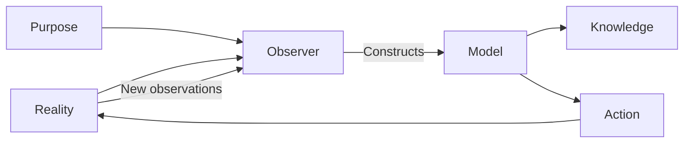

The essential message:

* models are **constructed**, not discovered;
* the observer has intentions;
* knowledge is judged by usefulness rather than absolute truth;
* action changes reality, producing new observations.

This recursive loop appears throughout the book.

## 2. The Modeling Cycle

Le Moigne insists that modeling is iterative.

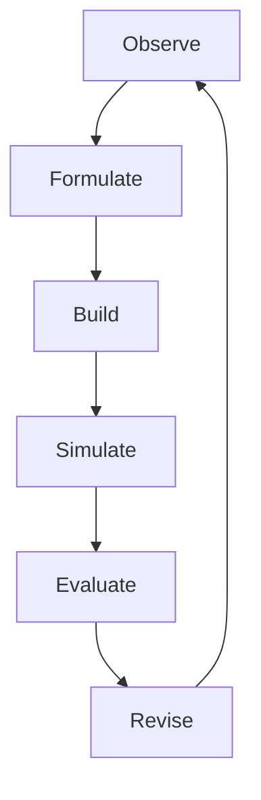

Unlike classical science:

> observation → theory → conclusion

Le Moigne proposes

> observation → model → action → revision → observation...

Knowledge never reaches a final stable state.

## 3. Analysis versus Systemic Thinking

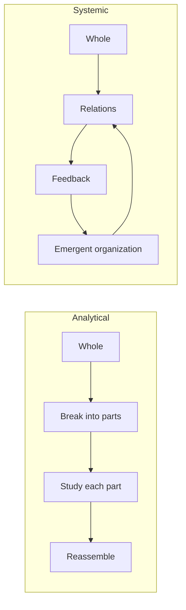

Analytical thinking asks

> What are the pieces?

Systemic thinking asks

> How do they organize themselves?

## 4. A Complex System

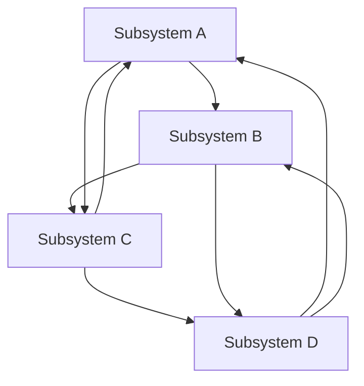

Notice there is no privileged direction.

Every component influences several others.

Complexity comes from interaction, not from the number of parts.

## 5. Hierarchical Organization

Inspired by Herbert Simon.

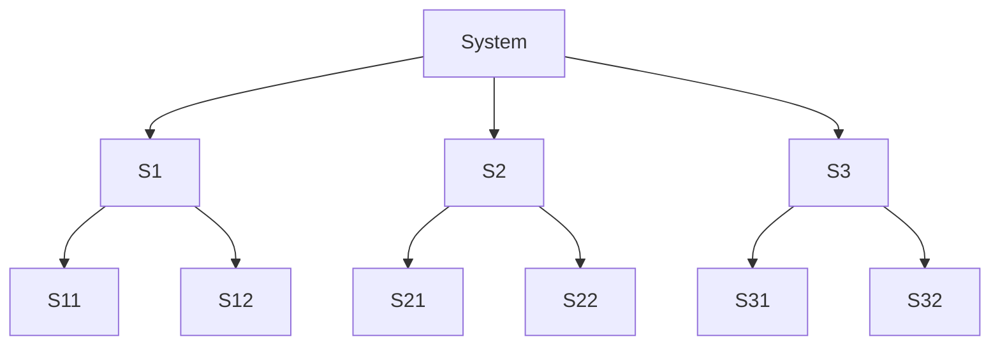

Each subsystem is itself another system.

This recursive decomposition continues indefinitely.

## 6. Function Rather Than Substance

Le Moigne repeatedly argues that systems should be described by what they *do*.

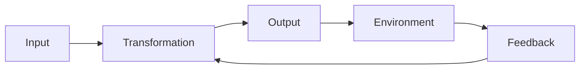

The internal implementation may change completely while the function remains identical.

This idea strongly anticipates modern software engineering.

## 7. Decision Inside the System

Unlike many engineering models, Le Moigne embeds decision-making inside the system.

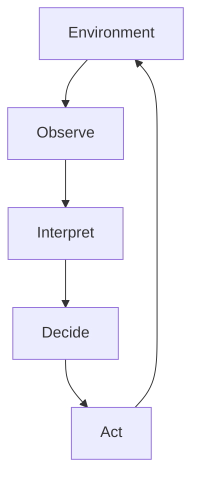

Decision is not external management.

Decision is part of the system itself.

## 8. Information Flow

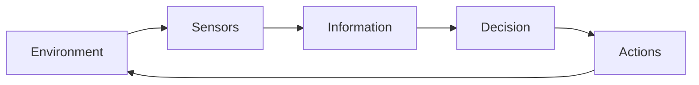

Notice that

* information
* communication
* control

are first-class components.

This reflects cybernetics while remaining compatible with constructivism.

## 9. Multiple Levels of Description

One phenomenon can be modeled at several scales simultaneously.

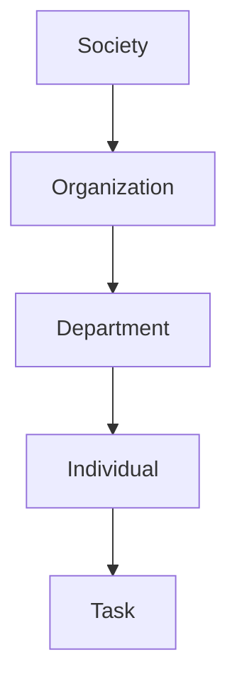

Understanding requires constantly moving upward and downward between abstraction levels.

No single level is "the correct one."

## 10. Organization Produces Emergence

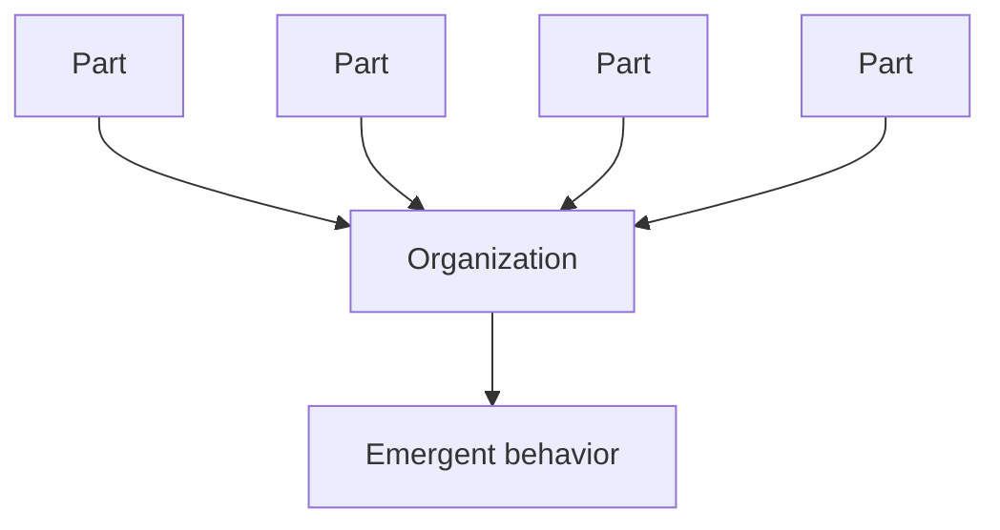

Emergence comes **from organization**, not from the parts themselves.

Changing relationships often changes behavior more than changing components.

This anticipates many of Donella Meadows' leverage points.

## 11. The Recursive Nature of Knowledge

One of Le Moigne's deepest epistemological ideas.

```mermaid
flowchart TD
```

Knowledge

Knowledge --> Model

Model --> Action

Action --> Experience

Experience --> Reflection

Reflection --> Knowledge

Knowledge continuously regenerates itself.

Learning is therefore recursive rather than accumulative.

## 12. The General Architecture of Le Moigne's Theory

This diagram summarizes the entire book.

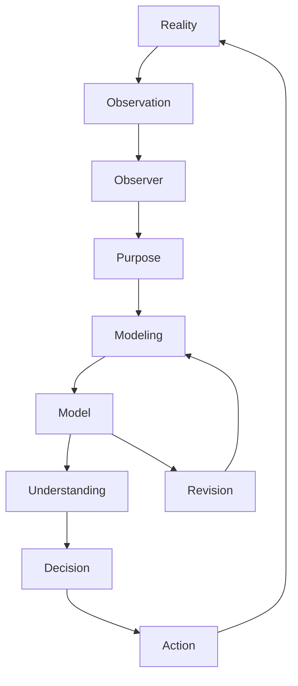

Everything revolves around a continuous cycle:

* observe,
* construct,
* understand,
* decide,
* act,
* learn,
* reconstruct.

There is no final model.

## 13. Relationship with Other Systems Thinkers

This places Le Moigne in the broader intellectual landscape.

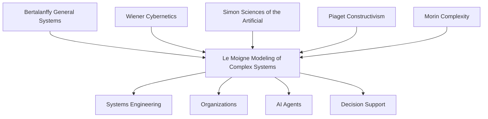

## 14. Connection to Modern AI Agents

This final diagram translates Le Moigne's framework into the architecture of a contemporary autonomous agent.

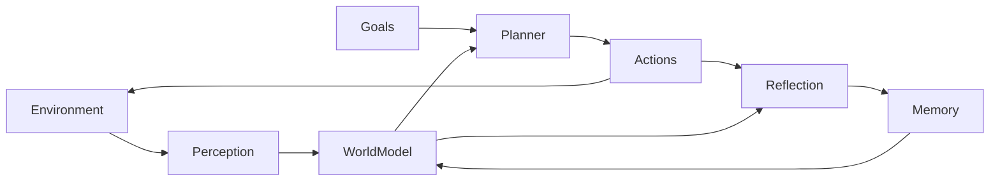

This correspondence is striking:

| Le Moigne | Modern AI agent |
| ----- | ----- |
| Observer | Perception system |
| Model | World model |
| Purpose | Goals |
| Decision | Planner |
| Action | Tool execution |
| Feedback | Observation |
| Revision | Reflection / self-critique |
| Knowledge construction | Long-term memory updates |

Many recent agent architectures (world models, reflective agents, hierarchical planners, memory systems, self-improving loops) can be interpreted as engineering realizations of ideas Le Moigne articulated decades before modern LLM-based agents existed.

**Confidence level:** 0.99
