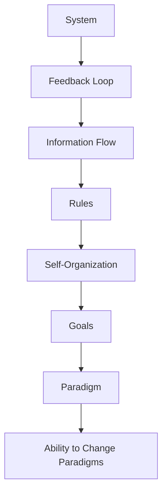
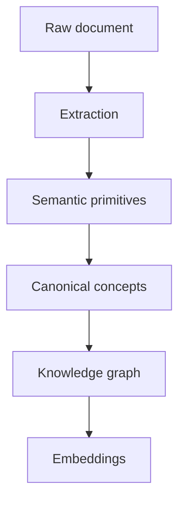
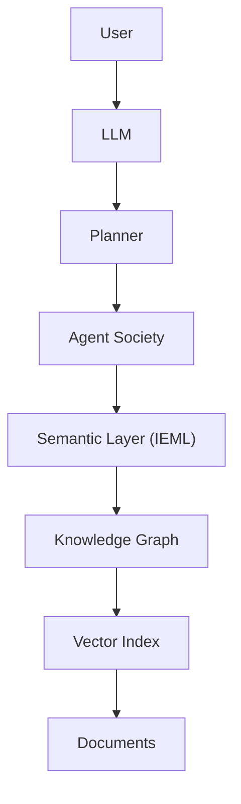

# Reasoning without Probabilistic Inference

## Symbolic and Neural layers

[https://chatgpt.com/share/6a70cfbf-87d0-83e9-af19-3657f2ce97c2](https://chatgpt.com/share/6a70cfbf-87d0-83e9-af19-3657f2ce97c2)

Based on our recent discussions, you were converging toward three ideas:

* a society of specialized agents (Agno, Hermes, Pi, etc.)
* systems thinking inspired by Donella Meadows
* explicit long-term semantic memory rather than purely vector-based retrieval

IEML addresses precisely the weakest part of current agent architectures: explicit semantics.

## Where today's agent frameworks are weak

Today's agent ecosystems generally have:

* LLM reasoning
* vector search
* knowledge graphs
* memories
* workflows
* planning

But almost all of them represent knowledge in one of three ways:

* plain text
* embeddings
* manually-designed ontologies

Each has limitations.

Plain text is expressive but ambiguous.

Embeddings are statistically meaningful but opaque.

Ontologies are precise but expensive to maintain.

IEML attempts to occupy the missing middle ground:

> machine-computable semantics that remain compositional and human-understandable.

## Meadows: IEML becomes the semantic substrate

Donella Meadows spends much of *Thinking in Systems* discussing things like

* stocks
* flows
* delays
* feedback loops
* system goals
* paradigms
* leverage points

Notice that these are semantic primitives.

Current LLM agents merely recognize those words.

An IEML representation could instead encode

```text
System
    contains
        Stock
            produces
                Flow
                    affected_by
                        Delay
                            influences
                                Reinforcing Loop
```

Now these aren't just labels.

They become computable structures.

The agent can reason over them without depending entirely on probabilistic inference.

## Agent memory

This is where I think IEML becomes genuinely valuable.

Imagine replacing

```text
Memory
-------
"User likes Donella Meadows."
```

with

User

Interest :
Systems Thinking

Author :
Donella Meadows

Topic :
Leverage Points
Relationship

High Confidence

Current systems typically implement this as

* JSON

or

* graph database

or

* embedding

IEML would provide a canonical semantic representation that survives

* languages
* wording
* paraphrases
* ontology evolution

instead of merely storing labels.

## Multi-agent communication

Hermes, Agno and Pi all have agents exchanging messages.

Currently they exchange things like

```text
{
  "goal":"Find papers about systems thinking."
}
```

Imagine instead they exchange semantic objects.

Goal :
Research

Subject :
Systems Thinking

Desired Output :
Scientific Literature

Priority :
High

Now another agent can transform, refine, classify or compare goals without re-parsing English.

This resembles an Abstract Syntax Tree (AST) for meaning rather than for source code.

## Meadows' leverage points become executable

One observation from our earlier discussion was that Meadows' leverage points form almost a hierarchy.

IEML could encode that hierarchy directly.

For example



An agent could then ask

> Which interventions modify only parameters?

or

> Which interventions affect goals?

Those become semantic queries rather than prompt-engineering exercises.

## Long-term organizational memory

This is perhaps the strongest application.

Suppose your research system ingests

* PDFs
* GitHub repos
* books
* conversations
* meeting notes
* source code

Today RAG indexes all of these independently.

IEML suggests another layer.



Notice embeddings become only the retrieval layer.

Meaning exists independently.

This is a much more stable architecture.

## Agent reflection

One capability still missing from nearly every framework is genuine metacognition.

An agent can ask

"What do I know?"

but not

"What concepts are overrepresented?"

or

"What semantic regions have never been explored?"

IEML's semantic sphere makes these questions computational.

The semantic space itself becomes inspectable.

That aligns remarkably well with Lévy's notion of increasing the reflexivity of collective intelligence.

## A possible architecture

Interestingly, I would not use IEML the way Lévy originally envisioned.

Instead I would place it beneath the LLM.



Each layer compensates for the weaknesses of the others.

* LLMs provide flexible reasoning.
* IEML provides explicit semantics.
* Graphs provide relationships.
* Embeddings provide approximate retrieval.
* Documents preserve original evidence.

## One extension Lévy did not have

Lévy was writing before foundation models.

Consequently he expected humans to author IEML directly.

Today that is unnecessary.

Instead:

* humans continue writing natural language;
* LLMs translate it into IEML;
* agents manipulate IEML internally;
* LLMs translate results back into natural language.

The symbolic layer becomes largely invisible.

That removes what was arguably IEML's biggest practical obstacle: manual adoption.

## Relation to your earlier architecture

This is where I think your previous discussions naturally converge.

| Layer | Primary role |
| ----- | ----- |
| LLM | Pattern recognition, generation, analogical reasoning |
| IEML | Canonical semantic representation |
| Knowledge graph (e.g. ArangoDB) | Persistent semantic network |
| Vector index (e.g. Faiss/Qdrant) | Fast approximate retrieval |
| Meadows model | System dynamics and intervention ontology |
| Multi-agent framework (Pi, Hermes, Agno) | Distributed execution and specialization |
| Collective memory | Long-term organizational learning |

This produces a system that neither symbolic AI nor neural AI achieves alone. The symbolic layer provides stability, explicit structure, explainability, and semantic interoperability, while the neural layer contributes flexibility, language understanding, and generalization. Meadows supplies the dynamic systems model that governs how knowledge evolves and where interventions should occur, and the agent framework operationalizes those interventions. Rather than viewing these as competing paradigms, they fit together as complementary layers in a cognitive architecture.

**Confidence level:** 0.97
