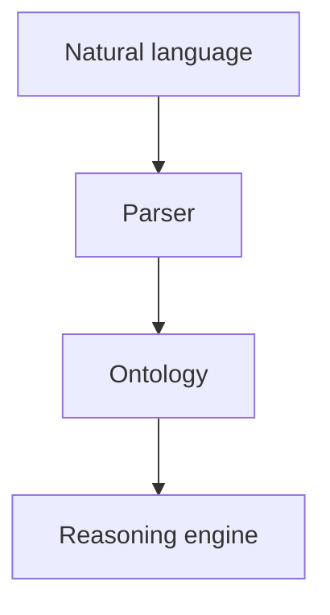
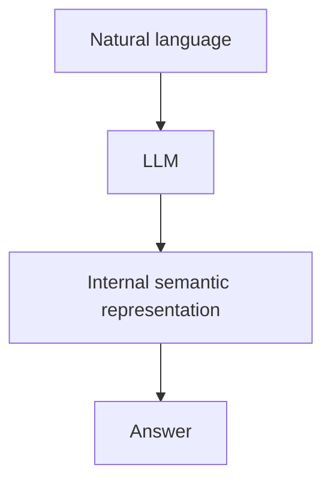
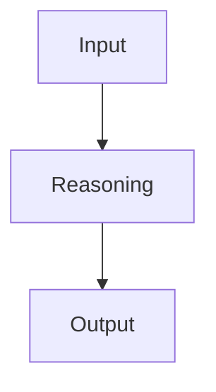
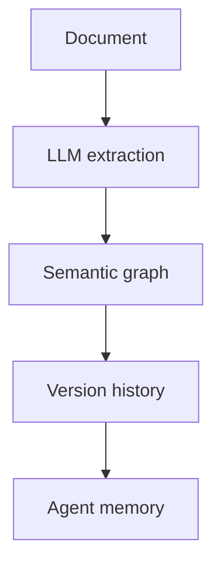
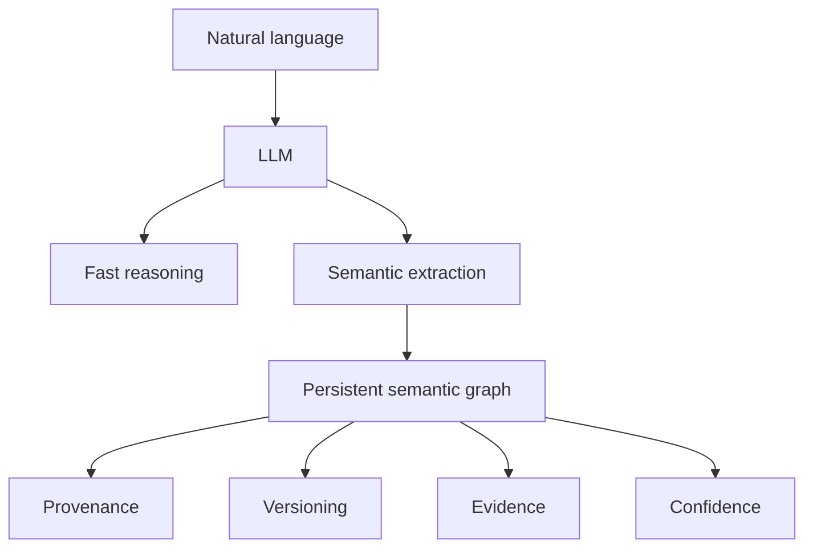
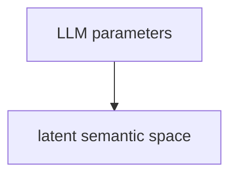
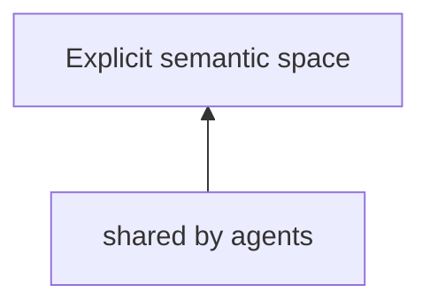

# Would IEML really add tangible value for agents ?

## is it redundant when compared to what LLMs already do in terms of pure formal syntax (of tokens chain) ?

[https://chatgpt.com/share/6a736906-dfd8-83e9-88aa-84e8937c1ccc](https://chatgpt.com/share/6a736906-dfd8-83e9-88aa-84e8937c1ccc)

This is probably the central question. My answer is: **today, mostly redundant for many tasks; potentially transformative for a narrower class of problems.** The distinction depends on *what role* you expect semantics to play.

The key insight is that LLMs already have a kind of "latent IEML."

## The strongest argument against IEML

One of Lévy's original premises was that computers lacked semantics. Around 2010–2013, that was largely true.

The workflow looked like:

The symbolic layer was indispensable because machines could not infer meaning from text.

LLMs changed that.

A transformer already constructs an internal semantic representation. It is not symbolic, but it is rich enough that it can:

* recognize paraphrases
* translate languages
* infer analogies
* classify concepts
* detect contradictions
* generate taxonomies
* map between ontologies

Without any explicit IEML.

This eliminates much of the original motivation.

## But LLM semantics are implicit

The important difference is not "semantic vs syntactic."

It is

**implicit semantics**

versus

**explicit semantics.**

An embedding might encode that

cat ≈ feline ≈ pet

but you cannot directly inspect

* why
* through which intermediate concepts
* according to which ontology
* with what confidence
* under which assumptions

Everything exists inside billions of parameters.

IEML attempts to externalize that representation.

## Think of compilers

Programming languages provide a useful analogy.

When writing

a = b + c

the compiler constructs an AST.

Nobody writes the AST.

Nobody wants to.

But many compiler optimizations operate on it.

Likewise,

already exists.

IEML proposes making something analogous to an AST persistent and inspectable.

That is a fundamentally different purpose.

## Where I think IEML is unnecessary

Many agent tasks simply do not require explicit symbolic semantics.

Examples include:

* summarization
* translation
* coding
* email writing
* brainstorming
* search
* RAG over a few thousand documents

An LLM already performs these remarkably well.

Introducing IEML would mostly add complexity.

## Where I think it becomes valuable

Its advantages grow when the system must maintain knowledge over years rather than minutes.

Imagine an organization with:

* 50 million documents
* thousands of agents
* decades of accumulated knowledge
* multiple languages
* evolving terminology
* changing ontologies
* provenance requirements

Now problems appear that embeddings do not solve cleanly.

For example:

> Is today's concept X equivalent to the concept called Y in our reports from 2016?

or

> Which assumptions were abandoned after a regulatory change?

Those are questions about explicit conceptual evolution.

## Meadows provides a useful criterion

This connects nicely to Meadows' leverage points.

LLMs primarily intervene at the **flow** level.

IEML would intervene at the **information structure** level.

Instead of changing how reasoning occurs, it changes the architecture of the knowledge the reasoning operates upon.

That is a deeper leverage point.

## Monnin strengthens the case

Monnin repeatedly argues that digital objects have persistent identities.

LLMs do not.

A conversation today and a conversation tomorrow produce two unrelated hidden activation trajectories.

There is no persistent semantic object.

If your goal is merely answering questions, this is acceptable.

If your goal is building an evolving epistemic infrastructure, it becomes limiting.

## I would not implement IEML literally

This is where I diverge from Lévy.

I would not ask agents to "think in IEML."

Instead I would let the LLM continue reasoning naturally.

The semantic layer would be generated only when persistence matters.

For example:

The LLM remains the cognitive engine.

The symbolic layer becomes the durable memory.

## A hybrid architecture seems more promising

The architecture I find most compelling now is:

Notice that the symbolic representation is *derived* from the neural one, not a replacement for it.

## One aspect of IEML that may become increasingly important

Ironically, I think the most valuable part of IEML is **not** its language.

It is its insistence that semantics should satisfy properties like:

* compositionality
* computability
* canonical representation
* invertibility where possible
* stable identifiers
* semantic interoperability

Those principles remain highly relevant even if IEML itself is never adopted.

Modern agent systems increasingly need explicit representations that survive model upgrades, prompt changes, and evolving terminology. Whether those representations are encoded in IEML, RDF, property graphs, typed semantic IRs, or another formalism is arguably a secondary engineering decision. Lévy's lasting contribution may be less the specific language he designed than the architectural principle that semantic structure should be a first-class computational artifact rather than an implicit byproduct of a model's internal state.

**Confidence level:** 0.97

## So IEML is like a compass ?

Yes. I think "compass" is actually a better intuition than "language."

Lévy often presents IEML as a language because that is its formal manifestation. But conceptually, it behaves more like a **semantic coordinate system**.

A useful analogy is the evolution of maps.

### Natural language is giving directions

Someone tells you:

> "Go past the church, then turn left after the large tree."

It works, but it is contextual, ambiguous, and difficult to combine with other people's directions.

This is roughly how LLMs operate. They are extraordinarily good at navigating this implicit space.

### GPS provides coordinates

Instead, you can say:

> 48.85826, 2.29450

Now everyone refers to the exact same location, regardless of language.

The coordinate system does not replace human descriptions.

It anchors them.

IEML aims to do something analogous for concepts.

### The compass analogy

A compass does not tell you where to go.

It gives you a stable orientation.

Likewise, IEML does not perform reasoning.

It gives reasoning a stable semantic frame of reference.

An LLM may produce:

> "This paper is about resilience."

The question then becomes:

* Which notion of resilience?
* Related to ecology?
* Cybernetics?
* Organizational theory?
* Systems engineering?
* Does it overlap with robustness?
* Does it contradict antifragility?

A semantic coordinate system gives those concepts persistent positions relative to one another.

### LLMs already have an internal compass

This is the important nuance.

A modern LLM already possesses something that behaves like a semantic map.

When prompted with:

> "Donella Meadows"

it activates nearby concepts:

* systems
* feedback
* leverage points
* resilience
* limits to growth

When prompted with:

> "Pierre Lévy"

another neighborhood activates.

The difference is that this map is:

* distributed
* implicit
* inaccessible
* model-dependent

You cannot inspect it directly.

### IEML externalizes the map

Rather than relying on a model's internal geometry, IEML tries to build an explicit one.

Instead of:

you have:

Multiple agents—even using different LLMs—could orient themselves using the same semantic reference.

That is analogous to different GPS manufacturers all using the same latitude and longitude.

### This also explains Monnin's connection

Monnin asks:

> What is the identity of a Web object?

Lévy asks:

> Where does that object live in semantic space?

Meadows asks:

> How does it move through that space over time?

Those are complementary questions.

### One extension I think is missing

If I were extending Lévy's framework today, I would add a second axis beyond semantics: **epistemic state**.

A concept would not only have a semantic position, but also metadata such as:

* confidence
* provenance
* temporal validity
* supporting evidence
* competing interpretations
* uncertainty

Then the "compass" becomes closer to a **nautical chart**.

It does not merely tell you where concepts are; it also indicates which regions are well surveyed, disputed, recently changed, or poorly understood.

That strikes me as particularly valuable for long-lived agent societies. Rather than asking only "Where is this idea in semantic space?", they could also ask "How reliable is our current position, and what evidence supports it?" That moves the representation from a map of meaning toward a map of knowledge.

**Confidence level:** 0.99
